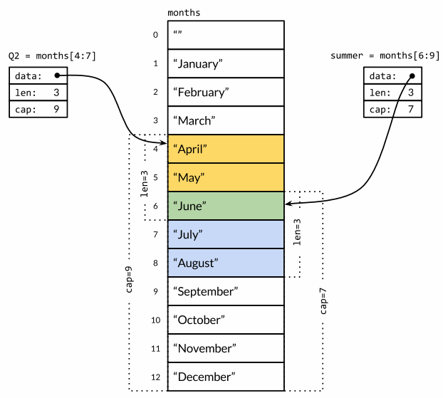
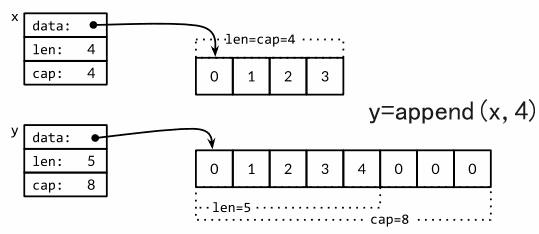

# Go语言基础

> 未完成：
> - [ ] 方法部分，差New()、组合
> - [ ] 代码组织管理部分，未全
> - [ ] 接口
> - [ ] 反射
> - [ ] 泛型
> - [ ] 文件操作

## 一、安装

### Linux

```Shell
wget https://golang.google.cn/dl/go1.21.3.linux-amd64.tar.gz
# 删除旧的go版本
sudo rm -rf /usr/local/go
# 解压
sudo tar -C /usr/local -xzf go1.21.3.linux-amd64.tar.gz
# 配置PATH环境变量
export PATH=$PATH:/usr/local/go/bin
# 查看go的版本
go version
# 配置国内镜像源
go env -w GOPROXY=https://goproxy.cn,direct
go env -w GO111MODULE=on
```

### Windows

1. 官网下载 `go1.21.3.windows-amd64.msi` 安装包。
2. 选择安装目录安装即可，最后命令行执行 `go version` 查看是否安装成功。如果没有配置环境变量需要手动配置。

## 二、基础

### 第一段程序

1.新建文件夹并进入，执行 `go mod init example/hello` ，生成了 `go.mod` 文件，该文件是用来跟踪包模块的。

2.写入如下代码：

```go
package main
import "fmt"
import "rsc.io/quote/v4"

func main() {
    // 这是我的第一个简单的程序
    fmt.Println(quote.Go())
}
```

通过在 [https://pkg.go.dev/](https://pkg.go.dev/) 中查找到 `rsc.io/quote/v4` 包，可以看到该包的相关变量及函数。

3.执行 `go mod tidy` ，添加相关模块，并生成 `go.sum` 文件。

4.执行 `go run .` 运行代码。

从上面代码可知，Go 语言基础组成：

- 包声明
- 引入包
- 函数
- 变量
- 语句 & 表达式
- 注释

### 基础语法

1.行分隔符

一行代表一个语句结束，不需要分号 `;` 结尾，这些工作都将由 Go 编译器自动完成。

如果打算多个语句写在同一行，则必须用 `;` 人为区分，实际开发中不鼓励这样做。

2.注释，只有经典两种

```go
// 单行注释
/*多行注释
 */
```

3.字符串连接

可以通过 `+` 实现：

```go
fmt.Println("Google" + "Runoob")
```

4.格式化字符串

- `fmt.Sprintf`：根据格式化参数生成并返回该字符串。

- `fmt.Printf`：根据格式化参数生成并写入标准输出。

```go
package main

import "fmt"

func main() {
	var code = 123
	var endDate = "2023-11-01"
	var targetUrl = fmt.Sprintf("Code=%d&endDate=%s", code, endDate)
	fmt.Println(targetUrl)
}
```

### 变量声明

1.指定变量类型，如果没有初始化就默认为零值。

- 布尔类型：false
- 数字类型：0
- 字符串类型：""
- 其他类型：一般是 `nil` ，也有特殊情况

2.根据值自行判断变量类型

```go
// bool类型
var d = true
```

3.如果变量已经用 `var` 声明过了，那么再使用 `:=` 声明变量会产生编译错误。

```go
func main() {
	var num int
	// num := 1
	num = 1
	fmt.Println(num)
}
```

可以将 `var num int = 1` 简写为 `num := 1`。

4.多变量声明

```go
// 多个变量相同类型
var num1, num2, num3 int32 = 1, 2, 3
// 多个变量不同类型
var code, isEmpty = 200, true
code isEmpty := 200, true
```

:::danger

注意：`:=` 操作符是初始化时候用的，不能用于变量赋值。

:::

### 常量

使用 `const` 关键字来定义常量。

1.基本用法

```go
const LENGTH int = 10
```

2.定义枚举

```go
const (
    Unknown = 0
    Female = 1
    Male = 2
)
```

3.`iota` 

可以认作是编译器可修改的常量，`const` 中每新增一行常量声明将使 `iota` 计数一次

```go
const (
	i = 10 + iota
	j 
	k
	l
)
fmt.Println(i,j,k,l)  // 10 11 12 13
```

以上代码中 `j` 也为 `10 + iota` ，但此时 `iota` 值为 1 了，所以得到 `j` 的值为 11，以此类推。

4.无类型常量

虽然常量可以有任意一个确定的基本类型，但许多常量并没有明确的基础类型，编译器为其提供比基础类型更高精度的算术运算。

比如 `ZiB` 和 `YiB` 的值已经超过任何 Go 语言中整数类型能表达的范围，但它们依然是合法是常量。

```go
fmt.Println(YiB/ZiB)
```

### 运算符

- 算数运算符：`+`、`-`、`*`、`/`、`%`、`++`、`--`
    - 注意没有`**`
- 关系运算符：和其他高级语言一样
- 逻辑运算符：和其他高级语言一样
- 位运算符：和其他高级语言一样
- 赋值运算符：和其他高级语言一样
- 其他运算符
    - `&`：返回变量存储地址
    - `*`：指针变量

### 条件与循环

#### 条件

1.`if…else if…else`

```go
if num < 0 {
	// ...
} else if num < 10 {
	// ...
} else {
	// ...
}
```

2.`switch`

和其他语言不同，默认是携带 `break` 的，所以就不用写了，如果像强制执行后面的 `case` 语句，需要使用 `fallthrough` 关键字。

Type Switch用法：

```go
func main() {
   var x interface{}
     
   switch i := x.(type) {
      case nil:  
         fmt.Printf(" x 的类型 :%T",i)                
      case int:  
         fmt.Printf("x 是 int 型")                      
      case float64:
         fmt.Printf("x 是 float64 型")          
      case func(int) float64:
         fmt.Printf("x 是 func(int) 型")                      
      case bool, string:
         fmt.Printf("x 是 bool 或 string 型" )      
      default:
         fmt.Printf("未知型")    
   }
}
```

3.`select`

> 通道的使用见后续吧。

```go
func main()  {
    c1 := make(chan string)
    c2 := make(chan string)

    go func() {
        c1 <- "one"
    }()
    go func() {
        c2 <- "two"
    }()

    for i := 0; i < 10; i++ {
        select {
        case msg1 := <-c1:
            fmt.Println("received", msg1)
        case msg2 := <-c2:
            fmt.Println("received", msg2)
		default:
			// 如果两个通道都没有可用的数据，则执行这里的语句
			fmt.Println("no message received")
		}
    }
}
```

#### 循环

Go语言中只有 `for` 循环，没有 `while` 和 `forEach` 这些。

```go
// 标准for循环
for i:=0; i < 10; i++ {
	fmt.Println(i)
}

// 这种for等同于其他语言的while
count := 0
for count < 10 {
	fmt.Println(count)
	count++
}

// for…range，迭代获取key和value值，可以用于数组、Map等
strings := []string{"Google", "Baidu"}
for key, val :=range strings {
	fmt.Println(key, val)
}
```

## 三、数据类型

### 数据类型汇总

1.布尔类型

2.数字类型

- 基于架构的类型
    - uint8、uint16、uint32、uint64：无符号整型
    - int8、int16、int32、int64：有符号整型
- 浮点型
    - float32、float64：IEEE-754 浮点型数
    - complex64、complex128：实数和虚数
- 其他数字类型
    - byte：和uint8等价
    - rune：和int32等价
    - uint
    - int
    - uintptr

3.字符串类型

4.派生类型

- 指针类型（Pointer）
- 数组类型
- 结构化类型(struct)
- Channel 类型
- 函数类型
- 切片类型
- 接口类型（interface）
- Map 类型

### 基础数据类型

#### 整型

Go 语言同时提供了有符号和无符号的整数类型，有8、16、32、64位长度。

Unicode 字符 `rune` 类型是和 `int32` 等价的类型，通常用于表示一个 Unicode 码点，这两个名称可以互换使用。同理 `byte` 和 `uint8` 等价。

即使 Go 提供了无符号数的运算，但还是建议在绝大数情况下使用有符号数，比如下面代码，如果 `len()` 返回值是无符号数，那么 `i` 的值最终会变成 `unit` 类型最大值（可能是 `2e63 - 1`），然后将会发生异常：

```go
medals := []string{"gold", "silver", "bronze"}
for i := len(medals) - 1; i >= 0; i-- {
    fmt.Println(medals[i]) // "bronze", "silver", "gold"
}
```

正是这个原因，无符号数往往在位运算或其他特殊场景时候才使用。

类型不匹配问题，比如 `int32` 和 `int16` 直接加和计算，则会报错，但可以将它们显式转型为常见类型：

```go
var apples int32 = 1
var oranges int16 = 2
// 显式转型
var compote = int(apples) + int(oranges)
```

#### 浮点型

Go 提供了两种精度的浮点数 `float32` 和 `float64`，`float32` 能精确表示的正整数并不是很大，通常应优先使用 `float64`。

浮点数字面量表示：

```go
const e = 2.71828
const Avogadro = 6.02214129e23  // 阿伏伽德罗常数
```

在 `math` 包中提供了特殊值的创建和测试：

- `+Inf`：正无穷大
- `-Inf`：负无穷大
- `NaN`：非数

`math.IsNaN()` 用于测试一个数是否为 `NaN`，`NaN` 和任何数不相等，包括它自己。

#### 复数

Go 语言提供了两种精度的复数类型：`complex64` 和 `complex128`，分别对应 `float32` 和 `float64` 两种浮点数精度。

`complex` 函数用于构建复数，`real` 和 `imag` 函数分别返回复数的实部和虚部。

如果整数或浮点数后跟着 `i` ，那么它将构成复数的虚部。

```go
var x complex128 = complex(1, 2) // 1+2i
var y complex128 = complex(3, 4) // 3+4i
fmt.Println(x*y)                 // "(-5+10i)"
fmt.Println(real(x*y))           // "-5"
fmt.Println(imag(x*y))           // "10"
x := 1 + 2i
y := 3 + 4i
```

Go语言提供了两种精度的复数类型：`complex64` 和 `complex128`，分别对应 `float32` 和 `float64` 两种浮点数精度。

#### 布尔型

`&&` 和 `||` 的短路行为，如果运算符左边值已经可以确定整个布尔表达式的值，那么运算符右边的值将不再被求值，因此下面的语句是正确的：

```go
s != "" && s[0] == 'x'
```

和静态语言不同，布尔值并不会隐式转换为数字值0或1，反之亦然。

#### 字符串

**字符串是不可改变的字节序列**，文本字符串通常被解释为采用 `UTF8` 编码的 `Unicode` 码点（rune）序列。

内置的 `len()` 函数可以返回一个字符串中的字节数目，**注意不是 rune 字符个数。**

```go
func main()  {
	str:= "Hello"
	fmt.Println(len(str))  // 5
	str2:= "你好"
	fmt.Println(len(str2))  // 6
    fmt.Println(str[1:4])  // ell
}
```

访问超出字符串索引范围的字节将报错。

可以通过 `s[i:j]` 来截取字符串生成子串，包含 `[i, j)` 索引区间内的。可以通过 `+` 操作符可以将多个字符串连接

转义字符：

```Plain Text
\a      响铃
\b      退格
\f      换页
\n      换行
\r      回车
\t      制表符
\v      垂直制表符
\'      单引号（只用在 '\'' 形式的rune符号面值中）
\"      双引号（只用在 "..." 形式的字符串面值中）
\\      反斜杠
```

可以使用 ```` 表示原生的字符串面值，没有转义操作，全部都是字母意思，包括换行和退格，可以多行。

`UTF8` 是一个将 `Unicode` 码点编码为字节序列的变长编码，现在已经是 `Unicode` 的标准。`UTF8` 编码使用1到4个字节来表示每个 `Unicode` 码点，`ASCII` 部分字符只使用1个字节，常用字符部分使用2或3个字节表示。如果第一个字节的高端 bit 为 0，则表示对应 7bit 的 `ASCII` 字符，`ASCII` 字符每个字符依然是一个字节，和传统的 `ASCII` 编码兼容。如果第一个字节的高端 bit 是 110，则说明需要 2 个字节；后续的每个高端 bit 都以 10 开头。Go语言的源文件采用 `UTF8` 编码。 

```Plain Text
0xxxxxxx                             runes 0-127    (ASCII)
110xxxxx 10xxxxxx                    128-2047       (values <128 unused)
1110xxxx 10xxxxxx 10xxxxxx           2048-65535     (values <2048 unused)
11110xxx 10xxxxxx 10xxxxxx 10xxxxxx  65536-0x10ffff (other values unused)
```

有些字符很难输入，Go 支持通过编码方式输入，下面这些字符串都是等价的：

```Plain Text
"世界"
"\xe4\xb8\x96\xe7\x95\x8c"
"\u4e16\u754c"
"\U00004e16\U0000754c"
```

得益于 `UTF8` 编码优良的设计，诸多字符串操作都不需要解码操作。我们可以不用解码直接测试一个字符串是否是另一个字符串的前缀：

```Plain Text
"世界"
"\xe4\xb8\x96\xe7\x95\x8c"
"\u4e16\u754c"
"\U00004e16\U0000754c"
```

使用 `len()` 函数获取的是字符串字节数，如果是中文就不等于字符串长度了，想要准确获取长度需要使用 `unicode/utf8` 包中的 `utf8.RuneCountInString(s)` 。

解码有两种方式：

1.使用 `utf8.DecodeRuneInString(s)` 对字符串解码：

```go
func main()  {
	str := "Hello, 世界! 你好！"
	for i := 0; i < len(str); {
		r, s := utf8.DecodeRuneInString(str[i:])
		fmt.Printf("%c\n", r)
		fmt.Println(r, s)
		i += s
	}
}
```

2.使用 `for…range` 结构，隐式解码：

```go
func main()  {
	str := "Hello, 世界! 你好！"
	for i, r := range str {
		fmt.Printf("%d\t%q\t%d\n", i, r, r)
	}
}
```

### 数组

定义数组：

```go
// 定义长度为3的数组并给定初始值
var arr1 [3]int = [3]int{1, 2}
// 定义数组，数组长度根据初始值个数来计算
arr2 := [...]int{1, 2, 3, 4}
// 定义一个含有100个元素的数组，最后一个元素被初始化为-1，其它元素都初始化为0
arr3 := [...]int{99: -1}
```

定义带索引的数组：

```go
type Currency int
const (
	USD Currency = 10 + iota // 美元
	EUR                      // 欧元
	GBP                      // 英镑
	RMB                      // 人民币
)
symbol := [...]string{USD: "$", EUR: "€", GBP: "￡", RMB: "￥"}
fmt.Println(symbol, len(symbol))	// [          $ € ￡ ￥] 14
```

:::danger

注意：

1.数组长度必须是常量表达式，因为数组长度需要在编译阶段确定。

2.`[2]int` 和 `[3]int` 是两种不同类型，是不能比较的！

```go
a := [2]int{1, 2}
b := [...]int{1, 2}
c := [2]int{1, 3}
fmt.Println(a == b, a == c, b == c) // true false false
d := [3]int{1, 2}
fmt.Println(a == d) // compile error: cannot compare [2]int == [3]int
```

:::

在调用函数时，函数每个调用参数都会被赋值给函数内部的参数变量，所以函数参数接收的是一个复制的副本，而不是原始调用的变量。在这个方面，Go 对待数组方式和其他编程语言不同，Java、JavaScript这些的都是将数组作为引用或指针对象传入被调用的函数，它的机制与 C 语言最近似。

想要传递索引，可以显示传入数组指针：

```go
func zero(ptr *[32]byte) {
    for i:= range ptr {
        prt[i] = 0
    }
}
```

### Slice（切片） 

#### 构成

`Slice` 由三部分组成：

- 指针：指向第一个 `Slice` 元素对应的底层数组元素的地址
- 长度：`Slice` 中元素的数目，可以通过 `len()` 获取
- 容量：从 `Slice` 的开始位置到结束位置，可以通过 `cap()` 获取

定义切片：

```go
var s []int
// 定义长度为len，容量为cap的切片
var s = make([]int, len, cap)
```

多个 `Slice` 之间可以共享底层的数据，并且引用的数组部分区间可能重叠。



```go
func main() {
    months := [...]string{"", "January", "February", "March", "April", "May", "June", "July", "August", "September", "October", "November", "December"}
    Q2 := months[4:13]
    summer := months[6:9]
    fmt.Println(Q2, len(Q2), cap(Q2))  // ["April", "May", "June"] 3 9
    fmt.Println(summer, len(summer), cap(summer))  // ["June", "July", "August"] 3 7
    endlessSummer := summer[1:3]
    fmt.Println(endlessSummer, len(endlessSummer), cap(endlessSummer))  // ["July", "August"] 2 6
}
```

切片操作不能超出 `cap(s)` ，但能超出 `len(s)` 。上面代码中 summer 是针对 months `[6:9]` 的切片，此时summer 的 `len()` 为 3，但 `cap()` 为 7；endlessSummer 是针对 summer  `[1:3]` 的切片，因此切片最大为 7，起始坐标就是 summer 的起始坐标。

切片后的数据底层都是共享之前的底层数组，因此这种操作都是常量时间复杂度。

`Slice` 是不支持比较运算符，有两个原因：

1. `Slice` 元素是间接引用的，甚至可以引用自身
2. 固定的 `Slice` 在不同时刻可能会有不同的元素，因为底层数组的元素可能会被修改

因此安全的做法是直接禁止 `Slice` 之间的比较操作，只允许它和 `nil` 比较。

```go
if summer == nil { /* ... */ }
```

看下面代码：

```go
var s []int
s = nil
s = []int(nil)
s = []int{}
```

问题一：为啥的是定义切片，而不是数组？

因为在语法定义中 `[]int` 表示的是一个整形的切片类型，如果要声明数组，应该指定固定长度，如 `var s [10]int`。

问题二：后三行有啥区别？

- `s = nil` 表示将切片设置为 `nil`，表示是空的切片，这个切片没有引用任何底层数组，长度和容量都是 0。
- `s = []int(nil)` 同样表示将切片设置为 `nil`，只是这里使用了类型转换来明确指出切片类型是 `[]int`，实际效果和 `s = nil` 相同。
- `s = []int{}` 表示初始为没有元素的切片，实际是引用了底层数组的，但数组为空，所以长度和容量都是 0。

**因此判断切片是否为空，不能通过比较 `nil` 来判断，可以通过 `len(s)==0` 来判断。除了和 `nil` 相等比较外，一个 `nil` 值的 `Slice` 的行为和其它任意0长度的 `Slice` 一样，`reverse(nil)` 是安全的。**

#### 常用函数

##### append()

append函数用于向 `Slice` 追加元素，该函数会自动扩容，扩容为原先容量的 2 倍，即 `cap(slice) * 2`。

```go
func main() {
    // 定义数组
    var numbers [4]int = [4]int{1,2,3,4}
    fmt.Println(numbers)
    // 定义针对数组的切片
    var slice []int = numbers[:]
    fmt.Println(slice, len(slice), cap(slice))
    slice = append(slice, 5)
    // 放入新元素后发现切片容量变为了8
    fmt.Println(slice, len(slice), cap(slice))
}

/*
[1 2 3 4]
[1 2 3 4] 4 4
[1 2 3 4 5] 5 8
*/
```



##### copy()

copy 函数用于拷贝切片内容。注意只拷贝切片内容，如果被拷贝切片容量小于要拷贝的，多余内容就舍弃掉。

```go
func main() {
    // 定义数组
    var numbers [4]int = [4]int{1,2,3,4}
    var slice []int = numbers[:]
    fmt.Println(slice, len(slice), cap(slice))
    var slice2 []int = make([]int, 2, 2)
    copy(slice2, slice)
    fmt.Println(slice2, len(slice2), cap(slice2))
}

/*
[1 2 3 4] 4 4
[1 2] 2 2
*/
```

### Map

定义Map：

```go
// 使用字面量创建Map
var myMap map[string]int = map[string]int{
    "apple": 1,
    "banana": 2,
    "orange": 3,
}
// 创建初始容量为10的map
var myMap map[string]int = make(map[string]int, 10)
```

基本操作：

```go
// 添加或修改元素
myMap["apple"] = 5
myMap["grape"] = 100
// 获取元素，获取不到则为零值, false
var val, ok = myMap["apple"]
// 获取Map长度
var len = len(myMap)
// 删除元素
delete(myMap, "orange")
// 迭代遍历Map
for k, v := range myMap {
    fmt.Printf("key=%s, value=%d\n", k, v)
}
```

Map 的迭代顺序是不确定的，这是故意设计的，因此如果想按照 key 显式排序，那么需要按照如下处理：

```go
func main() {
    var myMap map[string]int = map[string]int{
        "apple": 1,
        "banana": 2,
        "orange": 3,
    }
    var keys []string = make([]string, 0, len(myMap))
    for k := range myMap {
        keys = append(keys, k)
    }
    sort.Strings(keys)
    for _, k := range keys {
        fmt.Println(k, myMap[k])
    }
}
```

Go 没有提供集合类型，但 Map 的 key 是唯一的，可以间接实现。

```go
type Set map[string]bool
func main() {
    mySet := make(Set)
    // 添加集合元素
    mySet["Alice"] = true
    fmt.Println(mySet)
}
```

### 结构体

#### 结构体基本使用

包括：

- 结构体定义
- 结构体属性访问
- 结构体中是否含匿名字段
- 结构体中使用结构体

```go
// 定义结构体
type Person struct {
    name string
    age int
}
type Address struct {
    city, area string
}
type Student struct {
    // 结构体中的匿名字段
    Person
    speciality string
    // 结构体嵌套
    address Address
}
func main() {
    // 初始化结构体
    person := Person{ "Alice", 25 }
    address := Address{ city: "上海市", area: "普陀区" }
    // 初始化带有匿名字段的结构体
    std := Student{
        Person: Person{ name: "Zhengyu", age: 24 },
        speciality: "软件工程",
        address: address,
    }
    fmt.Println(person, std)
    // 访问值，注意访问匿名字段属性值
    fmt.Println(std.Person.name, std.speciality, std.address.city)
}
```

#### 结构体比较

结构体是值类型，是可以比较的，如果它们对应的字段相等，则认为两个结构体变量相等。

:::danger

只有相同类型的结构体才能比较，**如果是两个不同的结构体，是不能比较的。**

:::

```go
type name struct {  
    firstName string
    lastName string
}
func main() {  
	name1 := name{"Steve", "Jobs"}
	name2 := name{"Steve", "Jobs"}
	fmt.Println(name1 == name2) // true
	name2.lastName = "Zhengyu"
	fmt.Println(name1 == name2) // false
}
```

### 指针

#### 定义

和 C 语言中类似。

nil：空指针，指代零值。

:::danger

注意：定义指针不能使用 `:=` 方式，必须通过 `var` 定义并指定好类型。

:::

```go
func main() {
    a := 10
    var p *int = &a
    fmt.Println(*p)  // 10
}
```

#### 数组的指针

对于二维数组，注意对不同层的指针：

```go
func main() {
    arr := [2][3]int{
        {1,2,3},
        {4,5,6},
    }
    var p1 *[2][3]int = &arr
    var p2 *[3]int = &arr[1]
    var p3 *int = &arr[1][1]
    fmt.Println(*p1)
    fmt.Println(*p2)
    fmt.Println(*p3)
}

/*
[[1 2 3] [4 5 6]]
[4 5 6]
5
*/
```

#### 指向指针的指针

```go
func main() {
    a := 3000
    var ptr *int = &a
    var pptr **int = &ptr
    fmt.Printf("变量 a = %d\n", a )
    fmt.Printf("指针变量 *ptr = %d\n", *ptr )
    fmt.Printf("指向指针的指针变量 **pptr = %d\n", **pptr)
}
```

#### 结构体的指针

定义的指针变量可以存储结构体变量的地址。

```go
type Student struct {
    name    string
    age     int
    class   string
}

func main() {
    student := Student{
        name: "Alice",
        age: 20,
        class: "2班",
    }
    var p *Student = &student
    fmt.Println(p.name, (*p).name)  // Alice Alice
}
```

## 四、函数

### 函数定义、函数签名、函数值

函数声明的定义：

```go
// 和func hypot(x float64, y float64) float64等价
func hypot(x, y float64) float64 {
    return math.Sqrt(x*x + y*y)
}
```

判断两个函数的函数签名是否相同：形式参数列表和返回值列表中的变量类型一一对应。

比如下面的两个函数，他俩的函数签名是相同的，但函数定义是不同的。

```go
func add(x int, y int) int { return x + y }
func sub(x int, y int) int { return x - y }
```

在函数体中，**函数的形参作为局部变量**，被初始化为调用者提供的值。**函数的形参和有名返回值作为函数最外层的局部变量，被存储在相同的词法块中。**实参通过值的方式传递，因此函数的形参是实参的拷贝，对形参进行修改不会影响实参。但是，**如果实参包括引用类型，如指针，slice(切片)、map、function、channel等类型，实参可能会由于函数的间接引用被修改。**

Go 语言支持多返回值：

```go
func calc(x int, y int) (int, int) { return x + y, x - y }
// 裸返回值，z是有名返回值，也是定义的局部变量
func calc2(x int, y int) (z int, err error) {
    z = x + y
    return
}
func main() {
    fmt.Println(calc(2,4))  // 6 -2
    fmt.Println(calc2(2,4))  // 6 <nil>
}
```

在 Go 语言中，函数也是值，空值为 `nil` ，函数可以作为值传入到其他函数中。

可变参数的使用和在 Javascript 中类似，主要有两处：

- 函数形参：接收多个参数，得到的 vals 为切片类型
- 函数传参：接收并展开切片类型为多个参数

```go
func sum(vals ...int) int {
    total := 0
    for _, val := range vals {
        total += val
    }
    return total
}

func main() {
    values := []int{1,2,3,4}
    fmt.Println(sum(values...))
}
```

### 匿名函数和闭包

下面定义了一个匿名函数，将它作为值传入到 `strings.Map()` 函数中：

```go
strings.Map(func(r rune) rune { return r + 1 }, "HAL-9000")
```

闭包：

`squares()` 返回后，变量 `x` 仍然隐式的存在于 f 中。

```go
// squares返回一个匿名函数
// 该匿名函数每次被调用时都会返回下一个数的平方
func squares() func() int {
    var x int
    return func() int {
        x++
        return x * x
    }
}
func main() {
    f := squares()
    fmt.Println(f()) // "1"
    fmt.Println(f()) // "4"
    fmt.Println(f()) // "9"
    fmt.Println(f()) // "16"
}
```

函数，包括匿名函数，都是可以作为参数传给其他函数的，匿名函数可以赋值给变量：

```go
func main() {
    // 定义匿名函数，并赋值给add
    add := func(a int, b int) int {
        return a + b
    }
    fmt.Println(add(3, 7))
    // 定义能传入函数的匿名函数，并赋值给calculate
    calculate := func(operation func(int, int) int, x int, y int) int {
        return operation(x, y)
    }
    // 将函数作为其他函数参数
    fmt.Println(calculate(add, 2, 3))
    fmt.Println(calculate(func(a, b int) int { return a - b }, 10, 4))
}
```

闭包陷阱，当在循环中使用闭包时候，注意变量引用问题：

```go
func main() {
    var funcs []func()
    for i := 0; i< 3; i++ {
        i := i      // 由于闭包引用循环变量的问题，这行代码必须有，要创建新变量
        funcs = append(funcs, func() {
            fmt.Println(i)
        })
    }
    for _, f := range funcs {
        f()
    }
}
```



### defer

`defer` 是 Go 语言中的一个关键字，用于延迟执行一个函数，该函数会在所在函数执行完毕后才会被调用，无论函数是否发生错误。`defer` 常用于在函数执行完毕后，做一些清理工作，如关闭文件、释放资源等。`defer` 可以多次调用，它们将按照先进后出的顺序执行。

```go
func main() {
    file, err := os.Open("test.txt")
    if err != nil {
        fmt.Println("Error opening file")
        return
    }
    // defer被用来关闭文件
    defer file.Close()
}
```

### 错误和异常

#### 错误处理基本认识

在 Go 语言中，没有传统编程语言的 `try - catch` 操作，Go 语言中一切错误都需要显式处理，通常，我们**规定函数返回的最后一个数据是错误接口。**

```go
func age(v int)(int, error){
    if v > 10 {
        return 10, nil
    }
    return -1, errors.New("错误，年龄必须大于10岁")
}
```

#### 错误处理策略

1.传播错误

函数中某个子程序的失败，会变成该函数的失败。

比如上面的 `age()` 函数，如果出现错误，那么在调用它的函数中如果不处理就会报错。

2.重新尝试失败的操作

下面是发送 HEAD 请求检查服务器是否可用的函数，在 1 分钟内失败则重新请求，在 1 分钟外失败则报错返回。

```go
func WaitForServer(url string) error {
    const timeout = 1 * time.Minute
    // 设置超时时刻，为当前时间的1分钟后
    deadline := time.Now().Add(timeout)
    // 在超时时间前循环
    for tries := 0; time.Now().Before(deadline); tries++ {
        // 发送HEAD请求来检查服务器是否可用
        _, err := http.Head(url)
        // 如果错误返回空表示成功
        if err == nil {
            return nil
        }
        // 记录服务器未响应的错误信息
        log.Printf("server not responding (%s); retrying…", err)
        // 使用指数退避进行重试
        time.Sleep(time.Second << uint(tries))
    }
    // 在超时时间内仍未得到服务器响应，返回错误信息
    return fmt.Errorf("server %s failed to respond after %s", url, timeout)
}
```

3.输出错误信息并结束程序

这种策略只应在 main 中执行，对库函数而言，应传播错误。

```go
if err := WaitForServer(url); err != nil {
    fmt.Fprintf(os.Stderr, "Site is down: %v\n", err)
    os.Exit(1)
}
```

4.只输出错误信息，不需要中断程序的运行

```go
if err := Ping(); err != nil {
    log.Printf("ping failed: %v; networking disabled",err)
}
```

#### panic 和 recover

`panic` 作用：用于引发一个程序错误并停止当前函数的执行。当程序遇到无法处理的错误或异常情况时，可以调用panic函数来终止程序的执行，并且在 `panic` 时，会立即停止当前函数的执行，并且沿着函数调用栈一直向上传播，直到被recover捕获或者程序终止。

`recover` 作用：从 `panic` 中恢复的函数，返回 `panic` 时的错误值。如果在 `defer` 语句中使用了 `recover` 函数，并且该 `defer` 语句是在发生 `panic` 之前的，则可以捕获到 `panic`，并进行处理。

```go
func doSomething() {
    defer fmt.Println("Deferred from doSomething")
    fmt.Println("Inside doSomething")
    // 故意触发panic
    panic("触发panic异常")
}

func main() {
    defer func() {
        if r := recover(); r != nil {
            fmt.Println("从panic复原:", r)
        }
    }()
    fmt.Println("Starting application")
    doSomething()
    fmt.Println("End of application")
}

/*
Starting application
Inside doSomething
Deferred from doSomething
从panic复原: 触发panic异常
*/
```

## 五、方法

### 方法的基本使用

方法就是一个包含了接受者的函数，接受者可以是命名类型或者结构体类型的一个值或者是一个指针。

```go
type Oval struct {
    a,
    b float64
}
type Circle struct {
    radius float64
}
// 可以定义相同的方法名
func (oval Oval) getArea() float64 {
    return math.Pi * oval.a * oval.b
}
func (circle Circle) getArea() float64 {
    return math.Pi * math.Pow(circle.radius, 2)
}
func main() {
    var oval Oval = Oval{ a: 10, b: 5 }
    var circle Circle = Circle{ radius: 2 }
    fmt.Println("椭圆面积 =", oval.getArea())
    fmt.Println("圆面积 =", circle.getArea())
}
```

当然，也可以传入结构体指针：

两者的区别是传入结构体是原先结构体的副本，传入结构体指针是引用，如果方法内部修改了相关属性，引用的结构体属性也会对应修改。

```go
func (circle *Circle) getArea() float64 {
    // 因为是引用类型，所以引用的外部结构体属性值也会变化
    circle.radius = circle.radius * 10
    return math.Pi * math.Pow(circle.radius, 2)
}
```

既然有了函数，为何还要使用方法？

1. Go 不是一种纯粹的面向对象的编程语言，它不支持类。因此，类型的方法是一种实现类似于类的行为方式。
2. 相同名称的方法可以在不同的类型上定义，而具有相同名称的函数是不允许的。

Go 语言中变量可以在三个地方声明：

- 局部变量：函数内部，作用域只在函数体内，参数和返回值变量也是局部变量。
- 全局变量：函数外部，首字母大写全局变量可以在整个包甚至外部包（被导出后）使用。
- 形式参数：函数中定义，作为函数的局部变量来使用。

### 方法继承和重写

如果匿名字段实现了一个方法，那么包含这个匿名字段的结构体也能调用该方法。

```go
type Human struct {
	name  string
	age   int
	phone string
}
type Employee struct {
	Human   //匿名字段
	company string
}
func (h *Human) SayHi() {
	fmt.Printf("我是%s，你可以打电话 %s 联系我\n", h.name, h.phone)
}
func main() {
	alice := Human{"Alice", 20, "1425698563"}
	alice.SayHi()
    // Employee包含Human匿名字段，也能调用该方法
	zhengyu := Employee{Human{"Zhengyu", 24, "13813819438"}, "友塔游戏"}
	zhengyu.SayHi()
}
```

方法重写：

```go
func (h *Human) SayHi() {
	fmt.Printf("我是%s，你可以打电话 %s 联系我\n", h.name, h.phone)
}
// Employee的方法重写Human的
func (h *Employee) SayHi() {
	fmt.Printf("我是雇员%s，电话%s\n", h.name, h.phone)
}
```

### New()

### 组合替代继承

## 六、代码组织管理

:::tip

模块直接的关系通过 `go.mod` 关联，包之间的关系通过导入导出关联。

:::

### 模块

Go 中的代码组织管理通过仓库、模块、包三个概念完成的：

- 仓库：代码仓库
- 模块：是库或程序的根节点，存放于仓库，可包含多个包
- 包：同一目录下的源码文件，编译后会归到一起

可以通过 `go mod init <module_path>`  来初始化模块，该命令会讲将当前模块初始化为 Go 模块，并生成 `go.mod` 文件。

下面将创建两个模块，并让一个模块调用另外一个：

1.创建 `main` 模块

```bash
mkdir main
cd main
go mod init github.com/zhengyu/main
```

2.创建 `grettings` 模块

```bash
mkdir main
cd main
go mod init github.com/zhengyu/grettings
```

`go.mod` 文件显示为：

```mod
module github.com/zhengyu/greetings

go 1.21.3
```

3.在 `grettings` 模块下创建文件 `grettings.go` 并写入函数

```go
package greetings

func Greetings(name string) string {
	message := "你好，" + name
	return message
}
```

4.在 `main` 模块的 `main.go` 文件下引入 `Greetings` 函数

```go
package main

import (
	"fmt"
	"github.com/zhengyu/greetings"
)

func main() {
	mes := greetings.Greetings("筝语")
	fmt.Println(mes)
}
```

5.由于 `grettings` 模块是本地的，因此需要再执行

```bash
 go mod edit -replace github.com/zhengyu/greetings=../greetings
```

将提到的模块通过 `-replace` 指定到本地模块的位置。

6.执行 `go mod tidy` 清理下依赖，即可正确按照依赖模块，这时候 `main` 模块下的 `go.mod` 文件更新为

```mod
module github.com/zhengyu/main

go 1.21.3

// 将本模块下引入的github.com/zhengyu/greetings路径都换成../greetings
replace github.com/zhengyu/greetings => ../greetings

require github.com/zhengyu/greetings v0.0.0-00010101000000-000000000000
```

### 包

#### 包的基本操作

Go 语言的结构是建立在包（package）基础之上的。

`import` 关键字：导入其他的包，可以是本模块下的包，也可以是其他模块下的包。

使用包的条件：

1. **一个目录下的同级文件归属一个包，同一个包下面的所有文件的包名必须是一样的。**
2. 包名为 `main` 的包为应用程序入口包，其他包不能使用。
3. 包名可以与目录不同名，但建议同名。

引用其他文件函数：

- 同包下：不用导入，可直接使用
- 同模块不同包：需要导入使用
- 不同模块不同包：需要导入使用，同时 `go.mod` 文件需要替换到本地路径

其他注意点：

- **首字母大写被视作 `public` 公共资源，才能被导出。**
- 包可以嵌套定义，对应的就是嵌套目录。

```go
import (
	"fmt"
	"github.com/zhengyu/greetings"
	// 引用greetings模块下的utils包，名字重复了因此起了别名
	greetingsUtils "github.com/zhengyu/greetings/utils"
	// 引用本模块下的utils包
	"github.com/zhengyu/main/utils"
)
```

:::tip

导入包时，会从 `GOROOT` 和 `GOPATH` 环境变量设置的目录中检索 `src/package` 来导入包，如果不存在则导入失败。

GOROOT：Go 内置包的所在位置。

GOPATH：自己定义的包的位置。

:::

内部包：可以创建项目内部使用的包，不必导出给外部使用，定义包名为 `internal` 即可。

#### 管理外部包

- [ ] 寻找最新的 `go.sum`、`go.work` 教程。
- [ ] `go get` 已经废弃掉了， `go mod tidy` 、`go install` 等命令咋用呢？

#### 版本管理

当项目中多个模块依赖一个模块，但依赖的版本不同，比如：

- A → D v1.0.0
- B → D v1.1.0
- C → D v1.2.0

Go 的原则是选择 D 模块的最新 v1.2.0 版本，这就是最小引入原则。至于兼容性问题，需要包作者在后续新版本兼容旧版本。


