# 操作系统理论

## 一、操作系统理论介绍

程序运行时会发生什么？正在运行的程序会做一件简单的事情：**执行指令**。处理器从内存中获取指令，对其解码，然后执行它，完成这条指令后，处理器会继续执行下一条，依次类推，直到程序最终完成。

操作系统是软件，通过虚拟化技术让程序运行变得更容易，即**操作系统将物理资源转化为更通用更强大的虚拟形式**，扮演资源管理角色（如CPU、内存、磁盘等等）。为了让用户可以告诉操作系统做什么，操作系统提供一些接口（API）供调用。由于操作系统提供这些调用来运行程序、访问内存和设备，并进行其他相关操作，我们有时也说操作系统为应用程序提供了一个**标准库**。

### 虚拟化CPU

```c
#include <stdio.h>
#include <stdlib.h>
#include <sys/time.h>
#include <assert.h>
#include "common.h"

int
main(int argc, char *argv[])
{
    if (argc != 2) {
        fprintf(stderr, "usage: cpu <string>\n");
        exit(1);
    }
    char *str = argv[1];
    while (1) {
        Spin(1);
        printf("%s\n", str);
    }
    return 0;
}
```

对于上述程序，运行同一个程序的许多不同实例：

```bash
prompt> ./cpu A & ; ./cpu B & ; ./cpu C & ; ./cpu D &
[1] 7353
[2] 7354
[3] 7355
[4] 7356
A
B
D
C
A
B
D
C
A
C
B
D
...
```

打印输出的结果，看着似乎4个程序在同时运行。事实上，在硬件帮助下，操作系统在运行多个程序时会提供拥有非常多CPU的假象。**将单个CPU转换为看似无限数量的CPU，从而让许多程序看似同时运行，这就是所谓的虚拟化CPU。**当然要停止它们，或告诉操作系统运行哪些程序，需要调用相关接口。

### 虚拟化内存

内存是一个字节数组，要读取就必须指定一个地址，要写入必须指定地址和写入值。程序在运行时，将所有数据结构保存在内存中，并通过各种指令来访问它们。

下面是一个访问内存的程序：

```c
#include <unistd.h>
#include <stdio.h>
#include <stdlib.h>
#include "common.h"

int
main(int argc, char *argv[])
{
    int *p = malloc(sizeof(int));              // 分配一些内存
    assert(p != NULL);
    printf("(%d) memory address of p: %08x\n",
           getpid(), (unsigned) p);            // 打印出内存地址
    *p = 0;                                    // 将数字0放入新分配的内存的第一个空位中
    while (1) {
        Spin(1);
        *p = *p + 1;
         printf("(%d) p: %d\n", getpid(), *p); // 循环程序，延迟1秒并递增p中保存的地址值
    }
    return 0;
}
```

执行并输出如下：

```bash
prompt> ./mem
(2134) memory address of p: 00200000
(2134) p: 1
(2134) p: 2
(2134) p: 3
(2134) p: 4
(2134) p: 5
ˆC
```

上面输出是意料之中的，试试运行同一个程序的多个实例：

```bash
prompt> ./mem &; ./mem & 
[1] 24113
[2] 24114
(24113) memory address of p: 00200000
(24114) memory address of p: 00200000
(24113) p: 1
(24114) p: 1
(24114) p: 2
(24113) p: 2
(24113) p: 3
(24114) p: 3
(24113) p: 4
(24114) p: 4
...
```

实际上，这才是操作系统虚拟化内存时发生的情况，**每个进程访问自己的私有虚拟地址空间**，操作系统以某种方式映射到机器的物理内存上。**一个正在运行的程序中的内存引用不会影响其他进程（或操作系统本身）的地址空间，对于正在运行的程序，它完全拥有自己的物理内存。**

### 并发

如上面所示，并发可以存在于操作系统本身的，但并不局限于此，现代多线程程序也存在相同问题。

```c
#include <stdio.h>
#include <stdlib.h>
#include "common.h"

volatile int counter = 0;
int loops;

void *worker(void *arg) {
    int i;
    for (i = 0; i < loops; i++) {
        counter++;
    }
    return NULL;
}

int
main(int argc, char *argv[])
{ 
    if (argc != 2) {
        fprintf(stderr, "usage: threads <value>\n");
        exit(1);
    }
    loops = atoi(argv[1]);
    pthread_t p1, p2;
    printf("Initial value : %d\n", counter);
    // 主程序利用Pthread_create()创建两个线程，每个线程运行在workder()中
    Pthread_create(&p1, NULL, worker, NULL);
    Pthread_create(&p2, NULL, worker, NULL);
    Pthread_join(p1, NULL);
    Pthread_join(p2, NULL);
    printf("Final value    : %d\n", counter);
    return 0;
}
```

上面程序作用是主程序利用 Pthread_create() 创建两个线程，每个线程运行在 worker() 函数中。loops的值由终端输入。

尝试运行下：

```bash
prompt> gcc -o thread threads.c -Wall -pthread
prompt> ./thread 100000 
Initial value : 0
Final value   : 143012
prompt> ./thread 100000
Initial value : 0
Final value  : 137298
```

发现有问题啊，预设100000，按期望讲最终值应该是200000啊？但再次运行，不仅不是200000，而且和上面值还不一样。

上面程序关键部分是增加共享计数器的地方，它需要3条指令：

1. 计数器的值从内存加载到寄存器
2. 将其递增
3. 将其保存回内存

因为这3条指令并不是以原子方式执行的，所以会发生奇怪的事情。

### 持久性

在系统内存中数据容易丢失（DRAM方式存储），如果断电或系统崩溃，内存中所有数据都会丢失，因此需要软硬件来持久地存储数据。

在现代系统中，硬盘驱动器是存储长期保存信息的通用存储库，**操作系统中管理磁盘的软件通常称为文件系统**。

## 二、进程

一个系统中可能会有上百个进程同时运行，但物理CPU是有限的，因此面临的挑战是：虽然只有少量的物理CPU可用，但是操作系统如何提供几乎有无数个CPU可用的假象？

时分共享机制：操作系统共享资源所使用的最基本的技术之一，通过允许资源由一个实体使用一小段时间，然后由另一个实体再使用一小段时间，如此资源就能被许多人共享了。

空分共享机制：有些资源在空间上被划分给希望使用它的人，例如磁盘空间是一个空分共享资源，因此一旦将块分给文件，在用户删除文件前，不可能将它分配给其他文件。

操作系统会有一些智能策略算法决定运行哪个程序。

### 进程概念

**操作系统为正在运行的程序提供的抽象，就是所谓的进程。**

进程的机器形态：

1. 指令存在内存中，运行的程序读写数据也在内存中
2. 许多指令明确读取或更新寄存器

### 进程创建

操作系统运行程序依次做：

1. 将代码和所有静态数据加载到内存中，加载到进程的地址空间中。
2. 执行一些初始化操作
   1. 必须为程序的运行时栈分配一些内存，并提供给进程。
   2. 可能为程序的堆分配一些内存，并提供给进程。
   3. 可能执行 I/O 设置相关任务。
3. 启动程序，在入口运行，跳转到 `main()` 进程，操作系统将 CPU 控制权转移到新创建的进程中，从而程序开始执行。

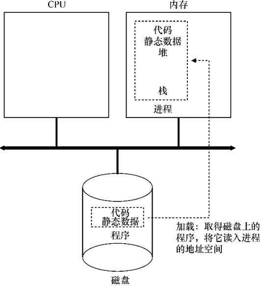

### 进程状态

- 运行：进程正在处理器上运行，意味着正在执行指令。
- 就绪：进程已准备好运行，但由于某些原因，操作系统选择不在此时运行。
- 阻塞：进程执行某种操作，直到发生其他事情才会准备运行。比如进程向磁盘发起 I/O 请求时就会阻塞，这时候其他进程可以使用处理器。

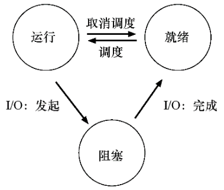

比如有2个进程，进程 Process0 会发起 I/O 请求，那么运行就是这样的：

Process0 发起 I/O 并被阻塞，操作系统发现它不使用 CPU 了，就开始运行 Process1，当 Process0 的 I/O 完成了，那么 Process0 移会就绪状态，最后 Process1 结束，运行 Process0，然后完成。

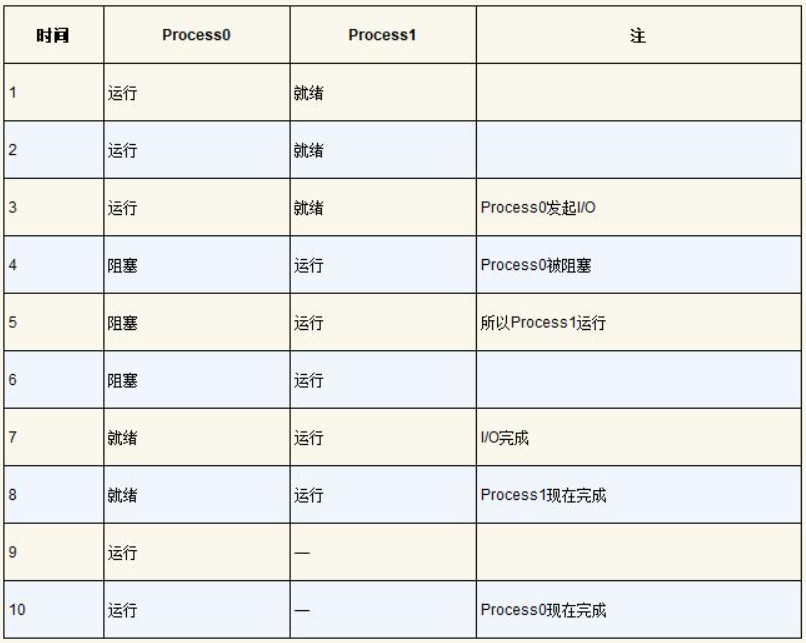

:::tip

当 I/O 完成后，系统决定不切换回 Process0 ，这是一个好的决策吗？

不一定，看情况，这是后面要考虑的。

:::

### 进程信息的数据结构（PCB）

我们**将存储关于进程信息的个体结构称为进程控制块**（Process Control Block, PCB）。

比如下面就是 `xv6` 内核中每个进程的信息类型，真正操作系统存在类似的进程结构。

```c
// the registers xv6 will save and restore
// to stop and subsequently restart a process
struct context {
  int eip;
  int esp;
  int ebx;
  int ecx;
  int edx;
  int esi;
  int edi;
  int ebp;
};

// the different states a process can be in
enum proc_state { UNUSED, EMBRYO, SLEEPING,
                  RUNNABLE, RUNNING, ZOMBIE };

// the information xv6 tracks about each process
// including its register context and state
struct proc {
  char *mem;                   // Start of process memory
  uint sz;                     // Size of process memory
  char *kstack;                // Bottom of kernel stack
                               // for this process
  enum proc_state state;       // Process state
  int pid;                     // Process ID
  struct proc *parent;         // Parent process
  void *chan;                  // If non-zero, sleeping on chan
  int killed;                  // If non-zero, have been killed
  struct file *ofile[NOFILE];  // Open files
  struct inode *cwd;           // Current directory
  struct context context;      // Switch here to run process
  struct trapframe *tf;        // Trap frame for the
                               // current interrupt
};
```

### 进程API

- `fork()`：创建新进程。
- `wait()`：延迟进程执行。父进程调用 `wait()`，延迟自己的执行，直到子进程执行完毕，当子进程结束时，`wait()` 才返回父进程。
- `exec()`：让子进程执行与父进程不同的程序。

### 受限直接执行

前面提到实现虚拟化的思想：运行一个进程一段时间，然后运行另一个进程，如此轮转，通过这种方式实现时分共享CPU，就实现了虚拟化。然而，这样构建虚拟化是有问题的：

1. 性能：如何在不增加系统开销情况下实现虚拟化？
2. 控制权：如何有效运行进程，同时保留对CPU的控制？

为了使程序尽可能快运行，开发人员提出一种技术——受限直接执行。当操作系统希望启动程序运行时，它会在进程列表中为其创建一个进程条目并分配一些内存，将程序代码从磁盘加载到内存中，找到入口点（`main()` 函数）并跳转到那里，开始运行用户代码。

:::tip

进程列表：为了追踪每个进程状态，操作系统可能会为所有就绪进程保留某种进程列表，以及追踪当前正在运行的进程的一些附加信息。还必须追踪被阻塞的进程，当 I/O 事件完成后，操作系统应确保唤醒正确进程，让它准备好再次运行。

:::

直接运行协议：

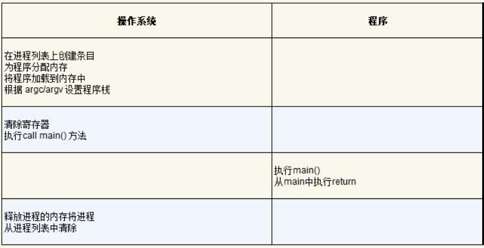

#### 受限制的操作

直接执行的明显优势是快速，但希望进程执行某种受限操作（比如磁盘发出 I/O 请求获取更多系统资源），该咋办？

用户模式：在用户模式下运行的代码会受到限制。比如在用户模式下运行，进程不能发出 I/O 请求。

内核模式：在内核模式下运行的代码可以做它喜欢的事情，包括特权操作，如发出 I/O 请求和执行受限指令。

系统调用：运行内核向用户程序暴露某些关键功能，如文件系统、进程通信、内存分配等。程序必须执行特殊的 trap 指令跳入内核并将特权级别提升到内核模式，进入内核后系统就能执行特权操作了，完成后调用 return-from-trap 指令返回发起调用的用户程序中，同时将特权级别降低，回到用户模式。

:::tip

进行系统调用的部分是用汇编手工编码，别人已经写好了，自己就不用写代码陷入内核模式了。

:::

内核通过在启动时设置陷阱表（trap table）来实现。当机器启动时，它在内核模式下执行。操作系统做的第一件事情，就是告诉硬件在发生某些一场事件时要运行哪些代码。一旦硬件被通知，就会记住处理程序的位置，直到下一次重启机器，并且硬件知道在发生系统调用和其他异常事件时要做什么。

受限直接运行协议：

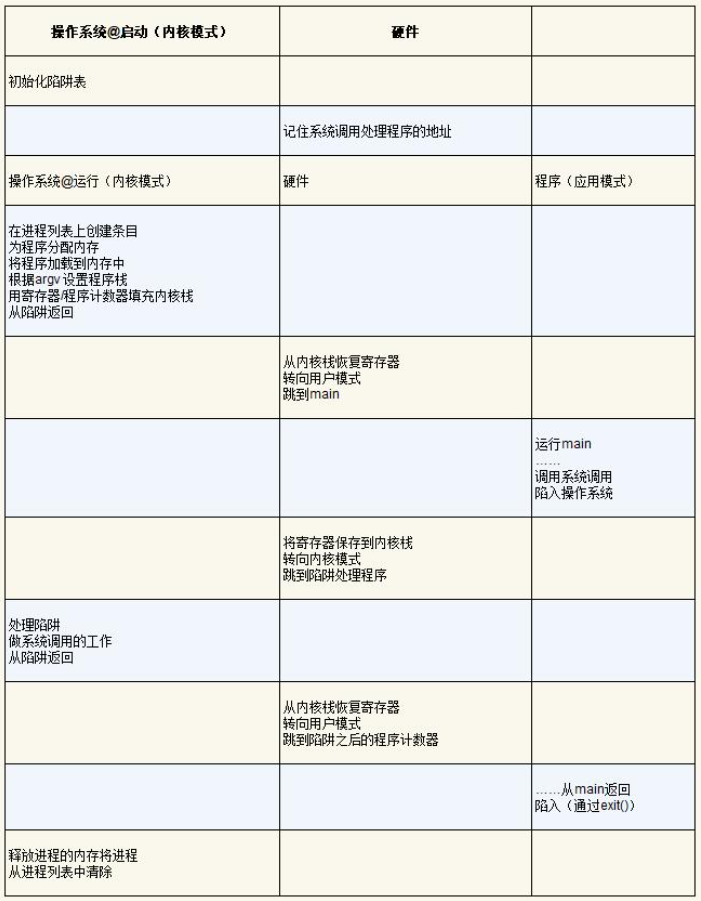

#### 在进程之间切换

1.协作方式：等待系统调用

早期一些系统采用的方式，在这种风格下，操作系统相信系统的进程会合理运行。运行时间过长的进程被假定会定期放弃CPU，以便操作系统可以决定运行其他任务。如果应用程序执行了某些非法操作，也会将控制转移给操作系统。例如，如果应用程序以0为除数，或者尝试访问应该无法访问的内存，就会陷入（trap）操作系统。操作系统将再次控制CPU（并可能终止违规进程）。

因此，在协作调度系统中，**OS通过等待系统调用，或某种非法操作发生，从而重新获得CPU的控制权。**

2.非协作方式：操作系统进行控制

协作方式的问题在于如果进程拒绝系统调用，从而将控制权交还给操作系统，那么操作系统无法做任何事情。

时钟设备可以编程为每个几毫秒产生一次中断，产生中断时，当前正在运行的进程停止，操作系统中预设配置的中断处理程序运行。此时，操作系统重新获得CPU控制权，因此可以做到停止当前进程并启动另一个进程。

操作系统通过时钟，在时间内将CPU控制权借给进程使用，如果到时间了还不归还，就通过操作系统的中断处理程序将CPU控制权强制收回。

3.保存和恢复上下文

操作系统重获控制权后，必须决定：**是继续运行当前正在运行的进程，还是切换到另一个进程。而这个决定是由调度程序做出的**。而如果决定要进行切换，操作系统就会执行上下文切换的相关代码。

上下文切换：操作系统为当前正在执行的进程A保存一些寄存器的值（比如保存到内核栈中），并为即将执行的进程B恢复一些寄存器的值。这样操作系统就能确保最后执行从陷阱返回指令时，继续执行B进程。

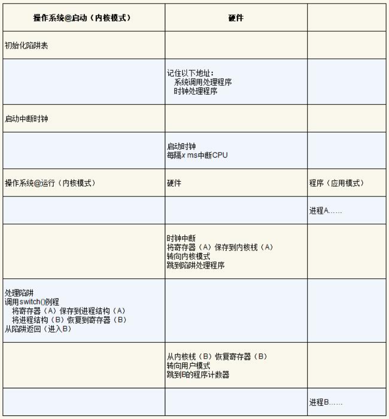

为了直观的理解上下文切换过程，这里贴出 xv6 的汇编代码吧：

```c
# void swtch(struct context **old, struct context *new);
#
# Save current register context in old
# and then load register context from new.
.globl swtch
swtch:
  # Save old registers
  movl 4(%esp), %eax # put old ptr into eax
  popl 0(%eax)        # save the old IP
  movl %esp, 4(%eax) # and stack
  movl %ebx, 8(%eax) # and other registers
  movl %ecx, 12(%eax)
  movl %edx, 16(%eax)
  movl %esi, 20(%eax)
  movl %edi, 24(%eax)
  movl %ebp, 28(%eax)

  # Load new registers
  movl 4(%esp), %eax # put new ptr into eax
  movl 28(%eax), %ebp # restore other registers
  movl 24(%eax), %edi
  movl 20(%eax), %esi
  movl 16(%eax), %edx
  movl 12(%eax), %ecx
  movl 8(%eax), %ebx
  movl 4(%eax), %esp  # stack is switched here
  pushl 0(%eax)       # return addr put in place
  ret                 # finally return into new ctxt
```

### 进程调度算法

回应上节，操作系统获得CPU控制权后，需要决定是继续运行当前进程，还是通过上下文切换到另一个进程，这个选择是由专门的进程调度算法控制的。

#### 调度指标

$$
T_{周转时间}=T_{完成时间}-T_{到达时间} \\
T_{响应时间}=T_{首次运行}-T_{到达时间} \\
$$

假设所有任务在同一时间到达，那么到达时间就为0，周转时间和完成时间相等。

#### 先进先出（FIFO）

比如A、B、C任务分别为100s、10s、10s，A比B早一点点，然后B比C早到达一点点。那么先进先出调度结果如下：

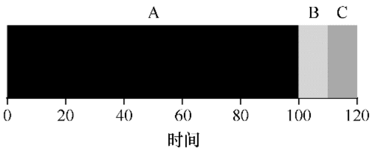

很明显，先进先出调度算法并不好，潜在资源消费者排在重量级资源消费者后。

#### 最短任务优先（SJF）

先允许最短的任务，然后次短，依次类推：

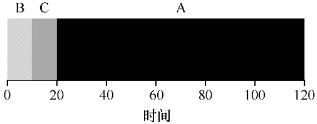

如果B、C在A之后不久到达，还是被迫等待A完成，潜在资源消费者排在重量级资源消费者后。

#### 最短完成时间优先（STCF）

当B、C到达时，抢占A并运行B、C，待它们完成后，才能调用A的剩余时间。

:::warning

STCF是一种抢占式的调度算法。

:::

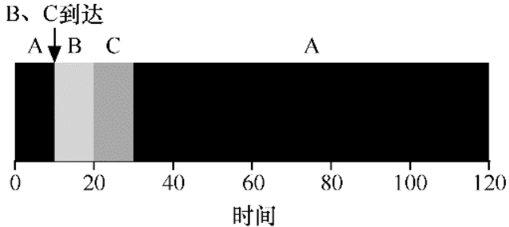

#### 轮转（RR）

在一个时间片内运行一个工作，然后切换到运行队列的下一个任务，而不是运行一个任务直到结束。它反复执行，直到所有任务完成。

:::danger

时间片长度必须是时钟中断周期的倍数，如果时钟中断是 10ms 中断一次，那么时间片可以是 10ms、20ms、50ms 等等。

:::

假设A、B、C同时到达，它们都希望运行 5s，那么 1s 时间片的轮转可以快速循环工作：

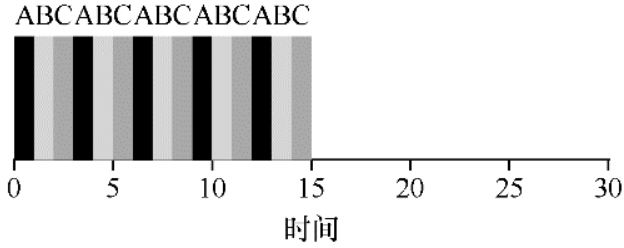

时间片长度对于 RR 是很重要的，越短 RR 在响应时间上表现越好。然而太短的话，过度频繁的上下文切换成本会影响整体性能。因此，时间片长度是在减少上下文切换成本和使系统及时响应之间权衡的。

#### 结合 I/O

调度程序显然要在工作发起 I/O 请求时候做出决定，因为 I/O 期间不会使用CPU，它被阻塞等待 I/O 完成。调度程序还必须在 I/O 完成时做出决定。发生这种情况时，会产生中断，操作系统运行并将发出I/O的进程从阻塞状态移回就绪状态。

假设有A、B作业，每个需要 50ms 的 CPU 时间，A运行 10ms，然后发出 I/O 请求，而B只是使用CPU。

构建 STCF 调度程序，将A的每个 10ms 的子作业看作是独立的，因此当系统启动时，选择 10ms 调度的A，然后调度B，同时执行A的 I/O，这样系统得到更好利用：

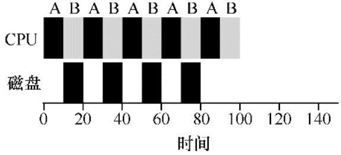

#### 多级反馈队列（MLFQ）


