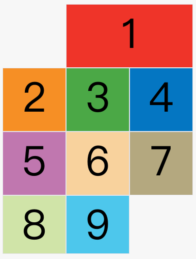
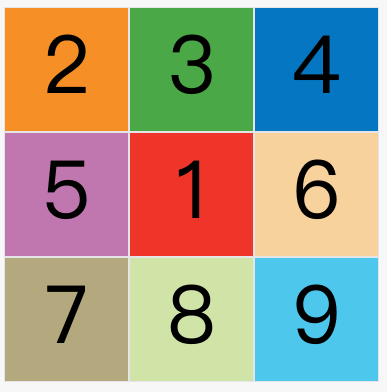

# CSS-Grid布局
## Grid容器

单元格：`n`行和`m`列会产生`n x m`个单元格。比如，3行3列会产生9个单元格。

网格线：`n`行有`n + 1`根水平网格线，`m`列有`m + 1`根垂直网格线。比如三行就有四根水平网格线。


如上图，产生了`4*4`个单元格，有5条水平网格线和5条垂直网格线

## 属性列举

> 普通属性是写在盒子的CSS中，而项目属性是写在盒子内部节点的CSS中

容器属性：

+ grid-template-columns/rows：构成`n*m`的网格，设置行/宽高
+ grid-column/row-gap：行间隔/列间隔
+ grid-template-areas：定义区域块
+ grid-auto-flow：容器子元素排列顺序
  + `row`（默认）：先行后列
  + `columns`：先列后行
  + `row dense`：先行后列，紧密排列
  + `columnsdense`：先列后行，紧密排列
+ justify/align-items：设置**单元格内容位置**
  + start：对齐单元格的起始边缘。
  + end：对齐单元格的结束边缘
  + center：单元格内部居中
  + stretch：拉伸，占满单元格的整个宽度（默认值）
+ justify/align-content：设置整个**内容区域在容器里面的位置**
  + start：对齐起始边框
  + end：对齐结束边框
  + center：居中
  + stretch：拉伸
  + space-around：每个项目两侧的间隔相等
  + space-between：项目与项目的间隔相等，项目与容器边框之间**没有间隔**
  + space-evenly：项目与项目的间隔相等，项目与容器边框之间也**是同样长度的间隔**
+ grid-auto-columns/rows：容器自动扩展后采用的行/宽高

项目属性：

+ grid-column/row-start/end：手动指定项目的位置
+ grid-area：指定项目放在哪一个区域
+ justify/align-self：设置单元格内容的水平/垂直位置
  + start：对齐单元格的起始边缘。
  + end：对齐单元格的结束边缘。
  + center：单元格内部居中。
  + stretch：拉伸，占满单元格的整个宽度（默认值）。

## 容器属性

### grid-template-columns/rows

```css
.container {
    display: grid;
    grid-template-columns: 100px 100px 100px;
    grid-template-rows: 100px 100px 100px;
}
```

列宽和行高都是`100px`，上述构成一个`3*3`的网格布局


### 一些关键字

#### repeat()

`repeat()`接受两个参数，第一个参数是重复的次数（上例是3），第二个参数是所要重复的值。

#### auto-fill

有时，单元格的大小是固定的，但是容器的大小不确定。如果希望每一行（或每一列）容纳尽可能多的单元格，这时可以使用`auto-fill`关键字表示**自动填充。**

```css
.container {
    display: grid;
    grid-template-columns: repeat(auto-fill, 100px);
}
```

上面代码表示每列宽度`100px`，然后自动填充，直到容器不能放置更多的列。

#### fr

网格剩余空间所占用比例关系

```css
.container {
    display: grid;
    grid-template-columns: 150px 1fr 2fr;
}
```

上面代码表示，第一列的宽度为150像素，第二列的宽度是第三列的一半。

#### minmax()

`minmax()`函数产生一个长度范围，表示长度就在这个范围之中。它接受两个参数，分别为最小值和最大值。

```css
grid-template-columns: 1fr 1fr minmax(100px, 1fr);
```

上面代码中，`minmax(100px, 1fr)`表示列宽不小于`100px`，不大于`1fr`。

#### 网格线的名称

`grid-template-columns`属性和`grid-template-rows`属性里面，还可以使用方括号，指定每一根网格线的名字，方便以后的引用。

```css
.container {
    display: grid;
    grid-template-columns: [c1] 100px [c2] 100px [c3] auto [c4];
    grid-template-rows: [r1] 100px [r2] 100px [r3] auto [r4];
}
```

上面代码指定网格布局为3行 x 3列，因此有4根垂直网格线和4根水平网格线。方括号里面依次是这八根线的名字。

### grid-column/row-gap

`grid-row-gap`属性设置行与行的间隔（行间距），`grid-column-gap`属性设置列与列的间隔（列间距）。

```css
.container {
    grid-row-gap: 20px;
    grid-column-gap: 20px;
}
```


### grid-template-areas

`grid-template-areas`属性用于定义区域。

```css
grid-template-areas: "header header header"
                     "main main sidebar"
                     "footer footer footer";
```

如果某些区域不需要利用，则使用"点"（`.`）表示。

### grid-auto-flow

划分网格以后，容器的子元素会按照顺序，自动放置在每一个网格。`grid-auto-flow`属性决定，默认值是`row`，即“先行后列”，即先填满第一行，再开始放入第二行。也可以将它设成`column`，变成"先列后行"。

下面的例子让1号项目和2号项目各占据两个单元格，然后在默认的`grid-auto-flow: row`情况下，会产生下面这样的布局。


现在修改设置，设为`grid-auto-flow: row dense`，表示"先行后列"，并且尽可能紧密填满，尽量不出现空格。


### justify/align-items

`justify-items`属性设置**单元格内容**的水平位置（左中右），`align-items`属性设置**单元格内容**的垂直位置（上中下）。

- start：对齐单元格的起始边缘。
- end：对齐单元格的结束边缘。
- center：单元格内部居中。
- stretch：拉伸，占满单元格的整个宽度（默认值）。

```css
.container {
    justify-items: start;
}
```


### justify/align-content

`justify-content`属性是**整个内容区域在容器里面**的水平位置（左中右），`align-content`属性是整个内容区域的垂直位置（上中下）。

- start：对齐容器的起始边框。
- end：对齐容器的结束边框。
- center：容器内部居中。
- stretch：项目大小没有指定时，拉伸占据整个网格容器。
- space-around：每个项目两侧的间隔相等。所以，项目之间的间隔比项目与容器边框的间隔大一倍。
- space-between：项目与项目的间隔相等，项目与容器边框之间没有间隔。
- space-evenly：项目与项目的间隔相等，项目与容器边框之间也是同样长度的间隔。

space-around：


space-between：


space-evenly：


### grid-auto-columns/rows

`grid-auto-columns`属性和`grid-auto-rows`属性用来设置，浏览器自动创建的多余网格的列宽和行高。

```css
.container {
    display: grid;
    grid-template-columns: 100px 100px 100px;
    grid-template-rows: 100px 100px 100px;
    grid-auto-rows: 50px; 
}
```


这个网格布局是`3*3`的，但是现在添加的8、9模块是在网格外面的，因此需要自动扩展

自动扩展的的row大小就是`grid-auto-rows: 50px; `，为50px

## 项目属性

### grid-column/row-start/end

手动指定项目的位置

- `grid-column-start`属性：左边框所在的垂直网格线
- `grid-column-end`属性：右边框所在的垂直网格线
- `grid-row-start`属性：上边框所在的水平网格线
- `grid-row-end`属性：下边框所在的水平网格线

#### 定位方式

```css
.item-1 {
    grid-column-start: 2;
    grid-column-end: 4;
}
```

上面代码指定，1号项目的左边框是第二根垂直网格线，右边框是第四根垂直网格线。



#### 指定网格线名字

```css
.item-1 {
    grid-column-start: header-start;
    grid-column-end: header-end;
}
```

#### 跨越，span

```css
/* 下面两个作用相同 */
.item-1 {
    grid-column-start: span 2;
}

.item-1 {
  grid-column-end: span 2;
}
```


#### grid-column/row

`grid-column`属性是`grid-column-start`和`grid-column-end`的合并简写形式，`grid-row`属性是`grid-row-start`属性和`grid-row-end`的合并简写形式。

```css
.item-1 {
  grid-column: 1 / 3;
  grid-row: 1 / 2;
}
/* 等同于 */
.item-1 {
  grid-column-start: 1;
  grid-column-end: 3;
  grid-row-start: 1;
  grid-row-end: 2;
}
```

### grid-area

#### 指定区域

`grid-area`属性指定项目放在哪一个区域。这个与上层盒子定义的`grid-template-areas`相互对应。

比如：

```css
.container {
    display: grid;
    grid-template-columns: 100px 100px 100px;
    grid-template-rows: 100px 100px 100px;
    grid-template-areas: 'a b c'
        				'd e f'
        				'g h i';
}
```

```css
.item-1 {
    grid-area: e;
}
```

1号项目位于`e`区域，效果如下图：



#### 属性联用

`grid-area`属性还可用作`grid-row-start`、`grid-column-start`、`grid-row-end`、`grid-column-end`的合并简写形式，直接指定项目的位置。

```css
.item {
    grid-area: <row-start> / <column-start> / <row-end> / <column-end>;
}

.item-1 {
    grid-area: 1 / 1 / 3 / 3;
}
```

### justify/align/place-self

> `justify-items`和`justify-self`作用是一样的，但前者声明在盒子层，作用于所有盒子；后者声明在盒子内部的项目层，作用于单个选定的项目

`justify-self`属性设置**单元格内容的水平位置**（左中右），跟`justify-items`属性的用法完全一致，但**只作用于单个项目**。

`align-self`属性设置**单元格内容的垂直位置**（上中下），跟`align-items`属性的用法完全一致，也是**只作用于单个项目**。

`place-self`属性是`align-self`属性和`justify-self`属性的合并简写形式。

可用的值：

- start：对齐单元格的起始边缘。
- end：对齐单元格的结束边缘。
- center：单元格内部居中。
- stretch：拉伸，占满单元格的整个宽度（默认值）。

```css
.item-a  {
    justify-self: start;
}
```


## Grid样式属性调试板
