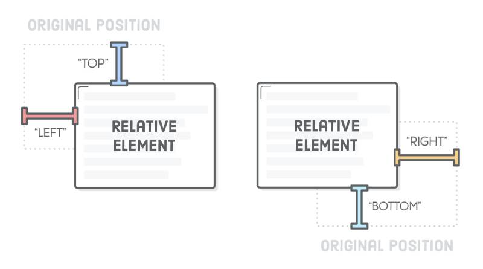
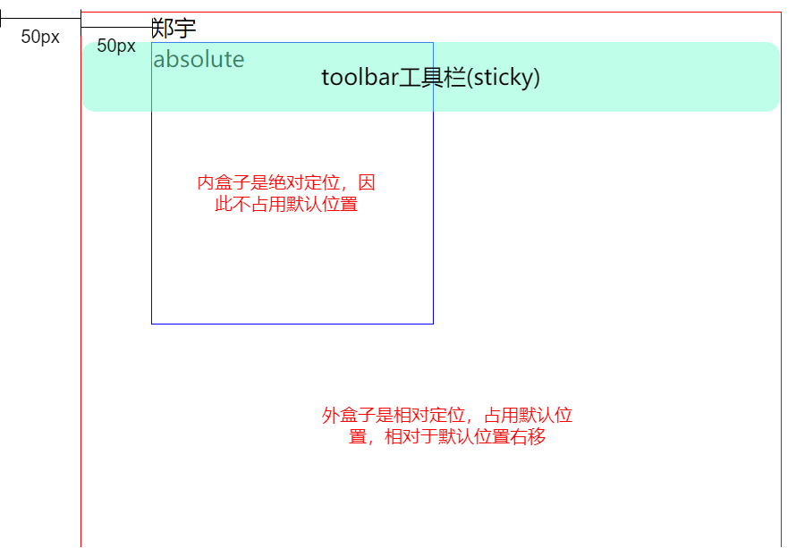
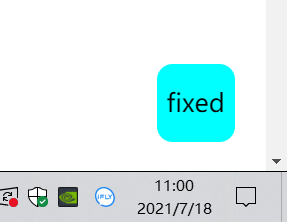

# CSS-position关键字
## position属性

- static：默认，遵循文档流
- relative：相对定位
- fixed：固定定位
- absolute：绝对定位
- sticky：变形定位（常用于顶部固定栏）

## static

static是position属性的默认值。如果省略position属性，浏览器就认为该元素是static定位。

这时，浏览器会按照源码的顺序，决定每个元素的位置，这称为"正常的页面流"（normal flow）。每个块级元素占据自己的区块（block），元素与元素之间不产生重叠，这个位置就是元素的默认位置。

在static状态下top、bottom、left、right这四个属性无效。

## relative

**相对于默认位置**进行偏移，必须搭配top、bottom、left、right这四个属性一起使用，用来指定偏移的方向和距离。



## absolute

**相对于上一级元素**进行偏移，但定位基点不能是static，否则基点就是根html元素。
absolute定位也必须搭配top、bottom、left、right这四个属性一起使用。

```html
<div id="father">
  <div id="son"></div>
</div>
<style>
  #father {
    positon: relative;
  }

  #son {
    position: absolute;
    top: 20px;
  }
</style>
```
父元素是relative，子元素是absolute，因此子元素的定位基点是父元素，相对于父元素的顶部向下偏移20px。子元素的定位基点是父元素，相对于父元素的顶部向下偏移20px。

## fixed

fixed表示，相对于视口（viewport，浏览器窗口）进行偏移，即定位基点是浏览器窗口。
它如果搭配top、bottom、left、right这四个属性一起使用，表示元素的初始位置是基于视口计算的，否则初始位置就是元素的默认位置。

## sticky

sticky生效的前提是，必须搭配top、bottom、left、right这四个属性一起使用，不能省略，否则等同于relative定位，不产生"动态固定"的效果。原因是这四个属性用来定义"偏移距离"，浏览器把它当作sticky的生效门槛。

它的具体规则是，当页面滚动，父元素开始脱离视口时（即部分不可见），只要与sticky元素的距离达到生效门槛，relative定位自动切换为fixed定位；等到父元素完全脱离视口时（即完全不可见），fixed定位自动切换回relative定位。
```css
#toolbar {
  position: -webkit-sticky; /* safari 浏览器 */
  position: sticky; /* 其他浏览器 */
  top: 20px;
}
```
上面代码中，页面向下滚动时，#toolbar的父元素开始脱离视口，一旦视口的顶部与#toolbar的距离小于20px（门槛值），#toolbar就自动变为fixed定位，保持与视口顶部20px的距离。页面继续向下滚动，父元素彻底离开视口（即整个父元素完全不可见），#toolbar恢复成relative定位。

## 例子
```html
<!DOCTYPE html>
<html lang="en">

<head>
  <meta charset="UTF-8">
  <meta http-equiv="X-UA-Compatible" content="IE=edge">
  <meta name="viewport" content="width=device-width, initial-scale=1.0">
  <title>Document</title>
  <style>
    .container {
      width: 500px;
      height: 1500px;
      border: 1px solid red;
      /* 相对于根html节点 */
      position: relative;
      left: 50px;
    }

    .name {
      position: relative;
      left: 50px;
    }

    .box {
      width: 200px;
      height: 200px;
      border: 1px solid blue;
      position: absolute;
      left: 50px;
    }

    .navigation {
      width: 50px;
      height: 50px;
      border-radius: 10px;
      background-color: aqua;
      text-align: center;
      line-height: 50px;
      position: fixed;
      bottom: 20px;
      right: 20px;

    }

    .toolbar {
      width: 500px;
      height: 50px;
      background-color: rgba(127, 255, 212, 0.5);
      border-radius: 10px;
      text-align: center;
      line-height: 50px;

      position: sticky;
      top: 0px;
    }
  </style>
</head>

<body>
  <div class="container">
    <div class="name">郑宇</div>
    <div class="box">absolute</div>
    <div class="toolbar">toolbar工具栏(sticky)</div>
  </div>
  <nav class="navigation">fixed</nav>
</body>

</html>
```


fixed是一直固定在右下角：



效果查看：[https://codepen.io/jonnylong/pen/poPPmrR](https://codepen.io/jonnylong/pen/poPPmrR)
