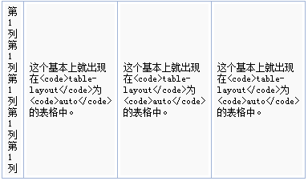
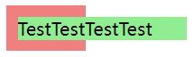
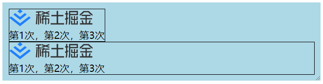
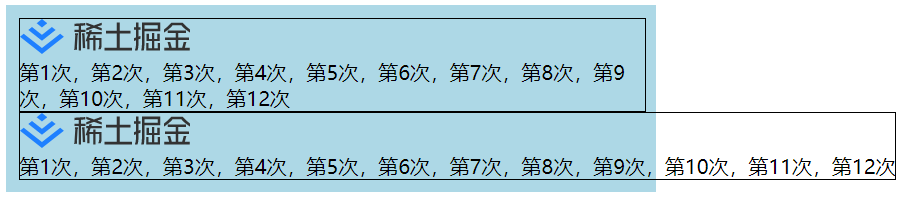
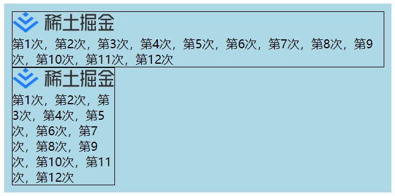

# CSS尺寸体系

## 块级元素和行内元素

块级元素block：（div、h1、p）

1. 每个块级元素独占一行
2. width、height、line-height、margin、padding都有效
3. 如果不设置width，默认为父元素的100%
4. 多个块元素写一起上下排列

行内元素inline：（a、i、span、textarea、em）

1. 不独占一行
2. width、height无效；margin、padding水平方向有效，垂直方向无效；line-height有效
3. 元素宽度就是包含的文字或图片的宽度，不可改变
4. 行内元素中不能放块级元素

行内块级元素inline-block：（button、input、img）

1. 不独占一行
2. width、height、line-height、margin、padding都有效
3. 默认宽度即本身内容的宽度
4. 需要在父元素设置`font-size: 0;`才能消除间隙

在本节提到块级和行内元素，最主要的是宽度，**inline默认宽度为内容宽度，block宽度默认为父元素的100%**。

## 尺寸状态

1. 充分利用可用空间。`<div>`、`<p>`等元素的宽度默认是父容器的100%，这就是充分利用可用空间。（fill-available）
2. 收缩到合适。浮动、绝对定位、行内水平元素，收缩到内容合适的宽度。（fit-content）
3. 收缩到最小。当空间不够时候，文字能断就断，中文是随便断的，英文单词不能断。（min-content）

下图的第一列，就是收缩到最小的状态。



4. 超出容器限制。连续特别长的英文数字，或者内联元素设置了`white-space:nowrap;`，则会超出容器。



## width属性

### fill-available

如果是block元素，默认宽度就是充分利用可用空间的；如果是inline-block元素，默认宽度由子元素宽度决定的，但可用通过`fill-available`让元素的100%自动填充特性可以应用在行内块元素。

```vue
<template>
  <div class="appBox">
    <div class="box box1">
      
      <div>
        第1次，第2次，第3次
      </div>
    </div>
    <div class="box box2">
      
      <div>
        第1次，第2次，第3次
      </div>
    </div>
  </div>
</template>

<style scoped lang="less">
.appBox {
  width: 500px;
  padding: 10px;
  background: lightblue;
  resize: horizontal;
  overflow: hidden;
  .box {
    width: 100%;
    border: 1px solid black;
  }
  .box1 {
    display: inline-block;
    width: auto;
  }
  .box2 {
    display: inline-block;
    width: -webkit-fill-available;
  }
}
</style>
```



当子元素宽度不够时候，可用观察到使用`fill-available`后会充分利用父元素的可用空间。

### max-content

采用宽度大的那个内容的宽度。

```vue
<template>
  <div class="appBox">
    <div class="box box1">
      
      <div>
        第1次，第2次，第3次，第4次，第5次，第6次，第7次，第8次，第9次，第10次，第11次，第12次
      </div>
    </div>
    <div class="box box2">
      
      <div>
        第1次，第2次，第3次，第4次，第5次，第6次，第7次，第8次，第9次，第10次，第11次，第12次
      </div>
    </div>
  </div>
</template>

<style scoped lang="less">
.appBox {
  width: 500px;
  padding: 10px;
  background: lightblue;
  .box {
    width: 100%;
    border: 1px solid black;
  }
  .box1 {
    display: inline-block;
    width: 100%;
  }
  .box2 {
    display: inline-block;
    width: max-content;
  }
}
</style>
```



### min-content

内部元素**最小宽度值最大的那个元素的宽度**作为最终容器的宽度。

最小宽度值：

- 图片：图片呈现的宽度
- 文本
  - 中文：一个中文的宽度值。最小宽度可能就是里面最长的英文单词的宽度。
  - 包含英文：默认英文单词不换行。最小宽度可能就是里面最长的英文单词的宽度。

```vue
<template>
  <div class="appBox">
    <div class="box box1">
      
      <div>
        第1次，第2次，第3次，第4次，第5次，第6次，第7次，第8次，第9次，第10次，第11次，第12次
      </div>
    </div>
    <div class="box box2">
      
      <div>
        第1次，第2次，第3次，第4次，第5次，第6次，第7次，第8次，第9次，第10次，第11次，第12次
      </div>
    </div>
  </div>
</template>

<style scoped lang="less">
.appBox {
  width: 500px;
  padding: 10px;
  background: lightblue;
  .box {
    width: 100%;
    border: 1px solid black;
  }
  .box1 {
    display: inline-block;
    width: auto;
  }
  .box2 {
    display: inline-block;
    width: min-content;
  }
}
</style>
```



我们可以观察到，使用`min-content`后，盒子宽度就是图片宽度了，文本被折行。

### fit-content

收缩到合适，当子元素宽度都小于父元素时，收缩到合适宽度。

比如我们可以通过配合`margin: 0 auto;`让其收缩到合适宽度同时居中显示。

```vue
<template>
  <div class="appBox">
    <div class="box box1">
      
      <div>
        第1次，第2次，第3次，第4次，第5次，第6次
      </div>
    </div>
  </div>
</template>

<style scoped lang="less">
.appBox {
  width: 500px;
  padding: 10px;
  background: lightblue;
  .box {
    width: 100%;
    border: 1px solid black;
  }
  .box1 {
    margin: 0 auto;
    width: fit-content;
  }
}
</style>
```


