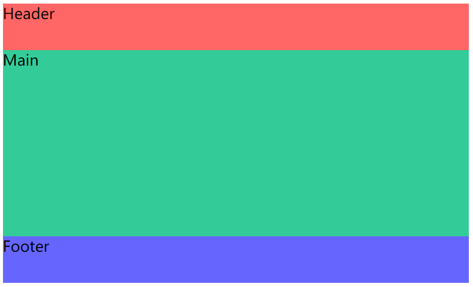
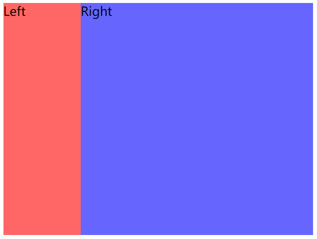
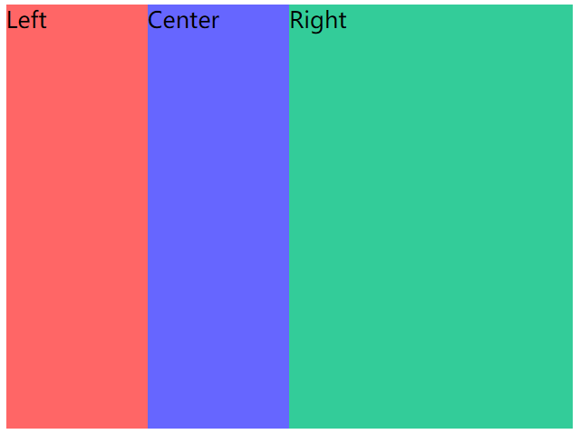
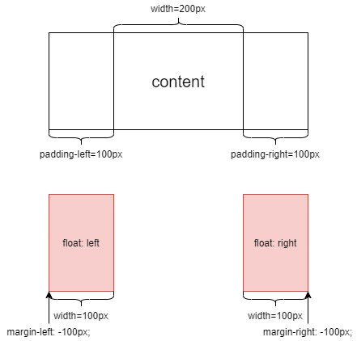
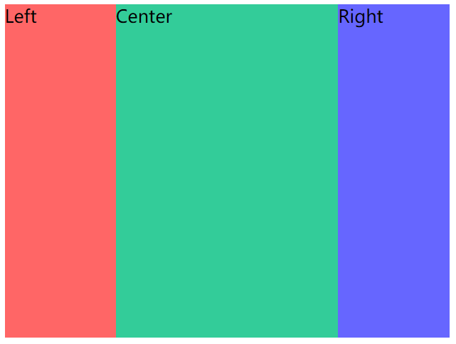
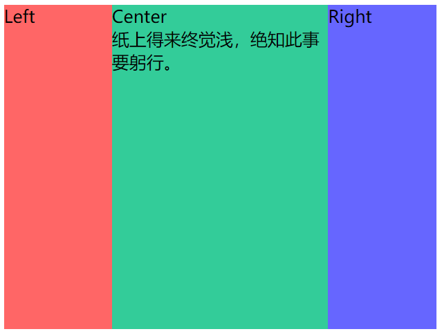
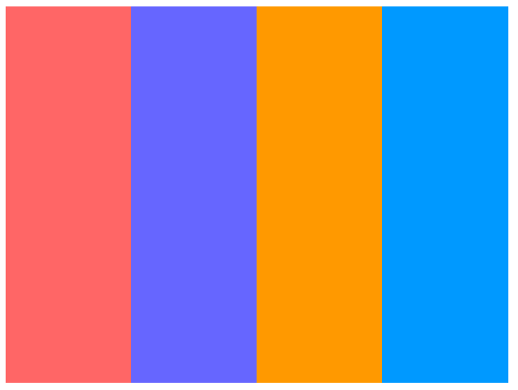
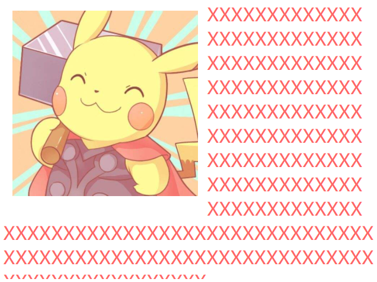
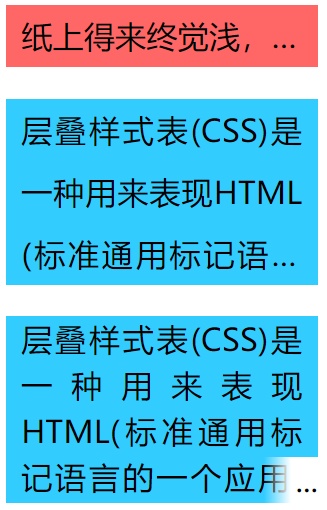

# CSS布局实例

CSS常用的布局，搭建页面必会的结构

## 居中

### 水平居中

1.行内元素

```css
span {
  text-align: center;
}
```
缺点：该属性会发生继承，子元素宽度大于父元素宽度时候无效，小于父元素宽度时水平居中生效。

2.单个块级元素

```css
div {
  /* 必须定宽，也可以是fit-content */
  width: 100px;
  margin: 0 auto;
}
```
缺点：必须定宽，且width值不能为auto；宽度必须小于父元素。

3.多个块元素

让多个块元素变成行内块元素，然后通过text-align让行内内容居中。
```less
#parent {
  text-align: center;
  .son {
    display: inline-block
  }
}
```
缺点：只对行内内容有效；text-align会继承；block改为inline-block换行、空格会产生元素间隔。

4.position

先让元素左上角定位到相对父元素居中位置，再折回自身宽度一半，让元素整体定位到居中位置。
```less{5,4,7,8,9,10,11}
/* 父元素为相对定位，子元素为绝对定位 */
#parent{
  height: 200px;
  width: 200px;
  position: relative;
  .son {
    position: absolute;
    /* 父元素宽度一半，元素左上角定位到居中位置 */
    left: 50%;
    /* 折回自身宽度一半，元素整体定位到居中位置 */
    transform: translateX(-50%);
    width: 100px;
    height: 100px;
    background-color: #00ff00;
  }
}
```
缺点：代码较多；脱离文档流；需要知道宽度值。

5.flex

通过flex布局让其在主轴方向居中对齐
```css
#parent{
  display: flex;
  justify-content: center;
}
```

### 垂直居中

1.行内元素

让高度和行高等值
```css
#parent{
  height: 150px;
  /* 必须与height等值 */
  line-height: 150px;
}
```
缺点：只能用于单行内容；要知道高度的值。

如果是多行，行高=高度/元素个数

```css
/* 现在有五个元素， */
#parent{
  height: 150px;
  line-height: 30px;
}
```
缺点：只能用于行内内容；需要知道高度和最终呈现多少行来计算出line-height的值，建议用span包裹多行文本。

2.图片
```less
#parent{
  height: 150px;
  line-height: 150px;
  /* 没有font-size: 0;就不是完全的垂直居中 */
  font-size: 0;
  /* 默认是基线对齐，改为middle */
  img {
    vertical-align: middle;
  }
}
```
缺点：需要添加`font-size: 0;`才可以完全的垂直居中；熟悉line-height 和vertical-align的基友关系较难

3.position

和水平居中原理相同

4.flex

通过flex布局让其在交叉轴方向居中对齐
```css
#parent{
  display: flex;
  align-items: center;
}
```

### 水平垂直居中

通过结合上述`水平居中`和`垂直居中`的实现方式完成一些常见的`水平垂直居中布局`，未出现的方式可在评论中补充，方便一起学习。注意注意，上述任何`水平居中`和`垂直居中`方式不是随意组合就能生效，这个需详细分析可行性。通过一些组合就能成功得到`水平垂直居中布局`。


## 全屏布局

经典的`全屏布局`由顶部、底部、主体三部分组成，其特点为`三部分左右满屏拉伸`、`顶部底部高度固定`和`主体高度自适应`，主要应用在主体布局。该布局很常见，也是大部分Web应用主体的主流布局。通常使用`<header>`、`<footer>`和`<main>`三个标签语义化排版，`<main>`内还可插入`<aside>`作为侧栏。

### position + left/right/top/bottom

```html
<style>
    .fullscreen-layout {
        position: relative;
        width: 500px;
        height: 300px;
    }

    header,
    footer,
    main {
        position: absolute;
        left: 0;
        right: 0;
    }

    header {
        top: 0;
        height: 50px;
        background-color: #f66;
    }

    footer {
        bottom: 0;
        height: 50px;
        background-color: #66f;
    }

    main {
        top: 50px;
        bottom: 50px;
        background-color: #3c9;
    }
</style>

<body>
    <div class="fullscreen-layout">
        <header>Header</header>
        <main>Main</main>
        <footer>Footer</footer>
    </div>
</body>
```

这里解释下为啥`left: 0;`和`right: 0;`同时存在，这个是**之前的理解有误**

**一个盒子的大小正常情况下是由width和height决定的，但如果缺少，则是由top、bottom、left、rigth坐标确定的**

比如本例中没有width，那么就由left、rigth决定，由于它们都是0，因此左边压着fullscreen-layout盒子的左边界，右边压着fullscreen-layout盒子的右边界



### flex

```html
<style>
    .fullscreen-layout {
        display: flex;
        flex-direction: column;
        width: 500px;
        height: 300px;
    }

    header {
        height: 50px;
        background-color: #f66;
    }

    footer {
        height: 50px;
        background-color: #66f;
    }

    main {
        flex: 1;
        background-color: #3c9;
    }
</style>

<body>
    <div class="fullscreen-layout">
        <header>Header</header>
        <main>Main</main>
        <footer>Footer</footer>
    </div>
</body>
```

用弹性盒子确定header和footer的高度，然后让main部分自动适配，`flex-grow:1`是独占弹性盒子的剩余空间

## 两列布局

### float + margin-left/right

```html
<style>
    .two-column-layout{
        width: 400px;
        height: 400px;
    }
    .left{
        float: left;
        width: 100px;
        height: 100%;
        background-color: #f66;
    }
    .right{
        margin-left: 100px;
        height: 100%;
        background-color: #66f;
    }
</style>

<body>
    <div class="two-column-layout">
        <div class="left">Left</div>
        <div class="right">Right</div>
    </div>
</body>
```

**left是浮动且宽度确定的，right必须有**`**margin-left: 100px;**`**，是让浮动的区域为空**，没有这个是蓝色扩展到整个盒子，然后红色覆盖了那一部分



### overflow + float

```html
<style>
    .two-column-layout{
        width: 400px;
        height: 400px;
    }
    .left{
        float: left;
        width: 100px;
        height: 100%;
        background-color: #f66;
    }
    .right{
        /*修改处*/
        overflow: hidden;
        height: 100%;
        background-color: #66f;
    }
</style>

<body>
    <div class="two-column-layout">
        <div class="left">Left</div>
        <div class="right">Right</div>
    </div>
</body>
```

左列声明同上，右列声明`overflow:hidden`使其形成BFC区域与外界隔离

### flex

```html
<style>
    .two-column-layout{
        display: flex;
        width: 400px;
        height: 300px;
    }
    .left{
        width: 100px;
        background-color: #f66;
    }
    .right{
        flex: 1;
        background-color: #66f;
    }
</style>

<body>
    <div class="two-column-layout">
        <div class="left">Left</div>
        <div class="right">Right</div>
    </div>
</body>
```

弹性盒子，left占好位置，然后right适配即可

## 标准三列布局

### overflow + float

```html
<style>
    .three-column-layout {
        width: 400px;
        height: 300px;
    }

    .left {
        float: left;
        width: 100px;
        height: 100%;
        background-color: #f66;
    }

    .center {
        float: left;
        width: 100px;
        height: 100%;
        background-color: #66f;
    }

    .right {
        overflow: hidden;
        height: 100%;
        background-color: #3c9;
    }
</style>

<body>
    <div class="three-column-layout">
        <div class="left">Left</div>
        <div class="center">Center</div>
        <div class="right">Right</div>
    </div>
</body>
```

这种三列布局有局限性，就是必须left和center宽度是确定的，没有用flex的方式好



### flex

```html
<style>
    .three-column-layout{
        display: flex;
        width: 400px;
        height: 300px;
    }
    .left{
        width: 100px;
        background-color: #f66;
    }
    .center{
        width: 100px;
        background-color: #66f;
    }
    .right{
        flex-grow: 1;
        background-color: #3c9;
    }
</style>

<body>
    <div class="three-column-layout">
        <div class="left">Left</div>
        <div class="center">Center</div>
        <div class="right">Right</div>
    </div>
</body>
```

左右宽度固定，中间任意适配

## 圣杯布局和双飞翼布局

经典的`圣杯布局`和`双飞翼布局`都是由左中右三列组成，其特点为`左右两列宽度固定`、`中间一列宽度自适应`和`三列高度固定且相等`。其实也是上述**两列布局**和**三列布局**的变体，整体的实现原理与上述`N列布局`一致，可能就是一些细节需注意。

`圣杯布局`和`双飞翼布局`在大体相同下也存在一点不同，区别在于`双飞翼布局`中间列需插入一个子节点。在常规的实现方式中也是在这个中间列里做文章，`如何使中间列内容不被左右列遮挡`。

- 相同

- 中间列放首位且声明其宽高占满父节点
- 被挤出的左右列使用`float`和`margin负值`将其拉回与中间列处在同一水平线上

- 不同

- 圣杯布局：父节点声明`padding`为左右列留出空位，将左右列固定在空位上
- 双飞翼布局：中间列插入子节点并声明`margin`为左右列让出空位，将左右列固定在空位上

### 圣杯布局float + margin-left/right + padding-left/right

```html
<style>
    .grail-layout {
        padding: 0 100px;
        width: 200px;
        height: 300px;
    }

    .left {
        float: left;
        margin-left: -100px;
        width: 100px;
        height: 100%;
        background-color: #f66;
    }

    .center {
        height: 100%;
        background-color: #3c9;
    }

    .right {
        float: right;
        margin-right: -100px;
        width: 100px;
        height: 100%;
        background-color: #66f;
    }
</style>

<body>
    <div class="grail-layout">
        <div class="left">Left</div>
        <div class="right">Right</div>
        <div class="center">Center</div>
    </div>
</body>
```

在盒子中让Left部分左浮动，让Right部分右浮动，注意**要将margin取负数，设置宽度width刚好等于这个数**

由于浮动节点在位置上不能高于前面或平级的非浮动节点，否则会导致浮动节点下沉。因此在编写HTML结构时，**将中间列节点挪到右列节点后面。**





### 双飞翼布局float + margin-left/right

```html
<style>
    .grail-layout{
        width: 400px;
        height: 300px;
    }
    .left{
        float: left;
        width: 100px;
        height: 100%;
        background: #f66;
    }
    .right{
        float: right;
        width: 100px;
        height: 100%;
        background: #66f;
    }
    .center{
        height: 100%;
        margin: 0 100px;
        background: #3c9;
    }
</style>

<body>
    <div class="grail-layout">
        <div class="left">Left</div>
        <div class="right">Right</div>
        <div class="center">Center
            <div>纸上得来终觉浅，绝知此事要躬行。</div>
        </div>
    </div>
</body>
```

圣杯布局是要Center独占容器，因此有`margin-left: -100px`；而双飞翼布局是三个部分共同占用容器，三者的宽度加起来刚好等于容器宽度



### 圣杯布局/双飞翼布局flex

```html
<style>
    .grail-layout{
        width: 400px;
        height: 300px;
        display: flex;
    }
    .left{
        width: 100px;
        background: #f66;
    }
    .center{
        flex: 1;
        background: #3c9;
    }
    .right{
        width: 100px;
        background: #66f;
    }
</style>
<body>
    <div class="grail-layout">
        <div class="left">Left</div>
        <div class="center">Center
            <div>纸上得来终觉浅，绝知此事要躬行。</div>
        </div>
        <div class="right">Right</div>
    </div>
</body>
```

## 均分布局

经典的`均分布局`由多列组成，其特点为`每列宽度相等`和`每列高度固定且相等`。总体来说，也是最简单的经典布局，由于每列宽度相等，所以很容易找到合适的方式处理。

### float + width

```html
<style>
    .one {
        background-color: #f66;
    }

    .two {
        background-color: #66f;
    }

    .three {
        background-color: #f90;
    }

    .four {
        background-color: #09f;
    }

    .average-layout {
        width: 400px;
        height: 300px;
    }

    div {
        float: left;
        width: 25%;
        height: 100%;
    }
</style>
<body>
    <div class="average-layout">
        <div class="one"></div>
        <div class="two"></div>
        <div class="three"></div>
        <div class="four"></div>
    </div>
</body>
```

让每块都在盒子中浮动即可，然后计算出每个占用的宽度比



### column

使用column实现会令CSS代码语义化更明确。`column相关属性`是为列排版应运而生的，相对`flex相关属性`来说更易懂易学。

```css
.average-layout {
    column-count: 4;
    column-gap: 0;
    width: 400px;
    height: 300px;
}
div {
    height: 100%;
}
```

原生的column布局，非常适合

### flex

```css
.average-layout {
    display: flex;
    width: 400px;
    height: 400px;

}
div {
    flex: 1;
}
```

在一个弹性盒子中，按照`1:1:1:1`分割

## 文字布局

### 文字环绕

```html
<style>
  .text-wrapping {
    /* 溢出部分设置被隐藏 */
    overflow: hidden;
    width: 400px;
    height: 300px;
    font-size: 20px;
    color: #f66;
    /* 对任意字符换行 */
    word-break: break-all;
  }

  img {
    float: left;
    margin: 10px;
    height: 200px;
  }
</style>

<body>
  <div class="text-wrapping">
    
XXXXXXXXXXXXXXXXXXXXXXXXXXXXXXXXXXXXXXXXXXXXXXXXXXXXXXXXXXXXXXXXXXXXXXXXXXXXXXXXXXXXXXXXXXXXXXXXXXXXXXXXXXXXXXXXXXXXXXXXXXXXXXXXXXXXXXXXXXXXXXXXXXXXXXXXXXXXXXXXXXXXXXXXXXXXXXXXXXXXXXXXXXXXXXXXXXXX
  </div>
</body>
```

关键点：

- 让图片浮动
- 字符可以换行

至于溢出部分是hidden还是scroll这个自行选择



### 文字溢出

#### 单行文字溢出

```css
.s-ellipsis {
    /* 溢出容器部分隐藏 */
    overflow: hidden;
    /* 当内联内容溢出块容器时将溢出部分变成… */
    text-overflow: ellipsis;
    /* 指定文本超过边界时不换行 */
    white-space: nowrap;
}
```

#### 多行文字溢出

```css
.m-ellipsis {
    /* 将容器作为弹性伸缩盒模型 */
    display: -webkit-box;
    overflow: hidden;
    text-overflow: ellipsis;
    word-break: break-all;
    /* 弹性伸缩盒模型子节点的排列方式为纵向 */
    -webkit-box-orient: vertical;
    /* 限制容器最多显示3行文本 */
    -webkit-line-clamp: 3;
}
```

最后带有点修边的：

```css
.m-ellipsis2 {
    overflow: hidden;
    position: relative;
    max-height: 120px;
    /* 行高 */
    line-height: 30px;
}

.m-ellipsis2::after {
    /* 绝对定位 */
    position: absolute;
    right: 0;
    bottom: 0;
    padding-left: 20px;
    /* 渐变色 */
    background: linear-gradient(to right, transparent, #fff 50%);
    content: "...";
}
```



#### 完整代码

```html
<!DOCTYPE html>
<html lang="en">

<head>
    <meta charset="UTF-8">
    <meta http-equiv="X-UA-Compatible" content="IE=edge">
    <meta name="viewport" content="width=device-width, initial-scale=1.0">
    <title>CSS艺术之美</title>
    <style>
        .text-ellipsis {
            width: 200px;
        }

        p {
            padding: 0 10px;
            line-height: 40px;
            text-align: justify;
            font-size: 20px;
            color: rgb(0, 0, 0);
        }

        .s-line {
            background-color: #f66;
        }

        .m-line {
            background-color: #3cf;
        }

        .s-ellipsis {
            /* 溢出容器部分隐藏 */
            overflow: hidden;
            /* 当内联内容溢出块容器时将溢出部分变成… */
            text-overflow: ellipsis;
            /* 指定文本超过边界时不换行 */
            white-space: nowrap;
        }

        .m-ellipsis {
            /* 将容器作为弹性伸缩盒模型 */
            display: -webkit-box;
            overflow: hidden;
            text-overflow: ellipsis;
            word-break: break-all;
            /* 弹性伸缩盒模型子节点的排列方式为纵向 */
            -webkit-box-orient: vertical;
            /* 限制容器最多显示3行文本 */
            -webkit-line-clamp: 3;
        }

        .m-ellipsis2 {
            overflow: hidden;
            position: relative;
            max-height: 120px;
            /* 行高 */
            line-height: 30px;
        }

        .m-ellipsis2::after {
            /* 绝对定位 */
            position: absolute;
            right: 0;
            bottom: 0;
            padding-left: 20px;
            /* 渐变色 */
            background: linear-gradient(to right, transparent, #fff 50%);
            content: "...";
        }
    </style>
</head>

<body>
    <div class="text-ellipsis">
        <p class="s-line s-ellipsis">纸上得来终觉浅，绝知此事要躬行</p>
        <p class="m-line m-ellipsis">
            层叠样式表(CSS)是一种用来表现HTML(标准通用标记语言的一个应用)或XML(标准通用标记语言的一个子集)等文件样式的计算机语言。CSS不仅可以静态地修饰网页，还可以配合各种脚本语言动态地对网页各元素进行格式化。
        </p>
        <p class="m-line m-ellipsis2">
            层叠样式表(CSS)是一种用来表现HTML(标准通用标记语言的一个应用)或XML(标准通用标记语言的一个子集)等文件样式的计算机语言。CSS不仅可以静态地修饰网页，还可以配合各种脚本语言动态地对网页各元素进行格式化。
        </p>
    </div>
</body>

</html>
```

