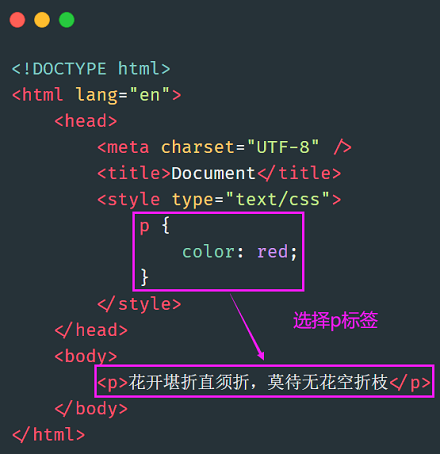
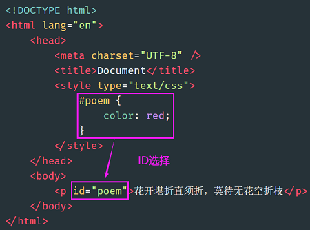
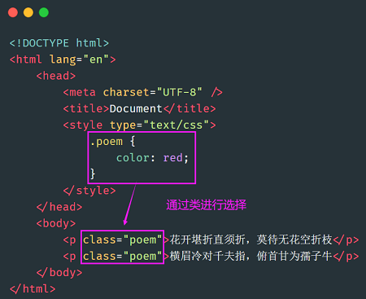
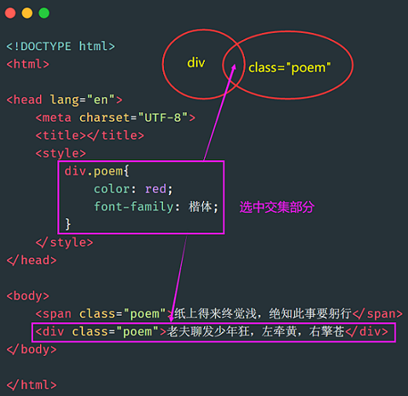
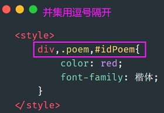
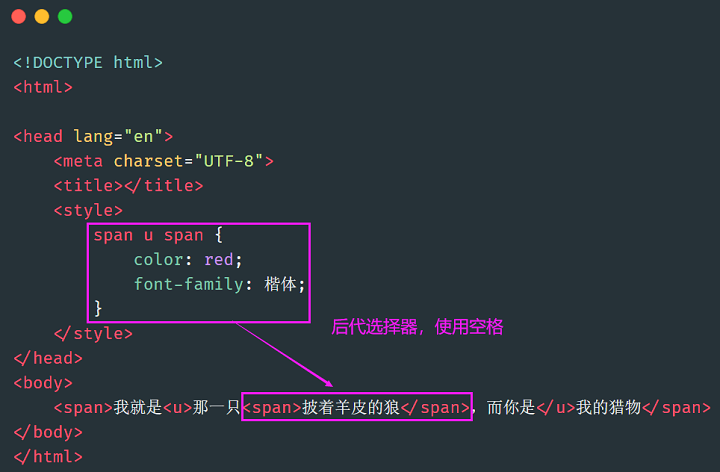
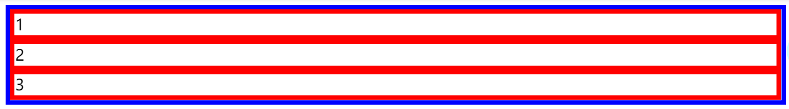
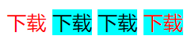
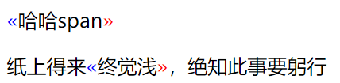

# CSS选择器汇总

## 基本选择器

### 标签选择器



### ID选择器



### 类选择器



> id 是 js 用的。也就是说，js 要通过 id 属性得到标签，所以 css 层面尽量不用 id，要不然 js 就很别扭。

# 集合选择器

### 交集选择器



### 并集选择器



## 伪类选择器

### 常规伪类选择器

伪类选择器分为两种。

（1）**静态伪类**：只能用于**超链接**的样式。如下：

- `:link` 超链接点击之前
- `:visited` 链接被访问过之后

以上两种样式，只能用于超链接。

（2）**动态伪类**：针对**所有标签**都适用的样式。如下：

- `:hover` “悬停”：鼠标放到标签上的时候

- `:active` “激活”： 鼠标点击标签，但是不松手时。

- `:focus` 是某个标签获得焦点时的样式（比如某个输入框获得焦点）

记住，在css中，这四种状态**必须按照固定的顺序写**，否则会失效。

```html
<!DOCTYPE html>
<html>

<head lang="en">
    <meta content="text/html;charset=UTF-8">
    <title>Document</title>
    <style type="text/css">
        * {
            margin: 0;
            padding: 0;
        }

        .nav {
            width: 960px;
            height: 50px;
            border: 1px solid red;
            margin: 100px auto;
        }

        .nav ul {
            /*去掉小圆点*/
            list-style: none;
        }

        .nav ul li {
            float: left;
            width: 120px;
            height: 50px;
            /*让内容水平居中*/
            text-align: center;
            /*让行高等于nav的高度，就可以保证内容垂直居中*/
            line-height: 50px;
        }

        .nav ul li a {
            display: block;
            width: 120px;
            height: 50px;
        }

        /*两个伪类的属性，可以用逗号隔开*/
        .nav ul li a:link,
        .nav ul li a:visited {
            text-decoration: none;
            background-color: purple;
            color: white;
        }

        .nav ul li a:hover {
            background-color: orange;
        }
    </style>
</head>

<body>
    <div class="nav">
        <ul>
            <li><a href="#">网站栏目</a></li>
            <li><a href="#">网站栏目</a></li>
            <li><a href="#">网站栏目</a></li>
            <li><a href="#">网站栏目</a></li>
            <li><a href="#">网站栏目</a></li>
            <li><a href="#">网站栏目</a></li>
            <li><a href="#">网站栏目</a></li>
            <li><a href="#">网站栏目</a></li>
        </ul>
    </div>
</body>

</html>
```


### 结构伪类选择器

child系列：

- `E:first-child`：第一个元素是E就匹配，不是就不匹配

- `E:last-child`：最一个元素是E就匹配，不是就不匹配

- `E:nth-child(n)`：第n个元素是E就匹配，不是就不匹配

- `E:nth-last-child(n)`：倒数第n个元素是E就匹配，不是就不匹配

- `E:only-child`：E是这层唯一的元素就匹配，不是就不匹配

type系列：

- `E:first-of-type`：匹配第一个E元素

- `E:last-child`：匹配最后一个E元素

- `E:nth-child(n)`：匹配第n个E元素

- `E:nth-last-child(n)`：匹配倒数第一个E元素

- `E:only-child`：匹配这层唯一的一个E元素

```html
<div>
    <p>第1个子元素</p>
    <h2>第2个子元素</h2>
    <span>第3个子元素</span>
    <span>第4个子元素</span>
</div>
```

- `p:first-child`：匹配到是p

- `h1:first-child`：匹配不到

- `span:first-child`：匹配不到

- `p:first-of-type`：匹配到是p

- `h1:first-of-type`：匹配到是h1

- `span:first-of-type`：匹配到是第一个span

## 关系选择器

### 空格

**后代选择器，描述的是一种祖先结构**。



### `>`


```html
<!--选择如下这种关系-->
<div>
  <p>……</p>
</div>
```

### 空格和`>`的区别

- `空格`是选所有后代
- `>`是只选子代

```html
<style>
    /* 选后代 */
    .demo div {
        border:5px solid red; 
    }
    /* 选子代 */
    .demo>div { 
        border:5px solid blue; 
    }
</style>
<div class="demo">
    <div>
        <div>1</div>
        <div>2</div>
        <div>3</div>
    </div>
</div>
```

得到结果：



### `~`

选择后面所有兄弟


### `+`


## 属性选择器

属性选择器的标志性符号是 `[]`。

匹配含义：

```
^：开头
$：结尾
*：包含
```

格式：

- `E[title]` ：选中页面的E元素，并且E**存在 title 属性**即可。

- `E[title="abc"]`：选中页面的E元素，并且E需要带有title属性，且属性值**完全等于abc。**

- `E[title^="abc"]` ：选中页面的E元素，并且E需要带有 title 属性，属性值**以 abc 开头**。

- `E[title$="abc"]` ：选中页面的E元素，并且E需要带有 title 属性，属性值**以 abc 结尾**。

- `E[title*="abc"]` ：选中页面的E元素，并且E需要带有 title 属性，属性值**任意位置包含abc。**

- `E[attr~=val]` ：选择具有 att 属性且属性值为：用空格分隔的字词列表，其中一个等于 val 的E元素。

- `E[attr|=val]` ：表示要么是一个单独的属性值，要么这个属性值是以“-”分隔的。

```html
<style>
    div span[class~="download"]{
        color: red;
    }
    div span[class|="download"]{
        background-color: aqua;
    }
</style>
<div>
    <span class="download download-movie">下载</span>
    <span class="download-music">下载</span>
    <span class="download-movie">下载</span>
    <span class="download">下载</span>
</div>
```



## 伪元素选择器

### before和after

```html
<style>
    span::before {
        content: "«";
        color: blue;
    }

    span::after {
        content: "»";
        color: red;
    }
</style>
<div>
    <span>哈哈span</span>
    <p>纸上得来<span>终觉浅</span>，绝知此事要躬行</p>
</div>
```



### 标签内样式

- `E::first-letter` ：设置元素 E 里面的**第一个字符**的样式。

- `E::first-line` ：设置元素 E 里面的**第一行**的样式。

- `E::selection` ：设置元素 E 里面**被鼠标选中的区域**的样式（一般设置颜色和背景色）。