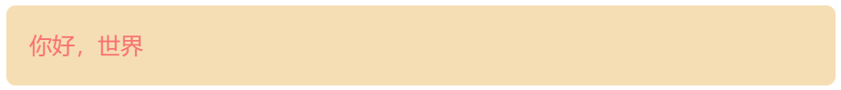
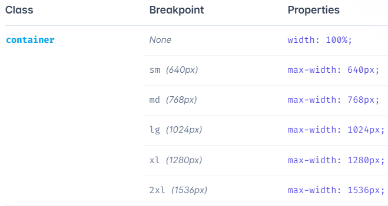
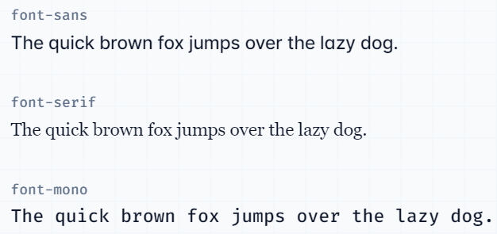
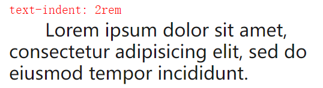
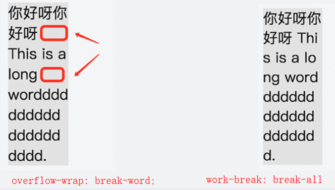
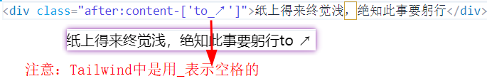
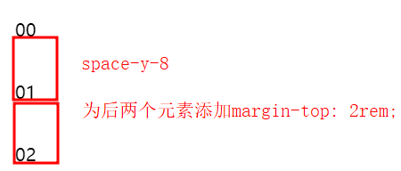
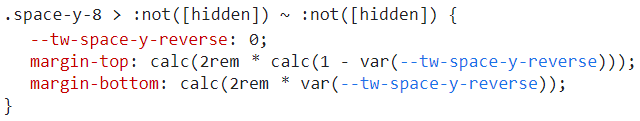
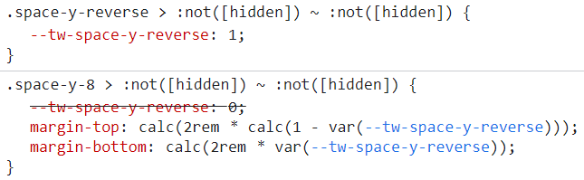
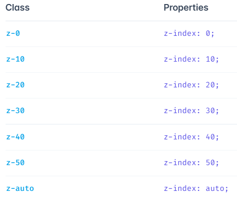

# TailwindCSS学习记录

## 概念

### 深色模式前缀

#### dark:

- `dark:`：深色模式

默认是未开启深色模式的，如果要全局启用的话在`tailwind.config.js`中把 `darkMode `选项设置为 `media`：

```javascript
// tailwind.config.js
module.exports = {
  darkMode: 'media',
  // ...
}
```
#### 变体联用

注意按照响应式、状态、dark的顺序排列：

```html
<button class="lg:dark:hover:bg-white ...">按钮</button>
```

#### 手动切换深色模式

要使用手动切换，必须将`darkMode`模式切换为`class`。现在 HTML 树中出现 dark 类时起作用。

```html
<html class="dark">
<body>
  <!-- Will be black -->
  <div class="bg-white dark:bg-black">
    <!-- ... -->
  </div>
</body>
</html>
```

一种常见的方式就是通过JavaScript在某个地方读取首选项并更新DOM

```javascript
// On page load or when changing themes, best to add inline in `head` to avoid FOUC
if (localStorage.theme === 'dark' || (!('theme' in localStorage) && window.matchMedia('(prefers-color-scheme: dark)').matches)) {
  document.documentElement.classList.add('dark')
} else {
  document.documentElement.classList.remove('dark')
}
// Whenever the user explicitly chooses light mode
localStorage.theme = 'light'
// Whenever the user explicitly chooses dark mode
localStorage.theme = 'dark'
// Whenever the user explicitly chooses to respect the OS preference
localStorage.removeItem('theme')
```

#### 注意事项

当使用类策略时，由于选择器包含一个额外的类，因而深色模式下样式可能出现一些问题。

如下代码中，使用media策略时，白色文本将会有50%的不透明度。如果使用class策略，`dark:text-white`会有更高的特异性，覆盖`text-opacity-50`，此时白色文本透明度为1。

```html
<div class="text-black text-opacity-50 dark:text-white">
  <!-- ... -->
</div>
```

因此在class策略时，代码要修改：

```html
<div class="text-black text-opacity-50 dark:text-white dark:text-opacity-50">
  <!-- ... -->
</div>
```

### 自定义样式

#### 配置文件中的样式

在`tailwind.config.js`中定义用户样式：
```javascript
module.exports = {
  theme: {
    screens: {
      sm: '480px',
      md: '768px',
      lg: '976px',
      xl: '1440px',
    },
    colors: {
      'blue': '#1fb6ff',
      'pink': '#ff49db',
      'orange': '#ff7849',
      'green': '#13ce66',
      'gray-dark': '#273444',
      'gray': '#8492a6',
      'gray-light': '#d3dce6',
    },
    fontFamily: {
      sans: ['Graphik', 'sans-serif'],
      serif: ['Merriweather', 'serif'],
    },
    extend: {
      spacing: {
        '128': '32rem',
        '144': '36rem',
      },
      borderRadius: {
        '4xl': '2rem',
      }
    }
  }
}
```

#### 使用任意值

1.通过`[]`方式传入属性值

```html
<div class="bg-[#bada55] text-[22px] before:content-['Festivus']">
  <!-- ... -->
</div>
```

2.使用`theme()`函数调用`tailwind.config.js`中的值

```html
<div class="grid grid-cols-[fit-content(theme(spacing.32))]">
  <!-- ... -->
</div>
```

3.通过`[]`方式传入任意属性

```html
<div class="[--scroll-offset:56px] lg:[--scroll-offset:44px]">
  <!-- ... -->
</div>
```

> 在Tailwind中，如果传入的属性有空格，要使用`_`：`class="bg-[url('/what_a_rush.png')]"`

#### 使用CSS和`@layer`

```css
@tailwind base;
@tailwind components;
@tailwind utilities;
```
1.base：部分全局生效

```css
@layer base {
  h1 {
    @apply text-2xl;
  }
  h2 {
    @apply text-xl;
  }
}
```

2.component

```css
@layer components{
  .card{
    font-size: 20px;
    background-color: wheat;
    border-radius: 8px;
    padding: 20px;
    margin: 20px;
  }
}
```

```html
<div class="card text-red-400">你好，世界</div>
```



3.自定义CSS的修饰符

```css
@layer utilities {
  .content-auto {
    content-visibility: auto;
  }
}
```

```html
<div class="lg:dark:content-auto">
  <!-- ... -->
</div>
```

### 函数与指令

#### `@tailwind`

使用`@tailwind`指令向您的 CSS 添加 Tailwind 的`base`、`components`、`utilities`和`variants`样式。

```css
/* 基础样式 */
@tailwind base;
/* 由插件注册的组件类 */
@tailwind components;
/* 由插件注册的使用工具类 */
@tailwind utilities;
/* 控制从哪里注入变体前缀，没有就添加默认变体类 */
@tailwind variants;
```

#### `@layer`

告诉Tailwind属于哪类样式

```css
@layer base {}
@layer components {}
@layer utilities {}
```

#### `@apply`

将任何现有的实用程序类内联到您自己的自定义 CSS 中

```css
.select2-dropdown {
  @apply rounded-b-lg shadow-md;
}
```

默认情况下，使用`@apply`会清除掉`!important`以避免特异性：

```css
/* 输入 */
.foo {
  color: blue !important;
}
.bar {
  @apply foo;
}

/* 输出 */
.foo {
  color: blue !important;
}
.bar {
  color: blue;
}
```

如果非要使用，则则是在`@apply`末尾添加：

```css
.btn {
  @apply font-bold py-2 px-4 rounded !important;
}
```

#### theme()

访问Tailwind配置的值，使用`.`或`[]`，不要使用`-`

```css
.content-area {
  height: calc(100vh - theme(spacing[2.5]));
}
```

### screen()

允许您创建按名称引用断点的媒体查询，而不是在您自己的 CSS 中复制它们的值。

```css
@media screen(sm) {}
```

## 公用

### 颜色

在Tailwind中有自己的一套颜色设计：[https://tailwindcss.com/docs/customizing-colors](https://tailwindcss.com/docs/customizing-colors)。写下常用的：

- gray：灰色
- red：红色
- orange：橙色
- yellow：黄色
- lime：绿黄色
- green：绿色
- emerald：翠绿色
- teal：蓝绿色
- cyan：青色
- sky：天蓝色
- blue：蓝色
- violet：紫罗兰色
- purple：紫色
- fuchsia：紫红色
- pink：粉色
- rose：玫瑰色
- white：白色
- black：黑色

除了white和black，值可以取50、100、200、300、400、500、600、700、800、900

### 尺寸

#### 英文尺寸

1. xs这个尺寸有些属性是没有的，建议最小用sm即可。
2. 英文尺寸在不同属性下的值是不同的。

- xs
- sm
- 默认（base）
- md
- lg
- xl
- 2xl

#### 容器尺寸



#### 数字尺寸

**4以下0.5刻度，12以下1刻度，16以下2刻度，64以下4刻度，80以下8刻度，96以下16刻度。1刻度=0.25rem。**

### 方位

- t：top
- b：bottom
- l：left
- r：right
- tl、tr：左上、右上
- bl、br：左下、右下
- x：横向坐标，有时代指左右
- y：纵向坐标

## Tail属性

### 背景

#### background-color

- bg-inherit
- bg-transparent：透明
- bg-black
- bg-white
- bg-red-500

```html
<div class="bg-violet-500"></div>
<!-- 带有透明度的颜色 -->
<div class="bg-violet-500/75"></div>
<div class="bg-sky-500/[.06]"></div>
<!-- 自定义颜色 -->
<div class="bg-[#50d71e]"></div>
```

#### background-image

渐变色：

- bg-gradient-to-*
   - t：to top
   - b：to bottom
   - r：to right
   - l：to left
   - tr：to top right
   - bl：to bottom left

```html
<!-- 从sky-500渐变到indigo-500 -->
<div class="h-14 bg-gradient-to-r from-sky-500 to-indigo-500"></div>
```

自定义图片：

```html
<div class="bg-[url('/img/hero-pattern.svg')]"></div>
```

### 文本

#### font-size

- text-xs：`font-size: 0.75rem; line-height: 1rem;`
- text-sm
- text-base：`font-size: 1rem; line-height: 1.5rem;`
- text-lg
- text-xl：`font-size: 1.25rem; line-height: 1.75rem;`
- text-(2~9)xl

```html
<p class="text-base">文本</p>
<!-- 自定义字体大小 -->
<p class="text-[14px]">文本</p>
```

#### font-weight

- font-thin：`font-weight: 100;`
- font-light：`font-weight: 300;`
- font-medium：`font-weight: 500;`
- font-bold：`font-weight: 700;`
- font-black：`font-weight: 900;`

```html
<p class="font-light">文本</p>
<!-- 自定义字体粗细 -->
<p class="font-[1100]">文本</p>
```

#### font-family

- font-sans
- font-serif
- font-mono



```html
<p class="font-sans">文本</p>
<p class="font-['Open_Sans']">文本</p>
```

#### line-height

相对量：

- leading-none：`line-height: 1;`
- leading-normal：`line-height: 1.5;`行高是字体的1.5倍
- leading-loose：`line-height: 2;`

绝对量，每多1就增加`0.25rem`：

- leading-3：`line-height: .75rem;`最小
- leading-4：`line-height: 1rem;`
- leading-6：`line-height: 1.5rem;`
- leading-10：`line-height: 2.5rem;`最大

```html
<p class="leading-loose">文本</p>
<p class="leading-[3rem]">文本</p>
```
#### color

和背景色类似，只不过是以`text-`开头，也**支持透明度和自定义**

- text-inherit
- text-transparent：透明
- text-black
- text-white
- text-red-500

#### text-align

- text-left
- text-center：`text-align: center;`
- text-right
- text-justify
- text-start
- text-end

#### text-overflow

- truncate：即`overflow: hidden;text-overflow: ellipsis;white-space: nowrap;`的组合，用于**行内省略**。
- text-ellipsis：`text-overflow: ellipsis;`
- text-clip：`text-overflow: clip;`

#### text-indent

该属性用于控制文本开头多少间距

- indent-4：`text-indent: 1rem;`



#### word-break和overflow-wrap

::: tip
Tailwind将两属性合并了

word-break有三个值：
- normal：CJK文本（即 Chinese/Japanese/Koean）插入换行，其他不插入
- break-all：所有文本都插入换行
- keep-all：所有文本都不插入换行

overflow-wrap有两个值：

- normal：CJK文本插入换行，其他不插入
- anywhere：任何地方都能插入换行
- break-word：会在单词中插入换行


:::

在Tailwind中就不用区分两者区别了，只有如下三个属性值：

- break-normal：`overflow-wrap: normal;word-break: normal;`以CJK逻辑换行
- break-words：`overflow-wrap: break-word;`所有都换行，以空格换下行
- break-all：`word-break: break-all;`所有都换行，切割单词的换行

#### white-space

`white-space`可以管辖`word-break`和`overflow-wrap`

::: tip
white-space的值可以是如下，这里最好查阅MDN：
- normal：这时work-break和overflow-wrap可以生效
- nowrap：不换行，两者失效
- pre：以句换行
- pre-wrap
- pre-line
:::

- whitespace-normal
- whitespace-nowrap
- whitespace-pre
- whitespace-pre-line
- whitespace-pre-wrap

#### content

传统的CSS中content常常和伪元素联合使用，在Tailwind中也类似：

```html
<div class="after:content-['to_↗']">纸上得来终觉浅，绝知此事要躬行</div>
```



### 边框

#### border-width

- border：`border-width: 1px;`
- border-0：`border-width: 0px;`
- border-4：`border-width: 4px;`
- border-x-0：`border-left-width: 0px;border-right-width: 0px;`
- border-y-0：`border-top-width: 0px;border-bottom-width: 0px;`
- border-t-0：`border-top-width: 0px;`
- border-r-0：`border-right-width: 0px;`
- border-b-0：`border-bottom-width: 0px;`
- border-l-0：`border-left-width: 0px;`

参数只能是0、2、4、8，如果啥都不加就是1px

#### border-color

和背景色类似，只不过是以`border-`开头，也**支持透明度和自定义**

- border-inherit
- border-transparent：透明
- border-black
- border-white
- border-red-500

除了上述，还支持某条边设置颜色，格式即`border-{side}-{color}`：

- border-t-red-500：顶边设置为颜色red-500
- border-x-red-500：左右边设置为颜色red-500

#### border-radius

- rounded-none：`border-radius: 0rem;`
- rounded-sm：`border-radius: 0.125rem;`
- rounded：`border-radius: 0.25rem;`
- rounded-md：`border-radius: 0.375rem;`
- rounded-lg：`border-radius: 0.5rem;`
- rounded-xl：`border-radius: 0.75rem;`
- rounded-2xl：`border-radius: 1rem;`
- rounded-3xl：`border-radius: 1.5rem;`
- rounded-full：`border-radius: 9999px;`

同样可以带上方向：

- rounded-t-none：`border-top-left-radius: 0px;border-top-right-radius: 0px;`
- rounded-tl-none：`border-top-left-radius: 0px;`

### 尺寸

#### width和height

两者是类似的，w对应width，h对应height：

- w-0：`width: 0;`
- w-4：`width: 1rem;`
- w-px：`width: 1px;`
- w-auto：`width: auto;`
- w-1/4：`width: 25%;`
- w-full：`width: 100%;`
- w-screen：`width: 100vw;`
- w-min：`width: min-content;`
- w-max：`width: max-content;`
- w-fit：`width: fit-content;`

#### min-width和min-height

如下属性，height就是把w换成h

- min-w-0：`min-width: 0px;`
- min-w-full：`min-width: 100%;`
- min-w-min：`min-width: min-content;`
- min-w-max：`min-width: max-content;`
- min-w-fit：`min-width: fit-content;`

#### max-width和max-height

> 这俩区别就比之前的大了。

max-height：

- max-w-0：`max-width: 0px;`
- max-w-none：`max-width: none;`
- max-w-full：`max-width: 100%;`
- max-w-min：`max-width: min-content;`
- max-w-max：`max-width: max-content;`
- max-w-fit：`max-width: fit-content;`
- max-w-xs：`max-width: 20rem;`
- max-w-sm：`max-width: 24rem;`
- max-w-md：`max-width: 28rem;`
- max-w-lg：`max-width: 32rem;`
- max-w-xl：`max-width: 36rem;`
- max-w-7xl：`max-width: 80rem;`
- max-w-screen-sm：`max-width: 640px;`
- max-w-screen-md：`max-width: 768px;`
- max-w-screen-lg：`max-width: 1024px;`
- max-w-screen-xl：`max-width: 1280px;`
- max-w-screen-2xl：`max-width: 1536px;`

max-height：

- max-h-0：`max-height: 0px;`
- max-h-full：`max-height: 100%;`
- max-h-min：`max-height: min-content;`
- max-h-max：`max-height: max-content;`
- max-h-fit：`max-height: fit-content;`
- max-h-px：`max-height: 1px;`
- max-h-4：`max-height: 1rem;`

#### padding

- p-0：`padding: 0px;`
- pt-0：`padding-top: 0px;`
- py-0：`padding-top: 0px; padding-bottom: 0px;`

#### margin

- m-0：`margin: 0px;`
- mt-0：`margin-top: 0px;`
- my-0：`margin-top: 0px; margin-bottom: 0px;`

#### space between

原生CSS中是没有space的，Tailwind中是通过margin来实现的，实现的原理是对处第一个字元素都添加margin-left或margin-top的值

- space-x-1：横方向分割，尺寸为0.25rem
- space-y-4：纵方向分割，尺寸为1rem
- space-x-reverse：横方向翻转，变成margin-right生效
- space-y-reverse：纵方向翻转，变成margin-bottom生效

```html
<div class="flex flex-col space-y-8 m-4">
  <div>00</div>
  <div>01</div>
  <div>02</div>
</div>
```



01和02元素的原生CSS如下：



```html
<!-- 添加了space-y-reverse -->
<div class="flex flex-col space-y-8 space-y-reverse m-4">
  <div>00</div>
  <div>01</div>
  <div>02</div>
</div>
```



### 布局
#### box-sizing

- box-content：`box-sizing: content-box;`标准盒子模型，默认值。
- box-border：`box-sizing: border-box;`怪异盒子模型

#### display

- inline
- block
- inline-block
- flex
- grid
- hidden：`display: none;`

#### position

- static
- absolute
- relative
- fixed
- sticky

#### float

- float-none
- float-left
- float-right

#### overflow

- overflow-auto
- overflow-hidden
- overflow-visible
- overflow-scroll
- overflow-x-scroll：`overflow-x: scroll;`
- overflow-y-hidden：`overflow-y: hidden;`

#### left/right/top/bottom

- inset-1：`top: 0.25rem; right: 0.25rem; bottom: 0.25rem; left: 0.25rem;`四个方位
- inset-x-1：`right: 0.25rem; left: 0.25rem;`x轴方位
- top-1
- right-1
- bottom-1
- left-1
- inset-1/2：`top: 50%; right: 50%; bottom: 50%; left: 50%;`
- inset-full：`top: 100%; right: 100%; bottom: 100%; left: 100%;`

#### visibility

- visible：`visibility: visible;`
- invisible

#### z-index



### 弹性盒子

#### flex

flex-direction：

- flex-row
- flex-row-reverse
- flex-col
- flex-col-reverse

flex-wrap：

- flex-nowrap
- flex-wrap
- flex-wrap-reverse

justify/align-content：主轴/交叉轴的对齐方式

- justify-start（content-start）
- justify-center（content-center）
- justify-end（content-end）
- justify-between（content-between）
- justify-around（content-around）
- justify-evenly（content-evenly）

justify/align-items：主轴/交叉轴上项目的对齐方式

- justify-items-start（items-start）
- justify-items-center（items-center）
- justify-items-end（items-end）
- justify-items-stretch（items-stretch）
- items-baseline【只有交叉轴上才有】

flex-grow：

- grow：`flex-grow: 1;`
- grow-0：`flex-grow: 0;`

flex-shrink：

- shrink：`flex-shrink: 1;`
- shrink-0：`flex-shrink: 0;`

flex：

- flex-1：`flex: 1 1 0%;`
- flex-auo：`flex: 1 1 auto;`
- flex-initial：`flex: 0 1 auto;`
- flex-none：`flex: none;`

```html
<div class="flex-[2_2_0%]"></div>
```

order：

- order-first：`order: -9999;`
- order-last：`order: 9999;`
- order-none：`order: 0;`
- order-1：`order: 1;`

gap：

- gap-4：`gap: 1rem;`
- gap-x-4：`column-gap: 1rem;`
- gap-y-4：`row-gap：1rem;`

#### grid


