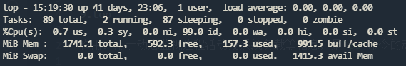
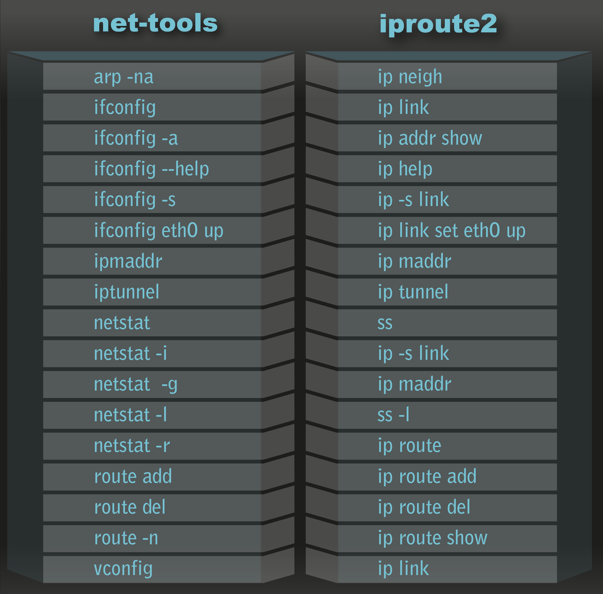

# Linux入门——介绍与基础命令

## 系统初始化

### 进程初始化

Linux系统开机过程：从BIOS开始，进入Boot Loader，再加载系统内核，然后内核进行初始化，最后启动初始化进程。初始化进程作为Linux系统启动后第一个正式服务，需要完成Linux系统中相关初始化工作，为用户提供合适的工作环境。

运行目标模式（systemd目标名称）：

- `poweroff.target`：关机
- `rescue.tareget`：单用户模式
- `multi-user.target`：多用户文本界面
- `graphical.target`：多用户图形界面
- `reboot.target`：重启
- `emergency.target`：救援模式

> 可用通过ln命令把多用户模式目标文件链接到`/etc/systemd/system`目录：`ln -sf /lib/systemd/system/multi-user.target /etc/systemd/system/default.target`

使用systemctl命令管理服务：

- `systemctl start httpd`：启动服务
- `systemctl restart httpd`：重启服务
- `systemctl stop httpd`：停止服务
- `systemctl reload httpd`：重新加载配置文件，不终止服务
- `systemctl status httpd`：查看服务状态
- `systemctl enable httpd`：开机自启动
- `systemctl disable httpd`：开机不自启动
- `systemctl is-enabled httpd`：查看服务是否开机自启动
- `systemctl list-unit-files --type=httpd`：查看各个级别下服务的启动和禁用情况

### 重置root密码

#### Red Hat

1. 重启Linux系统主机并出现引导界面时，按下键盘上的e键进入内核编辑界面。
2. 在linux参数这行的最后面追加`rd.break`参数，然后按下`Ctrl + X`组合键运行修改过的内核程序。
3. 30秒过后，系统会进入紧急救援模式。
4. 然后依次输入以下命令，再连续按下两次`Ctrl + D`组合键盘来退出并重启。

```bash
mount -o remount,rw /sysroot
chroot /sysroot
passwd
touch /.autorelabel
```

## Linux命令

### 常用系统工作命令

1.echo

作用：输出字符串或变量提取后的值。

```bash
# 输出字符串
echo www.baidu.com
# 输出变量
echo $SHELL
```

2.date

作用：显示或设置系统的时间与日期。

```bash
date
# 以YYYY-MM-DD HH:mm:ss格式查看系统时间
date "+%Y-%m-%d %H:%M:%S"
# 设置系统时间
date -s "20201101 8:30:00"
# 查看今天是当年第几天
date "+%j"
```

3.timedatectl

作用：设置系统时间。

| 参数 | 作用 |
| --- | --- |
| status | 显示状态信息 |
| list-timezones | 列出已知时区 |
| set-time | 设置系统时间 |
| set-timezone | 设置生效市区 |

```bash
# 显示时间状态相关信息
timedatectl status
# 列出已知时区
timedatectl list-timezones
# 设置时区
timedatectl set-timezone Asia/Shanghai
# 设置系统时间
timedatectl set-time 2021-05-18
```

4.reboot：重启。由于会涉及硬件资源的管理权限，最好是以root管理员身份来重启。

5.poweroff：关闭系统。由于会涉及硬件资源的管理权限，最好是以root管理员身份来重启。

6.wget

作用：下载文件。

| 参数 | 作用 |
| --- | --- |
| -b | 后台下载模式 |
| -P | 下载到指定目录 |
| -t | 最大尝试次数 |
| -c | 断点续传 |
| -p | 下载页面内所有资源，包括图片、视频等 |
| -r | 递归下载 |

```bash
# 递归下载网站内所有页面数据及文件，完成后自动保存到名为www.linuxprobe.com的目录中
wget -r -p https://www.linuxprobe.com
```

7.ps命令

作用：查看系统中进程状态。

| 参数 | 作用 |
| --- | --- |
| -a | 显示所有进程（包括其他用户的进程） |
| -u | 用户以及其他详细信息 |
| -x | 显示没有控制终端的进程 |

Linux系统中进程状态：

- R（运行）：进程正在运行或在运行队列中等待。
- S（中断）：进程处于休眠中，当某个条件形成后或者接收到信号时，则脱离该状态。
- D（不可中断）：进程不响应系统异步信号，即便用kill命令也不能将其中断。
- Z（僵死）：进程已经终止，但进程描述符依然存在, 直到父进程调用`wait4()`系统函数后将进程释放。
- T（停止）：进程收到停止信号后停止运行。

除了上面 5 种常见的进程状态，还有可能是高优先级（<）、低优先级（N）、被锁进内存（L）、包含子进程（s）以及多线程（l）这 5 种补充形式。

执行`ps -au`可得：

```
USER         PID %CPU %MEM    VSZ   RSS TTY      STAT START   TIME COMMAND
root         765  0.0  0.0   5848   112 tty1     Ss+  Feb20   0:00 /sbin/agetty -o -p -- \u --noclear tty1 linux
root         771  0.0  0.0   5480   120 ttyS0    Ss+  Feb20   0:00 /sbin/agetty -o -p -- \u --keep-baud 115200,57600,38400,9600 ttyS0 vt220
zhengyu   140033  0.0  0.2   8168  4952 pts/0    Ss   14:38   0:00 -bash
root      140036  0.0  0.2   9992  4860 pts/0    S    14:38   0:00 su root
root      140037  0.0  0.2   7304  4124 pts/0    S    14:38   0:00 bash
root      140083  0.0  0.1   9760  3292 pts/0    R+   14:55   0:00 ps -au
```

| 表头 | 含义 |
| --- | --- |
| USER | 进程所有者 |
| PID | 进程ID号 |
| %CPU | CPU占用率 |
| %MEM | 内存占用率 |
| VSZ | 虚拟内存使用量（单位KB） |
| RSS | 占用的固定内存量（单位KB） |
| TTY | 所在终端（单位KB） |
| STAT | 进程状态 |
| START | 被启动的时间 |
| TIME | 实际使用CPU的时间 |
| COMMAND | 命令名称与参数 |

::: danger
Linux命令有长短格式之分，长格式与长格式、长格式与短格式之间不能合并，但短格式和短格式之间是可以合并的。
:::

8.pstree

作用：以树状图形式展示进程之间关系。

::: warning
在Debian上默认是没有的，需要安装：`sudo apt install psmisc`。
:::

```bash
pstree
```

9.top

作用：用于动态监视进程活动及系统负载等信息，是`ps`命令的动态加强版。



- Line 1：系统时间、运行时间、登录终端数、系统负载（3个数值分别为 1 分钟、5分钟、15分钟内的平均值，数值越小意味着负载越低）。
- Line 2：进程总数、运行中的进程数、睡眠中的进程数、停止的进程数、僵死的进程数。
- Line 3：用户占用资源百分比、系统内核占用资源百分比、改变过优先级的进程资源百分比、空闲的资源百分比等。其中数据均为 CPU 数据并以百分比格式显示，例如“99.9 id”意味着有99.9%的CPU处理器资源处于空闲。
- Line 4：物理内存总量、内存空闲量、内存使用量、作为内核缓存的内存量。
- Line 5：虚拟内存总量、虚拟内存空闲量、虚拟内存使用量、已被提前加载的内存量。

多了PR、NI两列，代表进程优先级，数字越低，优先级越高，取值范围是`-10~19`。

10.nice

作用：调整进程优先级。

```bash
# 将bash服务优先级调整到最高
nice -n -20 bash
```

11.pidof命令

作用：查询指定服务进程的PID号码值。

```bash
# 查询sshd服务程序的PID
pidof sshd
```

12.kill

作用：终止指定PID值的服务进程。

```bash
kill 2156
```

13.killall

作用：终止某个指定名称服务对应的全部进程。复杂的软件应用程序会有多个进程协同服务，用kill命令逐个结束进程会太麻烦，这时候可以用killall批量结束某个服务程序带有的全部进程。

```bash
killall httpd
```

### 系统状态检测命令

1.ip

::: danger
Debian默认未安装ifconfig包，这是因为不建议使用net-tools工具箱了，包括arp、hostname、ifconfig、netstat、rarp、route、plipconfig、slattach、mii-tool、iptunnel、ipmaddr等命令，这些要被iproute2取代了。


:::

作用：显示或操纵Linux主机的路由、网络设备、策略路由和隧道，是Linux下较新的功能强大的网络配置工具。

| 参数 | 作用 |
| --- | --- |
| -s | 输出更详细的信息 |
| -f | 强制使用指定的协议族 |
| -r | 显示主机时，不使用IP地址，而使用主机的域名 |
| -4 | 指定使用的网络层协议是IPv4协议 |
| -6 | 指定使用的网络层协议是IPv6协议 |

```bash
ip link show                    # 显示网络接口信息
ip link set eth0 up             # 开启网卡
ip link set eth0 down            # 关闭网卡
ip link set eth0 promisc on      # 开启网卡的混合模式
ip link set eth0 promisc offi    # 关闭网卡的混合模式
ip link set eth0 txqueuelen 1200 # 设置网卡队列长度
ip link set eth0 mtu 1400        # 设置网卡最大传输单元
ip addr show     # 显示网卡IP信息
ip addr add 192.168.0.1/24 dev eth0 # 为eth0网卡添加一个新的IP地址192.168.0.1
ip addr del 192.168.0.1/24 dev eth0 # 为eth0网卡删除一个IP地址192.168.0.1
ip route show # 显示系统路由
ip route add default via 192.168.1.254   # 设置系统默认路由
ip route list                 # 查看路由信息
ip route add 192.168.4.0/24  via  192.168.0.254 dev eth0 # 设置192.168.4.0网段的网关为192.168.0.254,数据走eth0接口
ip route add default via  192.168.0.254  dev eth0        # 设置默认网关为192.168.0.254
ip route del 192.168.4.0/24   # 删除192.168.4.0网段的网关
ip route del default          # 删除默认路由
ip route delete 192.168.1.0/24 dev eth0 # 删除路由
ip neigh list                 # 显示邻居表
```

2.ss

作用：显示处于活动状态的套接字信息。

| 参数 | 作用 |
| --- | --- |
| -n | 不解析服务名称 |
| -r | 解析主机名 |
| -a | 显示所有套接字（sockets） |
| -l | 显示监听状态的套接字（sockets） |
| -o | 显示计时器信息 |
| -e | 显示详细的套接字（sockets）信息 |
| -m | 显示套接字（socket）的内存使用情况 |
| -p | 显示使用套接字（socket）的进程 |
| -i | 显示 TCP内部信息 |
| -s | 显示套接字（socket）使用概况 |
| -4 | 仅显示IPv4的套接字（sockets） |
| -6 | 仅显示IPv6的套接字（sockets） |
| -0 | 显示 PACKET 套接字（socket） |
| -t | 仅显示 TCP套接字（sockets） |
| -u | 仅显示 UCP套接字（sockets） |
| -d | 仅显示 DCCP套接字（sockets） |
| -w | 仅显示 RAW套接字（sockets） |
| -x | 仅显示 Unix套接字（sockets） |
| -f | `--family=FAMILY`，显示FAMILY类型的套接字（sockets），FAMILY可选，支持unix、inet、inet6、link、netlink |
| -A | `--query=QUERY`, `--socket=QUERY`。`QUERY`可以为`all`、`inet`、`tcp`、`udp`、`raw`、`unix`、`packet`、`netlink` |
| -D | `--diag=FILE`。将原始TCP套接字（sockets）信息转储到文件 |
| -F | `--filter=FILE`。从文件中都去过滤器信息。`FILTER := [ state TCP-STATE ] [ EXPRESSION ]` |

```bash
ss -t -a    # 显示TCP连接
ss -s       # 显示 Sockets 摘要
ss -l       # 列出所有打开的网络连接端口
ss -pl      # 查看进程使用的socket
ss -lp | grep 3306  # 找出打开套接字/端口应用程序
ss -u -a    显示所有UDP Sockets
ss -o state established '( dport = :smtp or sport = :smtp )' # 显示所有状态为established的SMTP连接
ss -o state established '( dport = :http or sport = :http )' # 显示所有状态为Established的HTTP连接
ss -o state fin-wait-1 '( sport = :http or sport = :https )' dst 193.233.7/24  # 列举出处于FIN-WAIT-1状态的源端口为80或者443，目标网络为193.233.7/24所有tcp套接字
ss -4 state closing             # 用TCP状态过滤Sockets
ss state all sport = :ssh       # 列出所有端口为22（ssh）的连接
```

3.uname

作用：查看系统内核版本及系统架构信息。

```bash
uname -a
```

输出`Linux debian11 5.10.0-21-amd64 #1 SMP Debian 5.10.162-1 (2023-01-21) x86_64 GNU/Linux`。依次为：内核名称、主机名、内核发行版本、节点名、压制时间、硬件名称、硬件平台、处理器类型以及操作系统名称。

4.uptime

作用：查看系统负载信息。

```bash
uptime
```

::: tip
“负载值越低越好”是对运维人员来讲的，越低表示越安全省心。但是公司购置的硬件设备如果长期处于空闲状态，则明显是种资源浪费。所以建议负载值保持在1左右，在生产环境中不要超过5就好。
:::

5.free

作用：显示当前系统中内存使用量信息。

执行`free -h`可得：

```
               total        used        free      shared  buff/cache   available
Mem:           1.7Gi       157Mi       591Mi       1.0Mi       992Mi       1.4Gi
Swap:             0B          0B          0B
```

| 表头 | 含义 |
| --- | --- |
| total | 内存总量 |
| used | 已用量 |
| free | 空闲量 |
| shared | 进程共享的内存量 |
| buff/cache | 磁盘缓存的内存量 |
| available | 可用量 |

6.who

作用：查看当前登入主机的用户终端信息。

执行`who`可得：

```
zhengyu  pts/0        2023-04-03 14:38 (124.78.24.59)
```

依次为登录用户名、终端设备、登录到系统的时间。

7.last

作用：调取主机被访问记录。

```bash
last
```

8.ping

作用：测试主机之间的网络连通性。

| 参数 | 作用 |
| --- | --- |
| -c | 总共发送次数 |
| -l | 指定网卡名称 |
| -I | 每次间隔时间（秒） |
| -W | 最长等待时间（秒） |

```bash
# 发送4次请求
ping -c 4 www.baidu.com
```

9.history

作用：显示执行过的命令历史。

这些记录保存在`~/.bash_history`中，可以通过`cat ~/.bash_history`查看。

要清空当前用户在本机上执行的Linux命令，可以执行`history -c`。

### 查找定位文件命令

1.pwd

作用：显示用户当前所处的工作目录。

2.cd

作用：切换当前工作路径。

```bash
# 切换到家目录
cd ~
# 返回到上次目录
cd -
```

3.ls

作用：显示目录中的文件信息。

| 参数 | 作用 |
| --- | --- |
| -a | 查看全部文件（包括隐藏文件） |
| -l | 查看文件属性、大小等详情信息 |
| -d | 查看目录信息 |

```bash
ls -al
ls -ld /etc
```

4.tree

作用：以树状图形式列出目录内容及结构。

::: warning
Debian默认是没有tree命令的，需要安装`sudo apt install tree`。
:::

5.find

作用：根据指定条件查找文件。

| 参数 | 作用 |
| --- | --- |
| -name | 匹配名称 |
| -perm | 匹配权限（mode 为完全匹配，-mode 为包含即可）|
| -user | 匹配所有者 |
| -group | 匹配所属组 |
| -mtime -n +n | 匹配修改内容的时间（-n 指 n 天以内，+n 指 n 天以前）|
| -atime -n +n | 匹配访问文件的时间（-n 指 n 天以内，+n 指 n 天以前）|
| -ctime -n +n | 匹配修改文件权限的时间（-n 指 n 天以内，+n 指 n 天以前）|
| -nouser | 匹配无所有者的文件 |
| -nogroup | 匹配无所属组的文件 |
| -newer f1 !f2 | 匹配比文件f1新但比f2旧的文件 |
| --type b/d/c/p/l/f | 匹配文件类型（后面的字母依次表示块设备、目录、字符设备、管道、链接文件、文本文件）|
| -size | 匹配文件的大小（+50KB为查找超过50KB的文件，而-50KB为查找小于50KB的文件）|
| -prune | 忽略某个目录 |
| -exec…… {}\; | 后面可跟用于进一步处理搜索结果的命令（下文会有演示）|

```bash
# 查找/etc目录下名称前缀为host的文件
find /etc -name "host*"
# 查找/目录下权限中包括SUID权限的文件
find / -perm -4000 -print
# 查找/目录下用户为linuxprobe的文件，并复制到/root/findresults目录中。注意命令行结尾必须是\;
find / -user linuxprobe -exec cp -a {} /root/findresults/ \;
```

6.whereis

作用：按照名称快速搜索二进制程序（命令）、源代码以及帮助文件所对应的位置。

```bash
# 查找ls和pwd命令的位置
whereis ls
whereis pwd
```

7.which

作用：按照指定名称快速搜索二进制程序（命令）所对应的位置。

```bash
which whereis
```

### 文本文件编辑命令


1.cat

作用：查看内容较少的纯文本文件。

```bash
# 查看test.js文件，并显示行号
cat -n test.js
```

2.more

作用：查看内容较多的纯文本文件。会显示百分比提示阅读进度，还可以用空格或回车向下翻页。

3.head

作用：查看纯文本文件的前N行。

```bash
head -n 10 test.js
```

4.tail

作用：查看纯文本文件的后N行或持续刷新文件的最新内容。tail最强功能是能持续刷新一个文件的内容，比如可以实时查看日志内容。

```bash
tail -n 10 test.js
```

5.tr

作用：替换文本内容中的字符。

```bash
# 把英文全部换成大写
cat test.js | tr [a-z] [A-Z]
```

6.wc

作用：统计指定文件行数、字数、字节数。

| 参数 | 作用 |
| --- | --- |
| -l | 只显示行数 |
| -w | 只显示单词数 |
| -c | 只显示字节数 |

```bash
# 统计有多少个用户，巧用
wc -l /etc/passwd
```

7.stat

作用：查看文件具体存储细节和时间等信息。

```
  File: index.html
  Size: 366             Blocks: 8          IO Block: 4096   regular file
Device: fe01h/65025d    Inode: 1052506     Links: 1
Access: (0644/-rw-r--r--)  Uid: ( 1000/ zhengyu)   Gid: ( 1000/ zhengyu)
Access: 2023-04-03 18:15:16.605347433 +0800
Modify: 2023-02-19 19:50:56.337233032 +0800
Change: 2023-02-19 19:50:56.337233032 +0800
 Birth: 2023-02-19 19:50:56.337233032 +0800
```

8.grep

作用：按行提取文本内容。

| 参数 | 作用 |
| --- | --- |
| -i | 不区分大小写 |
| -r | 递归搜索整个目录 |
| -w | 只匹配整个单词 |
| -n | 输出匹配行所在的行号 |
| -v | 反向选择——输出不匹配的行 |
| --exclude | 排除某些文件 |
| --exclude-dir | 排除某些目录 |
| --include | 包含某些文件或目录 |

比如输入`grep html index.html`得到：

```
<!DOCTYPE html>
<html lang="en">
</html>
```

```bash
# 递归搜索该目录下的APITable字段，不区分大小写，排除*.log文件
grep -rni "APITable" ./ --exclude="*.log"
# 递归搜索docs/readme/zh-CN/下的apitable字段，区分大小写，排除contribute目录
grep -rn "apitable" docs/readme/zh-CN/ --exclude=contribute
# 排除多个文件或目录的写法
grep -rn "apitable" ./ --exclude="*.log" --exclude="*.txt"
grep -rn "apitable" ./ --exclude=*.{log,txt} --exclude-dir={node_modules,vendor}
# 匹配正则表达式/api[1-9]{0,2}/
grep -rn "api[1-9]\{0,2\}" docs/test.md 
```

9.cut

作用：按列提取文本内容。

| 参数 | 作用 |
| --- | --- |
| -c | 以字符为单位进行分割 |
| -b | 以字节为单位进行分割 |
| -d | 自定义分隔符，默认为制表符“TAB” |
| -f | 显示指定字段的内容 |
| -n | 取消分割多字节字符 |

比如passwd文件就是规整的像`root:x:0:0:root:/root:/bin/bash`这样的文本，可以通过cut命令取出前缀。

```bash
# 以:分隔，取出第一列
cut -d : -f 1 /etc/passwd
```

10.diff

作用：用于比较多个文件之间内容的差异。

```bash
# 判断文件是否相同
diff --brief diff_A.txt diff_B.txt
# 描述具体不同
diff -c diff_A.txt diff_B.txt
```

11.uniq

作用：去除文本中连续的重复行。

12.sort

作用：对文本内容排序。

| 参数 | 作用 |
| --- | --- |
| -f | 忽略大小写 |
| -b | 忽略缩进与空格 |
| -n | 以数值型排序 |
| -r | 反向排序 |
| -u | 去除重复行 |
| -t | 指定间隔符 |
| -k | 设置字段范围 |

比如文件`test.txt`有内容：

```
tss:x:59:59: used by the trousers package to sandbox the tcsd daemon
polkitd:x:998:996:User for polkitd
geoclue:x:997:995:User for geoclue
rtkit:x:172:172:RealtimeKit
pulse:x:171:171:PulseAudio System Daemon
qemu:x:107:107:qemu user
usbmuxd:x:113:113:usbmuxd user
unbound:x:996:991:Unbound DNS resolver
rpc:x:32:32:Rpcbind Daemon
gluster:x:995:990:GlusterFS daemons
```

那么可以执行`sort -t : -k 3 -n test.txt`排序。字段间通过`:`分隔，字段范围设置为第3段，以数值型排序。排完后：

```
rpc:x:32:32:Rpcbind Daemon
tss:x:59:59:used by the trousers package to sandbox the tcsd daemon
qemu:x:107:107:qemu user
usbmuxd:x:113:113:usbmuxd user
pulse:x:171:171:PulseAudio System Daemon
rtkit:x:172:172:RealtimeKit
gluster:x:995:990:GlusterFS daemons
unbound:x:996:991:Unbound DNS resolver
geoclue:x:997:995:User for geoclue
polkitd:x:998:996:User for polkitd
```


### 文件目录管理命令

1.touch

作用：创建空白文件或设置文件时间。

| 参数 | 作用 |
| --- | --- |
| -a | 仅修改“访问时间”（Atime）|
| -m | 仅修改“修改时间”（Mtime）|
| -d | 同时修改Atime与Mtime |

```bash
touch -d "2020-05-04 15:44" test.js
```

2.mkdir

作用：创建空白目录。

```bash
# 递归创建具有嵌套层级关系的目录
mkdir -p a/b/c/d/e
```

3.cp

作用：复制文件或目录。

| 参数 | 作用 |
| --- | --- |
| -p | 保留原始文件的属性 |
| -d | 若对象为“链接文件”，则保留该“链接文件”的属性 |
| -r | 递归持续复制（用于目录） |
| -i | 若目标文件存在则询问是否覆盖 |
| -a | 相当于-pdr（p、d、r 为上述参数） |

```bash
# 将install.log复制一份备份x.log文件
cp install.log x.log
```

4.mv

作用：剪贴或重命名文件。

```bash
# 重命名
mv x.log linux.log
```

5.rm

作用：删除文件或目录。

| 参数 | 作用 |
| --- | --- |
| -f | 强制执行 |
| -i | 删除前询问 |
| -r | 删除目录 |
| -v | 显示过程 |

6.dd

作用：按照指定大小和个数的数据块来复制文件或转换文件。格式为`dd if=参数值 of=参数值 count=参数值 bs=参数值`。

| 参数 | 作用 |
| --- | --- |
| if | 输入的文件名称 |
| of | 输出的文件名称 |
| bs | 设置每个“块”的大小 |
| count | 设置要复制“块”的个数 |

```bash
# 从/dev/zero设备文件中取出一个大小为560MB的数据块，然后保存成名为560_file的文件。
dd if=/dev/zero of=560_file count=1 bs=560M
# 制作iso镜像
dd if=/dev/cdrom of=RHEL-server-8.0-x86_64-LinuxProbe.Com.iso
```

7.file

作用：于查看文件的类型。

```bash
file /dev/sda
file test.js
```

8.tar

作用：对文件进行打包压缩或解压。

| 参数 | 作用 |
| --- | --- |
| -c | 创建压缩文件 |
| -x | 解开压缩文件 |
| -t | 查看压缩包内有哪些文件 |
| -z | 用gzip压缩或解压 |
| -j | 用bzip2压缩或解压 |
| -v | 显示压缩或解压的过程 |
| -f | 目标文件名 |
| -p | 保留原始的权限与属性 |
| -P | 使用绝对路径来压缩 |
| -C | 指定解压到的目录 |

::: danger
-c参数用于创建压缩文件，-x参数用于解压文件，因此这两个参数不能同时使用。

为了让解压或压缩过程可见，非常建议携带-v参数。
:::

建议操作：

- 压缩：`tar -czvf`
- 解压：`tar -xzvf`

```bash
# 把/etc目录通过gzip格式进行打包压缩
tar -czvf etc.tar.gz /etc
# 解压到指定目录
tar -xzvf etc.tar.gz -C /root/etc
```

## 管道符、重定向与环境变量

### 输入输出重定向

- 标准输入重定向（STDIN，文件描述符为0）：默认从键盘输入，也可从其他文件或命令输入。
- 标准输出重定向（STDOUT，文件描述符为1）：默认输出到屏幕。
- 错误输出重定向（STDERR，文件描述符为2）：默认输出到屏幕。

输入重定向用到的符号及作用：

| 符号 | 作用 |
| --- | --- |
| `命令 < 文件` | 将文件作为命令的标准输入 |
| `命令 << 分界符` | 从标准输入中读入，直到遇见分界符才停止 |
| `命令 < 文件1 > 文件2 ` | 将文件1作为命令的标准输入并将标准输出到文件2 |

输出重定向用到的符号及作用：

| 符号 | 作用 |
| --- | --- |
| `命令 > 文件` | 将标准输出重定向到一个文件中（**清空**原有文件的数据） |
| `命令 2> 分界符` | 将错误输出重定向到一个文件中（**清空**原有文件的数据） |
| `命令 >> 文件` | 将标准输出重定向到一个文件中（**追加**到原有内容的后面） |
| `命令 2>> 文件` | 将错误输出重定向到一个文件中（**追加**到原有内容的后面） |
| `命令 &>> 文件` | 将标准输出与错误输出共同写入到文件中（**追加**到原有内容的后面） |

```bash
# 将Welcome to LinuxProbe.Com标准输出到readme.txt文件中
echo "Welcome to LinuxProbe.Com" > readme.txt
# xxxxx是个不存在的目录，不区分标准输出还是错误输出，都追加到readme.txt中
ls -l xxxxxx &>> readme.txt
```

### 管道命令符

管道命令符的作用：把前一个命令原本要输出到屏幕的信息当作后一个命令的标准输入。

```bash
# 以翻页形式查看/etc目录中的文件列表及属性信息
ls -l /etc/ | more
# 面搜索与bash有关的进程信息
ps aux | grep bash
```

### 命令行通配符

| 通配符 | 作用 |
| --- | --- |
| `*` | 任意字符 |
| `?` | 单个任意字符 |
| `[a-z]` | 单个小写字母 |
| `[A-Z]` | 单个大写字母 |
| `[a-Z]` | 单个字母 |
| `[0-9]` | 单个数字 |
| `[[:alpha:]]` | 任意字母 |
| `[[:upper:]]` | 任意大写字母 |
| `[[:lower:]]` | 任意小写字母 |
| `[[:digit:]]` | 所有数字 |
| `[[:alnum:]]` | 任意字母加数字 |
| `[[:punct:]]` | 标点符号 |

```bash
# 匹配所有在/dev目录下以sda开头的文件
ls -l /dev/sda*
# 匹配所有在/dev目录下以sda开头，后跟一个字符的文件
ls -l /dev/sda?
ls -l /dev/sda[0-9]
# 匹配/dev/sda1、/dev/sda3、/dev/sda5
ls -l /dev/sda[135]
# 匹配/etc目录下以.conf结尾的文件
ls -l /etc/*.conf
```

### 转义字符

常用4个：

- \：使反斜杠后面的一个变量变为单纯的字符。
- ''：转义其中所有的变量为单纯的字符串。
- ""：保留其中变量属性，不进行转义处理。
- ``：把其中的命令执行后返回结果。

```bash
PRICE=100
echo "Price is \$$PRICE"    # 输出Price is $100
# 将uname -a命令执行返回结果输出
echo `uname -a`
```

### 环境变量

命令在Linux中的执行分为4步：

1. 判断用户是否以绝对路径或相对路径方式输入命令（如/bin/ls），如果是绝对路径则直接执行，否则执行2。
2. Linux系统检查输入的命令是否为“别名命令”。
3. Bash解释器判断用户输入的是内部命令还是外部命令。内部命令是解释器内部的指令，会被直接执行；而用户在绝大部分时间输入的是外部命令，这些命令交由4继续处理。
4. 系统在多个路径中查找用户输入的命令文件，而定义这些路径的变量叫作PATH，作用是告诉Bash解释器待执行的命令可能存放的位置，然后Bash解释器就会乖乖地在这些位置中逐个查找。

可以通过`env`命令查看Linux系统中所有的环境变量。

Linux 系统中最重要的10个环境变量：

| 通配符 | 作用 |
| --- | --- |
| HOME | 用户家目录 |
| SHELL | 用户在使用的Shell解释器名称 |
| HISTSIZE | 输出的历史命令记录条数 |
| HISTFILESIZE | 保存的历史命令记录条数 |
| MAIL | 邮件保存路径 |
| LANG | 系统语言、语系名称 |
| RANDOM | 生成一个随机数字 |
| PS1 | Bash解释器的提示符 |
| PATH | 定义解释器搜索用户执行命令的路径 |
| EDITOR | 用户默认的文本编辑器 |

我们可以自行创建变量来满足工作要求。比如设置名为WORKDIR的变量：

```bash
# 加上export表示提升为全局变量，这样其他用户也能访问到。不加就是针对该用户的变量。
export WORKDIR=/home/workdir
cd $WORKDIR
# 取消变量
unset WORKDIR
```