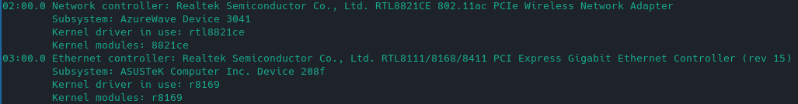
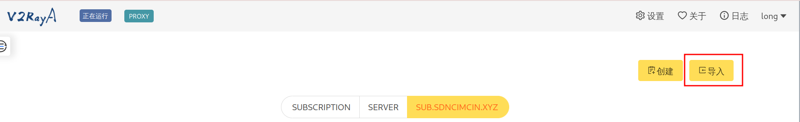
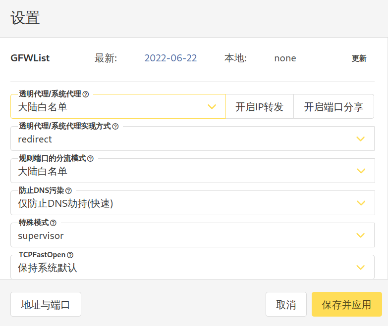
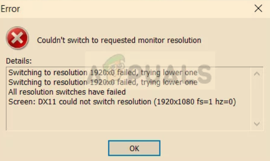
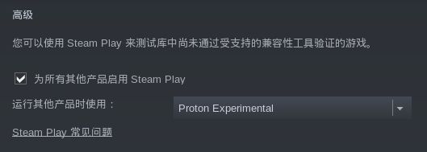
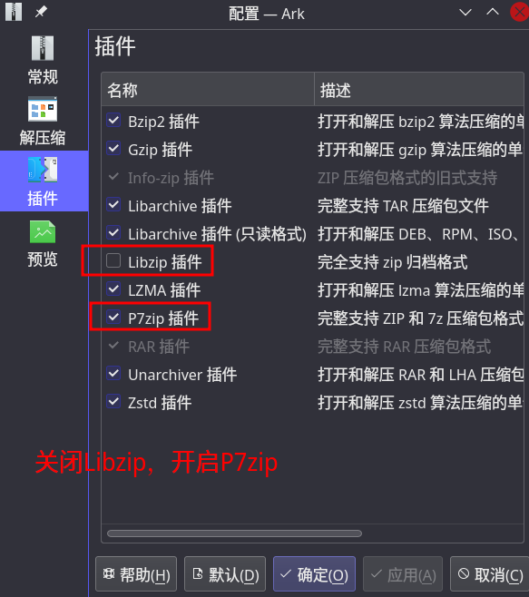

# Manjaro软件安装及配置

> Arch太难配置了，我转向了Manjaro

## 首次安装

### AUR

`/etc/pacman.conf`尾部添加镜像：

```bash
[archlinuxcn]
Server = https://mirrors.ustc.edu.cn/archlinuxcn/$arch
Server = https://mirrors.tuna.tsinghua.edu.cn/archlinuxcn/$arch
Server = https://mirrors.hit.edu.cn/archlinuxcn/$arch
Server = https://repo.huaweicloud.com/archlinuxcn/$arch
```

安装yay：

```bash
# 安装签名
sudo pacman -S archlinuxcn-keyring
sudo pacman -S yay
```

### 内核与驱动

> 在Linux中，**内核与驱动存在依赖关系**，因此要同时升级，版本号要一致

#### 内核

```bash
# 查看linux内核
mhwd-kernel -l
# 安装指定版本的linux，并删除旧版本的
sudo mhwd-kernel -i linux*** rmc
```

#### 网卡驱动

安装新内核后会发现上不了网，这时候通过lspci -k命令查看情况，发现Network缺少网卡驱动，根据提示，安装指定版本即可：



```bash
# 正式安装网卡驱动
yay -S rtl8821ce-dkms-git
# 以下两项可选
## 上一步一般会安装linux-headers的，如果没安装的话，自己手动执行下面安装
sudo pacman -S linux***-headers
## 如下命令可以手动解析
sudo modprobe 8821ce
```

#### 显卡驱动

我的电脑是Intel+Nvidia的，按照教程安装nvidia

```bash
# 注意：必须挑选和内核相同的版本
sudo pacman -S nvidia
```

optimus-manager安装：[https://github.com/Askannz/optimus-manager](https://github.com/Askannz/optimus-manager)

> 如果安装的是KDE，需要把`/etc/sddm.conf`文件中的`DisplayCommandand`和`DisplayStopCommand`注释掉

```bash
yay -S optimus-manager optimus-manager-qt
sudo systemctl enable optimus-manager.service
sudo systemctl start optimus-manager.service
```

### 安装输入法

安装主程序：
```bash
sudo pacman -S fcitx5-im fcitx5-chinese-addons fcitx5-material-color
```

在文件`~/.pam_environment`中设置环境变量：

```bash
INPUT_METHOD DEFAULT=fcitx5
GTK_IM_MODULE DEFAULT=fcitx5
QT_IM_MODULE DEFAULT=fcitx5
XMODIFIERS DEFAULT=\@im=fcitx5
SDL_IM_MODULE DEFAULT=fcitx
```

## 科学上网

> Archlinux中实现科学上网主要用两种：
>
> - clash
> - v2ray
>
> 尝试过前者，最终订阅没有一个节点能使用，也看不出啥问题，因此使用第二种。

### v2ray

> Qv2ray由于仓库在2021年停止更新了，后续尽量不要使用。

1.安装软件包

```bash
# 安装
sudo pacman -S v2ray v2raya
```

2.启动v2raya

```bash
# 启动v2raya
sudo systemctl start v2raya.service
# 设置开机自动启动
sudo systemctl enable v2raya.service
```

3.访问UI界面：打开`http://localhost:2017`

4.创建管理员帐号

如果忘记，可以使用`sudo v2raya --reset-password`重置

5.导入节点



6.设置代理

参照下图，设置为相关选项即可



7.如果报iptables错误，需要关闭防火墙

修改文件`/lib/systemd/system/v2ray.service`

找到`[Service]`中的：

`ExecStart = /usr/bin/v2ray ……`，添加`iptables=false`

然后重启系统。

8.选择节点，开启科学上网

### 终端代理

> 终端代理不是对所有命令都生效的，比如ping命令，但对curl生效

> 尽量不要使用带分流规则的VPN，不安全

```bash
export https_proxy=http://127.0.0.1:20171
export socks5_proxy=http://127.0.0.1:20170
```

## vscode

### zsh乱码

安装`nerd font`字体：

```bash
yay -S nerd-fonts-jetbrains-mono
```

在vscode中的settings.json配置

```json
{
    ……
    "terminal.integrated.fontFamily": "JetbrainsMono Nerd Font"
}
```

## 扩展屏

使用扩展屏推荐软件deskreen：

```bash
yay -S deskreen
```

安装完成后启动该软件，按照要求完成指定三步就能投屏到其他设备上了。

不过这种方式是镜像投屏，如果想以扩展屏的方式使用，按照官方的说法，有两种方式：

- 虚拟显示适配器（硬件）
- 虚拟显示（软件）

以下采用创建虚拟显示的方案，Deskreen给出了[讨论链接](https://github.com/pavlobu/deskreen/discussions/86)，包含了常见的各个系统上怎么开启。而我只在linux上使用，因而参考了[使用 xrandr 创建虚拟显示器（Linux）](https://github.com/pavlobu/deskreen/issues/42)。步骤如下：

1.首先运行：

```bash
xrandr
```

输出如下：

```bash
Screen 0: minimum 8 x 8, current 1920 x 1080, maximum 32767 x 32767
eDP-1-1 connected primary 1920x1080+0+0 (normal left inverted right x axis y axis) 344mm x 193mm
   1920x1080     60.05*+  60.01    59.97    59.96    59.93  
   1680x1050     59.95    59.88  
   1400x1050     59.98  
   1600x900      59.99    59.94    59.95    59.82  
   1280x1024     60.02  
   1400x900      59.96    59.88  
   1280x960      60.00  
   1440x810      60.00    59.97  
   1368x768      59.88    59.85  
   1280x800      59.99    59.97    59.81    59.91  
   1280x720      60.00    59.99    59.86    59.74  
   1024x768      60.04    60.00  
   960x720       60.00  
   928x696       60.05  
   896x672       60.01  
   1024x576      59.95    59.96    59.90    59.82  
   960x600       59.93    60.00  
   960x540       59.96    59.99    59.63    59.82  
   800x600       60.00    60.32    56.25  
   840x525       60.01    59.88  
   864x486       59.92    59.57  
   700x525       59.98  
   800x450       59.95    59.82  
   640x512       60.02  
   700x450       59.96    59.88  
   640x480       60.00    59.94  
   720x405       59.51    58.99  
   684x384       59.88    59.85  
   640x400       59.88    59.98  
   640x360       59.86    59.83    59.84    59.32  
   512x384       60.00  
   512x288       60.00    59.92  
   480x270       59.63    59.82  
   400x300       60.32    56.34  
   432x243       59.92    59.57  
   320x240       60.05  
   360x202       59.51    59.13  
   320x180       59.84    59.32  
HDMI-1-1 disconnected (normal left inverted right x axis y axis)
```

`eDP-1-1`就是当前所看到的屏幕，而`HDMI-1-1`显示disconnected，这就是将要创建的虚拟显示。

2.为`HDMI-1-1`创建输出模式

```bash
xrandr --addmode HDMI-1-1 1920x1080
```

xrandr不支持修改，除了上面的创建，有时候可能需要删除某些输出模式：

```bash
xrandr --delmode HDMI-1-1 1920x1080
```

3.定位新显示器的在主显示器的位置方向

方向参数：

- `--above`
- `--below`
- `--left-of`
- `--right-of`

```bash
# 将HDMI-1-1定义在主显示器的左侧
xrandr --output HDMI-1-1 --mode 1920x1080 --left-of eDP-1-1
```

进入后选择那个**空黑屏幕**，这个就是扩展屏

4.如果要断开显示，运行

```bash
xrandr --output HDMI-1-1 --off
```

> 使用以上方式还是有缺陷的，我暂时遇到的是截图问题，多屏幕下根本无法使用。
>
> 因此每次使用完后，尽量还是关闭扩展屏幕吧。

## 游戏

### wine

1.安装wine

```bash
sudo pacman -S wine wine-mono wine_gecko wine-staging giflib lib32-giflib libpng lib32-libpng libldap lib32-libldap gnutls lib32-gnutls \
mpg123 lib32-mpg123 openal lib32-openal v4l-utils lib32-v4l-utils libpulse lib32-libpulse libgpg-error \
lib32-libgpg-error alsa-plugins lib32-alsa-plugins alsa-lib lib32-alsa-lib libjpeg-turbo lib32-libjpeg-turbo \
sqlite lib32-sqlite libxcomposite lib32-libxcomposite libxinerama lib32-libgcrypt libgcrypt lib32-libxinerama \
ncurses lib32-ncurses opencl-icd-loader lib32-opencl-icd-loader libxslt lib32-libxslt libva lib32-libva gtk3 \
lib32-gtk3 gst-plugins-base-libs lib32-gst-plugins-base-libs vulkan-icd-loader lib32-vulkan-icd-loader
```

2.配置wine，wine的默认路径是`~/.wine`

```bash
winecfg
```

3.运行windows应用

> 千万**不要以 root 身份运行 Wine**

```bash
wine /path/of/xxx.exe
```

### dxvk

官方仓库：https://github.com/doitsujin/dxvk

下载dxvk后解压，进入该目录，运行如下：

```bash
# wine默认目录
export WINEPREFIX=~/.wine
./setup_dxvk.sh install
```

如果要卸载dvxk，执行如下：

```bash
export WINEPREFIX=~/.wine
./setup_dxvk.sh uninstall
```

### 原神

#### 安装与运行

1.下载windows版本原神，用wine运行和安装，默认目录即可。正常情况下是可以运行启动器的，但是运行不了游戏本体的。

2.要在Linux上运行原神必须添加反作弊补丁：https://notabug.org/Krock/dawn

```bash
# dawn目录：/home/zhengyu/下载/dawn
git clone https://notabug.org/Krock/dawn
```

3.进入到`Genshin Impact Game`目录。注意不是`Genshin Impact`目录。

```bash
/home/zhengyu/.wine/drive_c/Program Files/Genshin Impact/Genshin Impact Game
```

4.执行patch.sh

其中280是原神的2.8版本，每次到新版本后，需要等待几天，获取最新的patch.sh

```bash
bash "/home/zhengyu/下载/dawn/280/patch.sh"
```

获取到了会提示安装：

```bash
sudo pacman -S xdelta3
```

---

如果进入门出现异常，需要运行：

```bash
bash "/home/zhengyu/下载/dawn/280/patch_anti_logincrash.sh"
```

5.最终在`Genshin Impact Game`目录启动游戏：

```bash
wine cmd /c launcher.bat
```

6.第一次启动要是运行上述命令的，之后就能像windows那样点图标启动了。

#### 错误修复

1.显示器分辨率报错



切换成英伟达的显卡即可。

2.登陆页面提示网络未连接

- 检查网卡是否断了
- 检查是否开了VPN

### Steam

Steam就容易运行多了，正常运行即可，注意在Linux下要开启Steam Play



## ark解压zip乱码

1.安装插件

安装这个插件时候会提示删除旧的插件，选择是即可

```bash
yay -S p7zip-natspec
```

2.关闭Libzip插件，确保P7zip插件处于运行中



