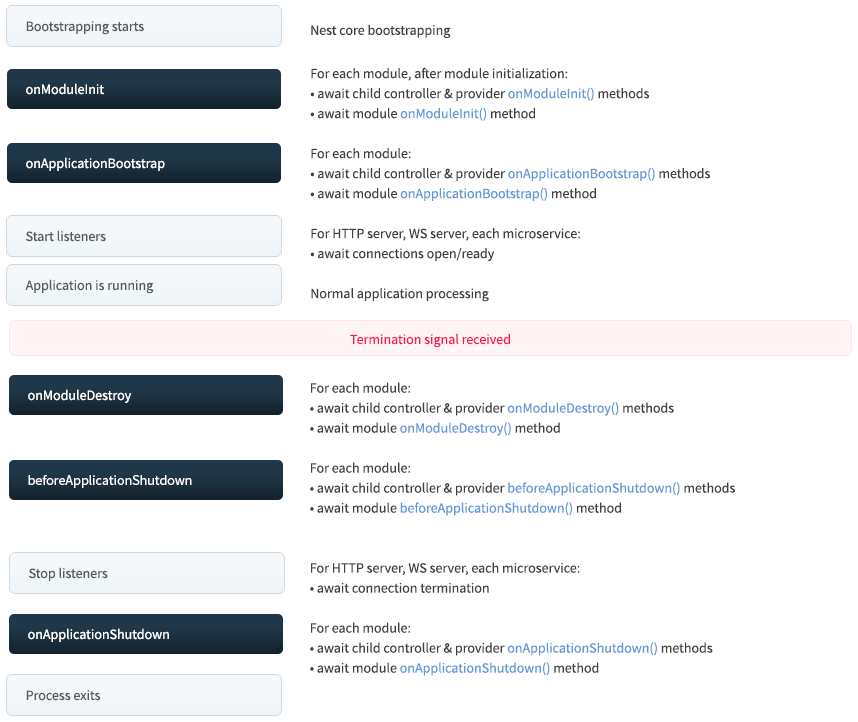

# Nestjs入门——基本原则

## 自定义Provider

### 依赖注入的基本流程

依赖注入是一种控制翻转（IOC）技术，可以将依赖的实例委派给IOC容器，而不是必须在自己代码中执行。

分为三步：

1.在`cats.service.ts`用`@Injectable()`声明CatsService类，由IOC容器管理。

```ts
@Injectable()
export class CatsService {
  private readonly cats: Array<ICat> = [];
  findAll(): Array<ICat> {
    return this.cats;
  }
}
```

2.在`cats.controller.ts`中CatsController声明依赖于Service令牌的构造函数注入。

```ts
@Controller('cats')
export class CatsController {
  constructor(private readonly catsService: CatsService) {}
  @Get()
  async findAll(): Promise<Array<ICat>> {
    return this.catsService.findAll();
  }
}
```

3.在`app.module.ts`中，将标记的CatsService和`cats.service.ts`文件中的CatsService类相关联。

```ts
@Module({
  controllers: [CatsController],
  providers: [CatsService],
})
export class AppModule {}
```

当IOC容器实例化CatsController时，会首先查找所有依赖项，当查找到CatsService依赖项时，会对其令牌执行查找并返回CatsService类。如果是默认的单例范围，Nest.js将创建CatsService实例，将其缓存并返回，或返回现有的缓存实例。

::: tip
`providers: [CatsService]`是如下代码的简写：

```ts
providers: [
  {
    // 令牌
    provide: CatsService,
    // 类
    useClass: CatsService,
  },
];
```
:::

### useValue

`useValue`语法对于注入常量值、外部库、模拟对象时非常有用。

```ts
import { CatsService } from './cats.service';
const mockCatsService = {
  findAllx: () => [
    { name: 'Kitty', age: 20, breed: 'A' },
    { name: 'Whiskers', age: 18, breed: 'AB' },
  ],
};
@Module({
  imports: [CatsModule],
  providers: [
    {
      provide: CatsService,
      useValue: mockCatsService,
    },
  ],
})
export class AppModule {}
```

::: danger
注意：`useValue`与要替换的CatsService类要具有相同的接口
:::

### 非类Provider

在之前的章节中，全局的过滤器、管道、守卫都能使用`APP_*`来标记Provider的令牌，这是字符串，不是一个类。

比如自定义使用`'CONNECTION'`作令牌：

```ts
@Module({
  providers: [
    {
      provide: 'CONNECTION',
      useValue: connection,
    },
  ],
})
export class AppModule {}
```

使用：

```ts
@Injectable()
export class CatsRepository {
  // @Inject装饰器只接受令牌这一个参数
  constructor(@Inject('CONNECTION') connection: Connection) {}
}
```

::: tip
为了代码组织清晰，最佳实践应该是将令牌放在单独文件中定义。
:::

### useClass

```ts
@Module({
  providers: [
    {
      provide: ConfigService,
      useClass: process.env.NODE_ENV === 'development' ? DevelopmentConfigService : ProductionConfigService,
    }
  ],
})
export class AppModule {}
```

使用ConfigService类名称作为令牌，对于任何依赖ConfigService的类，Nest.js都会注入提供的类的实例（DevelopmentConfigService或ProductionConfigService）。

注意这里是依赖于ConfigService类，注入的不是ConfigService实例，而是`useClass`后跟着的类的实例。

### useFactory

`useFactory`允许动态创建提供程序，实工厂函数返回实际的Provider，工厂可以注入其他Provider来计算结果，不过有一些限制：

- 工厂函数可以接收参数。
- `inject`属性接收一个Provider数组，在实例化过程中，Nest.js将解析该数组并将其作为参数传递给工厂函数。

```ts
const connectionFactory = {
  provide: 'CONNECTION',
  // useFactory中可以获取到OptionsProvider
  useFactory: (optionsProvider: OptionsProvider) => {
    const options = optionsProvider.get();
    return new DatabaseConnection(options);
  },
  inject: [OptionsProvider],
};

@Module({
  providers: [connectionFactory],
})
export class AppModule {}
```

### useExisting

`useExisting`允许为现有的提供程序创建别名，这将创建两种访问同一Provider的方法。

```ts
@Injectable()
class LoggerService {
  /* implementation details */
}
// AliasedLoggerService是LoggerService的别名
const loggerAliasProvider = {
  provide: 'AliasedLoggerService',
  useExisting: LoggerService,
};

@Module({
  // 解析为同一个实例
  providers: [LoggerService, loggerAliasProvider],
})
export class AppModule {}
```

### 非服务型Provider

虽然Provider经常提供服务，但并不仅限这种用途，Provider可以提供任何值。

```ts
const configFactory = {
  provide: 'CONFIG',
  // 根据环境提供配置对象数组
  useFactory: () => (process.env.NODE_ENV === 'development' ? devConfig : prodConfig),
};
@Module({
  providers: [configFactory],
})
export class AppModule {}
```

### 导出自定义Provider

1.导出令牌

```ts
@Module({
  providers: [configFactory],
  exports: ['CONFIG'],
})
export class AppModule {}
```

2.导出整个对象

```ts
@Module({
  providers: [configFactory],
  exports: [configFactory],
})
export class AppModule {}
```

### 异步Provider

使用`useFactory`语法的`async/await`，工厂函数可以等待异步任务。

```ts
const asyncConnectionFactory ={
  provide: 'ASYNC_CONNECTION',
  useFactory: async () => {
    const connection = await createConnection(options);
    return connection;
  },
}
```

最终通过`@Inject('ASYNC_CONNECTION)`注入到其他组件中。

## 动态模块

如果想动态导入模块，可以像如下这样写：

通过`register()`方法返回的是动态模块，即在运行时创建的模块。动态模块必须返回具有完全相同接口的对象，外加一个`module`的附加属性。

```ts
@Module({
  // imports: [ConfigModule],
  imports: [ConfigModule.register({ url: './config', mode: 'dev' })],
  controllers: [AppController],
  providers: [AppService],
})
export class AppModule {}
```

::: tip
动态模块本身可以导入其他模块，如果动态模块依赖于其他模块的Provider，则可以使用`imports`属性导入它们。
:::

定义动态模块：

```ts
// 注入两个Provider，CONFIG_OPTIONS和ConfigService
@Module({})
export class ConfigModule {
  // 调用register静态方法，实现模块动态注册
  static register(options: IOption): DynamicModule {
    return {
      module: ConfigModule,
      providers: [
        {
          provide: 'CONFIG_OPTIONS',
          useValue: options,
        },
        ConfigService,
      ],
      controllers: [ConfigController],
      exports: [ConfigService],
    };
  }
}
```

在Service和Controller中使用注入的Provider：

```ts
@Injectable()
export class ConfigService {
  private readonly envConfig: IEnvConfig;
  // Service中注入CONFIG_OPTIONS
  constructor(@Inject('CONFIG_OPTIONS') private options) {
    this.envConfig = {
      author: 'Nahida',
      timeCtl: `${new Date().getHours()}-${new Date().getMinutes()}-${new Date().getSeconds()}`,
      options,
    };
  }
  get(key: string): string {
    return this.envConfig[key];
  }
  getAll() {
    return this.envConfig;
  }
}
```

```ts
@Controller('config')
export class ConfigController {
  // Controller中注入ConfigService
  constructor(private configService: ConfigService) {}
  @Get()
  getConfig() {
    return JSON.stringify(this.configService.getAll());
  }
}
```

## 注入作用域

### Provider范围

| 模式 | 范围 |
| --- | --- |
| DEFAULT | 每个Provider可以跨多个类共享，生命周期严格绑定到应用程序生命周期，一旦应用程序启动，所有Provider都已实例化，**默认情况下使用单例范围**。 |
| REQUEST | 在请求处理完成后，将为每个传入请求或垃圾收集专门创建Provider的新实例 |
| TRANSIENT | 临时Provider不能在Provider之间共享，当向容器请求特定的临时Provider时，该容器会创建一个专用的实例 |

通过向`@Injectable()`装饰器传递`scope`选项来切换注入范围：

```ts
import { Injectable, Scope } from '@nestjs/common';
@Injectable({ scope: Scope.REQUEST })
export class CatsService {}
```

::: danger
注意：必须非常谨慎使用范围限制，`scope`其实是在注入链中冒泡的。比如注入链：`CatsController <- CatsService <- CatsRepository`，如果CatsService是请求范围的，那么CatsController也会成为请求范围，而CatsRepository依然是单例的。

这种情况下，循环依赖关系会导致非常痛苦的副作用，必须要尽可能的避免创建它们。
:::

### Controller范围

```ts
@Controller({
  path: 'cats',
  scope: Scope.REQUEST,
})
export class CatsController {}
```

在HTTP应用程序中，当使用请求范围提供者，可能需要获取原始的请求对象，这需要通过注入REQUEST对象实现：

```ts
import { Injectable, Scope, Inject } from '@nestjs/common';
import { REQUEST } from '@nestjs/core';
import { Request } from 'express';
@Injectable({ scope: Scope.REQUEST })
export class CatsService {
  constructor(@Inject(REQUEST) private readonly request: Request) {}
}
```

## 循环依赖

两个类互相依赖就会出现循环依赖，建议尽可能避免循环依赖，如果难以避免，Nest.js提供了**前向引用和使用ModuleRef类**两种技术来从注入容器中获取一个Provider。

### 前向引用

前向引用允许Nest.js引用未定义的引用，当两个类相互依赖时，双方都需要使用`@Inject()`和`forwardRef()`，否则Nest.js不会实例化它们，因为所有基本元数据都不可用。

```ts
@Injectable()
export class CatsService {
  constructor(
    @Inject(forwardRef(() => CommonService))
    private readonly commonService: CommonService,
  ) {}
}
```

```ts
@Injectable()
export class CommonService {
  constructor(
    @Inject(forwardRef(() => CatsService))
    private readonly catsService: CatsService,
  ) {}
}
```

如果是模块，前向引用可以这样写：

```ts
@Module({
  imports: [forwardRef(() => CatsModule)],
})
export class CommonModule {}
```

### 使用ModuleRef类

可以使用`MuduleRef`类型在循环关系一层检索Provider。

## 模块引用

### ModuleRef基本使用

Nest.js提供了`ModuleRef`类来导航到内部Provider列表，并使用注入令牌作为查找键名来获取引用，`ModuleRef`类也提供了一种动态实例化静态和作用域Provider，可以以正常方式注入到类中。

`ModuleRef`实例拥有`get()`方法，该方法获取一个注入到容器的Provider、Controller或Injectable。

```ts
@Injectable()
export class ConfigService implements OnModuleInit {
  private catsService: CatsService;
  constructor(private moduleRef: ModuleRef) {}
  onModuleInit() {
    this.catsService = this.moduleRef.get(CatsService);
  }
}
```

::: tip
要从全局上下文获取一个Provider，向`get()`的第二个参数传递`{ strict: false }`选项。
:::

如果要动态处理范围Provider，使用`resolve()`方法，传入注入令牌。

```ts
@Injectable()
export class ConfigService implements OnModuleInit {
  constructor(private moduleRef: ModuleRef) {}
  async onModuleInit() {
    // 要在不同resolve()调用之间产生单例并确保共享同样生成的容器子树，那么就要像resolve()方法传递一个上下文引用
    const contextId = ContextIdFactory.create();
    const catsServiceArr = await Promise.all([
      this.moduleRef.resovle(CatsService, contextId);
      this.moduleRef.resovle(CatsService, contextId);
    ]);
    console.log(catsServiceArr[0] === catsServiceArr[1]);   // true
  }
}
```

### 注册REQUEST Provider

通过`ContextIdFactory.create()`手动生成的上下文标识符表示ID子树，其中REQUEST Provider是未定义的，因为不是由Nest.js依赖注入系统实例化和管理的。

要手动**创建的DI子树注册自定义REQUEST对象**，需要使用`moduleRef.registerRequestByContextId()`方法：

```ts
const contextId = ContextIdFactory.create();
this.moduleRef.registerRequestByContextId(/* YOUR_REQUEST_OBJECT */, contextId);
```

### 获取当前子树

有时，也需要在请求上下文中获取一个请求范围提供者的实例。例如，CatsService是请求范围的，要获取的CatsRepository实例也被标识为请求范围。要分享同一个注入容器子树，你需要获取当前上下文引用而不是生成一个新的（像前面的`ContextIdFactory.create()`函数）。使用`@Inject()`来获取当前的请求对象。

```ts
@Injectable()
export class CatsService {
  constructor(
    @Inject(REQUEST) private request: Record<string, unknown>,
  ) {}
}
```

使用ContextIdFactory类的`getByRequest()`方法来基于请求对象创建一个上下文id并传递`resolve()`调用：

```ts
const contextId = ContextIdFactory.getByRequest(this.request);
const catsRepository = await this.moduleRef.resolve(CatsRepository, contextId);
```

### 动态实例化自定义类

要动态实例化一个之前未注册的类作为提供者，使用模块引用的`create()`方法。

```ts
@Injectable()
export class CatsService implements OnModuleInit {
  private catsFactory: CatsFactory;
  constructor(private moduleRef: ModuleRef) {}

  async onModuleInit() {
    this.catsFactory = await this.moduleRef.create(CatsFactory);
  }
}
```

## 模块懒加载

默认情况下，模块是预加载的，这意味着一旦应用程序加载，所有模块也会加载，无论它们是否立即需要。虽然对绝大多数应用程序来说很好，但它可能在serverless中运行的apps和workers是个瓶颈，懒加载能通过加载特定需要的模块来减少引导时间。

::: warning
注意：懒加载的模块和服务不会调用生命周期钩子方法。
:::

```ts
import { LazyModuleLoader } from '@nestjs/core';
@Injectable()
export class LazyService {
  constructor(private readonly lazyModuleLoader: LazyModuleLoader) {}
  async getModule() {
    const { LazyModule } = await import('./lazy.module');
    const moduleRef = await this.lazyModuleLoader.load(() => LazyModule);
    return moduleRef;
  }
}
```

如果想全局使用LazyModuleLoader，可以这样写：

```ts
const lazyModuleLoader = app.get(LazyModuleLoader);
```

::: danger
由于Nest.js中的Controller表示路由/路径/查询的集合，因此不能使用LazyModuleLoader类延迟加载它们。
:::

## 执行上下文

### ArgumentsHost

ArgumentsHost类蹄冻传递给处理程序的参数，运行选择合适的上下文（如HTTP、RPC、WebSockets）来从框架中获取参数。作为`host`参数提供给需要获取的地方。

ArgumentsHost简单地抽象为处理程序参数。例如在HTTP应用中，`host`对象封装了Express的`[request, response, next]`数组；在GraphQL应用中，`host`包含`[root, args, context, info]`数组。

1.可以通过`getType()`方法来区分当前应用的上下文：

```ts
if (host.getType() === 'http') {
  // do something that is only important in the context of regular HTTP requests (REST)
} else if (host.getType() === 'rpc') {
  // do something that is only important in the context of Microservice requests
} else if (host.getType<GqlContextType>() === 'graphql') {
  // do something that is only important in the context of GraphQL requests
}
```

2.可以通过`host`对象的`getArgs()`方法获取传递给程序的参数数组：

```ts
const [req, res, next] = host.getArgs();
```

3.为了使代码更健壮和可复用，可以通过`host`的应用方法来切换合适的上下文：

```ts
// Switch context to RPC
switchToRpc(): RpcArgumentsHost;
// Switch context to HTTP
switchToHttp(): HttpArgumentsHost;
// Switch context to WebSockets
switchToWs(): WsArgumentsHost;
```

这样上面代码可以优化为：

```ts
const ctx = host.switchToHttp();
const request = ctx.getRequest<Request>();
const response = ctx.getResponse<Response>();
```

如果是RPC，可以这样写：

```ts
const ctx = host.switchToRpc();
const data = ctx.getData();
const client = ctx.getClient();
```

### ExecutionContext

ExecutionContext扩展了ArgumentsHost，提供额外的当前运行线程信息。

```ts
export interface ExecutionContext extends ArgumentsHost {
  // 返回当前处理程序所属的控制器类的类型
  getClass<T = any>(): Type<T>;
  // 返回要调用的处理程序的引用
  getHandler(): Function;
}
```

### 反射和元数据

Nest.js提供了通过`@SetMetadata()`装饰器将自定义元数据附加在路径处理程序的能力。

下面我们将`roles`元数据关联到`create()`方法

```ts
@Post()
@SetMetadata('roles', ['admin'])
async create(@Body() createCatDto: CreateCatDto) {
  this.catsService.create(createCatDto);
}
```

要想访问`roles`自定义元数据，要使用`Reflector`类：

```ts
// 读取处理程序的元数据
const roles = this.reflector.get<string[]>('roles', context.getHandler());
// 读取控制器元数据
const roles = this.reflector.get<string[]>('roles', context.getClass());
```

下面给出一个使用反射的例子：

```ts
@Injectable()
export class AuthGuard implements CanActivate {
  constructor(private reflector: Reflector) {}
  canActivate(
    context: ExecutionContext,
  ): boolean | Promise<boolean> | Observable<boolean> {
    const roles = this.reflector.get<string[]>('roles', context.getClass());
    // 当访问GET /cats时候，打印['admin']
    console.log(roles);
    return true;
  }
}
```

```ts
@Controller('cats')
@UseGuards(AuthGuard)
@SetMetadata('roles', ['admin'])
export class CatsController {
  constructor(private catsService: CatsService) {}
  @Get()
  async findAll() {
    return this.catsService.findAll();
  }
}
```

如果在两个水平应用`roles`元数据：

```ts
@SetMetadata('roles', ['user'])
@Controller('cats')
export class CatsController {
  constructor(private catsService: CatsService) {}
  @Get()
  @SetMetadata('roles', ['admin'])
  async findAll() {
    return this.catsService.findAll();
  }
}
```

那么可以使用`getAllAndOverride()`有选择的进行覆盖，或者使用`getAllAndMerge()`合并元数据。

```ts
const roles = this.reflector.getAllAndMerge<string[]>('roles', [
  context.getHandler(),
  context.getClass(),
]);
```

## 生命周期事件

### 执行顺序



### 使用

| 生命周期钩子方法 | 生命周期事件触发钩子方法调用 |
| --- | --- |
| `OnModuleInit()` | 主模块依赖resolved后调用一次 |
| `OnApplicationBootstrap()` | 在应用程序完全启动并监听连接后调用一次 |
| `OnModuleDestroy()` | 收到终止信号后调用 |
| `beforeApplicationShutdown()` | 在所有`onModuleDestory()`完成后调用；一旦完成，所有存在连接将会关闭 |
| `OnApplicationShutdown()` | 连接关闭处理时调用 |

::: danger
上述列出的生命周期钩子没有被请求范围类触发。请求范围类并没有和生命周期以及不可预测的寿命绑定。他们为每个请求单独创建，并在响应发送后通过垃圾清理系统自动清理。
:::

使用，实现对应钩子的接口：

```ts
@Injectable()
export class UsersService implements OnModuleInit {
  onModuleInit(): Promise<void> {
    await this.fetch();
  }
}
```

`onModuleDestroy()`、`beforeApplicationShutdown()`和`onApplicationShutdown()`钩子程序响应系统终止信号关闭钩子消耗系统资源，因此默认是禁用的，要使用必须通过`enableShutdownHooks()`激活侦听器。

```ts{3}
async function bootstrap() {
  const app = await NestFactory.create(AppModule);
  app.enableShutdownHooks();
  await app.listen(3000);
}
```

::: warning
`enableShutdownHooks`开始监听时消耗内存，如果要在一个单独Node线程中运行多个Nest应用（例如，使用多个Jest运行测试），Node会抱怨监听者太多。出于这个原因`enableShutdownHooks`默认未启用，要在单个Node进程中运行多个实例时尤其要注意这一点。
:::
