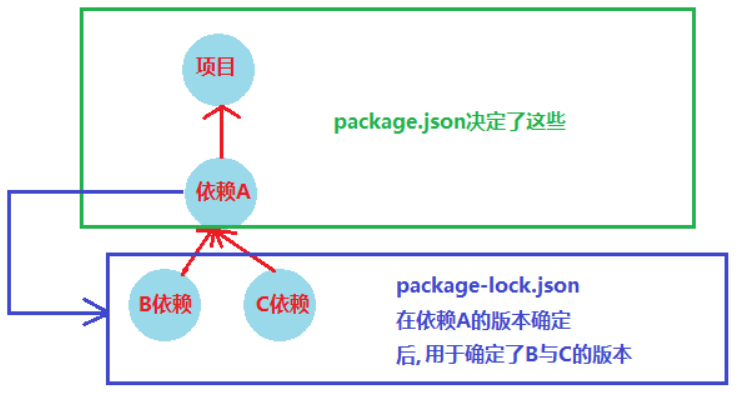

# Node入门——基础及配置

## Node介绍

### Node.js是啥

定义：Node.js® is a JavaScript runtime built on Chrome's V8 JavaScript engine.

从定义我们可以看到几个重要特征：

1. Node.js不是一门语言，而是一个运行时
2. 语言是JavaScript，不包含BOM、DOM API，添加了Stream、网络等API
3. Node.js依赖V8引擎运行JavaScript

由于JavaScript是单线程的，Node.js依赖事件循环机制实现异步，来节约CPU资源，但**该事件循环机制和在浏览器是不同的**。

### 事件驱动和非阻塞I/O

比如读写数据库时候就会由I/O操作，I/O任务主要由CPU分发给DMA执行，等待数据库查询结果。

```js
var result = db.query('select * from...');
```

这明显是浪费CPU资源的，因此有了多线程的性能优化手段，但也有些问题：

1. 操作系统创建线程和切换线程上下文需要一定开销。
2. 多线程的执行堆栈要占用内存。
3. 多线程面对死锁、状态同步问题会增加使用复杂性。

在Node.js中，通过事件循环机制，进程不等待I/O结果，直接处理后续任务，这样就不浪费CPU了。

关于Node.js性能，和传统多线程语言相比绝大多数场景都比不过，但Node.js在I/O密集的Web场景相对于使用多进程模型语言有性能优势，这个优势不是来源于语言，而是操作系统实现，Java按照这种模型实现性能一样很高。

## Node工具链及配置

> 这里主要介绍Node和npm，至于yarn、pnpm这里暂且不提。

### Node安装

Node安装建议使用nvm，这样同一台机器上就能有多个版本，并能随意切换。

1.安装nvm

1.1 在线安装
```bash
curl -o- https://raw.githubusercontent.com/creationix/nvm/v0.33.11/install.sh | bash
# 或者使用wget
wget -qO- https://raw.githubusercontent.com/creationix/nvm/v0.33.11/install.sh | bash
```

1.2 本地安装

下载`https://github.com/nvm-sh/nvm/archive/refs/tags/v0.39.3.tar.gz`，通过[https://github.com/nvm-sh/nvm/releases](https://github.com/nvm-sh/nvm/releases)找到。

```bash
mkdir /root/.nvm
tar -zxvf nvm-0.39.1.tar.gz --strip-components 1  -C /root/.nvm
```

2.尝试在相关文件中添加source lines（`~/.bash_profile`, `~/.zshrc`, `~/.profile`, or `~/.bashrc`）

```bash
export NVM_DIR="$([ -z "${XDG_CONFIG_HOME-}" ] && printf %s "${HOME}/.nvm" || printf %s "${XDG_CONFIG_HOME}/nvm")"
[ -s "$NVM_DIR/nvm.sh" ] && \. "$NVM_DIR/nvm.sh" # This loads nvm
```

3.刷新配置并查看是否安装

```bash
source ~/.bashrc
nvm -v
```

4.使用nvm安装指定Node版本

```bash
# 查看线上Node版本
nvm ls-remote
# 查看已安装的Node版本
nvm ls
# 安装Node
nvm install latest
nvm install vX.Y.Z
# 移除Node
nvm uninstall vX.Y.Z
# 使用Node
nvm use vX.Y.Z
# 设置为默认版本
nvm alias default vX.Y.Z
```

### npm

安装好Node后，默认npm就安装好了。

npm是Node.js的包管理工具，全称Node.js package manager，通过npm Node.js可以方便使用第三方开发的开源模块，同时也可以把自己的模块发布到npm供其他开发者使用。

1.配置npm

```bash
# 查看当前源
npm config get registry
# 切换淘宝源
npm config set registry https://registry.npmmirror.com
```

2.安装package

```bash
# 全局安装
npm install <package_name> -g
# 在项目中安装指定版本的包
npm install <package_name>@x.y.z
```

::: tip
全局安装的目录位置：

- Linux：`~/.nvm/versions/node/nvm各个版本/bin/`
- Windows：`C:\Users\你的用户名\AppData\Roaming\npm\node_modules`
:::

本地安装就是找到对应的工程文件夹，不携带`-g`

3.查看相关信息

```bash
# 查看项目安装的包
npm list
# 查看某个包的信息（不一定在项目中引用过的）
npm info <package_name>
# 查看某个包的所有版本号（不一定在项目中引用过的）
npm view <package_name> versions
```

4.清理缓存

```bash
npm cache clean --force
```

5.使用yarn和pnpm

使用corepack安装，如果npm配置了镜像，那么yarn和pnpm的镜像也是这个。

```bash
corepack enable
```

### npx

1.npx解决的主要问题，就是调用项目内部安装的模块。

比如有模块jest，一般来说，想要调用就只能在项目脚本和`package.json`的`scripts`字段里面，但我们想现在通过命令行调用，则必须执行`node-modules/.bin/jest --version`。npx解决就是这个问题，现在可以直接通过`npx jest --version`调用了。

npx执行原理就是在运行时会到`node_modules/.bin/*`路径和环境变量`$PATH`里面，检测命令是否存在。

2.避免全局安装模块

执行下面代码时，npx会将`create-react-app`下载到一个临时目录，使用后再删除

```bash
npx create-react-app my-react-app
```

3.参数

- `--no-install`：强制npx使用本地模块，如果本地不存在就报错。
- `--ignore-existing`：忽略本地的同名模块，强制安装使用远程模块
- `-p`：指定npx要安装的模块，对于需要安装多个模块场景有用，比如：`npx -p lolcatjs -p cowsay [command]`
- `-c`：如果安装多个模块，默认情况下第一个可执行项会只用npx安装模块，但后面可执行项还是会交给Shell解释，比如`npx -p lolcatjs -p cowsay 'cowsay hello | lolcatjs'`会执行报错。而`-c`就能让所有命令都用npx解释。

### package.json

- name：模块唯一标识。安装和使用模块通过`npm install [name]`即可。
  - 可以通过scope组织具有相关性的模块。比如`@babel/preset-env`、`@babel/plugin-transform-typescript`都是babel。
  - 使用monorepo时，对子包用scope组织。
- version：版本。使用`x.y.z`形式，对应`主版本.次版本.修订版本`。
  - 正式版本定义规则：
    - 主版本：当你做了不兼容的 API 修改
    - 次版本：当你做了向下兼容的功能性新增
    - 修订版本：当你做了向下兼容的问题修正
  - 除了正式版本，为了稳定性，还会提供先行版本。比如`"version": "1.0.0-alpha.63"`：
    - alpha: 内部版本
    - beta: 公测版本
    - rc: Release candidate，正式版本的候选版本
- description：项目描述，帮助查找到包，列举在`npm search`中。
- keywords：项目关键词，帮助查找到包，列举在`npm search`中。
- homepage：项目主页。
- license：项目指定许可证，以便知道如何允许使用它，以及施加的任何限制。比如`"license": "AGPL-3.0"`。
- author：项目作者。
- contributors：项目贡献者。
- files：定义项目发布到npm时需要包含哪些文件。
- main：指定项目的入口文件，告诉Node.js引入模块应从哪个文件开始。当别人引用这个库时，Node.js会查找这个值对应的文件，并从这个文件开始解析代码。如果没有指定main字段，默认为`index.js`。
- browser：和main类似，在浏览器环境下告知模块从哪个文件开始。
- bin：指定一个或多个可执行文件路径，让模块可以作为命令行工具使用。比如zx.js库中定义有`"bin": { "zx": "./build/cli.js" }`，那么全局安装zx库后，执行`zx ./script.mjs`，那么该命令就会调用可执行文件`./build/cli.js`并传入参数`./script.mjs`，这样就能使用zx命令来执行对应脚本文件了。在`./build/cli.js`中，必须写一些适当代码来解析参数`process.argv`，读取脚本输入内容。

```js
import { fileURLToPath } from 'url';
import { dirname } from 'path';
import { readFileSync } from 'fs'; // 解析命令行参数
const [_, scriptPath] = process.argv; // 读取脚本文件的内容
const script = readFileSync(scriptPath, 'utf-8'); // 运行脚本文件 eval(script); 
```

- man：指定项目的命令行帮助文档。让全局安装模块时，文档也安装了，此时用户可以通过`man`命令查看这些文档。比如`"man": ["docs/my-man-page-1.1", "docs/my-man-page-2.1"]`。
- directories：指定应用程序的不同目录名称，这些名称是根据所描述的目录内容异步用途进行的，目的是为了帮助开发者以规范方式组织项目结构。
  - 常用子字段：
    - lib：应用程序JavaScript模块的目录名称
    - bin：可执行文件的目录名称
    - doc：文档目录名称
    - test：测试的目录名称
- repository：项目代码托管的地方。
- scripts：可执行命令，通过`npm run [script_name]`执行。
- engines：指定项目可以使用的Node版本。
- dependencies：生产环境依赖，生产和开发环境都能使用，`npm install`会下载所有依赖。
- devDependencies：开发环境依赖，只有开发环境才能使用。
  - 模块依赖版本号有几种不同写法，来保证安装对应版本：
    - `x.y.z`：使用精确版本号
    - `*` ：任意版本，第一次安装会使用模块最新版本
    - `^x.y.z`：x 位锁死，y、z 位使用最新版本
      - `3.x` 和 `^3.0.0` 含义相同，x 位使用指定版本，y、z 位使用最新
    - `~x.y.z`：x、y 位锁死，z 位使用最新版本
- peerDependencies：指定npm包和项目的依赖性，比如开发React组件，其组件时依赖于react包的，则可以指定需求的版本。比如：在apitable项目的components包下有`"peerDependencies": { "react": "^18.2.0"， "styled-components": "5.3.6" }`。

```bash
# 安装对应模块到生产环境
npm install <package_name> --save
# 安装对应模块到开发环境，并指明版本号为^x.y.z
npm install <package_name>@x --save-dev
```

- publishConfig：发布项目到npm时使用的配置。比如`"publishConfig": { "registry": "https://registry.npmjs.org/", "access": "public" }`。
- private：如果设置了`"private": true`，那么npm将拒绝发布它，这是防止意外发布私有仓库的一种方法。
- workspaces：定义工作区，指定包或模块，通常在monorepo中使用，公共的依赖只需要在根目录的`package.json`中声明一次即可。
- overrides：用于覆盖其他依赖项中的默认配置。比如项目依赖于`moment`库，但该库默认时英语，但期望在中文环境下使用，那么就能添加该字段覆盖`moment`库的默认配置，添加dependencies字段指定`zh-cn`为该库的依赖项。

```json
{
  "dependencies": {
      "moment": "^2.29.1"
  },
  "overrides": [
    {
      // moment库默认入口文件是moment.js，在浏览器中使用则加载moment.min.js
      "name": "moment",
      "main": "moment.js",
      "browser": "moment.min.js",
      // 指定zh-cn为该库的依赖项
      "dependencies": {
          "locale": "zh-cn"
      }
    }
  ]
}
```

### package.lock.json

锁定安装时的包的版本号及包的依赖的版本号, 以保证其他所有人人在使用`npm install`时下载的依赖包都是一致的。

比如下载依赖包A的版本v1.0.0，同时A依赖于B的v1.3.2和C的v2.0.3。

那么对于`package.json`只会在`dependencies`或`devDependencies`中记录，那么当其他人安装A依赖可能出现问题：

- 依赖A的下载版本为v1.2.0，导致项目出现bug。
- 依赖B和C下载了别的版本，导致A出现bug，进而导致项目出现bug。

`package.json`只单纯记录本项目的依赖, 而没有记录下依赖的依赖, 并且依赖之间的版本号又没有明确固定, 导致无法保证依赖环境一致。

下面是从Next.js项目中摘录的`package.lock.json`：

```json
{
  "name": "next-app",
  "version": "0.1.0",
  "lockfileVersion": 2,
  "requires": true,
  "packages": {
    "": {
      "name": "next-app",
      "version": "0.1.0",
      "dependencies": {
        "@types/node": "18.15.5",
        "@types/react": "18.0.28",
        "@types/react-dom": "18.0.11",
        "next": "13.2.4",
        "react": "18.2.0",
        "react-dom": "18.2.0",
        "typescript": "5.0.2"
      },
      "devDependencies": {
        "eslint": "^8.36.0"
      }
    },
    "node_modules/@eslint-community/eslint-utils": {
      "version": "4.3.0",
      "resolved": "https://registry.npmmirror.com/@eslint-community/eslint-utils/-/eslint-utils-4.3.0.tgz",
      "integrity": "sha512-v3oplH6FYCULtFuCeqyuTd9D2WKO937Dxdq+GmHOLL72TTRriLxz2VLlNfkZRsvj6PKnOPAtuT6dwrs/pA5DvA==",
      "dev": true,
      "dependencies": {
        "eslint-visitor-keys": "^3.3.0"
      },
      "engines": {
        "node": "^12.22.0 || ^14.17.0 || >=16.0.0"
      },
      "peerDependencies": {
        "eslint": "^6.0.0 || ^7.0.0 || >=8.0.0"
      }
    },
  },
  "dependencies": {
    "@eslint-community/eslint-utils": {
      "version": "4.3.0",
      "resolved": "https://registry.npmmirror.com/@eslint-community/eslint-utils/-/eslint-utils-4.3.0.tgz",
      "integrity": "sha512-v3oplH6FYCULtFuCeqyuTd9D2WKO937Dxdq+GmHOLL72TTRriLxz2VLlNfkZRsvj6PKnOPAtuT6dwrs/pA5DvA==",
      "dev": true,
      "requires": {
        "eslint-visitor-keys": "^3.3.0"
      }
    },
  }
}
```

- lockfileVersion：整数版本
  - 无提供版本：来自npm v5前的古老文件
  - 1：npm v5和v6使用的锁文件版本
  - 2：npm v7使用的锁文件版本，向后兼容v1锁文件
  - 3：npm v7使用的锁文件版本，没有向后兼容提示
- requires：当前包所依赖其他包的具体版本信息。该属性的作用是确保安装和使用该包时所依赖的其他包的版本都是一致的，防止出现依赖冲突等问题。
  - 字符串：指定了所需要的依赖包的版本信息。
  - 通配符*：指定范围。
  - true：表示该依赖包可以是任何版本，只要符合该依赖包的版本号规则即可。
- packages：将包位置映射到包含有关该包信息的对象的对象。根项目通常用`""`列出，所有其他包使用根项目文件夹的相对路径列出。

`package.json`中修改版本号会影响`package-lock.json`, 并且`package.json`比`package.lock.json`的优先级高, 如果`package.json`中less版本为^1.0.0 , `package-lock.json`中less版本为2.1.2, 则最终安装的less版本为1.7.5, `package-lock.json`中less即其依赖的包将被从2.1.2退回到1.7.5`的状态。

不要轻易动`package.json`与`package-lock.json`。

既然`package.json`会影响`package-lock.json`, 那后者lock的意义在哪？

- `package.json`确定了项目依赖的版本, 但是没有lock住依赖的依赖的版本
- 而`package-lock.json`就是用来lock住项目依赖的依赖



### .npmrc

.npmrc文件在同一台机器上可以有多个，npm按照如下顺序读取：

1. 项目配置文件：存放在项目根目录下（`/path/to/my/project/.npmrc`）
2. 用户配置文件：为当前用户创建，通过`npm config get userconfig`获取到（`~/.npmrc`）
3. 全局配置文件：一台机器可能有多个用户，在这些用户之上，可以设置公共`.npmrc`文件，通过`npm config get prefix`获取到（`$PREFIX/etc/npmrc`）
4. npm内嵌配置文件（`/path/to/npm/npmrc`）