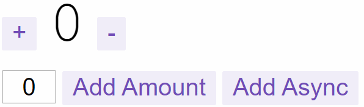
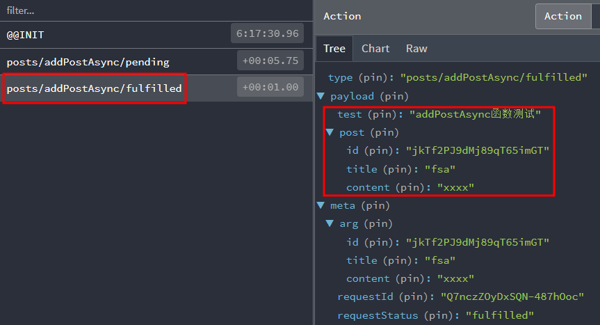
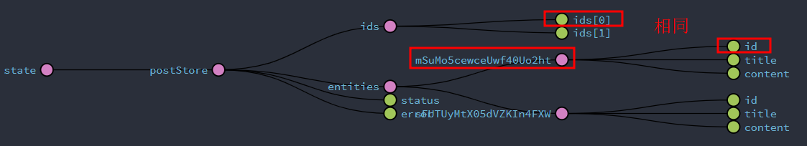

# React生态——Redux

## Redux基本概念

**Redux是一个使用叫做“action”的事件来管理和更新应用状态的模式和工具库**。它以集中式Store的方式对整个应用中使用的状态进行集中管理，其规则确保状态只能以可预测的方式更新。

Redux能帮你管理全局状态，应用程序中很多组件都需要。

Redux是一个小型独立的JS库，但常常和其他包一起使用：

- React-Redux：用于和React集成，让React组件能访问到state片段和dispatch actions更新store。
- Redux Toolkit：推荐编写Redux逻辑的方法，简化Redux原始写法，预防常见错误。
- Redux DevTools扩展：在控制台显示Redux存储状态。

```bash
npm install @reduxjs/toolkit
# 在react18中，安装redux-devtools需要添加--legacy-peer-deps参数
npm install --save-dev redux-devtools --legacy-peer-deps
npm install react-redux --legacy-peer-deps
```

不可变immutable：在前面的React章节已提及到了，必须先复制原先对象或数组，然后更新复制体。

```js
// mutable
const arr = ['a', 'b']
arr.push('c')
arr[1] = 'd'

// immutable
const arr = ['a', 'b']
const arr2 = arr.concat('c')
const arr3 = arr.slice()
```

**Redux期望所有状态更新都是使用不可变的方式**。

应用组成：

- View：基于当前状态的视图声明性描述。
- Store
  - Reducer：接收当前state和action对象，返回新状态。
    - 只能使用state和actions参数计算新状态值。
    - 禁止直接修改state，要求做不可变更新。
    - 禁止任何异步逻辑、依赖随机值或导致其他副作用代码。
  - State：数据源头。
- Actions：具有type字段的JavaScript对象，根据用户输入在应用程序中发生的事件来触发更新。
  - Action Creator：创建并返回Action对象的函数，作用是让你不必每次都手动编写Action对象。
- Dispatch：通过调用`store.dispatch(action)`更新state，然后调用`getState()`获取新state。它的作用类似于事件触发。
- Selector：可以从store状态树中提取指定片段，Selector可以避免重复的读取逻辑。


## 应用结构和数据流

主要分为四块：

- App根组件Provier整个store（只有一个）
- store配置文件（只有一个）
- 一系列reducer文件
- UI层调用文件

```
src
│  App.tsx
│  main.tsx
│  vite-env.d.ts
├─components
│  └─Counter
│          index.module.css
│          index.tsx
└─store
    │  index.ts
    └─reducer
            counterSlice.ts
```

App根组件：

```jsx{1,2,6,8}
import store from "./store";
import { Provider } from 'react-redux'
import { Counter } from "./components/Counter";
// 在顶部通过Provider提供整个store
export default function App() {
  return <Provider store={store}>
    <Counter />
  </Provider>
}
```

store配置文件：

```jsx
import { configureStore } from '@reduxjs/toolkit'
import counterReducer from './reducer/counterSlice'

// 配置store
const store = configureStore({
  reducer: {
    counter: counterReducer,
  }
})

// 相关TS定义，可有可无
export type AppDispatch = typeof store.dispatch
export type RootState = ReturnType<typeof store.getState>

export default store
```

reducer文件例子：

```jsx
import { createSlice, PayloadAction } from '@reduxjs/toolkit'
import type { Dispatch } from '@reduxjs/toolkit'
import { RootState } from '../index'

interface ICounterState {
  count: number
}
const initialState: ICounterState = {
  count: 0
}
// 创建Slice，Slice是应用中干戈功能的Redux reducer逻辑和action的集合
export const counterSlice = createSlice({
  name: 'counter',
  initialState,
  /**
   * 生成三种不同类型的Redux action：
   * {type: "counter/increment"}
   * {type: "counter/decrement"}
   * {type: "counter/incrementByAmount"}
   */
  reducers: {
    increment: (state) => {
      state.count += 1
    },
    decrement: (state) => {
      state.count -= 1
    },
    incrementByAmount: (state, action: PayloadAction<number>) => {
      state.count += action.payload
    },
  },
})

/**
 * 这是个thunk函数，可以执行异步逻辑。
 * 调用thunk时接受dispatch函数作为第一个参数，异步代码执行完毕，可以dispatch actions
 */
export const incrementAsync = (amount: number) => {
  return (dispatch: Dispatch) => {
    setTimeout(() => {
      dispatch(incrementByAmount(amount))
    }, 1000)
  }
}

export const selectCount = (state: RootState) => state.counter.count

export const { increment, decrement, incrementByAmount } = counterSlice.actions

export default counterSlice.reducer
```

UI层调用文件：

```jsx{2-9,13-17}
import React, { useState } from "react";
import { useSelector, useDispatch } from "react-redux";
import {
  decrement,
  increment,
  incrementByAmount,
  incrementAsync,
  selectCount
} from "../../store/reducer/counterSlice";
import styles from "./index.module.css";

export function Counter() {
  // useSelector能让我们从Redux的store状态树种提取需要的任何数据
  const count = useSelector(selectCount);
  // useDispatch能让我们从Redux种访问action
  const dispatch = useDispatch();
  const [incrementAmount, setIncrementAmount] = useState<number>(0);

  return (
    <div>
      <div className={styles.row}>
        <button
          className={styles.button}
          aria-label="Increment value"
          onClick={() => dispatch(increment())}
        >
          +
        </button>
        <span className={styles.value}>{count}</span>
        <button
          className={styles.button}
          aria-label="Decrement value"
          onClick={() => dispatch(decrement())}
        >
          -
        </button>
      </div>
      <div className={styles.row}>
        <input
          className={styles.textbox}
          aria-label="Set increment amount"
          value={incrementAmount}
          onChange={(e: React.ChangeEvent<HTMLInputElement>) => setIncrementAmount(Number(e.target.value))}
        />
        <button
          className={styles.button}
          onClick={() =>
            dispatch(incrementByAmount(Number(incrementAmount) || 0))
          }
        >
          Add Amount
        </button>
        <button
          className={styles.asyncButton}
          onClick={() => dispatch(incrementAsync(incrementAmount))}
        >
          Add Async
        </button>
      </div>
    </div>
  );
}
```



数据流：

- Redux State由reducer函数来更新
- React组件使用useSelector钩子从store读取数据
- React组件使用useDispatch钩子dispatch action来更新store

任意React组件都能从Redux store种拿到其他需要的数据，都能通过dispatch action引发状态更新。

reducers中的函数其实还有种对象写法，当需要设置初始值时可以用到：

```js
const postsSlice = createSlice({
  name: 'posts',
  initialState,
  reducers: {
    postAdded: {
      // 传入的值先在prepare函数中经过处理，然后再包装成payload传给reducer函数
      reducer(state, action) {
        state.push(action.payload)
      },
      prepare(title, content) {
        return {
          payload: {
            id: nanoid(),
            title,
            content
          }
        }
      }
    }
    // other reducers here
  }
})
```

## 异步逻辑

Redux middleware扩展了store，允许让不同类型的异步逻辑与store交互，同时将逻辑和UI分隔开。

Redux有多种异步middleware，每种都允许使用不同语法编写逻辑，最常见的异步middleware是redux-thunk，它可以让你编写可能直接包含异步逻辑的普通函数。Redux Toolkit的`configureStore`功能默认自动设置thunk middleware，是官方推荐方式。

当引入异步逻辑时，添加一个额外步骤，middleware可以像允许AJAX请求这样的逻辑，然后dispatch action：


上面例子中有一个原生的thunk：

```js
export const incrementAsync = amount => dispatch => {
  setTimeout(() => {
    dispatch(incrementByAmount(amount))
  }, 1000)
}
```

Redux数据请求逻辑通常遵循以下可预测模式：

- dispatch action，以指示请求正在进行中，可用于追踪加载状态以允许跳过重复请求或在UI中显示加载中提示。
- 发出异步请求。
- 根据请求结果，异步逻辑dispatch包含结果数据的成功action或包含错误的失败action。这两种情况下，reducer逻辑会清除加载状态，并展示结果数据，要么保存错误中在需求地方展示。

Redux Toolkit提供一个`createAsyncThunk`API来实现这些action的创建和dispatch。

`createAsyncThunk`接收2个参数：

- 将用作生成的action类型的前缀字符串
- payload creator回调函数，返回Promise

当调用`dispatch(fetchPosts())`的时候，`fetchPosts`这个thunk会首先dispatch一个action类型为`'posts/fetchPosts/pending'`，可以在reducer中监听到这个action。一旦Promise成功，`fetchPosts`thunk会接受我们从回调中返回的值，并dispatch一个action，这个action的payload就是resolve或reject内的值，类型为`'posts/fetchPosts/fulfilled'`。



下面将给出具体使用例子。

store：

```ts
import { configureStore } from '@reduxjs/toolkit'
import postsReducer from './reducers/postsSlice'
import { TypedUseSelectorHook, useDispatch, useSelector } from 'react-redux'

// 配置store
const store = configureStore({
  reducer: {
    postStore: postsReducer,
  },
})

export type AppDispatch = typeof store.dispatch
export type RootState = ReturnType<typeof store.getState>

export const useAppDispatch = () => useDispatch<AppDispatch>()
export const useAppSelector: TypedUseSelectorHook<RootState> = useSelector

export default store
```

::: danger
为了让异步和TS整合，重新定义了`useAppDispatch`和`useAppSelector`钩子，否则在使用异步函数时会报TS相关错误：`Argument of type 'AsyncThunkAction<IPost[], void, AsyncThunkConfig>' is not assignable to parameter of type 'AnyAction'`。
:::

定义reducer：

```ts
import { createAsyncThunk, createSlice } from "@reduxjs/toolkit"
import type { RootState } from "../index"

interface IPost {
  id: string
  title: string
  content: string
}
interface IState {
  posts: Array<IPost>
  status: 'idle' | 'loading' | 'succeeded' | 'failed'
  error: any
}

const initialState: IState = {
  posts: [
    { id: '1', title: 'First Post!', content: '你好!'},
    { id: '2', title: 'Second Post!', content: 'Hello World!'},
  ],
  status: 'idle',
  error: null,
}

const postsSlice = createSlice({
  name: 'posts',
  initialState,
  reducers: {
    postAdded(state, action) {
      state.posts.push(action.payload)
    }
  },
  // 使用extraReducers字段在createSlice中监听异步函数状态，进而做出相关修改
  extraReducers(builder) {
    builder.addCase(addPostAsync.pending, (state, action) => {
      state.status = 'loading'
    }).addCase(addPostAsync.fulfilled, (state, action) => {
      state.status = 'succeeded'
      state.posts = state.posts.concat(action.payload)
    }).addCase(addPostAsync.rejected, (state, action) => {
      state.status = 'failed'
      state.error = action.error.message
    }).addCase(addPostAsyncOuter.fulfilled, (state, action) => {
      state.status = 'succeeded'
      state.posts = state.posts.concat(action.payload)
    })
  }
})
// posts下的异步函数
export const addPostAsync = createAsyncThunk(
  'posts/addPostAsync',
  (post: IPost): Promise<Array<IPost>> => {
    return new Promise((resolve, reject) => {
      try {
        setTimeout(() => {
          resolve([
            { id: '101', title: '1 Post!', content: 'resolve thunk 101'},
            { id: '102', title: '2 Post!', content: 'resolve thunk 102'},
          ])
        }, 1000)
      } catch (error) {
        reject([
          { id: '103', title: '3 Post!', content: 'reject thunk 10３'},
        ])
      }
    })
  }
)
// 用户自定义异步函数
export const addPostAsyncOuter = createAsyncThunk(
  'outer/addPostAsyncOuter',
  (post: IPost): Promise<Array<IPost>> => {
    return new Promise((resolve, reject) => {
      try {
        setTimeout(() => {
          resolve([
            { id: '104', title: '4 Post! --- outer', content: 'resolve thunk 104'},
            { id: '105', title: '5 Post! --- outer', content: 'resolve thunk 105'},
          ])
        }, 1000)
      } catch (error) {
        reject([
          { id: '106', title: '6 Post! --- outer', content: 'resolve thunk 106'},
        ])
      }
    })
  }
)
// 通过selector选择器从redux中读取数据逻辑
export const selectAllPosts = (state: RootState) => state.postStore.posts
export const selectPostStatus = (state: RootState) => state.postStore.status

export const { postAdded } = postsSlice.actions

export default postsSlice.reducer
```

::: warning
注意：`createAsyncThunk`创建的异步函数，传入值是UI层组件调用的useSelector钩子传入的参数，返回Promise resolve是异步处理结果，这个异步处理结果如果需要和定义的redux store数据交互，需要通过`extraReducers`相关配置。

`createAsyncThunk`中其实是有错误处理逻辑的，因此Promise reject写了是没有用的，这块逻辑用async/await写更简洁。
:::

顶部App组件提供store：

```tsx
import store from "./store";
import { Provider } from 'react-redux'
import "./App.css"
import PostsForm from "./views/PostsForm";
// 在顶部通过Provider提供整个store
export default function App() {
  return <Provider store={store}>
    <PostsForm />
  </Provider>
}
```

组件UI层：

```tsx
import { nanoid } from "@reduxjs/toolkit";
import { ChangeEvent, useState } from "react";
import { addPostAsync, addPostAsyncOuter, postAdded, selectPostStatus } from "../store/reducers/postsSlice";
import { useAppDispatch, useAppSelector } from '../store/index'
const initFormData = {
  title: '',
  content: '',
}
const AddPostForm = () => {
  const [formData, setFormData] = useState(initFormData)
  const dispatch = useAppDispatch()
  const postStatus = useAppSelector(selectPostStatus)
  const onSavePostClicked = () => {
    if(formData.title && formData.content) {
      // 这个dispatch的返回值可以用unwarp()函数查看相关逻辑
      dispatch(addPostAsyncOuter({
        id: nanoid(),
        title: formData.title,
        content: formData.content,
      }))
      setFormData(initFormData)
    }
  }
  return (
    <div>
      <p className="text-2xl font-bold text-cyan-600">Add a new post</p>
      <form>
        <label htmlFor="postTitle">Post Title：</label>
        <input
          className="border-2 border-black"
          type="text"
          id="postTitle"
          name="postTitle"
          value={formData.title}
          onChange={(e: ChangeEvent<HTMLInputElement>) => setFormData({ ...formData, title: e.target.value})}
        />
        <label htmlFor="postContent">Content：</label>
        <input
          className="border-2 border-black"
          type="text"
          id="postContent"
          name="postContent"
          value={formData.content}
          onChange={(e: ChangeEvent<HTMLInputElement>) => setFormData({ ...formData, content: e.target.value})}
        />
        <button className="block m-2 p-2 text-white bg-blue-500 hover:bg-blue-600" type="button" onClick={onSavePostClicked}>
        { postStatus } --- Save Post
        </button>
      </form>
    </div>
  )
}
export default AddPostForm;
```

```tsx
import { selectAllPosts } from "../store/reducers/postsSlice";
import { useAppSelector } from '../store/index'

const PostsList = () => {
  const posts = useAppSelector(selectAllPosts)
  return (
    <section>
      <p className="text-2xl font-bold">Posts</p>
      { posts.map(post => (
        <article key={post.id} className="border-2 border-black rounded-md my-2">
          <p className="text-red-500 text-xl">{post.title}</p>
          <p>{post.content}</p>
        </article>
      ))}
    </section>
  )
}
export default PostsList;
```

```tsx
import AddPostForm from "../components/AddPostForm";
import PostsList from "../components/PostsList";

const PostsForm = () => {
  return (
    <>
      <AddPostForm />
      <PostsList />
    </>
  )
}
export default PostsForm;
```

## 性能与范式优化

### 记忆化selector函数

`Reselect`是一个创建记忆化selector函数的库，并且是专门设计用来与Redux一起使用的。它有一个`createSelector`函数，可以创建记忆化的 selector，只有在输入发生变化时才会重新计算结果。Redux Toolkit导出了`createSelector`函数，因此我们可以直接使用它。

`createSelector`函数：

- 参数1：数组类型，每个元素是个selector
- 参数2：函数类型，传入参数依次为参数1中各个selector的返回值，执行输出selector

如果我们尝试多次调用 selectPostsByUser，它**只会在posts或userId发生变化时重新执行输出selector**。

```ts
export const selectPostsByUser = createSelector(
  [selectAllPosts, (state, userId) => userId],
  (posts, userId) => posts.filter(post => post.id === userId)
)
```

```tsx{3,15-17}
const PostsList = () => {
  const posts = useAppSelector(selectAllPosts)
  const postsForUser = useAppSelector(state => selectPostsByUser(state, '102'))
  return (
    <section>
      <p className="text-2xl font-bold">Posts</p>
      { posts.map(post => (
        <article key={post.id} className="border-2 border-black rounded-md my-2">
          <p className="text-red-500 text-xl">{post.title}</p>
          <p>{post.content}</p>
        </article>
      ))}
      <div>
        <p>选中的值：</p>
        { postsForUser.map(post => (
          <p key={post.id}>{post.title} - {post.content}</p>
        ))}
      </div>
    </section>
  )
}
```

### 范式化数据

范式化state：

- 我们state中的每个特定数据只有一个副本，不存在重复。
- 已范式化的数据保存在查找表中，其中项目ID是键，项本身是值。
- 也可能有一个特定项用于保存所有ID的数组。

以下是一组“用户”对象的范式化state可能如下所示：
```js
{
  users: {
    ids: ["user1", "user2", "user3"],
    entities: {
      "user1": {id: "user1", firstName, lastName},
      "user2": {id: "user2", firstName, lastName},
      "user3": {id: "user3", firstName, lastName},
    }
  }
}
```

这使得通过ID查找特定的“用户”对象变得简单，不需遍历数组中其他的用户对象：

```js
const userId = 'user2'
const userObject = state.users.entities[userId]
```

Redux Toolkit的`createEntityAdapter`API提供了一种将数据存储在slice中的标准化方法，即获取项目集合并放入到`{ ids: [], entities: {} }`的结构中，除了这个预定义的结构，还会生成一组如何处理改数据的reducer函数和selector。

优点：

1. 不用组件编写代码管理范式化。
2. `createEntityAdapter`的预构建reducer函数能处理一些常见情况，如增删改。
3. `createEntityAdapter`可以基于项的内容将ID保持在排序数组中，并仅在添加/删除项或排序规则更改时才会更新该数组。

Redux Toolkit的`createEntityAdapter`API帮助管理slice中的范式化数据

- 通过传入`sortComparer`选项，可以按排序顺序保持项目ID
- adapter对象包括：
  - `adapter.getInitialState`，它可以接受额外的state字段，如加载state
  - 预先创建通用 reducer，例如setAll、addMany、upsertOne和removeMany
  - `adapter.getSelectors`，生成类似于selectAll和selectById的selector

使用`createEntityAdapter`后，slice写成如下：

```ts
import {
  createAsyncThunk,
  createSlice,
  createSelector,
  createEntityAdapter
} from "@reduxjs/toolkit"
import type { RootState } from "../index"

interface IPost {
  id: string
  title: string
  content: string
}
interface IMSG {
  status: 'idle' | 'loading' | 'succeeded' | 'failed'
  error: any
}

const postsAdapter = createEntityAdapter<IPost>()

const initialState = postsAdapter.getInitialState<IMSG>({
  status: 'idle',
  error: null
})

const postsSlice = createSlice({
  name: 'posts',
  initialState,
  reducers: {
    postAdded(state, action) {
      postsAdapter.upsertOne(state, action.payload)
    }
  },
  extraReducers(builder) {
    builder.addCase(addPostAsync.pending, (state, action) => {
      state.status = 'loading'
    }).addCase(addPostAsync.fulfilled, (state, action) => {
      state.status = 'succeeded'
      postsAdapter.upsertOne(state, action.payload)
    }).addCase(addPostAsync.rejected, (state, action) => {
      state.status = 'failed'
      state.error = action.error.message
    }).addCase(addPostAsyncOuter.fulfilled, (state, action) => {
      state.status = 'succeeded'
      postsAdapter.upsertOne(state, action.payload)
    })
  }
})

export const addPostAsync = createAsyncThunk(
  'posts/addPostAsync',
  (post: IPost): Promise<IPost> => {
    return new Promise((resolve, reject) => {
      setTimeout(() => {
        resolve(post)
      }, 1000)
    })
  }
)

export const addPostAsyncOuter = createAsyncThunk(
  'outer/addPostAsyncOuter',
  (post: IPost): Promise<IPost> => {
    return new Promise((resolve, reject) => {
      setTimeout(() => {
        resolve({
          id: post.id,
          title: `${post.title}-outer`,
          content: `${post.content}-outer`,
        })
      }, 1000)
    })
  }
)

export const {
  selectAll: selectAllPosts,
  selectById: selectPostById,
  selectIds: selectPostIds
} = postsAdapter.getSelectors((state: RootState) => state.postStore)

export const selectPostStatus = (state: RootState) => state.postStore.status
export const selectPostsByUser = createSelector(
  [selectAllPosts, (state, userId) => userId],
  (posts, userId) => posts.filter(post => post.id === userId)
)

export const { postAdded } = postsSlice.actions

export default postsSlice.reducer
```



## RTK Query

RTK Query：是一个强大的数据获取和缓存工具。它旨在**简化在Web应用程序中加载数据的常见情况，无需自己手动编写数据获取和缓存逻辑**。RTK Query是一个包含在Redux Toolkit包中的可选插件，其功能构建在Redux Toolkit中的其他API之上。

RTK Query 主要由两个 API 组成：

- `createApi()`：RTK Query 功能的核心。它允许你定义一组请求接口来描述如何从一系列请求接口检索数据，包括如何获取和转换该数据的配置。在大多数情况下，你应该在每个应用程序中使用一次，根据经验，“每个基本URL一个API slice”。
- `fetchBaseQuery()`: fetch 的一个小包装，旨在简化请求。旨在为大多数用户在`createApi`中使用推荐的`baseQuery`。

Redux Toolkit核心API不会更改Redux应用程序中的任何基本数据流，你仍在调度操作和编写reducer，只是代码比手动编写所有逻辑要少。RTK Query同理，这是一个额外的抽象级别，但在内部，它仍在执行我们已经看到的用于管理异步请求及其响应的完全相同的步骤。

但是，当你使用RTK Query时，会发生思维转变。我们不再考虑“管理状态”本身。相反，我们现在**考虑“管理缓存数据”**。与其尝试自己编写reducer，我们现在将专注于定义“这些数据来自哪里？”、“这个更新应该如何发送？”、“这个缓存的数据应该什么时候重新获取？”，以及“缓存的数据应该如何更新？”。如何获取、存储和检索这些数据成为我们不再需要担心的实现细节。

定义apiSlice：

```ts
import { createApi, fetchBaseQuery } from '@reduxjs/toolkit/query/react'

interface IPost {
  id: string
  title: string
  content: string
}

export const apiSlice = createApi({
  // 定义顶级状态slice字段
  reducerPath: 'api',
  // 我们所有的请求都有以/fakeApi开头的URL
  baseQuery: fetchBaseQuery({ baseUrl: '/fakeApi' }),
  tagTypes: ['Posts'],
  // endpoints代表对该服务器的操作和请求
  endpoints: builder => ({
    // getPosts是一个返回数据的Query操作
    getPosts: builder.query<any, void>({
      // 请求的URL是/fakeApi/posts
      query: () => '/posts',
    }),
    // updatePosts是个突变操作，即更新服务器上数据的操作
    updatePosts: builder.mutation<any, IPost>({
      query: (body) => {
        const { id, title, content} = body
        return {
          url: `/updatePosts/${id}`,
          method: 'POST',
          body: {
            title,
            content,
          }
        }
      },
      // 更新会使提供了这些标签的查询失效
      invalidatesTags: (result, error, arg) => [
        { type: 'Posts', id: arg.id }
      ]
    })
  })
})

// 为Query endpoint导出自动生成的hooks
export const { useGetPostsQuery, useUpdatePostsMutation } = apiSlice
```

在store中注册：

```ts{4,10,12,13}
import { configureStore } from '@reduxjs/toolkit'
import { TypedUseSelectorHook, useDispatch, useSelector } from 'react-redux'
import postsReducer from './reducers/postsSlice'
import { apiSlice } from './reducers/apiSlice'

// 配置store
const store = configureStore({
  reducer: {
    postStore: postsReducer,
    [apiSlice.reducerPath]: apiSlice.reducer,
  },
  // 这个middleware必须添加，它管理缓存的生命周期和控制是否过期
  middleware: getDefaultMiddleware => getDefaultMiddleware().concat(apiSlice.middleware),
})

export type AppDispatch = typeof store.dispatch
export type RootState = ReturnType<typeof store.getState>

export const useAppDispatch = () => useDispatch<AppDispatch>()
export const useAppSelector: TypedUseSelectorHook<RootState> = useSelector

export default store
```

在UI组件层使用：

```tsx
import { useGetPostsQuery, useUpdatePostsMutation } from '../store/reducers/apiSlice'
const PostsList = () => {
  // refetch是请求操作函数
  const { data, isLoading: isGetPostsLoading, refetch: getPostsAPI } = useGetPostsQuery()
  // 数组第一个元素是操作函数
  const [updatePostsAPI, { isLoading: isUpdatePostsLoading }] = useUpdatePostsMutation()

  const updatePosts = () => {
    updatePostsAPI({ id: '1234', title: 'Alice', content: '你好世界' }).then(r => {
      console.log(r)
    })
  }
  if (isGetPostsLoading) {
    return <div>加载中...</div>
  }
  return (
    <section>
      <p>
        <button onClick={getPostsAPI}>getPostsAPI操作</button>
        <button onClick={updatePosts}>updatePosts操作</button>
      </p>
    </section>
  )
}
export default PostsList;
```
