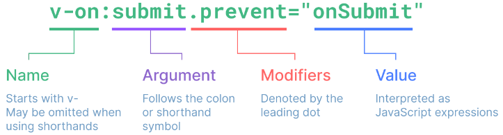

# Vue3基础

## 应用实例

通过`createApp()`创建应用实例：

```js
import { createApp } from 'vue'
const app = createApp({
  /* 根组件选项 */
})
```
传入createApp的对象实际上是一个组件，每个应用都有一个根组件：

```js
import { createApp } from 'vue'
import App from './App.vue'
const app = createApp(App)
```

对实例调用`mount()`方法，并传入容器参数，这样就能**挂载应用**了：

```vue
<div id="app"></div>
```
```js
app.mount('#app')
```

应用实例会暴露一个`.config`对象来允许**配置应用级选项**：

```js
app.config.errorHandler = (err) => {
  /* 处理错误 */
}
// 注册全局组件
app.component('TodoDeleteButton', TodoDeleteButton)
```

## 模板

- 文本：双括号
- HTML：`<span v-html="rawHtml"></span>`
- 属性绑定
  - 一般情况：`<div :id="dynamicId"></div>`
  - 布尔类型：`<button :disabled="isButtonDisabled">Button</button>`。当`isButtonDisabled`为false时候，属性disabled会被忽略。
  - 多个值

```vue
const objectOfAttrs = {
  id: 'container',
  class: 'wrapper'
}
// 绑定多个属性值
<div v-bind="objectOfAttrs"></div>
```

- JavaScript表达式
  - 可以使用在`{{}}`内和任何Vue指令属性值中
  - 表达式将被沙盒话，仅能访问到有限的全家对象列表，没有在该列表中的就不能访问，比如`window`上的属性，但可以手动在`app.config.globalProperties`上显式添加。
- 指令
  - 参数：`<a v-bind:href="url">链接</a>`。href是一个参数，告诉v-bind指令将表达式url的值绑定到元素的href属性上。
  - 动态参数：`<a v-bind:[attributeName]="url">链接</a>`
  - 修饰符：表明指令需要以一些特殊方式被绑定。例如`.prevent`修饰符会告知v-on指定对触发事件调用`event.preventDefault()`



## 响应式基础

### reactive

通过`reactive()`创建一个响应式**对象或数组**，`reactive()`是**深层响应性**的。

```js
import { reactive } from 'vue'
const obj = reactive({
  nested: { count: 0 },
  arr: ['foo', 'bar']
})
function mutateDeeply() {
  // 以下都会按照期望工作
  obj.nested.count++
  obj.arr.push('baz')
}
```

`reactive()`返回原始对象的Proxy，**代理和原始对象是不相等的**，只有代理对象是响应式的。

为了保证代理一致性，代理对象都是相等的，这个规则对嵌套对象也适用。

```js
const raw = {}
const proxy = reactive(raw)
console.log(reactive(raw)===proxy, reactive(proxy)===proxy)  // true, true
```

`reactive()`局限性：

1. 仅对对象类型（对象、数组、Map、Set）有效，对原始类型（string、number、boolean等）无效。
2. 响应式对象不能整体替换，导致对初始引用的响应性连接丢失。`raw = reactive({ count: 1 })`就和之前的对象不相等了。
3. 对象解构和传入函数时候会失去响应性。

### ref

#### 基本使用

`ref()`将传入参数值包裹为一个带`.value`属性的ref对象，ref的`.value`属性也是响应式的。

ref能整体替换：

```js
const objectRef = ref({ count: 0 })
// 这是响应式的替换
objectRef.value = { count: 1 }
```

对象解构和传入函数时候不会失去响应性：

```js
const obj = {
  foo: ref(1),
  bar: ref(2)
}
// 该函数接收一个 ref
// 需要通过 .value 取值
// 但它会保持响应性
callSomeFunction(obj.foo)
// 仍然是响应式的
const { foo, bar } = obj
```

#### 解包

ref模板解包：

> 解包就是将`Ref<any>`类型转化为`any`类型

1.ref在模板中作为顶层属性被访问时候会自动解包，所以不许去使用`.value`。对于非顶层的属性，应该通过解构让其变成顶层。

ref在模板中作为顶层属性被访问时候会自动解包，所以不许去使用.value。对于非顶层的属性，应该通过解构让其变成顶层。

2.如果ref是文本插值计算的最终值，也会解包

```vue
<script setup lang="ts">
import { ref } from 'vue'
const obj = {
  count: ref(1)
}
</script>
<template>
  <!-- 解包为1 -->
  <div>{{ obj.count }}</div>
</template>
```

ref响应式对象解包：

1.ref被嵌套在响应式对象中，作为属性访问或更改时候自动解包。

```js
const count = ref(0)
const state = reactive({
  count
})
console.log(state.count) // 嵌套在响应式对象中，作为属性，打印0
state.count = 1
console.log(count.value) // 1
```

2.新ref赋值给一个关联已有ref的属性，就会替换掉旧的ref。

```js
const otherCount = ref(2)
state.count = otherCount
console.log(state.count) // 2
// 原始 ref 现在已经和 state.count 失去联系
console.log(count.value) // 1
```

深层响应式对象才会发生ref解包，浅层属性不会解包。

ref数组集合解包：

1.当 ref 作为响应式数组或像 Map 这种原生集合类型的元素被访问时，不会进行解包。

### 总结

不同（使用层面）：

- reactive只支持传入对象（普通对象、数组、Map、Set等等）；ref支持传入任何类型。
- ref需要通过.value访问，reactive不用。也正因为如此，ref可以整体更换，reactive不能。

联系：

- 如果参数是对象类型，ref底层本质上还是reactive。

ref解包，即`.value`，解包规则有很多，主要记住下面两条即可：

- ref作为顶层属性在模板中使用时候能自动解包
- ref被嵌套在深层响应式对象中，作为属性访问或更改时发生解包

## computed

使用计算属性来描述依赖响应式状态的复杂逻辑。

`computed()`方法期望接收一个getter函数，返回一个计算属性ref，可以通过`.value`访问计算结果。

```js
// 一个计算属性 ref
const publishedBooksMessage = computed(() => {
  return author.books.length > 0 ? 'Yes' : 'No'
})
```

计算属性和直接函数调用结果上是完全相同的，然而不同之处在于**计算属性会基于其响应式依赖被缓存**，只要依赖值不变，无论访问多少次都会返回先前计算结果，不用重复执行getter函数。

总结：计算属性必须依赖响应式对象或值，否则不起作用。依赖项改变，才会执行getter函数。

可写计算属性：

调用setter后，新值赋给了firstName和lastName，这时候会再次调用getter

```vue
<script setup>
import { ref, computed } from 'vue'
const firstName = ref('John')
const lastName = ref('Doe')
const fullName = computed({
  // getter
  get() {
    return firstName.value + ' ' + lastName.value
  },
  // setter
  set(newValue) {
    // 注意：我们这里使用的是解构赋值语法
    [firstName.value, lastName.value] = newValue.split(' ')
  }
})
</script>
```

## class

- 绑定类
- 绑定数组

```vue
<template>
  <!-- 绑定类 -->
  <div
    class="static"
    :class="{ active: isActive, 'text-danger': hasError }"
  ></div>
  <!-- 绑定数组 -->
  <div :class="[isActive ? activeClass : '', errorClass]"></div>
</template>
```

## v-if和v-show

相同：

- 都是条件性动态控制DOM元素的显示和隐藏

不同：

- 实现方式：被v-if包裹的区块满足条件才会渲染；被v-show包裹的区块始终渲染，v-show止水切换元素的display属性
- 编译：v-if为true才发生局部渲染，为false则卸载；v-show是在任何条件下都会被编译然后缓存，而且DOM元素保留

## v-for

v-for可以遍历：

- 数组
- 对象
- 范围值

```vue
<script setup>
import { reactive, ref } from 'vue'
const arr = ref([{ message: 'Foo' }, { message: 'Bar' }])
const obj = reactive({
  title: 'How to do lists in Vue',
  author: 'Jane Doe',
  publishedAt: '2016-04-10'
})
</script>

<template>
  <!-- 遍历数组 -->
  <li v-for="(item, index) of arr">
    {{ index }} - {{ item.message }}
  </li>
  <!-- 遍历对象 -->
  <li v-for="(value, key, index) of obj">
    {{ index }} - {{ key }} - {{ value }}
  </li>
  <!-- 遍历范围值 -->
  <span v-for="n in 10">{{ n }}</span>
</template>
```

绑定key值：期望基础类型，如string或number，不要使用对象作为v-for的key。

数组变化检测：对于调用能改变原数组的方法，如sort()、push()等，Vue能侦听到并触发更新。对于不可变方法，如filter()、slice()，总是返回一个新数组，这时候需要将旧数组替换为新的。

```js
items.value = items.value.filter((item) => item.message.match(/Foo/))
```

## 事件

### 监听事件

#### 内联事件处理器

1.基本使用

```vue
<script setup>
import { ref } from 'vue'
const count = ref(0)
</script>
<template>
  <button @click="count++">Add 1</button>
	<p>Count is: {{ count }}</p>
</template>
```

2.在内联处理器中调用方法

```vue
<script setup>
function say(message) {
  alert(message)
}
</script>
<template>
	<button @click="say('hello')">Say hello</button>
	<button @click="say('bye')">Say bye</button>
</template>
```

3.在内联事件处理器中访问事件参数

传入一个特殊的`$event`变量，或者使用内联箭头函数。

```vue
<script setup>
function warn(message, event) {
  // 这里可以访问原生事件
  if (event) {
    event.preventDefault()
  }
  alert(message)
}
</script>
<template>
  <!-- 使用特殊的 $event 变量 -->
  <button @click="warn('Form cannot be submitted yet.', $event)">
    Submit
  </button>
  <!-- 使用内联箭头函数 -->
  <button @click="(event) => warn('Form cannot be submitted yet.', event)">
    Submit
  </button>
</template>
```

#### 方法事件处理器

```vue
<script setup>
const name = ref('Vue.js')
function greet(event) {
  alert(`Hello ${name.value}!`)
  // event是DOM原生事件
  if (event) {
    alert(event.target.tagName)
  }
}
</script>
<template>
  <!-- `greet` 是上面定义过的方法名 -->
	<button @click="greet">Greet</button>
</template>
```

### 事件修饰符

- `.stop`：阻止事件冒泡。`event.stopPropagation()`。
- `.prevent`：阻止默认事件行为。`event.preventDefault()`。
- `.self`：当事件在该元素本身触发事件。
- `.capture`：使用事件捕获模式。
- `.once`：事件只触发一次。
- `.passive`：永远不会调用`event.preventDefault()`。

::: tip
passive属性见MDN的`addEventListener`部分：https://developer.mozilla.org/zh-CN/docs/Web/API/EventTarget/addEventListener

可以通过passive来改善滚屏性能，默认情况下，触摸事件和滚轮事件的事件监听器在浏览器尝试滚动页面时有阻塞浏览器主线程的可能性——这可能会大大降低浏览器处理页面滚动时的性能。为了解决这一问题，大部分浏览器的文档节点事件上的passive默认值都是true，如此事件监听器就不能取消事件，也不会在用户滚动页面时阻止页面呈现。
:::

::: danger
请勿同时使用`.passive`和`.prevent`，因为`.passive`已经向浏览器表明了你不想阻止事件的默认行为。如果你这么做了，则`.prevent`会被忽略，并且浏览器会抛出警告。
:::

### 键盘按键修饰符

普通按键：

- `.enter`
- `.tab`
- `.delete` (捕获“Delete”和“Backspace”两个按键)
- `.esc`
- `.space`
- `.up`
- `.down`
- `.left`
- `.right`

系统按键：

- `.ctrl`
- `.alt`
- `.shift`
- `.meta`

::: tip
在 Mac 键盘上，meta 是 Command 键 (⌘)。在 Windows 键盘上，meta 键是 Windows 键 (⊞)。
:::

```html
<!-- Alt + Enter -->
<input @keyup.alt.enter="clear" />
<!-- Ctrl + 点击 -->
<div @click.ctrl="doSomething">Do something</div>
```

系统按键和普通按键不同，与keyup事件一起使用时，系统按键必须在事件发出时处于按下状态。比如`@keyup.ctrl`如果单独松开ctrl键是不会触发的，只有在按住ctrl同时松开另一个键时才会触发。

果想按ctrl单独触发，应该加上`.exact`修饰符。

- `.exact`：允许控制触发一个事件所需的确定组合的系统按键修饰符。

```html
<!-- 当按下 Ctrl 时，即使同时按下 Alt 或 Shift 也会触发 -->
<button @click.ctrl="onClick">A</button>
<!-- 仅当按下 Ctrl 且未按任何其他键时才会触发 -->
<button @click.ctrl.exact="onCtrlClick">A</button>
<!-- 仅当没有按下任何系统按键时触发 -->
<button @click.exact="onClick">A</button>
```

### 鼠标按键修饰符
- `.left`
- `.right`
- `.middle`

注意要和键盘按键修饰符的`.left`和`.right`区分。

## 表单输入绑定

## 生命周期

### 生命周期图示


### 生命周期钩子

#### 钩子作用

::: warning
组合式API没有beforeCreate和created相关钩子，但选项式API中有。
:::

| 生命周期钩子 | 触发时机 | 组件状态 |
| --- | --- | --- |
| `onBeforeMount` | 组件挂载前调用 | 完成了响应式状态的设置，但没有创建DOM节点 |
| `onMounted` | 组件挂载完成后调用 | 所有**同步子组件**均已挂载；DOM树已经创建完成并插入到父容器中 |
| `onBeforeUpdate` | 在组件即将响应式状态变更而更新其DOM树之前调用 | DOM状态还未更新 |
| `onUpdated` | 在组件响应式状态变更而更新其DOM树之后调用，组件任意DOM更新都会触发调用 | DOM状态完成更新 |
| `onBeforeUnmount` | 组件卸载前调用 | 组件实例依然保有全部功能 |
| `onUnmounted` | 组件卸载完成后调用 | 所有子组件均已卸载；所有相关响应式作用都已停止 |

::: danger
注意：禁止在`updated()`钩子中更改组件状态，这可能导致无线的更新循环！
:::

#### 调用顺序

父组件：

```vue
<template>
  <button @click="handleSwitch">切换</button>
  <Child v-if="visible" :data="data"/>
</template>

<script lang="ts" setup>
import { onBeforeUpdate, onBeforeMount, onBeforeUnmount, onMounted, onUpdated, onUnmounted, ref } from 'vue';
import Child from './components/Child.vue';
const visible = ref(false);
const data = ref({ x: 0, y: 1, z: 2});
onBeforeMount(() => {
    console.log('🚀 -> App -> onBeforeMount')
})
onMounted(() => {
    console.log('🚀 -> App -> onMounted')
})
onBeforeUpdate(() => {
    console.log('🚀 -> App -> onBeforeUpdate')
})
onUpdated(() => {
    console.log('🚀 -> App -> onUpdated')
})
onBeforeUnmount(() => {
    console.log('🚀 -> App -> onBeforeUnmount')
})
onUnmounted(() => {
    console.log('🚀 -> App -> onUnmounted')
})
const handleSwitch = () => {
  console.log('🚀 -> App -> handleSwitch -> 触发子组件DOM是否展示')
  visible.value = !visible.value
}
</script>
```

子组件：

```vue
<template>
    <div class="child">
        <h3>Child组件</h3>
        <button @click="add">+1</button>
        <div>{{ count }}</div>
        <p>父组件数据：{{ data }}</p>
    </div>
</template>

<script lang="ts" setup>
import { onBeforeUpdate, onBeforeMount, onBeforeUnmount, onMounted, onUpdated, onUnmounted, ref, defineProps } from 'vue';
const props = defineProps({
    data: {
        type: Object,
        required: true,
        default: () => {},
    }
});
const count = ref(0);
onBeforeMount(() => {
    console.log('🚀 -> Child -> onBeforeMount', props.data)
})
onMounted(() => {
    console.log('🚀 -> Child -> onMounted')
})
onBeforeUpdate(() => {
    console.log('🚀 -> Child -> onBeforeUpdate')
})
onUpdated(() => {
    console.log('🚀 -> Child -> onUpdated')
})
onBeforeUnmount(() => {
    console.log('🚀 -> Child -> onBeforeUnmount')
})
onUnmounted(() => {
    console.log('🚀 -> Child -> onUnmounted', props.data)
})
const add = () => {
    console.log('🚀 -> Child -> add -> 触发子组件count自增')
    count.value++
}
</script>

<style scoped>
.child {
    background: red;
    padding: 4px;
    
}
</style>
```

通过实验，它们的调用顺序式这样的：


## Watch

### 基本使用

用于在状态变化时执行一些副作用，例如更改DOM或一些异步操作去修改另一处状态。

侦听源的类型：

- 响应式对象
- getter函数
- 多个源构成的数组

```js
const x = ref(0)
const y = ref(0)
// 单个 ref
watch(x, (newX) => {
  console.log(`x is ${newX}`)
})
// getter 函数
watch(
  () => x.value + y.value,
  (sum) => {
    console.log(`sum of x + y is: ${sum}`)
  }
)
// 多个来源组成的数组
watch([x, () => y.value], ([newX, newY]) => {
  console.log(`x is ${newX} and y is ${newY}`)
})
```

注意：不能侦听响应式对象的属性值！
```js
const obj = reactive({ count: 0 })
watch(
  // 错误，因为 watch() 得到的参数是一个 number // [!code error]
  obj.count, // [!code error]
  // 提供一个 getter 函数
  () => obj.count,
  (count) => {
    console.log(`count is: ${count}`)
  }
)
```

### 深层侦听器

直接传入响应式对象会隐式创建深层侦听器，但如果传入的是getter函数，只有在返回不同对象时才会触发回调。

```js
const obj = reactive({ count: 0 })
watch(obj, (newValue, oldValue) => {
  // 在嵌套的属性变更时触发
  // 注意：`newValue` 此处和 `oldValue` 是相等的
  // 因为它们是同一个对象！
})
obj.count++
```

相比之下，一个返回响应式对象的 getter 函数，只有在返回不同的对象时，才会触发回调：

当然可以通过显式添加deep选项强制转换为深层侦听器：

```js
watch(
  () => state.someObject,
  () => {
    // 仅当 state.someObject 被替换时触发
  },
  // { deep: true }  // [!code ++]
)
```

### watchEffect

watch()是懒执行的，只有在数据源发生变化时候才执行回调。但watchEffect()会立刻执行一遍回调，如果函数产生副作用，Vue会自动追踪副作用的依赖关系，自动分析出响应源。

```js
watchEffect(async () => {
  // 执行期间会自动追踪url.value作为依赖，当url.value变化时回调再次执行
  const response = await fetch(url.value)
  data.value = await response.json()
})
```

区别：

- watch值追踪明确的侦听源，仅在数据源改变时才触发回调。watchEffect则会在副作用发生期间追踪所有能访问到的响应式属性，依赖关系不那么明朗。

默认情况下，侦听器回调是在组件更新前触发的，可以指名`flush: 'post'`让其侦听更新后的DOM：

```js
watch(source, callback, {
  flush: 'post'
})
watchEffect(callback, {
  flush: 'post'
})
// 后置刷新的 watchEffect() 有个更方便的别名 watchPostEffect()
watchPostEffect(() => {
  /* 在 Vue 更新后执行 */
})
```

可以调用watch或watchEffect返回的函数来停止侦听器：

```js
const unwatch = watchEffect(() => {})
// ...
unwatch()
```

## 模板引用

### 基本使用

定义引用：

```html
<input ref="inputRef">
```

访问模板引用：

```vue
<script setup>
import { ref, onMounted } from 'vue'
// 声明一个 ref 来存放该元素的引用
// 必须和模板里的 ref 同名
const inputRef = ref(null)
onMounted(() => {
  inputRef.value.focus()
})
</script>
```

::: danger
注意：只能在组件挂载后才能访问模板引用，如果想在模板中的表达式上访问input，在初次渲染时会是null，这是因为在初次渲染前该元素还不存在。
:::

在v-for中使用模板引用时，对应的ref中包含的值是一个**数组**，在元素被挂载后**包含对应整个列表所有元素**，但**ref数组并不保证与源数组相同的顺序。**

```vue
<script setup>
import { ref, onMounted } from 'vue'
const list = ref([
  /* ... */
])
const itemRefs = ref([])
onMounted(() => console.log(itemRefs.value))
</script>
<template>
  <ul>
    <li v-for="item in list" ref="itemRefs">
      {{ item }}
    </li>
  </ul>
</template>
```

### 在ref上定义函数

el是元素的引用，该函数会在每次组件更新时都被调用。当绑定的元素卸载时，函数也会被调用一次，此时的el参数会是null。

```html
<input :ref="(el) => { /* 将 el 赋值给一个数据属性或 ref 变量 */ }">
```

### 组件上的ref

这种情况下的引用获得的值是组件实例：

```vue
<script setup>
import { ref, onMounted } from 'vue'
import Child from './Child.vue'
const child = ref(null)
onMounted(() => {
  // child.value 是 <Child /> 组件的实例
})
</script>
<template>
  <Child ref="child" />
</template>
```

组件引用的特殊情况：

- 如果**子组件**使用是选项式API或没有使用`<script setup>`，被引用的组件实例和该组件的this完全一致，这意味着**父组件对子组件每个属性和方法都有完全的访问权**。当然，大多数情况，还是建议使用标准的props和emit接口来实现父子组件交互。
- 如果**子组件**使用了`<script setup>`，那么子组件就是默认私有的，父组件无法访问子组件任何东西，除非子组件中通过defineExpose宏显示暴露。

```vue
<script setup>
import { ref } from 'vue'
const a = 1
const b = ref(2)
// 当父组件通过模板引用获取到了该组件的实例时，得到的实例类型为 { a: number, b: number }
defineExpose({
  a,
  b
})
</script>
```