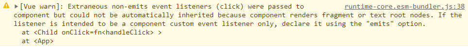
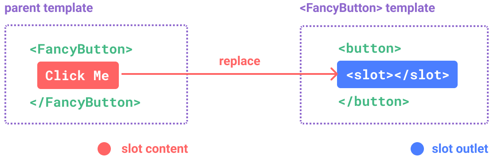
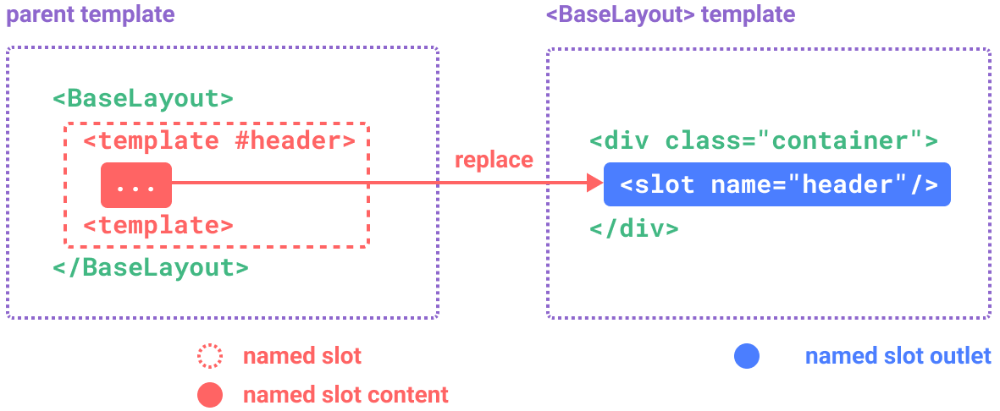
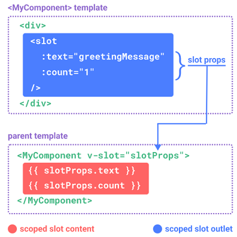
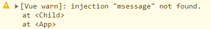

# Vue3组件

## 注册

### 全局注册

全局注册的组件可以在此应用的任意组件的模板中使用。

```js
import ComponentA from './ComponentA.vue'
import ComponentB from './ComponentB.vue'
import ComponentC from './ComponentC.vue'
// component函数第一个参数是组件注册的名字，第二个参数是组件的实现
app
  .component('ComponentA', ComponentA)
  .component('ComponentB', ComponentB)
  .component('ComponentC', ComponentC)
```

全局注册是很方便的，但也有一些缺点：

- 全局组件并没有在生产打包时被自动移除（tree-shaking）。
- 全局组件在大型项目中的依赖关系不明确，影响系统的可维护性。

### 局部注册

在`<script setup>`单文件组件中，导入的组件可以直接在模板使用，无需注册：

```vue
<script setup>
import ComponentA from './ComponentA.vue'
</script>

<template>
  <ComponentA />
</template>
```

如果没有`<script setup>`则需要显示注册：

```js
import ComponentA from './ComponentA.js'
export default {
  components: {
    ComponentA
  },
  setup() {
    // ...
  }
}
```

## Props

### 声明与使用

声明：
在使用`<script setup>`的单文件组件中，props可以使用`defineProps()`宏来声明：

```vue
<script setup>
const props = defineProps(['foo'])
console.log(props.foo)
</script>
```

在没有使用`<script setup>`的组件中，prop可以使用props选项来声明：

```js
export default {
  props: ['foo'],
  setup(props) {
    // setup() 接收 props 作为第一个参数
    console.log(props.foo)
  }
}
```

除了用字符串数组声明prop外，还可以用对象形式：

```js
// 使用 <script setup>
defineProps({
  title: String,
  likes: Number
})
```

### 单向数据流

所有的 props 都遵循着**单向绑定**原则，props因父组件的更新而变化，自然地将新的状态向下流往子组件，而不会逆向传递。

因此不应该在子组件中去更改一个prop：

```js
const props = defineProps(['foo'])
// ❌ 警告！prop 是只读的！
props.foo = 'bar'
```

要想改变prop的值，可以有如下方式：

- 创建副本
  - prop被用于传入初始值，子组件之后将其作为一个局部数据属性副本。
  - 对传入的prop做更一步转换，比如使用计算属性。
- 子组件抛出事件通知父组件做出改变

### 校验

```js
defineProps({
  // 基础类型检查
  // （给出 `null` 和 `undefined` 值则会跳过任何类型检查）
  propA: Number,
  // 多种可能的类型
  propB: [String, Number],
  // 必传，且为 String 类型
  propC: {
    type: String,
    required: true
  },
  // Number 类型的默认值
  propD: {
    type: Number,
    default: 100
  },
  // 对象类型的默认值
  propE: {
    type: Object,
    // 对象或数组的默认值
    // 必须从一个工厂函数返回。
    // 该函数接收组件所接收到的原始 prop 作为参数。
    default(rawProps) {
      return { message: 'hello' }
    }
  },
  // 自定义类型校验函数
  propF: {
    validator(value) {
      // The value must match one of these strings
      return ['success', 'warning', 'danger'].includes(value)
    }
  },
  // 函数类型的默认值
  propG: {
    type: Function,
    // 不像对象或数组的默认，这不是一个工厂函数。这会是一个用来作为默认值的函数
    default() {
      return 'Default function'
    }
  }
})
```

::: tip
`defineProps()`宏中的参数不可以访问`<script setup>`中定义的其他变量，因为在编译时整个表达式都会被移到外部的函数中。
:::

补充细节：

- prop默认可选，除非声明`required: true`
- 除Boolean外未传入的prop默认值为undefined；Boolean未传入的值默认为false。
- 如果声明default值，prop只要解析为undefined时，无论是否传递，都会改为default值。

校验选项中的type可以是下列这些原生构造函数：

- String
- Number
- Boolean
- Array
- Object
- Date
- Function
- Symbol

这里的校验是通过`instanceof`实现的，即判断传入prop是否是构造函数的实例。

## 事件

### 触发自定义事件

子组件：

```html
<!-- MyButton -->
<button @click="$emit('increaseBy', 1)">
  Increase by 1
</button>
```

父组件：

```html
<MyButton @increase-by="(n) => count += n" />
<MyButton @increase-by="increaseCount" />
```
```js
function increaseCount(n) {
  count.value += n
}
```

::: warning
和原生 DOM 事件不一样，组件触发的事件没有冒泡机制。
:::

### 声明触发事件

通过`defineEmit()`来声明：

```vue
<script setup>
const emit = defineEmits(['inFocus', 'submit'])
function buttonClick() {
  emit('submit')
}
</script>
```

`defineEmits()`宏不能在子函数中使用。如上所示，它必须直接放置在 `<script setup>`的顶级作用域下。

如果你显式地使用了setup函数而不是`<script setup>`，则事件需要通过emits选项来定义，emit函数也被暴露在`setup()`的上下文对象上：

```js
export default {
  emits: ['inFocus', 'submit'],
  setup(props, ctx) {
    ctx.emit('submit')
  }
}
```

这个 emits 选项还支持对象语法，它允许我们对触发事件的参数进行验证：

```vue
<script setup>
const emit = defineEmits({
  submit(payload) {
    // 通过返回值为 `true` 还是为 `false` 来判断
    // 验证是否通过
  }
})
</script>
```

### 事件校验

```vue
<script setup>
const emit = defineEmits({
  // 没有校验
  click: null,

  // 校验 submit 事件
  submit: ({ email, password }) => {
    if (email && password) {
      return true
    } else {
      console.warn('Invalid submit event payload!')
      return false
    }
  }
})

function submitForm(email, password) {
  emit('submit', { email, password })
}
</script>
```

### 配合v-model使用

此处事件配合v-model使用，较难，暂时跳过。

## 透传Attributes

### Attributes 继承

透传Attributes指的是传递给一个组件属性，但并没有被该组件声明为props、emits的属性或v-on事件监听器。最常见的是例子有class、style、id。

1.class、style会发生合并
```html
<!-- 父组件 -->
<MyButton class="large" />
<!-- 子组件 -->
<button class="btn">click me</button>
最终渲染的DOM：
<button class="btn large">click me</button>
```

2.v-on

点击按钮，父组件和子组件绑定的click事件都会触发。先触发子组件事件，再触发父组件事件。

```vue
<!-- 父组件 -->
<template>
  <MyButton @click="handleClick"/>
</template>

<script lang="ts" setup>
import MyButton from './components/MyButton.vue'
const handleClick = () => {
    console.log('父组件触发click')
}
</script>
```
```vue
<!-- 子组件 -->
<template>
  <button @click="handleClick" class="border-2 border-red-500">子组件按钮</button>
</template>

<script lang="ts" setup>
const handleClick = () => {
    console.log('子组件按钮触发click')
}
</script>
```

3.深层组件继承

App--->MyButton--->BaseButton

此时`<MyButton>`接收的透传 attribute 会直接继续传给`<BaseButton>`。

### 禁用Attributes 继承

如果想禁用继承功能，可以在组件选项中设置`inheritAttrs: false`
如果使用`<script setup>`，则需要另外写：

```vue
<script>
// 使用普通的 <script> 来声明选项
export default {
  inheritAttrs: false
}
</script>

<script setup>
// ...setup 部分逻辑
</script>
```

透传进来的attribute可以在模板表达式中直接用`$attrs`访问到。`$attrs` 对象包含了除组件所声明的 props 和 emits 之外的所有其他 attribute，例如 class，style，v-on 监听器等等。

注意点：

- 和props不同，透传attributes在JavaScript中保留原始大小写。比如`foo-bar`需要通过`$attrs['foo-bar']`来访问
- 像@click这样的事件监听器暴露为一个函数`$attrs.onClick`。

### 多根节点Attributes继承

多个根节点组件没有自动attribute透传行为，如果$attrs没有被显示绑定，会抛出一个运行时警告：



如果`$attrs`被显示绑定，则不会有警告：

```vue
<template>
  <button @click="handleClick" class="border-2 border-red-500">子组件按钮1</button>
  <button v-bind="$attrs" @click="handleClick" class="border-2 border-blue-500">子组件按钮2</button>
</template>
```

### 在JavaScript中访问透传Attributes

- 在`<script setup>`中使用`useAttrs()`API访问一个组件所有透传attribute。
- 如果没有`<script setup>`，attrs会作为`setup()`上下文对象的一个属性暴露。

```js
export default {
  setup(props, ctx) {
    // 透传 attribute 被暴露为 ctx.attrs
    console.log(ctx.attrs)
  }
}
```

注意：这里的attrs对象获取的是最新的透传attribute，但不是响应式的，因而不能用侦听器监听变化。
## 插槽

### 基础使用

比如有一个`<FancyButton>`组件：

```vue
<FancyButton>
  Click me! <!-- 插槽内容 -->
</FancyButton>
```

而`<FancyButton>`组件模板是这样的：

```html
<button class="fancy-btn">
  <slot>Submit</slot> <!-- 插槽出口 -->
</button>
```

那么最终组件包裹的内容就会插入到模板的`<slot></slot>`处。

最终渲染是这样的：
```html
<button class="fancy-btn">Click me!</button>
```

如果`<FancyButton>`组件**包裹内容为空**，这时候展示`<slot>...</slot>`内的默认内容：

```html
<button class="fancy-btn">Submit</button>
```



### 渲染作用域

```vue
<navigation-link url="/profile">
  Logged in as {{ user.name }}
</navigation-link>
```

```vue
<navigation-link url="/profile">
  Clicking here will send you to: {{ url }}
</navigation-link>
```

上面那个是可以使用数据的，但下面这个不行，url是undefined。这牵扯到渲染作用域的问题，**父级模板里的所有内容都是在父级作用域中渲染的；子模板里的所有内容都是在子作用域中渲染的**。

### 具名插槽

通过`name`提供插槽出口
```html
<!-- BaseLayout组件 -->
<div class="container">
  <header>
    <slot name="header"></slot>
  </header>
  <main>
    <slot></slot>
  </main>
  <footer>
    <slot name="footer"></slot>
  </footer>
</div>
```

如下部分就会插入到BaseLayout组件header具名插槽位置：
```vue
<template>
  <BaseLayout>
    <template v-slot:header>
      <!-- header 插槽的内容放这里 -->
    </template>
  </BaseLayout>
</template>
```

::: tip
`v-slot`有对应的简写`#`，因此也可写作`<template #header>`
:::

::: tip
插槽名可以是动态的，比如`<template v-slot:[dynamicSlotName]>`
:::



### 作用域插槽

让子组件插槽位置传值，这样父组件就能使用了。

子组件传值：

```html
<!-- MyComponent组件 -->
<div>
  <slot :text="greetingMessage" :count="1"></slot>
</div>
```

父组件使用：
```vue
<template>
  <MyComponent v-slot="slotProps">
    {{ slotProps.text }} {{ slotProps.count }}
  </MyComponent>
</template>
```

::: tip
作用域插槽获取的slotProps是可以解构的，`<MyComponent v-slot="{text, count}">`
:::



### 使用注意

1.插槽上的`name`是特别保留的属性，不会作为props传递给插槽

```vue
<!-- 最终传递的headerProps是{ message: 'hello' } -->
<slot name="header" message="hello"></slot>
```

2.具名插槽和默认插槽同时使用，应通过`<template>`特殊写

```vue
<template>
  <MyComponent>
    <!-- 使用显式的默认插槽 -->
    <template #default="{ message }">
      <p>{{ message }}</p>
    </template>
    <template #footer>
      <p>Here's some contact info</p>
    </template>
  </MyComponent>
</template>
```

## 依赖注入

### Provide
```vue
<script setup>
import { provide } from 'vue'
provide(/* 提供名 */ 'message', /* 提供值 */ 'hello!')
</script>
```
如果不使用`<script setup>`，必须确保`privide()`是在`setup()`同步调用的：

```js
import { provide } from 'vue'
export default {
  setup() {
    provide(/* 提供名 */ 'message', /* 提供值 */ 'hello!')
  }
}
```

privide接收两个值：

- 提供名：可以是字符串或Symbol，后代组件会用注入名来查找期望注入的值。
- 提供值：任意类型，包括响应式状态。

除了在组件中，还可以在整个应用层面提供依赖：

```js
import { createApp } from 'vue'
const app = createApp({})
app.provide(/* 提供名 */ 'message', /* 提供值 */ 'hello!')
```

### Inject
```vue
<script setup>
import { inject } from 'vue'
// 根据提供名来获取提供值
const message = inject('message')
</script>
```

如果提供值是ref，那么注入进来的会是该ref对象，而**不会**dd自动解包为其内部的值。**这使得注入方组件能够通过ref对象保持了和提供方的响应性链接**。

同样的，如果没有使用`<script setup>`，`inject()`需要在`setup()`内同步调用：

```js
import { inject } from 'vue'
export default {
  setup() {
    const message = inject('message')
    return { message }
  }
}
```

默认情况下，注入名能在祖先链上的组件提供，但如果没有，则会抛出一个运行时警告。



如果在注入一个值时不要求必须有Provider，那么应该声明一个默认值：
```js
const value = inject('message', '这是默认值')
// 通过工厂函数创建默认值，能避免在用不到默认值情况下进行不必要的计算或产生副作用
const value = inject('key', () => new ExpensiveClass())
```

### 配合响应式

父组件，提供相关值和setter函数：

```vue
<template>
  <div>
    <Child />
    <div>父组件：{{ location }}</div>
  </div>
</template>

<script lang="ts" setup>
import { ref, provide, readonly } from 'vue'
import Child from './components/Child.vue'
const location = ref('North Pole')
const setLocation = (str: string) => {
  location.value = str
}
// 可以对提供的数据可以用readonly包裹，让其只读
provide('location', readonly({
  location,
  setLocation
}))
</script>
```

子组件：

```vue
<template>
  <button @click="setLocation('上海')">{{ location }}</button>
</template>

<script lang="ts" setup>
import { inject } from 'vue'
const { location, setLocation } = inject('location')
</script>
```

### 使用Symbol
在大型项目中包含非常多的Provider，建议最好使用Symbol来作为提供名以避免潜在冲突。

推荐在一个单独文件中导出这些提供名Symbol：

```js
export const myInjectionKey = Symbol()
```

## 异步组件

### 基本使用

`defineAsyncComponent`：接收一个返回Promise的回调函数。这个Promise的resolve回调方法应该在从服务器获得组件定义时调用。你也可以调用 `reject(reason)`表明加载失败。

```js
import { defineAsyncComponent } from 'vue'

const AsyncComp = defineAsyncComponent(() => {
  return new Promise((resolve, reject) => {
    // ...从服务器获取组件
    resolve(/* 获取到的组件 */)
  })
})
// ... 像使用其他一般组件一样使用 `AsyncComp`
```

ES模板动态导入也会返回一个Promise，所以多数情况下可以和`defineAsyncComponent`联用：

```js
import { defineAsyncComponent } from 'vue'
const AsyncComp = defineAsyncComponent(() =>
  import('./components/MyComponent.vue')
)
```

与普通组件一样，异步组件也可以全局注册：

```js
app.component('MyComponent', defineAsyncComponent(() =>
  import('./components/MyComponent.vue')
))
```

### 异步状态

异步操作不可避免会涉及到加载和错误状态，因此`defineAsyncComponent()`也支持在高级选项中处理这些状态：

```js
const AsyncComp = defineAsyncComponent({
  // 加载函数
  loader: () => import('./Foo.vue'),
  // 加载异步组件时使用的组件
  loadingComponent: LoadingComponent,
  // 展示加载组件前的延迟时间，默认为 200ms
  delay: 200,
  // 加载失败后展示的组件
  errorComponent: ErrorComponent,
  // 如果提供了一个 timeout 时间限制，并超时了
  // 也会显示这里配置的报错组件，默认值是：Infinity
  timeout: 3000
})
```
