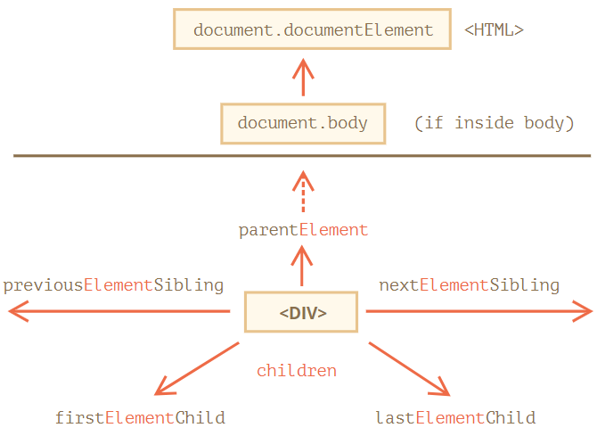
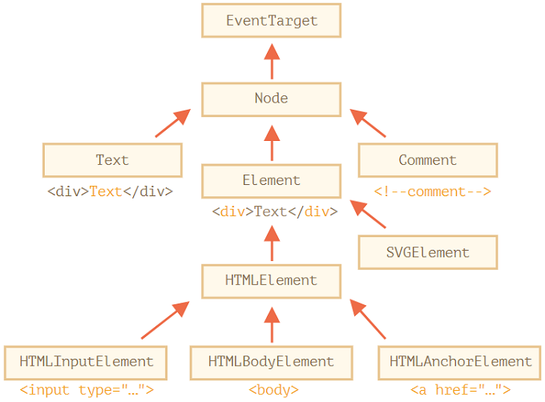
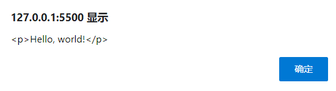
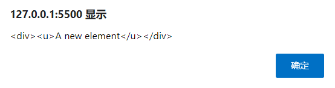
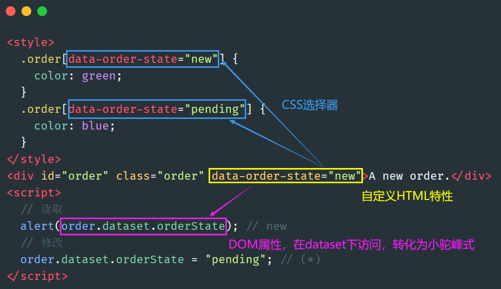
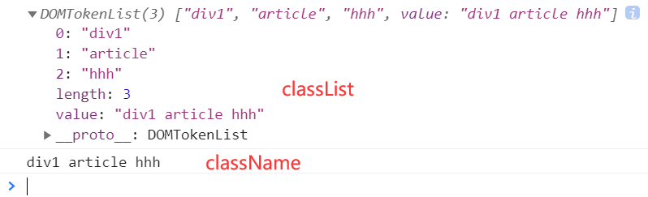
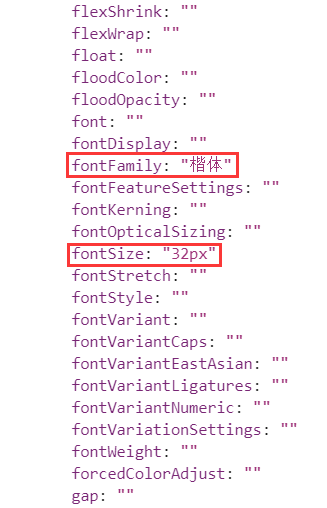

# DOM的使用

## 定位到某个DOM元素

### 导航形式

节点分为两种：元素节点、文本节点、注释节点

- 对于所有节点：`parentNode`，`childNodes`，`firstChild`，`lastChild`，`previousSibling`，`nextSibling`。
- 仅对于元素节点：`parentElement`，`children`，`firstElementChild`，`lastElementChild`，`previousElementSibling`，`nextElementSibling`。

> `previousElementSibling`和`nextElementSibling`是向前（后）一个元素节点



### 搜索形式

| 方法                     | 查询点       | 能否调用一个元素 |
| ------------------------ | ------------ | ---------------- |
| `querySelector`          | CSS-selector | ✔                |
| `querySelectorAll`       | CSS-selector | ✔                |
| `getElementById`         | `id`         | -                |
| `getElementsByName`      | `name`       | -                |
| `getElementsByTagName`   | tag or `'*'` | ✔                |
| `getElementsByClassName` | class        | ✔                |

- `elem.matches(css)` 用于检查 `elem` 与给定的 CSS 选择器是否匹配。
- `elem.closest(css)` 用于查找与给定 CSS 选择器相匹配的最近的祖先。`elem` 本身也会被检查。

## DOM内的属性

### type、tag、content



- `EventTarget`：抽象类。它作为一个基础，以便让所有 DOM 节点都支持所谓的“事件（event）”。
- `Node`：抽象类，提供树的核心功能，`parentNode`、`nextSibling`、`childNodes`
- `Element`：DOM元素的基本类。提供元素级导航，`nextElementSibling`，`children`，以及像 `getElementsByTagName` 和 `querySelector`
- `HTMLElement`：所有HTML元素的基本类
  - `HTMLInputElement`：`<input>`元素的类
  - `HTMLBodyElement`：`<body>`元素的类
  - `HTMLAnchorElement`：`<a>`元素的类

#### 读取标签名

- `tagName` 属性仅适用于 `Element` 节点。
- `nodeName`是为任意`Node`定义的：
  - 对于元素，它的意义与 `tagName` 相同。
  - 对于其他节点类型（text，comment 等），它拥有一个对应节点类型的字符串。

```js
alert(document.body.nodeName); // BODY
alert(document.body.tagName); // BODY
```

#### 内容

- `innerHTML`：获取该标签内部，转换为字符串
- `outerHTML`：获取完整的HTML，转换为字符串
- `textContent`：忽略所有的标签，转化为文本，不同标签文本用空格隔开
- `hidden`：隐藏，但不代表其在DOM树中没有

获取：

```html
<div id="elem">Hello <b>World</b></div>
<script>
    console.log(elem.outerHTML); // <div id="elem">Hello <b>World</b></div>
    console.log(elem.innerHTML); // Hello <b>World</b>
</script>
```

修改：

```html
<p>Hello, world!</p>
<script>
    let p = document.querySelector('p');
    p.outerHTML = '<div>A new element</div>';
    alert(p.outerHTML);
    let div = document.querySelector('div');
    div.innerHTML = '<u>A new element</u>';
    alert(div.outerHTML);
</script>
```

`p.outerHTML = '<div>A new element</div>';`，将DOM树上原先的DOM元素删除，添加新的DOM元素`<div>A new element</div>`

但值得一提的是，`p`仍拥有其旧的值，新的 HTML 没有被赋值给任何变量。

修改后要想获取，必须重写`let div = document.querySelector('div');`



`div.innerHTML = '<u>A new element</u>';`，将某个标签的内部进行修改



### DOM属性和标签属性

- `elem.hasAttribute(name)` ：是否存在。
- `elem.getAttribute(name)` ：获取。
- `elem.setAttribute(name, value)` ：设置。
- `elem.removeAttribute(name)` ：移除。

elem获取的是整个标签，然后通过后面的方法操作标签中的属性

|      | DOM属性                                | HTML特性       |
| ---- | -------------------------------------- | -------------- |
| 类型 | 任何值，标准的属性具有规范中描述的类型 | 字符串         |
| 名字 | 大小写敏感的                           | 大小写不敏感的 |

自定义标签属性，采用`data-*`方式，保存在`elem.dataset`中



## 修改DOM

### 创建DOM节点

```js
// 1. 创建 <div> 元素
let div = document.createElement('div');
// 2. 将元素的类设置为 "test"
div.className = "test";
// 3. 填充消息内容
div.innerHTML = "<strong>Hi there!</strong> You've read an important message.";
```

### 插入

#### node

- `node.append(...nodes or strings)` —— 在 `node` **末尾** 插入节点或字符串，
- `node.prepend(...nodes or strings)` —— 在 `node` **开头** 插入节点或字符串，
- `node.before(...nodes or strings)` —— 在 `node` **前面** 插入节点或字符串，
- `node.after(...nodes or strings)` —— 在 `node` **后面** 插入节点或字符串，
- `node.replaceWith(...nodes or strings)` —— 将 `node` 替换为给定的节点或字符串。

```html
<ol id="ol">
    <li>0</li>
    <li>1</li>
    <li>2</li>
</ol>

<script>
    ol.before('before'); // 将字符串 "before" 插入到 <ol> 前面
    ol.after('after'); // 将字符串 "after" 插入到 <ol> 后面

    let liFirst = document.createElement('li');
    liFirst.innerHTML = 'prepend';
    ol.prepend(liFirst); // 将 liFirst 插入到 <ol> 的最开始

    let liLast = document.createElement('li');
    liLast.innerHTML = 'append';
    ol.append(liLast); // 将 liLast 插入到 <ol> 的最末尾
</script>
```


#### insertAdjacentHTML/Text/Element方法

- 第一个参数是代码字（code word），指定相对于 `elem` 的插入位置。
  - `"beforebegin"` ：将 `html` 插入到 `elem` 前插入
  - `"afterbegin"` ：将 `html` 插入到 `elem` 开头
  - `"beforeend"` ：将 `html` 插入到 `elem` 末尾
  - `"afterend"` ：将 `html` 插入到 `elem` 后

- 第二个参数是 HTML 字符串，该字符串会被“作为 HTML” 插入。


```html
<div id="div"></div>
<script>
    div.insertAdjacentHTML('beforebegin', '<p>Hello</p>');
    div.insertAdjacentHTML('afterend', '<p>Bye</p>');
</script>
```

### 节点移除和克隆

移除：`node.remove()`

克隆：

- `elem.cloneNode(true)` ：深克隆，具有所有特性（attribute）和子元素。
- `elem.cloneNode(false)`：浅克隆，那克隆就不包括子元素。

> 一些老式的DOM操作方法现在很少使用，如：
>
> + `parentElem.appendChild(node)`
> + `parentElem.insertBefore(node, nextSibling)`
> + `parentElem.replaceChild(node, oldChild)`
> + `parentElem.removeChild(node)`

## 样式和类

### 获取类名

- `elem.classList`：获取类名的列表，返回一个对象
  - `elem.classList.add/remove(class)` ：添加/移除类。
  - `elem.classList.toggle(class)` ：如果类不存在就添加类，存在就移除它。
  - `elem.classList.contains(class)` ：检查给定类，返回 `true/false`。
- `elem.className`：获取类名的集合，返回一个字符串



### 样式

`elem.style` 属性是一个对象，它对应于 `"style"` 特性（attribute）中所写的内容。

对于多词（multi-word）属性，使用驼峰式 camelCase：

```bash
background-color  => elem.style.backgroundColor
z-index           => elem.style.zIndex
border-left-width => elem.style.borderLeftWidth
```

例如：

```html
<p class="poem">纸上得来终觉浅，绝知此事要躬行</p>
<input id="btn" type="button" value="按钮"></input>
<script>
    poem.style.color = "blue";
    poem.style.fontFamily = "楷体";
    poem.style.fontSize = "32px";
    console.dir(poem);
</script>
```



