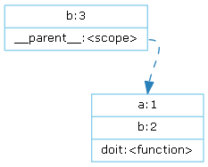
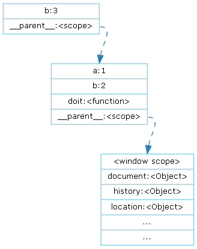
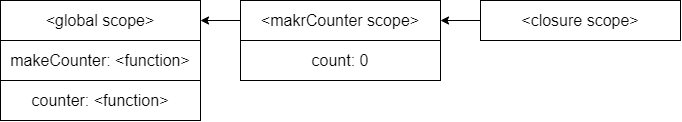

# 作用域的种类
作用域决定了代码区块中变量和其他资源的可见性。

作用域就是一个独立的地盘，让变量不会外泄、暴露出去。也就是说**作用域最大的用处就是隔离变量，不同作用域下同名变量不会有冲突。**

## 全局作用域
在代码中任何地方都能访问到的对象拥有全局作用域，一般来说以下几种情形拥有全局作用域：

- 最外层函数和在最外层函数外面定义的变量
- 所有末定义直接赋值的变量
- 浏览器中，window对象的属性
  - window.name、window.location、window.top等等。

```javascript
// 最外层变量
var outVariable = "我是最外层变量";
// 最外层函数
function outFun() {
    var inVariable = "内层变量";
    // 内层函数
    function innerFun() {
        console.log(inVariable);
    }
    innerFun();
}
```
```javascript
// 末定义直接赋值的变量
x = 'Hello';
console.log(x);
```
## 局部作用域
局部作用域又被称为函数作用域（Function scope），所有的变量和函数只能在作用域内部使用。
```javascript
var foo = 1;
window.bar = 2;

function baz(){
    a = 3;
    var b = 4;
}
// Global scope: foo, bar, baz, a 
// Local scope: b
```
作用域是分层的，内层作用域可以访问外层作用域的变量，反之则不行
```javascript
function foo(a) {
  var b = a * 2;
  function bar(c) {
    console.log(a, b, c);
  }
  bar(b * 3);
}
foo(2);   // 2 4 12
```
- 全局作用域：foo
- 作用域foo：a,bar,b
- 作用域bar：c

## 块作用域
块级作用域可通过新增命令let和const声明，所声明的变量在指定块的作用域外无法被访问。块级作用域在如下情况被创建：

1.在一个函数内部

2.在一个代码块（由一对花括号包裹）内部

这个类似于于Java中的

# Scope链原理
## 预编译

```javascript
var a = 1;
var b = 2;
function doit() {
  console.log(b);
  var b = 3;
  console.log(b);
}
doit();
console.log(b);
/*
undefined
3
2
*/
```
为何doit()函数内的b打印为为undefined呢？这就是JS中的预编译，JS代码在首次被加载完成后进行编译时，会将所有的function和var提前进行声明，**但是并不会对其进行赋值，赋值则都是在该代码块进行执行时**才会对其进行赋值。【变量提升】

因此第一个b在预编译后未赋值值的情况下打印输出，得到undefined。

由于**JS是通过函数来创建Scope的**，所以只有doit执行时才会创建新的Scope，其Scope如图：



对于global，Scope内有通过var定义的a,b和函数声明doit，首次加载完成后a,b都为undefined，而doit是一个指向堆的引用。当调用doit()函数时候，才会创建doit的Scope。

对于doit函数内部，Scope有通过var定义的b，同时还会创建一个对父级Scope的引用
运用`__proto__`的思想，变量查找时候会在自己的Scope内查找，查找不到则到它的父Scope中查找。

## Scope链

每个Scope都拥有一个__parent__，所有即使这个function无论在什么环境中进行执行，其父Scope都是这个function创建的Scope，虽然js很乱，但是是乱得有规有矩。

当代码去查找变量时，往往都是如下图过程：



优先查找自己Scope，如果查找不到则根据Scope链去查找最近的同名变量，如果一直查找到了Top Scope（在浏览器中则是window）还未找到的话，则这个变量会被认为`"Uncaught ReferenceError: xxx is not defined"`，如果直接使用的话则会报错。

# 循环输出问题
```javascript
for (var i = 0; i < 6; i++) {
  setTimeout(() => {
    console.log(i);
  }, 100);
}
```
经典例题，上述打印出了6个6，为啥？

从Scope链分析，这里遍历了6次就定义了6个匿名function，将这个6个函数放入到任务队列中等待执行。而这6个匿名function的定义Scope都是相同的，当执行对应的一个匿名function，该function创建的Scope中并没有i这个变量，因此会去查找父级的Scope，得到`i = 6`将其打印输出。

如何破局，方法有很多，但**宗旨都是改变匿名函数的创建Scope，并且该Scope又与i存在的Scope不同**，这就是大家说的闭包，其实闭包就是Scope，每个函数都会创建Scope，创建闭包，下面两种写法都是改变了匿名函数的创建Scope，并在该Scope中保存了独一无二的index值。

```javascript
for (var i = 0; i < 6; i++) {
  (function (index) {
    setTimeout(() => {
      console.log(index);
    }, 100);
  })(i);
}
```
```javascript
for (var i = 0; i < 6; i++) {
  setTimeout((function (index) {
    return function () {
      console.log(index);
    }
  })(i), 100);
}
```
# 闭包

闭包：内部函数总是可以访问其所在的外部函数中声明的变量和参数，即使在其外部函数被返回（寿命终结）了之后。

```javascript
function makeCounter() {
  let count = 0;
  return function () {
    return count++;
  }
}

let counter = makeCounter();
console.log(counter());		// 0
console.log(counter());		// 1
console.log(counter());		// 2
```


在这个例子中，每次调用counter()就是在让其父作用域中的count+1，因此依次打印出0,1,2
