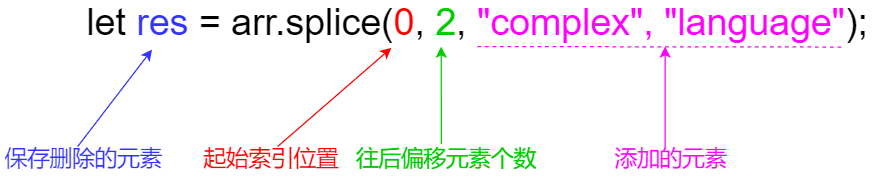

# 一、常用方法
- 类型转换
   - String(value)
   - Number(str)
   - Boolean(target)
- 数字操作
   - 进制转换：+num.toString(16)
   - 舍入
      - Math.floor()：下舍到整数
      - Math.ceil()：上舍到整数
      - Math.round()：四舍五入
      - toFixed(n)：按n位舍入
   - isFinite()：是否无穷
   - isNaN()：是否NaN
   - parseInt(str)：解析成数字
      - parseFloat(str)：解析成数字
   - Math.log(x)：以e为底的对数
      - Math.log2(x)：以2为底的对数
   - Math.max(a,b,c,…)
      - Math.min(a,b,c,…)
   - Math.pow(n, power)：幂
- 字符串
   - length：字符串长度，是属性不是方法
   - 访问字符
      - str[i]
      - str.charAt(i)
   - 修改字符：不允许
   - 转大小写
      - toLowerCase()
      - toUpperCase()
   - 查找子串
      - str.indexOf(substr, [pos])
      - str.includes(substr, [pos])
      - str.startsWith(substr)
      - str.startsWith(substr)
   - 获取子串
      - str.slice(start, [end])
      - str.substr(start, [length])
   - str.localeCompare(str2)：字符串比较
      - 如果 str 小于 str2 则返回负数。
      - 如果 str 大于 str2 则返回正数。
      - 如果它们相等则返回 0。
- 数组
   - splice(start, delta, arg1, arg2, …)：增删改
   ​
   - arr.forEach((item, index, array)=>{……});
   - 搜索
      - index
         - arr.indexOf(item, from) 从索引 from 开始搜索 item，如果找到则返回索引，否则返回 -1。
         - arr.lastIndexOf(item, from) —— 和上面相同，只是从右向左搜索。
         - arr.includes(item, from) —— 从索引 from 开始搜索 item，如果找到则返回 true（译注：如果没找到，则返回 false）。
      - find：找出一个
         - arr.find((item, index, array)=>{……});
         - arr.find((item, index, array)=>{……});
      - filter：找出一系列的
   - map()：它对数组的每个元素都调用函数，并返回结果数组。
      - arr.map((item,index)=>{……});
   - sort()：排序
      - arr.sort((a, b)=>{……});
   - reverse()：转置
   - split()：分割
   - join()：黏合
   - Array.isArray()：判断是否为数组
   - arr.fill(value, start, end)：填充
   - arr.reduce()：让这次操作用于下次
      - 参数
         - accumulator —— 是上一个函数调用的结果，第一次等于 initial（如果提供了 initial 的话）。
         - item —— 当前的数组元素。
         - index —— 当前索引。
         - arr —— 数组本身。
   - 看作栈和队列
      - arr.push()：入栈
      - arr.pop()：出栈
      - arr.shift()：开头取元素
      - arr.unshift()：开头添元素
- Map
   - size：属性，哈希表大小
   - set(key, value)
   - get(key)
   - has(key)：是否存在key
      - 不存在：返回undefined
   - delete(key)：
   - clear()
   - keys()：返回所有的键
   - values()：返回所有的值
   - entries()：返回所有的实体
   - map.forEach((value, key, map)=>{……});
   - Object.entries(obj)：用对象创建Map
   - Object.fromEntries(map)：用Map创建对象
- Set
   - size：属性，集合大小
   - new Set(iterable)：根据可迭代对象（通常为数组）创建集合
   - add(key)
   - has(value)
      - 在：返回true
      - 不在：返回false
   - delete(key)：
   - clear()
   - keys()：返回所有的值
   - values()：返回所有的值（跟keys()效果相同）
   - entries()：返回所有的实体
   - set.forEach((value, valueAgain, set)=>{……});
- Object
   - let arr = Object.entries(obj)：对象转数组
      - Object.keys(obj)—— 返回一个包含该对象所有的键的数组。
      - Object.values(obj)—— 返回一个包含该对象所有的值的数组。
      - Object.entries(obj)—— 返回一个包含该对象所有[key, value]键值对的数组。
   - let obj = Object.fromEntries(arr)：数组转对象
   - 深拷贝：Object.assign(target, any)
- 解构赋值
   - let [firstName, surname] = "Ilya Kantor".split(' ');
      - let {title, width, height} = options;
   - Rest参数：function sumAll(...args) {……}
   - Spread语法：let merged = [0, ...arr, 2, ...arr2];

# 二、常用操作
## 字符串和字符数组
### 字符串转字符数组
```javascript
let str = "abcdefg";
let arr = str.split("");
```
### 字符数组转字符串
```javascript
let arr = ["abc","d","ef","ghi"];
let resStr = arr.join("");
```
> 不要用`toString()`，否则转出的字符串会带上`,`

## 字符串和数字数组
### 字符串转数字数组
就是在转出的字符数组用map方法进一步转为数字类型
```javascript
let str = "010110101100";
let arr = str.split('').map((item)=>{return +item});
```
### 数字数组转字符串
```javascript
let arr = [0,1,0,1,1,0,0];
let resStr = arr.join("");
```
## 进制转换
### 定义其他进制数
```javascript
// 二进制
let num = 0b1001;
// 八进制
let num = 077;
// 十六进制
let num = 0xff;
```
### 进制转换
最终输出的是字符串
```javascript
let num = 0b1001;
let str = num.toString(16);
```
## 字符串和数字
### 数字转字符串
```javascript
let num = 255;
let str = num.toString();
```
### 字符串转数字
```javascript
let str = "00012";
let num = Number(str);
// 另一种写法
let num = +str;
```
## ASCII和字符
### 字符转ASCII
```javascript
let ch = 'A';
let ascii = ch.charCodeAt(); // 65
```
### ASCII转字符
```javascript
let ascii = 66;
let res = String.fromCharCode(ascii); // B
```
## 修改字符串某个位置字符
JS中字符串不支持直接修改，不可setter
### 转为数组后修改
```javascript
let str = "aaaaa";
let arr = str.split('');
arr[2]='b';
let resStr = arr.join('');
console.log(resStr); // aabaa
```
封装成函数：
```javascript
String.prototype.replaceStr = function (index, ch) {
  let arr = this.split('');
  arr[pos] = ch;
  return arr.join('');
}
let str = "aaaaa";
let res = str.replaceStr(2, 'b');
console.log(res); // aabaa
```
### substring
```javascript
String.prototype.replaceStr = function (index, ch) {
  return this.substring(0, index) + ch + this.substring(index + 1);
}
let res = str.replaceStr(2, 'b');
console.log(res); // aabaa
```
## 创建m*n数组
### map+fill
```javascript
let m = 4;
let n = 5;
let arr = new Array(m).fill('').map((item, index) => {
  return new Array(n).fill(0);
});
console.log(arr);
```
### 两层循环
```javascript
let m = 4;
let n = 5;
let arr = [];
for (let i = 0; i < m; i++) {
  arr[i] = [];
  for (let j = 0; j < n; j++) {
    arr[i][j] = 0;
  }
}
console.log(arr);
```
## 数组和集合
```javascript
let arr = [1, 2, 3, 2, 3, 2, 3, 2, 3, 6]; // 数组转集合
let set = new Set(arr); // 集合转数组 
let res = [...set];
console.log(set);
console.log(res);
```
## Map操作
### 遍历
```javascript
let map = new Map();
map.set("Lily", 21);
map.set("Jack", 24);
map.set("Alice", 15);
for (let item of map.entries()) {
  console.log(item);
}
for (let item of map.keys()) {
  console.log(item);
}
for (let item of map.values()) {
  console.log(item);
}
/*********************
[ 'Lily', 21 ]
[ 'Jack', 24 ]
[ 'Alice', 15 ]
Lily
Jack
Alice
21
24
15
*********************/
```
### 通过Map的值排序
```javascript
let map = new Map();
map.set('a', 2);
map.set('b', 10);
map.set('c', -8);
map.set('d', 3);
const list = [...map.keys()];
list.sort((a, b) => map.get(a) - map.get(b));
console.log(list);
/*[ 'c', 'a', 'd', 'b' ]*/
```
