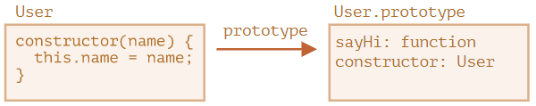

# JS和TS类的用法汇总及对比

## JavaScript的类

### 类的使用

#### 类的基本形式

```js
class User {
  // 类字段
  name = ''
  age = 0
  // 构造函数
  constructor(name, age) {
    this.name = name;
    this.age = age
  }
  // 方法
  showInfo() {
    console.log(`name = ${this.name}; age = ${this.age}`)
  }
  // getter/setter
  get name() {
    return this.name;
  }
  set name(value) {
    if (value.length < 4) {
      console.log("Name is too short.", value);
      return;
    }
    this.name = value;
  }
  get age() {
    return this.age
  }
  set age(value) {
    this.age = value
  }
}
const user = new User('Bob', 23)
user.showInfo()
```

#### 类的继承

- `extends`实现继承
- `super`关键字访问父方法和构造方法
  - `super.method(...)`调用父类方法
  - `super(...)`调用父类构造函数
- 方法重写

::: danger
箭头函数没有`super`，如果被访问，它会从外部函数获取：
```js
class Rabbit extends Animal {
  stop() {
    setTimeout(() => super.stop(), 1000);   // 1秒后调用父类的stop
  }
}
```
:::

#### 重写方法

```js
class Animal {
  constructor(name) {
    this.speed = 0;
    this.name = name;
  }
  run(speed) {
    this.speed = speed;
    console.log(`${this.name} runs with speed ${this.speed}.`);
  }
  stop() {
    this.speed = 0;
    console.log(`${this.name} stands still.`);
  }
}

class Rabbit extends Animal {
  hide() {
    console.log(`${this.name} hides!`);
  }
  // 重写父类Animal方法
  stop() {
    super.stop();
    this.hide();
  }
}

const rabbit = new Rabbit('White Rabbit');
rabbit.run(5);
console.log(rabbit);
rabbit.stop();
console.log(rabbit);
/**************************
White Rabbit runs with speed 5.
Rabbit { speed: 5, name: 'White Rabbit' }
White Rabbit stands still.
White Rabbit hides!
Rabbit { speed: 0, name: 'White Rabbit' }
**************************/
```

#### 重写constructor

```js
class Animal {
  constructor(name) {
    this.speed = 0;
    this.name = name;
  }
}

class Rabbit extends Animal {
  // 重写子类的constructor，要通过super调用父类的constructor
  constructor(name, earLength) {
    super(name);
    this.earLength = earLength;
  }
}

let rabbit = new Rabbit("White Rabbit", 10);
console.log(rabbit)
```

[其他问题](https://zh.javascript.info/class-inheritance#zhong-xie-constructor)

#### 静态属性和静态方法

静态属性和静态属性被用于当我们想要存储类级别的数据时，而不是绑定到实例，它们是可继承的。

```js
class MyClass {
  static property = '';
  static method() {}
}
```

### 私有属性

在早些时候，是约定带`_`的变量表示私有属性，在较新版本中可以使用`#`在语言层面支持私有属性。

::: danger
这是一个最近添加到 JavaScript 的特性。 JavaScript 引擎不支持（或部分支持），需要 polyfills。
:::

```js
class User {
  #name = ''
  age = 0
  constructor(name, age) {
    this.#name = name
    this.age = age
  }
  showInfo() {
    console.info(this.#name, this.age)
  }
}

const user = new User('Alice', 18)
console.log(user)
user.showInfo()
```

### 类和构造函数对比

在JavaScript中，类是一种函数。定义`class User {...}`实际上做了如下的事：

- 创建名为User的函数，来自`constructor`方法
- 存储类中的方法，如`User.prototype`中的`sayHai`

当new User对象被创建后，当调用其方法时，会从原型中获取对应方法。



class是构造函数的语法糖吗？尽管它们类似，但还是存在差异的：

1.通过class创建的函数具有特殊内部属性标记`[[IsClassConstructor]]: true`，而通过构造函数创建没有。
2.类方法不可枚举，类定义将`prototype`中所有方法的`enumerable`设置为`false`
3.类总是使用`use strict`

### 类表达式

像函数一样，类可以在另一个表达式中被定义、传递、返回、赋值等。

```js
let User = class MyClass {
  sayHi() {
    console.log(MyClass);   // MyClass 这个名字仅在类内部可见
  }
};
new User().sayHi();   // 正常运行，显示 MyClass 中定义的内容
console.log(MyClass);   // error，MyClass 在外部不可见
```

### 类检查

|  | 作用目标 | 返回值 |
| --- | --- | --- |
| `typeof` | 原始数据类型 | string |
| `{}.toString` | 原始数据类型，内建对象，包含 Symbol.toStringTag 属性的对象 | string |
| `instanceof` | 对象 | boolean |

## TypeScript的类

