# JavaScript浏览器

## 一、Document

### 浏览器环境，规格

 JavaScript 在浏览器中运行时的鸟瞰示意图：

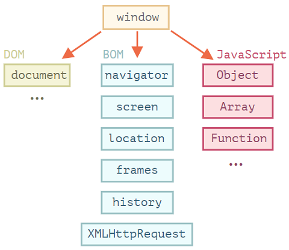

DOM：

文档对象模型（Document Object Model），简称 DOM，将所有页面内容表示为可以修改的对象。

`document` 对象是页面的主要“入口点”。我们可以使用它来更改或创建页面上的任何内容。

```js
// 将背景颜色修改为红色
document.body.style.background = "red";
// 在 1 秒后将其修改回来
setTimeout(() => document.body.style.background = "", 1000);
```

BOM：

浏览器对象模型（Browser Object Model），简称 BOM，表示由浏览器（主机环境）提供的用于处理文档（document）之外的所有内容的其他对象。

### DOM 树

```html
<!DOCTYPE HTML>
<html>
    <head>
        <title>About elk</title>
    </head>
    <body>
        The truth about elk.
    </body>
</html>
```

DOM 将 HTML 表示为标签的树形结构：

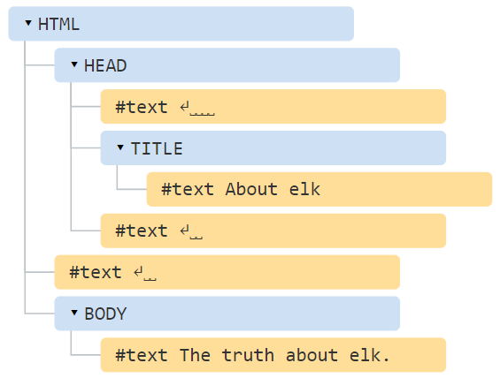

标签被称为 **元素节点**（或者仅仅是元素），并形成了树状结构：`<html>` 在根节点，`<head>` 和 `<body>` 是其子项，等。

元素内的文本形成 **文本节点**，被标记为 `＃text`。一个文本节点只包含一个字符串。它没有子项，并且总是树的叶子。

一共有[12 种节点类型](https://dom.spec.whatwg.org/#node)。实际上，我们通常用到的是其中的 4 种：

- `document` — DOM 的“入口点”。
- 元素节点 — HTML 标签，树构建块。
- 文本节点 — 包含文本。
- 注释 — 有时我们可以将一些信息放入其中，它不会显示，但 JS 可以从 DOM 中读取它。

### 遍历 DOM

#### 节点导航

对 DOM 的所有操作都是以 `document` 对象开始。它是 DOM 的主“入口点”。从它我们可以访问任何节点。

这里是一张描述对象间链接的图片，通过这些链接我们可以在 DOM 节点之间移动。

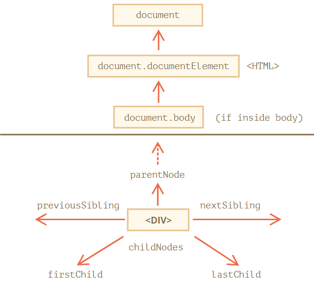

访问`<html>`：`document.documentElement`

访问`<body>`：`document.body`

访问`<head>`：`document.head`

访问子节点：`childNodes`、`firstChild`、`lastChild`

访问兄弟节点：`previousSibling`、`nextSibling`

访问父亲节点：`parentNode`

```js
// childNodes表示所有子节点，它是一个集合
elem.childNodes[0] === elem.firstChild
elem.childNodes[elem.childNodes.length - 1] === elem.lastChild
```

!> 由于childNodes是集合，所以**可迭代、不可用数组方法**，但这个集合**只读、实时的**，不要用`for…in`遍历

#### 纯元素导航

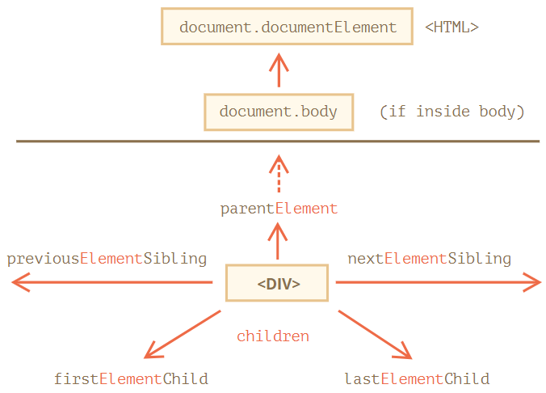

!> 节点导航和纯元素导航的区别：前者包括text，后者不包括text，只含标签

#### 表格

`<table>`元素支持 (除了上面给出的，之外) 以下这些属性：

- `table.rows` — `<tr>` 元素的集合。
- `table.caption/tHead/tFoot` — 引用元素 `<caption>`，`<thead>`，`<tfoot>`。
- `table.tBodies` — `<tbody>` 元素的集合（根据标准还有很多元素，但是这里至少会有一个 — 即使没有被写在 HTML 源文件中，浏览器也会将其放入 DOM 中）。

`<thead>`，`<tfoot>`，`<tbody>`元素提供了 `rows` 属性：

- `tbody.rows` — 表格内部 `<tr>` 元素的集合。

`<tr>`：

- `tr.cells` — 在给定 `<tr>` 中的 `<td>` 和 `<th>` 单元格的集合。
- `tr.sectionRowIndex` — 给定的 `<tr>` 在封闭的 `<thead>/<tbody>/<tfoot>` 中的位置（索引）。
- `tr.rowIndex` — 在整个表格中 `<tr>` 的编号（包括表格的所有行）。

`<td>` 和 `<th>`：

- `td.cellIndex` — 在封闭的 `<tr>` 中单元格的编号。

```html
<table id="table">
    <tr>
        <td>one</td><td>two</td>
    </tr>
    <tr>
        <td>three</td><td>four</td>
    </tr>
</table>
<script>
    // 获取带有 "two" 的 td（第一行，第二列）
    let td = table.rows[0].cells[1];
    td.style.backgroundColor = "red"; // highlight it
</script>
```

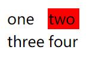

### getElement和querySelector

+ `let elem = document.getElementById('elem');`，通过id定位DOM
+ `let elements = document.querySelectorAll('ul > li:last-child');`：通过CSS选择器定位DOM
+ `elem.querySelector(css)` 调用会返回给定 CSS 选择器的第一个元素。
  + 与`elem.querySelectorAll(css)[0]` 效果相同
  + 效率更高，不必遍历所有元素
+ `elem.matches(css)`：检查 `elem` 是否与给定的 CSS 选择器匹配。它返回 `true` 或 `false`。
+ `elem.closest(css)`：查找与 CSS 选择器匹配的最近的祖先。

!> 新手开发者有时会忘记字符 `"s"`。 `getElementsByTagName`中有`"s"`，`getElementById`中没有。

| Method                   | Searches by... | Can call on an element? | Live? |
| ------------------------ | -------------- | ----------------------- | ----- |
| `querySelector`          | CSS-selector   | ✔                       | -     |
| `querySelectorAll`       | CSS-selector   | ✔                       | -     |
| `getElementById`         | `id`           | -                       | -     |
| `getElementsByName`      | `name`         | -                       | ✔     |
| `getElementsByTagName`   | tag or `'*'`   | ✔                       | ✔     |
| `getElementsByClassName` | class          | ✔                       | ✔     |

### 节点属性

所有类型的 DOM 节点都形成了一个单一层次的结构（single hierarchy），每个 DOM 节点都属于相应的内建类。


+ `EventTarget`：抽象类
+ `Node`：抽象类，提供树的核心功能，`parentNode`、`nextSibling`、`childNodes`
+ `Element`：DOM元素的基本类
+ `HTMLElement`：所有HTML元素的基本类
  + `HTMLInputElement`：`<input>`元素的类
  + `HTMLBodyElement`：`<body>`元素的类
  + `HTMLAnchorElement`：`<a>`元素的类

```js
// 通过constructor.name获取某个节点的类型
console.log(document.constructor.name); // HTMLDocument
console.log(document.body.constructor.name); // HTMLBodyElement
```

给定一个 DOM 节点，我们可以从 `nodeName` 或者 `tagName` 属性中读取它的标签名：

```js
alert(document.body.nodeName); // BODY
alert(document.body.tagName); // BODY
```

- `tagName` 属性仅适用于 `Element` 节点。
- `nodeName` 是为任意 `Node` 定义的：
  - 对于元素，它的意义与 `tagName` 相同。
  - 对于其他节点类型（text，comment 等），它拥有一个对应节点类型的字符串。
- `innerHTML`：允许将元素中的 HTML 获取为字符串形式。
  - 访问和替换：`chatDiv.innerHTML += "<div>Hello !</div>";`
- `outerHTML`
- `textContent`：作为纯文本，**比较安全**
- `hidden`：当设置为true时，隐藏标签

```html
<div id="elem">Hello <b>World</b></div>
<script>
    console.log(elem.outerHTML); // <div id="elem">Hello <b>World</b></div>
    console.log(elem.innerHTML); // Hello <b>World</b>
</script>
```

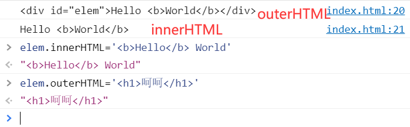

**注意：与 `innerHTML` 不同，写入 `outerHTML` 不会改变元素。而是在 DOM 中替换它。**

```html
<div>Hello, world!</div>
<script>
    let div = document.querySelector('div');
    // 使用 <p>...</p> 替换 div.outerHTML
    /*
    在 div.outerHTML=...中发生的事情是：
		div 被从文档（document）中移除。
		另一个 HTML 片段 <p>A new element</p> 被插入到其位置上。
		div仍拥有其旧的值。新的 HTML 没有被赋值给任何变量。
    */
    div.outerHTML = '<p>A new element</p>'; // (*)
    // 蛤！'div' 还是原来那样！
    alert(div.outerHTML); // <div>Hello, world!</div> (**)
</script>
```

HTML和Text的比较：

```html
<div id="elem1"></div>
<div id="elem2"></div>
<script>
    let name = prompt("What's your name?", "<b>Winnie-the-Pooh!</b>");
    elem1.innerHTML = name;
    elem2.textContent = name;
</script>
```

### 属性（DOM）和特性（HTML）

1.DOM属性：

```js
document.body.myData = {
    name: 'Caesar',
    title: 'Imperator',
    sayTagName() {
        alert(this.tagName);
    }
};
console.log(document.body.myData);
```

HTML特性：

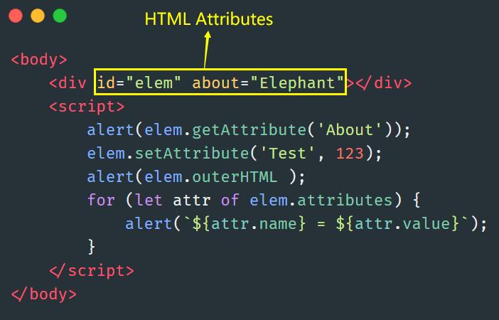

所有特性都可以通过使用以下方法进行访问：

- `elem.hasAttribute(name)` — 检查特性是否存在。
- `elem.getAttribute(name)` — 获取这个特性值。
- `elem.setAttribute(name, value)` — 设置这个特性值。
- `elem.removeAttribute(name)` — 移除这个特性。

HTML 特性有以下几个特征：

- 它们的名字是大小写不敏感的（`id` 与 `ID` 相同）。
- 它们的值总是字符串类型的。

|      | DOM属性                                | HTML特性       |
| ---- | -------------------------------------- | -------------- |
| 类型 | 任何值，标准的属性具有规范中描述的类型 | 字符串         |
| 名字 | 大小写敏感的                           | 大小写不敏感的 |

2.Attribute-Properties同步

```html
<input>
<script>
    let input = document.querySelector('input');
    // 特性 => 属性
    input.setAttribute('id', 'id');
    alert(input.id); // id（被更新了）
    // 属性 => 特性
    input.id = 'newId';
    alert(input.getAttribute('id')); // newId（被更新了）
</script>
```

3.dataset非标准的特性


### Document的修改

#### 插入 DOM 节点或文本片段

创建DOM节点：`document.createElement(tag)`

```js
// 1. 创建 <div> 元素
let div = document.createElement('div');
// 2. 将元素的类设置为 "alert"
div.className = "alert";
// 3. 填充消息内容
div.innerHTML = "<strong>Hi there!</strong> You've read an important message.";
```

插入元素：

- `node.append(...nodes or strings)` —— 在 `node` **末尾** 插入节点或字符串，
- `node.prepend(...nodes or strings)` —— 在 `node` **开头** 插入节点或字符串，
- `node.before(...nodes or strings)` —— 在 `node` **前面** 插入节点或字符串，
- `node.after(...nodes or strings)` —— 在 `node` **后面** 插入节点或字符串，
- `node.replaceWith(...nodes or strings)` —— 将 `node` 替换为给定的节点或字符串。

```html
<ol id="ol">
    <li>0</li>
    <li>1</li>
    <li>2</li>
</ol>

<script>
    ol.before('before'); // 将字符串 "before" 插入到 <ol> 前面
    ol.after('after'); // 将字符串 "after" 插入到 <ol> 后面
    
    let liFirst = document.createElement('li');
    liFirst.innerHTML = 'prepend';
    ol.prepend(liFirst); // 将 liFirst 插入到 <ol> 的最开始

    let liLast = document.createElement('li');
    liLast.innerHTML = 'append';
    ol.append(liLast); // 将 liLast 插入到 <ol> 的最末尾
</script>
```


DOM插入和文本插入：

```html
<div id="test">Hello <b>World</b></div>
<script>
    // 当做HTML标签插入
    let pFirst = document.createElement('p');
    pFirst.innerHTML = '<b>嘿嘿</b>';
    test.before(pFirst);
    // 当做文本插入
    test.before('<p><b>嘿嘿</b></p>');
</script>
```

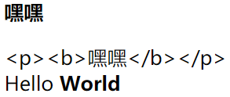

> 作为文本插入，相关字符如`<`、`>`会进行转义

#### insertAdjacentHTML

`elem.insertAdjacentHTML(where, html)`：

+ 第一个参数是代码字（code word），指定相对于 `elem` 的插入位置。
  + `"beforebegin"` — 将 `html` 插入到 `elem` 前插入，
  + `"afterbegin"` — 将 `html` 插入到 `elem` 开头，
  + `"beforeend"` — 将 `html` 插入到 `elem` 末尾，
  + `"afterend"` — 将 `html` 插入到 `elem` 后。
  + 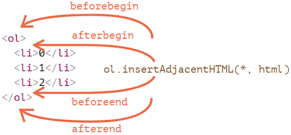
+ 第二个参数是 HTML 字符串，该字符串会被“作为 HTML” 插入。

#### 节点移除和克隆

节点移除：`node.remove()`

节点克隆：

+  `elem.cloneNode(true)` ：深克隆，具有所有特性（attribute）和子元素。
+  `elem.cloneNode(false)`：浅克隆，那克隆就不包括子元素。

#### DocumentFragment

`DocumentFragment` 是一个特殊的 DOM 节点，用作来传递节点列表的包装器（wrapper）。我们可以向其附加其他节点，但是当我们将其插入某个位置时，则会插入其内容。

```html
<ul id="ul"></ul>
<script>
    function getListContent() {
        let fragment = new DocumentFragment();

        for(let i=1; i<=3; i++) {
            let li = document.createElement('li');
            li.append(i);
            fragment.append(li);
        }

        return fragment;
    }
    // 附加了DocumentFragment，它和ul融为一体了
    ul.append(getListContent());
</script>
```

得到的文档结构为：

```html
<ul>
    <li>1</li>
    <li>2</li>
    <li>3</li>
</ul>
```

`DocumentFragment` 很少被显式使用。如果可以改为返回一个节点数组，那为什么还要附加到特殊类型的节点上呢？重写示例：

```html
<ul id="ul"></ul>
<script>
    function getListContent() {
        let result = [];

        for(let i=1; i<=3; i++) {
            let li = document.createElement('li');
            li.append(i);
            result.push(li);
        }

        return result;
    }
    // append + "..." operator = friends!
    ul.append(...getListContent()); \
</script>
```

### 样式

1.`elem.className`和`elem.classList`：

```html
<body>
    <div class="div1">哈哈哈</div>
    <div class="div2">蛤蛤蛤</div>
</body>
<script>
    document.body.children[0].classList.toggle('div1');
    document.body.children[0].classList.toggle('article');
    document.body.children[0].classList.toggle('hhh');
    console.log(document.body.children[0].classList);
    console.log(document.body.children[1].className);
</script>
```

`classList` 的方法：

- `elem.classList.add/remove(class)` — 添加/移除类。
- `elem.classList.toggle(class)` — 如果类不存在就添加类，存在就移除它。
- `elem.classList.contains(class)` — 检查给定类，返回 `true/false`。

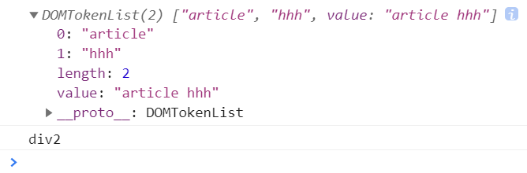

**className返回是类名，classList返回的是装有类名的对象**

2.`elem.style`

```js
document.body.style.backgroundColor = prompt('background color?', 'green');
```

> CSS的属性名转化过来用小驼峰式

重置样式属性：``elem.style.display = "none"`，取消重置：`elem.style.display = ""`。

注意单位：`document.body.style.margin = '20px'`

3.getComputedStyle

由于**`style` 属性仅对 `"style"` 特性（attribute）值起作用，而没有任何 CSS 级联（`<style>……</style>`）。**因此出现了getComputedStyle来弥补这一功能。**只读。**

```html
<head>
    <style> body { color: red; margin: 5px } </style>
</head>
<body>
    <script>
        let computedStyle = getComputedStyle(document.body);
        // 现在我们可以读取它的 margin 和 color 了
        alert( computedStyle.marginTop ); // 5px
        alert( computedStyle.color ); // rgb(255, 0, 0)
    </script>
</body>
```

### 元素大小和滚动

盒子模型：

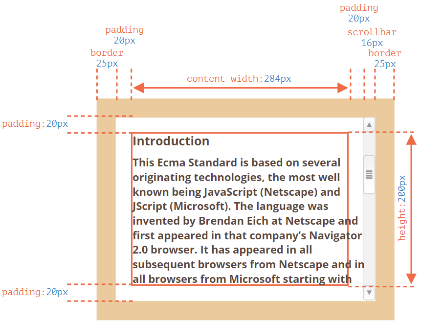

几何属性：


- `offsetParent` — 是最接近的 CSS 定位的祖先
  - CSS 定位的（`position` 为 `absolute`，`relative` 或 `fixed`）
  -  `td`，`th`，`table`
  - `body`
- `offsetLeft/offsetTop` — 是相对于 `offsetParent` 的左上角边缘的x/y坐标。
- `offsetWidth/offsetHeight` — 元素的“外部” width/height，边框（border）尺寸计算在内。
  - `border+padding+contentWidth(+scrollbar)`，左右两边都要计算进去
- `clientLeft/clientTop` —如上图所示
- `clientWidth/clientHeight` — 如上图所示，内容的 width/height，包括 padding，但不包括滚动条（scrollbar）。
- `scrollWidth/scrollHeight` — 内容的 width/height，就像 `clientWidth/clientHeight` 一样，但还包括元素的滚动出的不可见的部分。
- `scrollLeft/scrollTop` — 从元素的左上角开始，滚动出元素的上半部分的 width/height。

!> 不要从CSS中获取width/height，而是从几何属性获取。CSS可以设置width/height为auto或inline，但在JS中需要一个确切的px大小

```html
<style>
    body{
        margin: 0px;
    }
    #div1{
        width: 50px;
        height: 50px;
        left:100px;
        top: 50px;
        position: relative;
        border: 1px solid red;
    }
</style>
<body>
    <div id="div1">哈哈哈</div>
</body>
<script>
    document.write(div1.offsetLeft+","+div1.offsetTop);
</script>
</html>
```

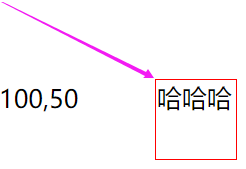

### Windows大小及滚动

几何：

- 文档可见部分的 width/height（内容区域的 width/height）：`document.documentElement.clientWidth/clientHeight`

- 整个文档的 width/height，其中包括滚动出去的部分：

  ```js
  let scrollHeight = Math.max(
      document.body.scrollHeight, document.documentElement.scrollHeight,
      document.body.offsetHeight, document.documentElement.offsetHeight,
      document.body.clientHeight, document.documentElement.clientHeight
  );
  ```

滚动：

- 读取当前的滚动：`window.pageYOffset/pageXOffset`。
- 更改当前的滚动：
  - `window.scrollTo(pageX,pageY)` — 绝对坐标，
  - `window.scrollBy(x,y)` — 相对当前位置进行滚动，
  - `elem.scrollIntoView(top)` — 滚动以使 `elem` 可见（`elem` 与窗口的顶部/底部对齐）。

### 坐标

+ 相对于窗口：`position: fixed;`
+ 相对于文档：`positionL absolute;`

通过`getBoundingClientRect`获取元素坐标：

- 主要的 `DOMRect` 属性：
  - `x/y` — 矩形原点相对于窗口的 X/Y 坐标，
  - `width/height` — 矩形的 width/height（可以为负）。
- 此外，还有派生（derived）属性：
  - `top/bottom` — 顶部/底部矩形边缘的 Y 坐标，
  - `left/right` — 左/右矩形边缘的 X 坐标。

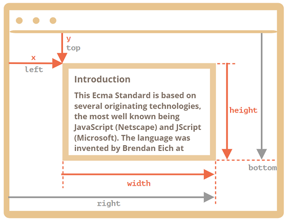

- `left = x`
- `top = y`
- `right = x + width`
- `bottom = y + height`

`document.elementFromPoint(x, y)` ：返回在窗口坐标 `(x, y)` 处嵌套最多（the most nested）的元素。

窗口坐标和文本坐标的转换：

- `pageY` = `clientY` + 文档的垂直滚动出的部分的高度。
- `pageX` = `clientX` + 文档的水平滚动出的部分的宽度。

## 二、事件

### 概览

#### 事件类型

**鼠标事件：**

- `click` —— 当鼠标点击一个元素时（触摸屏设备会在点击时生成）。
- `contextmenu` —— 当鼠标右键点击一个元素时。
- `mouseover` / `mouseout` —— 当鼠标指针移入/离开一个元素时。
- `mousedown` / `mouseup` —— 当在元素上按下/释放鼠标按钮时。
- `mousemove` —— 当鼠标移动时。

**键盘事件**：

- `keydown` 和 `keyup` —— 当按下和松开一个按键时。

**表单（form）元素事件**：

- `submit` —— 当访问者提交了一个 `<form>` 时。
- `focus` —— 当访问者聚焦于一个元素时，例如聚焦于一个 `<input>`。

**Document 事件**：

- `DOMContentLoaded` —— 当 HTML 的加载和处理均完成，DOM 被完全构建完成时。

**CSS 事件**：

- `transitionend` —— 当一个 CSS 动画完成时。

#### HTML特性

大小写不敏感

```html
<!-- 使用特性中的内容创建一个处理程序 -->
<input onclick="sayThanks()" type="button" value="Click me">
<script>
    function sayThanks(){
        alert('Thank you!');
    }
</script>
```

#### DOM属性

大小写敏感

```html
<input id="elem" type="button" value="Click me">
<script>
    function sayThanks(){
        alert('Thank you!');
    }
    // 注意这里是将函数名赋值，带上()就上执行函数
    elem.onclick = sayThanks;
</script>
```

#### 监听方法

使用`addEventListener()`函数：

```js
element.addEventListener(event, handler[, options]);
```

+ event：事件名
+ handler：处理程序
+ options

普通写法：

```html
<input id="elem" type="button" value="Click me"/>
<script>
    function handler1() {
        alert('Thanks!');
    };

    function handler2() {
        alert('Thanks again!');
    }

    elem.onclick = () => alert("Hello");
    elem.addEventListener("click", handler1); // Thanks!
    elem.addEventListener("click", handler2); // Thanks again!
</script>
```

对象和类写法：

触发事件时候调用`handleEvent(event)`方法

```html
<button id="elem">Click me</button>
<script>
    class Menu {
        handleEvent(event) {
            // 拼凑字符串，得到方法名
            let method = 'on' + event.type[0].toUpperCase() + event.type.slice(1);
            // 使用this[method]调用
            this[method]();
        }

        onMousedown() {
            elem.innerHTML = "Mouse button pressed";
        }

        onMouseup() {
            elem.innerHTML += "...and released.";
        }
    }
    let menu = new Menu();
    elem.addEventListener('mousedown', menu);
    elem.addEventListener('mouseup', menu);
</script>

</html>
```

`event` 对象的一些属性：

- `event.type`

  事件类型，这里是 `"click"`。

- `event.currentTarget`

  处理事件的元素。这与 `this` 相同，除非处理程序是一个箭头函数，或者它的 `this` 被绑定到了其他东西上，之后我们就可以从 `event.currentTarget` 获取元素了。

- `event.clientX / event.clientY`

  指针事件（pointer event）的指针的窗口相对坐标。

### DOM事件传播三阶段

1. 捕获阶段（Capturing phase）—— 事件（从 Window）向下走近元素。
2. 目标阶段（Target phase）—— 事件到达目标元素。
3. 冒泡阶段（Bubbling phase）—— 事件从元素上开始冒泡。

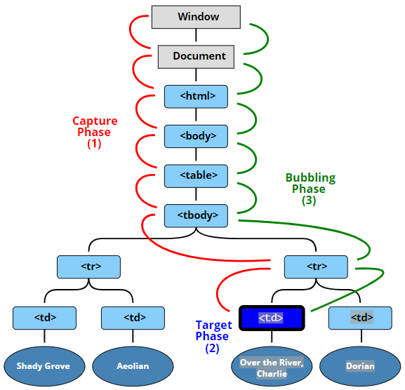

```html
<style>
    body * {
        margin: 10px;
        border: 1px solid blue;
    }
</style>

<form>FORM
    <div>DIV
        <p>P</p>
    </div>
</form>

<script>
    for(let elem of document.querySelectorAll('*')) {
        elem.addEventListener("click", e => alert(`Capturing: ${elem.tagName}`), true);
        elem.addEventListener("click", e => alert(`Bubbling: ${elem.tagName}`));
    }
</script>
```

如果你点击了 `<p>`，那么顺序是：

1. `HTML` → `BODY` → `FORM` → `DIV`（捕获阶段第一个监听器）：
2. `P`（目标阶段，触发两次，因为我们设置了两个监听器：捕获和冒泡）
3. `DIV` → `FORM` → `BODY` → `HTML`（冒泡阶段，第二个监听器）。

每个处理程序都可以访问 `event` 对象的属性：

- `event.target` —— 引发事件的层级最深的元素。
- `event.currentTarget`（=`this`）—— 处理事件的当前元素（具有处理程序的元素）
- `event.eventPhase` —— 当前阶段（capturing=1，target=2，bubbling=3）。

### 事件处理的两种套路

#### 事件委托

事件委托的思路：如果我们有许多以类似方式处理的元素，那么就不必为每个元素分配一个处理程序 —— 而是将单个处理程序放在它们的共同祖先上。

```html
<div id="menu">
    <button data-action="save">Save</button>
    <button data-action="load">Load</button>
    <button data-action="search">Search</button>
</div>
<script>
    class Menu {
        constructor(elem) {
            this._elem = elem;
            // 为div#menu添加点击事件
            /* ★ 为onClick函数绑定上下午，但并没有调用
            注意括号的位置，onClick()才代表调用该函数*/
            elem.onclick = this.onClick.bind(this);
        }

        save() {
            alert('saving');
        }

        load() {
            alert('loading');
        }

        search() {
            alert('searching');
        }

        onClick(event) {
            // 获取按钮上标注的data
            let action = event.target.dataset.action;
            if (action) {
                this[action]();
            }
        };
    }
    // 传入的menu为div#menu
    new Menu(menu);
</script>
</html>
```


这里再展示另一个更复杂的例子：

CSS不是主要的，为了完整性所有带上，主要看JS代码

```html
<!DOCTYPE HTML>
<html>

<body>
  <link type="text/css" rel="stylesheet" href="bagua.css">
  <table id="bagua-table">
    <tr>
      <th colspan="3"><em>Bagua</em> Chart: Direction, Element, Color, Meaning</th>
    </tr>
    <tr>
      <td class="nw"><strong>Northwest</strong>
        <br>Metal
        <br>Silver
        <br>Elders
      </td>
      <td class="n"><strong>North</strong>
        <br>Water
        <br>Blue
        <br>Change
      </td>
      <td class="ne"><strong>Northeast</strong>
        <br>Earth
        <br>Yellow
        <br>Direction
      </td>
    </tr>
    <tr>
      <td class="w"><strong>West</strong>
        <br>Metal
        <br>Gold
        <br>Youth
      </td>
      <td class="c"><strong>Center</strong>
        <br>All
        <br>Purple
        <br>Harmony
      </td>
      <td class="e"><strong>East</strong>
        <br>Wood
        <br>Blue
        <br>Future
      </td>
    </tr>
    <tr>
      <td class="sw"><strong>Southwest</strong>
        <br>Earth
        <br>Brown
        <br>Tranquility
      </td>
      <td class="s"><strong>South</strong>
        <br>Fire
        <br>Orange
        <br>Fame
      </td>
      <td class="se"><strong>Southeast</strong>
        <br>Wood
        <br>Green
        <br>Romance
      </td>
    </tr>

  </table>

  <script>
    let table = document.getElementById('bagua-table');

    let selectedTd;

    table.onclick = function(event) {
      let target = event.target;

      while (target != this) {
        if (target.tagName == 'TD') {
          highlight(target);
          return;
        }
        target = target.parentNode;
      }
    }

    function highlight(node) {
      if (selectedTd) {
        selectedTd.classList.remove('highlight');
      }
      selectedTd = node;
      selectedTd.classList.add('highlight');
    }
  </script>

</body>
</html>
```

```css
#bagua-table th {
  text-align: center;
  font-weight: bold;
}

#bagua-table td {
  width: 150px;
  white-space: nowrap;
  text-align: center;
  vertical-align: bottom;
  padding-top: 5px;
  padding-bottom: 12px;
}

#bagua-table .nw {
  background: #999;
}

#bagua-table .n {
  background: #03f;
  color: #fff;
}

#bagua-table .ne {
  background: #ff6;
}

#bagua-table .w {
  background: #ff0;
}

#bagua-table .c {
  background: #60c;
  color: #fff;
}

#bagua-table .e {
  background: #09f;
  color: #fff;
}

#bagua-table .sw {
  background: #963;
  color: #fff;
}

#bagua-table .s {
  background: #f60;
  color: #fff;
}

#bagua-table .se {
  background: #0c3;
  color: #fff;
}

#bagua-table .highlight {
  background: red;
}
```

#### 行为模式

> 将特征保存在`data-toggle-id`中，通过`event.target.dateset.toggleId`访问

```html
<button data-toggle-id="subscribe-mail">
    Show the subscription form
</button>

<form id="subscribe-mail" hidden>
    Your mail: <input type="email">
</form>

<script>
    document.addEventListener('click', function(event) {
        let id = event.target.dataset.toggleId;
        if (!id) return;
        let elem = document.getElementById(id);
        elem.hidden = !elem.hidden;
    });
</script>
```

### 阻止浏览器行为

+ 主流的方式是使用 `event` 对象。有一个 `event.preventDefault()` 方法。
+ 如果处理程序是使用 `on<event>`（而不是 `addEventListener`）分配的，那返回 `false` 也同样有效。

```html
<!-- 点击后并不能进行链接跳转 -->
<a href="/" onclick="return false">Click here</a>
or
<a href="/" onclick="event.preventDefault()">here</a>
```

> 当行为被阻止时，`event.defaultPrevented=true`

有时候，要同时阻止浏览器行为和阻止冒泡，那么还要调用`event.stopPropagation()`

### 自定义事件

由三部分组成：

+ 创建事件：`new CustomEvent('eventName',{bubbles:true,cancelable:true,details:……})`
  + `bubbles: true/false` —— 如果为 `true`，那么事件会冒泡
  + `cancelable: true/false` —— 如果为 `true`，那么“默认行为”就会被阻止
+ 分发事件：`elem.dispatchEvent(event)`
+ 监听和触发事件：`elem.addEventListener('eventName', ……)`

```html
<h1 id="elem">Hello for John!</h1>
<script>
    // 事件附带给处理程序的其他详细信息
    elem.addEventListener("hello", function (event) {
        alert(event.detail.name);
    });

    elem.dispatchEvent(new CustomEvent("hello", {
        detail: { bubbles: true, name: "John" }
    }));
</script>
```

事件的嵌套：

```html
<button id="menu">Menu (click me)</button>
<script>
    menu.onclick = function() {
        alert(1);
        menu.dispatchEvent(new CustomEvent("menu-open", {
            bubbles: true
        }));
        alert(2);
    };
    // 在 1 和 2 之间触发
    document.addEventListener('menu-open', () => alert('nested'));
</script>
```

输出顺序为：1 → nested → 2。

如果想要让两个事件互斥执行，那么需要给子事件套上`setTimeout`：

```js
setTimeout(() => menu.dispatchEvent(new CustomEvent("menu-open", {
    bubbles: true
})));
```

## 三、UI事件

### 鼠标事件

+ `mousedown/mouseup`：点击/释放
+ `mouseover/mouseout`：从一个元素上移入/移出
+ `mousemove`：在元素上的移动
+ `click`：左键触发
+ `contextmenu`：右键触发

事件顺序：`mousedown` → `mouseup` → `click`

组合键：

- `shiftKey`：Shift
- `altKey`：Alt（或对于 Mac 是 Opt）
- `ctrlKey`：Ctrl
- `metaKey`：对于 Mac 是 Cmd

```html
<button id="button">Alt+Shift+Click on me!</button>
<script>
    button.onclick = function(event) {
        if (event.altKey && event.shiftKey) {
            alert('Hooray!');
        }
    };
</script>
```

坐标：

- 相对于窗口的坐标：`clientX` 和 `clientY`
- 相对于文档的坐标：`pageX` 和 `pageY`

```html
<input onmousemove="this.value=event.clientX+':'+event.clientY" value="Mouse over me">
```

防止鼠标按下时候的选择：

```html
<!-- 复制行为被阻止 -->
<div oncopy="alert('Copying forbidden!');return false">
    Dear user,
    The copying is forbidden for you.
    If you know JS or HTML, then you can get everything from the page source though.
</div>
```

### 移动鼠标

对于 `mouseover`：

- `event.target` —— 是鼠标移过的那个元素。
- `event.relatedTarget` —— 是鼠标来自的那个元素（`relatedTarget` → `target`）。

`mouseout` 则与之相反：

- `event.target` —— 是鼠标离开的元素。
- `event.relatedTarget` —— 是鼠标移动到的，当前指针位置下的元素（`target` → `relatedTarget`）。


