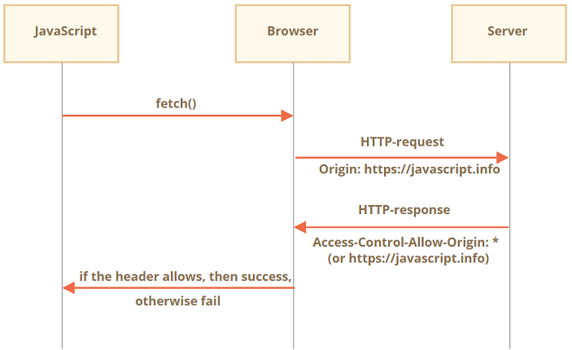
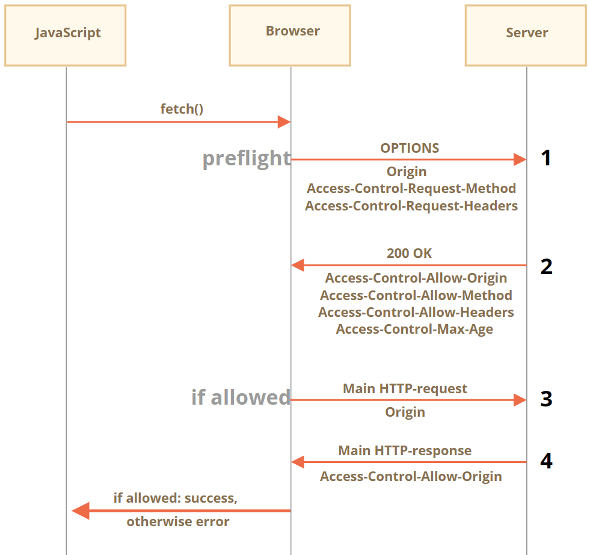
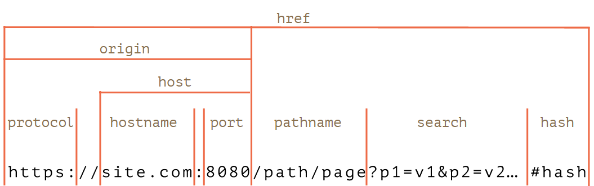
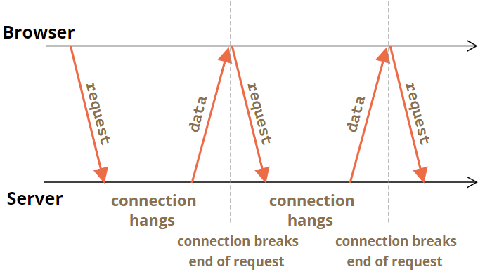

# fetch的使用

## 基本用法

```js
let promise = fetch(url, [options])
```

- `url` —— 要访问的 URL。
- `options` —— 可选参数：method，header 等。

没有 `options`，那就是一个简单的 GET 请求，下载 `url` 的内容。浏览器立即启动请求，并返回一个该调用代码应该用来获取结果的 `promise`。

获取响应通常需要经过两个阶段：

第一阶段，当服务器发送了响应头（response header），`fetch` 返回的 `promise` 就使用内建的 Response class 对象来对响应头进行解析。

通过检查响应头，来检查 HTTP 状态以确定请求是否成功，当前还没有响应体（response body）。如果 `fetch` 无法建立一个 HTTP 请求，例如网络问题，亦或是请求的网址不存在，那么 promise 就会 reject。

响应的属性：

- `response.status` —— response 的 HTTP 状态码，
- `response.ok` —— HTTP 状态码为 200-299，则为 `true`。
- `response.headers` —— 类似于 Map 的带有 HTTP header 的对象。

第二阶段，为了获取 response body，我们需要使用一个其他的方法调用。

`Response` 提供了多种基于 promise 的方法，来以不同的格式访问 body：

- `response.text()`—— 读取 response，并以文本形式返回 response，
- `response.json()` —— 将 response 解析为 JSON
- `response.formData()`—— 以 `FormData` 对象的形式返回 response，
- `response.blob()` —— 以 Blob（具有类型的二进制数据）形式返回 response，
- `response.arrayBuffer()`—— 以 ArrayBuffer（低级别的二进制数据）形式返回 response，
- 另外，`response.body` 是 ReadableStream 对象，它允许你逐块读取 body，我们稍后会用一个例子解释它。

发送请求的两种写法：

```js
let url = 'https://api.github.com/repos/javascript-tutorial/en.javascript.info/commits';
let response = await fetch(url);

let commits = await response.json(); // 读取 response body，并将其解析为 JSON

alert(commits[0].author.login);
```

```js
fetch('https://api.github.com/repos/javascript-tutorial/en.javascript.info/commits')
  .then(response => response.json())
  .then(commits => alert(commits[0].author.login));
```

响应头：`response.header`对象

请求头：fetch中使用`headers`选项

### POST请求

- `method` —— HTTP 方法，例如 `POST`，
- `body`—— request body，其中之一：
  - 字符串（例如 JSON 编码的）
  - `FormData` 对象，以 `form/multipart` 形式发送数据
  - `Blob`/`BufferSource` 发送二进制数据
  - URLSearchParams，以 `x-www-form-urlencoded` 编码形式发送数据，很少使用

```js
let user = {
  name: 'John',
  surname: 'Smith'
};

let response = await fetch('/article/fetch/post/user', {
  method: 'POST',
  headers: {
    'Content-Type': 'application/json;charset=utf-8'
  },
  body: JSON.stringify(user)
});

let result = await response.json();
alert(result.message);
```

> 如果请求的 `body` 是字符串，则 `Content-Type` 会默认设置为 `text/plain;charset=UTF-8`

## FormData

```html
<form id="formElem">
  <input type="text" name="name" value="John">
  <input type="text" name="surname" value="Smith">
  <input type="submit">
</form>

<script>
  formElem.onsubmit = async (e) => {
    e.preventDefault();

    let response = await fetch('/article/formdata/post/user', {
      method: 'POST',
      body: new FormData(formElem)
    });

    let result = await response.json();

    alert(result.message);
  };
</script>
```

### 方法

- `formData.append(name, value)` —— 添加具有给定 `name` 和 `value` 的表单字段，
- `formData.append(name, blob, fileName)` —— 添加一个字段，就像它是 `<input type="file">`，第三个参数 `fileName` 设置文件名（而不是表单字段名），因为它是用户文件系统中文件的名称，
- `formData.delete(name)` —— 移除带有给定 `name` 的字段，
- `formData.get(name)` —— 获取带有给定 `name` 的字段值，
- `formData.has(name)` —— 如果存在带有给定 `name` 的字段，则返回 `true`，否则返回 `false`。
- `formData.set(name, value)`，
- `formData.set(name, blob, fileName)`。
- 可以用`for…of`循环迭代fromData字段

### 发送有图片的表单

```html
<form id="formElem">
  <input type="text" name="firstName" value="John">
  Picture: <input type="file" name="picture" accept="image/*">
  <input type="submit">
</form>

<script>
  formElem.onsubmit = async (e) => {
    e.preventDefault();

    let response = await fetch('/article/formdata/post/user-avatar', {
      method: 'POST',
      body: new FormData(formElem)
    });

    let result = await response.json();

    alert(result.message);
  };
</script>
```

### 发送具有 Blob 数据的表单

```html
<body style="margin:0">
  <canvas id="canvasElem" width="100" height="80" style="border:1px solid"></canvas>

  <input type="button" value="Submit" onclick="submit()">

  <script>
    canvasElem.onmousemove = function(e) {
      let ctx = canvasElem.getContext('2d');
      ctx.lineTo(e.clientX, e.clientY);
      ctx.stroke();
    };

    async function submit() {
      let imageBlob = await new Promise(resolve => canvasElem.toBlob(resolve, 'image/png'));

      let formData = new FormData();
      formData.append("firstName", "John");
      formData.append("image", imageBlob, "image.png");

      let response = await fetch('/article/formdata/post/image-form', {
        method: 'POST',
        body: formData
      });
      let result = await response.json();
      alert(result.message);
    }

  </script>
</body>
```

## 跟踪下载进度

> 注意：fetch到目前为止方法无法跟踪上传进度

```js
// Step 1：启动 fetch，并获得一个 reader
let response = await fetch('https://api.github.com/repos/javascript-tutorial/en.javascript.info/commits?per_page=100');

const reader = response.body.getReader();

// Step 2：获得总长度（length）
const contentLength = +response.headers.get('Content-Length');

// Step 3：读取数据
let receivedLength = 0; // 当前接收到了这么多字节
let chunks = []; // 接收到的二进制块的数组（包括 body）
while(true) {
  const {done, value} = await reader.read();

  if (done) {
    break;
  }

  chunks.push(value);
  receivedLength += value.length;

  console.log(`Received ${receivedLength} of ${contentLength}`)
}

// Step 4：将块连接到单个 Uint8Array
let chunksAll = new Uint8Array(receivedLength); // (4.1)
let position = 0;
for(let chunk of chunks) {
  chunksAll.set(chunk, position); // (4.2)
  position += chunk.length;
}

// Step 5：解码成字符串
let result = new TextDecoder("utf-8").decode(chunksAll);

// 我们完成啦！
let commits = JSON.parse(result);
alert(commits[0].author.login);
```

`await reader.read()` 调用的结果是一个具有两个属性的对象：

- `done` —— 当读取完成时为 `true`，否则为 `false`
- `value` —— 字节的类型化数组：`Uint8Array`

让我们一步步解释下这个过程：

1. 我们像往常一样执行 `fetch`，但不是调用 `response.json()`，而是获得了一个流读取器（stream reader）`response.body.getReader()`。

   请注意，我们不能同时使用这两种方法来读取相同的响应。要么使用流读取器，要么使用 reponse 方法来获取结果。

2. 在读取数据之前，我们可以从 `Content-Length` header 中得到完整的响应长度。

   跨源请求中可能不存在这个 header（请参见 [Fetch：跨源请求](https://zh.javascript.info/fetch-crossorigin)），并且从技术上讲，服务器可以不设置它。但是通常情况下它都会在那里。

3. 调用 `await reader.read()`，直到它完成。

   我们将响应块收集到数组 `chunks` 中。这很重要，因为在使用完（consumed）响应后，我们将无法使用 `response.json()` 或者其他方式（你可以试试，将会出现 error）去“重新读取”它。

4. 最后，我们有了一个 `chunks` —— 一个 `Uint8Array` 字节块数组。我们需要将这些块合并成一个结果。但不幸的是，没有单个方法可以将它们串联起来，所以这里需要一些代码来实现：

   1. 我们创建 `chunksAll = new Uint8Array(receivedLength)` —— 一个具有所有数据块合并后的长度的同类型数组。
   2. 然后使用 `.set(chunk, position)` 方法，从数组中一个个地复制这些 `chunk`。

5. 我们的结果现在储存在 `chunksAll` 中。但它是一个字节数组，不是字符串。

   要创建一个字符串，我们需要解析这些字节。可以使用内建的 TextDecoder 对象完成。然后，我们可以 `JSON.parse` 它，如果有必要的话。

   如果我们需要的是二进制内容而不是字符串呢？这更简单。用下面这行代码替换掉第 4 和第 5 步，这行代码从所有块创建一个 `Blob`：

   ```javascript
   let blob = new Blob(chunks);
   ```

最后，我们得到了结果（以字符串或 blob 的形式表示，什么方便就用什么），并在过程中对进度进行了跟踪。

再强调一遍，这不能用于 **上传** 过程（现在无法通过 `fetch` 获取），仅用于 **下载** 过程。

## 中止（Abort）

创建一个控制器：

```js
let controller = new AbortController();
```

控制器是一个极其简单的对象。

- 它具有单个方法 `abort()`
- 和单个属性 `signal`，我们可以在这个属性上设置事件监听器

当 `abort()` 被调用时：

- `controller.signal` 就会触发 `abort` 事件
- `controller.signal.aborted` 属性变为 `true`

通常，处理分为两部分：

1. 一部分是一个可取消的操作，它在 `controller.signal` 上设置一个监听器
2. 另一部分是取消：在需要的时候调用 `controller.abort()`

通过`controller.abort()`中止fetch，当一个 fetch 被中止，它的 promise 就会以一个 error `AbortError` reject，因此我们应该对其进行处理，例如在 `try..catch` 中。

```js
// 1 秒后中止
let controller = new AbortController();
setTimeout(() => controller.abort(), 1000);

try {
  let response = await fetch('/article/fetch-abort/demo/hang', {
    signal: controller.signal
  });
} catch(err) {
  if (err.name == 'AbortError') { // handle abort()
    alert("Aborted!");
  } else {
    throw err;
  }
}
```

`AbortController` 是可伸缩的，它允许一次取消多个 fetch。

如果我们有自己的与 `fetch` 不同的异步任务，我们可以使用单个 `AbortController` 中止这些任务以及 fetch。

在我们的任务中，我们只需要监听其 `abort` 事件：

```js
let urls = [...];
let controller = new AbortController();

let ourJob = new Promise((resolve, reject) => { // 我们的任务
  ...
  controller.signal.addEventListener('abort', reject);
});

let fetchJobs = urls.map(url => fetch(url, { // fetches
  signal: controller.signal
}));

// 等待完成我们的任务和所有 fetch
let results = await Promise.all([...fetchJobs, ourJob]);

// 如果 controller.abort() 被从其他地方调用，
// 它将中止所有 fetch 和 ourJob
```

## 跨源请求

这里的核心概念是 **源（origin）**—— 域（domain）/端口（port）/协议（protocol）的组合。

跨源请求 —— 那些发送到其他域（即使是子域）、协议或端口的请求 —— 需要来自远程端的特殊 header。

这个策略被称为 “CORS”：跨源资源共享（Cross-Origin Resource Sharing）。

### 简单的请求

一个简单的请求是指满足以下两个条件的请求：

1. 简单的方法：GET，POST 或 HEAD
2. 简单的 header—— 仅允许自定义下列 header：
   - `Accept`，
   - `Accept-Language`，
   - `Content-Language`，
   - `Content-Type` 的值为 `application/x-www-form-urlencoded`，`multipart/form-data` 或 `text/plain`。

**本质区别在于，可以使用 `<form>` 或 `<script>` 进行“简单请求”，而无需任何其他特殊方法。**

#### 简单请求的CORS

如果一个请求是跨源的，浏览器始终会向其添加 `Origin` header。

服务器可以检查 `Origin`，如果同意接受这样的请求，就会在响应中添加一个特殊的 header `Access-Control-Allow-Origin`。该 header 包含了允许的源。然后响应成功，否则报错。



#### Response Header

对于跨源请求，默认情况下，JavaScript 只能访问“简单” response header：

- `Cache-Control`
- `Content-Language`
- `Content-Type`
- `Expires`
- `Last-Modified`
- `Pragma`

访问任何其他 response header 都将导致 error。

要授予 JavaScript 对任何其他 response header 的访问权限，服务器必须发送 `Access-Control-Expose-Headers` header。它包含一个以逗号分隔的应该被设置为可访问的非简单 header 名称列表。

```bash
200 OK
Content-Type:text/html; charset=UTF-8
Content-Length: 12345
API-Key: 2c9de507f2c54aa1
Access-Control-Allow-Origin: https://javascript.info
## 有了这种 Access-Control-Expose-Headers header，此脚本就被允许读取响应的 Content-Length 和 API-Key header。
Access-Control-Expose-Headers: Content-Length,API-Key
```

### "非简单"请求

我们可以使用任何 HTTP 方法：不仅仅是 `GET/POST`，也可以是 `PATCH`，`DELETE` 及其他。

预检请求使用 `OPTIONS` 方法，它没有 body，但是有两个 header：

- `Access-Control-Request-Method` header 带有非简单请求的方法。
- `Access-Control-Request-Headers` header 提供一个以逗号分隔的非简单 HTTP-header 列表。

如果服务器同意处理请求，那么它会进行响应，此响应的状态码应该为 200，没有 body，具有 header：

- `Access-Control-Allow-Origin` 必须为 `*` 或进行请求的源（例如 `https://javascript.info`）才能允许此请求。
- `Access-Control-Allow-Methods` 必须具有允许的方法。
- `Access-Control-Allow-Headers` 必须具有一个允许的 header 列表。
- 另外，header `Access-Control-Max-Age` 可以指定缓存此权限的秒数。因此，浏览器不是必须为满足给定权限的后续请求发送预检。



对于一个跨源请求：

```js
let response = await fetch('https://site.com/service.json', {
  method: 'PATCH',
  headers: {
    'Content-Type': 'application/json',
    'API-Key': 'secret'
  }
});
```

Step 1 预检请求（preflight request）

```bash
## 请求方法  请求路径
OPTIONS /service.json
Host: site.com
## 特殊跨源头
Origin: https://javascript.info							## 来源
Access-Control-Request-Method: PATCH					## 请求方法
Access-Control-Request-Headers: Content-Type,API-Key	## 以逗号分隔的“非简单” header 列表
```

Step 2 预检响应（preflight response）

```bash
200 OK
Access-Control-Allow-Origin: https://javascript.info
Access-Control-Allow-Methods: PUT,PATCH,DELETE
Access-Control-Allow-Headers: API-Key,Content-Type,If-Modified-Since,Cache-Control
## 给定时间内预检权限会被缓存
Access-Control-Max-Age: 86400
```

Step 3 实际请求（actual request）

```bash
PATCH /service.json
Host: site.com
Content-Type: application/json
API-Key: secret
Origin: https://javascript.info
```

Step 4 实际响应（actual response）

```bash
Access-Control-Allow-Origin: https://javascript.info
```

### 凭据

默认情况下，由 JavaScript 代码发起的跨源请求不会带来任何凭据（cookies 或者 HTTP 认证（HTTP authentication））。

要在 `fetch` 中发送凭据，我们需要添加 `credentials: "include"` 选项，像这样：

```js
// fetch将把源自another.com的cookie和我们的请求发送到该网站。
fetch('http://another.com', {
  credentials: "include"
});
```

如果服务器同意接受 **带有凭据** 的请求，则除了 `Access-Control-Allow-Origin` 外，服务器还应该在响应中添加 header `Access-Control-Allow-Credentials: true`。

```bash
200 OK
Access-Control-Allow-Origin: https://javascript.info
Access-Control-Allow-Credentials: true
```

> 对于具有凭据的请求，禁止 `Access-Control-Allow-Origin` 使用星号 `*`。如上所示，它必须有一个确切的源。这是另一项安全措施。

## fetch API

```js
let promise = fetch(url, {
  method: "GET", // POST，PUT，DELETE，等。
  headers: {
    // 内容类型 header 值通常是自动设置的
    // 取决于 request body
    "Content-Type": "text/plain;charset=UTF-8"
  },
  body: undefined // string，FormData，Blob，BufferSource，或 URLSearchParams
  referrer: "about:client", // 或 "" 以不发送 Referer header，
  // 或者是当前源的 url
  referrerPolicy: "no-referrer-when-downgrade", // no-referrer，origin，same-origin...
  mode: "cors", // same-origin，no-cors
  credentials: "same-origin", // omit，include
  cache: "default", // no-store，reload，no-cache，force-cache，或 only-if-cached
  redirect: "follow", // manual，error
  integrity: "", // 一个 hash，像 "sha256-abcdef1234567890"
  keepalive: false, // true
  signal: undefined, // AbortController 来中止请求
  window: window // null
});
```

+ `referer` ：指示一个请求是从哪里链接过来
  + 比如我在`www.google.com`里有一个`www.baidu.com` 链接，那么点击这个`www.baidu.com` ，它的`header` 信息里就有：`Referer=http://www.google.com`

> 由于早期拼写错误，referer字段将错就错，正确的英语拼法是referrer

+ `referrerPolicy`：`Referer` 设置一般的规则

| 值                                             | 同源       | 跨源       | HTTPS→HTTP |
| :--------------------------------------------- | :--------- | :--------- | :--------- |
| `"no-referrer"`                                | -          | -          | -          |
| `"no-referrer-when-downgrade"` 或 `""`（默认） | 完整的 url | 完整的 url | -          |
| `"origin"`                                     | 仅域       | 仅域       | 仅域       |
| `"origin-when-cross-origin"`                   | 完整的 url | 仅域       | 仅域       |
| `"same-origin"`                                | 完整的 url | -          | -          |
| `"strict-origin"`                              | 仅域       | 仅域       | -          |
| `"strict-origin-when-cross-origin"`            | 完整的 url | 仅域       | -          |
| `"unsafe-url"`                                 | 完整的 url | 完整的 url | 完整的 url |

+ `mode`：控制跨源请求
  + `cors`：默认值，运行跨源请求
  + `same-origin`：禁止跨源请求
  + `no-cors`：只运行简单跨源请求
+ `credentials`：指定 `fetch` 是否应该随请求发送 cookie 和 HTTP-Authorization header
  + `same-origin`：默认值，对于跨源请求不发送
  + `include`：总是发送，需要来自跨源服务器的 `Accept-Control-Allow-Credentials`，才能使 JavaScript 能够访问响应
  + `omit`：不发送，即使对同源请求
+ `cache`
  + `default`：使用标准的HTTP缓存规则和header
  + `no-store`：完全忽略HTTP缓存
  + `reload`：不从HTTP缓存中获取结果，而是使用响应填充缓存
  + `no-cache`：如果有一个已缓存的响应，则创建一个有条件的请求，否则创建一个普通请求。使用响应填充HTTP缓存
  + `force-cache`：使用来自HTTP缓存的响应，即使该响应已果实。如果 HTTP 缓存中没有响应，则创建一个常规的 HTTP 请求，行为像正常那样。
  + `only-if-cached`：使用来自 HTTP 缓存的响应，即使该响应已过时。如果 HTTP 缓存中没有响应，则报错。只有当 `mode` 为 `same-origin` 时生效。
+ `redirect`：重定向
  + `follow`：默认值，遵循HTTP重定向
  + `error`：HTTP重定向时报错
  + `manual`：不遵循HTTP重定向，但 `response.url` 将是一个新的 URL，并且 `response redirectd` 将为 `true`，以便我们能够手动执行重定向到新的 URL
+ `integrity`：允许检查响应是否与已知的预先校验和相匹配
+ `keepalive`：表示该请求可能会使发起它的网页“失活（outlive）”

## URL对象

`new URL(url, [base])`：

- `url`—— 完整的 URL，或者仅路径（如果设置了 base），
- `base`—— 可选的 base URL：如果设置了此参数，且参数 `url` 只有路径，则会根据这个 `base` 生成 URL。



url.searchParams：

- `append(name, value)`—— 按照 `name` 添加参数，
- `delete(name)`—— 按照 `name` 移除参数，
- `get(name)` —— 按照 `name` 获取参数，
- `getAll(name)`—— 获取相同 `name` 的所有参数（这是可行的，例如 `?user=John&user=Pete`），
- `has(name)` —— 按照 `name` 检查参数是否存在，
- `set(name, value)`—— set/replace 参数，
- `sort()` —— 按 name 对参数进行排序，很少使用，
- ……并且它是可迭代的，类似于 `Map`。

编码和解码：

- `encodeURI`—— 编码整个 URL
- `decodeURI`—— 解码为编码前的状态
- `encodeURIComponent` —— 编码 URL 组件，例如搜索参数，或者 hash，或者 pathname
- `decodeURIComponent`—— 解码为编码前的状态

```js
// 在 url 路径中使用西里尔字符
let url = encodeURI('http://site.com/привет');

alert(url); // http://site.com/%D0%BF%D1%80%D0%B8%D0%B2%D0%B5%D1%82
```

```js
let music = encodeURIComponent('Rock&Roll');

let url = `https://google.com/search?q=${music}`;
alert(url); // https://google.com/search?q=Rock%26Roll
```

## XMLHttpRequest

### 基本使用

XMLHttpRequest 有两种执行模式：同步（synchronous）和异步（asynchronous）

```js
// 1.创建对象
let xhr = new XMLHttpRequest();
// 2.初始化
xhr.open(method, URL, [async, user, password]);
// 3.发送请求
xhr.send([body];
/* 4.监听xhr事件以获取响应。
load —— 当请求完成（即使 HTTP 状态为 400 或 500 等），并且响应已完全下载。
error —— 当无法发出请求，例如网络中断或者无效的 URL。
progress —— 在下载响应期间定期触发，报告已经下载了多少。
*/
xhr.onload = function() {
  alert(`Loaded: ${xhr.status} ${xhr.response}`);
};

xhr.onerror = function() { // 仅在根本无法发出请求时触发
  alert(`Network Error`);
};

xhr.onprogress = function(event) { // 定期触发
  // event.loaded —— 已经下载了多少字节
  // event.lengthComputable = true，当服务器发送了 Content-Length header 时
  // event.total —— 总字节数（如果 lengthComputable 为 true）
  alert(`Received ${event.loaded} of ${event.total}`);
};
```

设置响应类型：`xhr.responseType`，可以为`空、text、arraybuffer、blob、document、json`这几种。

readyState：可以通过`xhr.readyState`了解当前状态

```bash
UNSENT = 0; // 初始状态
OPENED = 1; // open 被调用
HEADERS_RECEIVED = 2; // 接收到 response header
LOADING = 3; // 响应正在被加载（接收到一个数据包）
DONE = 4; // 请求完成
```

中止请求：`xhr.abort()`，会触发abort事件，且`xhr.status`变成0

HTTP-header：

+ `setRequestHeader(name, value)`
+ `getResponseHeader(name)`
+ `getAllResponseHeaders()`

### POST请求

以 `multipart/form-data` 编码发送表单：

```html
<form name="person">
  <input name="name" value="John">
  <input name="surname" value="Smith">
</form>

<script>
  // 从表单预填充 FormData
  let formData = new FormData(document.forms.person);

  // 附加一个字段
  formData.append("middle", "Lee");

  // 将其发送出去
  let xhr = new XMLHttpRequest();
  xhr.open("POST", "/article/xmlhttprequest/post/user");
  xhr.send(formData);

  xhr.onload = () => alert(xhr.response);
</script>
```

发送JSON字符串：

> 注意：不要忘记设置 header `Content-Type: application/json`，只要有了它，很多服务端框架都能自动解码 JSON

```js
let xhr = new XMLHttpRequest();

let json = JSON.stringify({
  name: "John",
  surname: "Smith"
});

xhr.open("POST", '/submit')
xhr.setRequestHeader('Content-type', 'application/json; charset=utf-8');

xhr.send(json);
```

### 上传进度

`xhr.upload`：跟踪上传事件

- `loadstart` —— 上传开始。
- `progress` —— 上传期间定期触发。
- `abort` —— 上传中止。
- `error` —— 非 HTTP 错误。
- `load` —— 上传成功完成。
- `timeout` —— 上传超时（如果设置了 `timeout` 属性）。
- `loadend` —— 上传完成，无论成功还是 error。

```html
<input type="file" onchange="upload(this.files[0])">

<script>
function upload(file) {
  let xhr = new XMLHttpRequest();

  // 跟踪上传进度
  xhr.upload.onprogress = function(event) {
    console.log(`Uploaded ${event.loaded} of ${event.total}`);
  };

  // 跟踪完成：无论成功与否
  xhr.onloadend = function() {
    if (xhr.status == 200) {
      console.log("success");
    } else {
      console.log("error " + this.status);
    }
  };

  xhr.open("POST", "/article/xmlhttprequest/post/upload");
  xhr.send(file);
}
</script>
```

### 跨源请求

`XMLHttpRequest` 可以使用和fetch相同的 CORS 策略进行跨源请求。

就像 `fetch` 一样，默认情况下不会将 cookie 和 HTTP 授权发送到其他域。要启用它们，可以将 `xhr.withCredentials` 设置为 `true`：

```js
let xhr = new XMLHttpRequest();
xhr.withCredentials = true;

xhr.open('POST', 'http://anywhere.com/request');
```

## 长轮询

其流程为：

1. 请求发送到服务器。
2. 服务器在有消息之前不会关闭连接。
3. 当消息出现时 —— 服务器将对其请求作出响应。
4. 浏览器立即发出一个新的请求。



如果连接丢失，可能是因为网络错误，浏览器会立即发送一个新请求。

实现长轮询的客户端 `subscribe` 函数的示例代码：

```js
async function subscribe() {
  let response = await fetch("/subscribe");

  if (response.status == 502) {
    // 状态 502 是连接超时错误，
    // 连接挂起时间过长时可能会发生，
    // 远程服务器或代理会关闭它
    // 让我们重新连接
    await subscribe();
  } else if (response.status != 200) {
    // 一个 error —— 让我们显示它
    showMessage(response.statusText);
    // 一秒后重新连接
    await new Promise(resolve => setTimeout(resolve, 1000));
    await subscribe();
  } else {
    // 获取并显示消息
    let message = await response.text();
    showMessage(message);
    // 再次调用 subscribe() 以获取下一条消息
    await subscribe();
  }
}

subscribe();
```

正如你所看到的，`subscribe` 函数发起了一个 `fetch`，然后等待响应，处理它，并再次调用自身。
