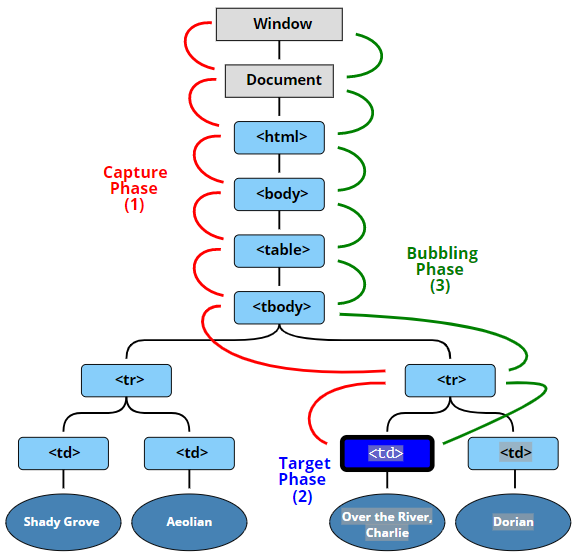
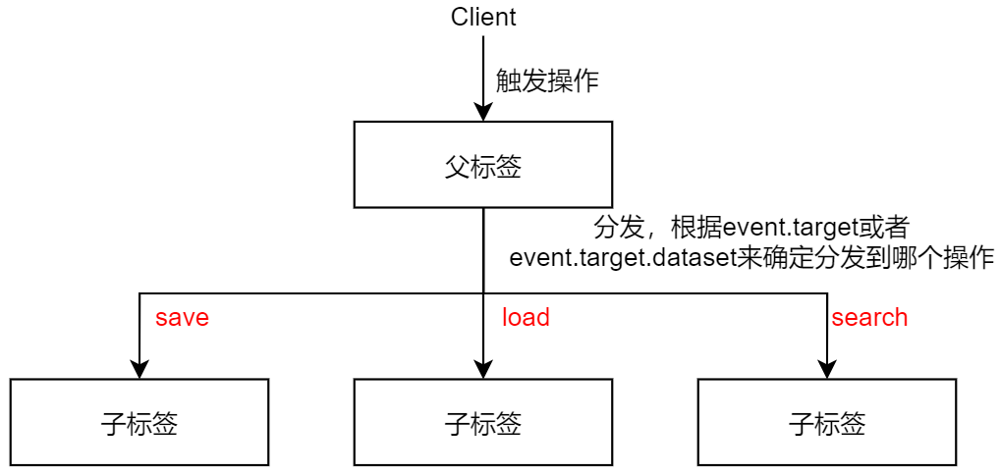
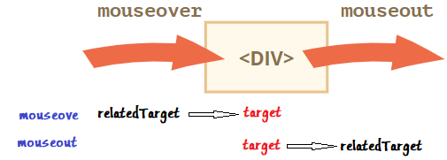
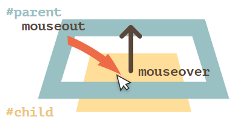
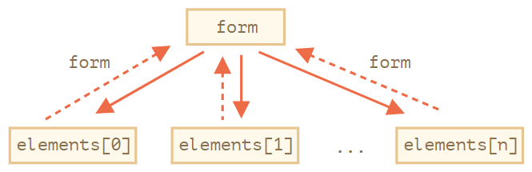
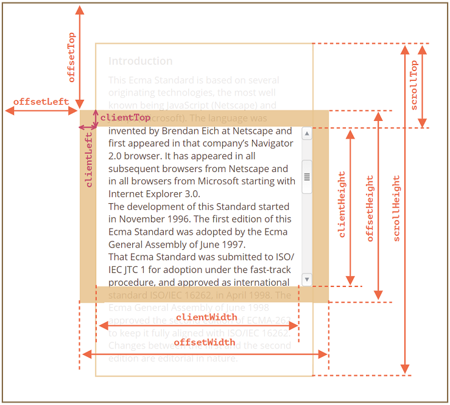
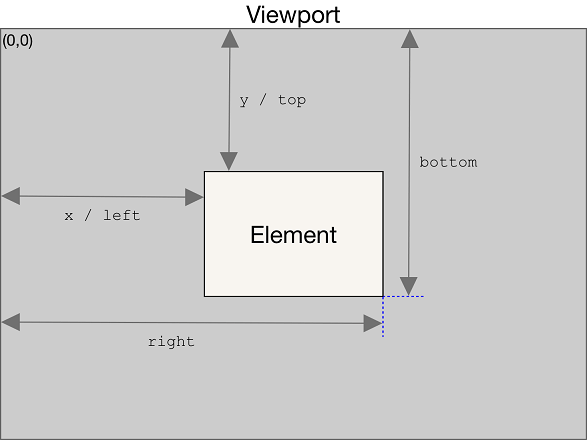

# 浏览器事件使用汇总

## 事件的三种触发方法

- 标签属性

- DOM属性

- 监听

```html
<input id="elem1" onClick="console.log('标签属性触发')" type="button" value="标签属性触发" />
<input id="elem2" type="button" value="DOM属性触发" />
<input id="elem3" type="button" value="监听触发" />
<script>
    // 将函数看作变量设置为elem2.onclick的属性，点击时调用函数
    elem2.onclick = () => {
        console.log('DOM属性触发');
    }

    // 将回调函数传入到监听器中，点击后触发
    elem3.addEventListener('click', () => {
        console.log('监听触发');
    })
</script>
```

> 另外监听的方式可以写成一个类，这里就不赘述了

## DOM事件传播三阶段

### 目标元素

```html
<form id="form">FORM
    <div>DIV
        <p>P</p>
    </div>
</form>
```

比如现在点击p层的标签，那么：

- `event.target`为p

- `this(=event.currentTarget)`为form

- `event.eventPhase`：当前阶段（capturing=1，target=2，bubbling=3）

### 捕获和冒泡

1. 捕获阶段（Capturing phase）—— 事件（从 Window）向下走近元素。

2. 目标阶段（Target phase）—— 事件到达目标元素。

3. 冒泡阶段（Bubbling phase）—— 事件从元素上开始冒泡。



> 捕获用的比较少，这里主要注意下冒泡

```html
<style>
    body * {
        margin: 10px;
        border: 1px solid blue;
    }
</style>
<form>FORM
    <div>DIV
        <p>P</p>
    </div>
</form>
<script>
    for(let elem of document.querySelectorAll('*')) {
        elem.addEventListener("click", e => alert(`Capturing: ${elem.tagName}`), true);
        elem.addEventListener("click", e => alert(`Bubbling: ${elem.tagName}`));
    }
</script>
```

如果你点击了 `<p>`，那么顺序是：

1. `HTML` → `BODY` → `FORM` → `DIV`（捕获阶段第一个监听器）

2. `P`（目标阶段，触发两次，因为我们设置了两个监听器：捕获和冒泡）

3. `DIV` → `FORM` → `BODY` → `HTML`（冒泡阶段，第二个监听器）。

每个处理程序都可以访问 `event` 对象的属性：

- `event.target` —— 引发事件的层级最深的元素。

- `event.currentTarget`（=`this`）—— 处理事件的当前元素（具有处理程序的元素）

- `event.eventPhase` —— 当前阶段（capturing=1，target=2，bubbling=3）。

### 停止冒泡

用于停止冒泡的方法是 `event.stopPropagation()`。

```html
<body onclick="alert(`the bubbling doesn't reach here`)">
    <button onclick="event.stopPropagation()">Click me</button>
</body>
```

## 事件处理的两种套路

### 事件委托

用一个统一的委托函数管理多个事件

```html
<div id="menu">
    <button data-action="save">Save</button>
    <button data-action="load">Load</button>
    <button data-action="search">Search</button>
</div>
<script>
    class Menu {
        constructor(elem) {
            this._elem = elem;
            // 为div#menu添加点击事件
            /* ★ 为onClick函数绑定上下午，但并没有调用
            注意括号的位置，onClick()才代表调用该函数*/
            elem.onclick = this.onClick.bind(this);
        }

        save() {
            alert('saving');
        }

        load() {
            alert('loading');
        }

        search() {
            alert('searching');
        }

        onClick(event) {
            // 获取按钮上标注的data
            let action = event.target.dataset.action;
            if (action) {
                this[action]();
            }
        };
    }
    // 传入的menu为div#menu
    new Menu(menu);
</script>
```



### 行为模式

将特征保存在`data-toggle-id`中，通过`event.target.dateset.toggleId`访问

```html
<button data-toggle-id="subscribe-mail">
    Show the subscription form
</button>

<form id="subscribe-mail" hidden>
    Your mail: <input type="email">
</form>

<script>
    document.addEventListener('click', function(event) {
        let id = event.target.dataset.toggleId;
        if (!id) return;
        let elem = document.getElementById(id);
        elem.hidden = !elem.hidden;
    });
</script>
```

## 阻止浏览器行为两种方式

- HTML属性处`return false`

- `event.preventDefault()`，这种方式一般写在函数中较多

```html
<!-- 点击后并不能进行链接跳转 -->
<a href="/" onclick="return false">Click here</a>
<a href="/" onclick="event.preventDefault()">here</a>
```

## 自定义事件

由三部分组成：

- 监听和触发事件：`elem.addEventListener('eventName', ……)`

- 创建事件：`new CustomEvent('eventName',{bubbles:true,cancelable:true,details:……})`

- - `bubbles: true/false` —— 如果为 `true`，那么事件会冒泡
  - `cancelable: true/false` —— 如果为 `true`，那么“默认行为”就会被阻止

- 分发事件：`elem.dispatchEvent(event)`

```html
<h1 id="elem">Hello for John!</h1>
<script>
  // 事件附带给处理程序的其他详细信息
  elem.addEventListener("hello", function (event) {
    alert(event.detail.name);
  });
  elem.dispatchEvent(new CustomEvent("hello", {
    detail: { name: "John" }
  }));
</script>
```

> 注意：`addEventListener`必须写在`dispatchEvent`前面，否则不会触发事件

## 浏览器自带事件

### 鼠标事件

+ `mousedown/mouseup`：鼠标点击/释放鼠标
+ `mouseover/mouseout`：鼠标指针移入/移出
+ `mouseenter/mouseleave`：鼠标指针移入/移出

> 两个移动事件的区别：
> 
> 1. 元素内部与后代之间的转换不会产生影响。
> 2. 事件 `mouseenter/mouseleave` 不会冒泡。

+ `mousemove`：在元素上移动
+ `click`：左键
+ `dblclick`：双击左键
+ `contextmenu`：右键

触发过程：`mousedown--->mouseup--->click/dblclick/contextmenu`

event属性：

+ `event.button`
  + 0：左键
  + 1：中键
  + 2：右键
+ `event.shiftKey`
  + true：按下了shift键
  + false：没按下
+ `event.altKey`
+ `event.ctrlKey`
+ `event.metaKey`：对于Mac是`Cmd`
+ `event.clientX/Y`：相对于窗口的坐标
+ `event.pageX/Y`：相对于文档的坐标

#### 细说移动事件

关于`event.target`和`event.relatedTarget`的关系：



移动到一个子元素时，会发生**冒泡**：



```html
<!DOCTYPE html>
<html lang="en">

<head>
    <meta charset="UTF-8">
    <meta http-equiv="X-UA-Compatible" content="IE=edge">
    <meta name="viewport" content="width=device-width, initial-scale=1.0">
    <title>test</title>
    <style>
        #parent {
            background: #99C0C3;
            width: 160px;
            height: 120px;
            position: relative;
        }

        #child {
            background: #FFDE99;
            width: 50%;
            height: 50%;
            position: absolute;
            left: 50%;
            top: 50%;
            transform: translate(-50%, -50%);
        }

        textarea {
            height: 140px;
            width: 300px;
            display: block;
        }
    </style>
</head>

<body>
    <div id="parent">
        parent
        <div id="child">child</div>
    </div>
    <textarea id="text"></textarea>
    <input type="button" onclick="text.value=''" value="Clear">
    <script>
        const parent = document.getElementById('parent');
        const child = document.getElementById('child');
        function mouseLog(event) {
            let d = new Date();
            text.value += `${d.getHours()}:${d.getMinutes()}:${d.getSeconds()} | ${event.type} [target: ${event.target.id}]\n`.replace(/(:|^)(\d\D)/, '$10$2');
            text.scrollTop = text.scrollHeight;
        }

        parent.onmouseover = (e) => {
            mouseLog(e);
        }
        parent.onmouseout = (e) => {
            mouseLog(e);
        }
        child.onmouseover = (e) => {
            mouseLog(e);
        }
        child.onmouseout = (e) => {
            mouseLog(e);
        }
    </script>
</body>

</html>
```

输出：

```bash
## 从外界移入到parent
22:09:24 | mouseover [target: parent]
## 从parent移入到child
22:09:24 | mouseout [target: parent]
22:09:24 | mouseover [target: child]
22:09:24 | mouseover [target: child]
## 从child移入到parent
22:09:25 | mouseout [target: child]
22:09:25 | mouseout [target: child]
22:09:25 | mouseover [target: parent]
## 从parent移入到外界
22:09:25 | mouseout [target: parent]
```

如果将其换成`mouseenter`和`mouseleave`，则不会发生冒泡

#### 拖放事件

> 拖放事件先搁置，之后再补

#### 指针事件

指针事件是为了应对触摸屏产生的

| 指针事件                 | 类似的鼠标事件      |
|:-------------------- |:------------ |
| `pointerdown`        | `mousedown`  |
| `pointerup`          | `mouseup`    |
| `pointermove`        | `mousemove`  |
| `pointerover`        | `mouseover`  |
| `pointerout`         | `mouseout`   |
| `pointerenter`       | `mouseenter` |
| `pointerleave`       | `mouseleave` |
| `pointercancel`      | -            |
| `gotpointercapture`  | -            |
| `lostpointercapture` | -            |

指针事件属性：

+ `event.pointerId`：当前事件的唯一标识符
+ `event.pointerType`：指针设备类型
  + mouse
  + pen
  + touch
+ `event.isPrimary`：当指针为首要指针（多点触控时按下的第一根手指）时为 `true`
+ `event.width`：指针（例如手指）接触设备的区域宽度
+ `event.width`：指针（例如手指）接触设备的区域高度
+ `event.pressure`：触摸压力

多点触控：

第一个手指触摸：

`pointerdown` 事件触发，`isPrimary=true`，并且被指派了一个 `pointerId`。

第二个和后续的更多个手指触摸（假设第一个手指仍在触摸）：

`pointerdown` 事件触发，`isPrimary=false`，并且每一个触摸都被指派了不同的 `pointerId`。

> `pointerId` 不是分配给整个设备的，而是分配给每一个触摸的。如果 5 根手指同时触摸屏幕，我们会得到 5 个 `pointerdown` 事件和相应的坐标以及 5 个不同的 `pointerId`

### 键盘事件

+ `keydown`：按下时触发
+ `keyup`：按下时触发

| Key       | `event.key` | `event.code`               |
|:--------- |:----------- |:-------------------------- |
| Z         | `z`（小写）     | `KeyZ`                     |
| Shift+Z   | `Z`（大写）     | `KeyZ`                     |
| F1        | `F1`        | `F1`                       |
| Backspace | `Backspace` | `Backspace`                |
| Shift     | `Shift`     | `ShiftRight` 或 `ShiftLeft` |

阻止默认行为：

```html
<input onkeydown="return checkPhoneKey(event.key)" placeholder="Phone, please" type="tel">
<script>
    function checkPhoneKey(key) {
        return (key >= '0' && key <= '9') || key == '+' || key == '(' || key == ')' || key == '-' || key == 'ArrowLeft' || key == 'ArrowRight' || key == 'Delete' || key == 'Backspace';
    }
</script>
```

### 滚动

通过更改`scrollTop/scrollLeft`来滚动常规元素

- `scrollBy(x,y)`：将页面滚动至相对于当前位置的(x,y)位置
- `scrollTo(pageX,pageY)`：将页面滚动至绝对坐标
  - 滚动到最开始：`scrollTo(0,0)`
- `elem.scrollIntoView(top)`：将调用滚动页面以使elem可见
  - `top=true`：页面滚动，使elem出现在窗口顶部，元素的上边缘将与窗口顶部对齐。
  - `top=false`：页面滚动，使elem出现在窗口底部，元素的下边缘将与窗口底部对齐。

禁止滚动：设置 `document.body.style.overflow = "hidden"`该页面将“冻结”在其当前滚动位置上。

放置滚动（使某些东西变成不可滚动）：我们不能通过在 `onscroll` 监听器中使用 `event.preventDefault()` 来阻止滚动，因为它会在滚动发生 **之后** 才触发。但是我们可以在导致滚动的事件上，例如在 pageUp 和 pageDown 的 `keydown` 事件上，使用 `event.preventDefault()` 来阻止滚动。

### 表单事件

#### 导航

```html
<form name="form1">
    <input name="one" value="1">
    <input name="two" value="2">
</form>
<form name="form2">
    <input name="three" value="3">
    <input name="four" value="4">
</form>
```

获取页面所有表单：`const form = document.forms;`

从所有表单中获取某个表单：

+ `document.forms.from1`

+ `document.forms[0]`

获取表单中的元素：`const elem = document.forms[0].elements.one;`

通过表单元素获取表单：



```js
// 对上述表单，form -> element
const elem = document.forms[0].elements.one;
console.log(elem);
// element -> form
console.log(elem.form);
```

> 注意整个导航过程中是寻name属性，而不是class

如果有多个name相同，`form.elements[name]` 将会是一个集合

#### 事件

+ `focus`：聚焦
+ `blur`：失去聚焦

> focus/blur不会向上冒泡

+ `change`：元素更改完成时触发
+ `input`：输入值发生修改后触发
+ `cut/copy/paste`：剪切/拷贝/粘贴时触发
+ `submit`：提交

## 大小与坐标

> 坐标部分之后会重写，现在这版写的不好

### 元素大小

1.`offsetLeft/Top`：相对于最近祖先`offsetParent`左上角的x/y坐标

最近的祖先为下列之一：

- CSS 定位的（`position` 为 `absolute`，`relative` 或 `fixed`）
- `<td>`，`<th>`，`<table>`
- `<body>`

2.`offsetWidth/Height`：元素的“外部” width/height

```
offsetWidth = borderLeft + paddingLeft + contentWidth + paddingRight + scrollbar + borderRight
offsetHeight = borderTop + paddingTop + contentHeight + paddingButtom + scrollbar + borderButtom
```

3.`clientTop/Left`：相对于边框左上角的x/y坐标

> 在希伯来语中，浏览器的滚动条是在左边的，这个坐标此时是包含滚动条宽度的

4.`clientWidth/Height`：元素边框内区域的大小

包括了 “content width” 和 “padding”，但不包括滚动条宽度（scrollbar）

```
clientWidth = paddingLeft + contentWidth + paddingRight
clientHeight = paddingTop + contentHeight + paddingButtom
```

当没有 padding 时，我们可以使用 `clientWidth/clientHeight` 来获取内容区域的大小。

5.`scrollWidth/Height`：滚动区域的大小

6.`scrollLeft/scrollTop`：元素的隐藏、滚动部分的 width/height



> 除了 `scrollLeft/scrollTop` 外，所有属性都是只读的。如果我们修改 `scrollLeft/scrollTop`，浏览器会滚动对应的元素。

### getBoundingClientRect()

```js
domRect = element.getBoundingClientRect();
```

返回一个domRect对象，该对象有如下属性：

+ `left/right/top/buttom`
+ `x/y`
+ `width/height`



### 鼠标坐标

1.`screenX/screenY`：鼠标点击位置相对于**电脑屏幕左上角**的偏移量

2.`clientX/clientY`：鼠标点击位置相对于**浏览器可视区域**的偏移量

3.`pageX和pageY`：鼠标点击位置相对于**网页左上角**的偏移量

```
pageX = clientX + scrollbar(水平滚动条)
pageX = clientX + scrollbar(垂直滚动条)
```

> 如果页面没有滚动条，则`pageX=clientX`

4.`offsetX和offsetY`：鼠标点击位置相对于**触发事件对象**的距离

### Window坐标
