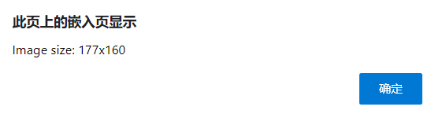
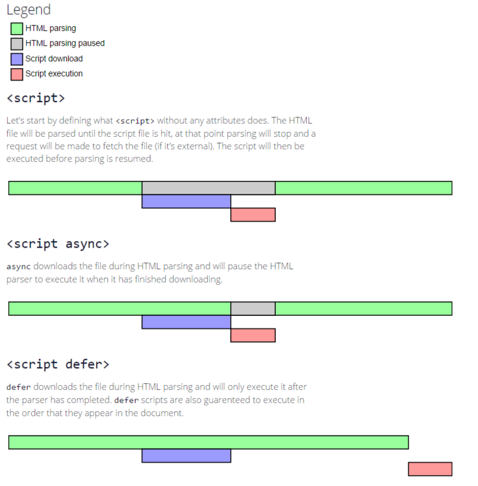

# 页面生命周期

主要包含以下事件：

- `DOMContentLoaded`：DOM 已经就绪，JS可以访问 DOM 节点，初始化页面
- `load`：外部资源已加载完成，样式已被应用，图片大小也已知了
- `beforeunload`：用户正在离开，我们可以检查用户是否保存了更改，并询问他是否真的要离开
- `unload`：用户几乎已经离开了，但是我们仍然可以启动一些操作，例如发送统计数据

## DOMContentLoaded

### 基本使用

> 必须使用 addEventListener 来捕获它

```javascript
document.addEventListener("DOMContentLoaded", ready);
```

例子：

```html
<script>
  function ready() {
    alert('DOM is ready');

    // 图片目前尚未加载完成（除非已经被缓存），所以图片的大小为 0x0
    alert(`Image size: ${img.offsetWidth}x${img.offsetHeight}`);
  }

  document.addEventListener("DOMContentLoaded", ready);
</script>


```

### DOMContentLoaded 和脚本

当浏览器在解析HTML页面时遇到了`<script>...</script>`标签，将无法继续构建DOM树（译注：UI渲染线程与JS引擎是互斥的，当JS引擎执行时UI线程会被挂起），必须立即执行脚本。所以`DOMContentLoaded`必须等待脚本执行结束。

> 不会阻塞`DOMContentLoaded`的脚本：
> 1.带async和defer的外部脚本
> 2.使用`document.createElement('script')`动态生成并添加到网页的脚本也不会阻塞`DOMContentLoaded`

### DOMContentLoaded 与样式表

`DOMContentLoaded`需要等待脚本的执行，脚本又需要等待样式的加载

```html
<link type="text/css" rel="stylesheet" href="style.css">
<script>
  // 脚本直到样式表加载完毕后才会执行。
  alert(getComputedStyle(document.body).marginTop);
</script>
```

## window.onload

```html
<script>
  window.onload = function() { // 与此相同 window.addEventListener('load', (event) => {
    alert('Page loaded');

    // 此时图片已经加载完成
    alert(`Image size: ${img.offsetWidth}x${img.offsetHeight}`);
  };
</script>


```

`window.onload`会等待所有图片加载完毕后才执行，最终结果如下：



## window.onunload

当访问者离开页面时，window 对象上的 unload 事件就会被触发

> 但根据官方文档，不建议使用该事件

## window.onbeforeunload

如果用户即将离开页面或者关闭窗口时，beforeunload事件将会被触发以进行额外的确认

```javascript
window.addEventListener('beforeunload', function (e) {
    // Cancel the event
    e.preventDefault();
    // Chrome requires returnValue to be set
    e.returnValue = '自定义文本';
});
```

```javascript
window.onbeforeunload = function(event) { 
    ...
};
```

1. HTML规范建议作者使用 Event.preventDefault() 而非 Event.returnValue 的方式来提示用户。但是，该种方法还没有得到全部浏览器的支持，所以需要配合使用。
2. 如果不需要展示弹窗，不使用 `Event.preventDefault()`，`Event.returnValue`即可。
3. returnValue自定义文本无效：从Firefox 44，Chrome 51，Opera 38，和Safari 9.1以后，返回文本将不会被展示，换言之，无法自定义弹窗提示文本。
4. alert，confirm，prompt不执行：在一些浏览器中，在onbeforeunload中调用alert，confirm，prompt等方法会被忽略。
5. onbeforeunload无效：在Chrome和Firefox中，页面加载完成后，如果用户未对页面进行操作，比如“点击”、“输入”等等，onbeforeunload将不会被执行。而在Safari中onbeforeunload总是会被执行。

## readyState

它有 3 个可能值：

- loading —— 文档正在被加载。
- interactive —— 文档被全部读取。
- complete —— 文档被全部读取，并且所有资源（例如图片等）都已加载完成。

所以，我们可以检查 `document.readyState` 并设置一个处理程序，或在代码准备就绪时立即执行它。

```javascript
function work() { /*...*/ }

if (document.readyState == 'loading') {
  // 仍在加载，等待事件
  document.addEventListener('DOMContentLoaded', work);
} else {
  // DOM 已就绪！
  work();
}
```

# async和defer

现代网站中在执行`<script>...</script>`或外部脚本`<script src="..."></script>`时候必须停止构建DOM，立刻执行此脚本，执行结束后才能继续处理剩余的页面。
造成的问题：
1.脚本不能访问到位于它们下面的DOM元素
2.笨重的脚本可能阻塞页面
可以将脚本放在页面底部，此时就能解决上述问题，但这种方式不是完美的，对于长的HTML文档来说，如果网速较慢，可能会造成明显的延迟。

## defer

defer特性：

- 不会阻塞页面
- 总是要等到 DOM 解析完毕，但在 DOMContentLoaded 事件之前执行
  
```html
<p>...content before scripts...</p>
<script>
  document.addEventListener('DOMContentLoaded', () => alert("DOM ready after defer!"));
</script>
<script defer src="https://javascript.info/article/script-async-defer/long.js?speed=1"></script>
<p>...content after scripts...</p>
```

1. 页面内容立即显示。
2. DOMContentLoaded 事件处理程序等待具有 defer 特性的脚本执行完成。它仅在脚本下载且执行结束后才会被触发。
   
  ## async
   
async特性：

- 不会阻塞页面
- async脚本是**独立的**，其他脚本不会等待 async 脚本加载完成，同样，async 脚本也不会等待其他脚本
- DOMContentLoaded 和异步脚本不会彼此等待
  
```html
<p>...content before scripts...</p>
<script>
  document.addEventListener('DOMContentLoaded', () => alert("DOM ready!"));
</script>
<script async src="https://javascript.info/article/script-async-defer/long.js"></script>
<script async src="https://javascript.info/article/script-async-defer/small.js"></script>
<p>...content after scripts...</p>
```

1. 页面内容立刻显示出来：加载写有 async 的脚本不会阻塞页面渲染。
2. DOMContentLoaded 可能在 async 之前或之后触发，不能保证谁先谁后。
3. 较小的脚本 small.js 排在第二位，但可能会比 long.js 这个长脚本先加载完成，所以 small.js 会先执行。虽然，可能是 long.js 先加载完成，如果它被缓存了的话，那么它就会先执行。换句话说，异步脚本以“加载优先”的顺序执行。
  
## 对比
  


> defer和async特性仅适用于外部脚本，如果`<script>`脚本没有 src，则会忽略 defer 特性。

|       | 顺序                               | DOMContentLoaded                                      |
| ----- | -------------------------------- | ----------------------------------------------------- |
| async | 加载优先顺序。脚本在文档中的顺序不重要 —— 先加载完成的先执行 | 不相关。可能在文档加载完成前加载并执行完毕。如果脚本很小或者来自于缓存，同时文档足够长，就会发生这种情况。 |
| defer | 文档顺序（它们在文档中的顺序）                  | 在文档加载和解析完成之后（如果需要，则会等待），即在 DOMContentLoaded 之前执行。     |

所以async用在那些完全不依赖其他脚本的脚本上

## 动态脚本

我们可以使用 JavaScript 动态地创建一个脚本，并将其附加（append）到文档（document）中

```javascript
function loadScript(src) {
  let script = document.createElement('script');
  script.src = src;
  script.async = false;
  document.body.append(script);
}

// long.js 先执行，因为代码中设置了 async=false
loadScript("/article/script-async-defer/long.js");
loadScript("/article/script-async-defer/small.js");
```

# 资源加载

## 事件

主要有两个事件：

- onload —— 成功加载
- onerror —— 出现 error

加载脚本：

```javascript
let script = document.createElement('script');

// 可以从任意域（domain），加载任意脚本
script.src = "https://cdnjs.cloudflare.com/ajax/libs/lodash.js/4.3.0/lodash.js"
document.head.append(script);

script.onload = function() {
  // 该脚本创建了一个变量 "_"
  alert( _.VERSION ); // 显示库的版本
};

script.onerror = function() {
  alert("Error loading " + this.src); // Error loading https://example.com/404.js
};
```

加载图片：

```javascript
let img = document.createElement('img');
img.src = "https://js.cx/clipart/train.gif"; // (*)

img.onload = function() {
  alert(`Image loaded, size ${img.width}*${img.height`);
};

img.onerror = function() {
  alert("Error occurred while loading image");
};
```

## 跨源策略

这里有一条规则：来自一个网站的脚本无法访问其他网站的内容。例如，位于 `https://facebook.com` 的脚本无法读取位于 `https://gmail.com` 的用户邮箱。或者，更确切地说，一个源（域/端口/协议三者）无法获取另一个源（origin）的内容。因此，即使我们有一个子域，或者仅仅是另一个端口，这都是不同的源，彼此无法相互访问。

这里有三个级别的跨源访问：

1. 无 `crossorigin` 特性 —— 禁止访问
2. `crossorigin="anonymous"` —— 如果服务器的响应带有包含 `*` 或我们的源（origin）的 `header Access-Control-Allow-Origin`，则允许访问。浏览器不会将授权信息和 cookie 发送到远程服务器
3. `crossorigin="use-credentials"` —— 如果服务器发送回带有我们的源的 header `Access-Control-Allow-Origin` 和 `Access-Control-Allow-Credentials: true`，则允许访问。浏览器会将授权信息和 cookie 发送到远程服务器

```javascript
<script>
  window.onerror = function(message, url, line, col, errorObj) {
  alert(`${message}\n${url}, ${line}:${col}`);
  };
</script>
<script crossorigin="anonymous" src="https://cors.javascript.info/article/onload-onerror/crossorigin/error.js"></script>
```
