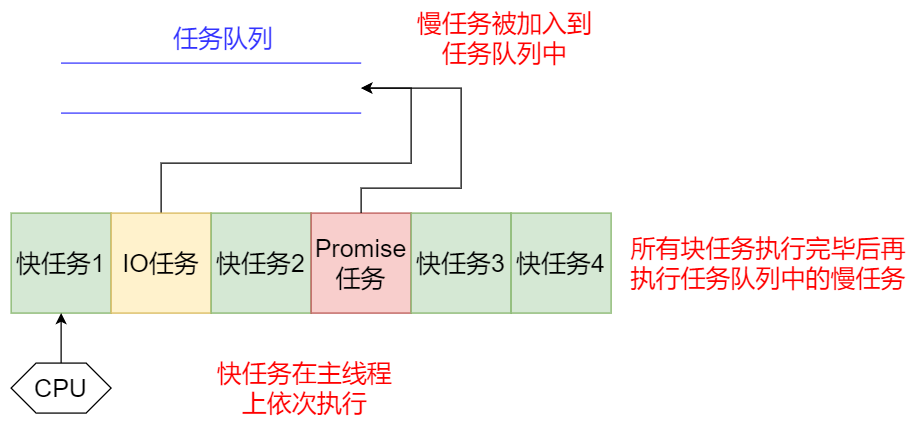
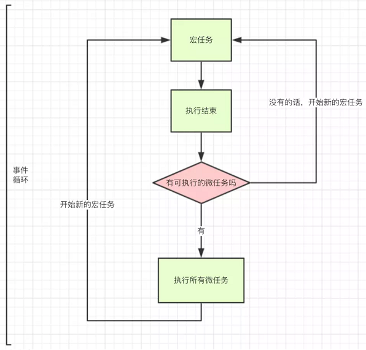
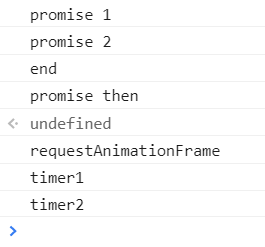
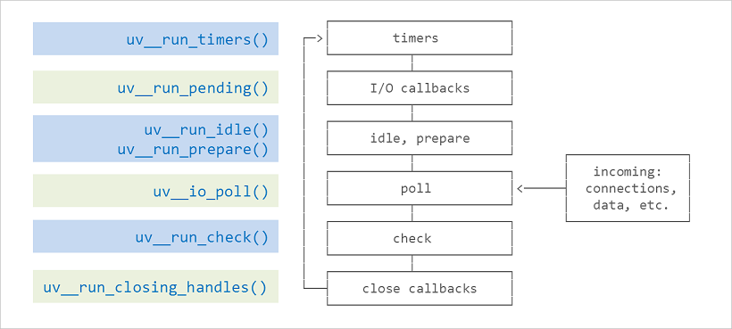

# JS同步和异步的宏观机制

JS只支持单线程，不像Java、Go一样支持多线程，因此JS的执行就一条流水线，不能同时进行多个任务。

JS的任务分为同步和异步两种，**同步和异步的差别就在于这条流水线上各个流程的执行顺序不同**。

为啥会有异步？因为有些任务要很长事件才能返回结果，比如IO、Promise，为了不占用CPU资源，因此将这些慢任务先放到一边，即加入到**任务队列**中，等主流水线上的快任务执行完成后再来执行这些慢任务。



现在给出同步和异步的定义：

**同步任务：在主线程上排队执行的任务，只有前一个任务执行完毕，才能执行后一个任务**

**异步任务：不进入主线程、而进入"任务队列"（task queue）的任务，只有等主线程任务执行完毕，"任务队列"开始通知主线程，请求执行任务，该任务才会进入主线程执行。**

具体来说，异步运行机制如下：

（1）所有同步任务都在主线程上执行，形成一个执行栈（execution context stack）。

（2）主线程之外，还存在一个"任务队列"（task queue）。只要异步任务有了运行结果，就在"任务队列"之中放置一个事件。

（3）一旦"执行栈"中的所有同步任务执行完毕，系统就会读取"任务队列"，看看里面有哪些事件。那些对应的异步任务，于是结束等待状态，进入执行栈，开始执行。

（4）主线程不断重复上面的第三步。

**只要主线程空了，就会去读取“任务队列”**，这就是JavaScript的运行机制。这个过程会不断重复。  

# 异步编程的实现方法

+ 回调函数
+ 事件监听
+ 发布订阅
+ Promise/A+
+ 生成器
+ async/await

> 这里只讲前三种，另外三种在其他专题里讲
>
> 参考：[JS 异步编程六种方案_浪里行舟的博客-CSDN博客_js异步](https://blog.csdn.net/howgod/article/details/93978297)

## 回调函数

有两个函数`f1()`和`f2()`，后者等待前者的执行结果，但f1是一个慢任务，可以考虑改写f1，把f2写成f1的回调函数。

```js
function f1(callback){
  setTimeout(function () {
    // f1的任务代码
    callback();
  }, 1000);
}
f1(f2);
```

这样f2就变成了异步任务啦。

但是回调函数的方式有缺点：不利于代码的阅读和维护，各个部分之间高度耦合，使得程序结构混乱、流程难以追踪（尤其是多个回调函数嵌套的情况），而且每个任务只能指定一个回调函数。此外它不能使用 try catch 捕获错误，不能直接 return。

## 事件监听

下面是两个函数f1和f2，编程的意图是f2必须等到f1执行完成，才能执行。首先，为f1绑定一个事件

```js
f1.on('done', f2);
```

上面这行代码的意思是，当f1发生done事件，就执行f2。然后，对f1进行改写：

```js
function f1(){
  setTimeout(function () {
    // f1的任务代码
    f1.trigger('done');
  }, 1000);
}
```

上面代码中，`f1.trigger('done')`表示，执行完成后，立即触发done事件，从而开始执行f2。

## 发布订阅

f2向信号中心jQuery订阅done信号。

```js
jQuery.subscribe('done', f2);
```

然后，f1进行如下改写：

```js
function f1() {
  setTimeout(function () {
    // f1的任务代码
    jQuery.publish('done');
  }, 1000);
}
```

f1任务执行完后，就向信号中心"发布"（publish）一个信号，而订阅（subscribe）信号中心的f2知道f1执行完毕而执行自己

# 浏览器下的事件循环

## 宏任务和微任务

异步任务还可以细化，分为宏任务和微任务。至于它们按照什么顺序执行，这就要依赖于event loop机制。



每执行一个宏任务后，执行所有微任务队列中的任务，然后再循环执行一个宏任务，如此下去。

宏任务：鼠标事件、键盘事件、网络事件、HTML解析

| 事件                    | 浏览器 | Node |
| ----------------------- | ------ | ---- |
| `setTimeout`            | √      | √    |
| `setInterval`           | √      | √    |
| `setImmediate`          | x      | √    |
| `requestAnimationFrame` | √      | x    |

微任务：Promises、DOM mutations

| 事件                         | 浏览器 | Node |
| ---------------------------- | ------ | ---- |
| `process.nextTick`           | x      | √    |
| `MutationObserver`           | √      | x    |
| `Promise.then catch finally` | √      | √    |

## 例子

```js
console.log('start')

setTimeout(function () {
    console.log('setTimeout')
}, 0)

Promise.resolve().then(function () {
    console.log('promise1')
}).then(function () {
    console.log('promise2')
})

console.log('end')
```


图解很清楚，值得注意的是promise回调函数默认返回undefined，promise状态变为fullfill触发接下来的then回调

## 视图渲染的时机

**update rendering（视图渲染）发生在本轮事件循环的microtask队列被执行完之后，也就是说执行任务的耗时会影响视图渲染的时机。**通常浏览器以每秒60帧（60fps）的速率刷新页面，据说这个帧率最适合人眼交互，大概16.7ms渲染一帧，所以如果要让用户觉得顺畅，单个macrotask及它相关的所有microtask最好能在16.7ms内完成。

```js
setTimeout(function() {console.log('timer1')}, 0)
requestAnimationFrame(function(){
	console.log('requestAnimationFrame')
})
setTimeout(function() {console.log('timer2')}, 0)
new Promise(function executor(resolve) {
	console.log('promise 1')
	resolve()
	console.log('promise 2')
}).then(function() {
	console.log('promise then')
})
console.log('end')
```

在微任务执行完毕后执行`requestAnimationFrame()`



# Node.js下的事件循环

## event loop

Node.js采用V8作为js的解析引擎，而I/O处理方面使用了自己设计的libuv，libuv是一个基于事件驱动的跨平台抽象层，封装了不同操作系统一些底层特性，对外提供统一的API，事件循环机制也是它里面的实现



- event loop 的每个阶段都有一个任务队列
- 当 event loop 到达某个阶段时，将执行该阶段的任务队列，直到队列清空或执行的回调达到系统上限后，才会转入下一个阶段
- 当所有阶段被顺序执行一次后，称 event loop 完成了一个 tick

各个阶段主要任务：

1.`timers`：执行`setTimeout`、`setInterval`回调

2.`pending callbacks`：执行 I/O（文件、网络等） 回调

3.`idle, prepare`：仅供系统内部调用

4.`poll`：获取新的 I/O 事件，执行相关回调，在适当条件下阻塞 node

5.`check`：`setImmediate`回调在此阶段执行

6.`close callbacks`：执行 socket 等的 close 事件回调

## 主要三阶段解释

### timers

```js
setTimeout(() => {
    console.log('timeout');
}, 0);

setImmediate(() => {
    console.log('immediate');
});
```

控制台输出：

```bash
G:\JSTest\nodeTest>node index.js
timeout
immediate

G:\JSTest\nodeTest>node index.js
immediate
timeout
```

### poll

当event loop进入 poll 阶段且没有被调度的计时器时

- 如果 poll 队列不是空的 ，event loop 将循环访问回调队列并同步执行，直到队列已用尽或者达到了系统或达到最大回调数
- 如果 poll 队列是空的
  - 如果有 setImmediate() 任务，event loop 会在结束 poll 阶段后进入 check 阶段
  - 如果没有 setImmediate()任务，event loop 阻塞在 poll 阶段等待回调被添加到队列中，然后立即执行

一旦 poll 队列为空，event loop 将检查 timer 队列是否为空，如果非空则进入下一轮 event loop

上面提到了如果在不同的 I/O 里，不能确定 setTimeout 和 setImmediate 的执行顺序，但如果 setTimeout 和 setImmediate 在一个 I/O 回调里，肯定是 setImmediate 先执行，因为**在 poll 阶段检查到有 setImmediate() 任务，event loop 直接进入 check 阶段执行 setImmediate 回调。**

```js
const fs = require('fs');
fs.readFile(__filename, () => {
    setTimeout(() => {
        console.log('timeout');
    }, 0);
    setImmediate(() => {
        console.log('immediate');
    });
});
```

控制台输出：

```bash
G:\JSTest\nodeTest>node index.js
immediate
timeout
```

### check

`setImmediate()`的回调会被加入check队列中， 从event loop的阶段图可以知道，check阶段的执行顺序在poll阶段之后。

# 两者Event Loop 差异

浏览器：

crotask.png)

Node.js：

crotask-in-node.png)


