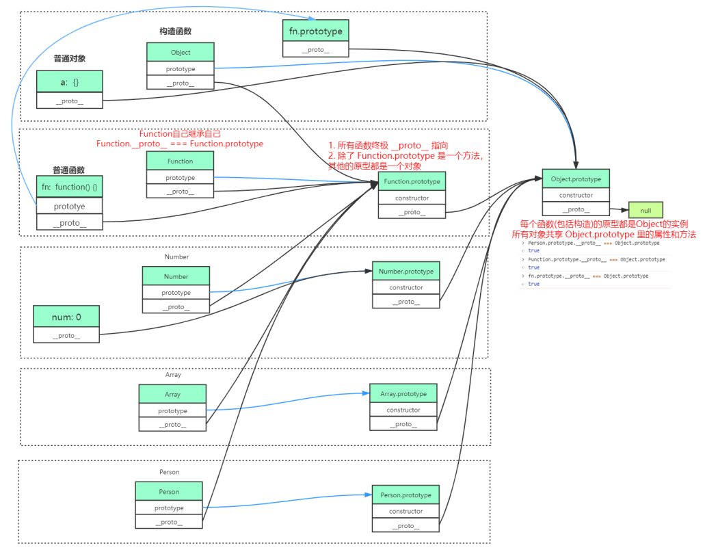
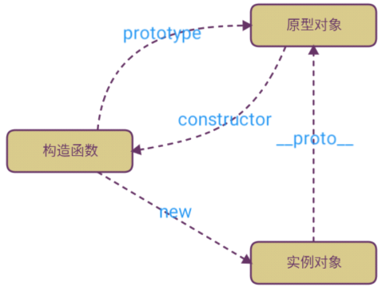
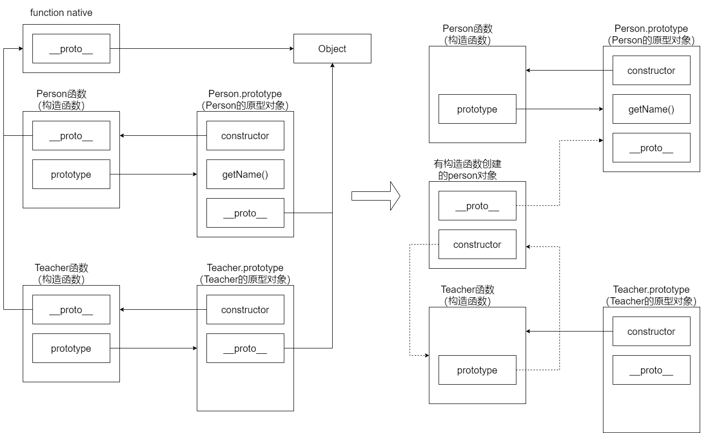
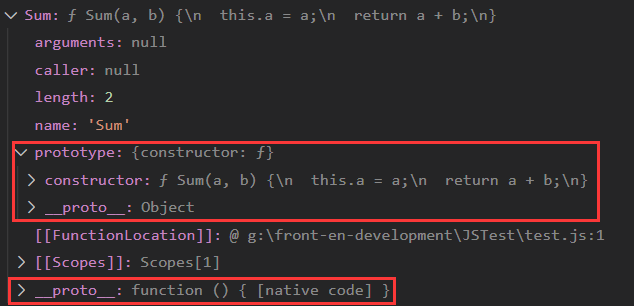
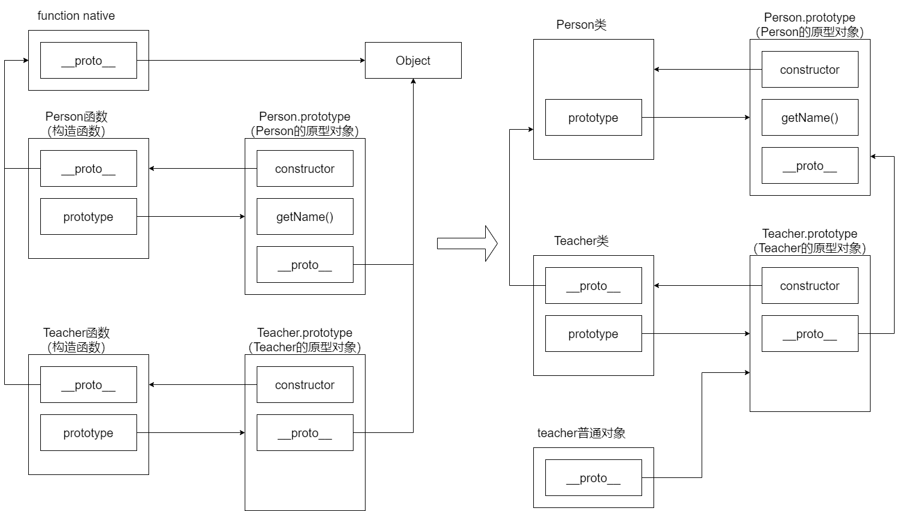

> 本节围绕上图分析介绍

# prototype 和 __proto__
虽然JavaScript中一切皆对象，但为了理解原型链系统，我们需要将JavaScript的对象分为对象和函数两大类。在此基础上，JavaScript原型链遵循以下通用规则：

1.对象有`__proto__`属性，函数有`prototype`属性；而函数又是对象，因此函数也有`__proto__`。

2.`prototype`属性一定指向这个函数的原型对象；`__proto__`属性一定指向构造出这个对象的构造函数的原型对象。**两个属性都是指向原型对象的。**

3.原型链的顶端是Object对象，它的`__proto__`属性为`null`。

4.不同原型对象的共有项只有`constructor`和`__proto__`。

5.继承是通过`__proto__`作用于原型对象实现的。


# 继承
主要分为两个部分：属性继承、方法继承
```javascript
function Person(name,age) {
  this.name = name;
  this.age = age;
}

Person.prototype.getName = function(){
  console.log(this.name);
}

function Teacher(name,age,subject) {
  /*
  实现属性继承
  通过call调用Person的构造器，给this绑定属性
  */
  Person.call(this,name,age);
  this.subject=subject;
}

/*
实现原型链上的方法继承
方法继承需要两步：
1.将父原型赋值给子原型
  Object.create(Person.prototype); 是根据Person的原型创建的对象
2.修改constructor到子构造器上，这样调用时候就是调用的Teacher构造器
这种方式显而易见无法实现多继承
*/
Teacher.prototype = Object.create(Person.prototype);
Teacher.prototype.constructor = Teacher;

let teacher = new Teacher('Lily',25,'Math');
console.log(teacher); // Teacher { name: 'Lily', age: 25, subject: 'Math' }
teacher.getName();    // Lily
```
以下是原型链方法继承的前后：


# 一些讨论
## 构造函数、原型对象、实例对象的区别
三者本质上都是对象，但是它们具有的属性不同：

|  | 构造函数 | 原型对象 | 实例对象 |
| --- | --- | --- | --- |
| prototype | 有，指向它的原型对象 | 无 | 无 |
| __proto__ | 有，指向构造出这个对象的构造函数的原型对象 |  |  |
| constructor | 无 | 有，指向构造函数 | 无 |

有prototype属性的一定是构造函数，有constructor的一定是原型对象
那么如何区分原型对象和和实例对象呢？根据上面继承的例子，当普通对象有了__proto__和constructor属性时候就可以进化成原型对象
## 普通函数和构造函数的区别
看一个例子：
```javascript
function Sum(a, b) {
  this.a = a;
  return a + b;
}

let res1 = Sum(2,4);
let res2 = new Sum(5,7);
console.log(res1);  // 6
console.log(res2);  // Sum { a: 5 }
```
这个例子很阴间，这个Sum函数中既有普通函数的影子，又有构造函数的影子，那么最终如何使用？

这时候把它当作普通函数和构造函数同时使用，得到输出结果，发现它竟然可以两用！



对于Sum函数有三种选择：

- 作为实例对象，`__proto__`指向`Function.prototype`这个原型对象
- 作为普通函数，直接执行即可
- 作为构造函数，`prototype`指向它自己的原型对象`Sum.prototype`，因此可以根据`constructor`创建一个实例对象res2

从this角度看：

- 当作为普通函数时，this指向全局global，因此是在给global添加参数a
- 当作为构造函数时，会先创建一个对象，this指向这个对象，因此是在给新对象添加参数a

## 当构造函数返回值为对象时
```javascript
function Sum(a, b) {
  this.a = a;
  return {
    x: 'Hello',
    y: 'World'
  };
}

let res1 = Sum(2, 4);
let res2 = new Sum(5, 7);
console.log(res1);
console.log(res2);
/*
{ x: 'Hello', y: 'World' }
{ x: 'Hello', y: 'World' }
*/
```
从本质上讲，**普通函数的返回值就是return的结果，构造函数的返回值就是this指向的对象。**

- 如果构造函数返回值不是对象，那么this指向就是new出来的空对象
- 如果构造函数返回值是对象，那么this指向return的对象

# hasOwnProperty
`hasOwnProperty()`函数的返回值为Boolean类型。如果对象Object具有名称为`propertyName`的属性，则返回true，否则返回false。
此方法**不会检查对象的原型链**中是否存在该属性，该属性只有是对象本身的一个成员才会返回true。

# 类和原型链
```javascript
class Person {
  constructor(name, age) {
    this.name = name;
    this.age = age;
  }
  getName() {
    console.log(this.name);
  }
}

class Teacher extends Person {
  constructor(name, age, subject) {
    super(name, age);
    this.subject = subject;
  }
}

let teacher = new Teacher('Alice',18,'English');
console.log(teacher);   // Teacher { name: 'Alice', age: 18, subject: 'English' }
teacher.getName();      // Alice  
```



