# 你问我答八股文

## HTML和CSS

### 1.居中方式，包括水平方向和垂直方向

水平居中：

- 块级元素：`margin:0 auto` + width
- 行内元素：`text-aligin:center`
- position + left/right + `transform:translateX(-50%)`
- `display:flex` + `justify-content:center`

垂直居中：

- 块级元素：padding-top/bottom
- 行内元素：设置height = line-height
- position + top/bottom + `transform:translateY(-50%)`
- `display:flex` + `align-items:center`

position的水平垂直居中：

```html
<style>
  #container {
    height: 300px;
    width: 300px;唱歌。
    position: relative;
    border: 1px solid red;
  }
  .box {
    width: 25%;
    height: 25%;
    position: absolute;
    background-color: gold;
    left: 50%;
    top: 50%;
    transform: translateX(-50%) translateY(-50%);
  }
</style>
<div id="container">
  <div class="box">哈哈</div>
</div>
```

flex的水平垂直居中：

```html
<style>
  #container {
    height: 300px;
    width: 300px;
    border: 1px solid red;
    display: flex;
    justify-content: center;
    align-items: center;
  }
  .box {
    width: 25%;
    height: 25%;
    background-color: gold;
  }
</style>
<div id="container">
  <div class="box">哈哈</div>
</div>
```

### 2.盒子模型

盒子模型由“外边距+边界+内边距+内容”组成

**两种盒子模型的区别在于对content的定义上**

标准盒子模型：content(width) = width

怪异盒子模型：content(width) = border + padding + width

### 3.CSS优先级计算

- `!importent`：无穷
- 行间样式：1000
- id：100
- class/属性/伪类：10
- 标签/伪元素：1

### 4.块级元素、行内元素、行内块级元素的区别

行内元素：

- 特点：
  - 不独占一行
  - width和height无效
  - margin仅对左右方向有效
  - padding四个方向都有效
- 默认宽度：auto
- 常见标签：`a b span img input select strong`
- `display: inline`：转换为行内元素

块级元素：

- 特点：
  - 独占一行，自上而下排列
  - width和heigth有效
  - margin和padding四个方向都有效
- 默认宽度：父节点的100%
- 常见标签：`div ul ol li dl dt dd h1 p`
- `display: block`：转换为块状元素

行内块级元素：

- 特点：
  - 不独占一行，自左而右排列
  - width和heigth有效
  - margin和padding四个方向都有效
- 默认宽度：auto
- `display: inline-block`：转换为行内块状元素

### 5.display: none, visibility: hidden, opacity: 0的区别

|         | display: none  | visibility: hidden | opacity: 0   |
| ------- | -------------- | ------------------ | ------------ |
| 是否脱离文档流 | 脱离，引起页面回流      | 不脱离                | 不脱离          |
| 是否继承    | 否              | 是                  | 是            |
| 能否添加事件  | 无占用空间元素，不能添加事件 | 元素无效，不接收JS效果       | 元素不可显示，但事件有效 |

### 6.浏览器输入URL后的执行过程（未完）

1.在地址栏输入一个URL后，UI线程询问这是一个搜索查询还是URL地址，UI线程解析出来发送到搜索引擎或者要访问到网站

2.当用户按下 Enter 键时，UI 线程启用网络调取去获取站点内容

3.读取响应过来到报文段，看是什么类型，如果是HTML则把数据传给渲染进程，如果是其他文件则把数据传给下载管理器

4.对于HTML文件，渲染进程会开始解析，分为三步：处理HTML、绘制CSS、合成与分层

- HTML
  - 解析HTML标签形成的字符串构建DOM树
  - 预加载扫描器检测到到``或`<link>`会创建标记，在浏览器进程中向网络线程发送请求
  - 遇到`<script>`时候会阻塞解析过程，加载JS代码
- CSS
  - 解析 CSS 并确定每个 DOM 节点计算后的样式
  - 主线程遍历DOM，计算样式并创建布局树
- 合成与分层
  - 为了分辨哪些元素位于哪些图层，主线程遍历布局树创建图层树
  - 确定好绘制顺序后，主线程将该信息提交给合成线程，然后合成线程会光栅化每个图层，被光栅化的部分会创建合成帧
  - 接着，合成帧通过 IPC提交给浏览器进程，在页面上显示

### 7.为什么CSS要放在头部，JS要放在body底部

在HTML中，预加载扫描器检测到到``或`<link>`会创建标记，在浏览器进程中向网络线程发送请求。遇到`<script>`时候会阻塞解析过程，加载JS代码。

CSS需要被预加载，因此放在头部；而JS可能修改DOM结构，要放在body底部。

### 8.async和defer区别

相同：async和defer都是为了解决`<script>`加载时阻塞的问题的，并行加载JS文件。

不同：

- async是在`<script>`处下载，然后立即执行
- defer是在`<script>`处下载，但等HTML文档解析完成后才会执行

### 9.设置文字大小为6px

```css
font-size: 12px;
transform: scale(0.5);
```

### 10.两列布局

#### float + margin-left/right

```html
<style>
  .two-column-layout {
    width: 400px;
    height: 400px;
  }

  .left {
    float: left;
    width: 100px;
    height: 100%;
    background-color: #f66;
  }

  .right {
    margin-left: 100px;
    height: 100%;
    background-color: #66f;
  }
</style>

<body>
  <div class="two-column-layout">
    <div class="left">Left</div>
    <div class="right">Right</div>
  </div>
</body>
```

**left是浮动且宽度确定的，right必须有**`margin-left: 100px;`**，是让浮动的区域为空**，没有这个是蓝色扩展到整个盒子，然后红色覆盖了那一部分。

#### flex

```html
<style>
  .two-column-layout {
    display: flex;
    width: 400px;
    height: 300px;
  }

  .left {
    width: 100px;
    background-color: #f66;
  }

  .right {
    flex: 1;
    background-color: #66f;
  }
</style>

<body>
  <div class="two-column-layout">
    <div class="left">Left</div>
    <div class="right">Right</div>
  </div>
</body>
```

### 11.圣杯布局

```html
<style>
  .container {
    padding: 0 100px;
    width: 200px;
    height: 300px;
  }
  .left {
    float: left;
    margin-left: -100px;
    width: 100px;
    height: 100%;
    background-color: #f66;
  }
  .center {
    height: 100%;
    background-color: #3c9;
  }
  .right {
    float: right;
    margin-right: -100px;
    width: 100px;
    height: 100%;
    background-color: #66f;
  }
</style>
<div class="container">
  <div class="left">Left</div>
  <div class="right">Right</div>
  <div class="center">Center</div>
</div>
```

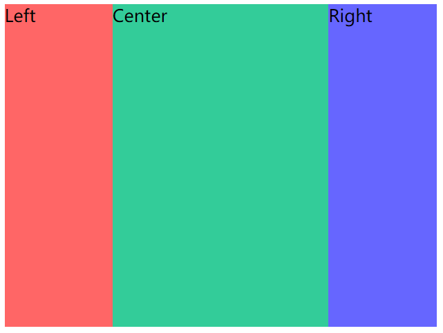

关于margin为负值，就是相对于它的参考线方向反向移动。

例如本例中Left部分`margin-left: 100px`，实际上就是相对于Center左边界向负方向移动100px

### 12.flex: 0 1 auto是含义

- flex-grow：扩展
- flex-shrink：收缩
- flex-basis：设置固定值，占据固定空间

只有当几个块固定的宽度多了或少了时候才能起作用，是对多了或少了部分进行比例分配。

### 13.响应式布局的实现有哪些？

响应式布局可以让网页同时适配不同分辨率和不同手机端。

- 使用百分比：主要有width、heigth、padding、margin，但border、font-size是不行的
- 媒体查询@media：设置不同宽度下的布局状态
- rem：根据根节点html的font-size来计算实际大小
- vw/vh：根据宽高100等分，计算实际大小
- flex：比如两列布局中让左边宽度固定，右边自适应

### 14.flex布局和grid布局的区别

flex和grid都是向两个方向展开的，但flex布局是分为主轴和交叉轴，默认是水平方向，项目是按照主轴排列的，是一维布局。而grid就是网格，水平和垂直方向是同级的，项目可以类似于坐标放置在网格的任何一个位置，是二维布局。

### 15.伪类和伪元素的区别

伪类：定义状态。比如：`:hover、:active、:focus、:visited、:link、:not、:first-child、:last-child`。

**伪元素：不存在于DOM树中的虚拟元素，可以像正常的html元素一样定义css，但无法使用JavaScript获取。**比如：`::before、::after、::first-letter、::first-line`。

伪类选择器分为两种：

（1）**静态伪类**：只能用于**超链接**的样式。如下：

- `:link` 超链接点击之前
- `:visited` 链接被访问过之后

以上两种样式，只能用于超链接。

（2）**动态伪类**：针对**所有标签**都适用的样式。如下：

- `:hover` “悬停”：鼠标放到标签上的时候
- `:active` “激活”： 鼠标点击标签，但是不松手时。
- `:focus` 是某个标签获得焦点时的样式（比如某个输入框获得焦点）

### 16.CSS中哪些属性是可以继承的呢？

- 所有元素可以继承：visibility和cursor（指针样式）
- 内联元素可以继承：font、text-transform（转大小写）、letter-spacing（间距）
- text-align
- 列表元素：list-style

### 17.用CSS绘制三角形

```css
#container {
  height: 0px;
  width: 0px;
  border-top: 50px solid transparent;
  border-left: 100px solid red;
  border-bottom: 50px solid transparent;
}
```


```css
#container {
  height: 0px;
  width: 0px;
  border-left: 100px solid red;
  border-top: 100px solid transparent;
}
```


注意**必须将width和height置为0px，然后通过border属性来绘制**，原理如下：

```css
#container {
  height: 100px;
  width: 100px;
  border-top: 50px solid red;
  border-right: 50px solid greenyellow;
  border-left: 50px solid yellow;
  border-bottom: 50px solid plum;
}
```

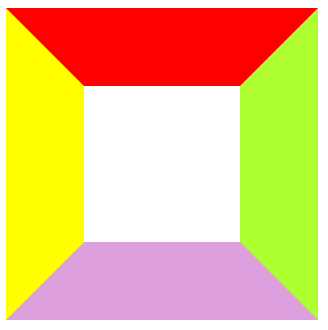

```css
/* 将height和width设置为0px后 */
#container {
  height: 0px;
  width: 0px;
  border-top: 50px solid red;
  border-right: 50px solid greenyellow;
  border-left: 50px solid yellow;
  border-bottom: 50px solid plum;
}
```


### 18.BFC

特点：

- 块级格式化上下文，是一个独立的容器，子元素不会影响到外面。
- box垂直放置，垂直方向的距离由margin决定。属于**同一个BFC的两个相邻box的margin会发生重叠。**
- 计算BFC的高度时，浮动元素也参与计算

如何创建BFC：

- float的值不是none。
- position的值不是static或者relative。
- display的值是inline-block、table-cell、flex、table-caption或者inline-flex
- overflow的值不是visible

### 19.说下边距合并和边界溢出是啥？

边距合并：当两个**垂直外边距**相遇时，他们将形成一个新的外边距，而这个新的外边距是取两个相遇外边距中较大的那个距离。

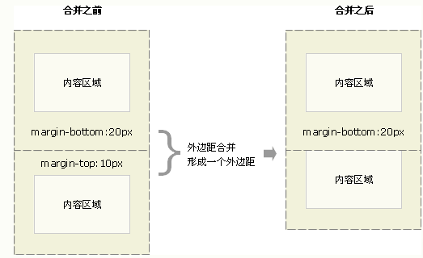

有两个地方需要注意：

- 水平方向是没有边距合并的
- 行内框、浮动框或绝对定位之间的外边距垂直方向也不会合并

解决方案：

- 只设置其中一个元素的margin值即可
- 采用浮动的方式触发BFC

---

边界溢出：指父级元素没有设置盒子属性时，子级元素的上边距会超出该父级元素。

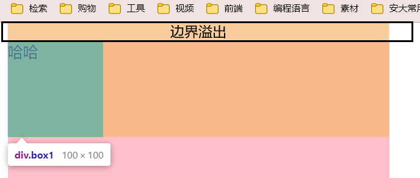

```html
<style>
  #container{
    width: 400px;
    height: 400px;
    background-color: pink;
    /* border: 1px solid red; */
  }
  .box{
    width: 100px;
    height: 100px;
    background-color: yellowgreen;
    margin-top: 20px;
  }
</style>
<div id="container">
  <div class="box">哈哈</div>

</div>
```

解决方案：

- 给父元素设置外边框（border）或者内边距（padding）
- 触发BFC

### 20.清除浮动的几种方法

清除浮动：清除由于子元素浮动带来父元素高度塌陷的影响

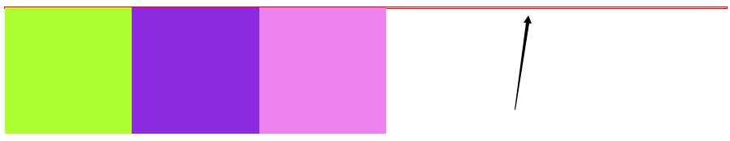

1.在浮动元素后面添加 `clear:both`的空 `div` 元素

```html
<div class="container">
  <div class="left"></div>
  <div class="right"></div>
  <div style="clear:both"></div>
</div>
```

2.给父元素添加 `overflow:hidden` 或者 `auto` 样式，触发`BFC`

```html
<style>
  #box{
    border: 1px solid red;
    /* 取出inline-block边距 */
    font-size: 0;
    overflow: hidden;
  }
</style>
<body>
  <div id="box">
    <div class="smallBox box1"></div>
    <div class="smallBox box2"></div>
    <div class="smallBox box3"></div>
  </div>
</body>
```

3.使用伪元素，也是在元素末尾添加一个点并带有 `clear: both` 属性的元素

```html
<style>
  .clearfix:after {
    content: ".";
    height: 0;
    clear: both;
    display: block;
    visibility: hidden;
  }
</style>
<div class="container clearfix">
  <div class="left"></div>
  <div class="right"></div>
</div>
```

### 21.讲讲position属性

position可以有五个值：

- static：默认值，没有定位
- absolute：绝对定位，元素会脱离文档流并覆盖重叠元素。相对于static以外的最近父元素进行定位，通过left、right、top、bottom规定位置。可通过z-index进行层次分级。
- relative：相对定位，不脱离文档流，还占用原先的位置。通过left、right、top、bottom规定位置。可通过z-index进行层次分级。
- fixed：固定定位，相对于浏览器窗口进行定位。通过left、right、top、bottom规定位置。可通过z-index进行层次分级。
- sticky：粘性定位，随滚动条而变化。在正常显示区域为相对定位，到达指定位置后会变成固定定位的效果。通过left、right、top、bottom**之一**规定位置。

### 22.z-index 在什么情况下会失效

1.父元素position为relative时，子元素的z-index失效

解决方式：将父元素postion改为absolute或static

2.该元素没有设置position属性为非statuc属性

解决方式：设置改元素的position属性为relative、absolute、fixed中的一种

3.设置z-index同时还设置了float浮动

解决方式：去除float，改为`display: inline-block`

### 23.link和@import的区别

- link是HTML方式，@import是CSS方式
- link最大限度支持并行下载，@import过多嵌套会导致串行下载
- 当解析到link时，页面会同步加载所引的 css，而@import所引用的 css会等到页面加载完才被加载

### 24.说下你对CSS预处理器的理解

CSS预处理器思想：为CSS增加一些编程语言的特性，比如变量、函数、逻辑判断等，最终编译成原生的CSS使用

常用CSS预处理器：Sass、Less

### 24.文本省略样式

```CSS
.s-ellipsis {
    /* 溢出容器部分隐藏 */
    overflow: hidden;
    /* 当内联内容溢出块容器时将溢出部分变成… */
    text-overflow: ellipsis;
    /* 指定文本超过边界时不换行 */
    white-space: nowrap;
}
```

## JS

### 1.JS中数据类型有哪些？

#### 数据类型分类

基本数据类型：null, undefined, number, bigNumber, boolean, string, symbol

引用数据类型：object, array, function

#### 存储状态

基本数据类型是在栈中开辟一块空间存储变量名和值。

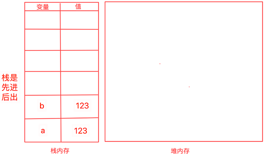

引用数据类型是首先在栈内存中开辟一块内存空间存储变量名和值，在堆内存中开辟一块空间存储引用数据类型的内容，栈内存的值指向堆内存相应的地方。

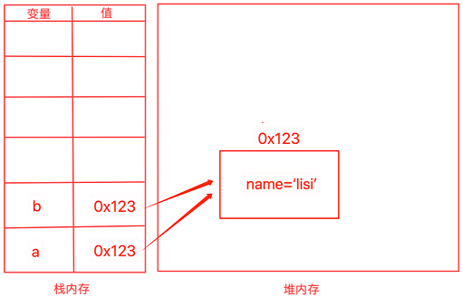

### 2.ES6特性列举

- let和const
- 类class
- 箭头函数
- 解构赋值，`const [n,m] = [1,3];`
- 延展操作符号，`function fn(...args){ }`
- Promise，async/await
- 模版字符串
- ES Module

### 3.const、let和var的区别

|                | var   | let  | const |
| -------------- | ----- | ---- | ----- |
| 作用域            | 函数作用域 | 块作用域 | 块作用域  |
| 变量提升（能否在定义前访问） | 存在    | 不存在  | 不存在   |
| 同一作用域下能否声明同名变量 | 可以    | 不行   | 不行    |

### 4.null和undefined区别

- `undefined`表示不存在这个值，变量声明过但并未赋过值。
- `null`表示对象的引用为空。主动释放一个变量引用的对象，表示一个变量不再指向任何对象地址。

### 5.instanceof和typeof区别

- typeof返回结果是该类型的字符串形式表示（number、string、undefined、boolean、function、object）
- instanceof是用来判断实例对象A是否在B的原型链上，是则返回true，否则返回false

> 除了上述两种类型检测方式，还有`Object.prototype.toString.call()`

### 6.说一下什么是闭包

闭包：内部函数总是可以访问其所在的外部函数中声明的变量和参数，即使在其外部函数被返回（寿命终结）了之后。

> 问到闭包时候应该讲下闭包的概念，同时从作用域角度分析闭包

```js
function makeCounter() {
  let count = 0;
  return function () {
    return count++;
  }
}

let counter = makeCounter();
console.log(counter());    // 0
console.log(counter());    // 1
console.log(counter());    // 2
```

作用域链图：

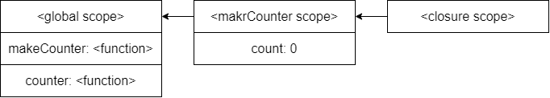

---

闭包的缺点：闭包会携带包含它的函数的作用域，因此会比其他函数占用更多的内存。

### 7.forEach、for...in、for...of的区别

for...in是索引访问，通过数组或对象的索引值进而访问对于的value

for...of是迭代访问，直接获取可迭代对象的value，不能访问普通对象、类数组对象。

### 8.讲一讲事件流

DOM事件流有三个阶段：捕获阶段、目标阶段、冒泡阶段

关于target、currentTarget、relateTarget区别如下：

- `event.target`：触发事件的元素
- `event.currentTarget(=this)`：处理事件的当前元素，受到捕获和冒泡的影响
- `event.relateTarget`：这个是移动事件中才有的，表示目标源的元素

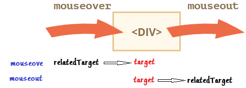

比如如下代码，点击c层的元素，打印输出：

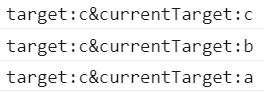

target为c说明是c层元素触发它的，而currentTarget为c、b、a说明是通过冒泡事件触发的。

```html
<div id="a">
  a
  <div id="b">
    b
    <div id="c">
      c
      <div id="d">d</div>
    </div>
  </div>
</div>

<script>
  // 这些事件都是绑定在冒泡阶段的
  document.getElementById('a').addEventListener('click', function (e) {
    console.log('target:' + e.target.id + '&currentTarget:' + e.currentTarget.id);
  });
  document.getElementById('b').addEventListener('click', function (e) {
    console.log('target:' + e.target.id + '&currentTarget:' + e.currentTarget.id);
  });
  document.getElementById('c').addEventListener('click', function (e) {
    console.log('target:' + e.target.id + '&currentTarget:' + e.currentTarget.id);
  });
  document.getElementById('d').addEventListener('click', function (e) {
    console.log('target:' + e.target.id + '&currentTarget:' + e.currentTarget.id);
  });
</script>
```

### 9.啥是事件委托/代理？

事件代理/事件委托：指不在事件的触发目标上设置监听，而是**在其父元素设置，通过冒泡机制，父元素可以监听到子元素上事件的触发。**

比如对于ul li结构，我想要点击每个li都触发相同的事件，这时候可以在ul上进行事件委托，这样即使添加新的li节点也会自动可以触发该事件。

### 10.说下什么是异步任务？有哪些实现方式？各自的优缺点是啥？

JS只支持单线程，不像Java、Go一样支持多线程，因此JS的执行就一条流水线，不能同时进行多个任务。

JS的任务分为同步和异步两种，**同步和异步的差别就在于这条流水线上各个流程的执行顺序不同**。

为啥会有异步？因为有些任务要很长事件才能返回结果，比如IO、Promise，为了不占用CPU资源，因此将这些慢任务先放到一边，即加入到**任务队列**中，等主流水线上的快任务执行完成后再来执行这些慢任务。

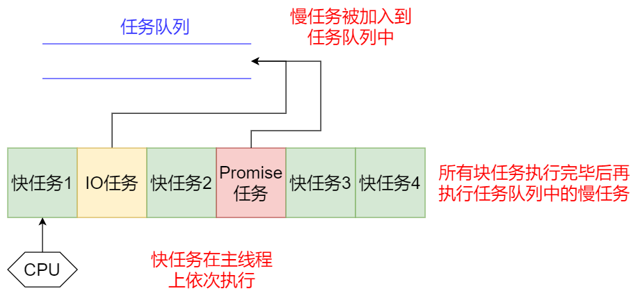

**同步任务：在主线程上排队执行的任务，只有前一个任务执行完毕，才能执行后一个任务**

**异步任务：不进入主线程、而进入"任务队列"（task queue）的任务，只有等主线程任务执行完毕，"任务队列"开始通知主线程，请求执行任务，该任务才会进入主线程执行。**

异步编程有很多实现方法：

- 回调函数
  - 缺点：多次调用会形成回调地狱，代码变得非常难理解
- 事件监听
- 发布订阅
- Promise/A+
  - 优点：Promise是对原先回调函数的改进，then将原来异步函数的嵌套关系转变为链式步骤
  - 缺点：代码冗余，原来的任务被Promise 包装了一下，不管什么操作，一眼看去都是一堆 then，原来的语义变得很不清楚。
- 生成器generator
- async/await

### 11.说下JS的事件循环机制

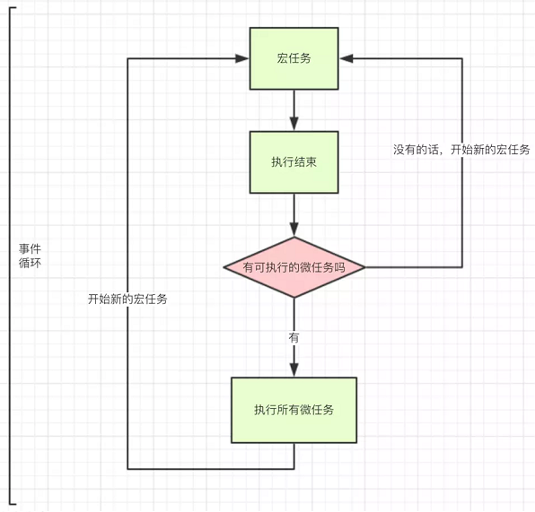

宏任务：鼠标事件、键盘事件、网络事件、HTML解析

| 事件                      | 浏览器 | Node |
| ----------------------- | --- | ---- |
| `setTimeout`            | √   | √    |
| `setInterval`           | √   | √    |
| `setImmediate`          | x   | √    |
| `requestAnimationFrame` | √   | x    |

微任务：Promises、DOM mutations

| 事件                           | 浏览器 | Node |
| ---------------------------- | --- | ---- |
| `process.nextTick`           | x   | √    |
| `MutationObserver`           | √   | x    |
| `Promise.then catch finally` | √   | √    |

> 注意：一开始是先执行微任务，所有微任务执行完毕后再执行一个宏任务

### 12.CommonJS和ES6导包方式的区别？

1. 加载方式
   1. CommonJS是**在执行时**加载整个模块的所有变量和接口，再次用到时候从缓存中取值。
   2. ES6 Module是在编译时加载，不会缓存结果，动态的去被加载模块中取值。
2. 输出值
   1. CommonJS导入的变量是对原值的拷贝。
   2. ES6 Module导入的变量是对原值的引用。
3. 模块路径
   1. CommonJS导入的模块路径可以是个表达式，因此使用的是require()方法。
   2. ES6 Module导入的模块路径**只能是字符串。**

### 13.为啥0.1+0.2不等于0.3？

JS中采用的IEEE 754的双精度标准，计算机内部存储数据的编码的时候，0.1在计算机内部根本就不是精确的0.1，而是一个有舍入误差的0.1。

> 注意：并不是每个小数都是这样存储的，准确的说是转化成二进制后不是无限小数的就是准确值。比如0.5(十进制)=0.1(二进制)

解决办法：

- `(0.1+0.2).toFixed(1)`
- `0.1+0.2-0.3<Number.EPSILON`
  - `Number.EPSILON`的二进制为`0.0000000000000000000000000000000000000000000000000001`

### 15.JS如何检测一个对象是空对象

- `JSON.stringify(obj1) == "{}"`
- `Object.keys(obj1).length === 0`
- `for…in obj`遍历，有键就返回false

### 16.hasOwnProperty

`obj.hasOwnProperty(property)`：在一个对象里面找是否有某个属性或对象， 但是**不会在它的原型中找**

### 17.JS如何判断是否为数组？

- `[] instanceof Array`
- `Array.isArray()`
- `arr.__proto__.constructor === Array`

### 18.页面加载周期

- `DOMContentLoaded`：浏览器已经**完全加载了HTML**，DOM树已经构建完毕之后会运行该事件，但是像是``和样式表等外部资源可能并没有下载完毕。所以js可以访问所有DOM节点，初始化界面。
- `load`：浏览器已经**加载了所有的资源**（图像，样式表等）。
- `beforeunload/unload`-- 当用户离开页面的时候触发 。可以询问用户是否保存了更改以及是否确定要离开页面。

对于不同的`<script>`有`DOMContentLoaded`不同的解析结果：

- 普通`<script>`：遇到`<script>`会阻塞，停止构建DOM树，立刻执行JS脚本，所以DOMContentLoaded会在JS脚本执行完毕后触发
- async：一定在load之前，但会在DOMContentLoaded的之前和之后都有可能
- defer：JS的执行会在HTML解析之后执行，执行完defer之后才会走到 DOMContentLoad

### 19.new String('a')和'a'是一样吗？

不一样，通过new操作符创建的是**引用数据类型字符串对象**，而直接定义的是**基本数据类型字符串。**

```js
const str1 = 'Hello';
const str2 = String('你好');
const str3 = new String('World');

console.log(typeof str1, typeof str2, typeof str3);
console.log(str1 instanceof String, str2 instanceof String, str3 instanceof String);
console.log(str1 instanceof Object, str2 instanceof Object, str3 instanceof Object);
/********************
string string object
false false true
false false true
********************/
```

### 20.说下Symbol的用法？

根据规范，对象的属性键只能是**字符串类型或者 Symbol 类型**。

**Symbol（符号）保证是唯一的。**即使我们创建了许多具有相同描述的 Symbol，它们的值也是不同。描述只是一个标签，不影响任何东西。

- Symbol 在 for…in 中会被跳过
- `Object.assign()`：Symbol也会被拷贝过去

```js
let user = {
  name: 'Alice'
}
let id = Symbol('idxx');
user[id] = 2;
// 访问Symbol
console.log(user[id]);
// 获取描述
console.log(id.description);
/*
2
idxx
*/
```

### 21.箭头函数和普通函数的区别

|                        | 箭头函数                                                   | 普通函数                   |
| ---------------------- | ---------------------------------------------------------- | -------------------------- |
| 是否匿名               | 匿名                                                       | 可以匿名，也可以不匿名     |
| 能否当做被用于构造函数 | 不能                                                       | 能                         |
| this指向               | 本身不创建this，声明时可以捕获其所在上下文的this供自己使用 | this指向调用这个函数的对象 |
| arguments              | 无，可以用...rest获取                                      | 有                         |

### 22.说下JavaScript中this的指向问题

1. 一般情况，**this永远指向的是最后调用它的实例对象，也就是看它执行的时候是谁调用的。**
2. 如果是构造函数，构造函数会**自动调用**一个函数apply方法，将this指向这个空对象。
   1. 如果return的是对象，那么修改this指向的到这个返回的对象
   2. 如果return的不是对象，那么this还是指向new出来的空对象
3. 箭头函数：this是在定义函数时绑定的，不是在执行过程中绑定的。

### 23.绑定事件有哪几种方式，区别是啥？

- 标签上绑定：`<button onClick="change">+1</button>`
  - 绑定多个事件时只执行第一个

- `btn.onClick = function(){ }`
  - 绑定多个事件时后面的覆盖前面的，因此是执行最后一个

- `btn.addEventListener(type, handle, true) `
  - true表示捕获，可以注册多个listener
  - 绑定多个事件时不会发生覆盖，都会执行

### 24.防抖和节流

防抖：规定时间内，只让最后一次生效，前面的不生效。

```js
// 防抖函数
const debounce = (callback, wait) => {
  let timer = -1;
  return function (...args) {
    // 清除未执行的定时器任务
    if (timer !== -1) {
      clearTimeout(timer);
    }
    timer = setTimeout(() => {
      callback.call(this, args);
    }, wait);
  }
}
```

节流：函数执行一次后，只有大于设定的执行周期后才会执行第二次。

```js
// 节流函数
const throttle = (callback, wait) => {
  let lastTime = 0;
  return function (...args) {
    // 当前时间
    const current = Number(new Date());
    // 只有超过这个wait时间才能调用callback
    if (current - lastTime > wait) {
      callback.call(this, args);
      lastTime = current;
    }
  }
}
```

### 25.引起内存泄露的原因有哪些？

1. 意外定义的全局变量。全局变量的生命周期最长，因此在页面关闭前一直不会被回收。使用不当就有可能发生内存泄露。
2. 遗忘的定时器。定时器在没有使用时忘记清除，导致定时器回调函数及其内部依赖的变量都不会被回收。因此，当不使用setInterval或setTimeout时候，要记住调用clearInterval或clearTimeout清除。
3. 闭包使用不当。闭包本身不会造成内存泄露，闭包中引用的对象生命周期会脱离当前函数的上下文，当闭包过多时容易导致环形引用，类似于死锁。

### 26.Ajax、fetch、axios区别

## 框架

### 1.Hooks基础用法专题

#### useState

```jsx
const [state, setState] = useState(() => {
  const initialState = someExpensiveComputation(props);
  return initialState;
});
```

useState内参数有两种：

- 非函数，初始state就是参数
- 函数：执行函数，将返回值赋值给初始state

setState的第二个参数：

- 该回调函数执行上下文中可以获取当前 setState 更新后的最新 state 的值

#### useEffect

```jsx
useEffect(()=>{
  callback();
  return function(){}
},dep)
```

内部的回调函数依照依赖数组的变化执行

#### useContext

**用于Context的消费者部分**，接受的对象必须是Context本身，不能是Provider或Comsumer

```jsx
const ThemeContext = React.createContext(null);
const ThemeProvider = ThemeContext.Provider;     // 提供者
const ThemeConsumer = ThemeContext.Consumer;     // 订阅消费者
```

消费者：

```jsx
// contextValue是传入Provider的值
const contextValue = React.useContext(ThemeContext);
```

#### useRef

创建锚点：

```jsx
const currentDom = React.useRef(null)
```

适用场景：

- 同一个组件内部跨级别标签，比如Input和Button
- forwardRef转发，将ref当做props传给子组件，将这个ref绑定到子组件上

#### useMemo

```jsx
const cacheSomething = useMemo(create,deps)
```

- `create`：函数，函数的返回值作为缓存值
- `deps`： 数组，存放当前 useMemo 的依赖项
- `cacheSomething`：执行 create 的返回值

#### useCallback

```jsx
const callback = useCallback(func,deps)
```

- `func`：函数，缓存的内容
- `deps`：数组，依赖项
- `callback`：函数func

```jsx
/*
点击第一个按钮会触发让number自增，点击第二个不会
*/
function Children(props) {
  return (
    <div>number = {props.callback()}</div>
  )
}

function Home() {
  const [numberA, setNumberA] = useState(0);
  const [numberB, setNumberB] = useState(0);
  const getNum = useCallback(() => { console.log('当前numberA = ' + numberA); return numberA }, [numberA]);
  return (
    <div>
      <Children callback={getNum} />
      <button onClick={() => setNumberA(numberA + 1)} >改变numberA</button>
      <button onClick={() => setNumberB(numberB + 1)} >改变numberB</button>
    </div>
  )
}
```

useEffect和useMemo：

- useMemo是dom更新前触发的，useuseEffect是dom更新后触发的

useMemo和useCallback：

- `useMemo` 计算结果是 `return` 回来的值，主要用于缓存内部回调函数计算结果的值
- `useCallback` 计算结果是函数，主要用于缓存函数

```jsx
// 下面两种写法是等价的
const getNum = useCallback(() => {
  console.log('当前numberA = ' + numberA);
  return numberA;
}, [numberA]);

const getNum = useMemo(() => {
  return ()=>{
   console.log('当前numberA = ' + numberA);
   return numberA;
  }
}, [numberA]);
```

#### useDebugValue

#### useImperativeHandle

### 2.Hooks区别专题

#### useEffect和useLayoutEffect

useEffect执行顺序：组件更新挂载完成--->浏览器DOM绘制完成--->执行useEffect回调

useLayoutEffect执行顺序：组件更新挂载完成--->执行useEffect回调--->浏览器DOM绘制完成

根据执行顺序，可以知道useEffect回调执行时候不会阻塞浏览器绘制，但useLayoutEffect回调会在DOM更新后立刻执行，这时候DOM还没渲染，阻塞了浏览器绘制。

适用场景：大部分情况是useEffect，但如果useEffect里面操作需要处理DOM并改变页面样式，就用useLayoutEffect，否则会出现闪屏问题。

```jsx
const Animate = () => {
    const REl = useRef(null);
    // 这里要使用useLayoutEffect以避免闪屏问题
    useLayoutEffect(() => {
        // 下面这段代码的意思是当组件加载完成后,在0秒的时间内,将方块的横坐标位置移到600px的位置
        TweenMax.to(REl.current, 0, {x: 600})
    }, []);
    return (
        <div className='animate'>
            <div ref={REl} className="square">square</div>
        </div>
    );
};
```

#### useMemo和useCallback

共同点：

1. 当依赖数据发生变化时候，才会调用传入的回调函数去重新计算结果，起到缓存作用

不同点：

1. useMemo 缓存的结果是回调函数中return回来的值。主要用于缓存计算结果的值，应用场景如需要计算的状态。
2. useCallback 缓存的结果是函数。函数式组件任何一个state发生变化都会触发整个组件更新，而一些函数是没必要更新的，此时应该缓存起来，提高性能。

#### useEffect和useMemo

共同点：

1. 都是依赖某个值，然后值更新，执行回调函数

不同点：

1. useEffect的函数是在浏览器DOM绘制完成后才执行回调的；useMemo的函数会在渲染期间执行
   1. 修改了其他变量A，然后react更改了DOM，触发相关函数间接修改另一个变量B，而useEffect依赖于B，这时候会执行useEffect内的回调函数。
   2. 而如果是useMemo，渲染期已经执行了，即使更改了DOM，也不会触发回调函数

### 3.说下react执行原理

从react16后，架构主要分为三层：

1. Scheduler（调度器）

调度器的作用是控制任务的优先级，将任务放入到任务调度循环中，如果有高优先级任务则先交给Reconciler。

2. Reconciler（协调器）

协调器的作用是找出变化的组件，并为变化的虚拟DOM打上标记，比如Update、Deletion等，然后将虚拟DOM交给Renderer。

该阶段会通过`performUnitOfWork`函数处理Fiber树节点，Fiber树类似于B*树，以递归形式的深度遍历，beginWork向下调和，completeWork向上归并。

3. Renderer（渲染器）

 将Reconciler阶段维护的副作用链表执行，最终将变化的组件渲染到页面上。

### 4.Fiber架构

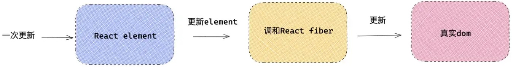

每触发一次更新，JSX通过babel编译为`React.createElement`，然后得到`react element`对象，每个`react element`对象都有与之对应的Fiber类型（虚拟DOM），最终Fiber协调完成后渲染为真实DOM。

Fiber的结构主要分为三部分：

- Fiber Reconciler：各个Fiber节点直接**通过指针构成Fiber树**，指针包括child、sibling、return
- 静态数据结构：每个Fiber节点对应一个`React element`，保存该组件类型、对应DOM节点相关信息
- 动态工作单元：每个Fiber节点保存本次更新该组件改变的状态、要执行的工作。

Fiber树的更新是使用了**双缓存机制**，在内存中构建新的Fiber树并直接替换。react至多存在两棵Fiber树，current Fiber树和workInProgress Fiber树。

该流程主要用在组件挂载mount和组件更新update流程中：

1. mount
   1. 执行ReactDOM.render会创建fiberRoot（整个应用根节点）和rootFiber（单个Fiber树根节点）
   2. render阶段：根据组件返回的JSX结构创建Fiber节点，并构成Fiber树。【构建workInProgress Fiber树时会通过Diff算法尝试复用current Fiber树已有的Fiber节点。】
   3. commit阶段：渲染workInProgress Fiber树（构建树），指向两棵树的指针对换。
2. update
   1. 触发事件，开启新的render阶段，创建workInProgress Fiber树。
   2. 进入commit阶段，和mount操作相同。

### 5.hooks原理

#### 声明阶段

1. 预处理工作
   1. `performUnitOfWork--->beginWork--->updateFunctionComponent--->renderWithHooks`，建立Fiber和Hooks的关联
   2. `renderWithHooks`中主要做三件事：
      1. 调用function前：设置全局变量，标记渲染优先级和当前Fiber，清除当前Fiber的遗留状态
      2. 调用function时：构建Hooks链表，最后生成子级react element对象
      3. 调用function后：重置全局变量，返回children
2. 执行`renderWithHooks`，调用function，通过`mountWorkInProgressHook`创建hook
3. 创建的hook以链表结构保存，挂载到`fiber.memoizedState`上
4. Fiber树构造阶段（mount、update），以双缓存技术为基础，将`current.memoizedState`按照顺序克隆到了`workInProgress.memoizedState`中。hooks经过克隆，内部属性没有编程，所以其状态并不会丢失。

#### 调用阶段——状态hook

1. 创建Update对象，update.lane代表优先级
2. 将Update对象添加到hook.queue.pending环形链表，pending指针执行链表最后一个元素
3. 发起调度更新，进入Reconciler（协调器）
   1. 在Fiber树构造过程中，再次调用function，最终调用updateReducer函数
   2. 将 `hook.queue.pending` 拼接到 `current.baseQueue`
   3. 如果update优先级不够，加入到baseQueue中，等待下次render；如果够就状态合并。最终更新属性。

#### 调用阶段——副作用hook（未完）

### 6.setState是同步的还是异步的

有时表现出异步，有时表现出同步。

1. setState只在合成事件或钩子函数中是异步的，在原生事件和setTimeout中都是同步的
2. setState的异步并不是说内部由异步代码实现，其实本身执行的过程和代码都是同步的，只是**合成事件和钩子函数的调用顺序在更新之前，导致在合成事件和钩子函数中没法立马拿到更新后的值，形成了所谓的异步。**
3. setState的批量更新策略也是建立在异步上的，在原生事件和setTimeout中不会批量更新，而合成事件或钩子函数由于批量更新策略，取最后一次的执行。

### 7.key的作用是什么？

> `Keys`是 `React` 用于追踪哪些列表中元素被修改、被添加或者被移除的辅助标识。

- 在开发过程中，我们需要保证某个元素的 `key` 在其同级元素中具有唯一性。
- key是服务于diff算法的，diff算法借助元素的 `Key` 值来判断该元素是新创建的还是被移动而来的元素，从而减少不必要的元素重渲染。

### 8.虚拟DOM和diff算法

h函数：创建一个虚拟节点

patch函数：将虚拟节点上树

```js
// 创建虚拟节点
var myVnode1 = h(
  "a",
  { props: { href: "https://www.baidu.com", target: "_blank" } },
  "YK菌"
);

// 让虚拟节点上树
let container = document.getElementById("container");
patch(container, myVnode1);
```

diff算法：

**只是同一个虚拟节点【选择器相同且key相同】，才进行精细化比较**，否则就是暴力删除旧的、插入新的。

**只进行同层比较，不会进行跨层比较。**即使是同一片 虚拟节点，但是跨层了，diff就是暴力删除旧的，然后插入新的。

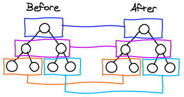

- 预处理【判断对象差异】：

  - patch函数传入值不是虚拟DOM，就包装虚拟DOM
  - 新节点和旧节点不是同一个节点【看标签和key是否相同】，就删除旧的，添加新的
  - 如果没有子节点，就比较新旧节点新text属性，相同就啥都不做，不同的话就修改新节点text属性

- 精细化比较【有子节点，diff算法的核心，四种命中查找】：

  - 循环比较

    ```js
    旧前-新前：oldStart和newStart后移
    旧后-新后：oldEnd和newEnd前移
    旧前-新后：将newEnd指向节点移动到oldEnd后
    旧后-新前：将newStart指向节点移动到oldStart前
    都没命中：在旧的中查找newStart指向的同一节点，找到了就插入到oldStart前
    ```

  - 循环结束

    - newVnode多余节点加入到oldVnode的oldStart前或oldEnd后
    - oldVnode多余节点删除

### 9.类组件和函数组件的区别

在协调阶段，react通过fiber tag的值区分是函数组件还是类组件

区别：

1. 类组件是通过构造函数来获取组件实例的；而函数组件是通过执行函数return返回的react element对象。
2. 类组件会实例化一个对象，因此会拥有独立的局部状态；而函数组件不用实例化，只是被调用，因此只能依靠hooks对象间接实现局部状态

### 10.react组件通信

- 父→子：props，赋值修改
- 子→父：子组件调用父组件传入的回调函数，告知父组件修改值
- 兄弟：使用共同的父组件来管理状态和事件函数
- 跨层通信：
  - 层层组件传递props
  - 使用Context API，顶层组件创建生产者，子组件创建消费者
- 任意组件：redux

### 11.为何要在项目中引入redux

react在工作中，是自顶向下的单向数据流。正常情况下两个组件相互通信是通过提升state到公共父组件，然后通过props派发实现的。子组件改变父组件state的办法只能是通过onClick触发父组件传入的回调函数，因此形成一种模式：**数据总是单向从顶层向下分发的，但是只有子组件回调在概念上可以回到state顶层影响数据。**

为了更好的管理state，就需要一个库专门管理分发，因此可以得到：

- 子组件函数调用→action
- 父级方法目录→reducer
- 总状态库state→store

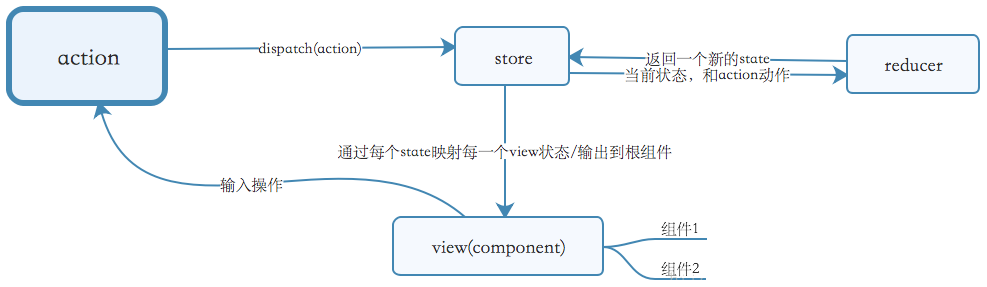

换句话说，**Redux中的store是所有组件的顶层state**。

### 12.BrowserHistory模式和HashHistory模式区别？（改）

BrowserHistory：采用HTML5提供的pushState()方法对浏览器历史记录栈进行修改，提供了`popstate`事件用于监听。

HashHistory：URL上#及后面部分成为Hash，用`window.location.hash`读取。`hash`虽然在`URL`中，但不被包括在`HTTP`请求中；用来指导浏览器动作，对服务端安全无用，`hash`不会重加载页面。提供`hashchange`事件用于监听。

### 13.react事件和浏览器自带的事件有啥区别呢？

浏览器事件是经典的捕获阶段、目标节点、冒泡阶段

而react为了在各个浏览器上通用，使用了合成事件机制，保存了react事件和原生事件的映射关系，比如表单内容修改事件会映射到原生浏览器中可能会触发blur、change、focus、keydown等等。

react事件触发分为三步：

- 批量更新，形成fiber结构，在各自的fiber注册事件函数
- 合成事件源
- 形成事件任务队列，最终按照顺序执行
  - 捕获事件，放入队头
  - 冒泡事件，放入队尾

### 14.受控组件和非受控组件的区别

!> 区别的关键点在于是否受到状态的控制

受控组件：input、select、textarea的值改变要根据用户输入跟小，因此受控组件必须要有value，并通过onChange拿到新值进而重新渲染视图。

非受控组件：获取数据就相当于操作DOM，一般没有value。比如在输入框输入内容后，点击提交按钮，我们可以通过`this.inputRef`成功拿到`input`的`DOM`属性信息，包括用户输入的值，这样我们就不需要像受控组件一样，单独的为每个表单元素维护一个状态。

```jsx
class NameForm extends Component {
  constructor(props) {
    super(props);
    this.inputRef = React.createRef();
  }
  handleSubmit = (e) => {
    console.log('我们可以获得input内的值为', this.inputRef.current.value);
    e.preventDefault();
  }
  render() {
    return (
      <form onSubmit={e => this.handleSubmit(e)}>
        <input defaultValue="lindaidai" ref={this.inputRef} />
        <input type="submit" value="提交" />
      </form>
    )
  }
}
```

### 15.React17生命周期

React生命周期分为三步：挂载、更新、卸载

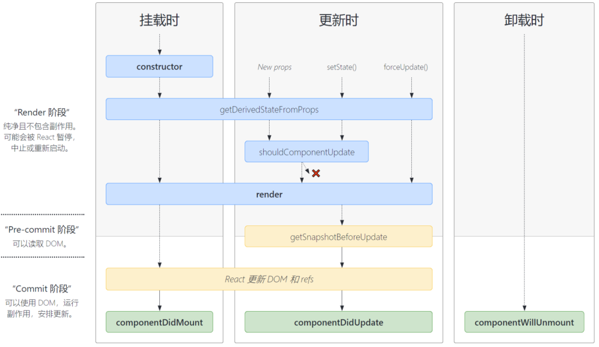

+ 挂载

  - 在constructor()中会初始化state和一些事件的处理，比如绑定this、防抖、节流
  - 在render()中会创建虚拟DOM，进行diff算法，更新DOM树
  - 渲染阶段结束后，到了提交阶段，可以调用componentDidMount()做一些处理DOM的操作

+ 更新
  - shouldComponentUpdate：常常用来做性能优化，接收到新的state和props就调用，return true就更新DOM，否则不更新
  - render()
  - getSnapshotBeforeUpdate：保存更新前的信息
  - 渲染阶段结束后，到了提交阶段，可以调用componentDidUpdate()做一些处理DOM的操作

+ 卸载
  - 调用componentWillUnmount()做一些处理DOM的操作

### 16.hooks为啥不能写在选择语句中？

### 16.前端路由原理

### 17.dva和redux相比好处在哪？

#### dva.js


#### redux

#### 对比

## 工程化

### 1.项目中为啥使用webpack？

前端的项目是写成一个个模块的，但模块之间是有依赖关系的。比如有n个JS文件，浏览器需要发送n次请求来获取，然后依次执行其中的代码，如果其中有一个文件因为网络问题而延误了时间，那么整个页面的显示也会被延误。webpack打包不是在开发过程中的，是在开发后完成的这个合并的过程，通过webpack打包将相互依赖的模块合成为一个文件，减少了请求次数，让我们的页面加载和显示更快。

### 2.webpack的打包原理

- 初始化参数：解析webpack配置参数，合并shell传入和webpack.config.js文件配置的参数，形成结果
- 开始编译：通过上一步的结果complier对象注册所有配置的插件，执行对象的run方法开始执行编译
- 确定入口：从配置的entry入口开始解析文件构建AST语法树，找依赖模块，递归该操作
- 编译模块：根据loader配置调用所有配置loader对文件进行转换，找依赖模块，递归该操作
- 完成模块编译并输出：递归结束后根据各个模块间的依赖关系配置生成代码块chunk
- 输出完成：输出chunk到文件系统

### 3.webpack中loader和plugin的区别

loader：加载器

- webpack本身只能打包Common.js规范的JS文件，对于CSS、图片、TS文件就必须引入第三方loader进行打包

plugin：插件

- plugin是对webpack功能的扩展，不仅仅局限于打包和资源加载上。在 Webpack 运行的生命周期中会广播出许多事件，Plugin 可以监听这些事件，在合适的时机通过 Webpack 提供的 API 改变输出结果。

### 4.webpack的优化策略

- HMR：一个模块发生变化，只会重新打包构建这一个模块（而不是打包所有模块） ，极大提升构建速度。只需要在 devServer 中设置 hot 为 true，就会自动开启HMR功能。
- Tree Shaking：在生产环境下，将代码中永远不会走到的片段删除掉。通过 package.json 的 `"sideEffects"` 属性，来实现这种方式。
- 懒加载：当文件需要使用时才加载（需要代码分割）。但是如果资源较大，加载时间就会较长，有延迟。
- CDN加速：在构建过程中，将引用的静态资源路径修改为CDN上对应的路径。可以配置output中的publicPath配置资源引入公共路径前缀。

### 5.webpack中的chunk、bundle、module区别

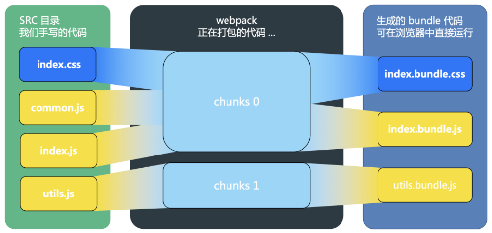

> 上图中index.css和common.js被引入到index.js

modules：打包前一个个单独的文件，可以相互导入导出

chunks：根据项目入口文件而构建依赖关系图，每个依赖关系图打包后的代码就是一个chunk

bundles：根据打包后的chunk写入到不同的文件，比如index.bundle.css、index.bundle.js

### 6.umi dev和umi build的区别

dev：开发环境，运行需要node和npm，相当于在本地node中运行了一个前端服务器

build：构建工具，将前端的静态资源及JS代码进行打包并压缩，打包成新的static资源文件夹，放在Web容器（Tomcat/Ngnix）中即可运行。

## 浏览器和网络

### 1.cookie、localStorage、sessionStorage

| 特性     | cookie                    | localStorage | sessionStorage | indexDB      |
| ------ | ------------------------- | ------------ | -------------- | ------------ |
| 数据生命周期 | 一般由服务器生成，可以设置过期时间         | 除非被清理，否则一直存在 | 页面关闭就清理        | 除非被清理，否则一直存在 |
| 数据存储大小 | 4K                        | 5M           | 5M             | 无限           |
| 与服务端通信 | 每次都会携带在 header 中，对于请求性能影响 | 不参与          | 不参与            | 不参与          |
| 作用域    | 同源，窗口间可共享                 | 同源，窗口间可共享    | 同源，窗口间不可共享     |              |

cookie的缺点：

- cookie存储空间太小
- 同一个域名下的所有请求，都会携带 Cookie，当前端业务越来越复杂，这种方式会造成大量的性能浪费

> 存储cookie：通过响应头里的 `Set-Cookie` 指定要存储的 `Cookie` 值
>
> - expires：过期时间，单位是<天>
> - 

应用场景：

- localStorage：长期存储的本地数据
  - 电商网站的`Base64` 格式的图片字符串
  - 不经常更新的 CSS、JS 等静态资源
- sessionStorage：临时存放的会话数据
  - 存储上一次访问的 `URL` 地址，切换 `URL` 时，它随之更新，当你关闭页面时，自动就清除了

### 2.JWT

#### JWT格式

JWT由三部分构成：

1.头部，header

- 声明类型，这里是jwt
- 声明加密的算法 通常直接使用 HMAC SHA256

2.载荷，payload

载荷就是存放有效信息的地方

3.签证，signature

jwt的第三部分是一个签证信息，这个签证信息由三部分组成：

- header (base64后的)
- payload (base64后的)
- secret

使用方式如下：

每一次请求都要把token放在请求header中，如果服务器需要设置为接受来自跨域的请求，用`Access-Control-Allow-Origin: *`。

一般是在请求头里加入Authorization，并加上Bearer标注：

```js
fetch('api/user/1', {
  headers: {
    'Authorization': 'Bearer ' + token
  }
})
```

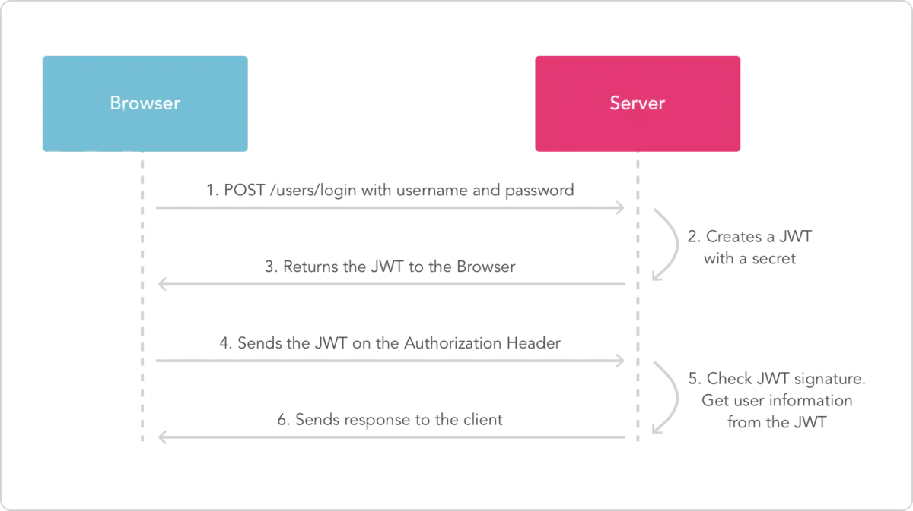

#### 如何将token放到header

#### token过期时间设置及处理

### 4.前端安全

#### XSS

XSS（Cross-Site Scripting）全称跨站脚本攻击

- 反射型：发送请求时，`XSS`代码出现在`url`中，作为输入提交到服务器端，服务器端解析后响应，`XSS`代码随响应内容一起传回给浏览器，最后浏览器解析执行`XSS`代码。
- 存储型：大体和反射型类似，不过存储型提交的代码会存储在服务器端，只要访问服务端该数据就会触发，危害极大。

防范：

- 编码：将传过来的数据进行转为HTML实体编码
- 过滤：
  - 移除相关事件属性，如onerror、onclick
  - 移除一些输入的script、style、iframe节点
- 校正：使用`DOMParser`转换，校正不配对的`DOM`标签

---

#### CSRF

CSRF（Cross-Site Request Forgeries）全称跨站请求伪造


这里有个关键点，B网站是如何获取A网站的cookie的，不是有跨域机制吗？

比如A网站有GET请求转账操作：`http://www.mybank.com/Transfer.php?toBankId=11&money=1000`

现在B网站有段代码：``

相当于B网站通过A网站发送请求，携带A网站的cookie。并不是说直接B网站获取A网站的cookie然后B网站发送请求。

防范：

- 使用Origin或Referer限定请求源，**只接受本站的请求，服务器才做响应**；如果不是，就拦截。
- 使用token方式并绑定用户，添加过期时间，限定访问源。如果token不合法就拒绝访问。

#### 对比

区别：

- CSRF需要登录被攻击网站获取cookie，而XSS不用
- XSS是注入JS代码后执行篡改网站内容，CSRF是利用网站本身的漏洞请求它的API

#### 中间人攻击

### 5.TCP

#### 特性

TCP 是一个**可靠的**（reliable）、**面向连接的**（connection-oriented）、**基于字节流**（byte-stream）、**全双工**（full-duplex）的协议。

1.面向连接

面向连接的协议要求正式发送数据之前需要**通过「握手」建立一个逻辑连接**，结束通信时也是**通过有序的四次挥手来断开连接。**

2.可靠传输

- 对每个包提供校验和
- 包的序列号解决了接收数据的乱序、重复问题
- 超时重传
- 流量控制、拥塞控制

3.面向字节流

TCP 是一种字节流（byte-stream）协议，流的含义是没有固定的报文边界。

假设你调用 2 次 write 函数往 socket 里依次写 500 字节、800 字节。write 函数只是把字节拷贝到内核缓冲区，最终会以多少条报文发送出去是不确定的，如下图所示

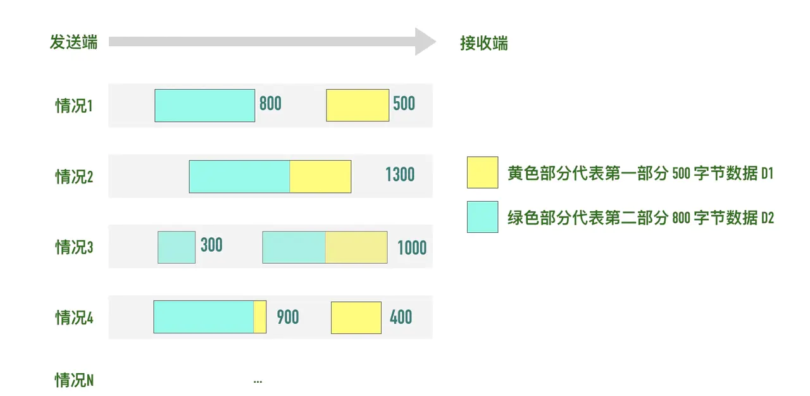

4.全双工通信

允许数据**在两个方向上同时传输**，它在能力上相当于两个单工通信方式的结合。

#### 超时重传机制

#### 滑动窗口

#### 对比UDP

### 6.三次握手

#### ★三次握手过程

三次握手的最重要的是交换彼此的 ISN（初始序列号）

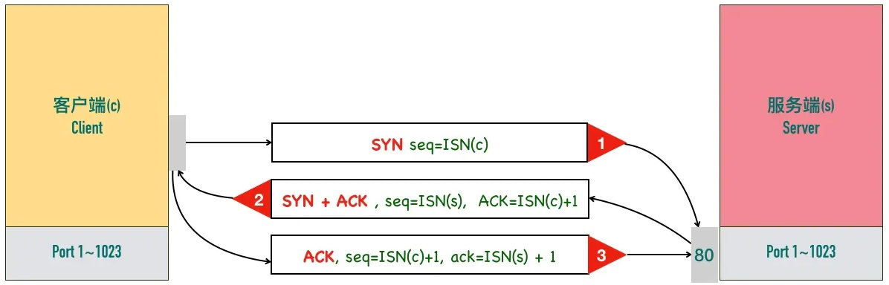

三次握手过程，面试标答：

1. 第一次握手：客户端给服务端发一个 SYN 报文，并指明客户端的初始化序列号 ISN。此时客户端处于 SYN_Send 状态。
2. 第二次握手：服务器收到客户端的 SYN 报文之后，会以自己的 SYN 报文作为应答，并且也是指定了自己的初始化序列号 ISN。同时会把客户端的 ISN + 1 作为 ACK 的值，表示自己已经收到了客户端的 SYN，此时服务器处于 SYN_REVD 的状态。
3. 第三次握手：客户端收到 SYN 报文之后，会发送一个 ACK 报文，当然，也是一样把服务器的 ISN + 1 作为 ACK 的值，表示已经收到了服务端的 SYN 报文，此时客户端处于 ESTABLISHED 状态（建立连接状态）。
4. 服务器收到 ACK 报文之后，也处于 ESTABLISHED 状态，此时，双方以建立起了链接。

#### 三次握手作用

1. 确认双方的接受能力、发送能力是否正常。
2. 指定自己的初始化序列号，为后面的可靠传送做准备。
3. 如果是 https 协议的话，三次握手这个过程，还会进行数字证书的验证以及加密密钥的生成到。

#### 为什么不是两次吗？

第一次握手：客户端发送网络包，服务端收到了。这样服务端就能得出结论：客户端的发送能力、服务端的接收能力是正常的。

第二次握手：服务端发包，客户端收到了。这样客户端就能得出结论：服务端的接收、发送能力，客户端的接收、发送能力是正常的。不过此时服务器并不能确认客户端的接收能力是否正常。

第三次握手：客户端发包，服务端收到了。这样服务端就能得出结论：客户端的接收、发送能力正常，服务器自己的发送、接收能力也正常。

因此，需要三次握手才能确认双方的接收与发送能力是否正常。

如果是两次握手会发生如下情况：

如客户端发出连接请求，但因连接请求报文丢失而未收到确认，于是客户端再重传一次连接请求。后来收到了确认，建立了连接。数据传输完毕后，就释放了连接，客户端共发出了两个连接请求报文段，其中第一个丢失，第二个到达了服务端，但是第一个丢失的报文段只是在**某些网络结点长时间滞留了，延误到连接释放以后的某个时间才到达服务端**，此时服务端误认为客户端又发出一次新的连接请求，于是就向客户端发出确认报文段，同意建立连接，不采用三次握手，只要服务端发出确认，就建立新的连接了，此时客户端忽略服务端发来的确认，也不发送数据，则服务端一致等待客户端发送数据，浪费资源。

#### 三次握手过程中可以携带数据吗？

第三次握手的时候，是可以携带数据的。但是，第一次、第二次握手不可以携带数据。

假如第一次握手可以携带数据的话，如果有人要恶意攻击服务器，那他每次都在第一次握手中的 SYN 报文中放入大量的数据，因为攻击者根本就不理服务器的接收、发送能力是否正常，然后疯狂着重复发 SYN 报文的话，这会让服务器花费很多时间、内存空间来接收这些报文。也就是说，第一次握手可以放数据的话，其中一个简单的原因就是会让服务器更加容易受到攻击了。

而对于第三次的话，此时客户端已经处于 established 状态，也就是说，对于客户端来说，他已经建立起连接了，并且也已经知道服务器的接收、发送能力是正常的了，所以能携带数据页没啥毛病。

### 7.四次挥手

#### ★四次挥手过程

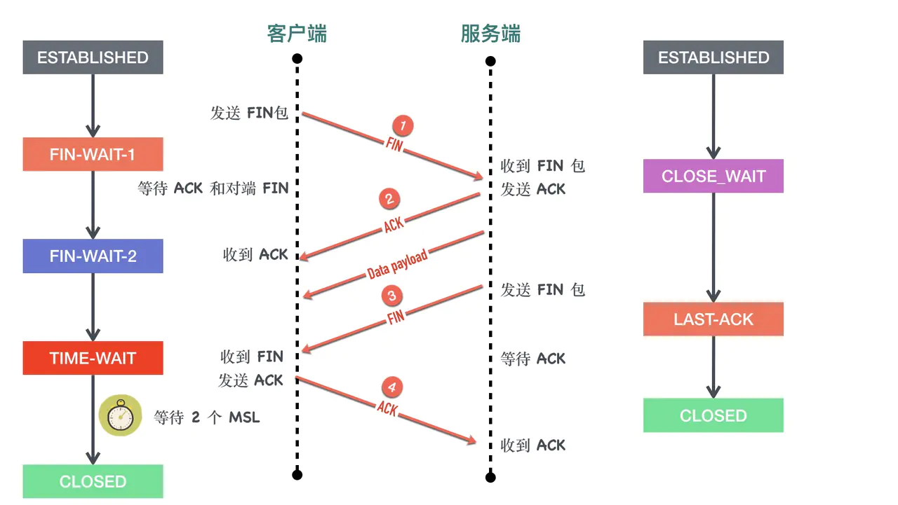

刚开始双方都处于 ESTABLISHED 状态，假如是客户端先发起关闭请求，则：

1. 第一次挥手：客户端发送一个 FIN 报文，报文中会指定一个序列号。此时客户端处于FIN_WAIT1状态。
2. 第二次握手：服务端收到 FIN 之后，会发送 ACK 报文，且把客户端的序列号值 + 1 作为 ACK 报文的序列号值，表明已经收到客户端的报文了，此时服务端处于 CLOSE_WAIT状态。
3. 第三次挥手：如果服务端也想断开连接了，和客户端的第一次挥手一样，发给 FIN 报文，且指定一个序列号。此时服务端处于 LAST_ACK 的状态。

4. 第四次挥手：客户端收到 FIN 之后，一样发送一个 ACK 报文作为应答，且把服务端的序列号值 + 1 作为自己 ACK 报文的序列号值，此时客户端处于 TIME_WAIT 状态。需要过一阵子以确保服务端收到自己的 ACK 报文之后才会进入 CLOSED 状态。

5. 服务端收到 ACK 报文之后，就处于关闭连接了，处于 CLOSED 状态。

```
LISTEN - 侦听来自远方TCP端口的连接请求； 
SYN-SENT - 在发送连接请求后等待匹配的连接请求； 
SYN-RECEIVED - 在收到和发送一个连接请求后等待对连接请求的确认； 
ESTABLISHED - 代表一个打开的连接，数据可以传送给用户； 
FIN-WAIT-1 - 等待远程TCP的连接中断请求，或先前的连接中断请求的确认；
FIN-WAIT-2 - 从远程TCP等待连接中断请求；
CLOSE-WAIT - 等待从本地用户发来的连接中断请求； 
CLOSING - 等待远程TCP对连接中断的确认； 
LAST-ACK - 等待原来发向远程TCP的连接中断请求的确认； 
TIME-WAIT - 等待足够的时间以确保远程TCP接收到连接中断请求的确认； 
CLOSED - 没有任何连接状态；
```

#### 为什么客户端发送 ACK 之后不直接关闭？

要确保服务器是否已经收到了我们的 ACK 报文，如果没有收到的话，服务器会重新发 FIN 报文给客户端，客户端再次收到 ACK 报文之后，就知道之前的 ACK 报文丢失了，然后再次发送 ACK 报文。

### 8.GET和POST的区别

大部分情况只用到GET和POST，区别如下：

- 参数和安全性：GET一般放在URL上传递参数，由于GET的参数是直接暴露在URL上，相对不安全；POST放在请求体里，更适合传递敏感信息。
- 缓存：GET请求会被浏览器主动缓存下来，留下历史记录；POST不会。
- 幂等：GET请求是幂等的，而POST不是。当浏览器回退时，GET不会重新发送请求，但是POST会重新请求。
- 编码：GET请求只能进行URL编码，只能接收ASCII字符；POST没有这个限制
- 数据量：GET请求的URL编码是有大小限制的，一般为2kb；POST没有这个限制
- TCP：GET请求会发送HTTP Header和data给服务端，服务端返回200，请求成功；POST请求会先发送HTTP Header，告述服务端一会儿有数据过来，服务端返回100，告诉客户端我已经准备接收数据，post在发送一个data给服务端，服务端返回200，请求成功。【当然**火狐**浏览器除外，它的 POST 请求只发一个 TCP 包。】

> 幂等：同样的请求被执行一次与连续执行多次的效果是一样的，服务器的状态也是一样的

### 9.状态码

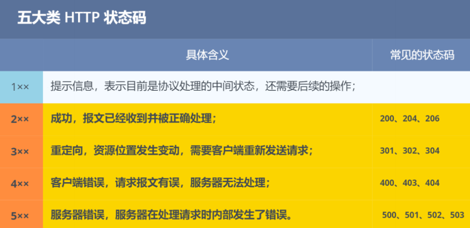

- `1XX`：信息状态码
  - `100 Continue` 继续，一般在发送`post`请求时，已发送了`http header`之后服务端将返回此信息，表示确认，之后发送具体参数信息

- `2XX`：成功状态码
  - `200 OK` 正常返回信息
  - `201 Created` 请求成功并且服务器创建了新的资源
  - `202 Accepted` 服务器已接受请求，但尚未处理

- `3XX`：重定向
  - `301 Moved Permanently` 请求的网页已永久移动到新位置。
  - `302 Found` 临时性重定向。
  - `303 See Other` 临时性重定向，且总是使用 `GET` 请求新的 `URI`。
  - `304 Not Modified` 自从上次请求后，请求的网页未修改过。

- `4XX`：客户端错误
  - `400 Bad Request` 服务器无法理解请求的格式，客户端不应当尝试再次使用相同的内容发起请求。
  - `401 Unauthorized` 请求未授权。
  - `403 Forbidden` 禁止访问。
  - `404 Not Found` 找不到如何与 `URI` 相匹配的资源。

- `5XX:`服务器错误
  - `500 Internal Server Error` 最常见的服务器端错误。
  - `503 Service Unavailable` 服务器端暂时无法处理请求（可能是过载或维护）。

### 10.浏览器缓存机制

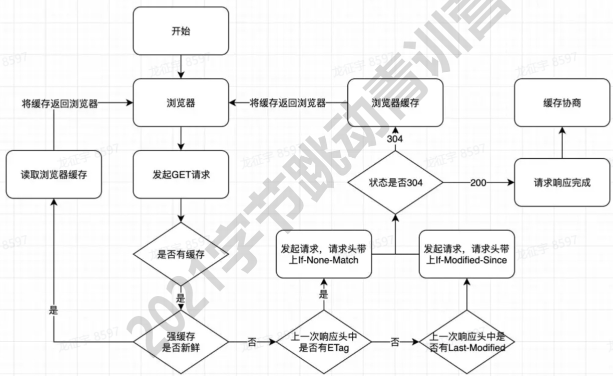

强缓存：不会向服务器发送请求，直接从浏览器缓存中读取资源

协商缓存：**协商缓存就是强制缓存失效后，浏览器携带缓存标识向服务器发起请求，由服务器根据缓存标识决定是否使用缓存的过程。**向服务器发送请求，服务器会根据请求的参数来判断是否命中协商缓存，命中返回304，并带上新响应头通知浏览器从缓存中读取资源；

共同点：**都是从客户端缓存中读取资源**

区别：强缓存不会发请求，协商缓存会发请求

---

关于强缓存的位置：

实际上在磁盘和内存中都有缓存，比如访问百度，会返回200，现在关闭这个标签再次打开百度，会加载磁盘缓存中内容，如果这时候刷新，才会加载内存缓存。

内存缓存读取快，但时效性低，进程关闭就会清空，磁盘缓存是写入到硬盘中的，关闭标签不会被清除

---

缓存控制的字段：

强缓存：

- Expires [ɪkˈspaɪərz]：资源失效时间
- Cache-Control【优先级更高】
  - max-age=3600：有效期
  - no-store：不用任何缓存策略
  - no-cache：绕开浏览器，不使用强缓存，使用协商缓存

协商缓存：

- Last-Modify/If-Modify-Since
  - Last-Modify【响应头】：时间戳，标识该资源的最后修改时间
  - If-Modify-Since【请求头】：该值为之前返回的Last-Modify。服务器接收到这个时间戳后，会比对该时间戳和资源在服务器上的最后修改时间是否一致，从而判断资源是否发生了变化。
    - 发生变化：返回响应内容，添加新的Last-Modify
    - 不发生变化：返回304，不添加Last-Modify
- ETag/If-None-Match
  - ETag：基于文件内容编码的唯一标识字符串
  - If-None-Match：该值为之前返回的ETag

> ETag和last-modified对比，后者缺点？

---

304的含义：服务端已经执行了GET，但文件未变化

---

什么文件用强缓存？什么文件用协商缓存？

index.html用的是协商缓存，理由就是要用户每次请求index.html不拿浏览器缓存，直接请求服务器，这样就保证资源更新了，用户能马上访问到新资源，如果服务端返回304，这时候再拿浏览器的缓存的index.html。其他资源采用强缓存+协商缓存的方式。

### 11.跨域问题（重点）

#### 同源

同源：**协议、域名、端口号**相同的URL

跨域只存在浏览器端，目的是为了限制可以随意输入URL访问的开发状态。

Ajax同源：【防止恶意脚本获取cookie，防止CSRF攻击】

- 不同源页面不能获取cookie
- 不同源页面不能发送ajax请求

DOM同源：【防止通过iframe嵌入其他网站，迷惑用户】

- 限制不同源页面不能获取DOM

#### JSONP

利用 `<script>`标签没有跨域限制的漏洞，通过 `<script>`标签指向一个需要访问的地址并提供一个回调函数来接收数据。`JSONP` 使用简单且兼容性不错，但是只限于 `get` 请求。

```js
function jsonp(url, jsonpCallback, success) {
  const script = document.createElement('script');
  script.src = url;
  script.async = true;
  script.type = 'text/javascript';
  window[jsonpCallback] = function (data) {
    success && success(data)
  }
  document.body.appendChild(script)
}
```

```html
<script async type="text/javascript" src="http://domain/api?param1=a&param2=b&callback=jsonp"></script>
```

#### Cors

如果是一个简单请求，就在客户端发送一个OPTIONS请求，带有Origin的报文段，然后服务端返回带有`Access-Control-Allow-Origin: *`的报文段来判断哪些源是允许访问的。

如果是一个非简单请求，就存在预检请求这个过程。客户端先发送带有Origin和`Access-Control-Request-Methods`、`Access-Control-Request-Headers`这样的请求头，服务端返回`Access-Control-Allow-*`的报文段，表示预检请求成功。然后客户端再发送POST请求，并且附带一些字段，比如Content-Type、Authoriation等等，服务端收到报文段后返回200。

#### 代理服务器

由客户端将请求发给本域服务器，再由本域服务器的代理来请求数据并将响应返回给客户端。

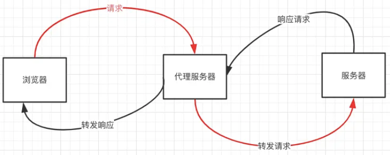

#### postMessage()方法

**场景**：窗口 A (`http:A.com`)向跨域的窗口 B (`http:B.com`)发送信息。

1. 在`A`窗口中操作如下：向`B`窗口发送数据：

```js
// 窗口A(http:A.com)向跨域的窗口B(http:B.com)发送信息
window.postMessage('data', 'http://B.com');
```

2. 在`B`窗口中操作如下：

```js
// 在窗口B中监听 message 事件
window.addEventListener('message', function (event) {
  console.log(event.origin);  //获取 ：url。这里指：http://A.com
  console.log(event.source);  //获取：A window对象
  console.log(event.data);    //获取传过来的数据
}, false);
```

### 12.HTTP

#### HTTP是啥

#### HTTP2.0

- 新的二进制格式。`HTTP1.x`的解析是基于文本，需要考虑的场景太繁多，`HTTP2`解析的是二进制格式
- header压缩。`HTTP1.x`的`header`带有大量信息，而且每次都要重复发送，`HTTP2.0`使用`encoder`来减少需要传输的`header`大小，通讯双方各自`cache`一份`header fields`表，既避免了重复`header`的传输，又减小了需要传输的大小。
- 多路复用
  - `HTTP/1.0` 每次请求响应，建立一个`TCP`连接，用完关闭
  - `HTTP/1.1` 「长连接」 若干个请求排队串行化单线程处理，后面的请求等待前面请求的返回才能获得执行机会，一旦有某请求超时等，后续请求只能被阻塞，毫无办法，也就是人们常说的线头阻塞；
  - `HTTP/2.0` 「多路复用」多个请求可同时在一个连接上并行执行，某个请求任务耗时严重，不会影响到其它连接的正常执行；

#### HTTPS

HTTPS就经过加密包装的HTTP。

通常HTTP直接和TCP通信，当使用SSL时，则演变成先和SSL通信，再由SSL和TCP通信。使用SSL后，HTTP就有了HTTPS的**加密、证书、完整性保护**这些功能。

HTTPS采用混合加密机制：HTTPS采用共享密钥加密和公开密钥加密并用。交换密钥环节使用公开密钥加密方式，之后建立通信交换报文阶段使用共享密钥加密方式。

> 共享密钥：对称加密。以共享密钥方式**加密时必须将密钥发送给对方。**

> 公开密钥：非对称加密。一把公钥，一把私钥。**发送密文的一方使用对方的公开密钥进行加密处理，对方收到被加密的信息后，再使用自己的私有密钥进行解密。**

公钥证书：有专门机构发放，证明公钥是货真价实的。

HTTPS的缺点：使用SSL后处理会变慢，一种指**通信慢**，另一种是指**由于大量消耗CPU及内存资源导致处理速度变慢。**

> 数字证书的作用：

### 14.CDN

### 15.DNS

#### DNS解析过程

#### DNS劫持

#### DNS和CDN的关系

### 16.websocket原理

## 操作系统

### 1.进程与线程的区别

**进程**是资源（CPU、内存等）分配的基本单位，具有一定独立功能的程序关于某个数据集合上的一次运行活动，进程是系统进行**资源分配和调度**的一个独立单位。【资源分配的基本单位】

**线程**是进程的一个实体，是**独立运行和独立调度**的基本单位（CPU上真正运行的是线程）。线程自己基本上不拥有系统资源，只拥有一点在运行中必不可少的资源(如程序计数器，一组寄存器和栈)，但是它可与同属一个进程的其他的**线程共享**进程所拥有的全部资源。【程序执行的基本单位】

### 2.使用线程的优点

**同一进程下的线程共享全局变量、静态变量等数据**，而进程之间的通信需要以进程间通信（Inter Process Communication，IPC）进行。**线程的调度与切换比进程快很多，同时创建一个线程的开销也比进程要小很多。**

多进程程序更健壮，**多线程程序只要有一个线程死掉，整个进程也死掉了**，而一个进程死掉并不会对另外一个进程造成影响，因为进程有自己独立的地址空间。

### 3.进程调度策略有哪些

比如LRU算法。。。

### 4.线程同步

### 5.线程通信方式

## 功能设计篇

### 设计登录功能

#### 账户密码登录（带有验证码）

#### 扫描登录

- 二维码登录防恶意请求优化
- 交互优化，二维码失效咋弄

### 设计弹出框遮罩

### 什么时候在项目中引入TS

### 设计图片懒加载的功能

> 考虑图片高度不一样的情况

### 设计图片上传功能

### 设计搜索功能

### 轮播图

### 跑马灯

## 性能优化篇

### 1.React渲染控制

#### 使用useMemo或useCallback

依赖于第二个参数deps的变化决定是否执行回调函数

```jsx
const cacheSomething = useMemo(create,deps)
```

- `create`：函数，函数的返回值作为缓存值
- `deps`： 数组，存放当前 useMemo 的依赖项
- `cacheSomething`：执行 create 的返回值

```jsx
const callback = useCallback(func,deps)
```

- `func`：函数，缓存的内容
- `deps`：数组，依赖项
- `callback`：函数func

#### 使用PureComponent

PureComponent规则：

- 对于 props 或 state ，PureComponent 会**浅比较** props 是否发生改变，再决定是否渲染组件。
- 对于引用类型，比较的是先后引用的内存地址是否相同，在obj内加其他属性不会修改引用地址，这种情况是不触发该规则的

#### 懒加载

```jsx
const LazyComponent = React.lazy(() => import('./test.js'))

function Index() {
  return (
    <Suspense fallback={<div>loading...</div>} >
      <LazyComponent />
    </Suspense>
  )
}
```

React.lazy 接受一个函数，这个函数需要动态调用 import() 。

它必须返回一个 Promise ，该 Promise 需要 resolve 一个 default export 的 React 组件。

这样做的好处是**不会让初始化的时候加载大量的文件**。

### 2.图片格式

1.JPG

**有损压缩。**把图片体积压缩至原有体积的 50% 以下时，JPG 仍然可以保持住 60% 的品质。

一般JPG图片用于网页背景图、轮播图这种大图

2.PNG

**无损压缩**。对透明度有良好的支持。它弥补了上文我们提到的 JPG 的局限性，唯一的 BUG 就是**体积太大**。

一般用在Logo这种清晰度要求高，但占用位置小的地方

3.SVG

矢量图片，**文件体积更小，可压缩性更强**，SVG是文本文件，可以随意编辑。缺点：渲染成本比较高，这点对性能来说是很不利。学习成本高。

SVG可以想HTML标签一样嵌入到网页中

4.WebP

最优的方式。缺点：兼容性差，不是所有浏览器都支持；和编码 JPG 文件相比，编码同样质量的 WebP 文件会占用更多的计算资源。

---

### 3.图片预加载和懒加载

img容器标签设置data-src为真实图片地址，判断图片容器的scrollTop与视图窗口高度clientHeight+窗口滚动过的距离scrollTop的大小关系 

 图片容器出现在可视区，就将其data-src属性赋值给src，加载图片

## 杂篇

### 常用的设计模式有哪些

- 工厂模式
- 单例模式
- 发布-订阅模式
- 策略模式
- 建造者模式

### 最近了解的新技术

### 大根堆和小根堆
