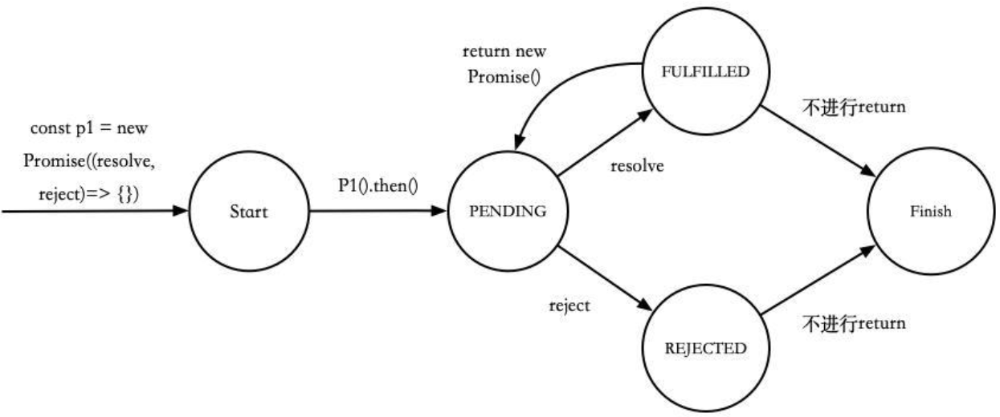
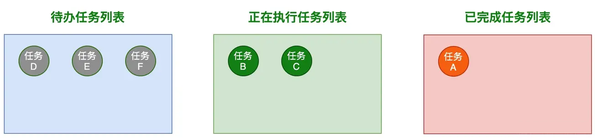
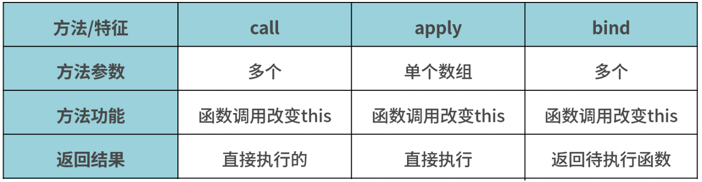
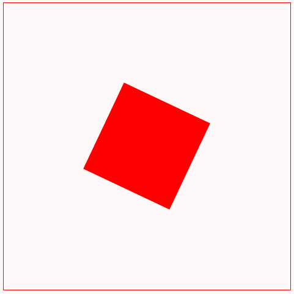

# 前端面试手写系列
## 1.防抖和节流

在规定时间内，只让最后一次生效，前面的不生效。

```js
// 防抖函数
const debounce = (callback, wait) => {
  let timer = -1;
  return function (...args) {
    // 清除未执行的定时器任务
    if (timer !== -1) {
      clearTimeout(timer);
    }
    timer = setTimeout(() => {
      callback.call(this, args);
    }, wait);
  }
}
```

函数执行一次后，只有大于设定的执行周期后才会执行第二次。

```js
// 节流函数
const throttle = (callback, wait) => {
  let lastTime = 0;
  return function (...args) {
    // 当前时间
    const current = Number(new Date());
    // 只有超过这个wait时间才能调用callback
    if (current - lastTime > wait) {
      callback.call(this, args);
      lastTime = current;
    }
  }
}
```

## 2.浅拷贝和深拷贝

- 浅拷贝：只是复制了对象属性或数组元素本身（只是引用地址值）
- 深拷贝：不仅复制了对象属性或数组元素本身，还复制了指向的对象（使用递归）。深拷贝就是为了解决**引用数据类型不能通过赋值的方式复制一份**的问题

### 浅拷贝

#### Object.assign

```js
function lightClone(target) {
  if (target !== null && typeof target === 'object') {
    if (target instanceof Array) {
      return Object.assign([], target);
    } else {
      return Object.assign({}, target);
    }
  }
  return target;
}
```

测试：

```js
const obj1 = { x: 'abc', y: { m: 1 } }
const obj2 = lightClone(obj1)
console.log(obj2, obj2 === obj1, obj2.x === obj1.x, obj2.y === obj1.y)
/*************************
false true true
*************************/
```

#### ES6解构赋值

```js
function lightClone(target) {
  if (target !== null && typeof target === 'object') {
    if (target instanceof Array) {
      return [...target];
    } else {
      return { ...target };
    }
  }
  return target;
}
```

### 深拷贝

#### JSON方式

有两个问题：

- 函数属性会丢失
- 循环引用问题

```js
function deepClone(target) {
  return JSON.parse(JSON.stringify(target))
}
```

#### 递归方式

##### 普通版（解决函数属性丢失问题）

```js
const deepClone = (target) => {
  if (target !== null && typeof target === 'object') {
    const cloneTarget = target instanceof Array ? [] : {};
    for (const key in target) {
      if (target.hasOwnProperty(key)) {
        cloneTarget[key] = deepClone(target[key]);
      }
    }
    return cloneTarget;
  }
  return target;
}
```

##### 升级版（解决循环引用问题）

由于循环引用，递归操作是无穷无尽的。因此只需要**保证数据克隆过一次之后不会再次克隆**即可，而保存这个访问过的数据可以用Map。

```js
const deepClone = (target, map = new Map()) => {
  if (target !== null && typeof target === 'object') {
    let cloneTarget = map.get(target);
    // 如果之前克隆过，就返回之前克隆过的数据
    if (cloneTarget) {
      return cloneTarget;
    }
    cloneTarget = target instanceof Array ? [] : {};
    map.set(target, cloneTarget);
    for (const key in target) {
      if (target.hasOwnProperty(key)) {
        cloneTarget[key] = deepClone(target[key], map);
      }
    }
    return cloneTarget;
  }
  return target;
}
```

测试：

```js
const obj = {
  a: 1,
  b: ['H', 'i'],
  c: {
    h: {
      i: 2
    }
  },
  d: function () { }
}
// 验证循环引用时候才加上这句
obj.pro = obj;

const clone = deepClone(obj);
console.log(clone === obj, clone.c === obj.c, clone.d === obj.d);
/*************************
false false true
*************************/
```

## 3.手写Promise系列

### API

1. 定义整体结构
2. 构造函数
3. promise.then()/catch()/finally()
4. Promise.resolve()/reject()
5. Promise.all/allSettle/race()
6. Promise.resolveDelay()/rejectDelay()

> 面试常考手写finally/resolve/reject/all/allSettle/race

### 确立辅助函数

#### 构造函数

```js
new Promise((resolve,reject)=>{
  ……
  resolve(data1);
  ……
  reject(data2);
});
```

传入值：一个回调函数，回调函数两个值为resolve和reject

返回值：promise实例对象

- state为fulfilled；result为data1
- state为rejected；result为data2

#### .then()

```js
promise.then(
  data1=>{ },
  data2=>{ }
)
```

传入值：两个回调函数，data1是resolve结果，data2是reject结果

返回值：promise实例对象，state为pending

- 如果回调函数返回值为Promise类型，则直接返回这个对象
- 如果回调函数返回值不为Promise，则转换为promise对象

#### Promise状态转换自动机



调用resolve/reject是创建承诺，封装数据到promise对象中

调用then/catch/finally是兑现承诺，根据promise对象的状态执行对应的函数

### Promise.resolve

传入值：任意类型的参数

返回值：promise对象

- 传入为promise，返回就是这个promise
- 传入为普通值，包装成promise返回
- thenable对象，返回跟随这个对象的promise

```js
Promise.resolve = function (param) {
  // 如果是promise就直接返回
  if (param instanceof Promise) return param;
  return new Promise((resolve, reject) => {
    // 如果是thenable对象，返回的promise会跟随这个对象，采用它的最终状态作为自己的状态
    if (param && param.then && typeof param.then === 'function') {
      // resolve和reject都是函数
      param.then(resolve, reject);
    } else {
      // 如果是普通参数就包装成promise对象
      resolve(param);
    }
  })
}
```

### Promise.reject

传入值：任意类型的参数

返回值：promise对象

```js
Promise.reject = function (reason) {
  return new Promise((resolve, reject) => {
    reject(reason);
  });
}
```

### Promise.prototype.finally

```js
/*
无论当前promise是成功还是失败都会调用
执行传入参数【调用callback()】
并将值原封不动的往下传【resolve(res)】
*/
Promise.prototype.finally = function (callback) {
  return new Promise((resolve, reject) => {
    this.then(res => {
      callback();
      resolve(res);
    }, err => {
      callback();
      reject(err);
    });
  })
}
```

### Promise.all

```js
Promise.all = function (promises) {
  return new Promise((resolve, reject) => {
    let result = [];
    let resolvedCount = 0;
    let len = promises.length;
    if (len == 0) {
      resolve(result);
      return;
    }
    promises.forEach((p, index) => {
      // console.log('index-outer:' + index);
      // 这里用Promise.resolve(p)再包装下是为了处理数组项为常量的情况
      Promise.resolve(p).then(
        value => {
          resolvedCount++;
          result[index] = value;
          // console.log('index-inner:' + index);
          if (resolvedCount === len) {
            resolve(result);
          }
        },
        reason => reject(reason)
      )
    })
  })
}
```

测试用例：

```js
let promise1 = new Promise((resolve, reject) => {
  setTimeout(() => {
    resolve('Hello')
  }, 1000);
});

let promise2 = new Promise((resolve, reject) => {
  resolve(3);
});

let promise3 = new Promise((resolve, reject) => {
  setTimeout(() => {
    resolve('China')
  }, 0);
});
Promise.all([promise1, promise2, promise3]).then(data => {
  console.log(data);
})
/*
index-outer:0
index-outer:1
index-outer:2
index-inner:1
index-inner:2
index-inner:0
[ 'Hello', 3, 'China' ]
*/
```

### Promise.race

```js
Promise.race = function (promises) {
  return new Promise((resolve, reject) => {
    promises.forEach(p => {
      // 由第一个完成的promise决定结果
      p.then(resolve, reject);
    });
  })
}
```

测试：

```js
let promise1 = new Promise((resolve, reject) => {
  setTimeout(() => {
    resolve('Hello')
  }, 500);
});

let promise2 = new Promise((resolve, reject) => {
  setTimeout(() => {
    reject(new Error('Whoops!!!'))
  }, 200);
});

Promise.race([promise1, promise2]).then(data => {
  console.log(data);
})
/*
G:\front-en-development\JSTest>node test.js
G:\front-en-development\JSTest\test.js:9
    reject(new Error('Whoops!!!'))
           ^
Error: Whoops!!!
    at Timeout._onTimeout (G:\front-en-development\JSTest\test.js:9:12)
    at listOnTimeout (node:internal/timers:557:17)
    at processTimers (node:internal/timers:500:7)
*/
```

### Promise.allSettled

```js
Promise.allSettled = function (promises) {
  return new Promise((resolve, reject) => {
    let result = [];
    let resolvedCount = 0;
    let len = promises.length;
    if (len === 0) {
      resolve(result);
      return;
    }
    promises.forEach((p, index) => {
      Promise.resolve(p).then(
        res => {
          result[index] = {
            status: 'fulfilled',
            value: res
          };
          resolvedCount++;
          // 全部遍历完成后传出
          if (resolvedCount === len) {
            resolve(result);
          }
        },
        err => {
          result[index] = {
            status: 'rejected',
            reason: err
          }
          resolvedCount++;
        }
      )
    });
  })
}
```

测试代码：

```js
const p1 = Promise.reject(1);
const p2 = new Promise((resolve, reject) => {
  setTimeout(() => {
    resolve(2);
  }, 1000);
});
const p3 = new Promise((resolve, reject) => {
  setTimeout(() => {
    reject(new Error('p3处错误'));
  }, 0);
});
Promise.allSettled([0, p1, p2, p3]).then((results) => {
  console.log('results', results);
});
/*
results [
  { status: 'fulfilled', value: 0 },
  { status: 'rejected', reason: 1 },
  { status: 'fulfilled', value: 2 },
  {
    status: 'rejected',
    reason: Error: p3处错误
        at Timeout._onTimeout (G:\front-en-development\JSTest\test.js:9:12)
        at listOnTimeout (node:internal/timers:557:17)
        at processTimers (node:internal/timers:500:7)
  }
]
*/
```

### 延时函数

```js
function resolveDelay(value, time) {
  return new Promise((resolve, reject) => {
    setTimeout(() => {
      if (value instanceof Promise) {
        value.then(resolve, reject);
      } else {
        resolve(value);
      }
    }, time);
  })
}

function rejectDelay(reason, time) {
  return new Promise((resolve, reject) => {
    setTimeout(() => {
      reject(reason);
    }, time);
  })
}
```

测试：

```js
const p = new Promise((resolve, reject) => {
  setTimeout(() => {
    resolve(2);
  }, 1000);
});

resolveDelay(p, 1000).then((data) => {
  console.log('data = ' + data);
}).catch((err) => {
  console.log(err);
})
/*延时1秒后才会打印出
data = 2
*/
```

### 超时函数

方法一：

```js
// 异步超时函数，时间内调用，时间外抛出异常
function overTime(promise, time) {
  return new Promise((resolve, reject) => {
    promise.then(resolve, reject);
    setTimeout(() => {
      reject(new Error('超时错误'))
    }, time);
  });
}
```

方法二：

```js
// 使用Promise.race方式
function overTime(promise, time) {
  let promiseTimeout = new Promise((resolve, reject) => {
    setTimeout(() => {
      reject(new Error('超时错误'));
    }, time);
  });
  return Promise.race([promise, promiseTimeout]);
}
```

测试：

```js
const p = new Promise((resolve, reject) => {
  setTimeout(() => {
    resolve(2);
  }, 1000);
});

overTime(p, 5000).then((data) => {
  console.log('data = ' + data);
}).catch((err) => {
  console.log(err);
})
/*
data = 2
注意：两种方法都是在第5秒才会停止
*/

overTime(p, 50).then((data) => {
  console.log('data = ' + data);
}).catch((err) => {
  console.log(err);
})
/*
Error: 超时错误
    at Timeout._onTimeout (G:\front-en-development\JSTest\test.js:21:14)     
    at listOnTimeout (node:internal/timers:557:17)
    at processTimers (node:internal/timers:500:7)
*/
```

### 并发控制



```js
const asyncPool = async (poolLimit, array, iteratorFunc) => {
  // 异步任务的结果
  const ret = [];
  // 正在执行的异步任务
  const doingTasks = [];
  for (const item of array) {
    // 调用iteratorFunc函数执行异步任务
    const p = Promise.resolve().then(() => iteratorFunc(item, array));
    ret.push(p);
    // 当poolLimit值小于或等于总任务个数时，进行并发控制
    if (poolLimit <= array.length) {
      // 任务完成后，从正在执行的任务数组中移除已完成的任务
      const e = p.then(() => doingTasks.splice(doingTasks.indexOf(e), 1));
      doingTasks.push(e);
      if (doingTasks.length >= poolLimit) {
        await Promise.race(doingTasks);
      }
    }
  }
  return Promise.all(ret);
}
```

测试：

```js
// 测试
const timeout = (i, array) => {
  console.log(i);
  return new Promise((resolve, reject) => {
    setTimeout(() => {
      resolve(i)
    }, i)
  })
}
asyncPool(2, [1000, 5000, 1000, 500, 1500, 100, 1000], timeout).then((res) => {
  console.log(res)
})
```

### 使用Promise实现每隔1秒输出1,2,3

```js
const arr = [1, 2, 4, 8];
arr.reduce((prev, cur) => {
  return prev.then(() => {
    return new Promise((resolve, reject) => {
      setTimeout(() => {
        console.log(cur);
        resolve();
      }, 1000)
    })
  })
}, Promise.resolve());
```

要构成Promise链条结构，即让reduce中每次的返回就是一个.then后的对象，这个返回的对象由内部回调函数的返回值控制是啥，即return new Promise部分。在定时器内部resolve，这样在打印输出后才会让状态由pending转变为fulfilled，接着下一次链条执行。

### 使用Promise实现红绿灯交替重复亮

红灯3秒亮一次，黄灯2秒亮一次，绿灯1秒亮一次；如何让三个灯不断交替重复亮灯？(用Promise实现)三个亮灯函数已经存在：

```js
function red() {
  console.log('red');
}
function green() {
  console.log('green');
}
function yellow() {
  console.log('yellow');
}
```

```js
const light = (timer, cb) => {
  return new Promise((resolve, reject) => {
    setTimeout(() => {
      cb();
      resolve();
    }, timer)
  })
}

const step = () => {
  Promise.resolve()
    .then(() => { return light(3000, red) })
    .then(() => { return light(2000, yellow) })
    .then(() => { return light(1000, green) })
    .then(() => { step() })
}
step();
```

### 封装一个异步加载图片的方法

```js
function loadImg(url) {
  return new Promise((resolve, reject) => {
    const img = new Image();
    img.onload = () => {
      console.log('图片加载完成');
      resolve();
    }
    img.onerror = function () {
      reject(new Error('Could not load image at' + url));
    };
    img.src = url;
  })
}
```

## 4.设计模式系列

### 单例模式

#### 懒汉式

第一次调用的时候才会创建单例

```js
class Singleton {
  static getInstance() {
    if (!Singleton.instance) {
      Singleton.instance = new Singleton();
    }
    return Singleton.instance;
  }
}
```

测试：

```js
const s1 = Singleton.getInstance();
const s2 = Singleton.getInstance();
console.log(s1 === s2);
```

#### 饿汉式

类加载的时候就创建单例，浪费内存

```js
class Singleton {
  instance = new Singleton();
  static getInstance() {
    return this.instance;
  }
}
```

### 发布订阅

> 能给on添加防抖函数吗？

```js
class EventEmitter {
  constructor() {
    this.events = {};
  }
  // 订阅
  on(eventName, callback) {
    if (!this.events[eventName]) {
      this.events[eventName] = [callback];
    } else {
      this.events[eventName].push(callback);
    }
  }
  // 取消订阅
  off(eventName, callback) {
    if (this.events[eventName]) {
      const index = this.events[eventName].indexOf(callback);
      if (index >= 0) {
        this.events[eventName].splice(index, 1);
      }
    }
  }
  // 发布，当once为true时候，发布一次后销毁
  emit(eventName, once = false) {
    this.events[eventName]?.forEach(cb => cb());
    if (once) {
      delete this.events[eventName];
    }
  }
}
```

测试：

```js
const eventEmitter = new EventEmitter();
// 测试发布订阅
eventEmitter.on('change', () => {
  console.log('Hello');
})
eventEmitter.emit('change')
// 测试取消订阅
const fn = () => { console.log('click'); }
eventEmitter.on('click', fn)
eventEmitter.off('click', fn);
eventEmitter.emit('click')
```

### 观察者模式

```js
// 被观察者
class Subject {
  constructor(state) {
    this.state = state;
    this.observers = [];
  }
  // 收集观察者
  attach(observer) {
    this.observers.push(observer)
  }
  // 修改被观察者状态，调用观察者更新
  setState(newState) {
    if (newState !== undefined) {
      this.state = newState;
    }
    this.observers.forEach(observer => observer.update(this))
  }
}
// 观察者
class Observer {
  constructor(name) {
    this.name = name;
  }
  /**
   * 由于被观察者发生状态改变而引发的更新
   * this: 观察者对象
   * @param {*} subject 被观察的对象
   */
  update(subject) {
    console.log(this.name + '已被通知', '当前学生的状态是' + subject.state)
  }
}
```

测试：

```js
let student = new Subject('happy');
let parent = new Observer('父母');
let teacher = new Observer('老师');
// 只需要修改被观察者，观察者就会修改并调用
student.attach(parent);
student.attach(teacher);
student.setState('tried');
/***************
父母已被通知 当前学生的状态是tried
老师已被通知 当前学生的状态是tried
***************/
```

## 5.call、apply、bind



### call

```js
// call
Function.prototype.call = function (context = window, ...args) {
  let key = Symbol('key');
  context[key] = this;
  let result = context[key](...args);
  delete context[key];
  return result;
}
```

### apply

```js
// apply
Function.prototype.apply = function (context = window, args) {
  let key = Symbol('key');
  context[key] = this;
  let result = context[key](...args);
  delete context[key];
  return result;
}
```

### bind

注意：这个bind函数实现是有点小瑕疵，依赖于apply的，只能单独使用

```js
// bind
Function.prototype.bind = function (context, ...args) {
  let self = this; // 保存原函数
  return function (...args2) { // 返回一个新函数
    return self.apply(context, [...args, ...args2]); // 执行新函数时，将传入的上下文context作为新函数的this
  }
}
```

## 6.instanceOf

实现不了原生的那种运算符形式，只能用写个函数

```js
function myInstanceOf(obj, classFunc) {
  // 获取原型对象
  let protoObj = obj.__proto__;
  while (protoObj) {
    if (protoObj === classFunc.prototype) {
      return true;
    }
    // 顺着原型链走到头
    protoObj = protoObj.__proto__;
  }
  return false;
}

// Test
function Person(name, age) {
  this.name = name
  this.age = age
}
const p = new Person('tom', 12);
console.log(myInstanceOf(p, Object));    // true
console.log(myInstanceOf(p, Person));    // true
console.log(myInstanceOf(p, Function));  // false
```

## 7.new

```js
function newInstance(fn, ...args) {
  // 创建空对象
  const obj = {};
  // 指向原型对象
  obj.__proto__ = fn.prototype;
  const result = fn.apply(obj, args);
  return result instanceof Object ? result : obj;
}

function Person(name, age) {
  this.name = name
  this.age = age
}

const p = newInstance(Person,'Alice',20);
console.log(p);   // Person { name: 'Alice', age: 20 }
```

## 7.普通数组去重

### ES6 Set去重

```js
function uniq(arr) {
  return Array.from(new Set(arr));
}
```

### reduce+includes

这种方式有缺点，就是对象形式无法去重，但是NaN可以

```js
function uniq(arr) {
  return arr.reduce((prev, cur) => {
    return prev.includes(cur) ? prev : [...prev, cur];
  }, []);
}
```

### hasOwnProperty（推荐）

`hasOwnProperty()`方法会返回一个布尔值，指示对象自身属性中是否具有指定的属性

```js
function uniq(arr) {
  let obj = {};
  let res = arr.filter((item, index, array) => {
    if (obj.hasOwnProperty(typeof item + item)) {
      return false;
    } else {
      obj[typeof item + item] = true;
      return true;
    }
  })
  return res;
}
```

## 8.扁平化

### 纯递归（推荐）

```js
let flatten = function (arr) {
  for (let i = 0; i < arr.length; i++) {
    const item = arr[i];
    if (Array.isArray(item)) {
      flatten(item);
    } else {
      res.push(item);
    }
  }
  return res;
}
```

### reduce+递归（推荐）

```js
function flatten(arr) {
  return arr.reduce((res, item) => {
    return res.concat(Array.isArray(item) ? flatten(item) : item)
  }, []);
}
```

## 9.Promise封装ajax

```js
// 用Promise封装ajax
function ajax(url, method = "GET", params = {}, data = {}) {
  return new Promise((resolve, reject) => {
    method = method.toUpperCase();
    let querystring = '';
    Object.keys(params).forEach(key => {
      querystring += `${key}=${params[key]}&`
    })
    if (querystring) {
      // 去除最后的&
      querystring = querystring.substring(0, querystring.length - 1);
      // 接到url上
      url = url + '?' + querystring;
    }
    // 执行ajax请求
    const xhr = new XMLHttpRequest();
    xhr.open(method, url, true);
    if (method === 'GET') {
      xhr.send();
    } else if (method === 'POST' || method === 'PUT' || method === 'DELETE') {
      // 设置请求数据格式为json格式
      xhr.setRequestHeader('Content-Type', 'application/json;charset=utf-8');
      // 发送json格式请求体参数
      xhr.send(JSON.stringify(data));
    }
    // 绑定状态改变的监听
    xhr.onreadystatechange = function () {
      // 服务器响应完成，可以获取使用服务器的响应了
      if (xhr.readyState !== 4) {
        return;
      }
      // 响应码为2**代表成功
      const { status, statusText } = xhr;
      if (status >= 200 && status <= 299) {
        const response = {
          data: JSON.parse(xhr.response),
          status,
          statusText
        }
        resolve(response);
      } else {
        // 请求失败了调用reject()
        reject(new Error('request error status is ' + status))
      }
    }
  });
}

ajax.get = function (url, options) {
  return ajax(Object.assign(options, { url, method: 'GET' }));
}
ajax.post = function (url, data, options) {
  return ajax(Object.assign(options, { url, data, method: 'POST' }))
}
ajax.put = function (url, data, options) {
  return ajax(Object.assign(options, { url, data, method: 'PUT' }))
}
ajax.delete = function (url, options) {
  return ajax(Object.assign(options, { url, method: 'DELETE' }))
}
```

## 10.垂直居中，并绘制旋转动画

```html
<style>
  #container {
    width: 300px;
    height: 300px;
    display: flex;
    justify-content: center;
    align-items: center;
    border: 1px solid red;
  }

  .box {
    height: 100px;
    width: 100px;
    background-color: red;
    animation: myChange 2s linear infinite;
  }

  @keyframes myChange {
    0% {
      transform: rotate(0deg);
    }

    25% {
      transform: rotate(90deg);
    }

    50% {
      transform: rotate(180deg);
    }

    75% {
      transform: rotate(270deg);
    }

    100% {
      transform: rotate(360deg);
    }
  }
</style>
<div id="container">
  <div class="box"></div>
</div>
```



## 12.URL处理

### 从URL中将参数解析为对象

```js
const parseParam = (url) => {
  const parseStr = url.split(/\?|\#/)[1];
  const parseArr = parseStr.split('&');
  const paramsObj = {};
  for (const param of parseArr) {
    // 有特殊情况，没有等号的默认为boolean
    if (/=/.test(param)) {
      let [key, val] = param.split('=');
      // 解码
      val = decodeURIComponent(val);
      // 如果是数字则解析成number类型
      val = /^\d+$/.test(val) ? parseFloat(val) : val;
      // 如果有key值，则以数组形式展示
      if (paramsObj.hasOwnProperty(key)) {
        paramsObj[key] = [].concat(paramsObj[key], val);
      } else {
        paramsObj[key] = val;
      }
    } else {
      paramsObj[param] = true;
    }
  }
  return paramsObj;
}
```

除了手动解析的方式外，还可以通过URL对象解析

### 对象转换为URL参数

```js
const paramsToUrl = (obj) => {
  const params = [];
  for (let key in obj) {
    // 编码
    const val = encodeURIComponent(obj[key]);
    params.push(`${key}=${val}`);
  }
  return params.join('&');
}
```

### 获取URL某个参数的值

1.使用解析的对象结果来获取

```js
// 这个要用到上述的解析结果
const getParamFromURL = (url, key) => {
  return parseParam(url)[key];
}
```

2.使用JS内置的URL对象解析得到URLSearchParams对象，再获取结果

```js
const getParamFromURL = (url, key) => {
  return new URL(url).searchParams.get(key);
}
```

### 修改URL某个参数的值

```js
const replaceParamVal = (oUrl, paramName, replaceWith) => {
  const rgx = new RegExp(paramName + '=([^&]*)', 'gi');
  return oUrl.replace(rgx, paramName + '=' + replaceWith);
}
```

## 13.短横线和驼峰互转换

```js
// 驼峰转短横线
const getKebabCase = (str) => {
  return str.replace(/[A-Z]/g, (item) => '-' + item.toLowerCase())
}
// 短横线转驼峰
const getCamelCase = (str) => {
  return str.replace(/-([a-z])/g, (i, item) => item.toUpperCase())
}
```

## 14.柯里化add函数

柯里化的定义：接收一部分参数，返回一个函数接收剩余参数，接收足够参数后，执行原函数。

```js
const curry = (fn, args = []) => {
  // 传入的回调函数的参数的个数
  const length = fn.length;
  return function () {
    // arguments是当前回调函数fn的参数
    const newArgs = args.concat([...arguments]);
    if (newArgs.length < length) {
      return curry.call(this, fn, newArgs);
    } else {
      return fn.apply(this, newArgs);
    }
  }
}
```

测试：

```js
const addFn = (a, b, c, d, e) => {
  return a + b + c + d + e;
}
// 柯里化后的函数
let curryTest = curry(addFn, [10])
console.log(curryTest(1, 2)(3, 4));		// 20
```

## 15.组合继承

组合继承：原型链继承【方法继承】+call调用【属性继承】

```js
function SuperType(name) {
  this.name = name;
  this.colors = ["red", "blue", "green"];
}
SuperType.prototype.sayName = function () {
  console.log(this.name);
}
function SubType(name, age) {
  SuperType.call(this, name);   // 继承属性
  this.age = age;
}
SubType.prototype.sayAge = function () {
  console.log(this.age);
}
// 继承方法
SubType.prototype = Object.create(SuperType.prototype);
SubType.prototype.constructor = SubType;
```

测试：

```js
/*****************Test**********************/
var instance = new SubType("EvanChen", 18);
instance.colors.push("black");
console.log(instance);
instance.sayName();
/*
SubType {
  name: 'EvanChen',
  colors: [ 'red', 'blue', 'green', 'black' ],
  age: 18
}
EvanChen
*/
```

## 16.isEqual判断对象是否相同

```js
const isObject = (obj) => {
  return obj !== null && typeof obj === 'object'
}
const isEqual = (obj1, obj2) => {
  if (!isObject(obj1) || !isObject(obj2)) {
    return obj1 === obj2;
  }
  // 同一个变量情况
  if (obj1 === obj2) {
    return true;
  }
  const obj1Keys = Object.keys(obj1);
  const obj2Keys = Object.keys(obj2);
  // 长度不能肯定不是同一个对象
  if (obj1Keys.length !== obj2Keys.length) {
    return false;
  }
  // 递归遍历
  for (const key in obj1) {
    if (!isEqual(obj1[key], obj2[key])) {
      return false;
    }
  }
  return true;
}
```

## 17.setTimeout实现setInterval

```js
let i = 0;
setTimeout(function run() {
  i++;
  console.log(i);
  setTimeout(run, 1000);
}, 1000);
```

## 18.计算函数的执行时间

## 19.对象操作

### 两对象合并

### 两对象取交集

### 对象扁平化

```js
// 原数据
const obj = {
    a: 1,
    b: {
        f: '2',
        g: '3'
    },
    c: {
        d:[1, 2, {
            e: true
        }]
    }
}

// 转化为
const obj = {
    a:1,
    'b.f': '2',
    'b.g': '3',
    'c.d[0]': 1,
    'c.d[1]': 2,
    'c.d[2].e': true
}
```


## 19.React Hooks实现定时器

```jsx
export default function App() {
  const [seconds, setSeconds] = useState(0);
  useEffect(() => {
    const timer = setInterval(() => setSeconds((t) => t + 1), 1000);
    return () => clearInterval(timer);
  }, []);
  return <span>{seconds}</span>;
}
```

如果考虑setInterval在后台被节流，就需要计算当前时间与起始时间之差：

```jsx
export default function App() {
  const [seconds, setSeconds] = useState(0);
  useEffect(() => {
    const start = performance.now();
    const timer = setInterval(() => {
      const cur = performance.now();
      setSeconds(Math.trunc((cur - start) * 0.001));
    }, 1000);
    return () => clearInterval(timer);
  }, []);
  return <span>{seconds}</span>;
}
```


