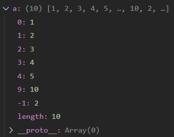
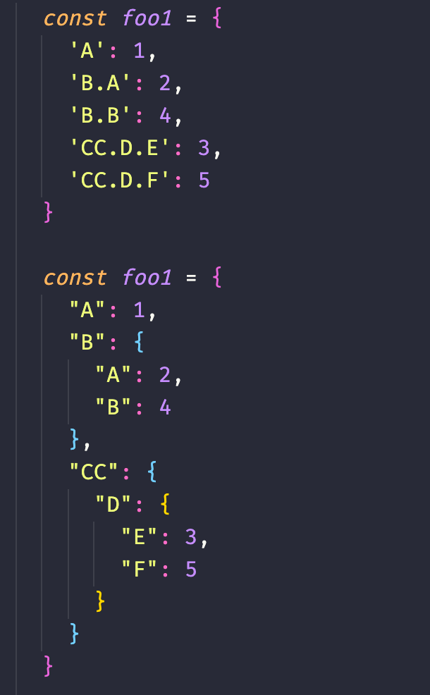

# 校招前端面经
## 2021/5/24 美团暑期实习一面

1.自我介绍

2.问项目，职责、实现哪些功能、协作

3.为啥学前端

4.浏览器输入URL会发生什么，从DNS到浏览器渲染机制

- 输入URL，浏览器接收url到开启网络请求线程
- 发出一个完整的HTTP请求
- 从服务端接收到请求
- 前台与后台HTTP交互
- HTTP缓存
- 浏览器接收到HTTP数据包后进行解析
- CSS的可视化模型
- 解析JS

5.浏览器是如何工作的

6.浏览器如何渲染DOM

7.虚拟DOM

8.宏观任务队列和微观任务队列

9.querySelectorAll的使用

```HTML
<ul>
  <li>The</li>
  <li>test</li>
</ul>
<ul>
  <li>has</li>
  <li>passed</li>
</ul>
<script>
  let elements = document.querySelectorAll('ul > li:last-child');

  for (let elem of elements) {
    alert(elem.innerHTML); // "test", "passed"
  }
</script>
```

10.Vue和React的区别

11.Promise中的队列

12.React中state prop为啥是单向的

## 2021/5/28 拼多多笔试

1.数组下标问题

```js
let a = [1,2,3,4,5];
console.log(a.length);
a[-1]=2;
a[9]=10;
console.log(a);
/*
[ 1, 2, 3, 4, 5 ]
[ 1, 2, 3, 4, 5, <4 empty items>, 10, '-1': 2 ]
*/
```



2.行内style和!important

```html
<style>
  #test{
    color: green !important;
  }
</style>
<div id="test" style="color: red;">哈哈</div>
```

最终显示绿色，就是说`!important`优先级高于行内style；如果去掉`!important`是显示红色

3.实现一个promiseTimeout方法，接收两个参数：一个为promise，一个为time

①若promise第二个参数给定时间内处于pending状态，则返回一个reject的promise，其reason为`new Error('promise time out')`

②若promise第二个参数给定时间处于非pending状态，则返回该promise

```js
function promiseTimeout(promise, time) {
  const timerPromise = new Promise(
    (_, reject) => setTimeout(reject, time, new Error('promise time out'))
  )
  return Promise.race([promise, timerPromise]);
}
```


4.手写一个promise.race

```js
Promise.race = (values) => {
    return new Promise((resolve, reject) => {
        let len = values.length;
        if (len === 0) {
            return;
        }
        for (let i = 0; i < len; i++) {
            Promise.resolve(values[i]).then(data => {
                resolve(data);
                return;
            }).catch(err => {
                reject(err);
                return;
            })
        }
    })
}
```

5.写CSS和JS

①使弹窗能水平垂直居中，宽度自适应内容，且所有内边距为50px

②使用户点击非弹窗后，弹窗能隐藏

## 2021/5/28 广联达暑期实习一面

1.自我介绍

2.看项目

3.手写快速排序

4.Get和Post区别

5.深拷贝和浅拷贝

6.跳台阶

## 2021/6/5 蚂蚁金服一面

1.自我介绍（答的不好，面试官主要考察口头表达能力和大学经历）

2.**商业**项目经验【※找实习的重要性】，有没有接触过小程序？serverless？项目有没有优化？

3.平时做些什么

4.未来规划

5.你还有啥要问的吗？

## 2021/6/9 蚂蚁金服二面

1.自我介绍

2.看项目，项目亮点

3.进程与线程的区别

4.HTTP2和HTTPS，HTTPS能阻止哪种攻击

5.TCP和UDP区别，UDP的使用常见

6.三次握手

7.JDK和JRE

8.数组和链表区别和使用优势劣势

9.排序有多少种类，说下快速排序

10.JS中的标记-清除算法

11.Vue中data写成对象和写成函数的区别

12.CSS中的absolute、relative、fixed。如果父div是fixed/relative，子div是absolute，如何确定位置

13.数据库字段是如何存储的，语言组织不好

14.数据库优化

## 2021/6/15 科大讯飞一面

1.自我介绍

2.问项目

- 从产品的角度看，你的项目实现哪些有用功能
- 项目结构，如何在项目组织CSS
- 如何实现前后端交互的
- 项目中如何引入静态文件，如图片、图表等（assets文件夹下。。。）
- 如何实现跨域（后端实现跨域。。。）
- 为啥要用axios，你说下用原生的ajax如何发送请求
- 如何实现打包的（没打包）
- 项目部署是咋部署的（没部署）

3.React底层的算法，没有明说是哪个，我答的是虚拟DOM和diff算法。

4.CSS如何不用弹性盒子实现双列布局，在这个基础上如何实现三列布局（两边固定，中间适配）

5.React学的是哪个版本（肯定最新啊。。。）

6.你用原生的HTML、CSS、JS做过项目吗？

反问：

1.这个岗位要做哪些业务？

答：就是做前端

前端也分具体方向，比如Node、可视化、3D等？

答：都做都做

感觉科大讯飞的业务有点老，偏重问原生的CSS，我说了styled-components面试官都还在问CSS咋引入的

## 2021/7/2 字节跳动实习一面

1.自我介绍

2.说下HTTP，不限定范围

3.说下三次握手过程

4.如何实现一个登录功能

5.登录功能中如何存储，cookie、session、localStorage、sessionStorage

6.CSS中的position属性

7.实现功能：点击任意一个li，打印其数字

```html
<ul id="list">
  <li>1<li>
  <li>2<li>
  <li>3<li>
  <li>4<li>
  <li>5<li>
</ul>
```


8.判断输出

```js
for(var i=0;i<5;i++){
    setTimeout(() => {
        console.log(i);
    }, 1000);
}
```


var和let的区别，答作用域还不够

如何不用let实现打印输出0,1,2,3,4

9.判断情况

```js
function F() { }
Object.prototype.a = () => { }
Function.prototype.b = () => { }
var f = new F();

f有没有a、b
F有没有a、b
```

10.改写



11.剑指offer-04

## 2021/7/29 图森未来一面

1.聊项目，自己说

2.如何实现登录模块的？登录进入后如何实现展示模块？如果刷新是否会退出到登录页？如何存储session的？

3.响应式项目中如何实现多端适配的？

4.flex布局和grid布局的区别和使用场景

5.Vue和React的区别

6.Redux的使用场景，为啥要使用Redux

7.React中数据访问的方式有哪些

8.package.json和package.lock.json的区别

9.如果A和B同时依赖于C，那么C是导入一次还是两次

10.你知道webpack的实现原理吗？

11.JS中的var、let、const

12.Promise和async/await区别

13.判断输出：

```js
let a = 1;
if(true){
  console.log(a);
  let a = 2;
}
```


14.JS中数组的方法有哪些，哪些是修改了数组元素的？哪些没有修改？map和filter各自的作用

15.for in；for of；forEach的区别

16.一个对象数组如何去重

17.用过fetch吗？

18.是用ES6+多一些还是TS多些？

19.啥时候开始学前端的？学多久了？

## 2021/8/26 用友一面

1.setState()是同步的还是异步的

2.事件循环机制

3.JS数据类型

4.常规对象和Map的区别

5.看代码说执行顺序

6.两列布局

7.有序数组的连接，注意数组越界问题

反问：

1.主要做啥业务的？

关键词：**后台**

2.技术栈有哪些？

React和Vue都有

## 2021/9/10 YY直播一面

1.顶部导航是怎么实现的？

2.flex布局和grid有哪些区别？grid布局有啥优势？

3.setTimeout和requestAnimationFrame有啥区别？

4.webpack中是怎样配置CSS Modules的？

5.说下cookie和token方式的区别？token存储在哪？

6.存储在cookie和localStorage有和区别，为啥把token存储在localStorage中呢？

7.比如点击一个账单详情页面，这时候发生什么？

8.前端路由对于动态参数是怎么实现的？发送请求后后端是怎样处理的？

9.项目中的异步操作如果出现错误怎么处理？如果后端返回错误，比如401、500，怎么处理？

10.文件上传功能有没有验证，比如大小或类型，怎样实现的？

11.封装的组件是怎样引入的？怎么控制弹出或者关闭？怎样实现要点击空白处关闭的功能？如何实现横向滚动的？

12.分页功能是怎么实现的？

13.如何实现适配的？

14.TS用过吗？怎么看待TS中的类型机制？

15.Promise中状态转换说一下？

16.如果要判断两个Promise都完成，要用哪个函数？Promise.all和Promise.allSettled有啥区别？

17.如果要实现对DOM操作的响应式改变，如何用原生JS实现？

18.说下浏览器的缓存机制。

19.了解JS动画吗？除了用Anime.js这样的库。

20.有没有用过CSS变量，在哪里用过？

反问：

1.主要做啥业务的？

YY游戏直播H5和PC端

2.技术栈有哪些？

React+TS

## 2021/9/11 百度一面

1.用过git哪些命令？git fetch和git clone有啥区别呢？

2.水平居中和垂直居中的几种方法

3.说下盒子模型

4.说下position属性，主要是relative、absolute、fixed

5.说下Promise的几种状态，Promise.all的适用场景

6.async/await和Promise方式有啥不同，适用场景是啥？【提示：虽然JS是单线程的，但是多个promise执行时不会想async/await一样阻塞，因此像没有依赖的业务比如加载商品列表和提交订单，用promise更好，像有依赖的业务，必须先后执行，这种状况下用async/await较好】

7.let、const、var区别

```js
const a = [1, 0];
a.push(1);
a[100] = 2;
console.log(a);    // [ 1, 0, 1, <97 empty items>, 2 ]
```


8.说下防抖和节流

9.说下闭包

## 2021/9/11 百度二面

1.自适应和响应式的区别，以及各自的优势。响应式哪里好？

2.实现元素的垂直水平居中和动画旋转360度

```html
<div id="app">
  <div></div>
</div>
```


3.硬链接和软链接区别

4.查找数组中第k个大的元素，要求在快速排序的过程中查找到。

5.给定一个有序数组，去除重复元素，不能使用额外空间

6.说下项目中如何使用webpack，使用webpack的作用

7.说下useEffect的作用

8.说下如何用Hooks让元素卸载时触发

9.为啥要使用动态路由，这样做有啥好处吗？

10.说下react-router的原理，和location有啥区别吗？

## 2021/9/14 字节跳动一面

1.说下项目亮点

2.说下跨域的几种方式，jsonp、cors。cors的缺点你知道吗？

3.componentWillUnmount用hooks怎么实现？

4.let、var、const的区别

5.垂直水平居中

6.在inline-block中有3px的间隙，是怎样产生的？如何消除？

7.JS基本数据类型有哪些？typeof可以检测哪些？typeof null返回啥？

8.为啥`0.1+0.2!==0.3`，如何消除

9.说下new一个对象的过程

10.知道事件循环机制吗？如果微任务里面嵌套微任务，怎样执行？

```js
new Promise((resolve,reject)=>{
  console.log('1');
  new Promise((resolve,reject)=>{
    console.log('4');
  }).then(data=>{
    console.log('5');
  }).then(data=>{
    console.log('6');
  })
}).then(data=>{
  console.log('2');
}).then(data=>{
  console.log('3');
})
```


11.数组扁平化

12.手写Promise.all，注意常量状态

## 2021/9/16 小红书一面

1.写一个超时函数

```js
function overTime(ajax,time){}
```

2.URL解析

3.数组扁平化和去重

4.贪吃蛇游戏

定义一个蛇的数据结构


处理移动、碰撞的两个函数

## 2021/9/18 YY直播二面

1.为啥学前端

2.学前端多久了

3.说下JS中的精度问题

4.实现三列布局，让中间、右边两列随文字扩展，且同高

5.[二叉树的右视图](https://leetcode-cn.com/problems/binary-tree-right-side-view/)

## 2021/9/18 字节跳动二面

1.说下useMemo和useCallback的区别

2.说下useRef的适用场景

3.用过useReducer没？怎么使用？

4.说下ES6？let？Symbol

5.react中遍历返回组件时候为啥要使用key

6.手写圣杯布局

7.[最长回文子串](https://leetcode-cn.com/problems/longest-palindromic-substring/)

## 2021/9/22 北森一面

1.如何实现项目中的轮播图，用原生JS实现

2.项目中的筛选部分是如何实现的？

3.点击顶部菜单滑动到下面是怎样实现的，能用原生办法不？

4.为啥使用grid布局，和flex布局有啥区别？

5.说下HTTP协议

6.登录功能是怎样实现的？有没有考虑过SQL注入？

7.说下常见的设计模式

## 2021/9/23 帆软一面

1.cookie、sessionStorage、localStorage区别

2.浏览器输入URL会发生什么

3.typeof和instanceof区别

4.说下href方式和hash方式的区别？hash方式有哪些事件？

5.JS中的精度问题？解决办法，除了用toFix(1)

6.对于一个input框，如何实现动态的随着输入文本的宽度而自动增加

**B端产品，Saas、数据可视化等等，自研老框架**

## 2021/9/24 帆软二面

1.怎么学前端的？为啥学前端？学习方法是啥？浏览哪些网站？

2.说下GET和POST的区别，幂等性【GET请求的没有修改浏览器资源，POST请求每次提交都会修改浏览器资源】

3.说下Mysql的存储结构

4.你知道Java中如何处理内存溢出问题吗？

5.React为啥要设定key，虚拟DOM的原理

6.工作地点有要求吗？业务主要在无锡，次要在南京

## 2021/9/24 OPPO一面

1.说下typeof

2.如何判断是否为数组元素

3.寻找两个数组交集

4.计算机网络分哪几层？

5.浏览器缓存机制

6.说下HTTPS

7.说下localStorage和sessionStorage

8.通俗的说下relative和absolute

9.块级元素和行内元素

10.说下Promise.all和Promise.race

11.forEach能中断吗？

12.如何处理异步任务的错误呢，reject方式和catch方式有啥区别？如何全局处理错误呢？【window.onerror】

13.你知道哪些常用的优化手段？

14.100张图片，你准备怎样加载呢？【懒加载机制】

15.你一般是怎样调试的呢？知道inspector吗

16.写过服务端吗？用过啥数据库？

## 2021/9/26 转转一面

1.CSS盒模型知道吗？

2.对于一个盒子，让它向右向上1px阴影，背景为红。让鼠标移动到盒子上，2s后盒子变成圆形。

3.对于一个数组，统计元素种类个数及坐标

4.for…in和for…of区别

5.说下HTTP协议

6.如何实现移动端的适配？rem的底层实现原理你知道不？

7.什么文件用强缓存，什么文件用协商缓存？

## 2021/9/27 4399一面

1.说下操作系统中页面调度算法

2.说下localStorage

3.如何判断DOM节点加载完成

4.DOMContentLoaded和onload有啥区别

5.React的hooks比class写法优势在哪？

6.React中如何实现生命周期？

7.React中如何实现拦截器

8.Webpack中的如何配置开发环境和生产环境

9.Webpack中的PublicPath和OutputPath有啥区别？

10.倒水智力题，5L和6L杯子如何倒成3L

11.看了哪些书？有技术博客吗？

## 2021/9/27 CVTE一面

1.写一个函数，输入为DOM对象和属性key的字符串，从这个DOM节点查找最近的父亲节点含有属性key的DOM对象

2.盒子模型

3.flex: 1含义？三个参数是啥？flex-basis知道吗？如果是flex-grow具体值是怎么计算的呢？

4.水平垂直居中，把你知道的全说下来

5.两个垂直排放的盒子，下面的盒子高度固定，上面的盒子高度是下面盒子内容高度加上自己高度，如何实现？

6.选择器有哪些，知道的都说下

7.说下什么场景下用闭包

8.说下为啥要有异步操作？异步任务执行过程是啥？如果微任务调用微任务，那么后面是怎样执行的？

9.说下常见的浏览器存储方式？localStorage如何设置过期时间？如何在不读取的状况下删除对应的记录？

10.说下浏览器的缓存机制。如何设置缓存时间？Etag和Last-Modify有啥区别？假如用户那边已经有缓存了，现在服务器宕机，项目重新部署上线后如何通知客户端那么不使用缓存，而是使用更新后的服务器数据？

11.说下CSRF攻击原理？攻击者是怎样获取会话ID的呢？又如何伪造请求的呢？如何防范CSRF攻击，除了你说的用token添加过期时间限定访问源的方式？

## 2021/9/28 美团一面

1.项目中使用的是类组件还是函数组件？为啥用函数组件？函数组件的优势是啥？

2.setState是异步还是同步的？说下原理。

3.说下你用过的hooks【useState、useEffect、useRef、useContext、useMemo、useCallback、useReducer】

4.如何在hooks中实现生命周期

5.说下useEffect和useMemo的区别

6.说下浏览器的缓存机制

7.leetcode岛屿问题

8.leetcode括号匹配问题

9.实现一个函数，让它能向服务端每隔1s发送一次请求，一共发送5次，如果中间有一次失败，立刻重新执行该操作

## 2021/9/28 小红书二面

1.说下HTTP的缓存机制

2.了解Map吗，和对象有啥区别，WeakMap知道吗

3.说下浏览器渲染原理。知道如何让`<script>`不阻塞吗？defer和async有啥区别？defer是在DOMContentLoaded前还是后呢？

4.JS基本数据类型

5.判断打印输出

```js
async function async1(){
   console.log('1');
   await async2();
   await async3();
   console.log('2')
}
async function async2(){
   console.log('3')
}
async function async3(){
  console.log('4')
}
console.log('5');
setTimeout(function(){
   console.log('6')
},0);
async1();
new Promise(function(resolve){
   console.log('7');
   resolve();
}).then(function(){
   console.log('8')
});
console.log('9')

```


6.写一个new的过程

7.根据id访问所在城市的所有路径

```js
const cityData = [{
  id: 'axzx',
  name: '广东省',
  children: [
    {
      id: 'sdsd',
      name: '深圳市',
      children: [
        {
          id: '45dss',
          name: '南山区'
        },
        {
          id: 'sdsd11',
          name: '福田区',
          children: [{
            id: 'ddrr2',
            name: 'A街道'
          }]
        }
      ]
    },
    {
      id: '2323d',
      name: '东莞市',
      children: [
        {
          id: 'xxs2',
          name: 'A区'
        },
        {
          id: 'kklio2',
          name: 'B区',
        }
      ]
    }
  ]
}];
```


## 2021/9/29 转转二面

1.react的类组件写法和函数组件写法有啥区别？

2.说下标准类组件的生命周期过程。

3.说下setState是同步的还是异步的呢？

4.用过useEffect吗，踩过哪些坑？

5.自己写的项目有没有啥难点呢？

6.说下登录功能是怎样做的，有没有加密的过程，用啥加密的？听过公开加密吗？

7.说下你是怎样封装组件的，封装组件需要注意哪些点呢？

8.对于一个div的矩形，划分其正对角线，如何判断点击某个位置在对角线上方或下方？

9.实现数组中的splice方法，注意传入参数和返回值。

## 2021/9/30网易有道一面

1.说下你用过的hooks

2.说下类组件和函数组件的区别，为啥要用hooks，hooks有哪些好处？

3.说下使用useEffect和标准生命周期有啥区别

4.说下TCP和UDP的区别

5.说下浏览器的缓存机制

6.项目中引入了webpack，webpack作用是啥？webpack的构建原理是啥？

7.说下JS原型链机制。JS中是如何实现继承的？extends继承原理？手写一个继承

8.说下Promise常见的API。Promise.all和Promise.race区别

9.手写Promise.race

10.怎样学习前端的

反问：技术栈

答：React+TS

## 2021/10/9 北森二面

1.为啥做前端？说下你对前端的理解。

2.刚你提到了数据流，说下你对数据流的理解？

3.为啥要引入redux，解决了哪些痛点？除了跨组件通信还有呢？

4.react中为啥是单向数据流的，单向数据流有什么好处？

5.说下项目中的亮点，你是怎样封装组件的？封装组件的思想是啥？

6.假如给你一个提示框组件，你需要封装哪些API呢？

7.你说到了forwardRef，为啥用？

8.说下如何实现一个登录功能。

9.如何在发送的请求报文中携带JWT？

10.为啥选用JWT，和传统的cookie相比有哪些好处呢？

11.说下普通函数和箭头函数的区别

12.在JS中，如果是在类中写普通函数和箭头函数，有啥区别呢？此时this的指向为啥？

## 2021/10/11 每平每屋一面

1.知道SPA和MPA吗

2.说下你是怎样学前端的，是看视频还是看文档呢？

3.用过TS没，说下TS的一些特性，用TS有哪些好处？

4.了解最新的前端技术吗？前端只是写页面的？

5.用过Serverless吗，和常规开发相比有啥好处？

6.学校开过数据结构的课程吗？说下数组和链表特性。

7.用过脚手架吗？比如crete-react-app、Umi.js，你自己项目中没用，为啥用原生webpack配置，和脚手架比有啥特性？

反问：

1.前端学习建议，如何追求技术深度

作为前端新人，不应该过多追求深度，应该先扩大知识面，多做业务，差不多工作一段时间再去研究。前端的一些进阶可能找不到相关文档，可以去看一些视频，主要是通过视频学习讲师的思维方式，另外可以了解了解国外流行技术。

2.贵公司技术栈

主要是用React做主页面，没有用Redux，太笨重了，用的自己封装的hooks替代。还会用Weex做一些H5和小程序界面，还有京东的Taro也用，Serverless也是常用。

## 2021/10/11 当当一面

1.ES6+新特性有哪些。

2.lib-flexible的实现原理。

3.为啥引入CSS Modules。

4.跨域问题是怎样解决的。

5.非简单请求的预检请求和正式请求需要发送两次报文，如何优化成一次。

6.项目中使用了koa，用了koa做了啥

7.说下常见的优化策略

8.什么是前端工程化，仅仅是webpack吗？

9.webpack配置了哪些参数？引入哪些loader和plugins？如何引入CSS预处理器？postcss作用是啥？

10.webpack中生成的哈希值作用是啥？

11.webpack中hash、chunkhash有啥区别？

面试体验极差，面试官不开摄像头，声音特别嘈杂

## 2021/10/13 网易有道二面

1.JS中能被new的自带的构造函数，如Array

2.ES6+特性你用过哪些

3.CSS实现两列布局

4.操作系统学过吗？进程与线程的区别？在node中是单线程还是多线程？操作系统中进程之间是如何通信的？node进程通信是哪种？

5.如何遍历对象

6.for…in和for…of区别

7.通过for…in遍历对象eslint会警告，为啥会有这个警告？

8.for…of能遍历啥样的对象？能遍历字符串吗？能遍历数组吗？

9.说下项目做了啥？

10.你平时做点啥呢？性格优缺点？

11.你说你不会Vue，那现在让你学Vue，你怎么学？如果让你写一个watch函数，你怎样才能写的尽可能的标准。

12.现在项目要选用轮播图组件，你怎样选用呢？如果github上有三个轮播图组件，选用时候你看哪些方面呢？

13.有两种项目方案，发生了分歧，这时候应该怎样做呢？

## 2021/10/14 声网Agora一面

1.说下OSI七层模型，和五层相比多了哪些？

2.SSL和TLS的区别是啥？

3.git rebase和git merge有啥区别呢？说下git cherry-pick是啥作用？

4.git提交后的如何撤销？reset和revert有啥区别呢？

5.webpack中的chunk是啥？和bundle有啥区别？

6.说下webpack中如何实现懒加载？

7.能讲下react中的fiber是啥吗？怎样更新的？在页面生命周期的哪个阶段执行的呢？

8.说下为啥使用redux，存储在redux和在window有啥区别呢？

9.CSS Modules解决了什么痛点？和styled-components有啥区别呢？

10.你在使用grid布局时候有遇到过啥坑吗？比如浏览器兼容问题？

11.假如在多个SPA页面中，如何实现自适应，这时候使用@media还行吗？

12.说下React Router原理

13.使用hooks的作用？有哪些优点？

14.使用useEffect和类组件中的生命周期相比优劣如何？

15.说下登录和注册功能的实现

16.说下跨域问题及解决方案

17.如果数据库中有10万条数据，你这样一次性的查找出来后再排序，会不会有啥大问题呢？

18.JWT的body部分你存储的是哪些内容呢？

19.token为啥存放在localStorage中呢？和存储在cookie中相比为啥？你项目这样写，把token存放在localStorage中是不是多此一举呢？

20.项目中的文件上传部分是如何实现的？上传后的图片保存在哪？

21.说下强缓存和协商缓存机制。返回304代表的是啥呢？项目中有没有使用过缓存？

反问：

1.贵公司的技术栈？

Vue为主，后端是node，就是全栈。还会写一些小程序、H5界面。

