# CSS-Flex布局
## Flex容器
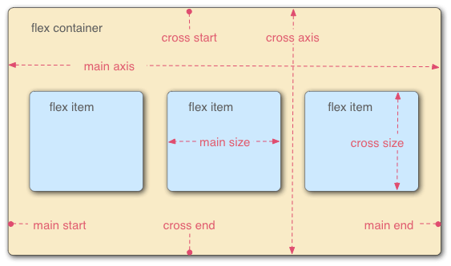

容器默认存在两根轴：水平的主轴（main axis）和垂直的交叉轴（cross axis）。主轴的开始位置（与边框的交叉点)叫做`main start`，结束位置叫做`main end`；交叉轴的开始位置叫做`cross start`，结束位置叫做`cross end`。

项目默认沿主轴排列。单个项目占据的主轴空间叫做`main size`，占据的交叉轴空间叫做`cross size`。

## 属性列举
> 容器属性是写在盒子的CSS中，而项目属性是写在盒子内部节点的CSS中。

容器属性：

- flex-direction：Flex的方向
   - row（默认）：主轴为水平方向，起点在左端。
   - row-reverse：主轴为水平方向，起点在右端。
   - column：主轴为垂直方向，起点在上沿。
   - column-reverse：主轴为垂直方向，起点在下沿。
- flex-wrap：一行挤不下时候，是否换行
   - nowrap（默认）：不换行
   - wrap：换行，第一行在上方
   - wrap-reverse：换行，第一行在下方
- justify-content：定义在主轴上的对齐方式
   - stretch：均匀排列每个元素，非定宽高元素会被拉伸以适应容器的大小。
   - flex-start：主轴起止位置对齐
   - flex-end：主轴结束位置对齐
   - center：居中
   - space-between：均匀排列每个元素，首个元素放置于起点，末尾元素放置于终点，每两个元素距离相等。
   - space-evenly：均匀排列每个元素，每两个元素距离相等。和space-between相比少了首尾元素的位置限制。
   - space-around：均匀排列每个元素，每个元素周围分配相同的空间。下图中01和02的间距是01左侧间距的2倍。
- align-content：定义在**多条交叉轴**的对齐方式
   - stretch
   - flex-start
   - flex-end
   - center
   - space-between
   - space-evenly
   - space-around
- align-items：对所有子项目在交叉轴方向按照指定方式排列
   - stretch
   - flex-start
   - flex-end
   - center

项目属性：

- align-self：设置该项目在交叉轴方向按照指定方式排列
   - stretch
   - flex-start
   - flex-end
   - center
- order
- flex-grow和flex-shrink
- flex-basis
   - 确定值
   - auto
## 容器属性
### flex-drection

- flex-direction：Flex的方向
   - row（默认）：主轴为水平方向，起点在左端。
   - row-reverse：主轴为水平方向，起点在右端。
   - column：主轴为垂直方向，起点在上沿。
   - column-reverse：主轴为垂直方向，起点在下沿。

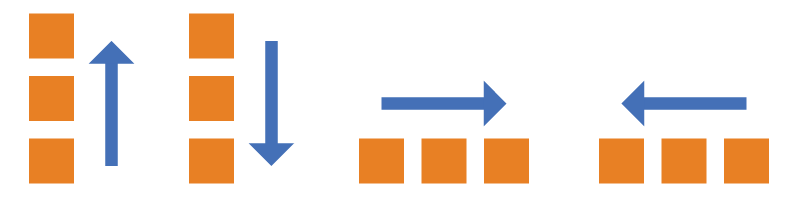
### flex-wrap

- flex-wrap：一行挤不下时候，是否换行
   - nowrap（默认）：不换行
   - wrap：换行，第一行在上方
   - wrap-reverse：换行，第一行在下方

nowrap：

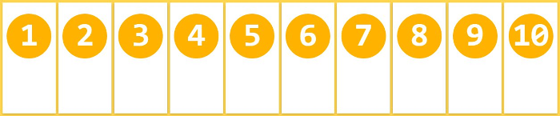

wrap：

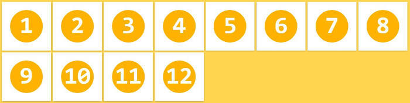

wrap-reverse：

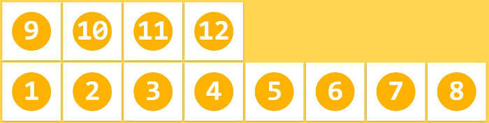

### justify-content
> flex-start和start字段都是可以的，flex-start是早期的Flexbox标准（Flexbox specification），W3C正尝试建立盒子对齐标准（Box Alignment specification），start将被用于取代flex-start。

- justify-content：定义在主轴上的对齐方式
   - stretch：均匀排列每个元素，非定宽高元素会被拉伸以适应容器的大小。
   - flex-start：主轴起止位置对齐
   - flex-end：主轴结束位置对齐
   - center：居中
   - space-between：均匀排列每个元素，首个元素放置于起点，末尾元素放置于终点，每两个元素距离相等。
   - space-evenly：均匀排列每个元素，每两个元素距离相等。和space-between相比少了首尾元素的位置限制。
   - space-around：均匀排列每个元素，每个元素周围分配相同的空间。下图中01和02的间距是01左侧间距的2倍。

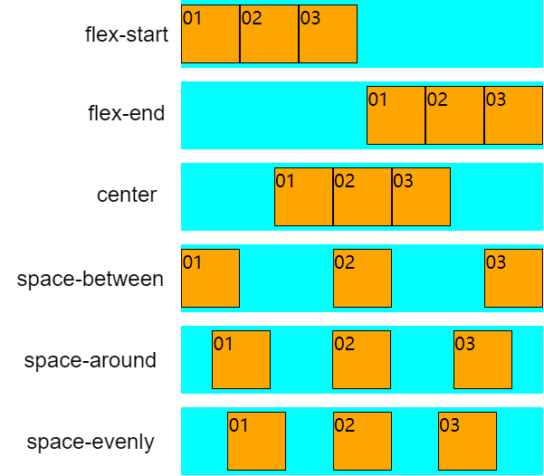
### align-content
> flex布局是一维布局，在主轴上是排列元素的，排列的元素可以折行，因此flex只有一条主轴，但可以存在多条交叉轴。
> **align-content生效的条件是必须要有多行轴线，因此只有当flex-wrap不为nowrap时候才会生效。**

- align-content：定义在**多条交叉轴**的对齐方式
   - stretch：均匀排列每个元素，非定宽高元素会被拉伸以适应容器的大小。
   - flex-start：交叉轴起止位置对齐
   - flex-end：交叉轴结束位置对齐
   - center：居中
   - space-between：均匀排列每个元素，首个元素放置于起点，末尾元素放置于终点，每两个元素距离相等。
   - space-evenly：均匀排列每个元素，每两个元素距离相等。和space-between相比少了首尾元素的位置限制。
   - space-around：均匀排列每个元素，每个元素周围分配相同的空间。下图中01和02的间距是01左侧间距的2倍。

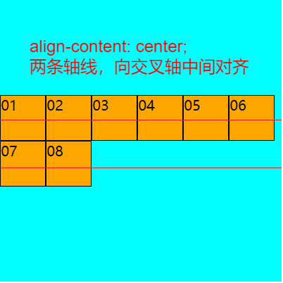
### align-items
> `align-content`生效时候，该属性不生效

- align-items：对所有子项目在交叉轴方向按照指定方式排列
   - stretch
   - flex-start
   - flex-end
   - center
   - baseline：项目的第一行文字的基线对齐

baseline属性：
```html
<div class="flex-box">
    <div class="box1">纸上得来终觉浅，绝知此事要躬行</div>
    <div class="box2">纸上得来终觉浅，绝知此事要躬行</div>
    <div class="box3">纸上得来终觉浅，绝知此事要躬行</div>
</div>
```
```css
.flex-box {
    height: 300px;
    width: 300px;
    background-color: cyan;
    display: flex;
    flex-wrap: wrap;
    flex-direction: row;
    justify-content: center;
    /* align-content: center; */
    align-items: baseline;
}

.box1 {
    height: 120px;
    width: 50px;
    background-color: orange;
    border: 1px solid black;
}

.box2 {
    height: 150px;
    width: 50px;
    background-color: orange;
    border: 1px solid black;
    padding-top: 50px;
}

.box3 {
    height: 180px;
    width: 50px;
    background-color: orange;
    border: 1px solid black;
    padding-top: 20px;
}
```
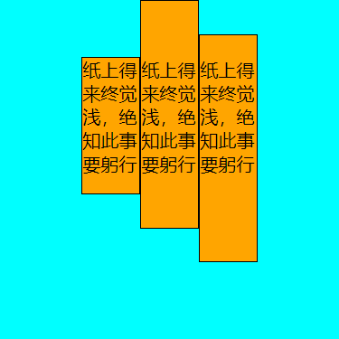

值得注意的是，该属性并不是指交叉轴的对齐方式，而是指子项目在交叉轴上的对齐方式。

当flex-wrap为nowrap时候，align-content是不生效的，这时候只有一条交叉轴。这时候用align-items实现交叉轴上的对齐也是可以的。

比如要实现盒子的水平垂直方向居中，有两种方式：

1. 使用wrap+align-content实现
```html
<div class="flex-box">
    <div class="box-item">01</div>
</div>
```
```css
.flex-box {
    height: 320px;
    width: 320px;
    background-color: cyan;
    display: flex;
    flex-direction: row;
    flex-wrap: wrap;
    justify-content: center;
    align-content: center;
}

.box-item {
    height: 50px;
    width: 50px;
    background-color: orange;
    border: 1px solid black;
}
```

2. nowrap情况下使用align-items居中
```css
.flex-box {
    height: 320px;
    width: 320px;
    background-color: cyan;
    display: flex;
    flex-direction: row;
    justify-content: center;
    align-items: center;
}
```
## 项目属性
### align-self
> 当`align-content`生效的时候，`align-self`和`align-items`是不生效的。

- align-self：设置该项目在交叉轴方向按照指定方式排列
   - stretch
   - flex-start
   - flex-end
   - center
```html
<div class="flex-box">
    <div class="box-item">01</div>
    <div class="box-item">02</div>
    <div class="box-item">03</div>
    <div class="box-item">04</div>
    <div class="box-item">05</div>
    <div class="box-item">06</div>
    <div class="box-item">07</div>
    <div class="box-item">08</div>
</div>
```
```css
.flex-box {
    height: 320px;
    width: 320px;
    background-color: cyan;
    display: flex;
    flex-direction: row;
    flex-wrap: wrap;
    justify-content: flex-start;
    /* align-content: center; */
}

.box-item {
    height: 50px;
    width: 50px;
    background-color: orange;
    border: 1px solid black;
}

/* 第3个子元素在交叉轴上居中 */
.box-item:nth-child(3) {
    align-self: center;
}

/* 第4个子元素在交叉轴上居末 */
.box-item:nth-child(4) {
    align-self: flex-end;
}
```
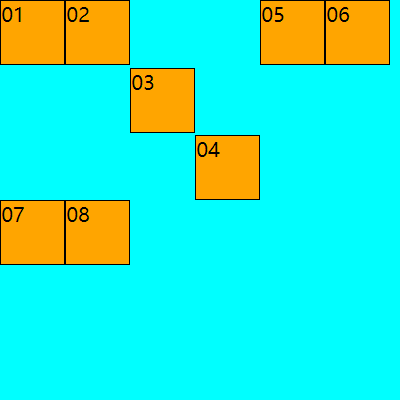
### flex
```css
flex：none | <' flex-grow '> <' flex-shrink >'? || <' flex-basis '>
```
### order
规定弹性容器中的可伸缩项目在布局时的顺序。<br />order默认为0，可以为负数。越小越靠近主轴开始地方。
```html
<div class="flex-box">
    <div class="box-item" style="order: 2;">01</div>
    <div class="box-item" style="order: -1;">02</div>
    <div class="box-item" style="order: 3;">03</div>
    <div class="box-item">04</div>
</div>
```
```css
.flex-box {
    height: 60px;
    width: 320px;
    background-color: cyan;
    display: flex;
    flex-direction: row;
    flex-wrap: wrap;
    justify-content: space-between;
    align-content: center;
}

.box-item {
    height: 50px;
    width: 50px;
    background-color: orange;
    border: 1px solid black;
}
```
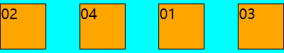
### flex-grow和flex-shrink
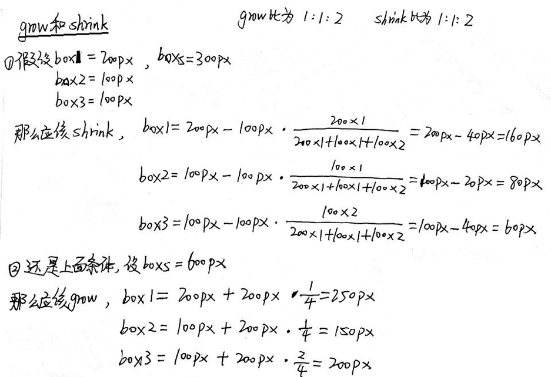
### flex-basis
指定了 flex 元素在主轴方向上的初始大小。
```html
<div class="flex-box">
    <div class="box-item">01</div>
    <div class="box-item">02</div>
    <div class="box-item">03</div>
</div>
```
```css
.flex-box {
    height: 60px;
    width: 300px;
    background-color: cyan;
    display: flex;
    flex-wrap: wrap;
    flex-direction: row;
    justify-content: center;
    align-content: center;
}

.box-item {
    height: 50px;
    width: 50px;
    background-color: orange;
    border: 1px solid black;
}

.box-item:nth-child(2) {
    flex-basis: 100px;
}

.box-item:nth-child(3) {
    flex-basis: 20px;
}
```

