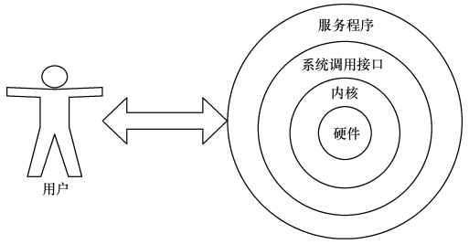

# Linux入门——Shell

## 介绍

一台完整的计算机是由运算器、控制器、存储器、输入/输出等多种硬件设备共同组成的，而能让各种硬件设备各司其职且又能协同运行的东西就是系统内核。直接改动内核参数难度比较大，而且很容易造成系统崩溃，因此不建议直接编辑内核参数，而是基于系统调用接口开发出来的程序或服务来管理计算机。



Shell就是终端程序的统称，充当人与内核之间的翻译。用户把命令告知终端程序，就会调用相应程序服务来完成某些工作。许多主流Linux系统默认使用终端是Bash。

常见的Linux命令格式如下：

```bash
命令名称 [命令参数] 命令对象
```

Bash快捷键：

- `Tab`：补全
- `Ctrl + C`：终止当前进程运行。
- `Ctrl + D`：表示键盘输入结束。
- `Ctrl + I`：清屏。