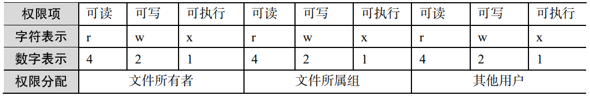
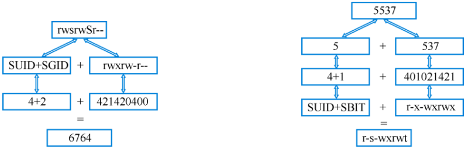
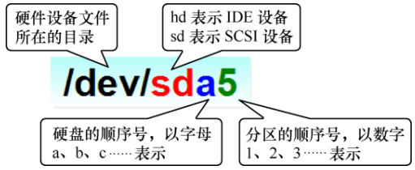
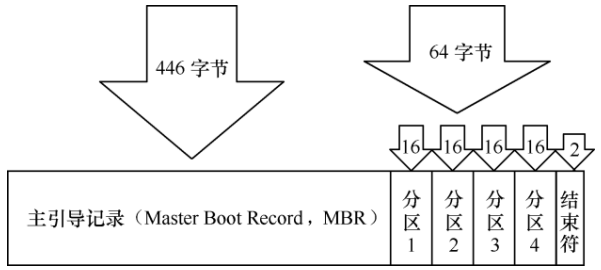
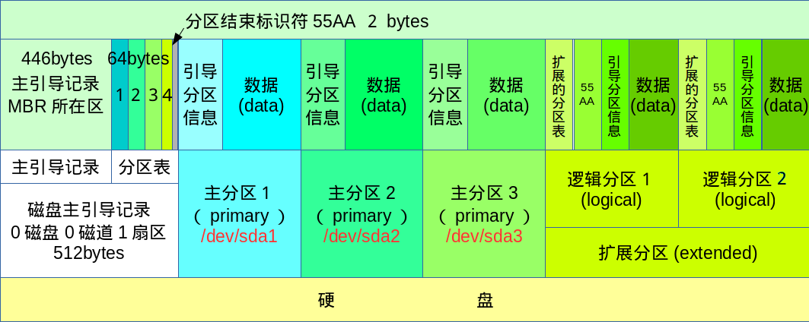
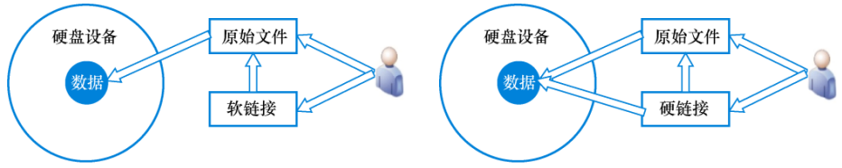

# Linux入门——系统服务

## 用户及权限

### 用户身份

用户身份UID：

- 0：管理员用户。
- 1~999：系统用户。Linux系统为了避免因某个服务程序出现漏洞而被黑客提权至整台服务器，默认服务程序会由独立的系统用户负责运行，进而有效控制被破坏范围。
- 从1000开始：普通用户。

UID是不能冲突的，管理员创建的普通用户UID默认是从1000开始的，即使前面有闲置号码。

为了方便管理同属一组的用户，Linux还引入用户组的概念。通过使用用户组号码GID，把多个用户加入到一个组中。在Linux系统中创建每个用户时，将自动创建一个与其同名的基本用户组，而且这个基本用户组只有该用户一个人。如果该用户以后被归纳到其他用户组，则这个其他用户组称之为扩展用户组。一个用户只有一个基本用户组，但是可以有多个扩展用户组。

::: tip
基本用户组就像是原生家庭，是在创建账号（出生）时就自动生成的；而扩展用户组则像工作单位，为了完成工作，需要加入到各个不同的群体中，这是需要手动添加的。
:::

### 命令

1.id

作用：线上用户详情信息。

```bash
id root     # uid=0(root) gid=0(root) groups=0(root),1002(docker)
id zhengyu  # uid=1001(zhengyu) gid=1001(zhengyu) groups=1001(zhengyu),27(sudo),1002(docker)
```

2.useradd

作用：创建新账户。

| 参数 | 作用 |
| --- | --- |
| -d | 指定用户家目录（默认为`/home/username`） |
| -e | 账户到期时间，格式YYYY-MM-DD |
| -u | 指定用户默认UID |
| -g | 指定一个初始的用户基本组（必须已存在） |
| -G | 指定一个或多个扩展用户组 |
| -N | 不创建与用户同名的基本用户组 |
| -s | 指定该用户的默认Shell解释器 |

```bash
# 家目录为/home/linux，UID为8888，默认Shell解释器设置为nologin则代表用户不能登录到系统
useradd -d /home/linux -u 8888 -s /sbin/nologin linuxdown
id linuxdown    # uid=8888(linuxdown) gid=8888(linuxdown) groups=8888(linuxdown)
```

3.groupadd

作用：创建新用户组。

```bash
groupadd ronny
```

4.usermod

作用：修改用户属性。

| 参数 | 作用 |
| --- | --- |
| -c | 填写用户账户的备注信息 |
| -d -m | 参数-m 与参数-d 连用，可重新指定用户的家目录并自动把旧的数据转移过去-MM-DD |
| -e | 账户的到期时间，格式为 YYYY-MM-DD |
| -u | 修改用户默认UID |
| -g | 变更所属用户组 |
| -G | 变更扩展用户组 |
| -L | 锁定用户禁止其登录系统 |
| -U | 解锁用户，允许其登录系统 |
| -s | 变更默认终端 |

```bash
# 将用户linuxprobe加入到root用户组中
usermod -G root linuxprobe
```

5.passwd

作用：修改用户密码、过期时间等信息。

| 参数 | 作用 |
| --- | --- |
| -l | 锁定用户，禁止其登录 |
| -u | 解除锁定，允许用户登录 |
| --stdin | 通过标准输入修改用户密码，如`echo "NewPassWord" | passwd --stdin Username` |
| -d | 使该用户可用空密码登录系统 |
| -e | 强制用户在下次登录时修改密码 |
| -S | 显示用户的密码是否被锁定，以及密码所采用的加密算法名称 |

```bash
passwd linuxprobe
```

6.userdel

| 参数 | 作用 |
| --- | --- |
| -f | 强制删除用户 |
| -r | 同时删除用户及用户家目录 |

```bash
userdel -rf linuxprobe
```

7.chmod

作用：变更文件或目录权限。

| 参数 | 作用 |
| --- | --- |
| -u | 当前用户 |
| -g | 组用户 |
| -o | 其他用户 |
| -a | 所有用户 |
| -a | 所有用户 |
| -R | 递归操作 |

- `+`：增加权限
- `-`：减少权限
- `=`：设置权限

```bash
# 将文件所有用户权限都设置为只读
chmod a-w file.txt
# 将文件用户和用户组权限都设置为rw-
chmod ug=rw file.txt
```

8.chown

作用：变更文件或目录所有者或所属组。

| 参数 | 作用 |
| --- | --- |
| -c | 只显示更改过的部分的信息 |
| -f | 不线上错误信息 |
| -R | 递归操作 |

```bash
# 将文件所有者更改为root
sudo chown root file.txt
# 将文件所有者和所属组更改为root
sudo chown root:root file.txt
```

### 文件权限

| | 文件 | 目录 |
| --- | --- | --- |
| 可读（r） | 读取文件的实际内容 | 读取目录内的文件列表 |
| 可写（w） | 编辑、新增、修改、删除文件的实际内容 | 在目录内新增、删除、重命名文件 |
| 可执行（x） | 能够运行一个脚本程序 | 能够进入该目录 |

文件权限除了用字符，还可以用数字表示：



比如某文件权限为7，则表示可读、可写、可执行（4+2+1）；如果为6，则表示可读、可写（4+2）。

有个文件，所有者可读、可写、可执行，所属组可读、可写，其他人只有可读，那么该文件权限就是`rwxrw-r--`，数字表示就是764。减号是占位符，代表没有权限，用0表示。

::: danger
注意文件所有者、所属组、其他用户之间无关联，要把rwx权限写到对应正确位置上，比如`rrwwx----`就是错误的，正确的是`rw-r-x-w-`。
:::

接下来看一下文件信息例子，这是从项目中摘录的：

```
-rw-r--r--    1 zhengyu zhengyu    5958 Mar 22 11:44 docker-compose.yaml
drwxr-xr-x    5 zhengyu zhengyu    4096 Mar 22 11:44 docs
drwxr-xr-x 2277 zhengyu zhengyu   69632 Mar 29 11:18 node_modules
drwxr-xr-x   11 zhengyu zhengyu    4096 Mar 22 11:44 packages
```

- 第一列：
  - 最左位：文件类型（d表示目录，-表示普通文件）。
  - 后9位：访问权限，以3位间隔，依次是文件所有者、所属组、其他用户的权限。
- 第二列：硬链接数目，若位0则表示一个普通文件。
- 第三列：文件或目录的所属用户的用户名。
- 第四列：文件或目录的所属用户的组名。
- 第五列：文件或目录的大小，单位为字节，若为目录则显示为4096（一般取决于操作系统）。
- 第六列：文件或目录的创建时间或最近修改时间，取决于使用的具体选项。
- 第七列：文件或目录的名称。

### 文件特殊权限

1.SUID

当一个二进制可执行文件被分配了SUID标记，它被运行时就会**以该文件的所有者的权限**，而不是当前用户的权限来运行。例如一个普通用户可能不能运行某个需要特权权限的系统工具，但如果该系统工具被赋予了SUID标记，那么该普通用户运行该工具时，系统就会为其赋予临时root权限，从而顺利运行。

```bash
# 所有者的可执行权限设置为s，这样普通用户zhengyu就能直接修改zhengyu的密码了
zhengyu@debian11:~$ ls -l /bin/passwd
-rwsr-xr-x 1 root root 63960 Feb  7  2020 /bin/passwd
```

2.SGID

当一个二进制可执行文件被分配了SUID标记，它被运行时就会**以该文件的所属组的权限**运行。当对目录进行设置时，则是让新创建的文件自动继承该目录原有用户组的名称。

比如ps命令，除了root管理员和属于system组的成员外，所有用户都没有读取该文件的权限，但所属组的可执行权限设置为s后，这样用户执行时就会临时获取到system用户组的权限，从而顺利读取设备文件。

```
-r-xr-sr-x 1 bin system 59346 Feb 11 2017 ps
```

3.SBIT

当一个目录被设置为SBIT标记时，意味着**只有该目录的所有者能够重命名或删除其中的文件，其他非拥有者也只能对自己的文件进行操作**，无法对别人的文件进行删除或移动操作。例如一个共享目录中，多个用户可以添加自己的文件，但通过启动SBIT属性，该目录的拥有者仅能删除或移动自己上传的文件，但无法修改别人分享的文件。

::: tip
SUID和SGID的写法是，原先有执行权限则是小写s，如果没有执行权限则是大写S。
:::

设置SUID、SGID、SBIT特殊权限的参数：

| | 设置 | 取消 |
| --- | --- | --- |
| SUID | u+s | u-s |
| SGID | g+s | g-s |
| SBIT | o+t | o-t |

SUID、SGID与SBIT也有对应的数字表示法，分别为4、2、1。也就是说777还不是最大权限，最大权限应该是7777，其中第1个数字代表的是特殊权限位。数字表示法是由“特殊权限+一般权限”构成的。

比如`rwxr-xr-t`，最后一个是t，说明文件一般权限为`rwxr-xr-x`并带有SBIT特殊权限，`rwxr-xr-x`为755，SBIT为1，合并后就是1755。

比如`rwsrwSr--`，大写S表示原先没有执行权限，因此一般权限为`rwxrw-r--`并带有SUID、SGID的特殊权限，`rwxrw-r--`为764，特殊权限为6，合并后就是6764。



### 文件隐藏属性

1.chattr

作用：设置文件的隐藏权限。

| 参数 | 作用 |
| --- | --- |
| i | 无法对文件进行修改；若对目录设置了该参数，则仅能修改其中的子文件内容而不能新建或删除文件 |
| a | 仅允许补充（追加）内容，无法覆盖/删除内容（Append Only） |
| S | 文件内容在变更后立即同步到硬盘（sync） |
| s | 彻底从硬盘中删除，不可恢复（用零块填充原文件所在的硬盘区域） |
| A | 不再修改这个文件或目录的最后访问时间（Atime） |
| b | 不再修改文件或目录的存取时间 |
| D | 检查压缩文件中的错误 |
| d | 使用 dump 命令备份时忽略本文件/目录 |
| c | 默认将文件或目录进行压缩 |
| u | 当删除该文件后依然保留其在硬盘中的数据，方便日后恢复 |
| t | 让文件系统支持尾部合并（tail-merging） |
| x | 可以直接访问压缩文件中的内容 |

```bash
# linuxprobe文件是无法覆盖/删除内容的
zhengyu@debian11:~/Project$ echo "fot Test" > linuxprobe
zhengyu@debian11:~/Project$ sudo chattr +a linuxprobe 
zhengyu@debian11:~/Project$ rm linuxprobe 
rm: cannot remove 'linuxprobe': Operation not permitted
```

2.lsattr

作用：查看文件隐藏权限。

```bash
zhengyu@debian11:~/Project$ ls -al linuxprobe 
-rw-r--r-- 1 zhengyu zhengyu 9 Apr  9 17:53 linuxprobe
zhengyu@debian11:~/Project$ lsattr linuxprobe 
-----a--------e------- linuxprobe
```

我们一般将-a参数设置到日志文件（`/var/log/message`）上，这样就能在不影响系统正常写入日志前提下，防止黑客擦除自己的作案证据。


### 文件访问控制列表

前面讲解的一般权限、特殊权限、隐藏权限是有共性的——**权限是针对某一类用户设置的，能够对很多人同时生效**。如果希望对某个指定的用户进行单独
的权限控制，就需要用到文件的访问控制列表（ACL）了。

1.setfacl

作用：管理文件的ACL权限规则。

ACL权限提供的是在所有者、所属组、其他人的读/写/执行权限之外的特殊权限控制。使用setfacl命令可以针对单一用户或用户组、单一文件或目录来进行读/写/执行权限的控制。

| 参数 | 作用 |
| --- | --- |
| -m | 修改权限 |
| -M | 从文件中读取权限 |
| -x | 删除某个权限 |
| -b | 删除全部权限 |
| -R | 递归子目录 |

```bash
# 递归修改权限，普通用户就能进入到/root目录中了
setfacl -Rm u:linuxprobe:rwx /root
```

当文件设置了ACL，可以看到文件权限最后一位有了+标记

```bash
[root@linuxprobe~]# ls -ld /root
dr-xrwx---+ 14 root root 4096 May 4 2020 /root
```

2.getfacl

作用：查看文件的ACL权限规则。

```bash
getfacl /root
```

### su和sudo

1.su命令：切换用户身份。

```bash
# 完全切换到新用户，包括环境变量也变更
su - linuxprobe
```

2.sudo：给普通用户提供额外权限。

| 参数 | 作用 |
| --- | --- |
| -h | 列出帮助信息
| -l | 列出当前用户可执行的命令
| -u | 用户名或 UID 值 以指定的用户身份执行命令
| -k | 清空密码的有效时间，下次执行 sudo 时需要再次进行密码验证
| -b | 在后台执行指定的命令
| -p | 更改询问密码的提示语

可以使用visudo命令编辑、配置用户sudo的权限文件，一般有如下配置：

```bash
# 定义特定用户的sudo权限
## 允许root用户使用sudo执行任意命令
root    ALL=(ALL:ALL) ALL
## 允许user1用户使用sudo执行/sbin/reboot命令而无需输入密码
user1   ALL=(ALL) NOPASSWD: /sbin/reboot

# 注释了一个用户组别的特权规范，允许其中的所有成员以无需密码的方式执行所有命令
# %wheel        ALL=(ALL)       NOPASSWD: ALL

# 定义ADMINS别名包括用户user1和user2
User_Alias ADMINS = user1, user2

# 定义命令别名
Cmnd_Alias GROUPS = /usr/sbin/groupadd, /usr/sbin/groupdel, /usr/bin/gpasswd

# 修改默认的sudo选项
Defaults  syslog=auth

# 允许用户user1代理任何用户（不限制type），在任何主机上执行任何命令
user1   ALL=(ALL) ALL
# 允许用户user2代理任何用户，在任何主机上执行Cmnd_Alias GROUPS中定义的命令，而无需输入sudo密码
user2   ALL=(ALL) NOPASSWD:GROUPS
```

## 存储结构与磁盘管理

### 根目录

在Linux系统中，目录、字符设备、套接字、硬盘、光驱、打印机等都被抽象成文件形式。Windows中存在磁盘分区的概念，但在Linux中一切文件都是从根目录（`/`）开始的，并按照文件系统层次标准（FHS）采用倒树状结构存放文件。

::: danger
注意：Linux系统中的文件和目录名称是严格区分大小写的
:::

Linux系统中常见的目录名称以及相应内容：

| 目录名称 | 放置文件的内容 |
| --- | --- |
| `/boot` | 开机所需文件—内核、开机菜单以及所需配置文件等 |
| `/dev` | 以文件形式存放任何设备与接口 |
| `/etc` | 配置文件 |
| `/home` | 用户主目录 |
| `/bin` | 存放单用户模式下还可以操作的命令 |
| `/lib` | 开机时用到的函数库，以及`/bin`与`/sbin`下面的命令要调用的函数 |
| `/sbin` | 开机过程中需要的命令 |
| `/media` | 用于挂载设备文件的目录 |
| `/opt` | 放置第三方的软件 |
| `/root` | 系统管理员的家目录 |
| `/srv` | 一些网络服务的数据文件目录 |
| `/tmp` | 任何人均可使用的“共享”临时目录 |
| `/proc` | 虚拟文件系统，例如系统内核、进程、外部设备及网络状态等 |
| `/usr/local` | 用户自行安装的软件 |
| `/usr/sbin Linux` | 系统开机时不会使用到的软件/命令/脚本 |
| `/usr/share` | 帮助与说明文件，也可放置共享文件 |
| `/var` | 主要存放经常变化的文件，如日志 |
| `/lost+found` | 当文件系统发生错误时，将一些丢失的文件片段存放在这里 |

### 物理设备命名规则

常见的硬件设备及其文件名称：

| 硬件设备 | 文件名称 |
| --- | --- |
| IDE设备 | `/dev/hd[a-d]` |
| SCSI/SATA/U盘 | `/dev/sd[a-z]` |
| Virtio设备 | `/dev/vd[a-z]` |
| 软驱 | `/dev/fd[0-1]` |
| 打印机 | `/dev/lp[0-15]` |
| 光驱 | `/dev/cdrom` |
| 鼠标 | `/dev/mouse` |
| 磁带机 | `/dev/st0`或`/dev/ht0` |

现在的IDE设备已经很少见了，所以一般的硬盘设备都是以`/dev/sd`开头。一台主机上上可以有多块硬盘，系统采用`a~z`来代表不同硬盘，而且硬盘分区编号也有讲究：

- 主分区或扩展分区编号从1开始，到4结束。
- 逻辑分区从编号5开始。

::: danger
注意：

1.`/dev/sda`是由系统内核识别顺序决定的，而不是由插槽决定的。
2.分区数字编码不一定是强制顺延下来的，也有可能的手工指定的。比如`sda3`只能表示标号为3的分区，并不能判断`sda`设备上已经存在3个分区。
:::

那么`/dev/sda5`这个设备文件包含哪些信息呢？



`/dev/sda5`表示的就是：这是系统中第一块被识别到的硬件设备中分区编号为5的逻辑分区的设备文件。

硬盘设备是由大量扇区组成的，每个扇区容量为512字节。第一个扇区最重要，里面保存主引导记录与分区表信息。就第一个扇区来讲，主引导记录需要占用446字节，分区表占用64字节，结束符占用2字节。其中分区表中每记录一个分区信息就需要16字节，这样一来最多只有4个分区信息可以写到第一个扇区中，这4个分区就是4个主分区。



当然，每块硬盘最多创建4个分区明显是不合理的。为了解决分区个数不够的问题，可以将分区表中的16字节空间作为扩展分区，拿出来指向逻辑分区。扩展分区会额外**创建一个分区表（EBR）**，分区表的每项指向一个逻辑分区，因此在扩展分区内创建的所有逻辑分区都归属于该扩展分区。



### 文件系统

Linux支持多种文件系统，常见如下：

- Ext4：Ext2和Ext3都是旧版本，不建议使用。是Linux系统上最常用的文件系统之一，具有很高的性能和可靠性，支持大容量的文件和分区大小，也支持文件级别的加密和压缩。
- XFS：是一种高性能的文件系统，优化了大型文件的读写和访问速度，支持大容量和高并发负载，并具有文件级别的加密和快照功能。
- Btrfs：是一个高级文件系统，具有很多先进的特性，如快照、数据压缩、容错、RAID支持等，支持高容量和高并发负载，适用于需要高级数据保护和管理的应用场景。
- ZFS：是一种业界领先的文件系统，具有复制、快照、数据完整性保护等功能，可以维护大数据环境中的可靠性和性能，但需要在Linux系统上使用FUSE驱动器支持。
- NTFS：是一种通用的文件系统，也可以在Linux系统上使用，主要用于与Windows系统交互，支持大容量文件和分区大小，但与Linux系统间的互操作性可能受到限制。
- FAT32：是一种通用的文件系统，支持跨平台和大容量存储，但不适合用于高级应用场景，如高并发负载和数据保护等。

计算机系统在发展过程中产生众多文件系统，为了使用户在读写文件时不必关心底层硬盘结构，Linux内核的软件层为用户程序提供了一个虚拟文件系统（Virtual File System, VFS）接口，这样用户实际上在操作文件时就是统一对这个虚拟文件系统进行操作了。实际文件系统在VFS下隐藏了自己的特性和细节，这样用户在日常使用时会觉得“文件系统都是一样的”，也就可以随意使用各种命令在任何文件系统中进行各种操作了。

### 挂载硬件设备

1.mount

作用：挂载文件系统。

| 参数 | 作用 |
| --- | --- |
| -a | 挂载所有在/etc/fstab 中定义的文件系统 |
| -t | 指定文件系统的类型 |
| -o | 挂载选项 |

```bash
# 以btrfs方式挂载，传递参数subvol=/@home,compress=zstd给挂载命令
## subvol=/@home表示将挂载子卷设置为/@home，即将该子卷挂载到/mnt/home目录下
## compress=zstd表示启动ZSTD压缩算法
mount -t btrfs -o subvol=/@home,compress=zstd /dev/sdxn /mnt/home
```

如果要挂载一块网络设备，该设备名字可能会变来变去，这样再写sdb就不合适了，推荐用UUID进行挂载操作。UUID是一串用于表示每块独立硬盘的字符串，具有唯一性及稳定性，特别适合用来挂载网络设备。

可以通过`block`显示设备属性信息。

```bash
# 显示设备的属性信息
[root@linuxprobe~] blkid
/dev/sdb1: UUID="2db66eb4-d9c1-4522-8fab-ac074cd3ea0b" TYPE="xfs" PARTUUID="eb23857a-01"
/dev/sdb2: UUID="478fRb-1pOc-oPXv-fJOS-tTvH-KyBz-VaKwZG" TYPE="ext4" PARTUUID="eb23857a-02"
# 有了设备的UUID值之后，就可以用它挂载网络设备了
[root@linuxprobe~] mount UUID=478fRb-1pOc-oPXv-fJOS-tTvH-KyBz-VaKwZG /backup
```

上述指向mount命令后虽然能立即使用文件系统，但系统重启后挂载就会失效，这时候就需要在`/etc/fatab`文件中填写挂载信息，这样重启就不会丢失了。

格式：

```
设备文件 挂载目录 格式类型 权限选项 是否备份 是否自检
```

| 字段 | 含义 |
| --- | --- |
| 设备文件 | 一般为设备的路径+设备名称，也可以写通用唯一识别码（UUID） |
| 挂载目录 | 指定要挂载到的目录，需在挂载前创建好 |
| 格式类型 | 指定文件系统的格式，比如Ext3、Ext4、XFS、SWAP、iso9660（此为光盘设备）等 |
| 权限选项 | 若设置为defaults，则默认权限为rw、suid、dev、exec、auto、nouser、async |
| 是否备份 | 若为1则开机后使用dump进行磁盘备份，为0则不备份 |
| 是否自检 | 若为1则开机后自动进行磁盘自检，为0则不自检 |

比如让Ext4的硬件设备`/dev/sdb2`开机后自动挂载到`/backup`目录上，并保存默认权限且无须开机自检，在`/etc/fstab`中写入：

```
/dev/sdb2 /backup ext4 defaults 0 0
```

写入到`/etc/fstab`文件中的设备信息不会立即生效，需要执行`mount -a`进行自动挂载。

2.df

作用：查看已挂载的磁盘空间使用情况。

```bash
df -h
```

3.umount

作用：卸载文件系统。

```bash
# 卸载/dev/sdb2的文件系统
umount /dev/sdb2
```

::: tip
可以使用`lsblk`命令查看已挂载的磁盘的空间使用情况。
:::

4.fdisk

作用：分区。

执行该命令后会跳出一系列分区提示操作，跟着执行即可。在ArchLinux中，使用cfdisk命令交互效果更好。

5.du

作用：查看分区或目录所占用的磁盘容量大小。

```bash
# 查看Linux系统根目录下所有一级目录分别占用的空间大小
du -sh /*
```

### 交换分区

交换（SWAP）分区是一种通过**在硬盘中**预先划分一定的空间，然后把内存中暂时不常用的数据临时存放到硬盘中，以便腾出物理内存空间让更活跃的程序服务来使用的技术，其设计目的是为了解决真实物理内存不足的问题。

交换分区的划分：在生产环境中，交换分区大小一般为物理内存的1.5~2倍。

1.mkswap

作用：格式化化交换分区。

```bash
mkswap /dev/sdb1
```

2.swapon

作用：激活新的交换分区设备。

```bash
swapon /dev/sdb1
```

::: tip
可以使用`free -h`命令复查交换分区激活情况。
:::

要想新的交换分区设备在重启后依然生效，需要写入到`/etc/fstab`文件中：

```bash
/dev/sdb1 swap swap defaults 0 0
```

### VDO

VDO（Virtual Data Optimize，虚拟数据优化）是一种通过压缩或删除存储设备上的数据来优化存储空间的技术。

红帽公司在VDO介绍页面中提到，在部署虚拟机或容器时，建议采用逻辑存储与物理存储为10∶1的比例进行配置，即1TB物理存储对应10TB逻辑存储；而部署对象存储时（例如使用 Ceph）则采用逻辑存储与物理存储为3∶1的比例进行配置，即使用1TB存储结构与管理硬盘物理存储对应3TB逻辑存储。简而言之，VDO技术能省空间！

红帽系统中VDO是自带的，兼容性好，但在Ubuntu上没有，可以安装：`sudo apt-get install vdo`

```bash
# 创建VDO卷
## name参数代表新的设备卷名称
## device参数代表由哪块硬盘进行制作
## vdoLogicalSize参数代表制作后的设备大小，依照红帽公司推荐原则，20GB硬盘将翻成200GB的逻辑存储
vdo create --name=storage --device=/dev/sdc --vdoLogicalSize=200G
# 查看新建卷的信息
vdo status --name=storage
# 新建的VDO卷设备会被乖乖地存放在/dev/mapper目录下，并以设备名称命名
# 格式化分区
mkfs.xfs /dev/mapper/storage
# 对设备进行一次刷新操作，避免刚才的配置没有生效
udevadm settle
# 挂载
mount /dev/mapper/storage /storage
# 查看设备的使用情况
## human-readable 参数的作用是将存储容量自动进位，以人们更易读的方式输出
vdostats --human-readable
# 查看逻辑存储空间
df -h
```

VDO设备创建后会一直存在，不建议用设备名挂载，推荐使用UUID

```bash
# 通过blkid命令得到UUID
blkid /dev/mapper/storage
```

打开`/etc/fstab`文件，填写对应字段，建议再添加`_netdev`参数，表示等系统及网络都启动后再挂载 VDO 设备卷，以保证万无一失。

```
UUID=cd4e9f12-e16a-415c-ae76-8de069076713 /storage xfs defaults,_netdev 0 0
```

### 软硬链接

- 软链接（soft link）：仅包含所链接文件的名称和路径，当源文件删除或移动后，软链接文件就会失效不能访问，类似于Windows的“快捷方式”。
- 硬链接（hard link）：指向原始文件block的指针，系统会创建与原来一模一样的inode信息块，硬链接文件与源文件其实是一模一样的，只是名字不同。每添加一个硬链接，该文件的inode个数就会加1；只有当文件的inode个数为0才会彻底将它删除。由于硬链接是指向源文件block的指针，因此即使原始文件被删除，依然可以通过硬链接来访问。由于技术局限性，不能跨分区对目录文件进行硬链接。



1.ln

作用：创建文件的软硬链接。

| 参数 | 作用 |
| --- | --- |
| -s | 不带-s参数，创建硬链接；带上-s参数创建软链接 |
| -f | 强制创建文件或目录的链接 |
| -i | 覆盖前先询问 |
| -v | 显示创建链接的过程 |

执行下面命令创建old.txt文件，并链接到new.txt：

```bash
echo "Welcome to China" > old.txt
ln -s old.txt new.txt
ls -l old.txt
```

那么通过old.txt和new.txt都能访问到：

```bash
cat old.txt
cat new.txt
```

如果将old.txt删除，那么再访问new.txt就访问失败，因为软链接的源文件被删除，该文件就会失效。

::: danger
如果不执行上一步，转而先把new.txt删除，再执行`ls -l old.txt`会发现，inode的值还是1，这是为啥呢？

```
-rw-rw-r-- 1 zhengyu zhengyu 17 Apr 20 05:23 old.txt
```

这是因为删除一个链接文件本质上只是切断了该链接和相应文件之间的联系，而并不是将该文件从文件系统中彻底删除，不影响inode的使用情况。
:::

而如果创建的是硬链接，就即使删除old.txt，新文件还是可以读取的：

```bash
# 创建硬链接
ln old.txt new.txt
```

::: tip
如何让inode的值变为0？

- 软链接：删除链接文件不能减少inode的值，必须删除源文件。
- 硬链接：删除链接文件后inode值自动减1。
:::

## 磁盘阵列技术

