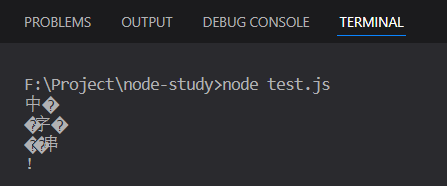

# Node入门——Buffer和Stream

## 数据结构化对象

主要分为三类：

1. 类型化数组（TypedArray）：在标准中即数组对象Array，在ES2017后引入了`Int8Array`、`Unit8Array`、`Float32Array`、`BigInt64Array`等对象
2. `ArrayBuffer`和`SharedArrayBuffer`
3. `DataView`

它们的转换关系如下：



### TypedArray

该对象描述一个底层的二进制数据缓冲区的一个类数组视图。

- `Int8Array`：二进制补码8位有符号整数的数组，因此范围是`0b10000000~0b01111111`（十进制`-128~127`）
- `Uint8Array`：二进制补码8位无符号整数的数组，因此范围是`0b00000000~0b11111111`（十进制`0~255`）
- `Float32Array`：32位浮点数型数组
- `BigInt64Array`：64位有符号整数组成的数组，初始化值为`0n`

```js
const arr1 = new Int8Array(4);
arr1[0] = 0b01111111;   // +最大
arr1[1] = 0b00000001;   // +最小
arr1[2] = 0b11111111;   // -最大
arr1[3] = 0b10000000;   // -最小
console.log(arr1);    // Int8Array(4) [ 127, 1, -1, -128 ]
console.log(arr1.length);   // 4
// 数组元素占几个字节
console.log(arr1.BYTES_PER_ELEMENT);  // 1
const arr2 = new Uint8Array(4);
arr2[0] = 0b00000000;   // 最小
arr2[1] = 0b11111111;   // 最大
console.log(arr2);  // Uint8Array(4) [ 0, 255, 0, 0 ]
console.log(arr2.length);   // 4
console.log(arr2.BYTES_PER_ELEMENT);  // 1
const arr3 = new Int16Array(4);
arr3[0] = 0b0111111111111111;
arr3[1] = 0b0000000000000001;
arr3[2] = 0b1111111111111111;
arr3[3] = 0b1000000000000000;
console.log(arr3);  // Int16Array(4) [ 32767, 1, -1, -32768 ]
console.log(arr3.length);   // 4
console.log(arr3.BYTES_PER_ELEMENT);  // 2
```

创建TypedArray数组的四种方式：

```js
// 1.创建长度为8的Int32数组
const arr1 = new Int32Array(8);
// 2.通过数组创建
const arr2 = new Int32Array([21, 22]);
// 3.通过其他TypedArray创建
const arr3 = new Int32Array(arr2);
// 4.通过ArrayBuffer创建，三个参数分别为buffer,byteOffset,length
const arr4 = new Int32Array(new ArrayBuffer(16), 0, 4);
```

至于一些具体的方法，这里不是重点，很多和Array类似。

### ArrayBuffer

`ArrayBuffer`对象用来表示通用的、固定长度的原始二进制数据缓冲区。

不能直接操作`ArrayBuffer`的内容，而是**要通过TypedArray或DataView对象来操作**，它们会将缓冲区中的数据表示为特定的格式，并通过这些格式来读写缓冲区的内容。

```js
const buffer = new ArrayBuffer(8);
console.log(buffer.byteLength);		// 8
```

### DataView

`DataView`视图是一个可以从二进制`ArrayBuffer`对象中读写多种数值类型的底层接口。

下面的view1和view2是针对于buffer的两个视图，buffer对它们俩是共享的，都能通过`view.buffer`访问到ArrayBuffer对象

```js
const buffer = new ArrayBuffer(8);
// 创建视图
const view1 = new DataView(buffer);
const view2 = new DataView(buffer, 4, 2);
// 将byteOffset为4后的2字节设置为0xFFFF，即1111111111111111
view1.setInt16(1, 0xFFFF);
console.log(view1.getInt16(0));  // 0xFFFF，即为-1
console.log(view2);
/*
DataView {
  byteLength: 2,
  byteOffset: 4,
  buffer: ArrayBuffer {
    [Uint8Contents]: <00 ff ff 00 00 00 00 00>,
    byteLength: 8
  }
}
*/
```
## Buffer

### Buffer实例化

- `Buffer.from()`
  - 传入字符串
  - 传入buffer，创建副本
  - 传入数字数组
  - 传入ArrayBuffer，共享内存
  - 传入支持valueOf或Symbol.toPrimitive的对象
    - `valueOf`：`Buffer.from(object.valueOf(), offsetOrEncoding, length)`
    - `Symbol.toPrimitive`：`Buffer.from(object[Symbol.toPrimitive]('string'), offsetOrEncoding)`
- `Buffer.alloc()`

```js
// 1.通过字符串创建buffer
const buf1 = Buffer.from('Hello', 'utf-8');
console.log(buf1);  // <Buffer 48 65 6c 6c 6f>
// 2.通过buffer创建副本buffer
const buf2 = Buffer.from(buf1);
console.log(buf2, buf1 === buf2);   // <Buffer 48 65 6c 6c 6f> false
// 3.通过数字数组创建buffer
const buf3 = Buffer.from([0x56, 0xff, 0xc3]);
console.log(buf3);  // <Buffer 56 ff c3>
// 4.与ArrayBuffer共享内存
const ab = new Int8Array([10, 16]);
const buf4 = Buffer.from(ab.buffer);
console.log(buf4);  // <Buffer 0a 10>
// 由于是共享内存，修改后Buffer也会跟着自动修改
ab[1] = 11;
console.log(buf4);  // <Buffer 0a 0b>
// 5.支持valueOf或Symbol.toPrimitive的对象，初始化Buffer
class Foo {
  [Symbol.toPrimitive]() {
    return 'this is a test';
  }
}
const buf5 = Buffer.from(new Foo())
console.log(buf5);  // <Buffer 74 68 69 73 20 69 73 20 61 20 74 65 73 74>
```

```js
/**
 * size: buffer大小
 * fill: 要填充的初始值
 * encoding: 如果fill是字符串，则这是它的字符编码，默认utf8
 */
const buf = Buffer.alloc(8,'ab','utf8')
console.log(buf);	// <Buffer 61 62 61 62 61 62 61 62>
```

### Buffer的一些操作

1.Buffer和String转换

```js
// 字符串--->Buffer
const buf1 = Buffer.from('test', 'utf8')
console.log(buf1);    // <Buffer 74 65 73 74>
// Buffer--->字符串
const str1 = buf1.toString();
const str2 = buf1.toString('hex');
console.log(str1, str2);    // test 74657374
```

2.Buffer拼接

```js
const buf1 = Buffer.from('a');
const buf2 = Buffer.from('b');
const buf3 = Buffer.from('c');
console.log(Buffer.concat([buf1, buf2, buf3]));   // <Buffer 61 62 63>
```

3.StringDecoder

在Node.js中汉字字符是由三个字节表示的，如果处理中文字符时候使用的3的倍数的字节数，就会造成字符拼接乱码问题。



使用 string_decoder 模块可以解决这个问题：

StringDecoder在得到编码后，知道宽字节在utf-8下占3个字节，所以在处理末尾不全的字节时，会保留到第二次write()。

```js{1,3,7}
const { StringDecoder } = require('string_decoder');
const buf = Buffer.from('中文字符串！');
const decoder = new StringDecoder('utf8');
for (let i = 0; i < buf.length; i += 5) {
  const b = Buffer.allocUnsafe(5);
  buf.copy(b, 0, i);
  console.log(decoder.write(b));
}
```

## Stream

### 基本概念

**流是对输入输出设备的抽象，是一组有序的、有起点和终点的字节数据传输手段**。

在Node.js中安装流动方向可以分为三种：

- 设备流向程序：readable
- 程序流向设备：writable
- 双向流动：duplex、transform

`pipe()`连接：流的加工器，如下面例子所示，流的方向：

`rs ---> lowercase`：`lowercase`在下游，所以`lower`需要是个writable流。
`lowercase ---> ws`：相对而言，`lowercase`又在上游，所以`lower`需要是个readable流。

因此`lowercase`必须是双向的流。

```js
const fs = require('fs');
const rs = fs.createReadStream('./test.txt');
const ws = fs.createWriteStream('./src/test.txt');
rs.pipe(lowercase).pipe(ws);
```

### 可读流

可读流是**生产数据**用来供程序消费的流。常见的数据生产方式有读取磁盘文件、读取网络请求内容等。

#### 自定义可读流

自定义可读流需要两步：

1. 继承Stream模块的Readable类。
2. **重写`_read()`方法**，调用`this.push`将生产的数据放入到待读取队列中。

注意：

- `_read()`方法有一个参数size，在暂停模式下指定应读取多少数据返回。
- `this.push`
  - 内容只能是字符串或Buffer，不能是数字
  - 第二个参数encoding指定字符串编码类型
  - `this.push(null)`用于标识数据读取完毕

```js
const { Readable } = require('stream');
class RandomNumberStream extends Readable {
  constructor(max) {
    super();
    this.max = max;
  }
  _read() {
    setTimeout(() => {
      if (this.max) {
        const randomNumber = parseInt(Math.random() * 1000);
        this.push(`${randomNumber}\n`);
        this.max = this.max - 1;
      } else {
        // 向缓存区push一个null用于暂停操作
        this.push(null);
      }
    }, 100)
  }
}
// 读取5个任意数，每个间隔0.1s，输出到控制台
const rns = new RandomNumberStream(5);
rns.pipe(process.stdout)
```

#### 两种读取模式和三种状态

在上面代码中用了setTimeout而不是setInterval，为啥？这就要引出两种读取模式呢，使用了`pipe()`设置为了流动模式，因而通过setTimeout也能实现重复定时效果。

两种模式：

- 流动模式：数据从底层系统读出，并**尽可能快**地提供给应用程序。
- 暂停模式：必须**显示地调用`read()`方法**来读取若干数据块【挤牙膏式读取数据】

两种模式是可以相互转换的：

- 暂停模式 → 流动模式
  - 通过添加data事件监听器来启动数据监听
  - 调用`resume()`方法，显示暂停可读流恢复发出`data`事件，进而切换到流动模式
  - 调用`pipe()`方法将数据转接到另一个可写流
- 流动模式 → 暂停模式
  - 在流没有`pipe()`时，调用`pause()`方法可以将流暂停
  - `pipe()`时移除所有`data`事件的监听，再调用`unpipe()`方法

三种状态：

- `readable.readableFlowing === null`：不提供使用流数据机制，因此流不会产生数据。
- `readable.readableFlowing === false`：调用`pause()`、`unpipe()`或接受backpressure导致可读流设置为false，暂停停止事件流动单不会停止数据生成。这种状态为`data`事件附加侦听器不会将状态切换为true。
- `readable.readableFlowing === true`：为`data`事件添加侦听器、调用`pipe()`或`resume()`方法将其状态设置为true，导致可读流开始主动发出事件。

1.流动模式

上述例子通过`pipe()`就是流动模式，当然也可以通过data事件方式。

当可读流生产出可供消费的数据后就会触发data事件，data事件监听器绑定后，数据会被尽可能地传递。

```js
const rns = new RandomNumberStream(5);
rns.on('data', chunk => {
  console.log(chunk);
})
rns.on('end', () => {
  console.log('done');
})
rns.on('error', (err) => {
  console.error(err);
})
```

2.暂停模式

Node.js提供了一个`readable`事件，当数据从流中读取或到达末尾时，将发出`readable`事件，如果数据可用，`stream.read()`将返回该数据。

```js
/**
 * 当read()函数返回值为null时候表示读取完成
 * 设置size为2，表示每次读取2个字节
 */
rns.on('readable', () => {
  let chunk;
  while ((chunk = rns.read(2)) !== null) {
    console.log(chunk);
  }
})
```

### 可写流

可写流是对数据流向设备的抽象，用来**消费上游流过来的数据**，通过可写流程序可以把数据写入设备，常见的是本地磁盘文件或者TCP、HTTP等网络响应。

#### 使用

之前提到通过监听可读流的data事件就能使可读流进入到流动模式中，我们在回调事件里调用了可写流的`write()`方法，这样数据就被写入了可写流抽象的设备中，也就是copy.txt文件。

`write()`有三个参数：

- `chunk`：表示要写入的数据
- `encoding`：字符编码
- `callback`：数据被写入之后的回调函数

```js
const fs = require('fs');
const rs = fs.createReadStream('./src/test.txt');
const ws = fs.createWriteStream('./copy.txt');

rs.setEncoding('utf-8');
rs.on('data', chunk => {
  ws.write(chunk);
});
```

#### 自定义可写流

自定义可写流需要两步：

1. 继承Stream模块的Writable类。
2. **重写`_write()`方法**。

```js
const { Writable } = require('stream');
class OutputStream extends Writable {
  // 和最终可写流暴露出来的write()方法一样，_write()方法有三个参数
  _write(chunk, encoding, callback) {
    process.stdout.write(chunk.toString().toUpperCase());
    process.nextTick(callback);
  }
}
// 实例化可写流
const wo = new OutputStream({
  objectMode: false,
  highWaterMark: 16,
  decodeStrings: true
})
```

实例化可写流有几个options可选，下面三个比较常用，除了这些还有[new stream.Writable([options])](https://nodejs.org/dist/latest-v19.x/docs/api/stream.html#new-streamwritableoptions)：

- `objectMode`：默认值false，设置为true时`writable.write()`方法除了string和buffer外，还可以写入任意JavaScript对象
- `highWaterMark`：每次最多写入的数据量，默认值为16，即16kb
- `decodeStrings`：是否把传入的数据转成Buffer，默认是true

方法：

- `write()`：当要求写入的数据大于可写流的 highWaterMark 的时候，数据不会被一次写入，有一部分数据被滞留。数据有滞留的话，返回 false，如果可以处理完就会返回 true。
- `end()`：没有其他数据需要写入，可写流可以关闭了。

事件：

- `pipe`：可读流调用pipe()方法时候触发
- `unpipe`：可读流调用unpipe()方法时候触发
- `drain`：当之前存在滞留数据，也就是 writeable.write() 返回过 false，经过一段时间的消化，处理完了积压数据，可以继续写入新数据的时候触发（drain 的本意即为排水、枯竭，挺形象的）
- `finish`、`error`：调用`end()`方法并且所有数据都被写入底层后才会触发。

#### back pressure

流不是一次性把所有数据载入内存处理，而是一边读一边写。但一般读取速度快于写入速度，那么pipe()方法是如何做到供需平衡的呢？

主要依赖下面三点：

1. 可读流有流动和暂停两种模式，可以通过 `pause()` 和 `resume()` 方法切换
2. 可写流的 `write()` 方法，每次可以处理多少是 highWatermark 决定的
3. 当可写流处理完了积压数据会触发 drain 事件

```js
const { Readable, Writable } = require('stream');
// 自定义可读流
class RandomNumberStream extends Readable {
  constructor(max) {
    super();
    this.max = max;
  }
  _read() {
    setTimeout(() => {
      if (this.max) {
        const randomNumber = parseInt(Math.random() * 1000);
        this.push(`${randomNumber}\n`);
        this.max = this.max - 1;
      } else {
        // 向缓存区push一个null用于暂停操作
        this.push(null);
      }
    }, 1000)
  }
}
// 自定义可写流
class OutputStream extends Writable {
  _write(chunk, encoding, callback) {
    // 写入数据
    process.stdout.write(chunk);
    process.nextTick(callback);
  }
}
const rns = new RandomNumberStream(10);
const os = new OutputStream({
  objectMode: false,
  highWaterMark: 8,
  decodeStrings: true,
});
// data事件是流动模式
rns.on('data', chunk => {
  // 当有数据滞留时，转换成暂停模式
  if (os.write(chunk) === false) {
    console.log('pause');
    rns.pause();
  }
});
// 如果有积压的数据，就触发drain事件，转换成流动模式
os.on('drain', () => {
  console.log('drain');
  rns.resume();
});
```


### 双工流

双流就是同时实现 Readable 和 Writable 流，在Node.js中双工流常用如下两种：

- Duplex
- Transform

#### Duplex

和可读流、可写流类似，实现双工流需要三步：

1. 继承 Duplex 类
2. 实现 _read() 方法
3. 实现 _write() 方法

```js
const { Duplex } = require('stream');
class MyDuplex extends Duplex {
  constructor(options) {
    super(options);
  }
  _write(chunk, encoding, callback) { }
  _read(size) { }
}
```

#### Transform

和Duplex对比两者区别：Duplex 虽然同时具备可读流和可写流，但**两者是相对独立的**；Transform 的**可读流的数据会经过一定的处理过程自动进入可写流。**

实现Transform转换流需要三步：

1. 继承 Transform 类
2. 实现 _transform() 方法
3. 实现 _flush() 方法

`_transform(chunk, encoding, callback)`：**不能直接调用，必须子类实现。**用来接收数据，并产生输出。在`_transform()`方法内部可以调用 `this.push(data)`生产数据，交给可写流，也可以不调用，意味这输入不会产生输出。

当数据处理完成后必须调用 `callback(err, data)`，err传递错误信息，data传入效果和 this.push(data) 一样。

```js
transform.prototype._transform = function (data, encoding, callback) {
  this.push(data);
  callback();
};
transform.prototype._transform = function (data, encoding, callback) {
  callback(null, data);
};
```

`_flush()`：**不能直接调用，必须子类实现。**当没有更多的写入数据被消耗时，但在触发 `end`事件以表示可读流结束之前，将调用此方法。

Transform 事件：

- `finish`：当调用`transform.end()`并且数据被`_transform()`处理完后会触发finish
- `end`：调用`_flush()`后所有数据输出完毕，触发end事件