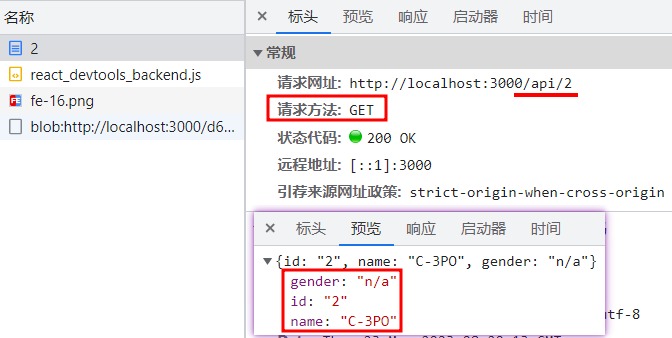

# Nextjs入门——路由

## 路由
### 路由路径

- `pages/blog/index.js` → `/blog`
- `pages/blog/first-post.js` → `/blog/first-post`
- `pages/blog/[slug].js` → `/blog/:slug` (比如：`/blog/hello-world`)
- `pages/[username]/settings.js` → `/:username/settings` (比如：`/foo/settings`)
- `pages/post/[...all].js` → `/post/*` (比如：`/post/2020/id/title`)

### 动态路由

可以使用`useRouter().query`来访问到动态路由的参数。

```tsx{2,3}
export default function Post({ posts }: { posts: Array<IBlog> }) {
    const router = useRouter()
    const { id, foo } = router.query
    return (
        <div>
            <p>Post：{ id } | { foo }</p>
            <p>{ JSON.stringify(posts) }</p>
        </div>
    )
}
```

如果页面是`pages/post/[pid].js`，那么query对象为：

- `/post/abc` → `{ "pid": "abc" }`
- `/post/abc?foo=bar` → `{ "foo": "bar", "pid": "abc" }`

如果页面是`pages/post/[pid]/[comment].js`，那么query对象为：

- `/post/abc/a-comment` → `{ "pid": "abc", "comment": "a-comment" }`

如果页面是`pages/post/[...slug].js`，那么query对象为：

- `/post` → 访问不到
- `/post/a/b/c/b` → `{ "slug": ["a", "b", "c", "b"] }`

如果页面是`pages/post/[[...slug]].js`，那么query对象为：

- `/post` → `{}`
- `/post/a/b/c/b` → `{ "slug": ["a", "b", "c", "b"] }`

### 浅层路由

浅层路由允许您更改URL，而无需再次运行数据获取方法，包括`getServerSideProps`、`getStaticProps`和`getInitialProps`。您将通过路由器对象（由`useRouter`或`withRouter`添加）接收更新的路径名和查询，而不会丢失状态。若要启用浅层路由，请将浅层选项设置为 true。请考虑以下示例：

```tsx
import { useEffect } from 'react'
import { useRouter } from 'next/router'
export default function Page() {
  const router = useRouter()

  useEffect(() => {
    router.push('/?counter=10', undefined, { shallow: true })
  }, [])

  useEffect(() => {
    // The counter changed!
  }, [router.query.counter])
}
```

## API路由

### 路由

API路由放在`pages/api`文件夹下。

1.普通路由

```tsx
import type { NextApiRequest, NextApiResponse } from 'next'

type Data = {
  name: string
  age: number
  sex: string
}

export default function handler(
  req: NextApiRequest,
  res: NextApiResponse<Data>
) {
  res.status(200).json({
    name: 'John Doe',
    age: 18,
    sex: '男'
  })
}
```

访问`http://localhost:3000/api/hello`，发送GET请求，就能获取返回的对象。

2.动态路由

在`pages/api/[id].ts`文件下：

```ts
import { NextApiRequest, NextApiResponse } from 'next'
type Person = {
  id: string
  name: string
  gender: string
}
type ResponseError = {
  message: string
}
const people: Array<Person> = [
  {
    id: '1',
    name: 'Luke Skywalker',
    gender: 'male',
  },
  {
    id: '2',
    name: 'C-3PO',
    gender: 'n/a',
  },
]
export default function personHandler(
  req: NextApiRequest,
  res: NextApiResponse<Person | ResponseError>
) {
  const { query } = req
  const { id } = query
  const person = people.find((p) => p.id === id)

  return person
    ? res.status(200).json(person)
    : res.status(404).json({ message: `User with id: ${id} not found.` })
}
```



::: tip
和普通路由一样，动态路由也支持捕获（`[...slug].js`）和可选捕获（`[[...slug]].js`）
:::

- `pages/api/post/create.js` → 将匹配`/api/post/create`
- `pages/api/post/[pid].js` → 将匹配`/api/post/1`、`/api/post/abc`等，但不匹配`/api/post/create`
- `pages/api/post/[...slug].js` → 将匹配`/api/post/1/2`、`/api/post/a/b/c`等，但不匹配`/api/post/create`、`/api/post/abc`

### API中间件

- `req.cookies`：包含请求的cookie对象，默认是`{}`
- `req.query`：包含查询字符串对象，默认是`{}`
- `req.body`：包含按内容类型解析的正文对象，如果未发送正文，默认是null

每个 API 路由都可以导出（export）一个用以更改默认配置 config 对象，如下所示：

```ts
export const config = {
  api: {
    bodyParser: {
      sizeLimit: '1mb',
    },
  },
}
```

可以另外写中间件，比如：

```js
import Cors from 'cors'

// 初始化cors中间件
const cors = Cors({
  methods: ['GET', 'HEAD'],
})

function runMiddleware(req, res, fn) {
  return new Promise((resolve, reject) => {
    fn(req, res, (result) => {
      if (result instanceof Error) {
        return reject(result)
      }
      return resolve(result)
    })
  })
}

async function handler(req, res) {
  // 运行中间件
  await runMiddleware(req, res, cors)
  res.json({ message: 'Hello Everyone!' })
}

export default handler
```

::: tip
如果想对req和res标注TS类型，则分别为`NextApiRequest`和`NextApiResponse`，不建议继承扩展。
:::

### 响应对象

- `res.status(code)`：设置状态代码的函数。代码必须是有效的HTTP状态代码。
- `res.json(body)`：发送JSON响应。body必须是可序列化的对象。
- `res.send(body)`：发送HTTP响应。body可以是字符串、对象或缓冲区。
- `res.redirect([status，] path)`：重定向到指定的路径或URL，状态必须是有效的HTTP状态代码。如果未指定，则状态默认为307（临时重定向）。