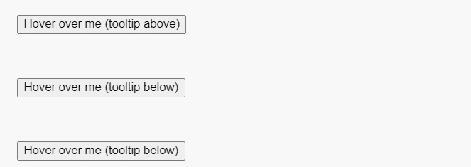
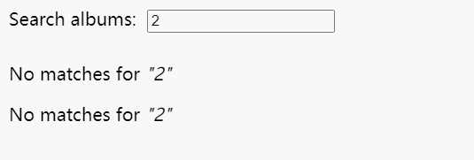
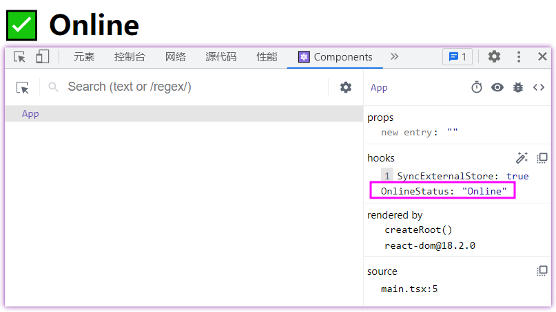

# React入门——API

## Components

### `<Fragment>`

作用：让多个元素不用节点包裹。

```jsx
function Post() {
  return (
    <>
      <PostTitle />
      <PostBody />
    </>
  );
}
```

::: danger
警告：

- 隐式语法`<></>`不能传入key，要使用key必须用`<Fragment key={yourKey}></Fragment>`。
- `<><Child /></>`变成`<Child />`是不触发重置状态的，但`<><><Child /></></>`变成`<Child />`是触发的。
:::

### `<Profiler`

作用：允许以编程方式测量React树的渲染性能。

```jsx
export default function App() {
  /**
   * 渲染相关信息
   * @param id Profiler构成的树的标记id
   * @param phase "mount", "update" or "nested-update"。让你知道树是刚挂载还是重新渲染的
   * @param actualDuration 花费渲染<Profiler>及其节点的时间
   * @param baseDuration 估算在没有任何优化下重新渲染<Profiler>整个子树所花时间
   * @param startTime 渲染当前更新的时间戳
   * @param commitTime 提交当前更新的时间戳
   */
  function onRender(id, phase, actualDuration, baseDuration, startTime, commitTime) {
    console.log(id, phase, actualDuration, baseDuration, startTime, commitTime)
  }
  return (
    <Profiler id="test" onRender={onRender}>
      <Chat />
    </Profiler>
  );
}
```

### `<StrictMode>`

作用：严格模式，允许你在开发早期发现组件常见错误。

```jsx
ReactDOM.createRoot(document.getElementById('root') as HTMLElement).render(
  <React.StrictMode>
    <App />
  </React.StrictMode>,
)
```

::: danger
警告：

- 无法再包裹的树内选择退出严格模式`<StrictMode`。
:::

### `<Suspense>`

作用：允许显示回退，直到其子级加载完成

下面例子中Albums是异步组件，并不能马上渲染完成，这时候就先展示Loading组件，等Albums渲染完成后再展示它。

```jsx
function Loading() {
  return <h2>🌀 Loading...</h2>;
}
export default function ArtistPage({ artist }) {
  return (
    <>
      <h1>{artist.name}</h1>
      <Suspense fallback={<Loading />}>
        <Albums artistId={artist.id} />
      </Suspense>
    </>
  );
}
```

::: danger
警告：

- 如果Suspense显示了树的内容之后又被挂起，则会再次展示fallback组件。当然是有例外的，更新由`startTransition`或`useDeferredValue`引起的。
- 如果React因为再次挂起而需要隐藏已经可见的内容，它将清理内容树中的布局效果。当内容准备好再次显示时，React将再次触发布局效果，这使您可以确保测量 DOM 布局的效果在隐藏内容时不会尝试执行此操作。
:::

## Hooks

### useMemo

作用：在重新渲染期间缓存计算结果。

```jsx
const cachedValue = useMemo(calculateValue, dependencies)
```

- 返回值：
  - cachedValue：缓存值
- 传参：
  - calculateValue：计算要缓存值的函数。要求是纯函数，返回任意类型。
  - dependencies：依赖项。

::: danger
警告：

- useMemo是一个Hook，因此只能再组件顶层或自定义的Hooks调用。不能再循环或条件语句中使用。
- 严格模式下，React会调用计算函数两次，这种行为仅限于开发环境。
:::

```jsx
import { useMemo } from 'react';
function TodoList({ todos, tab, theme }) {
  const visibleTodos = useMemo(() => filterTodos(todos, tab), [todos, tab]);
  // ...
}
```
首次渲染，visibleTodos的值来自useMemo中计算函数的调用。在后续渲染中，如果依赖项都没发生更改，useMemo返回之前已经计算的值，否则重新运行计算函数并返回新值。

useMemo在重新渲染期间计算缓存结果，直到其依赖项更改。

### useCallback

作用：在重新渲染期间缓存函数定义。

```jsx
const cachedFn = useCallback(fn, dependencies);
```

- 返回值：
  - cachedFn：存储的fn函数
- 传参：
  - fn：要缓存的函数值。可以接受任何参数并返回任何值。
  - dependencies：依赖项。


::: danger
警告：

- useCallback是一个Hook，因此只能再组件顶层或自定义的Hooks调用。不能再循环或条件语句中使用。
:::

```jsx
const ShippingForm = memo(function ShippingForm({ onSubmit }) {
  // ...
})
export default function ProductPage({ productId, referrer, theme }) {
  const handleSubmit = useCallback((orderDetails) => {
    post('/product/' + productId + '/buy', {
      referrer,
      orderDetails,
    });
  }, [productId, referrer]);

  return (
    <div className={theme}>
      <ShippingForm onSubmit={handleSubmit} />
    </div>
  );
}
```

在上面例子中，ShippingForm假如渲染特别慢，那么如果没有useCallback + memo，当theme值改变时候仍要忍受这种慢。但如果使用了，由于productId和referrer没有改变，因此handleSubmit函数还是使用先前缓存值，因而当theme发生修改时不会触发ShippingForm的重新渲染，大大增加交互速度。

::: tip
useCallback和useMemo它们很像，甚至可以相互转换。useMemo如果返回函数，则和useCallback效果是相同的。

```js
// useMemo
const handleSubmit = useMemo(() => {
  return (orderDetails) => {
    post('/product/' + product.id + '/buy', {
      referrer,
      orderDetails
    });
  };
}, [productId, referrer]);

// useCallback
const handleSubmit = useCallback((orderDetails) => {
  post('/product/' + product.id + '/buy', {
    referrer,
    orderDetails
  });
}, [productId, referrer]);
```
:::

### useLayoutEffect

作用：**在浏览器重新绘制屏幕前触发**的useEffect版本。

::: danger
警告：

- useLayoutEffect是一个Hook，因此只能再组件顶层或自定义的Hooks调用。不能再循环或条件语句中使用。
- 使用严格模式，React将在第一次真正设置前运行一个额外开发专用设置清理周期。
- useLayoutEffect中的代码以及从中调度的所有状态更新会阻止浏览器重新绘制屏幕。如果过度使用，会使应用程序变得非常慢，尽量还是使用useEffect。
- 效果仅在客户端上运行，不会再服务器渲染期间运行。
:::

在一些速度较慢的设备，如果等到浏览器绘制完成再触发Effects，会有一瞬间闪烁，这时候用useLayoutEffect，让副作用在浏览器绘制前就触发。



### useInsertionEffect

作用：**在任何DOM突变前触发**的useEffect版本。

::: danger
警告：

- 效果仅在客户端上运行，不会再服务器渲染期间运行。
- 无法在useInsertionEffect内部更新状态。
- useInsertionEffect运行时，refs还没有附加，DOM也还没更新。
:::

这个Hook是不常用的。

useInsertionEffect可以帮助解决CSS-in-JS注入问题，如`<div style={ { opacity: 1} }>`。

```jsx
// Inside your CSS-in-JS library
let isInserted = new Set();
function useCSS(rule) {
  useInsertionEffect(() => {
    // As explained earlier, we don't recommend runtime injection of <style> tags.
    // But if you have to do it, then it's important to do in useInsertionEffect.
    if (!isInserted.has(rule)) {
      isInserted.add(rule);
      document.head.appendChild(getStyleForRule(rule));
    }
  });
  return rule;
}

function Button() {
  const className = useCSS('...');
  return <div className={className} />;
}
```

### useSyncExternalStore

作用：订阅外部存储。

```js
const snapshot = useSyncExternalStore(subscribe, getSnapshot, getServerSnapshot?)
```

- 返回值：
  - snapshot：当前参与存储的快照
- 传参：
  - subscribe：订阅存储的函数，当存储源发生变化时候，调用该函数，这个过程会导致组件重新渲染。
  - getSnapshot：返回组件所需存储中快照的函数。
  - getServerSnapshot：可选，返回存在中数据的初次快照函数。

::: danger
警告：

- getSnapshot返回的存储快照必须是不可变的，如果存储具有可变数据，则在数据更改时返回新的不可变快照，否则返回缓存的最后一个快照。
- 如果在渲染期间传递不同订阅函数，React将使用新传递的订阅函数来订阅存储源。可以通过在组件外部声明订阅来防止这种情况。
:::

```js
function getSnapshot() {
  return navigator.onLine;
}
function subscribe(callback) {
  window.addEventListener('online', callback);
  window.addEventListener('offline', callback);
  return () => {
    window.removeEventListener('online', callback);
    window.removeEventListener('offline', callback);
  };
}
// useOnlineStatus钩子函数返回isOnline字段，用于获取当前网络是否连接
export function useOnlineStatus() {
  const isOnline = useSyncExternalStore(subscribe, getSnapshot);
  return isOnline;
}
```

### useImperativeHandle

作用：自定义作为ref暴露的句柄。

```jsx
useImperativeHandle(ref, createHandle, dependencies?)
```
- 返回值：undefined
- 传参：
  - ref：从`forwardRef`渲染函数接收到的第二个参数
  - createHandle：不带参数的函数，返回要公开的ref句柄。可以是任何类型，通常返回一个带有想要公开方法的对象。
  - dependencies：依赖项

forwardRef的基本用法大概如下，通过forwardRef转发父组件传过来了的ref到具体的子组件某个元素上：

```jsx
const MyInput = forwardRef(function MyInput(props, ref) {
  return <input {...props} ref={ref} />;
});
```

在上面代码中，`<MyInput ref={ref}/>`中的ref会接收到`<input>`DOM节点。然而，可以使用useImperativeHandle钩子去暴露自定义值。

在下面代码中，通过useImperativeHandle向外部暴露了`focus`和`scrollIntoView`方法。

```jsx
const MyInput = forwardRef(function MyInput(props, ref) {
  const inputRef = useRef(null);

  useImperativeHandle(ref, () => {
    return {
      focus() {
        inputRef.current.focus();
      },
      scrollIntoView() {
        inputRef.current.scrollIntoView();
      },
    };
  }, []);

  return <input {...props} ref={inputRef} />;
});

export default function Form() {
  const ref = useRef(null);
  function handleClick() {
    // 通过ref.current获取到对象，进而调用暴露的方法
    ref.current.focus();
    // 因为DOM没有暴露，因此下面语句执行不起作用
    // ref.current.style.opacity = 0.5;
  }
  return (
    <form>
      <MyInput label="Enter your name:" ref={ref} />
      <button type="button" onClick={handleClick}>
        Edit
      </button>
    </form>
  );
}
```

### useId

作用：生成能访问的唯一ID。

- 返回值：特有的ID，字符串类型
- 传参：无

在HTML中，可能会写如下代码：

```html
<label>
  Password:
  <input
    type="password"
    aria-describedby="password-hint"
  />
</label>
<p id="password-hint">
  The password should contain at least 18 characters
</p>
```

注意这里的`aria-describedby`和`id`是相同的，这里我们可以尝试把它们单独抽离出来，但有个问题，id必须保持在整个页面全局是唯一的，通过useId生成唯一的ID。

在两个地方分别使用PasswordField，两个组件的`aria-describedby`和`id`全部都是相同的。

```jsx
function PasswordField() {
  const passwordHintId = useId();
  return (
    <>
      <label>
        Password:
        <input
          type="password"
          aria-describedby={passwordHintId}
        />
      </label>
      <p id={passwordHintId}>
        The password should contain at least 18 characters
      </p>
    </>
  );
}

export default function App() {
  return (
    <>
      <h2>Choose password</h2>
      <PasswordField />
      <h2>Confirm password</h2>
      <PasswordField />
    </>
  );
}
```

### useTransition

作用：让你不用阻塞UI更新State。

```js
const [isPending, startTransition] = useTransition()
```

- 返回值：
  - isPending：告知是否有准备的过渡。
  - startTransition：是个回调函数，标记一个状态改变为过渡。
    - 返回值：无
    - 传参：
      - scope：通过一个个setter函数更新状态。在scope函数作为过渡调用期间，React立即调用scope并标记所有同步调度状态更新。
- 传参：无

::: danger
警告：

- 只能在组件内部或自定义Hooks中调用
- 放入到转换的前提是在该处本来就能访问到setter函数
- **传递给startTransition的函数必须是同步的**，React会立即执行这个函数，在执行时将所有发生的状态更新标记为转换。
- 标记为转换的状态更新可能会被其他状态更新中断。
- **转换更新不能用于文本输入**。
- 如果有多个正在进行的转换，React当前会将它们批处理在一起。*这个限制可能会在未来的版本中被移除*。
:::

```jsx{2,6-8,10-13}
export default function TabContainer() {
  const [isPending, startTransition] = useTransition();
  const [tab, setTab] = useState('about');

  function selectTab(nextTab) {
    startTransition(() => {
      setTab(nextTab);      
    });
  }
  // 过渡未加载完成时展示这部分
  if (isPending) {
    return <b className="pending">正在加载中...</b>;
  }
  return (
    <>
      <TabButton isActive={tab === 'about'}
        onClick={() => selectTab('about')}
      >
        About
      </TabButton>
      <TabButton
        isActive={tab === 'posts'}
        onClick={() => selectTab('posts')}
      >
        Posts (slow)
      </TabButton>
      <TabButton
        isActive={tab === 'contact'}
        onClick={() => selectTab('contact')}
      >
        Contact
      </TabButton>
      <hr />
      {tab === 'about' && <AboutTab />}
      {tab === 'posts' && <PostsTab />}
      {tab === 'contact' && <ContactTab />}
    </>
  );
}
```

### useDeferredValue

作用：让你推迟一部分UI更新。

```js
const deferredValue = useDeferredValue(value)
```

- 返回值：
  - deferredValue：在初次渲染期间，返回的延迟值和提供值相同；在更新期间，React将首先尝试旧值重新渲染，然后尝试使用新值在后台重新渲染。
- 传参：
  - value：想要推迟的值

::: danger
警告：

- 传递给useDeferredValue的应该是原始值或渲染外创建的对象。如果在渲染期间创建新对象并立即传给useDeferredValue，则每次渲染会有所不同，从而导致不必要的重新渲染。
- 当useDeferredValue接收到不同的值，除了当前渲染外，还会安排在后台使用新值重新渲染。后台重新渲染是可中断的，如果该值又另一个更新，React将从头开始重新启动后台重新渲染。
- useDeferredValue与`<Suspense`集成，如果心智引起后台更新暂停了UI，用户将看不到回退。在数据加载之前他们将一直看到旧的延迟值。
- useDeferredValue本身并不能阻止额外的网络请求。
- useDeferredValue本身没有造成固定延迟，一旦完成原始重新渲染，React将立即开始使用新的延迟值进行后台重新渲染，但由时间引起的任何更新都会中断后台重新渲染并由于它。
:::

```jsx
export default function App() {
  const [query, setQuery] = useState('');
  const deferredQuery = useDeferredValue(query);
  return (
    <>
      <label>
        Search albums:
        <input value={query} onChange={e => setQuery(e.target.value)} />
      </label>
      <Suspense fallback={<h2>Loading...</h2>}>
        <SearchResults query={query} />
      </Suspense>
      <Suspense fallback={<h2>Loading...</h2>}>
        <SearchResults query={deferredQuery} />
      </Suspense>
    </>
  );
}
```



::: warn
注意第一次输入和删除后第二次输入，效果是不一样的，因为第二次输入是有缓存的。
:::

### useDebugVlaue

作用：允许你在React DevTools中自定义Hook添加标签。

```js
useDebugValue(value, format?)
```

- 返回值：
- 传参：
  - value：想要展示在React DevTools的值，可以是任何类型。
  - format：可选，格式化函数。

```jsx
function subscribe(callback) {
  window.addEventListener('online', callback);
  window.addEventListener('offline', callback);
  return () => {
    window.removeEventListener('online', callback);
    window.removeEventListener('offline', callback);
  };
}
function useOnlineStatus() {
  const isOnline = useSyncExternalStore(subscribe, () => navigator.onLine, () => true);
  useDebugValue(isOnline ? 'Online' : 'Offline');
  return isOnline;
}

export default function App() {
  const isOnline = useOnlineStatus();
  return <h1>{isOnline ? '✅ Online' : '❌ Disconnected'}</h1>
}
```



## APIs

### craeteContext

作用：创建context，让组件提供或读取。

```jsx
const SomeContext = createContext(defaultValue)
```

- 返回值：
  - SomeContext：对象
    - SomeContext.Provider：提供者
    - SomeContext.Consumer：消费者
- 传参：
  - defaultValue：传入的context值

定义context：

```jsx
export const ThemeContext = createContext<'light' | 'dark'>('light')
```

提供者：

```jsx
export default function App() {
  return (
    <ThemeContext.Provider value='light'>
      <Child />
    </ThemeContext.Provider>
  )
}
```

消费者：

```jsx
// 方式一：使用useContext
function Child() {
  const theme = useContext(ThemeContext)
  return (
    <div className="RowList">
      <h4>Child元素</h4>
      <p>主题色：{theme}</p>
    </div>
  );
}
// 方式二：旧方式，使用Context.Consumer
function Child() {
  return (
    <ThemeContext.Consumer>
      {theme => (
        <>
          <h4>Child元素</h4>
          <p>主题色：{theme}</p>
        </>
      )}
    </ThemeContext.Consumer>
  )
}
```

### forwardRef

作用：通过ref将DOM节点暴露给父组件。

```js
const SomeComponent = forwardRef(render)
```

- 返回值：
  - SomeComponent：能在JSX渲染的组件。
- 传参：
  - render：组件渲染函数
    - 返回值：能在JSX渲染的组件
    - 传参：`(props, ref)`

```jsx
const MyInput = forwardRef(function MyInput(props, ref) {
  return (
    <label>
      {props.label}
      <input ref={ref} />
    </label>
  );
});
```

::: tip
forwardRef还能和useImperativeHandle联用。
:::

### memo

作用：当props没有发生变化时候，让你跳过组件重新渲染。

```js
const MemoizedComponent = memo(SomeComponent, arePropsEqual?)
```

- 返回值：
  - MemoizedComponent：返回新的React组件，和SomeComponent作用相同。
- 传参：
  - SomeComponent：想要缓存的任何组件，包括函数组件和forwardRef组件也是接受的。
  - arePropsEqual：回调函数，接收两个参数，组件旧props和新props，如果两者相等则返回true，否则返回false。

在下面例子中，更新源有三个：父组件的state，父组件传值，context。

正常情况下，三者任何一个发生更新，子组件Child都会更新。但**当使用`memo`后，父组件State更新并没有触发子组件更新**，父组件传值和context更新才会触发子组件Child更新。

```jsx
import { memo, useContext, useState } from 'react';
import { ThemeContext } from './context'
const Child = memo(({ name }: { name: string }) => {
  console.log('Child was rendered at', new Date().toLocaleTimeString());
  const theme = useContext(ThemeContext)
  return <>
    <p>{name}</p>
    <p>{theme}</p>
  </>
})
export default function App() {
  const [person, setPerson] = useState({ name: 'Alice', address: 'China' });
  const [theme, setTheme] = useState<'light' | 'dark'>('light')
  return (
    <ThemeContext.Provider value={theme}>
      <input value={person.name} onChange={() => setPerson({
        ...person,
        name: person.name + 'h'
      })} />
      <input value={person.address} onChange={() => setPerson({
        ...person,
        address: person.address + 'x'
      })} />
      <button onClick={() => setTheme(theme === 'light' ? 'dark' : 'light')} >Change theme</button>
      <Child name={person.name} />
    </ThemeContext.Provider>
  )
}
```

### lazy

作用：直到第一次渲染前允许你延迟加载组件代码。

```js
const SomeComponent = lazy(load)
```

- 返回值：
  - SomeComponent：React组件，处于加载时可以用`<Suspense>`展示加载组件。
- 传参：
  - load：函数类型，返回Promise或其他thenable。直到第一次尝试渲染返回的组件，React都不会调用load函数。在第一次调用加载后，解析并呈现为React组件。返回Promise和解析值都会被缓存，因此React不会多次调用load函数。如果Promise拒绝则抛出拒绝原因，让最近的错误边界处理它。

```jsx
import { useState, Suspense, lazy } from 'react';
const Loading = () => {
  return <p><i>Loading...</i></p>;
}
const MarkdownPreview = lazy(() => import('./MarkdownPreview.js'));

export default function MarkdownEditor() {
  const [showPreview, setShowPreview] = useState(false);
  const [markdown, setMarkdown] = useState('Hello, **world**!');
  return (
    <>
      <textarea value={markdown} onChange={e => setMarkdown(e.target.value)} />
      <label>
        <input type="checkbox" checked={showPreview} onChange={e => setShowPreview(e.target.checked)} />
        Show preview
      </label>
      <hr />
      {showPreview && (
        <Suspense fallback={<Loading />}>
          <h2>Preview</h2>
          <MarkdownPreview markdown={markdown} />
        </Suspense>
      )}
    </>
  )
}
```


### startTransition

作用：在不用阻塞UI情况下更新State，常常和useTransition联用。

```js
startTransition(scope)
```

