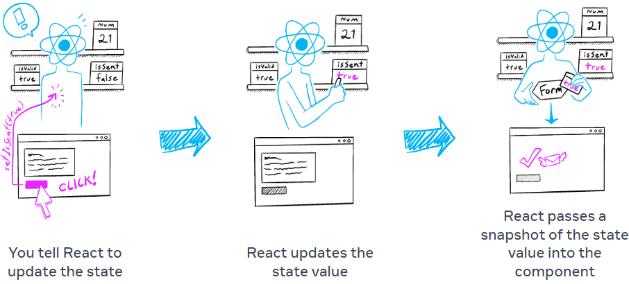

# React入门——添加交互

## 事件响应

### 事件处理器的基本用法

定义一个`handleClick`事件处理函数，然后以prop形式传入给`<button>`。

- 常常定义在组件内部
- 约定以`handle`命名开头，后面接事件名

```jsx
export default function Button() {
  function handleClick() {
    alert('You clicked me!');
  }

  return (
    <button onClick={handleClick}>
      Click me
    </button>
  );
}
```

::: danger
必须以函数形式传入，而不是调用。传入函数的形式会告诉React记住它并只在用户点击时调用，调用函数形式会在渲染时期立即调用，不用点击。

| 传入函数 | 调用函数 |
| --- | --- |
| `<button onClick={handleClick}>` | `<button onClick={handleClick()}>` |
| `<button onClick={() => alter('...')}>` | `<button onClick={alert('...')}>` |
:::

因为事件处理器声明在组件内部，因此它们能访问到组件的props。

### 将事件处理器以props传入

在下面例子中，Toolbar组件进行了一层封装，让传入的onPlayMovie和onUploadImage事件间接触发onClick，从App组件的角度看，根本不用关系Toolbar内部做了哪些处理。

在React中，函数可以像变量一样传入到组件中，然后可以在子组件中调用，也可以传给孙组件。

```jsx
function Button({ onClick, children }) {
  return (
    <button onClick={onClick}>
      {children}
    </button>
  );
}
function Toolbar({ onPlayMovie, onUploadImage }) {
  return (
    <div>
      <Button onClick={onPlayMovie}>
        Play Movie
      </Button>
      <Button onClick={onUploadImage}>
        Upload Image
      </Button>
    </div>
  );
}
export default function App() {
  return (
    <Toolbar
      onPlayMovie={() => alert('Playing!')}
      onUploadImage={() => alert('Uploading!')}
    />
  );
}
```

### 事件传播

在React中，也是有事件传播机制的，即捕获和冒泡。

```jsx
function Button({ onClick, children }) {
  return (
    <button onClick={e => {
      e.stopPropagation();
      onClick();
    }}>
      {children}
    </button>
  );
}

export default function Toolbar() {
  return (
    <div className="Toolbar" onClick={() => {
      alert('You clicked on the toolbar!');
    }}>
      <Button onClick={() => alert('Playing!')}>
        Play Movie
      </Button>
      <Button onClick={() => alert('Uploading!')}>
        Upload Image
      </Button>
    </div>
  );
}
```

可以在事件处理程序中通过调用`e.stopPropagation()`来停止事件传播。

可以在事件处理程序中通过调用`e.preventDefault()`来阻止浏览器默认行为。

## State

### 在组件中使用useState

```jsx
import { useState } from 'react';
import { sculptureList } from './data.js';

export default function Gallery() {
  // let index = 0;
  const [index, setIndex] = useState(0);
  function handleClick() {
    setIndex((index + 1) % 12);
  }
  const sculpture = sculptureList[index];
  return (
    <>
      <button onClick={handleClick}>Next</button>
      <h2><i>{sculpture.name} </i> by {sculpture.artist}</h2>
      <h3>({index + 1} of {sculptureList.length})</h3>
      
      <p>{sculpture.description}</p>
    </>
  );
}
```

为何使用State而不是定义变量？如果上述例子定义使用的是`let index = 0;`而不是hooks，则会发现点击Next后并没有变化。有两件事阻止这种变化的可见：

1. 局部变量在渲染期间不会保留，当React第二次渲染这个组件时，它会从头开始渲染，不考虑局部变量的任何修改。
2. 对局部变量的更改不会触发渲染，React没有意识到它需要使用新数据再次渲染组件。

因此要使用新数据更新组件，需要做两件事：

1. 在渲染之间保留数据
2. 使用新数据触发新的组件渲染

这也是useState做的事：

1. 用于在渲染之间保留数据状态变量
2. 定义`setter`函数去更新或触发React组件再次渲染

::: tip
State是孤立和私有的，如果在App组件中多次调用`Gallery`组件，各个之间是相互独立、分开存储的。
:::

### useState的约定

useState的可填值：

- 初始值
- state变量
- state setter函数：更新state变量并触发React再次渲染组件

```jsx
const [index, setIndex] = useState(0);
```

1. 组件第一时间渲染。传入0给useState作为初始值，它就会返回`[0, setIndex]`，React记住0是最近的state值。
2. 更新state。当用户触发事件时候会调用state setter函数，`setIndex(index + 1)`会告诉React记住index是1并触发另一次渲染。
3. 组件二次渲染。useState返回为`[1, setIndex]`。
4. 以此类推。

## Render和Commit

### 触发渲染

组件渲染有两种情况：初始渲染和已渲染过的再次渲染。

初始渲染：当启动app时需要触发初始渲染，它是以目标DOM节点调用`createRoot`，然后调用它的`render`方法：

```jsx
import Image from './Image.js';
import { createRoot } from 'react-dom/client';

const root = createRoot(document.getElementById('root'))
root.render(<Image />);
```

再次渲染：当state触发更新时候会再次渲染，更新组件state的渲染会自动放入到队列中。

### 渲染组件

触发渲染后，React会调用组件来确认在屏幕上展示的内容。`Rendering`是React调用你的组件。

- 初次渲染：调用根组件
- 再次渲染：调用器组件更新触发渲染的函数组件

这个操作是递归的，如果更新的组件返回其他组件，React就会渲染其他组件，以此类推。该过程会一直持续，直到不再有嵌套组件并且React确切知道在屏幕上展示啥。

### 提交修改到DOM

渲染组件后，React会修改DOM。

- 初次渲染：使用`appendChild()`DOM API去在屏幕上放置DOM节点
- 再次渲染：使用最小化的必要操作区让DOM匹配最近的渲染输出

**React只会在渲染有不同时才修改DOM**。比如在下面例子中，time值会随着时间动态变化，但`<input />`内的值不会，这是因为input内容前后渲染在位置上是相同的。

```jsx
export default function Clock({ time }) {
  return (
    <>
      <h1>{time}</h1>
      <input />
    </>
  );
}
```

## State作为快照

state的行为更像是快照，设置它不会改变已有的state变量，但触发再次渲染可以。

`Rendering`意思是React正在调用函数组件，函数返回的JSX像一个UI快照，它的props、事件处理器和本地变量都在渲染的某个时刻计算。

不像照片和电影，UI快照是可交互的，它包括事件处理程序等逻辑，用于指定响应输入时发生的情况。React之后更新屏幕来匹配快照和连接事件处理器。最终，按下按钮会触发JSX的click处理。

当React再次渲染组件时：

1. React再次调用函数
2. 函数返回新的JSX快照
3. React之后更新屏幕来匹配返回的快照



```jsx
import { useState } from 'react';
export default function Counter() {
  const [number, setNumber] = useState(0);
  return (
    <>
      <h1>{number}</h1>
      <button onClick={() => {
        setNumber(number + 1);
        setNumber(number + 1);
        setNumber(number + 1);
      }}>+3</button>
    </>
  )
}
```

比如在上面代码中，执行了3次`setNumber(number + 1)`，但最终结果还是+1。

设置的state只为下次渲染改变。第一次渲染，number是0，接下来点击按钮后执行如下：

1. `setNumber(number + 1)`：number是0，React准备将number修改为1准备下次渲染。
2. `setNumber(number + 1)`：number是0，React准备将number修改为1准备下次渲染。
3. `setNumber(number + 1)`：number是0，React准备将number修改为1准备下次渲染。

即使调用了3次，它的渲染事件处理器number总是0，因此设置了三次1，这也是为啥在事件处理结束后，React再次渲染组件number值等于1。

state变量的值**在渲染中永远不会改变**，即使它的事件处理程序是异步的，在下面例子中即使包裹在`setTimeout`中，3秒后依然打印出0。

```jsx
import { useState } from 'react';
export default function Counter() {
  const [number, setNumber] = useState(0);
  return (
    <>
      <h1>{number}</h1>
      <button onClick={() => {
        setNumber(number + 5);
        setTimeout(() => {
          alert(number);
        }, 3000);
      }}>+5</button>
    </>
  )
}
```

## 将一系列State更新排队

**React会在执行state更新前等待，直到所有在事件处理器中的代码运行**，这也是为啥再次渲染只发生在所有setter函数调用后。

这个类似于在餐馆点菜，点好多菜，完成订单后，服务员才会提交到厨房。

这个特质让你可以在更新多个状态变量的同时不触发太多重复渲染，但也意味着在事件处理程序完成前，UI不会更新。这种行为，称为**批处理**。

React不会对多个有意的事件进行批处理，例如点击操作，每个点击都是单独处理的。React仅在通常安全的情况下才进行批处理，这确保了如果第一次单击按钮禁用了表单，则第二次单击不会再次提交它。

当然，有没有在下一次渲染前多次更新相同的状态变量，而不是像`setNumber(number + 1)`呢？你可以传递一个函数，根据队列中前一个状态计算下一个状态，如`setNumber(n => n + 1)`，这是这是一种告诉React“对状态做某事”而不仅仅是替换它的方法。

在下面这个例子中，点击按钮，会+3的：

```jsx
import { useState } from 'react';
export default function Counter() {
  const [number, setNumber] = useState(0);
  return (
    <>
      <h1>{number}</h1>
      <button onClick={() => {
        setNumber(n => n + 1);
        setNumber(n => n + 1);
        setNumber(n => n + 1);
      }}>+3</button>
    </>
  )
}
```

当然，这还没完，两种方式还可以结合：

结合一：

```jsx
<button onClick={() => {
  setNumber(number + 5);
  setNumber(n => n + 1);
}}>
```

1. `setNumber(number + 5)`：number是0，React将"用5替换"放入队列
2. `setNumber(n => n + 1)`：是个更新函数，将函数放入队列

因此执行后，最终结果是6，React存储6作为最终结果和返回useState。

结合二：

```jsx
<button onClick={() => {
  setNumber(number + 5);
  setNumber(n => n + 1);
  setNumber(42);
}}>
```

1. `setNumber(number + 5)`：number是0，React将"用5替换"放入队列
2. `setNumber(n => n + 1)`：是个更新函数，将函数放入队列
3. `setNumber(42)`：将"用42替换"放入队列

因此执行后，最终结果是42，React存储42作为最终结果和返回useState。

总结下，传入`setNumber`的值有两种：

- 更新函数：将函数加入到队列中
- 任何值：将"替换n"加入到队列中，忽略已排队内容

在事件处理程序执行完成后，React将触发重新渲染。在重新渲染期间，React将处理队列，更新函数运行在渲染期间，因此**更新函数必须是纯函数**并且只返回结果。不要尝试在里面设置state或运行其他副作用。在严格模式下，React将运行每个更新程序函数两次（但丢弃第二个结果）以帮助您查找错误。

## 在State中更新对象

number、string、boolean等类型的值是immutable的，只能通过setter函数来更新值。

但对象本身就是mutable的，比如`position.x = 5`操作，对象引用没有改变，对象本身发生改变了。

在React中，建议将对象也当作immutable的。

看下面这个例子：

```jsx
import { useState } from 'react';
export default function MovingDot() {
  const [position, setPosition] = useState({
    x: 0,
    y: 0
  });
  return (
    <div
      onPointerMove={e => {     // [!code error]
        position.x = e.clientX; // [!code error]
        position.y = e.clientY; // [!code error]
      }}                        // [!code error]
      style={{
        position: 'relative',
        width: '100vw',
        height: '100vh',
      }}>
      <div style={{
        position: 'absolute',
        backgroundColor: 'red',
        borderRadius: '50%',
        transform: `translate(${position.x}px, ${position.y}px)`,
        left: -10,
        top: -10,
        width: 20,
        height: 20,
      }} />
    </div>
  );
}
```

上述例子中是由问题的，对position的值修改将其当作mutable的，此代码是根据上次渲染修改对象的，但没有使用state setter函数，因此React无法直到对象是否改变。

在这种情况下，我们应该创建一个新对象并传入state setter函数，按照immutable方式修改：

```js
onPointerMove={e => {
  setPosition({
    x: e.clientX,
    y: e.clientY
  });
}}
```

有了`setPosition`，告诉React：

- 用新对象替换position
- 再次渲染这个组件

::: tip
在对象复制过程中，可以使用ES6+的扩展操作符：

```jsx
setPerson({
  ...person,
  firstName: e.target.value
});
```
:::

修改嵌套对象，比如要修改`person.artwork.city`：

```jsx
const [person, setPerson] = useState({
  name: 'Niki de Saint Phalle',
  artwork: {
    title: 'Blue Nana',
    city: 'Hamburg',
    image: 'https://i.imgur.com/Sd1AgUOm.jpg',
  }
});
```

如果是以mutable方式，应该这样写：

```js
person.artwork.city = 'New Delhi';
```

但在React中，你应该视state为immutable的，通过`...`扩展符修改嵌套对象是种非常好的方式：

```js
setPerson({
  ...person, // Copy other fields
  artwork: { // but replace the artwork
    ...person.artwork, // with the same one
    city: 'New Delhi' // but in New Delhi!
  }
});
```

如果state对象嵌套比较深，则可能需要考虑将其平展，但不想更改对象结构，可以有更快捷的方式。`immer`是一个流行库，它能让你书写方便并生成副本。

```js
import { useImmer } from 'use-immer';
export default function Form() {
  const [person, updatePerson] = useImmer({
    name: 'Niki de Saint Phalle',
    artwork: {
      city: 'Hamburg',
    }
  });
  function handleNameChange(e) {
    updatePerson(draft => {
      draft.name = e.target.value;
    });
  }
  function handleCityChange(e) {
    updatePerson(draft => {
      draft.artwork.city = e.target.value;
    });
  }
  return (
    <>
      <label>
        Name:<input value={person.name} onChange={handleNameChange} />
      </label>
      <label>
        City:<input value={person.artwork.city} onChange={handleCityChange} />
      </label>
    </>
  );
}
```

## 在state中更新数组

和对象同理，数组更新也应使用immutable方式，因此如`arr[0] = 'bird'`、`push()`、`pop()`方式都是不行的。

要更新数组，应传入新数组给setter函数，因而需要创建新的对象。

|  | avoid | prefer |
| --- | --- | --- |
| adding | `push`,`unshift` | `concat`, `[...arr]` |
| removing | `pop`, `shift`, `splice` | `filter`, `slice` |
| replacing | `splice`, `arr[i] = ...` | `map` |
| sorting | `reverse`, `sort` | 先克隆数组再排序 |

当然，可以使用`immer`让两列都能使用。

说了这么多，核心就一句话，**React的更新要求是immutable的，因此要通过setter函数传入新值替换更新**。

而要达到这点，对本就是mutable对象或数组需要一些特殊操作：

- 使用对象或数组的immutable函数，即函数返回新对象或新数组
- 深拷贝，在新拷贝的对象或数组上任意操作，这样总是新的
- 使用immer库，这样代码就更简洁些

