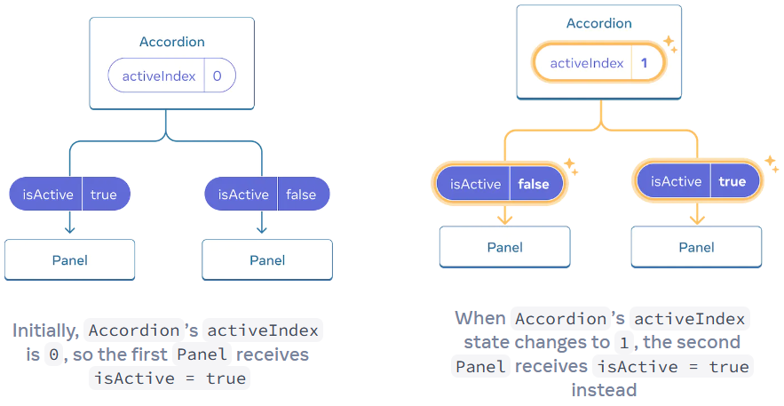
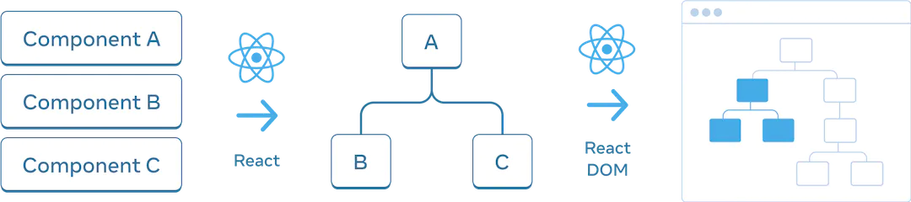
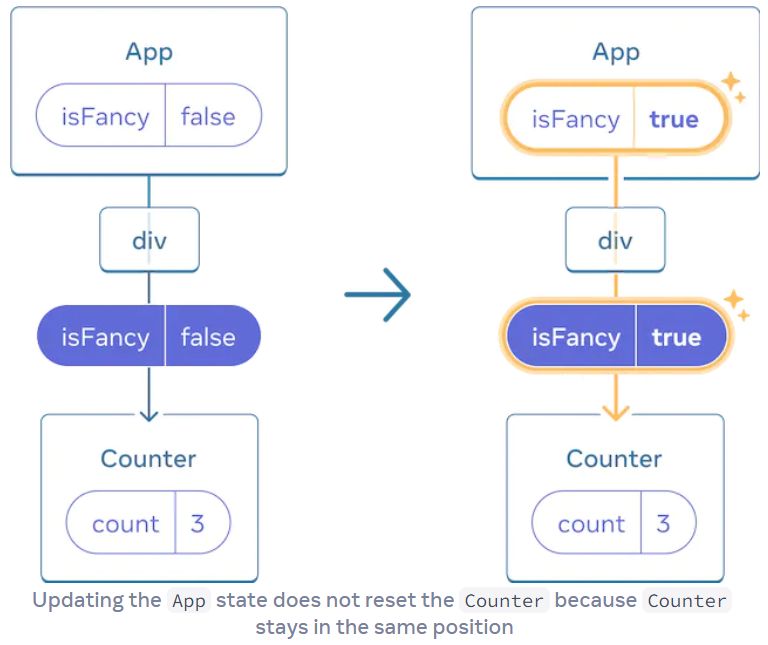

# React入门——管理状态

## 对含有state的输入响应

在React中，你不会直接操作UI，应该声明要显示的内容，然后React找出如何更新UI。

下面是官方给的例子，构成`UI---State---event`的操作关系。

```jsx
import { useState } from 'react'

export default function App() {
  const [answer, setAnswer] = useState<string>('');
  const [error, setError] = useState<unknown>({});
  const [status, setStatus] = useState<'typing' | 'submitting' | 'success' | 'error'>('typing');

  const submitForm = (answer: string): Promise<void> => {
    return new Promise((resolve, reject) => {
      setTimeout(() => {
        let shouldError = answer.toLowerCase() !== 'lima'
        if (shouldError) {
          reject(new Error('Good guess but a wrong answer. Try again!'));
        } else {
          resolve();
        }
      }, 1500);
    });
  }

  const handleSubmit = async (e: React.FormEvent): Promise<void> => {
    e.preventDefault();
    setStatus('submitting');
    try {
      await submitForm(answer);
      setStatus('success');
    } catch (err: unknown) {
      setStatus('typing');
      if(err instanceof Error) {
        setError(err)
      } else {
        setError({
          message: String(err)
        })
      }
    }
  }

  const handleTextareaChange= (e: React.ChangeEvent<HTMLTextAreaElement>): void => {
    setAnswer(e.target.value)
  }

  if(status === 'success') {
    return <h2>That's right!</h2>
  }
  return (
    <>
      <h2>City quiz</h2>
      <p> In which city is there a billboard that turns air into drinkable water? </p>
      <form onSubmit={handleSubmit}>
        <textarea value={answer} onChange={handleTextareaChange} disabled={status === 'submitting'} />
        <br />
        <button disabled={ answer.length === 0 || status === 'submitting' }> Submit </button>
        { error !== null && <p className="Error"> {error.message} </p> }
      </form>
    </>
  )
}
```

## State结构

定义State结构的一些原则：

1.组定义。如果需要在同时更新很多变量，考虑将它们合并到单个state变量中。

```js
// 错误定义
const [x, setX] = useState(0);
const [y, setY] = useState(0);
// 正确定义
const [position, setPosition] = useState({ x: 0, y: 0 });
```

2.避免矛盾。state被定义在多处相互矛盾和不一致时候，就容易出错。

3.避免冗余。

```js
// 错误定义
const [firstName, setFirstName] = useState('');
const [lastName, setLastName] = useState('')
const [fullName, setFullName] = useState('');
// 正确定义
const [firstName, setFirstName] = useState('');
const [lastName, setLastName] = useState('');
const fullName = firstName + ' ' + lastName;    // 类似于Vue中的计算属性
```

4.避免重复。

```js
// 错误定义
const [items, setItems] = useState(initialItems);
const [selectedItem, setSelectedItem] = useState(
  items[0]
);
// 正确定义，既然selectedItem可以获取到，就没有必要再次定义个state了
const [items, setItems] = useState(initialItems);
const [selectedId, setSelectedId] = useState(0);
const selectedItem = items.find(item =>
  item.id === selectedId
);
```

5.避免深度嵌套。适当将嵌套对象扁平化。

## 组件通信

两个兄弟组件可以通过公共的父组件通信，即在父组件定义state并将state影响的参数和setState方法传入。

```jsx
function Panel({
  title,
  children,
  isActive,
  onShow
}) {
  return (
    <section className="panel">
      <h3>{title}</h3>
      {isActive ? (
        <p>{children}</p>
      ) : (
        <button onClick={onShow}>
          Show
        </button>
      )}
    </section>
  );
}
export default function Accordion() {
  // 父组件定义activeIndex，传入子组件，在子组件中控制。
  const [activeIndex, setActiveIndex] = useState(0);
  return (
    <>
      <h2>Almaty, Kazakhstan</h2>
      <Panel
        title="About"
        isActive={activeIndex === 0}
        onShow={() => setActiveIndex(0)}
      >
        With a population of about 2 million, Almaty is Kazakhstan's largest city. From 1929 to 1997, it was its capital city.
      </Panel>
      <Panel
        title="Etymology"
        isActive={activeIndex === 1}
        onShow={() => setActiveIndex(1)}
      >
        The name comes from <span lang="kk-KZ">алма</span>, the Kazakh word for "apple" and is often translated as "full of apples". In fact, the region surrounding Almaty is thought to be the ancestral home of the apple, and the wild <i lang="la">Malus sieversii</i> is considered a likely candidate for the ancestor of the modern domestic apple.
      </Panel>
    </>
  );
}
```



## 保留和重置state

React使用树结构去管理和塑造UI，来自JSX。之后React DOM更新浏览器DOM元素去匹配UI树。



当你给组件定义state时候，它并不是存在于组件内部的，实际上是隐藏在React中，React通过组在UI树中的位置将其持有的每个state与正确的组件相关联。

```jsx
import { useState } from 'react';
function Counter() {
  const [score, setScore] = useState(0);
  return (
    <div>
      <h1>{score}</h1>
      <button onClick={() => setScore(score + 1)}>Add one</button>
    </div>
  );
}
export default function App() {
  const [showB, setShowB] = useState(true);
  return (
    <div>
      <Counter />
      {showB && <Counter />}
      <label>
        <input type="checkbox" checked={showB} onChange={e => { setShowB(e.target.checked) }} />
        Render the second counter
      </label>
    </div>
  );
}
```

Counter组件会在两处使用，它们的state是各自分开存储的。只要你在同一位置渲染相同的组件，React就会保持状态。

当第二个Counter组件卸载后再次渲染，会发现count值是从0开始的。

**只要组件在UI树中的位置呈现，React就会保留组件状态**。如果它呗被删除，或不同组件被渲染在同一个位置，React会丢失它的状态。如果相同组件渲染在同一位置，就不会丢失。

比如下面例子，Counter组件是条件渲染的，但在同一位置，状态不会丢失。

```jsx
export default function App() {
  const [isFancy, setIsFancy] = useState(false);
  return (
    <div>
      {isFancy ? (
        <Counter isFancy={true} /> 
      ) : (
        <Counter isFancy={false} /> 
      )}
      <label>
        <input
          type="checkbox"
          checked={isFancy}
          onChange={e => {
            setIsFancy(e.target.checked)
          }}
        />
        Use fancy styling
      </label>
    </div>
  );
}
```



注意：**重要的是UI树中的位置，而不是JSX标记中的位置**。

比如下面代码，切换isFancy的值后，Counter组件内部的state是不变的。
```jsx
export default function App() {
  const [isFancy, setIsFancy] = useState(false);
  if (isFancy) {
    return (
      <div>
        <Counter isFancy={true} />
        <label>
          <input
            type="checkbox"
            checked={isFancy}
            onChange={e => {
              setIsFancy(e.target.checked)
            }}
          />
          Use fancy styling
        </label>
      </div>
    );
  }
  return (
    <div>
      <Counter isFancy={false} />
      <label>
        <input
          type="checkbox"
          checked={isFancy}
          onChange={e => {
            setIsFancy(e.target.checked)
          }}
        />
        Use fancy styling
      </label>
    </div>
  );
}
```
但下面的代码，切换isFancy的值后，Counter组件内部的state是变化的，因为前后在UI树中的位置不同，前者是div包裹的，后者是section包裹的。

```jsx
export default function App() {
  const [isFancy, setIsFancy] = useState(false);
  return (
    <div>
      {isFancy ? (
        <div>
          <Counter isFancy={true} /> 
        </div>
      ) : (
        <section>
          <Counter isFancy={false} />
        </section>
      )}
      <label>
        <input
          type="checkbox"
          checked={isFancy}
          onChange={e => {
            setIsFancy(e.target.checked)
          }}
        />
        Use fancy styling
      </label>
    </div>
  );
}
```

那么如果让相同位置重新设置state呢？

方式一：在不同地方渲染组件

```jsx
yexport default function Scoreboard() {
  const [isPlayerA, setIsPlayerA] = useState(true);
  return (
    <div>
      {isPlayerA &&
        <Counter person="Taylor" />
      }
      {!isPlayerA &&
        <Counter person="Sarah" />
      }
      <button onClick={() => {
        setIsPlayerA(!isPlayerA);
      }}>
        Next player!
      </button>
    </div>
  );
}
```

方式二：设置key

```jsx
export default function Scoreboard() {
  const [isPlayerA, setIsPlayerA] = useState(true);
  return (
    <div>
      { isPlayerA ? <Counter person="Taylor" key="Taylor"/> : <Counter person="Sarah" key="Sarah"/> }
      <button onClick={() => {
        setIsPlayerA(!isPlayerA);
      }}>
        Next player!
      </button>
    </div>
  );
}
```

总结：

- 只要组件渲染在UI树的相同位置，state就不会改变，最常见的就是`if...else`和三目运算符结构
- 在相同位置触发更新有两种方式：
  - 使用`&&`进行条件渲染
  - 设置key
- 不要嵌套组件定义，否则会意外重置state

## 将state逻辑提取到reducer中

具有许多状态更新的组件分布在许多事件处理程序中，可能会让人不知所措。对于这些情况，你可以将组件外部的所有状态更新逻辑合并到一个称为reducer的函数中。

比如下面代码，对于任务有增删改操作：

```jsx
import { useState } from 'react';
import AddTask from './AddTask.js';
import TaskList from './TaskList.js';

let nextId = 3;
const initialTasks = [
    { id: 0, text: 'Visit Kafka Museum', done: true },
    { id: 1, text: 'Watch a puppet show', done: false },
    { id: 2, text: 'Lennon Wall pic', done: false },
];

export default function TaskApp() {
    const [tasks, setTasks] = useState(initialTasks);

    function handleAddTask(text) {
        setTasks([
            ...tasks,
            {
                id: nextId++,
                text: text,
                done: false,
            },
        ]);
    }

    function handleChangeTask(task) {
        setTasks(
            tasks.map((t) => {
                if (t.id === task.id) {
                    return task;
                } else {
                    return t;
                }
            })
        );
    }

    function handleDeleteTask(taskId) {
        setTasks(tasks.filter((t) => t.id !== taskId));
    }

    return (
        <>
            <h1>Prague itinerary</h1>
            <AddTask onAddTask={handleAddTask} />
            <TaskList
                tasks={tasks}
                onChangeTask={handleChangeTask}
                onDeleteTask={handleDeleteTask}
            />
        </>
    );
}
```

这里可以试着用useReducer写法拆分：

这里将上面对`const [tasks, setTasks] = useState(initialTasks);`及相关事件进行了拆分

```jsx
import { useReducer } from 'react';
import AddTask from './AddTask.js';
import TaskList from './TaskList.js';

let nextId = 3;
const initialTasks = [
    { id: 0, text: 'Visit Kafka Museum', done: true },
    { id: 1, text: 'Watch a puppet show', done: false },
    { id: 2, text: 'Lennon Wall pic', done: false },
];

function tasksReducer(tasks, action) {
    switch (action.type) {
        case 'added': {
            return [
                ...tasks,
                {
                    id: action.id,
                    text: action.text,
                    done: false,
                },
            ];
        }
        case 'changed': {
            return tasks.map((t) => {
                if (t.id === action.task.id) {
                    return action.task;
                } else {
                    return t;
                }
            });
        }
        case 'deleted': {
            return tasks.filter((t) => t.id !== action.id);
        }
        default: {
            throw Error('Unknown action: ' + action.type);
        }
    }
}

export default function TaskApp() {
    const [tasks, dispatch] = useReducer(tasksReducer, initialTasks);

    function handleAddTask(text) {
        dispatch({
            type: 'added',
            id: nextId++,
            text: text,
        });
    }

    function handleChangeTask(task) {
        dispatch({
            type: 'changed',
            task: task,
        });
    }

    function handleDeleteTask(taskId) {
        dispatch({
            type: 'deleted',
            id: taskId,
        });
    }

    return (
        <>
            <h1>Prague itinerary</h1>
            <AddTask onAddTask={handleAddTask} />
            <TaskList
                tasks={tasks}
                onChangeTask={handleChangeTask}
                onDeleteTask={handleDeleteTask}
            />
        </>
    );
}
```

我们发现，useReducer似乎是使用策略模式对useState状态处理事件的相关优化，将处理状态的逻辑提取出来。

当然useReducer并不是完美的，下面做下对比：

- 代码量。很明显useState的代码量更小，使用useReducer需要写reducer函数和分发动作，useReducer只能帮助切割修改state的事件处理类似的操作。
- 可读性。useState更易读，代码量大了后useReducer绕来绕去的。
- Debugging。使用useState的话很难知道状态在哪不正确，但使用useReducer可以添加`console.log`到reducer来观察state更新，如果动作都正确就能判断出错误在reducer逻辑中。
- Testing。reducer是不依赖于组件的纯函数，因此可以export来单独测试。

因此使用useReducer不是必须的，useReducer能做的useState也能做。

使用useReducer有些建议，可以写的更好：

- reducer必须是纯函数。类似于state更新函数，reducer也是在渲染期间运行的。不应该发送请求、timeout或产生副作用，应该以immutable方式更新对象和数组。
- 即使操作导致数据发生多次修改，也要让其描述单个用户交互。比如用户重置有5项的表单，应该dispatch一个`reset_form`动作而不是5次分开的`set_field`动作。

使用immer能让useReducer写的更简洁：

```jsx
import {useImmerReducer} from 'use-immer';
import AddTask from './AddTask.js';
import TaskList from './TaskList.js';

let nextId = 3;
const initialTasks = [
  {id: 0, text: 'Visit Kafka Museum', done: true},
  {id: 1, text: 'Watch a puppet show', done: false},
  {id: 2, text: 'Lennon Wall pic', done: false},
];

function tasksReducer(draft, action) {
  switch (action.type) {
    case 'added': {
      draft.push({
        id: action.id,
        text: action.text,
        done: false,
      });
      break;
    }
    case 'changed': {
      const index = draft.findIndex((t) => t.id === action.task.id);
      draft[index] = action.task;
      break;
    }
    case 'deleted': {
      return draft.filter((t) => t.id !== action.id);
    }
    default: {
      throw Error('Unknown action: ' + action.type);
    }
  }
}

export default function TaskApp() {
  const [tasks, dispatch] = useImmerReducer(tasksReducer, initialTasks);

  function handleAddTask(text) {
    dispatch({
      type: 'added',
      id: nextId++,
      text: text,
    });
  }

  function handleChangeTask(task) {
    dispatch({
      type: 'changed',
      task: task,
    });
  }

  function handleDeleteTask(taskId) {
    dispatch({
      type: 'deleted',
      id: taskId,
    });
  }

  return (
    <>
      <h1>Prague itinerary</h1>
      <AddTask onAddTask={handleAddTask} />
      <TaskList
        tasks={tasks}
        onChangeTask={handleChangeTask}
        onDeleteTask={handleDeleteTask}
      />
    </>
  );
}
```

## 通过Context深度传值

如果跨越很多层组件，这样用props是非常不方便的，可以使用context。

定义context：

```js
import { createContext } from 'react';
export const LevelContext = createContext(100);
```

定义App组件：

```jsx
import Children from './components/Children'
import { LevelContext } from './components/LevelContext'
export default function App() {
  return (
    <LevelContext.Provider value={1}>
      <h1>App组件</h1>
      <Children />
    </LevelContext.Provider>
  )
}
```

定义子组件：

```jsx
import GrandChildren from './GrandChildren'
export default function Children() {
  return (
    <div>
      <h3>子组件：</h3>
      <GrandChildren />
    </div>
  )
}
```

定义孙组件：

```jsx
import { useContext } from 'react'
import { LevelContext } from './LevelContext'
export default function GrandChildren() {
  const level = useContext(LevelContext)
  return (
    <div>
      <h5>孙组件：{level}</h5>
    </div>
  )
}
```


当然，顶层也是可以传入context值的，这样在顶层直接使用context的初始值：

```jsx
import { useContext } from 'react'
import Children from './components/Children'
import { LevelContext } from './components/LevelContext'
export default function App() {
  const level = useContext(LevelContext)
  return (
    <LevelContext.Provider value={level + 1}>
      <h1>App组件</h1>
      <Children />Theming: If your app lets the user change its appearance (e.g. dark mode), you can put a context provider at the top of your app, and use that context in components that need to adjust their visual look.
Current account: Many components might need to know the currently logged in user. Putting it in context makes it convenient to read it anywhere in the tree. Some apps also let you operate multiple accounts at the same time (e.g. to leave a comment as a different user). In those cases, it can be convenient to wrap a part of the UI into a nested provider with a different current account value.
Routing: Most routing solutions use context internally to hold the current route. This is how every link “knows” whether it’s active or not. If you build your own router, you might want to do it too.
Managing state: As your app grows, you might end up with a lot of state closer to the top of your app. Many distant components below may want to change it. It is common to use a reducer together with context to manage complex state and pass it down to distant components without too much hassle.
Context is not limited to static values. If you pass a different value on the next render, React will update all the components reading it below! This is why context is often used in combination with state.

In general, if some information is needed by distant components in different parts of the tree, it’s a good indication that context will help you.
    </LevelContext.Provider>
  )
}
```


使用context也是有限度的，使用前应考虑：

1. 能否传入props。
2. 能否提取组件并以`children`方式传入JSX。比如`<Layout><Posts posts={posts} /></Layout>`

使用context的情况：

- 主题。网站的暗黑主题、颜色主题。
- 当前账户。存储当前用户的账户信息，当然也可以使用Redux等库。
- 路由
- 状态管理

## 使用reducer和context进行扩展

以下是根据官网例子整理的，主要关注TasksContext文件对相关函数如何封装的，实现了reducer和context结合的扩展。

当然在实际项目中还需要自己封装，是个不错的学习例子。

App组件：

```jsx
import AddTask from './components/AddTask'
import TaskList from './components/TaskList';
import { TasksProvider } from './components/TasksContext';

export default function App() {
  return (
    <TasksProvider>
      <h1>Day off in Kyoto</h1>
      <AddTask />
      <TaskList />
    </TasksProvider>
  );
}
```

TaskList组件：

```jsx
import { useState } from 'react';
import { useTasks, useTasksDispatch } from './TasksContext.js';

function Task({ task }) {
  const [isEditing, setIsEditing] = useState(false);
  const dispatch = useTasksDispatch();
  let taskContent;
  if (isEditing) {
    taskContent = (
      <>
        <input
          value={task.text}
          onChange={e => {
            dispatch({
              type: 'changed',
              task: {
                ...task,
                text: e.target.value
              }
            });
          }} />
        <button onClick={() => setIsEditing(false)}>
          Save
        </button>
      </>
    );
  } else {
    taskContent = (
      <>
        {task.text}
        <button onClick={() => setIsEditing(true)}>
          Edit
        </button>
      </>
    );
  }
  return (
    <label>
      <input
        type="checkbox"
        checked={task.done}
        onChange={e => {
          dispatch({
            type: 'changed',
            task: {
              ...task,
              done: e.target.checked
            }
          });
        }}
      />
      {taskContent}
      <button onClick={() => {
        dispatch({
          type: 'deleted',
          id: task.id
        });
      }}>
        Delete
      </button>
    </label>
  );
}

export default function TaskList() {
  const tasks = useTasks();
  return (
    <ul>
      {tasks.map(task => (
        <li key={task.id}>
          <Task task={task} />
        </li>
      ))}
    </ul>
  );
}
```

AddTask组件：

```jsx
import { useState, useContext } from 'react';
import { useTasksDispatch } from './TasksContext.js';
let nextId = 3;
export default function AddTask() {
  const [text, setText] = useState('');
  const dispatch = useTasksDispatch();
  return (
    <>
      <input
        placeholder="Add task"
        value={text}
        onChange={e => setText(e.target.value)}
      />
      <button onClick={() => {
        setText('');
        dispatch({
          type: 'added',
          id: nextId++,
          text: text,
        }); 
      }}>Add</button>
    </>
  );
}
```

TasksContext文件，主要存放reducer和context的封装：

```jsx
import { createContext, useContext, useReducer } from 'react';

const initialTasks = [
  { id: 0, text: 'Philosopher’s Path', done: true },
  { id: 1, text: 'Visit the temple', done: false },
  { id: 2, text: 'Drink matcha', done: false }
];

const TasksContext = createContext(null);
const TasksDispatchContext = createContext(null);

function tasksReducer(tasks, action) {
  switch (action.type) {
    case 'added': {
      return [...tasks, {
        id: action.id,
        text: action.text,
        done: false
      }];
    }
    case 'changed': {
      return tasks.map(t => {
        if (t.id === action.task.id) {
          return action.task;
        } else {
          return t;
        }
      });
    }
    case 'deleted': {
      return tasks.filter(t => t.id !== action.id);
    }
    default: {
      throw Error('Unknown action: ' + action.type);
    }
  }
}

export function TasksProvider({ children }) {
  const [tasks, dispatch] = useReducer(
    tasksReducer,
    initialTasks
  );

  return (
    <TasksContext.Provider value={tasks}>
      <TasksDispatchContext.Provider value={dispatch}>
        {children}
      </TasksDispatchContext.Provider>
    </TasksContext.Provider>
  );
}

export function useTasks() {
  return useContext(TasksContext);
}

export function useTasksDispatch() {
  return useContext(TasksDispatchContext);
}
```
