# Vue3常用API梳理

## 全局API

### createApp()

创建应用实例

```ts
function createApp(rootComponent: Component, rootProps?: object): App
```

参数：

- `rootComponent`：根组件
- `rootProps`：传递给根组件的props，可以在根组件中访问到

返回值：应用实例对象app

### app实例对象

通过`createApp()`函数创建的实例对象app，通过源码可得到有如下参数：

```ts
export declare interface App<HostElement = any> {
    version: string;
    config: AppConfig;
    use(plugin: Plugin_2, ...options: any[]): this;
    mixin(mixin: ComponentOptions): this;
    component(name: string): Component | undefined;
    component(name: string, component: Component): this;
    directive(name: string): Directive | undefined;
    directive(name: string, directive: Directive): this;
    mount(rootContainer: HostElement | string, isHydrate?: boolean, isSVG?: boolean): ComponentPublicInstance;
    unmount(): void;
    provide<T>(key: InjectionKey<T> | string, value: T): this;
    _uid: number;
    _component: ConcreteComponent;
    _props: Data | null;
    _container: HostElement | null;
    _context: AppContext;
    _instance: ComponentInternalInstance | null;
    /**
     * v2 compat only
     */
    filter?(name: string): Function | undefined;
    filter?(name: string, filter: Function): this;
}
```

- `app.mount()`：挂载应用实例到容器中。
- `app.unmount()`：卸载。
- `app.provide()`：全局Provide，可在后代通过Inject访问到。
- `app.component()`：注册全局组件。
- `app.directive()`：注册全局指令。
- `app.use()`：安装插件。
- `app.mixin()`：全局混入，不推荐使用。
- `app.version`：当前Vue版本号，在插件中很有用。

`app.config`返回一个`AppConfig`类型的对象：

```ts
export declare interface AppConfig {
    readonly isNativeTag?: (tag: string) => boolean;
    performance: boolean;
    optionMergeStrategies: Record<string, OptionMergeFunction>;
    globalProperties: Record<string, any>;
    errorHandler?: (err: unknown, instance: ComponentPublicInstance | null, info: string) => void;
    warnHandler?: (msg: string, instance: ComponentPublicInstance | null, trace: string) => void;
    /**
     * Options to pass to `@vue/compiler-dom`.
     * Only supported in runtime compiler build.
     */
    compilerOptions: RuntimeCompilerOptions;
}
```

- `app.config.errorHandler`：为应用内抛出的未捕获错误指定一个全局处理函数。
- `app.config.warnHandler`：全局警告处理。
- `app.config.performance`：当为true时可在浏览器的开发工具“Perform”页启用组件相关性能追踪，禁止开发模式支持。
- `app.config.compilerOptions`：配置运行时的编译器选项，暂时先不管。
    - `app.config.compilerOptions.isCustomElement`
    - `app.config.compilerOptions.whitespace`
    - `app.config.compilerOptions.delimiters`
    - `app.config.compilerOptions.comments`
- `app.config.globalProperties`：注册全局属性，该属性能在任何组件访问到。

### 通用

#### nextTick()

```ts
function nextTick(callback?: () => void): Promise<void>
```

更改响应式状态时，DOM更新并不是立刻生效的，而是缓存在一个队列中，直到下一个tick才一起执行。这样做是为了无论状态发生多少次改变，都仅执行一次更新。

`nextTick()`可以在状态改变后立刻使用，以等待DOM更新完成。

```vue
<template>
  <button id="counter" @click="increment">{{ count }}</button>
</template>
<script lang="ts" setup>
import { ref,nextTick } from 'vue'
const count = ref(1)
async function increment() {
  count.value++
  // DOM 还未更新
  console.log(document.getElementById('counter').textContent) // 0
  await nextTick()
  // // DOM 此时已经更新
  console.log(document.getElementById('counter').textContent) // 1
}
</script>
```

#### defineComponent()

在定义组件时**提供类型推导的辅助函数**。

```ts
function defineComponent(
  component: ComponentOptions | ComponentOptions['setup']
): ComponentConstructor
```

参数：

- `component`：组件选项对象

返回值：该选项对象本身

```ts
const App = defineComponent({
  name: 'App',
  data() {
    return {
      count: 0,
    }
  },
  methods: {
    increment() {
      this.count = this.count + 1
    }
  }
})
type AppInstance = InstanceType<typeof App>
```

::: warning
因为`defineComponent()`是一个函数调用，因此它可能被某些构建工具认为会产生副作用，即使组件从未被使用，也有可能不被tree-shake。

因此，需要我们手动告诉webpack该函数调用可以安全地tree-shake：

```js
export default /*#__PURE__*/ defineComponent(/* ... */)
```
:::

#### defineAsyncComponent()

定义异步组件，它在运行时是懒加载的。具体使用见异步组件部分。

#### defineCustomElement()

接收组件选项对象，返回原生自定义原生类的构造器。

::: tip
这块需要Web Components的知识，暂时跳过。
:::

```ts
function defineCustomElement(
  component: (ComponentOptions & { styles?: string[] }) | ComponentOptions['setup']
): {
  new (props?: object): HTMLElement
}
```

## 组合式API

### setup()

setup函数有两个参数：

- props：组件的props。是响应式的，不能直接解构。
- content：setup上下文对象
  - attrs：透传Attributes。有状态的对象，不能解构，必须通过`attrs.*`访问。
  - slots：插槽。有状态的对象，不能解构，必须通过`slots.*`访问。
  - emit：触发事件。
  - expose：暴露公共属性。暴露的公共属性可以在父组件通过**模板引用**方式访问该实例。

返回值：`setup()`的返回值会暴露给模板和其他选项式API钩子，其它的选项也可以通过组件实例来获取 `setup()`暴露的属性。

::: warning
和props不同，attrs和slots都**不是**响应式的，如果想基于attrs或slots的改变来执行副作用，应在`onBeforeUpdate`生命周期钩子中编写相关逻辑。
:::

```js
export default {
  props: {
    title: String
  },
  /**
   * @params {object} props 组件的props，是响应式的
   * @params {object} context 由attrs、slots、emit、expose构成的上下文对象
   **/
  setup(props, { attrs, slots, emit, expose}) {
    // 注意需要将props转为一个其中全是ref的对象，然后解构
    const { title } = toRefs(props)
    // const title = toRef(props, 'title')

    // 有选择的暴露局部状态
    const publicCount = ref(0)
    expose({ count: publicCount })
  }
}
```

### 响应式

核心：

- `ref()`
- `computed()`
- `reactive()`
- `readonly()`：接收一个对象或ref，返回原值的只读代理。
- `watchEffect()`
- `watchPostEffect()`：`watchEffect()`使用`flush: 'post'`的别名。
- `watchSyncEffect()`：`watchEffect()`使用`flush: 'sync'`的别名。
- `watch()`

工具：

- `isRef()`：判断是否为ref
- `unRef()`：如果是ref返回内部值，否则返回参数本身。`val = isRef(val) ? val.value : val`语法糖。
- `isProxy()`：检查一个对象是否由`reactive()`、`readonly()`、`shallowReactive()`或`shallowReadonly()`创建的代理。
- `isReactive()`：检查是否由`reactive()`或`shallowReactive()`创建的代理。
- `isReadonly()`：检查传入的值是否为只读对象。
- `toRef()`：基于响应式对象上的一个属性，创建一个对应的ref。创建的ref和源值属性同步。
- `toRefs()`：基于响应式对象创建一个普通对象，这个普通对象的每个属性都是指向源对象相应属性的ref。每个单独的ref都是使用`toRef()`创建的。
  - 注意外层是普通对象，内层是ref对象。
  - 创建的对象是会和源值同步的。

```vue
<script lang="ts" setup>
import { onUpdated, ref, toRef,toRefs, unref } from 'vue'
const position = ref({
  x: 0,
  y: 1,
  z: 2,
})
const xRef = toRef(position.value, 'x')
const posRefs = toRefs(position.value)
const increment = () => {
  position.value.x++
  position.value.y++
  position.value.z++
}
</script>

<template>
  <div>{{ xRef }}</div>
  <div>{{ posRefs }}</div>
  <button @click="increment">+1</button>
</template>
```



::: danger
注意使用`toRef()`和创建ref的区别：**使用toRef和toRefs创建的对象会和源值同步**，但通过ref创建的就和之前没有半毛钱关系。

在下面例子中，点击自增按钮，`numRef1`和`numRef2`的值会自增，`counter2`里的num也会自增，但`counter1`里的num不会自增。

```vue
<script lang="ts" setup>
import { ref, toRef } from 'vue'
const c = ref(0)
const counter1 = ref({
  num: 0,
})
const counter2 = ref({
  num: 100,
})
const numRef1 = ref(counter1.value.num)
const numRef2 = toRef(counter2.value, 'num')
const increment = () => {
  numRef1.value++
  numRef2.value++
}
</script>

<template>
  <div>{{ counter1 }} --- {{ counter2 }}</div>
  <div>{{ numRef1 }} --- {{ numRef2 }}</div>
  <button @click="increment">+1</button>
</template>
```
:::

进阶：

- `shallowReactive()`：`reactive()`的浅层作用形式。
- `shallowReadonly()`：`readonly()`的浅层作用形式。
- `shallowRef()`：`ref()`的浅层作用形式，只有对`.value`的访问是响应式的。
- `triggerRef()`：强制触发依赖于一个浅层ref副作用。

```js
const shallow = shallowRef({
  greet: 'Hello, world'
})
// 触发该副作用第一次应该会打印 Hello, world
watchEffect(() => {
  console.log(shallow.value.greet)
})
// 这次变更不应触发副作用，因为这个 ref 是浅层的
shallow.value.greet = 'Hello, universe'
// 强制触发，打印 Hello, universe
triggerRef(shallow)
```

- `customRef()`：自定义ref。接收一个工厂函数，工厂函数接收track和trigger两个函数作为参数，并返回一个带有get和set方法的对象。

比如自定义创建一个防抖的ref：

```js
import { customRef } from 'vue'
export function useDebouncedRef(value, delay = 200) {
  let timeout
  return customRef((track, trigger) => {
    return {
      get() {
        track()
        return value
      },
      set(newValue) {
        clearTimeout(timeout)
        timeout = setTimeout(() => {
          value = newValue
          trigger()
        }, delay)
      }
    }
  })
}
```

- `toRaw()`：根据Vue创建的代理返回其原始对象。

```js
const foo = {}
const reactiveFoo = reactive(foo)
console.log(toRaw(reactiveFoo) === foo) // true
```

- `markRaw()`：将对象标记为不可转为代理，返回该对象本身。

```js
// 被标记为不可转为代理的对象，调用reactive()后仍不是代理对象，不具有响应式
const foo = markRaw({})
console.log(isReactive(reactive(foo))) // false
// 即使是嵌套在对象内，也是适用的
const bar = reactive({ foo })
console.log(isReactive(bar.foo)) // false
```

::: danger
适用`markRaw()`和`shallowReactive()`类似的浅层次API是一种进阶需求，如果把一个嵌套的、没有标记的原始对象设置成一个响应式对象，然后再次访问它，你获取到的是代理的版本。这可能会导致**对象身份风险**，即执行一个依赖于对象身份的操作，但却同时使用了同一对象的原始版本和代理版本。
:::

- `effectScope()`：Effect作用域相关，属于高阶内容
- `getCurrentScope()`
- `onScopeDispose()`

生命周期钩子：见基础篇生命周期。出来基础的6个，还有`onErrorCaptured()`、`onRenderTracked()`、`onRenderTriggered()`、`onActivated()`、`onDeactivated()`、`onServerPrefetch()`以后再说。

依赖注入：

- `provide()`
- `inject()`

## 内置指令

- `v-text`
- `v-html`
- `v-show`
- `v-if`
- `v-for`
- `v-on`
- `v-bind`
- `v-model`
- `v-slot`
- `v-once`
- `v-pre`：跳过该元素及其子元素的编译
- `v-cloak`：隐藏尚未完成编译的DOM模板。某些情况会出现未编译模板闪现，用户先看到还没编译完成的双大括号标签，直到挂载组件将它们替换未实际渲染内容。v-cloak 会保留在所绑定的元素上，直到相关组件实例被挂载后才移除。配合像 [v-cloak] { display: none } 这样的 CSS 规则，它可以在组件编译完毕前隐藏原始模板。

```css
[v-cloak] {
  display: none;
}
```

```vue
<div v-cloak>
  {{ message }}
</div>
```

- `v-memo`：缓存模板子树，传入数组。如果数组中每个值与最后一次渲染相同，那么整个子树更新将被跳过。

例如下面，如果`valueA`和`valueB`都保持不变，整个div及其子项所有更新都将被跳过。当传入空数组（`v-memo="[]"`）将与`v-once`效果相同。
```vue
<div v-memo="[valueA, valueB]">...</div>
```

