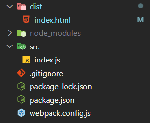
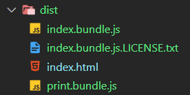
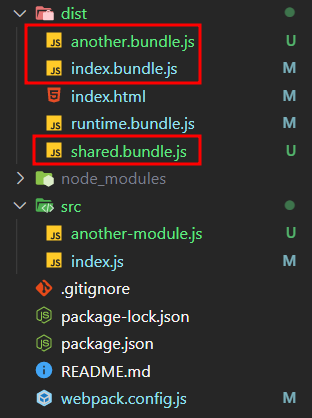
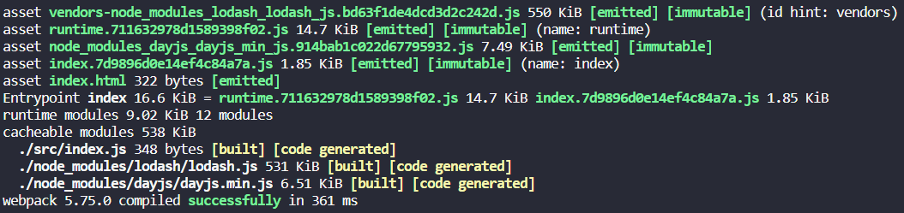
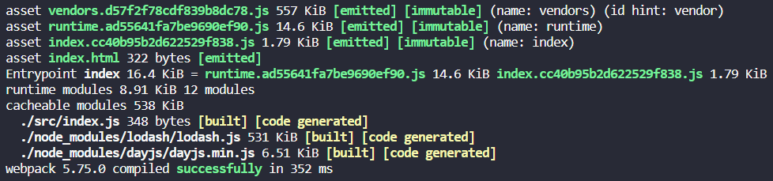

# Webpack5官网文档学习笔记

> 基础使用篇是通过阅读webpack中文文档指南写下的笔记。

## 搭建环境

1.基本安装

```bash
mkdir webpack-study
cd webpack-study
npm init -y
npm install webpack webpack-cli --save-dev
npm install lodash --save
```

2.编写目录结构



3.编写输出dist

```html
<!DOCTYPE html>
<html lang="en">
<head>
  <meta charset="UTF-8">
  <meta http-equiv="X-UA-Compatible" content="IE=edge">
  <meta name="viewport" content="width=device-width, initial-scale=1.0">
  <title>Document</title>
</head>
<body>
  <!-- 这里引用了当前目录下打包后的bundle -->
  <script src="bundle.js"></script>
</body>
</html>
```

4.编写`src/index.js`文件，内容随便，src下的文件最终会被打包到dist目录下

```js
import _ from 'lodash';
function component() {
  const el = document.createElement('div');
  el.innerHTML = _.join(['Hello', 'webpack'], '-');
  return el;
}
document.body.appendChild(component())
```

5.通过命令运行打包，默认打包成`main.js`：

```bash
npx webpack
```

6.当然我们可以指定一些配置，这样就要另外编写`webpack.config.js`配置文件：

```js
const path = require('path')
module.exports = {
  entry: "./src/index.js",
  output: {
    filename: 'bundle.js',
    path: path.resolve(__dirname, 'dist')
  }
}
```

最终运行带有配置文件的命令：

```bash
npx webpack --config webpack.config.js
```

## 管理资源

### 加载CSS

1.安装相关依赖

```bash
npm install --save-dev style-loader css-loader
```

2.修改`webpack.config.js`文件

::: tip

- loader可以链式调用，第一个loader将其结果传递给下一个loader，以此类推。
- webpack根据正则表达式来确定查找哪些文件，并指定给相关loader。比如`/\.css$/i`就匹配`.css`文件的后缀

:::

```js{8-18}
const path = require('path')
module.exports = {
  entry: "./src/index.js",
  output: {
    filename: 'bundle.js',
    path: path.resolve(__dirname, 'dist')
  },
  module: {
    rules: [
      {
        test: /\.css$/i,
        // 注意style-loader在前，css-loader在后，顺序不能颠倒，最终是从右往左加载的
        use: [
          'style-loader', 'css-loader'
        ],
      },
    ],
  }
}
```

3.引入`style.css`文件并导入

```css
.hello {
  color: red;
}
```

```js{2,6}
import _ from 'lodash';
import './style.css';
function component() {
  const el = document.createElement('div');
  el.innerHTML = _.join(['Hello', 'webpack'], '-');
  el.classList.add('hello')
  return el;
}
document.body.appendChild(component())
```

4.打包构建，打开`dist/index.html`，就能看到字变成红色了。

### 加载图像

在webpack5中，可以使用内置的Asset Modules，将这些内容混入到系统中。

1.修改`webpack.config.js`文件

这样图像就会被处理并添加到output目录

```js{10-14}
module.exports = {
  ...
  module: {
    rules: [
      {
        test: /\.css$/i,
        // 注意style-loader在前，css-loader在后，顺序不能颠倒
        use: ['style-loader', 'css-loader'],
      },
      {
        test: /\.(png|svg|jpg|jpeg|gif)$/i,
        // 注意type字段
        type: 'asset/resource',
      },
    ],
  }
}
```

2.引入图片

在JS中引入：

```js{3,9-11}
import _ from 'lodash';
import './style.css';
import RefImage from './toRef和toRefs.svg';
function component() {
  const el = document.createElement('div');
  el.innerHTML = _.join(['Hello', 'webpack'], '-');
  el.classList.add('hello');

  const myPic = new Image();
  myPic.src = RefImage;
  el.appendChild(myPic)
  return el;
}
document.body.appendChild(component())
```

在CSS以背景方式引入：

```css{3}
.hello {
  color: red;
  background: url('./toRef和toRefs.svg');
}
```

4.打包构建，打开`dist/index.html`，就能看到图片显示成功了。

### 加载fonts字体

1.修改`webpack.config.js`文件

```js
{
  test: /\.(woff|woff2|eot|ttf|otf)$/i,
  type: 'asset/resource',
},
```

2.添加字体文件，并引入

通过`@font-face`声明将其混合，然后就能在CSS中正常使用了

```css{1-7,10}
@font-face {
  font-family: 'MyFont';
  src: url('./my-font.woff2') format('woff2'),
    url('./my-font.woff') format('woff');
  font-weight: 600;
  font-style: normal;
}
.hello {
  color: red;
  font-family: 'MyFont';
}
```

3.打包构建，查看字体是否更新。

### 加载数据

1.修改`webpack.config.js`文件

```js
{
  test: /\.(csv|tsv)$/i,
  use: ['csv-loader'],
},
{
  test: /\.xml$/i,
  use: ['xml-loader'],
},
```

2.加载数据

```js
import Data from './assets/data.xml';
import Notes from './assets/data.csv';
console.log('xml', Data);
console.log('csv', Notes);
```

3.打包构建

## 管理输出

1.准备好src下的文件

```js
export default function printMe() {
  console.warn('从print.js文件中打印输出')
}
```

```js
import _ from 'lodash';
import printMe from './print';
function component() {
  const el = document.createElement('div');
  const btn = document.createElement('button');
  el.innerHTML = _.join(['Hello', 'webpack'], '-');
  btn.innerHTML = 'Click me and check the console!';
  btn.onclick = printMe;
  el.appendChild(btn)
  return el;
}
document.body.appendChild(component())
```

2.设置多个入口

通过将entry选项修改为对象形式可以设置多个入口，每个key值是每个bundle的命名。

多个入口就会生成多个出口，因此output部分也要做出相关修改。

```js{3-6,8}
const path = require('path');
module.exports = {
  entry: {
    index: './src/index.js',
    print: './src/print.js',
  },
  output: {
    filename: '[name].bundle.js',
    path: path.resolve(__dirname, 'dist'),
    // 清除历史构建文件
    clean: true,
  },
}
```

3.允许打包，生成出口文件`index.bundle.js`和`print.bundle.js`，这时候我们发现之前的`<script src="bundle.js"></script>`不能用了，需要重新配置，即引入两个出口文件。

每次这样修改是很麻烦的，因此可以使用`HtmlWebpackPlugin`插件来管理输出`dist/index.html`文件。

4.安装`HtmlWebpackPlugin`插件

```bash
npm install --save-dev html-webpack-plugin
```

5.更新`webpack.config.js`文件

```js{2,8-12}
const path = require('path');
const HtmlWebpackPlugin = require('html-webpack-plugin');
module.exports = {
  entry: {
    index: './src/index.js',
    print: './src/print.js',
  },
  plugins: [
    new HtmlWebpackPlugin({
      title: '管理输出',
    }),
  ],
  output: {
    filename: '[name].bundle.js',
    path: path.resolve(__dirname, 'dist'),
    // 清除历史构建文件
    clean: true,
  },
}
```

6.打包

得到`dist/index.html`文件：

```html
<!doctype html>
<html>
<head>
  <meta charset="utf-8">
  <title>管理输出</title>
  <meta name="viewport" content="width=device-width,initial-scale=1">
  <script defer="defer" src="index.bundle.js"></script>
  <script defer="defer" src="print.bundle.js"></script>
</head>
<body></body>
</html>
```

和打包目录结构：



## 开发环境

### source map

为了更容易地追踪 error 和 warning，JavaScript 提供了 source maps 功能，可以将编译后的代码映射回原始源代码。如果一个错误来自于 `b.js`，source map 就会明确的告诉你。

在`webpack.config.js`中添加devtool选项就能配置source map。

```js{4,9-11}
const path = require('path');
const HtmlWebpackPlugin = require('html-webpack-plugin');
module.exports = {
  mode: 'development',
  entry: {
    index: './src/index.js',
    print: './src/print.js',
  },
  // 通过source map将编译后的代码映射到原始源代码
  // print.js中的错误会给出提示
  devtool: 'inline-source-map',
  plugins: [
    new HtmlWebpackPlugin({
      title: 'Development',
    }),
  ],
  output: {
    filename: '[name].bundle.js',
    path: path.resolve(__dirname, 'dist'),
    clean: true,
  },
}
```

### 开发工具

#### watch mode

添加一个用于启动 webpack watch mode 的 npm scripts：

```json{4}
{
  ...
  "scripts": {
  	"build": "webpack",
    "watch": "webpack --watch",
    "test": "echo \"Error: no test specified\" && exit 1"
  },
  ...
}
```

::: tip
`webpack --watch`唯一的缺点是，为了看到修改后的实际效果，你需要刷新浏览器。
:::

#### webpack-dev-server

1.安装webpack-dev-server

```bash
npm install --save-dev webpack-dev-server
```

2.修改`webpack.config.js`配置文件

以下配置告知`webpack-dev-server`，将`dist`目录下的文件serve到`localhost:8080`下。

::: danger
注意这里配置了`optimization.runtimeChunk: 'single'`选项，是因为这里是单个HTML页面多个入口，没配置的话，可能会遇到一些问题，具体见代码分割章节。配置该项后会生成`runtime.bundle.js`文件。

将`optimization.runtimeChunk`设置值时，会为入口添加含有runtime的额外chunk。此配置的值可以有：

- single：为所有入口添加一个chunk。
- multiple：为每个入口添加一个只含有runtime的额外chunk。

:::

::: tip
`webpack-dev-server`会从`output.path`中定义的目录中的bundle文件提供服务，即从`http://[devServer.host]:[devServer.port]/[output.publicPath]/[output.filename]`进行访问。
:::

```js{10-12,23-25}
const path = require('path');
const HtmlWebpackPlugin = require('html-webpack-plugin');
module.exports = {
  mode: 'development',
  entry: {
    index: './src/index.js',
    print: './src/print.js',
  },
  devtool: 'inline-source-map',
  devServer: {
    static: './dist',
  },
  plugins: [
    new HtmlWebpackPlugin({
      title: 'Development',
    }),
  ],
  output: {
    filename: '[name].bundle.js',
    path: path.resolve(__dirname, 'dist'),
    clean: true,
  },
  optimization: {
    runtimeChunk: 'single',
  }
}
```

3.在`package.json`中配置

```json{5}
{
  ...
  "scripts": {
  	"build": "webpack",
    "dev": "webpack serve --open",
    "test": "echo \"Error: no test specified\" && exit 1"
  },
  ...
}
```

4.允许`npm run dev`运行web server

## 代码分离

代码分离作用：把代码分离到不同bundle中，然后可以**按需加载或并行加载**这些文件。代码分离可以用于获取更小的bundle和控制资源加载优先级。

常用代码分离方法有三种：

- 入口起点：使用entry手动分离代码。
- 防止重复：使用`Entry dependencies`或`SplitChunksPlugin`去重和分离chunk。
- 动态导入：通过模块的内联函数分离代码。

### 入口起点

在上一章我们其实已经做到了多个入口了，即多个chunk。当然这种方式是存在隐患的：

- 如果入口chunk之间包含重复模块，重复模块会引入到各自bundle中，造成多次引用。比如在模块A和模块B可能同时引入lodash。
- 不灵活，不能动态将核心应用程序逻辑代码拆分出来。

### 防止重复

#### 入口依赖

1.修改`webpack.config.js`文件

```js{5-15,26,30-32}
const path = require('path');
const HtmlWebpackPlugin = require('html-webpack-plugin');
module.exports = {
  mode: 'development',
  entry: {
    index: {
      import: './src/index.js',
      dependOn: 'shared',
    },
    another: {
      import: './src/another-module.js',
      dependOn: 'shared',
    },
    shared: 'lodash',
  },
  devtool: 'inline-source-map',
  devServer: {
    static: './dist',
  },
  plugins: [
    new HtmlWebpackPlugin({
      title: 'Development Zhengyu',
    }),
  ],
  output: {
    filename: '[name].bundle.js',
    path: path.resolve(__dirname, 'dist'),
    clean: true,
  },
  optimization: {
    runtimeChunk: 'single',
  },
}
```

2.打包



尽管可以在 webpack 中允许每个页面使用多入口，应尽可能避免使用多入口的入口：`entry: { page: ['./analytics', './app'] }`。如此，在使用 `async` 脚本标签时，会有更好的优化以及一致的执行顺序。

#### SplitChunksPlugin

该插件可以将公共的依赖模块提取到已有的入口chunk中，或提取到一个新生成的chunk。

使用`optimization.splitChunks`配置项后，可以看出index和another的bundle已经移出重复依赖模块了，而重复的lodash分离到单独的chunk中。

```js{5-8,23-27}
const path = require('path');
const HtmlWebpackPlugin = require('html-webpack-plugin');
module.exports = {
  mode: 'development',
  entry: {
    index: './src/index.js',
    another: './src/another-module.js',
  },
  devtool: 'inline-source-map',
  devServer: {
    static: './dist',
  },
  plugins: [
    new HtmlWebpackPlugin({
      title: 'Development Zhengyu',
    }),
  ],
  output: {
    filename: '[name].bundle.js',
    path: path.resolve(__dirname, 'dist'),
    clean: true,
  },
  optimization: {
    splitChunks: {
      chunks: 'all',
    },
  },
}
```

::: tip

除了`SplitChunksPlugin`，社区还提供一些其他的plugin用于分离CSS：

- `mini-css-extract-plugin`：用于将CSS从主应用程序中分离。

:::

### 动态导入

动态导入的好处在于，只有分析到这里代码会执行是时，才会导入相关的库。

下面的代码中就使用到了动态导入，`import()`的返回值是Promise

```js
// Promise写法
function getComponent1() {
  return import('lodash').then(({ default: _ }) => {
    const el = document.createElement('div')
    el.innerHTML = _.join(['Hello', 'webpack'], '-');
    return el;
  }).catch(err => {
    return '组件加载时候发生报错'
  })
}
// async/await写法
async function getComponent2() {
  const el = document.createElement('div');
  const { default: _ } = await import('lodash')
  el.innerHTML = _.join(['Hello', 'webpack'], ',');
  return el;
}
getComponent2().then((component) => {
  document.body.appendChild(component)
})
```

::: warning

动态导入这里还是有疑问的，在打包过程中如果一处用到，那还不是相对于全局打包？这种打包其实并没有根据某个页面而更换。

:::

### 预获取和预加载

- `prefetch`（预获取）：将来某些导航下可能需要的资源。
- `preload`（预加载）：当前导航下可能需要的资源

有一个 `HomePage` 组件，其内部渲染一个 `LoginButton` 组件，然后在点击后按需加载 `LoginModal` 组件。

```js
// LoginButton.js
import(/* webpackPrefetch: true */ './path/to/LoginModal.js');
```

这会生成 `<link rel="prefetch" href="login-modal-chunk.js">` 并追加到页面头部，指示着浏览器在闲置时间预取 `login-modal-chunk.js` 文件。

与prefetch指令相比，preload有些不同：

|          | prefetch                        | preload                     |
| -------- | ------------------------------- | --------------------------- |
| 加载时机 | 在父chunk加载时并行开始加载     | 在父chunk加载完成后开始加载 |
| 优先级   | 立即下载                        | 在浏览器闲暇时下载          |
| 使用时机 | 在父chunk中立即请求，并立即下载 | 用在未来某个时刻            |

有一个图表组件 `ChartComponent` 组件需要依赖一个体积巨大的 `ChartingLibrary` 库。它会在渲染时显示一个 `LoadingIndicator(加载进度条)` 组件，然后立即按需导入 `ChartingLibrary`：

```js
// ChartComponent.js
import(/* webpackPreload: true */ 'ChartingLibrary');
```

在页面中使用 `ChartComponent` 时，在请求 ChartComponent.js 的同时，还会通过 `<link rel="preload">` 请求 charting-library-chunk。假定 page-chunk 体积比 charting-library-chunk 更小，也更快地被加载完成，页面此时就会显示 `LoadingIndicator(加载进度条)` ，等到 `charting-library-chunk` 请求完成，LoadingIndicator 组件才消失。

当然预加载也是可以控制的：

```js
const lazyComp = () =>
  import('DynamicComponent').catch((error) => {
    // 在发生错误时做一些处理
    // 例如，我们可以在网络错误的情况下重试请求
  });
```

::: danger

在某些极端情况，如果在 webpack 开始加载该脚本之前脚本加载失败，则该catch程序就不会执行，webpack不知道是哪个脚本失败了。

为了避免上面问题，可以添加`onerror`处理脚本：

```html
<!-- 在这种情况下，错误的 script 将被删除 -->
<script
  src="https://example.com/dist/dynamicComponent.js"
  async
  onerror="this.remove()"
></script>
```

:::

## 缓存❓

::: warning

该节有些没看懂，以后再翻看吧。

:::

为了节省资源，浏览器会使用缓存技术，如果命中缓存会降低网络流量进而加载网络速度。然而，如果部署新版本时不更改资源文件名，浏览器可能会认为没有更新，使用缓存版本。

该节重点在于如果通过配置，**既让webpack编译的文件可以被缓存，同时文件内容变化后能请求到新文件**。

### 输出文件命名

我们可以通过替换`output.filename`中的可替换模板字符串设置来定义输出文件名称，其中`[contenthash]`将根据资源内容创建出唯一hash，资源变化时`[contenthash]`也会变化。

```js{4}
module.exports = {
  ...
  output: {
    filename: '[name].[contenthash].js',
    path: path.resolve(__dirname, 'dist'),
    clean: true,
  },
}
```

### 提取三方库到vendor chunk

使用`optimization`的相关属性拆分chunk，**将第三方库提取到单独的`vendor` chunk文件中是比较推荐的做法**。

在项目中动态引入lodash和dayjs，查看打包情况：

```js{18-29}
const path = require('path');
const HtmlWebpackPlugin = require('html-webpack-plugin');
module.exports = {
  mode: 'development',
  entry: {
    index: './src/index.js',
  },
  plugins: [
    new HtmlWebpackPlugin({
      title: 'Development Zhengyu',
    }),
  ],
  output: {
    filename: '[name].[contenthash].js',
    path: path.resolve(__dirname, 'dist'),
    clean: true,
  },
  optimization: {
    runtimeChunk: 'single',
    splitChunks: {
      cacheGroups: {
        vendor: {
          test: /[\\/]node_modules[\\/]/,
          name: 'vendors',
          chunks: 'all',
        },
      },
    },
  },
}
```

没有`optimization.splitChunks.cacheGroups`配置：



有`optimization.splitChunks.cacheGroups`配置：



可以对比看出，下图的`vendor`大小等于上图的`lodash`+`dayjs`，但index和runtime的chunk在下图中是更小些。

### 模块标识符

```js
  optimization: {
     moduleIds: 'deterministic',
  }
```

## 环境变量

想要消除`webpack.config.js`在开发和生产环境之间的差异，需要配置环境变量。

命令行的`--env`参数可以允许传入任意数量的环境变量：

```bash
npx webpack --env goal=local --env production --progress
```

在`webpack.config.js`中访问到：

```js
const path = require('path');
module.exports = (env) => {
  // Use env.<YOUR VARIABLE> here:
  console.log('Goal: ', env.goal); // 'local'
  console.log('Production: ', env.production); // true
  return {
    entry: './src/index.js',
    output: {
      filename: 'bundle.js',
      path: path.resolve(__dirname, 'dist'),
    },
  };
};
```

## HMR

模块热替换(hot module replacement 或 HMR)是**允许在运行时更新所有类型的模块，而无需完全刷新**。默认开启的，即配置下的`devServer.hot`为true。

局部模块代码发生修改，如果打开了HMR，那么页面的相应位置也会发生局部的更改，不用刷新。

可以通过下面结构来监听HMR触发的状况：

```js
// 监控到HMR模块
if(module.hot) {
  module.hot.accept('./print.js', () => {
    console.log('接收到printMe模块发生更新!');
    printMe();
  })
}
```

上述配置是仅作用于JS代码，如果CSS样式也想生效，需要借助`style-loader`

```js
module: {
    rules: [
        {
            test: /\.css$/,
            use: ['style-loader', 'css-loader'],
        },
    ],
},
```

## Tree Shaking

树摇用于描述移除JavaScript上下文中未引入代码。开启条件如下：

必须使用ES6模块话，并开启生产模式，通过`package.json`的`sideEffects`属性作为标记，向compiler提供提示来表明哪些文件是纯正模块，以此安全删除未使用部分。

- 使用ES2015模块语法，并确保编译器没有将ES2015语法转化未CommonJS
- 在`package.json`中添加`sideEffects`属性
- 生产环糊

`sideEffects`属性：如果被标记为无副作用的模块没有被直接导出使用，打包工具会跳过进行模块的副作用分析评估。

```json
{
  "sideEffects": ["*.css" ,"*.scss", "*.global.js"]
}
```

## 生产环境

生产环境目标关注点在于压缩 bundle、更轻量的source map、资源优化等等。

在实际开发中，我们常常将公用的配置抽离出来，然后分别再合并到开发和生产环境，而这个合并的工具就是`webpack-merge`：

```bash
npm install --save-dev webpack-merge
```

### 文件配置

一共有四个文件要修改，webpack配置三个，还有一个`package.json`

`webpack.common.js`：

```js
const path = require('path');
const HtmlWebpackPlugin = require('html-webpack-plugin');

module.exports = {
  entry: {
    app: './src/index.js',
  },
  plugins: [
    new HtmlWebpackPlugin({
      title: 'Production',
    }),
  ],
  output: {
    filename: '[name].bundle.js',
    path: path.resolve(__dirname, 'dist'),
    clean: true,
  },
};
```

`webpack.dev.js`：

```js
const { merge } = require('webpack-merge');
const common = require('./webpack.common.js');

module.exports = merge(common, {
  mode: 'development',
  devtool: 'inline-source-map',
  devServer: {
    static: './dist',
  },
});
```

`webpack.prod.js`：

```js
const { merge } = require('webpack-merge');
const common = require('./webpack.common.js');

module.exports = merge(common, {
  mode: 'production',
});
```

`package.json`

```json
"scripts": {
  "dev": "webpack serve --open --config webpack.dev.js",
  "build": "webpack --config webpack.prod.js"
},
```

### 指定mode

许多 library 通过与 `process.env.NODE_ENV` 环境变量关联，以决定 library 中应该引用哪些内容。

::: danger

注意： `process.env.NODE_ENV` 是不能用在webpack配置文件中的，比如`process.env.NODE_ENV === 'production' ? '[name].[contenthash].bundle.js' : '[name].bundle.js'` 这样的条件语句，是无法按照预期运行的。

:::

```js
if(process.env.NODE_ENV !== 'production') {
  console.warn('这是非生产环境才有的')
}
```

## 懒加载

```js{10-14}
import _ from 'lodash';
function component() {
  const element = document.createElement('div');
  const button = document.createElement('button');
  const br = document.createElement('br');
  button.innerHTML = 'Click me and look at the console!';
  element.innerHTML = _.join(['Hello', 'webpack'], ' ');
  element.appendChild(br);
  element.appendChild(button);
  // 由于涉及到网络请求，需要在生产级站点/应用程序中显示一些加载指示
  button.onclick = e => import(/* webpackChunkName: "print" */ './print').then(module => {
    const print = module.default;
    print();
  });
  return element;
}
document.body.appendChild(component());
```

## TypeScript

1.安装 TypeScript compiler 和 loader

```bash
npm install --save-dev typescript ts-loader
```

2.设置基本的配置来支持JSX，并将TypeScript编译到ES5

```json{4}
{
  "compilerOptions": {
    "outDir": "./dist/",
    "sourceMap": true,
    "noImplicitAny": true,
    "module": "es6",
    "target": "es5",
    "jsx": "react",
    "allowJs": true,
    "moduleResolution": "node"
  }
}
```

3.配置webpack处理TypeScript

```js
const path = require('path');
module.exports = {
  entry: './src/index.ts',
  devtool: 'inline-source-map',
  module: {
    // 通过ts-loader加载所有的.ts和.tsx文件
    rules: [
      {
        test: /\.tsx?$/,
        use: 'ts-loader',
        exclude: /node_modules/,
      },
    ],
  },
  resolve: {
    extensions: ['.tsx', '.ts', '.js'],
  },
  output: {
    filename: 'bundle.js',
    path: path.resolve(__dirname, 'dist'),
  },
};
```

4.使用Client types，在TypeScript中使用webpack特定特性，需要添加TypeScript reference声明。

```ts
/// <reference types="webpack/module" />
console.log(import.meta.webpack); // 没有上面的声明的话，TypeScript 会抛出一个错误
```

5.在TypeScript使用过非代码资源，需要告知TypeScript推断导入资源的类型。

```ts
declare module '*.svg' {
  const content: any;
  export default content;
}
```

## 公共路径

通过`publicPath`来指定应用程序中所有资源的基础路径。

### 基于环境设置

```js
import webpack from 'webpack';
// 尝试使用环境变量，否则使用根路径
const ASSET_PATH = process.env.ASSET_PATH || '/';
export default {
  output: {
    publicPath: ASSET_PATH,
  },
  plugins: [
    // 这可以帮助我们在代码中安全地使用环境变量
    new webpack.DefinePlugin({
      'process.env.ASSET_PATH': JSON.stringify(ASSET_PATH),
    }),
  ],
};
```

### 运行时设置

另一个可能出现的情况是，需要在运行时设置 publicPath。webpack 暴露了一个名为 `__webpack_public_path__` 的全局变量。

```bash
__webpack_public_path__ = process.env.ASSET_PATH;
```

这些内容就是你所需要的。由于我们已经在配置中使用了 `DefinePlugin`， `process.env.ASSET_PATH` 将始终都被定义， 因此我们可以安全地使用。

## 资源模块

有如下4种模块类型：

- `asset/resource` ：发送一个单独的文件并导出 URL。
- `asset/inline` ：导出一个资源的 data URI。
- `asset/source` ：导出资源的源代码。
- `asset` ：在导出一个 data URI 和发送一个单独的文件之间自动选择。

### resource资源

自定义输出文件名：

- 配置`output.assetModuleFilename`
- 将某些资源发送到指定目录

```js
const path = require('path');
module.exports = {
  entry: './src/index.js',
  output: {
    filename: 'main.js',
    path: path.resolve(__dirname, 'dist'),
    // 方式1
    assetModuleFilename: 'images/[hash][ext][query]'
  },
  module: {
    rules: [
      {
        test: /\.png/,
        type: 'asset/resource'
      },
      {
        test: /\.html/,
        type: 'asset/resource',
        // 方式2
        generator: {
          filename: 'static/[hash][ext][query]'
        }
      }
    ]
  },
};
```

使用资源：

```js
import mainImage from './images/main.png';
img.src = mainImage; // '/dist/151cfcfa1bd74779aadb.png'
```

### inline资源

```js
const path = require('path');
const svgToMiniDataURI = require('mini-svg-data-uri');
module.exports = {
  entry: './src/index.js',
  output: {
    filename: 'main.js',
    path: path.resolve(__dirname, 'dist')
  },
  module: {
    rules: [
      {
        test: /\.svg/,
        type: 'asset/inline',
        // 现在所有.svg文件都将通过mini-svg-data-uri包进行编码。
        generator: {
          dataUrl: content => {
            content = content.toString();
            return svgToMiniDataURI(content);
          }
        }
      }
    ]
  },
};
```

使用资源：

```js
import metroMap from './images/metro.svg';
block.style.background = `url(${metroMap})`; // url(data:image/svg+xml;base64,PHN2ZyB4bWxucz0iaHR0cDo...vc3ZnPgo=)
```

### source资源

```js
const path = require('path');
module.exports = {
  entry: './src/index.js',
  output: {
    filename: 'main.js',
    path: path.resolve(__dirname, 'dist')
  },
  module: {
    rules: [
      {
        test: /\.txt/,
        type: 'asset/source',
      }
    ]
  },
};
```

使用资源：

```js
import exampleText from './example.txt';
block.textContent = exampleText; // 'Hello world'
```


