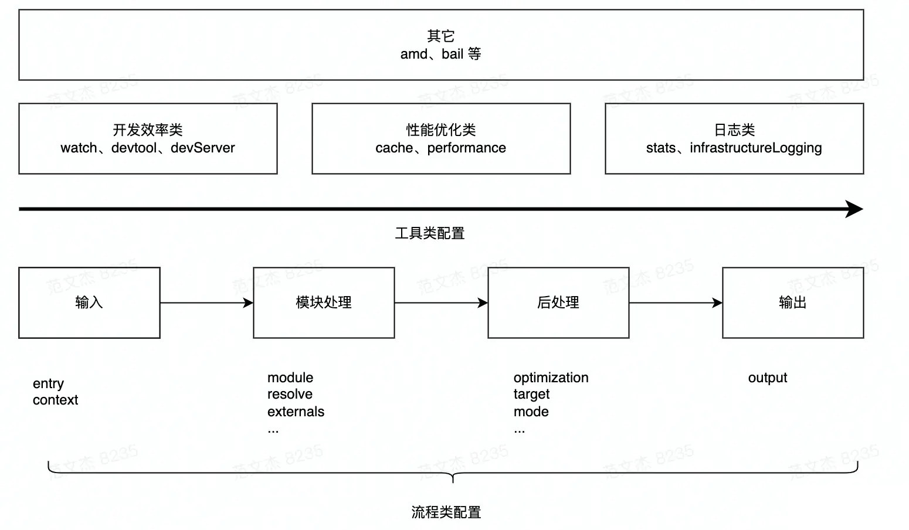

# Webpack5常用配置

## 配置综述

Webpack 打包流程可简化为：

- 输入：从文件系统读取代码文件。

- 模块递归处理：调用 Loader 转义 Module 内容，将结果转换为 AST，从中分析出模块依赖关系，进一步调用模块处理流程，直到所有依赖文件都处理完毕。

- 后处理：所有模块递归处理完毕后开始执行后处理，包括模块合并、注入运行时、产物优化等，最终输出 Chunk 集合。

- 输出：将 Chunk 写出到外部文件系统。

从流程角度，Webpack 配置项大体分为两类：

- 流程类：作用于打包流程某个或若干个环节，直接影响编译打包效果的配置项。

- 工具类：打包主流程之外，提供更多工程化工具的配置项。



流程类配置项：

- 输入输出

    - entry：入口

    - output：输出路径、名称等

    - context：执行上下文路径

- 模块处理

    - resolve：模块路径解析规则

    - module：模块加载规则

    - externals：声明外部资源，Webpack 会直接忽略这部分资源，跳过这些资源的解析、打包操作

- 后处理

    - optimization：产物包体积相关优化

    - target：配置编译产物的目标运行环境

    - mode：编译模式

工具类配置项：

- 开发效率类

    - watch：配置持续监听文件变化

    - devtool：配置产物 Sourcemap 生成规则

    - devServer：配置与 HMR 强相关的开发服务器功能

- 性能优化类

    - cache：控制缓存编译过程及结果

    - performance：配置当产物大小超过阈值时，如何通知开发者

- 日志类

    - stats：控制编译过程的日志内容

    - infrastructureLogging：控制日志输出方式

## mode

作用：打包模式，默认是生产模式，生产模式下会做代码压缩，树摇等操作。

## target

作用：告诉Webpack为目标指定构建编译环境。

值可以是如下：

- electron-main

- electron-renderer

- node

- web

- browserslist

web和browserslist区别：web生成适合浏览器环境执行的代码，browserslist需要结合`package.json`相关配置生成兼容指定浏览器的代码。

## entry

作用：打包入口，Webpack会从这个入口开始递归找出所有文件依赖。可以设置多个打包入口。

```JavaScript
// 单入口
entry: "./src/index.js",
// 多入口
entry: {
  main: path.resolve(__dirname, './src/App.ts'),
  knockHomePage: path.resolve(__dirname, './submodule/knockHomePage/src/App.ts'),
}
```

## output

作用：打包出口，告知如何Webpack如何向磁盘写入编译文件。打包出口只能设置一个。

```JavaScript
output: {
  // 打包输出目录
  path: path.resolve(__dirname, 'dist'),
  // 项目发布路径
  publicPath: 'https://cdn.example.com/assets/',
  // 每个输出bundle的名称，并将bundle写入到output.path目录下
  filename: 'js/[name].[id].[chunkhash].js',
  // 非初始chunk文件的名称
  chunkFilename: 'js/[name].[id].[chunkhash].js',
  // 清除历史构建文件
  clean: true,
}
```

:::tip
相关文件名替换定义：

- id：Chunk的ID

- name：如果设置则是Chunk名称，否则试用Chunk的ID

- hash

    - fullhash：项目级哈希。只要项目内容发生变化，该值就会发生变化。

    - chunkhash：Chunk级哈希。只有Chunk内容发生变化，该值才会发生变化。

    - contenthash：文件级哈希。文件内容发生变化，改制才会变化。

:::

filename和chunkFilename区别：

- filename：控制非动态导入文件的文件名，即entry配置指定的入口文件。

- chunkFilename：控制动态导入文件的文件名，在运行时根据Chunk发送请求去完成，比如异步加载的代码块。

## module

作用：用于声明模块加载规则。

执行顺序：

```Plain Text
文件--->Webpack--->Loaders--->Plugins--->文件
```

### rules

配置条件：

- test：根据正则表达式来确定查找哪些文件。

- include：处理符合文件或文件夹路径。

- exclude：排除符合文件或文件夹路径。

- resource：升级版配置，见官方文档。

- resourceQuery

配置规则：

- use：使用多个loader。

- oneOf：当规则匹配时，只使用第一个匹配规则。

匹配模块：

- type：用于匹配模块，防止defaultRules和它们默认导入行为发生。

下面例子中，匹配css和scss文件如果是生产环境首先用MiniCssExtractPlugin插件处理，否则用`style-loader`，然后依次调用`css-loader`、`postcss-loader`

```JavaScript
module: {
  rules: [
    {
      test: /\.css$/,
      use: [
        isProduction ? { loader: MiniCssExtractPlugin.loader } : { loader: 'style-loader' },
        { loader: 'css-loader', options: { esModule: false } },
        { loader: 'postcss-loader' },
      ],
    },
    {
      test: /\.scss$/,
      use: [
        isProduction ? { loader: MiniCssExtractPlugin.loader } : { loader: 'style-loader' },
        { loader: 'css-loader', options: { esModule: false } },
        { loader: 'postcss-loader' },
      ],
    },
    {
      test: /\.(png|svg|jpg|jpeg|gif)$/i,
      // 注意type字段
      type: 'asset/resource',
    },
  ],
},
```

### 常用loader

JavaScript相关：

- babel-loader：将ES6+转化为ES5语法。

- ts-loader：打包编译TypeScript，结合`tsconfig.json`使用。

```JavaScript
rules: [
  { test: /.tsx?$/, loader: "ts-loader" }
]
```

资源相关：Webpack5中的配置`type: 'asset/resource',`就好了。

```JavaScript
rules: [
  {
    test: /\.(png|svg|jpg|jpeg|gif)$/i,
    type: 'asset/resource',
  },
],
```

CSS相关：

- style-loader：通过注入`<style>`标签将CSS插入到DOM中。

    - 如果需要将CSS单独提取为一个文件，可使用插件`mini-css-extract-plugin`。

    - 对于`development`模式可以使用style-loader，因为它是通过`<style></style>`标签的方式引入CSS的，加载会更快。

    - 不要将style-loader和`mini-css-extract-plugin`针对同一个CSS模块一起使用。

- css-loader：识别`.css`文件，处理CSS各种加载语法。

- less-loader

- sass-loader

- postcss-loader：PostCSS是一个允许使用JS插件转换样式的工具集，如autoprefixer等。

其他：

- eslint-loader：

## resolve

作用：设置模块如何被解析。

### extensions

作用：尝试按顺序解析这些后缀名，这样用户在使用时可以省略相关扩展名。

### alias

作用：`import`或`require`的引入别名。

```JavaScript
const path = require('path');
module.exports = {
  extensions: ['.ts', '.tsx', '.js', '.jsx', '.vue'],
  resolve: {
    alias: {
      '@': path.resolve(__dirname, 'src/'),
    },
  },
};
```

那么在代码中就可以这样引入：

```JavaScript
import dateUtils from '@/utils/date_utils';
```

### mainFields

作用：当从npm包导入模块时候，该选项决定在`package.json`中使用哪个字段导入模块。当target属性设置为`webworker`、`web`或者没有指定，默认值为`mainFields: ['browser', 'module', 'main']`；如果是node，默认值为：`mainFields: ['module', 'main']`。

## plugins

### HtmlWebpackPlugin

作用：根据指定模板创建HTML页面文件到输出目录，且将Webpack打包后的指定Chunk自动引入到这个HTML中。

```JavaScript
plugins: [
  new HtmlWebpackPlugin({
    title: 'HtmlWebpackPlugin插件输出 index',
    filename: 'index.html',
    chunks: ['index']
  }),
  new HtmlWebpackPlugin({
    title: 'HtmlWebpackPlugin插件输出 main',
    // 不写则默认index.html，多个同名会冲突
    filename: 'main.html',
    chunks: ['main']
  }),
],
```

### MiniCssExtractPlugin

作用：把CSS代码抽离出来单独放到一个文件里，可以指定文件名，支持绝对路径，会自动生成文件夹。使用它后，不需要再写`style-loader`。

除了用于插件，它还可以用于loader。

```JavaScript
const MiniCssExtractPlugin = require("mini-css-extract-plugin");
module.exports={
  // ...
  module: {
    rules: [
      {
        test: /\.css$/,
        use: [
          {
            loader: MiniCssExtractPlugin.loader,
            options: {
              publicPath: '../'
            }
          },
          "css-loader",
          'postcss-loader', 
          'sass-loader',
        ]
      }
    ]
  },
  plugins:[
    new MiniCssExtractPlugin({
      filename: "[name].css",
      chunkFilename: "[id].css"
    })
  ],
}
```

### DefinePlugin

作用：在 webpack 编译打包时可以定义的全局常量，在代码运行时可以读取使用。

```JavaScript
plugins: [
  new webpack.DefinePlugin({
    PAGE_URL: JSON.stringify(isProd
        ? 'https://www.homePro.com/page'
        : 'http://www.homeDev.com/page'
      )
  }),
]
```

### CopyWebpackPlugin

作用：将已经存在的单个文件或整个目录复制到构建目录。

```JavaScript
plugins: [
  new CopyWebpackPlugin({
    patterns: [
      { from: './static/lib', to: './static/lib' },
      { from: './static/logo.ico', to: './logo.ico' },
    ],
  }),
]
```

### webpack-bundle-analyzer

作用：一个Webpack的bundle文件分析工具，将bundle文件以可交互缩放的treemap的形式展示，可以看到项目各模块的大小。

```JavaScript
const BundleAnalyzerPlugin = require('webpack-bundle-analyzer').BundleAnalyzerPlugin;
module.exports = {
  plugins: [
    new BundleAnalyzerPlugin()
  ]
}
```

### TerserWebpackPlugin

作用：该插件使用terser来压缩JavaScript。

在Webpack5中，这个插件是开箱自带的，可以这样配置：

```JavaScript
optimization: {
  minimize: true,
},
```

## devtool

作用：控制是否生成，以及如何生成source map。

// TODO

## devServer

作用：提供基本Web服务器，并具有实时重新加载功能，即热更新。

:::tip
webpack-dev-server会从output.path中定义的目录中的bundle文件提供服务，即从`http://[devServer.host]:[devServer.port]/[output.publicPath]/[output.filename]`进行访问。
:::

```JavaScript
devServer: {
  host: 'localhost',
  port: 9000,
  // 启动gzip压缩
  compress: true,
  // 热更新
  hot: true,
  // 在服务器启动后打开浏览器
  open: true,
  // 通过HTML5 History API导航访问不到的路径，会重定向到指定的HTML文件，以便处理前端路由逻辑
  historyApiFallback: {
    rewrites: [
      { from: /^\/$/, to: '/views/landing.html' },
      { from: /^\/subpage/, to: '/views/subpage.html' },
      { from: /./, to: '/views/404.html' },
    ],
  },
  // 代理
  proxy: {
    '/web-api': {
      target: 'http://oa-core.test.xinyoudi.com',
      changeOrigin: true,
    },
  }
}
```

## externals

作用：告诉Webpack哪些模块是外部依赖，不需要被打包到最终的输出文件中。

```JavaScript
externals: {
  'pdfjs-dist': 'pdfjsLib',
}
```

`pdfjs-dist`是一个比较大的库，通过直接引入项目是可以用的，当然也可以把它当作外部库。

1.CDN引入

```HTML
<script src="https://cdn.jsdelivr.net/npm/pdfjs-dist@2.8.335/build/pdf.min.js"></script>
```

2.下载该`pdf.min.js`文件后放在`static/lib`目录下引入

```JavaScript
import * as pdfLib from 'pdfjs-dist';
if (pdfLib) {
    pdfLib.GlobalWorkerOptions.workerSrc = './static/lib/pdf-dist/build/pdf.worker.min.js';
}
```

## stat

作用：控制bundle信息如何展示。

一般用预设就好了：`normal`、`verbose`、`detailed`、`summary`。

## optimization

作用：执行Webpack相关优化，优化点需要手动配置。这里不具体展开了。

```JavaScript
optimization: {
  /* 开发模式下如下设置 可提升热更新速度 */
  moduleIds: 'deterministic',
  runtimeChunk: 'single',
  /* 开发模式下仍然打开 treeshake */
  usedExports: true,
  sideEffects: true,
  /* 开发模式下仍然 split 可以提升热更新速度 */
  splitChunks: {
    chunks: 'all',
    cacheGroups: {
      vendors: {
          test: /node_modules/,
          priority: 10,
      },
    },
  },
},
```

## performance

```JavaScript
performance: {
  // 控制用于计算性能提示的文件
  assetFilter: function (assetFilename) {
    return assetFilename.endsWith('.js');
  },
  // 提示类型
  hints: 'warning',
  // 入口起点的最大体积
  maxEntrypointSize: 2048,
  // 单个资源体积
  maxAssetSize: 100000,
}
```

## webpack-merge

作用：在实际开发中，我们常常将公用的配置抽离出来，然后分别再合并到开发和生产环境，而这个合并的工具就是webpack-merge。

```JavaScript
const { merge } = require('webpack-merge');
const common = require('./webpack.common.js');

module.exports = merge(common, {
  mode: 'development',
  devtool: 'inline-source-map',
  devServer: {
    static: './dist',
  },
});
```

