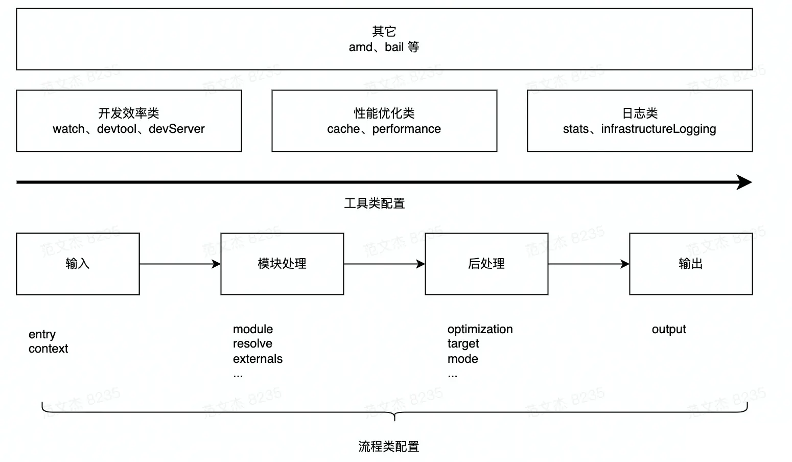
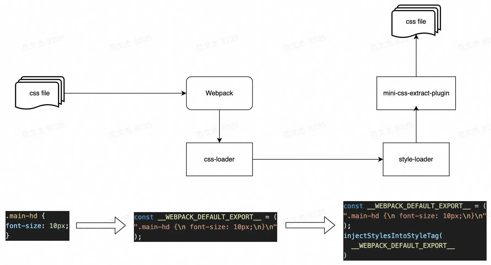

# Webpack5环境配置篇

## Webpack配置综述

Webpack打包流程可简化为：

- 输入：从文件系统读取代码文件。
- 模块递归处理：调用Loader转义Module内容，将结果转换为AST，从中分析出模块依赖关系，进一步调用模块处理流程，直到所有依赖文件都处理完毕。
- 后处理：所有模块递归处理完毕后开始执行后处理，包括模块合并、注入运行时、产物优化等，最终输出Chunk集合。
- 输出：将Chunk写出到外部文件系统。

从流程角度，Webpack配置项大体分为两类：

- 流程类：作用于打包流程某个或若干个环节，直接影响编译打包效果的配置项。
- 工具类：打包主流程之外，提供更多工程化工具的配置项。

流程类配置项：

- 输入输出
  - entry：入口
  - context：执行上下文路径
  - output：输出路径、名称等
- 模块处理
  - resolve：模块路径解析规则
  - module：模块加载规则
  - externals：声明外部资源，Webpack 会直接忽略这部分资源，跳过这些资源的解析、打包操作
- 后处理
  - optimization：产物包体积相关优化
  - target：配置编译产物的目标运行环境
  - mode：编译模式

工具类配置项：

- 开发效率类
  - watch：配置持续监听文件变化
  - devtool：配置产物Sourcemap生成规则
  - devServer：配置与HMR强相关的开发服务器功能
- 性能优化类
  - cache：控制缓存编译过程及结果
  - performance：配置当产物大小超过阈值时，如何通知开发者
- 日志类
  - stats：控制编译过程的日志内容
  - infrastructureLogging：控制日志输出方式



## 使用Babel

::: tip
在Webpack常见下，只需使用babel-loader即可接入Babel转译功能
:::

1.安装依赖

```bash
npm i -D @babel/core @babel/preset-env babel-loader
```

2.在`webpack.config.js`中添加Babel转译规则

```js
const path = require('path')
const HtmlWebpackPlugin = require('html-webpack-plugin');
module.exports = {
  mode: 'development',
  entry: {
    index: './src/index.js'
  },
  output: {
    filename: '[name].bundle.js',
    path: path.resolve(__dirname, 'dist'),
    clean: true,
  },
  plugins: [
    new HtmlWebpackPlugin({
      title: '管理输出',
    }),
  ],
  module: {
    rules: [
      {
        // 声明的规则过滤条件，对.js后缀的文件生效
        test: /\.js$/,
        // 用于该规则的Loader处理器序列
        use: [
          {
            loader: 'babel-loader',
            options: {
              // 使用@babel/preset-env这种Babel预设规则集
              presets: ['@babel/preset-env'],
            },
          },
        ],
      }
    ]
  }
}
```

Babel预设规则集Preset：

- `@babel/preset-env`：允许使用最新的JavaScript，而无需管理目标环境需要哪些语法转换。
- `babel-preset-react`：包含React常用插件的规则集，支持preset-flow、syntax-jsx、transform-react-jsx等。
- `@babel/preset-typescript`：用于转译TypeScript代码的规则集。
- `@babel/preset-flow`：用于转译Flow代码的规则集。

## 使用TypeScript

### ts-loader

1.安装依赖

```bash
npm i -D typescript ts-loader
```

2.配置`webpack.config.js`

```js
const path = require('path')
const HtmlWebpackPlugin = require('html-webpack-plugin');
module.exports = {
  mode: 'development',
  entry: {
    index: './src/index.ts'
  },
  output: {
    filename: '[name].bundle.js',
    path: path.resolve(__dirname, 'dist'),
    clean: true,
  },
  plugins: [
    new HtmlWebpackPlugin({
      title: '管理输出',
    }),
  ],
  module: {
    rules: [
      {
        // 声明的规则过滤条件，对.ts后缀的文件生效
        test: /\.ts$/i,
        use: [
          {
            loader: 'ts-loader'
          }
        ]
      },
    ]
  },
  // 声明自动解析.ts和.js后缀文件，简化导入后缀
  resolve: {
    extensions: ['.js', '.ts'],
  }
}
```

3.创建`tsconfig.json`配置文件

```json
{
  "compilerOptions": {
    "noImplicitAny": true,
    "moduleResolution": "Node"
  },
  "include": [
    "./src/**/*"
  ]
}
```

### @babel/preset-typescript

如果项目中已经使用了babel-loader，也可以使用`@babel/preset-typescript`规则集来完成JavaScript与TypeScript的转码工作

::: warning
- `babel-loader`会忽略TypeScript类型检查，能让整个转换操作变得更快
- `ts-loader`用于将`Typescript`转换为`Javascript`；`babel-loader`则用于根据我们的要求将该`Javascript`转换为目标浏览器友好的代码版本。
:::

1.安装依赖

```bash
npm i -D @babel/preset-typescript
```

2.配置`webpack.config.js`

```js
module.exports = {
  ...
  module: {
    rules: [
      {
        test: /\.js$/,
        use: [
          {
            loader: 'babel-loader',
            options: {
              presets: ['@babel/preset-typescript'],
            },
          },
        ],
      },
    ],
  },
};
```

## 使用ESlint

1.安装依赖

```bash
# 安装eslint 
npm install -D eslint eslint-webpack-plugin
# 安装eslint规范
npm install -D eslint-config-standard eslint-plugin-promise eslint-plugin-import eslint-plugin-node eslint-plugin-n
```

2.添加`.eslintrc.js`配置文件

```js
module.exports = {
  extends: [
    'standard'
  ]
}
```

3.在`webpack.config.js`文件中补充`eslint-webpack-plugin`配置

```js
const path = require('path')
const ESLintPlugin = require('eslint-webpack-plugin')
module.exports = {
  entry: './src/index',
  mode: 'development',
  devtool: false,
  output: {
    filename: '[name].bundle.js',
    path: path.resolve(__dirname, 'dist')
  },
  // 添加eslint-webpack-plugin插件实例
  plugins: [new ESLintPlugin()]
}
```

除了常规的JavaScript代码风格检查外，还可以适当使用ESLint插件、配置集来实现更丰富的检查功能：

- `eslint-config-airbnb`：Airbnb提供的代码风格规则集，算得上 ESLint 生态第一个成名的规则集合
- `eslint-config-standard`：Standard.js代码风格规则集，史上最便捷的统一代码风格的方式
- `eslint-plugin-vue`：实现对Vue SFC文件的代码风格检查
- `eslint-plugin-react`：实现对React代码风格检查
- `@typescript-eslint/eslint-plugin`：实现对TypeScript代码风格检查
- `eslint-plugin-sonarjs`：基于Sonar的代码质量检查工具，提供圈复杂度、代码重复率等检测功能

## 处理CSS

Webpack处理CSS文件，通常需要：

- `css-loader`：将CSS等价翻译为形如`module.exports = "${css}"`的JavaScript代码，使得Webpack能处理解析CSS内容与资源依赖
- `style-loader`：在产物中注入一系列runtime代码，这些代码会将CSS内容注入到页面的`<style>`标签，使样式生效
- `mini-css-extract-plugin`：将CSS代码抽离到单独的`.css`文件，并通过`<link>`标签方式插入到页面中



1.安装相关loader和插件

```bash
npm install css-loader style-loader mini-css-extract-plugin --save-dev
```

2.修改`webpack.config.js`，定义`.css`规则

```js{3,16,32-38}
const path = require('path')
const HtmlWebpackPlugin = require('html-webpack-plugin')
const MiniCssExtractPlugin = require('mini-css-extract-plugin')
const ESLintPlugin = require('eslint-webpack-plugin')
module.exports = {
  mode: 'development',
  entry: {
    index: './src/index.ts'
  },
  output: {
    filename: '[name].bundle.js',
    path: path.resolve(__dirname, 'dist'),
    clean: true
  },
  plugins: [
    new MiniCssExtractPlugin(),
    new HtmlWebpackPlugin({
      title: '管理输出'
    }),
    new ESLintPlugin()
  ],
  module: {
    rules: [
      {
        test: /\.ts$/i,
        use: [
          {
            loader: 'ts-loader'
          }
        ]
      },
      {
        // style-loader(css-loader(css))链式调用
        test: /\.css$/i,
        use: [(process.env.NODE_ENV === 'development'
          ? 'style-loader'
          : MiniCssExtractPlugin.loader), 'css-loader']
      }
    ]
  },
  resolve: {
    extensions: ['.js', '.ts']
  }
}
```

::: warning
`process.env.NODE_ENV`默认在webpack配置文件中默认是不生效的，但我们可以使用`cross-env`让其生效，在`package.json`中配置即可：`"build": "cross-env NODE_ENV=development webpack"`
:::

对css-loader处理后的字符串还不会对页面样式产生影响，需要继续处理。在开发和生成环境分别处理：

- 开发环境：使用`style-loader`将样式代码注入到页面`<style>`标签。
- 生成环境：使用`mini-css-extract-plugin`将样式代码抽离到单独产物文件，并以`<link>`标签方式引入到页面中。

::: danger
生产环境使用`mini-css-extract-plugin`需要注意：

- `mini-css-extract-plugin`同时提供loader和plugin，必须同时使用。
- `mini-css-extract-plugin`不能与`style-loader`混用，否则报错，通过`process.env.NODE_ENV`判断在何种环境中使用哪个loader。
- `mini-css-extract-plugin`必须和`html-webpack-plugin`同时使用，才能将产物路径以`<link>`方式插入到HTML中。
:::

## 使用预处理器

1.安装预处理器loader

```bash
# less
npm install less less-loader --save-dev
# sass
npm install sass sass-loader --save-dev
# stylus
npm install stylus stylus-loader --save-dev
```

2.配置`webpack.config.js`

```js
module.exports = {
  ...
  module: {
    rules: [
      {
        test: /\.less$/i,
        use: [
          'style-loader',
          'css-loader',
          'less-loader'
        ]
      },
      {
        test: /\.s[ac]ss$/i,
        use: [
          'style-loader',
          'css-loader',
          'sass-loader'
        ]
      },
      {
        test: /\.styl$/i,
        use: [
          'style-loader',
          'css-loader',
          'stylus-loader'
        ]
      }
    ]
  },
}
```

## 使用PostCSS

1.安装PostCSS

```bash
# postcss
npm install postcss postcss-loader --save-dev
# autoprefixer
npm install autoprefixer --save-dev
```

2.配置`webpack.config.js`

```js
module.exports = {
  ...
  module: {
    rules: [
      {
        test: /\.css$/i,
        use: [
          'style-loader',
          {
            loader: 'css-loader',
            options: {
              importLoaders: 1
            }
          },
          {
            loader: 'postcss-loader',
            options: {
              postcssOptions: {
                // 添加autoprefixer插件，为CSS代码自动添加浏览器前缀
                plugins: [require('autoprefixer')]
              }
            }
          }
        ]
      }
    ]
  },
}
```

3.当然，上述autoprefixer插件是可以单独提出来的

`postcss.config.js`：

```js
module.exports = {
  plugins: [
    require("autoprefixer")
  ],
};
```

`webpack.config.js`：

```js
module.exports = {
  ...
  module: {
    rules: [
      {
        test: /\.css$/i,
        use: [
          'style-loader',
          {
            loader: 'css-loader',
            options: {
              importLoaders: 1
            }
          },
          'postcss-loader'
        ]
      }
    ]
  },
}
```

PostCSS最大的优势在于其简单、易用、丰富的插件生态，基本上已经能够覆盖样式开发的方方面面。实践中，经常使用的插件有：

- `autoprefixer`：基于Can I Use网站上的数据，自动添加浏览器前缀。
- `postcss-preset-env`：一款将最新CSS语言特性转译为兼容性更佳的低版本代码的插件。
- `postcss-less`：兼容Less语法的PostCSS插件，类似的还有：postcss-sass、poststylus。
- `stylelint`：一个现代CSS代码风格检查器，能够帮助识别样式代码中的异常或风格问题。

## Webpack搭建Vue全栈开发环境

## Webpack搭建React全栈开发环境

## Webpack搭建NPM Library

## Webpack搭建微前端应用

## Webpack搭建PWA、Electron应用

## Webpack加载图像

