# JavaScript编程语言(上)

> JS学习原文：https://zh.javascript.info/

## 一、JS基础知识

### `<script>`标签

```html
<!--以下两种方式都是比较老的写法，现在不用了-->
<script type=…>
<script language=…>
```

使用外部脚本：

```html
<script src="/path/to/script.js"></script>
<script src="https://cdnjs.cloudflare.com/ajax/libs/lodash.js/4.17.11/lodash.js"></script>
```

> 一般来说，只有最简单的脚本才嵌入到 HTML 中。更复杂的脚本存放在单独的文件中。使用独立文件的好处是浏览器会下载它，然后将它保存到浏览器的缓存中。

!> **如果设置了`src` 特性，`script` 标签内容将会被忽略。**

```html
<script src="file.js">
  alert(1); // 此内容会被忽略，因为设定了 src
</script>
```

### 代码结构

#### 分号

当存在换行符（line break）时，在大多数情况下可以省略分号。

```js
alert('Hello')
alert('World')
```

但也有特例，比如：

```js
alert("There will be an error")
[1, 2].forEach(alert)
```

这个会看作一行，报错

!> 写JS代码尽量带上分号，以免出现难以找到的错误

#### 注释

单行：`//……`

多行：`/*……*/`

嵌套是不支持的，下面这个会报错：

```js
/*
  /* 嵌套注释 ?!? */
*/
```

### use strict

当它处于脚本文件的顶部时，则整个脚本文件都将以“现代”模式进行工作。

!> **确保 “use strict” 出现在最顶部，否则只是部分生效。**

没有类似于 `"no use strict"` 这样的指令可以使程序返回默认模式。一旦进入了严格模式，就没有回头路了。

### 变量

#### 变量

使用`let`关键字，跟其他语言类似

```js
let user = 'John', age = 25, message = 'Hello';
```

> var关键字比较老，这个之后遇到再讲

+ 变量不能声明多次，否则会报错
+ 变量区分大小写

+ JS中可以使用`$`或者`_`声明变量，这个有点奇葩

```js
let $ = 1; // 使用 "$" 声明一个变量
let _ = 2; // 现在用 "_" 声明一个变量

alert($ + _); // 3
```

#### 常量

```js
// 常量声明后就不能修改了
// 这个常量用大写更规范，是直接定义的
const COLOR_RED = "#F00";
// 这个常量用小写更规范，间接定义
const color = COLOR_RED;
```

### 数据类型简介

在 JavaScript 中有 8 种基本的数据类型（译注：7 种原始类型和 1 种引用类型）

1.Number

+ 代表整数和浮点数
+ 可以四则运算
+ 特殊：`Infinity`、`-Infinity` 和 `NaN`（计算错误）。
+ “number” 类型无法表示大于 `(253-1)`（即 `9007199254740991`），或小于 `-(253-1)` 的整数。

2.BigInt

表示任意长度的整数。

```js
// 尾部的 "n" 表示这是一个 BigInt 类型
const bigInt = 1234567890123456789012345678901234567890n;
```

> 这种数据类型很少使用，不详细介绍了，具体可参考链接：https://zh.javascript.info/bigint

3.String

在 JavaScript 中，有三种包含字符串的方式。

```
双引号："Hello"
单引号：'Hello'
反引号：`Hello`
```

**反引号**是 **功能扩展** 引号。它们允许我们通过将变量和表达式包装在 `${…}` 中，来将它们嵌入到字符串中。

```js
let name = "John";
// 嵌入一个变量
alert( `Hello, ${name}!` ); // Hello, John!
// 嵌入一个表达式
alert( `the result is ${1 + 2}` ); // the result is 3
```

4.Boolean

5.null值

JavaScript 中的 `null` 仅仅是一个代表“无”、“空”或“值未知”的特殊值。

```js
// 表示age是未知的。
let age = null;
```

6.undefined值

`undefined` 的含义是 `未被赋值`。如果一个变量已被声明，但未被赋值，那么它的值就是 `undefined`

7.object和symbol

`object` 类型是一个特殊的类型。

其他所有的数据类型都被称为“原始类型”，因为它们的值只包含一个单独的内容（字符串、数字或者其他）。相反，`object` 则用于储存数据集合和更复杂的实体。

因为它非常重要，所以我们对其进行单独讲解。在充分学习了原始类型后，我们将会在 [对象](https://zh.javascript.info/object) 一章中介绍 `object`。

`symbol` 类型用于创建对象的唯一标识符。我们在这里提到 `symbol` 类型是为了完整性，但我们要在学完 `object` 类型后再学习它。

8.typeof 运算符

`typeof` 运算符返回参数的类型。它支持两种语法形式：

- 作为运算符：`typeof x`。
- 函数形式：`typeof(x)`。

### 交互

1.alert：弹窗

2.prompt：显示一个带有文本消息的模态窗口

格式：`result = prompt(title, [default]);`

例子：

```js
let age = prompt('How old are you?', 100);
alert(`You are ${age} years old!`); // You are 100 years old!
```

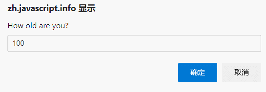

3.confirm：显示一个带有 `question` 以及确定和取消两个按钮的模态窗口。

格式：`result = confirm(question);`

上述所有方法共有两个限制：

- 模态窗口的确切位置由浏览器决定。通常在页面中心。
- 窗口的确切外观也取决于浏览器。我们不能修改它。

### 类型转换

1.字符串

```js
let value = true;
value = String(value); // 现在，值是一个字符串形式的 "true"
alert(typeof value); // string类型
```

2.数字

```js
let str = "123";
let num = Number(str); // 变成 number 类型 123
alert(typeof num); // number类型
```

如果字符串不是数字，则转换失败

number 类型转换规则：

| 值              | 变成……                                                       |
| :-------------- | :----------------------------------------------------------- |
| `undefined`     | `NaN`                                                        |
| `null`          | `0`                                                          |
| `true 和 false` | `1` and `0`                                                  |
| `string`        | 去掉首尾空格后的纯数字字符串中含有的数字。如果剩余字符串为空，则转换结果为 `0`。否则，将会从剩余字符串中“读取”数字。当类型转换出现 error 时返回 `NaN`。 |

3.布尔

转换规则如下：

- 直观上为“空”的值（如 `0`、空字符串、`null`、`undefined` 和 `NaN`）将变为 `false`。
- 其他值变成 `true`。

```js
Boolean(1); // true
Boolean(0); // false
Boolean("hello"); // true
Boolean(""); // false
```

!> **请注意：包含 0 的字符串** `"0"` **是** `true`

### 基础运算符

1.数学

- 加法 `+`
- 减法 `-`
- 乘法 `*`
- 除法 `/`
- 取余 `%`
- 求幂 `**`：`4 ** (1/2)`的值为2

2.字符串连接

这里和Java中一样，使用`+`连接字符串

3.一元运算符`+`

它的效果和 `Number(...)` 相同，但是更加简短。

```js
let apples = "2";
let oranges = "3";
// 更长的写法
alert( Number(apples) + Number(oranges) ); // 5
// 在二元运算符加号起作用之前，所有的值都被转化为了数字
alert( +apples + +oranges ); // 5
```

4.一元运算符`-`

**减法始终将字符串转换为数字。**

对数字求负数，如`x = -2; x = -x`，则x结果为2

> 一元加号、一元负号的优先级是最高的

5.链式赋值

```js
a = b = c = 2 + 2;
```

6.位运算符

与 ( `&` )、按位或 ( `|` )、异或 ( `^` )、非 ( `~` )、左移 ( `<<` )、右移 ( `>>` )无符号右移 ( `>>>` )

> 一些练习，下面这些表达式的结果是什么？

```js
"" + 1 + 0
"" - 1 + 0
true + false
6 / "3"
"2" * "3"
4 + 5 + "px"
"$" + 4 + 5
"4" - 2
"4px" - 2
7 / 0
"  -9  " + 5
"  -9  " - 5
null + 1
undefined + 1
" \t \n" - 2
```

1. 有字符串的加法 `"" + 1`，首先会将数字 `1` 转换为一个字符串：`"" + 1 = "1"`，然后我们得到 `"1" + 0`，再次应用同样的规则得到最终的结果。
2. 减法 `-`（像大多数数学运算一样）只能用于数字，它会使空字符串 `""` 转换为 `0`。
3. 带字符串的加法会将数字 `5` 加到字符串之后。
4. **减法始终将字符串转换为数字**，因此它会使 `" -9 "` 转换为数字 `-9`（忽略了字符串首尾的空格）。
5. `null` 经过数字转换之后会变为 `0`。
6. `undefined` 经过数字转换之后会变为 `NaN`。
7. 字符串转换为数字时，会忽略字符串的首尾处的空格字符。在这里，整个字符串由空格字符组成，包括 `\t`、`\n` 以及它们之间的“常规”空格。因此，类似于空字符串，所以会变为 `0`。

### 值的比较

1.基本比较>、>=、<、<=、==、!=

2.结果是Boolean

```js
let result = 5 > 4; // 把比较的结果赋值给 result
alert( result ); // true
```

3.字符串比较

安装字典序比较

```js
alert( 'Glow' > 'Glee' ); // true
```

!> **JS字符串比较非真正的字典顺序，而是 Unicode 编码顺序。**比如说，字符串比较对字母大小写是敏感的。大写的 `"A"` 并不等于小写的 `"a"`。哪一个更大呢？实际上小写的 `"a"` 更大。这是因为在 JavaScript 使用的内部编码表中（Unicode），小写字母的字符索引值更大。

4.不同类型间的比较

当对不同类型的值进行比较时，JavaScript 会首先将其转化为数字（number）再判定大小。

```js
alert( '2' > 1 ); // true，字符串 '2' 会被转化为数字 2
alert( '01' == 1 ); // true，字符串 '01' 会被转化为数字 1
// 对于布尔类型值，true 会被转化为 1、false 转化为 0。
alert( true == 1 ); // true
alert( false == 0 ); // true
```

> **一个有趣的现象**
>
> 有时候，以下两种情况会同时发生：
>
> - 若直接比较两个值，其结果是相等的。
> - 若把两个值转为布尔值，它们可能得出完全相反的结果，即一个是 `true`，一个是 `false`。

```js
let a = 0;
alert( Boolean(a) ); // false

let b = "0";
alert( Boolean(b) ); // true

alert(a == b); // true!
```

5.严格相等

普通的相等性检查 `==` 存在一个问题，它不能区分出 `0` 和 `false`：

```js
alert( 0 == false ); // true
```

也同样无法区分空字符串和 `false`：

```js
alert( '' == false ); // true
```

还有：

```js
alert( null == undefined ); // true
```

这是因为在比较不同类型的值时，处于相等判断符号 `==` 两侧的值会先被转化为数字。空字符串和 `false` 也是如此，转化后它们都为数字 0。

如果我们需要区分 `0` 和 `false`，该怎么办？

**严格相等运算符 `===` 在进行比较时不会做任何的类型转换。**

总结：

- 除了严格相等 `===` 外，其他但凡是有 `undefined/null` 参与的比较，我们都需要格外小心。
- 除非你非常清楚自己在做什么，否则永远不要使用 `>= > < <=` 去比较一个可能为 `null/undefined` 的变量。对于取值可能是 `null/undefined` 的变量，请按需要分别检查它的取值情况。

!> `==`判断是个很坑爹的东西，慎用

这个是`==`：


这个是`===`：


### 逻辑运算符

+ &&：与，从左到右寻找第一个假值
+ ||：或，从左到右寻找第一个真值

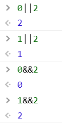

+ !：非
+ !!：转换为布尔类型
  + 另一种方式是使用Boolean函数

```js
alert( !!"non-empty string" ); // true
alert( !!null ); // false
alert( Boolean("non-empty string") ); // true
alert( Boolean(null) ); // false
```

> 与运算 `&&` 的优先级比或运算 `||` 要高。

### 空值合并运算符 '??'

空值合并运算符 `??` 提供了一种从列表中选择第一个“已定义的”值的简便方式。

```js
// 当 height 的值为 null 或 undefined 时，将 height 的值设置为 100
height = height ?? 100;
```

- `??` 运算符的优先级非常低，仅略高于 `?` 和 `=`，因此在表达式中使用它时请考虑添加括号。
- 如果没有明确添加括号，不能将其与 `||` 或 `&&` 一起使用。

### 选择

1.if……else if……else……

2.三目运算符：`let result = condition ? value1 : value2;`

```js
let company = 'Netscape';
(company == 'Netscape') ?
    alert('Right!') : alert('Wrong.');
```

3.`switch…case`：与C语言中相同

### 循环

1.`while(condition){ //循环体 }`

2.`do { //循环体 } while (condition);`

3.`for (let i = 0; i < 10; i++) { //循环体 }`，变量i只在循环体内有效

4.`break;`：出循环

5.`continue;`：跳过后面的进行下一次循环

6.循环标签

```js
outer: for (let i = 0; i < 3; i++) {
    for (let j = 0; j < 3; j++) {
        let input = prompt(`Value at coords (${i},${j})`, '');
        // 如果是空字符串或被取消，则中断并跳出这两个循环。
        if (!input){
            break outer; // (*)
        }
        // 用得到的值做些事……
    }
}
alert('Done!');
```

上述代码中，`break outer` 向上寻找名为 `outer` 的标签并跳出当前循环。因此，控制权直接从 `(*)` 转至 `alert('Done!')`。

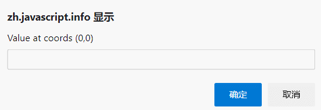

### 函数

1.声明

```js
function name(parameters) {
    ...body...
}
```

2.变量作用域，是函数体内部还是函数体外部

如果有同名变量，函数体内部的会遮蔽外部的

3.参数

4.参数默认值

```js
// text有参数默认值"no text given"
function showMessage(from, text = "no text given") {
    alert( from + ": " + text );
}
// 函数参数不传入text时，就给text赋默认值
showMessage("Ann"); // Ann: no text given
```

参数默认值的设置放在函数执行（相较更后期）而不是函数声明的时候，也能行得通。

```js
function showMessage(text) {
    if (text === undefined) {
        text = 'empty message';
    }
    // 或者写成: text = text??'empty message';
    alert(text);
}
showMessage(); // empty message
```

5.返回值

JS中不像静态语言那样显式的要求返回特定的值，同一个函数可以返回基本数据类型的多种

```js
function checkAge(age) {
    if (age >= 18) {
        return false;
    } else {
        return 'Got a permission from the parents?';
    }
}
```

!> **空值的** `return` **或没有** `return` **的函数返回值为** `undefined`

6.函数名，要考虑意义起名，不要瞎起名

### 函数表达式

#### 回调函数

将函数声明当做形参传入，然后再被调的函数中的调用对应的函数

```js
function ask(question, yes, no) {
  if (confirm(question)) yes()
  else no();
}

function showOk() {
  alert( "You agreed." );
}

function showCancel() {
  alert( "You canceled the execution." );
}

// 用法：函数 showOk 和 showCancel 被作为参数传入到 ask
ask("Do you agree?", showOk, showCancel);
```

> **一个函数是表示一个“行为”的值。**字符串或数字等常规值代表**数据**。函数可以被视为一个 **行为（action）**。我们可以在变量之间传递它们，并在需要时运行。

#### 函数表示式和函数声明

在 JavaScript 中，函数不是“神奇的语言结构”，而是一种特殊的值。

```js
// 函数声明,末尾无;
function sayHi() {
    alert( "Hello" );
}
// 函数表达式,末尾有;
let sayHi = function() {
    alert( "Hello" );
};
```

调用：

```js
let func = sayHi;	// 装入到变量func中
alert( func );		// 显示函数代码
func();	// 调用函数
```

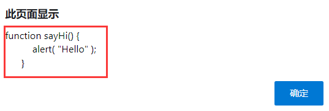

关于分号问题：

函数表达式是在语句内部的：`let sayHi = ...;`，作为一个值。它不是代码块而是一个赋值语句。不管值是什么，都建议在语句末尾添加分号 `;`。所以这里的分号与函数表达式本身没有任何关系，它只是用于终止语句。

创建函数的时间：

- **函数表达式是在代码执行到达时被创建，并且仅从那一刻起可用。**
- 函数声明则不同，**在函数声明被定义之前，它就可以被调用。**

```js
// 执行成功
sayHi("John"); // Hello, John
function sayHi(name) {
    alert( `Hello, ${name}` );
}
```

```js
// 执行失败
sayHi("John"); // error!
let sayHi = function(name) {  // (*) no magic any more
    alert( `Hello, ${name}` );
};
```

函数声明的作用域，括号`{}`内可见，括号外不可见

|                    | 函数声明                   | 函数表达式                     |
| ------------------ | -------------------------- | ------------------------------ |
| 作用域内           | 随意位置调用               | 调用位置必须在函数后面         |
| 是否能跨到外作用域 | 不能，只能在子作用域起作用 | 定义外部变量，函数装入到变量中 |
| 结尾分号           | 是代码块，因此不加分号     | 是语句，因此加分号             |

### 箭头函数

```js
/*以下两种方式是等价的*/
// 箭头函数方式
let func = (arg1, arg2, ...argN) => expression
// 函数表达式方式
let func = function(arg1, arg2, ...argN) {
    return expression;
};
```

## 二、Object对象

### 对象

JS中的对象是用`key-value`模式存储的

1.创建对象，有以下两种方式

```js
// “构造函数” 的语法
let user = new Object();
// “字面量” 的语法
let user = {};
```

2.属性访问

```js
let user = {
    name:"Long",
    age:21,
    sex:0,
    "Last Time":"2021/01/20",
};
```

```js
// 点模式
user.name
//user.Last Time     error

// 方括号模式
user[name]
user["Last Time"]

// 方括号模式间接访问
let key = "likes birds";
user[key] = true;
// 方括号模式间接访问
let key = prompt("What do you want to know about the user?", "name");
alert( user[key] ); // John（如果输入 "name"）
delete user[key];
```

3.属性值的简写

```js
function makeUser(name, age) {
  return {
    name,	// 与name:name相同
    age,	// 与age:age相同
    sex:"男",	// 原始写法
    // ...
  };
}
```

属性名可以是任何字符串或者 symbol（一种特殊的标志符类型，将在后面介绍）。

**其他类型会被自动地转换为字符串。**例如，当数字 `0` 被用作对象的属性的键时，会被转换为字符串 `"0"`：

!> 小陷阱：一个名为 `__proto__` 的属性。我们不能将它设置为一个非对象的值，这个后面再讲

4.属性检测，使用`in`操作符

```js
let user = { name: "John", age: 30 };
alert( "age" in user ); // true，user.age 存在
alert( "blabla" in user ); // false，user.blabla 不存在。
```

`===`方式的判断：

```js
alert(age===undefined);  // false
alert(blabla===undefined);  // true
```

!> 有种特例需要注意：`test: undefined`，key刚好为undefined，这种方式判断的陷进

5.“for…in” 循环

```js
for (let key in user) {
    // keys
    alert( key );  // name, age, isAdmin
    // 属性键的值
    alert( user[key] ); // John, 30, true
}
```

!> 注意：JS中的`for…in`和Java中的`for( : )`不同，前者是取出坐标key，后者是直接取出值

6.对象属性的排序

**整数属性**会被进行排序，其他属性则按照创建的顺序显示。

```js
let codes = {
  "49": "Germany",
  "41": "Switzerland",
  "44": "Great Britain",
  "1": "USA"
};

for(let code in codes) {
  alert(code); // 1, 41, 44, 49
}
```

因为这些电话号码是整数，所以它们以升序排列。所以我们看到的是 `1, 41, 44, 49`。

整数属性？那是什么？

这里的“整数属性”指的是一个可以在不做任何更改的情况下与一个整数进行相互转换的字符串。所以，**“49” 是一个整数属性名，因为我们把它转换成整数，再转换回来，它还是一样的。**但是 “+49” 和 “1.2” 就不行了：

```js
// Math.trunc 是内置的去除小数部分的方法。
alert( String(Math.trunc(Number("49"))) ); // "49"，相同，整数属性
alert( String(Math.trunc(Number("+49"))) ); // "49"，不同于 "+49" ⇒ 不是整数属性
alert( String(Math.trunc(Number("1.2"))) ); // "1"，不同于 "1.2" ⇒ 不是整数属性
```

如果属性名不是整数，那它们就按照创建时的顺序来排序

所以，为了解决电话号码的问题，我们可以使用非整数属性名来 **欺骗** 程序。只需要给每个键名加一个加号 `"+"` 前缀就行了。

像这样：

```js
let codes = {
  "+49": "Germany",
  "+41": "Switzerland",
  "+44": "Great Britain",
  // ..,
  "+1": "USA"
};

for (let code in codes) {
  alert( +code ); // 49, 41, 44, 1
}
```

7.在`if(obj)`的判定中，obj始终被判定为true

### 深拷贝

`let clone = Object.assign(user,permissions1);`

这个语句的意思是把permissions1的属性加入到user属性后面，再创建一个对象，由clone接收

```js
let user = {
    name:"Long",
    age:21,
    sex:0,
    "Last Time":"2021/01/20",
};
let permissions = { canView: true };
let clone = Object.assign(permissions,user);
console.log(clone);
console.log(user);
```

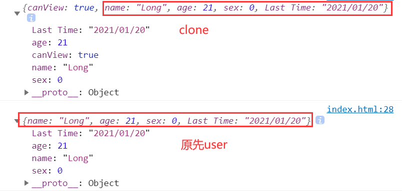

当然，如果想克隆出一模一样的，一般是这样用的：

```js
let clone = Object.assign({}, user);
```

### 垃圾回收

如果一个对象，没有从`<global variable>`指向它的路径，这个对象就会被回收

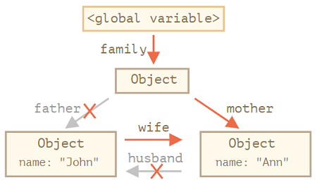

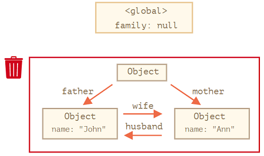

mark-and-sweep回收算法：

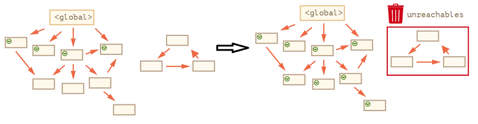

> 优化暂且跳过吧

这是垃圾收集工作的概念。JavaScript 引擎做了许多优化，使垃圾回收运行速度更快，并且不影响正常代码运行。

一些优化建议：

- **分代收集（Generational collection）**—— 对象被分成两组：“新的”和“旧的”。许多对象出现，完成它们的工作并很快死去，它们可以很快被清理。那些长期存活的对象会变得“老旧”，而且被检查的频次也会减少。
- **增量收集（Incremental collection）**—— 如果有许多对象，并且我们试图一次遍历并标记整个对象集，则可能需要一些时间，并在执行过程中带来明显的延迟。所以引擎试图将垃圾收集工作分成几部分来做。然后将这几部分会逐一进行处理。这需要它们之间有额外的标记来追踪变化，但是这样会有许多微小的延迟而不是一个大的延迟。
- **闲时收集（Idle-time collection）**—— 垃圾收集器只会在 CPU 空闲时尝试运行，以减少可能对代码执行的影响。

### this

#### 方法的简写

下面三种写法结果都是相同的

```js
// 写法一：函数声明放在对象外面进行赋值
let user = {
    name:"Lily",
    age:18
};
function sayHi(){
    alert("Hello");
};
user.sayHi=sayHi;
user.sayHi();
// 写法二：函数放在对象内部赋值
let user = {
    name:"Jack",
    age:21,
    sayHi: function() {
        alert("Hello");
    }
};
user.sayHi();
// 写法三：简写方式，常见Vue中
let user = {
    name:"Jack",
    age:21,
    sayHi() {
        alert("Hello");
    }
};
user.sayHi();
```

#### 判断this调用指向哪

在 JavaScript 中，`this` 关键字与其他大多数编程语言(上)中的不同。JavaScript 中的 `this` 可以用于任何函数，即使它不是对象的方法。

先看段代码：

```js
var A = {
    name: '张三',
    f: function () {
        console.log('姓名：' + this.name);
    }
};
var B = {
    name: '李四'
};
B.f = A.f;
B.f()   // 姓名：李四
A.f()   // 姓名：张三
```

为啥是这个结果，如图：

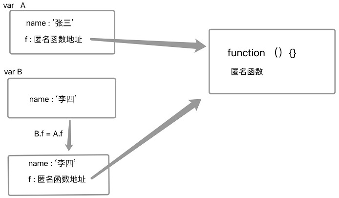


如果一个函数中有this，这个函数有被上一级的对象所调用，那么this指向的就是上一级的对象。

如果一个函数中有this，这个函数中包含多个对象，尽管这个函数是被最外层的对象所调用，this指向的也只是它上一级的对象

!> 两句话合起来讲了一个意思：**this永远指向的是最后调用它的对象**，只是这个最后一次调用大多数情况指向是它的上级对象

```js
var o = {
    a:10,
    b:{
        a:12,
        fn:function(){
            console.log(this.a); //12
        }
    }
}
o.b.fn();
```

关于return，符合如下规律：

+ 返回值为对象时候，this指向这个对象
+ 返回值不为对象时候，this不更新

```js
function fn()  
{  
    this.user = '追梦子';  
    return {};  
}
var a = new fn;  
console.log(a.user); //undefined
/**************************************************/
function fn()  
{  
    this.user = '追梦子';  
    return function(){};
}
var a = new fn;  
console.log(a.user); //undefined
/**************************************************/
function fn()  
{  
    this.user = '追梦子';  
    return undefined;
}
var a = new fn;  
console.log(a.user); //追梦子
/**************************************************/
function fn()  
{  
    this.user = '追梦子';  
    return 1;
}
var a = new fn;  
console.log(a.user); //追梦子
```

再看一个例子：

```js
let o = {
    a:10,
    b:{
        a:12,
        fn:function(){
            console.log(this);
        }
    }
}
o.b.fn();
// j为global
let j = o.b.fn;
j();
/**************************
{ a: 12, fn: [Function: fn] }
Object [global] {
  global: [Circular],
  clearInterval: [Function: clearInterval],
  clearTimeout: [Function: clearTimeout],
  setInterval: [Function: setInterval],
  setTimeout: [Function: setTimeout] { [Symbol(util.promisify.custom)]: [Function] },
  queueMicrotask: [Function: queueMicrotask],
  clearImmediate: [Function: clearImmediate],
  setImmediate: [Function: setImmediate] {
    [Symbol(util.promisify.custom)]: [Function]
  }
}
**************************/
```

j虽然引用了o.b.fn，但是此时j属于global，this因此也指向global

#### 箭头函数中的this

箭头函数没有自己的 “this”：

Java中的箭头函数是基于匿名类的，JavaScript中的箭头函数是基于函数表达式的

```js
// 这里的arrow()使用的this来自于外部的user.sayHi()方法
let user = {
  firstName: "Ilya",
  sayHi() {
    let arrow = () => alert(this.firstName);
    arrow();
  }
};
user.sayHi(); // Ilya
```

### 构造器

1.构造函数执行了啥？

当一个函数被使用 `new` 操作符执行时，它按照以下步骤：

- 一个新的空对象被创建并分配给 `this`。
- 函数体执行。通常它会修改 `this`，为其添加新的属性。
- 返回 `this` 的值。

```js
// 构造器的使用方法
function User(name) {
    // this = {};（隐式创建）
    // 添加属性到 this
    this.name = name;
    this.isAdmin = false;
    // return this;（隐式返回）
}
let user = new User("Jack");
```

> 有种创建单个对象的方式：就是直接`new function() {}`
>
> 即：`let user = new function() { this.name = "John";this.isAdmin = false; };`

2.new.target，不常用，跳过

3.return

通常，构造器没有 `return` 语句。它们的任务是将所有必要的东西写入 `this`，并自动转换为结果。

但是，如果这有一个 `return` 语句，那么规则就简单了：

- 如果 `return` 返回的是一个对象，则返回这个对象，而不是 `this`。
- 如果 `return` 返回的是一个原始类型，则忽略。

4.构造器中的方法

> 我们不仅可以将属性添加到 `this` 中，还可以添加方法。

下面的 `new User(name)` 用给定的 `name` 和方法 `sayHi` 创建了一个对象：

```js
function User(name) {
  this.name = name;

  this.sayHi = function() {
    alert( "My name is: " + this.name );
  };
}

let john = new User("John");

john.sayHi(); // My name is: John

/*
john = {
   name: "John",
   sayHi: function() { ... }
}
*/
```

### 可选链 "?."

#### 不存在属性问题

不存在属性问题：

```js
let user = {}; // 一个没有 "address" 属性的 user 对象
alert(user.address.street); // Error!
```

常规解决方案：

```js
// if判断
alert(user.address ? user.address.street : undefined);
// &&运算符
alert( user.address && user.address.street && user.address.street.name );
```

#### 可选链的解决方案

如果可选链 `?.` 前面的部分是 `undefined` 或者 `null`，它会停止运算并返回该部分。

换句话说，例如 `value?.prop`：

- 如果 `value` 存在，则结果与 `value.prop` 相同，
- 否则（当 `value` 为 `undefined/null` 时）则返回 `undefined`。

```js
// 使用可选链安全地访问 user.address.street 的方式：
let user = {}; // user 没有 address 属性
alert( user?.address?.street ); // undefined（不报错）
```

> 从前往后看，只要链条有一个位置是不存在的，就返回undefined

可选链使用的注意事项：

+ 不要过度使用可选链。有些地方如果肯定存在就不要使用，否则输出undefined后很难找到编程上的逻辑错误
+ `?.` 前的变量必须已声明。如果变量未声明，会爆出`ReferenceError: ××× is not defined`

#### 其他变体

!> 可选链 `?.` 和`??`很像，但前者不是一个运算符，而是一个特殊的语法结构，后者是一个运算符号，只能处理值。

可选链 `?.` 语法有三种形式：

- `obj?.prop` —— 如果 `obj` 存在则返回 `obj.prop`，否则返回 `undefined`。
- `obj?.[prop]` —— 如果 `obj` 存在则返回 `obj[prop]`，否则返回 `undefined`。
- `obj.method?.()` —— 如果 `obj.method` 存在则调用 `obj.method()`，否则返回 `undefined`。

```js
// 可选链访问方法
let userAdmin = {
    admin() {
        alert("I am admin");
    }
};
let userGuest = {};
userAdmin.admin?.(); // I am admin
userGuest.admin?.(); // 啥都没有（没有这样的方法）
// 可选链访问属性
let user1 = {
    firstName: "John"
};
let user2 = null; // 假设，我们不能授权此用户
let key = "firstName";
alert( user1?.[key] ); // John
alert( user2?.[key] ); // undefined
alert( user1?.[key]?.something?.not?.existing); // undefined
```

本质上讲上面都是同一样东西，?左边是判断key是否存在，存在的话才能访问右边的value

另外注意：

**可选链结构只能读取和删除，不能写入**，下面这个结构就是错误的

```js
let user = null;
user?.name = "John"; // Error，不起作用
// 因为它在计算的是 undefined = "John"
```

### Symbol

#### Symbol特性

根据规范，对象的属性键只能是**字符串类型或者 Symbol 类型**。不是 Number，也不是 Boolean，只有字符串或 Symbol 这两种类型。

**Symbol（符号）保证是唯一的。**即使我们创建了许多具有相同描述的 Symbol，它们的值也是不同。描述只是一个标签，不影响任何东西。

```js
let user = {
  name:"Jenny"
};
let id = Symbol("id");
user[id] = 2;
// 隐式不可见
console.log(user.id);
// 唯一访问方式
console.log(user[id]);
// 转换为字符串访问
console.log(id.toString());
// 获取description属性
console.log(id.description);

/*****************
undefined
2
Symbol(id)
id
****************/
```

+ 对象面中的Symbol

如果我们要在对象字面量 `{...}` 中使用 Symbol，则需要使用**方括号把它括起来。**

```js
let id = Symbol("id");
let user = {
  name: "John",
  [id]: 123 // 而不是 "id"：123
};
```

这是因为我们需要变量 `id` 的值作为键，而不是字符串 “id”。

+ Symbol 在 for…in 中会被跳过

+ 深拷贝`Object.assign()`：Symbol也会被拷贝过去

#### 全局Sysbol

```js
// 从全局注册表中读取
let id = Symbol.for("id"); // 如果该 Symbol 不存在，则创建它
// 再次读取（可能是在代码中的另一个位置）
let idAgain = Symbol.for("id");
// 相同的 Symbol
alert( id === idAgain ); // true
```

注册表内的 Symbol 被称为 **全局 Symbol**。如果我们想要一个应用程序范围内的 Symbol，可以在代码中随处访问 —— 这就是它们的用途。

`Symbol.keyFor`：使用全局 Symbol 注册表来查找 Symbol 的键。所以它不适用于非全局 Symbol。如果 Symbol 不是全局的，它将无法找到它并返回 `undefined`。

```js
// 通过 name 获取 Symbol
let sym = Symbol.for("name");
let sym2 = Symbol.for("id");
let localSymbol = Symbol("name");	// 局部Symbol
// 通过 Symbol 获取 name
alert( Symbol.keyFor(sym) ); // name
alert( Symbol.keyFor(sym2) ); // id
alert( Symbol.keyFor(localSymbol) ); // undefined，非全局
```

### 对象 — 原始值转换

下面是三个类型转换的变体，被称为 “hint”：

+ string：可以转换为String类型时
+ number：可以转换为Number类型时
+ default：不知道能转啥时

转换算法是：

- 调用 `obj[Symbol.toPrimitive](hint)` 如果这个方法存在，
- 否则，如果 hint 是`"string"`
  - 尝试 `obj.toString()` 和 `obj.valueOf()`，无论哪个存在。
- 否则，如果 hint 是`"number"`或者`"default"`
  - 尝试 `obj.valueOf()` 和 `obj.toString()`，无论哪个存在。

调用`Symbol.toPrimitive`：

```js
let user = {
  name: "John",
  money: 1000,

  [Symbol.toPrimitive](hint) {
    alert(`hint: ${hint}`);
    return hint == "string" ? `{name: "${this.name}"}` : this.money;
  }
};
// 转换演示：
alert(user); // hint: string -> {name: "John"}
alert(+user); // hint: number -> 1000
alert(user + 500); // hint: default -> 1500
```

没有`Symbol.toPrimitive`，就调用另外两种：

```js
let user = {
  name: "John",
  money: 1000,

  // 对于 hint="string"
  toString() {
    return `{name: "${this.name}"}`;
  },

  // 对于 hint="number" 或 "default"
  valueOf() {
    return this.money;
  }

};
alert(user); // toString -> {name: "John"}
alert(+user); // valueOf -> 1000
alert(user + 500); // valueOf -> 1500
```

这里解释下`alert(user + 500);`为啥是1500，是user先调用`valueOf()`后返回值为1000，再加上500才变成1500的

## 三、数据类型

### 原始类型

一个原始值：

- 是原始类型中的一种值。
- 在 JavaScript 中有 7 种原始类型：`string`，`number`，`bigint`，`boolean`，`symbol`，`null` 和 `undefined`。

一个对象：

- 能够存储多个值作为属性。
- 可以使用大括号 `{}` 创建对象，例如：`{name: "John", age: 30}`。JavaScript 中还有其他种类的对象，例如函数就是对象。

对象包装器：`String`、`Number`、`Boolean` 和 `Symbol`，它们提供了不同的方法。

```js
let str = "Hello";
alert( str.toUpperCase() ); // HELLO
```

以下是 `str.toUpperCase()` 中实际发生的情况：

1. 字符串 `str` 是一个原始值。因此，在访问其属性时，会创建一个包含字符串字面值的特殊对象（对象包装器），并且具有有用的方法，例如 `toUpperCase()`。
2. 该方法运行并返回一个新的字符串（由 `alert` 显示）。
3. 特殊对象被销毁，只留下原始值 `str`。

### 数字类型

#### 数字表示法

1.科学计数法

1e9：1000000000

1e-6：0.000001

2.其他进制

二进制：0b11111111

八进制：0o377

十六进制：0xff

3.溢出

1e500：实际为Infinity

#### 数字操作

1.进制转换：`toString(base)`

```js
let num = 255;
alert( num.toString(16) );  // ff
alert( num.toString(2) );   // 11111111
```

!> 注意：`123456..toString(36)`写法正确，等于`(123456).toString(36)`，这是为了识别小数部分

2.舍入

`Math.floor`：下舍到整数

`Math.ceil`：上舍到整数

`Math.round`：四舍五入

`toFixed(n)`：按n位舍入

```js
let num = 12.34;
// "12.34000",在结尾添加了0,以达到小数点后五位
// 但默认返回的是字符串,因此这里再转换为Number类型
alert( +num.toFixed(5) );
```

3.小数精度问题，`console.log( 0.1 + 0.2 === 0.3 );`会输出false，这个C、Java中也有，在JS中解决方法是调用`+toFixed(n)`

4.`isFinite`和`isNaN`

!> 注意：NaN不等于它自己

```js
console.log( isNaN(NaN) ); // true
console.log( isNaN("str") ); // true
console.log( isNaN("123") ); // false
console.log( isNaN(-1) ); // false
console.log( NaN===NaN ); // false

console.log( isFinite(Infinity) ); // false
console.log( isFinite("str") ); // false
console.log( isFinite("123") ); // true
console.log( isFinite(-1) ); // true
console.log( Infinity===Infinity ); // true
```

请注意，在所有数字函数中，包括 `isFinite`，空字符串或仅有空格的字符串均被视为 `0`。

5.parseInt和parseFloat

非严格数字转换，它们可以从字符串中“读取”数字，直到无法读取为止。如果发生 error，则返回收集到的数字。

```js
alert( parseInt('100px') ); // 100
alert( parseFloat('12.5em') ); // 12.5

alert( parseInt('12.3') ); // 12，只有整数部分被返回了
alert( parseFloat('12.3.4') ); // 12.3，在第二个点出停止了读取
alert( parseInt('a123') ); // NaN，第一个符号停止了读取
```

6.其他

`Math.PI`：π

`Math.E`：自然常数e

`Math.random()`：0~1的随机数

`Math.abs(x)`：绝对值

`Math.max(a, b, c...)` **/** `Math.min(a, b, c...)`：最大，最小

`Math.pow(n, power)`：幂

`Math.log(x)`：以e为底的对数

`Math.log2(x)`：以2为底的对数

### 字符串

1.引号问题，单引号、双引号、反引号

2.特殊字符，加`\`转义

3.字符串长度，`'My\n'.length`。`length` **是一个属性**

4.访问字符

```js
let str = `Hello`;
alert( str[0] ); // H
alert( str.charAt(0) ); // H
// 注意,下面两种取法结果是不同的
alert( str[1000] ); // undefined
alert( str.charAt(1000) ); // ''（空字符串）
// for…of遍历字符
for (let char of "Hello") {
  alert(char); // H,e,l,l,o（char 变为 "H"，然后是 "e"，然后是 "l" 等）
}
```

5.**JS中字符串只可读不可写**，`str[0] = 'h';`会报错

6.转大小写：`toLowerCase()`和`toUpperCase()`方法

7.查找子串

- `str.indexOf(substr,[pos])`：它从给定位置 `pos` 开始，在 `str` 中查找 `substr`，**如果没有找到，则返回 -1**，否则返回匹配成功的位置。
- `str.includes(substr,[pos])`：根据 `str` 中是否包含 `substr` 来返回 true/false。
- `str.startsWith`和`str.endsWith`：字面意思，返回true/false

8.获取子串

+ `str.slice(start,[end])`：返回字符串从 `start` 到（但不包括）`end` 的部分。

`start/end` 也有可能是负值。它们的意思是起始位置从字符串结尾计算：

```js
let str = "stringify";
// 从右边的第四个位置开始，在右边的第一个位置结束
console.log( str.slice(-4, -1) ); // 'gif'
console.log( str.slice(2, -1) ); // 'ringif'
```

start定位是左坐标，end定位的是右坐标，比如`start===2,end===-1`，这时虽然数值上start>end，但坐标上是合理的，输出`ringif`

- `str.substr(start,[length])`：返回字符串从 `start` 开始的给定 `length` 的部分。
- `str.substring(start,[end])`：大体与slice相同，但不支持负参数，因此用slice更好

9.比较字符串

`str.localeCompare(str2)`：字符串比较

- 如果 `str` 小于 `str2` 则返回负数。
- 如果 `str` 大于 `str2` 则返回正数。
- 如果它们相等则返回 `0`。

!> **切勿依赖于 -1 或 1 这样特定的返回值。**一些浏览器可能返回-2或2或其他一些负的、正的值。

### 数组

#### 数组

##### List和Array的结合体

JS中的数组更像List和Array的结合体，还不受静态语言那样泛型的约束，同一个数组里面装啥都行

```js
let arr = ['Apple',
  { name: 'John' },
  true,
  function sayHi() {
    console.log('打印：sayHi');
  }
];
console.log(arr[0]);
console.log(arr[1]);
console.log(arr[2]);
arr[3]();
/****************
Apple
{ name: 'John' }
true
打印：sayHi
****************/
```

##### 内部机制

JavaScript 引擎尝试把这些元素一个接一个地存储在连续的内存区域，就像本章的插图显示的一样，而且还有一些其它的优化，以使数组运行得非常快。但是，如果我们不像“有序集合”那样使用数组，而是像常规对象那样使用数组，这些就都不生效了。

```js
let fruits = []; // 创建一个数组
fruits[99999] = 5; // 分配索引远大于数组长度的属性
fruits.age = 25; // 创建一个具有任意名称的属性
```

这是可以的，因为数组是基于对象的。我们可以给它们添加任何属性。

但是 Javascript 引擎会发现，我们在像使用常规对象一样使用数组，那么针对数组的优化就不再适用了，然后对应的优化就会被关闭，这些优化所带来的优势也就荡然无存了。

数组误用的几种方式:

- 添加一个非数字的属性，比如 `arr.test = 5`。
- 制造空洞，比如：添加 `arr[0]`，然后添加 `arr[1000]` (它们中间什么都没有)。
- 以倒序填充数组，比如 `arr[1000]`，`arr[999]` 等等。

请将数组视为作用于 **有序数据** 的特殊结构。它们为此提供了特殊的方法。数组在 JavaScript 引擎内部是经过特殊调整的，使得更好地作用于连续的有序数据，所以请以正确的方式使用数组。如果你需要任意键值，那很有可能实际上你需要的是常规对象 `{}`。

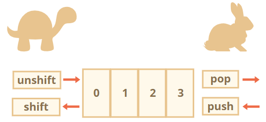

`push/pop` 方法运行的比较快，而 `shift/unshift` 比较慢。

比如shift操作，时间复杂度为O(n)：

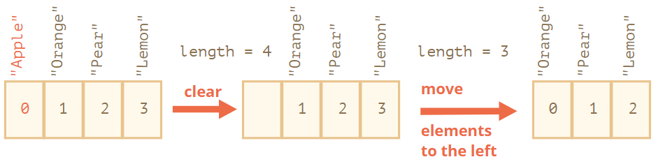

##### 遍历

```js
let arr = ['Apple',
  { name: 'John' },
  true,
  function sayHi() {
    console.log('打印：sayHi');
  }
];
for(let i=0;i<arr.length;i++){
  console.log(arr[i]);
}
for(let i in arr){
  console.log(arr[i]);
}
for(let i of arr){
  console.log(i);
}
/*****************
Apple
{ name: 'John' }
true
[Function: sayHi]
Apple
{ name: 'John' }
true
[Function: sayHi]
Apple
{ name: 'John' }
true
[Function: sayHi]
*****************/
```

通常来说，我们不应该用 `for…in` 来处理数组。

##### length

当我们修改数组的时候，`length` 属性会自动更新。准确来说，它实际上不是数组里元素的个数，而是最大的数字索引值加一。

```js
let arr = [1, 2, 3, 4, 5];

arr.length = 2; // 截断到只剩 2 个元素
alert( arr ); // [1, 2]

arr.length = 5; // 又把 length 加回来
alert( arr[3] ); // undefined：被截断的那些数值并没有回来
```

所以，清空数组最简单的方法就是：`arr.length = 0;`

##### 多维数组

```js
let matrix = [
  [1, 2, 3],
  [4, 5, 6],
  [7, 8, 9]
];
alert( matrix[1][1] ); // 最中间的那个数
```

##### toString()

数组没有 `Symbol.toPrimitive`，也没有 `valueOf`，它们只能执行 `toString` 进行转换

#### 数组方法

##### 增、删、插

+ `splice()`：都能实现，**允许负向索引**

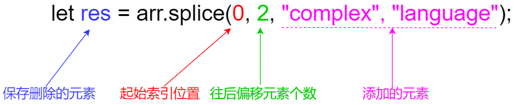

> `arr.splice`方法可以说是处理数组的瑞士军刀。它可以做所有事情：添加，删除和插入元素。

删除：

```js
// 从索引0开始删除2个元素,removed保存删除的元素
let removed = arr.splice(0, 2);
```

先删除再添加：

```js
arr.splice(0, 3, "Let's", "dance");
```

+ `slice()`：这个跟字符串那个很像，`arr.slice(-3, 5)`，取出左坐标为-3，右坐标为5的子数组

+ `concat()`：数组连接

##### forEach

`item` 是元素。

`index` 是它的索引。

`array` 是数组本身。

```js
["Bilbo", "Gandalf", "Nazgul"].forEach((item, index, array) => {
  console.log(`${item} is at index ${index} in ${array}`);
});
/****************
Bilbo is at index 0 in Bilbo,Gandalf,Nazgul
Gandalf is at index 1 in Bilbo,Gandalf,Nazgul
Nazgul is at index 2 in Bilbo,Gandalf,Nazgul
****************/
```

##### 搜索

1.index系列：

- `arr.indexOf(item, from)` 从索引 `from` 开始搜索 `item`，如果找到则返回索引，否则返回 `-1`。
- `arr.lastIndexOf(item, from)` —— 和上面相同，只是从右向左搜索。
- `arr.includes(item, from)` —— 从索引 `from` 开始搜索 `item`，如果找到则返回 `true`（译注：如果没找到，则返回 `false`）。

2.find系列：

+ `arr.find()`
+ `arr.findIndex()`

```js
let result = arr.find(function(item, index, array) {
  // 如果返回 true，则返回 item 并停止迭代
  // 对于假值（falsy）的情况，则返回 undefined
});
```

例子：

```js
let users = [
  {id: 1, name: "John"},
  {id: 2, name: "Pete"},
  {id: 3, name: "Mary"}
];

let user = users.find(item => item.id == 1);
alert(user.name); // John
```

3.filter系列：

> `find` 方法搜索的是使函数返回 `true` 的**第一个（单个）元素**， `filter` 返回的是**所有**匹配元素组成的数组：

```js
let users = [
  {id: 1, name: "John"},
  {id: 2, name: "Pete"},
  {id: 3, name: "Mary"}
];

let res = users.filter(item => item.id < 3);
console.log(res);
/******************
[ { id: 1, name: 'John' }, { id: 2, name: 'Pete' } ]
******************/
```

##### 其他操作

1.`arr.map()`：它对数组的每个元素都调用函数，并返回结果数组。

```js
let users = [
  {id: 1, name: "John"},
  {id: 2, name: "Pete"},
  {id: 3, name: "Mary"}
];

let res = users.map((item,index)=>{
  return item.name + "索引:"+index;
});
console.log(res);
/*******************
[ 'John索引:0', 'Pete索引:1', 'Mary索引:2' ]
*******************/
```

2.`arr.sort()`

默认会诸个字符的Unicode位点来排序，要改成数字排序要在sort中传入函数参数

```js
let arr = [1,0,5,19,11,10];
arr.sort((a,b)=>{
  return a<b?-1:1;
});
for(let i of arr){
  console.log(i);
}
/************************
0
1
5
10
11
19
************************/
```

3.`arr.reverse()`方法用于颠倒 `arr` 中元素的顺序。

4.`arr.split(delim)`：按照字符delim分割

`arr.join(glue)`：按照字符glue黏合

`arr.join(glue)`：按照字符glue

5.`Array.isArray()`：判断是否为数组

6.`arr.fill(value,start,end)`：用value填充数组

7.`arr.reduce()`：让这次的操作用于下一次

> .map()：对每个数组元素执行同样的操作
>
> .reduce()：对每个数组元素执行同样的操作，结果给下一个元素使用

参数：

- `accumulator` —— 是上一个函数调用的结果，第一次等于 `initial`（如果提供了 `initial` 的话）。
- `item` —— 当前的数组元素。
- `index` —— 当前索引。
- `arr` —— 数组本身。

```js
let arr = [1, 2, 3, 4, 5];
// sum-----上次调用后的结果
// current-----当前数组元素
let result = arr.reduce((sum, current) => sum + current, 0);
console.log(result); // 15
```

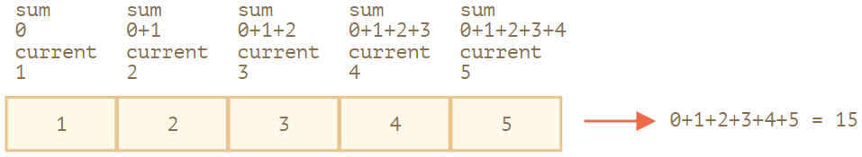

### 可迭代对象

#### Symbol.iterator

- `range` 自身没有 `next()` 方法。
- 相反，是通过调用 `range[Symbol.iterator]()` 创建了另一个对象，即所谓的“迭代器”对象，并且它的 `next` 会为迭代生成值。

```js
let range = {
  from: 1,
  to: 5,

  [Symbol.iterator]() {
    this.current = this.from;
    return this;
  },

  next() {
    if (this.current <= this.to) {
      return { done: false, value: this.current++ };
    } else {
      return { done: true };
    }
  }
};

for (let num of range) {
  console.log(num); // 1, 然后是 2, 3, 4, 5
}
```

迭代字符串

```js
for (let char of "test") {
    console.log( char ); // t, then e, then s, then t
}
```

内置的可迭代对象例如字符串和数组，都实现了 `Symbol.iterator`。

#### 可迭代和类数组

有两个看起来很相似，但又有很大不同的正式术语。请你确保正确地掌握它们，以免造成混淆。

- **Iterable** 如上所述，是实现了 `Symbol.iterator` 方法的对象。
- **Array-like** 是有索引和 `length` 属性的对象，所以它们看起来很像数组。

例如，字符串即是可迭代的（`for..of` 对它们有效），又是类数组的（它们有数值索引和 `length` 属性）。

例如，上面例子中的 `range` 是可迭代的，但并非类数组对象，因为它没有索引属性，也没有 `length` 属性。

下面这个对象则是类数组的，但是不可迭代：

```js
let arrayLike = { // 有索引和 length 属性 => 类数组对象
    0: "Hello",
    1: "World",
    length: 2
};
// Error (no Symbol.iterator)
for (let item of arrayLike) {}
```

#### Array.from

接受一个**可迭代或类数组的值**，返回一个真数组。

类数组对象转真数组：

```js
let arrayLike = {
    0: "Hello",
    1: "World",
    length: 2
};
let arr = Array.from(arrayLike); // (*)
alert(arr.pop()); // World（pop 方法有效）
```

可迭代对象转真数组：

```js
// 假设 range 来自上文的例子中
let arr = Array.from(range);
alert(arr); // 1,2,3,4,5 （数组的 toString 转化方法生效）
```

### Map和Set

#### Map

1.`Map` 允许任何类型的键（key），它的方法和属性如下：

- `new Map()` —— 创建 map。
- `map.set(key, value)` —— 根据键存储值。
- `map.get(key)` —— 根据键来返回值，如果 `map` 中不存在对应的 `key`，则返回 `undefined`。
- `map.has(key)` —— 如果 `key` 存在则返回 `true`，否则返回 `false`。
- `map.delete(key)` —— 删除指定键的值。
- `map.clear()` —— 清空 map。
- `map.size` —— 返回当前元素个数。

!> `map[key]` 不是使用 `Map` 的正确方式

+ 与对象不同，**Map中键不会被转换成字符串。**键可以是任何类型。
+ Map 还**可以使用对象作为键。**
+ **链式调用**：`map.set('1','str1').set(1,'num1').set(true,'bool1');`

2.Map迭代

- `map.keys()` —— 遍历并返回所有的键（returns an iterable for keys），
- `map.values()` —— 遍历并返回所有的值（returns an iterable for values），
- `map.entries()` —— 遍历并返回所有的实体（returns an iterable for entries）`[key, value]`，`for..of` 在默认情况下使用的就是这个。

> 迭代的顺序与插入值的顺序相同。与普通的 `Object` 不同，`Map` 保留了此顺序。

除此之外，`Map` 有内置的 `forEach` 方法，与 `Array` 类似：

```js
// 对每个键值对 (key, value) 运行 forEach 函数
recipeMap.forEach( (value, key, map) => {
  console.log(`${key}: ${value}`); // cucumber: 500 etc
});
```

3.用对象创建Map：`Object.entries(obj)`

```js
let obj = {
  name: "John",
  age: 30
};
let map = new Map(Object.entries(obj));
console.log( map.get('name') ); // John
```

  4.用Map创建对象：`Object.fromEntries(map)`

```js
let map = new Map();
map.set('banana', 1);
map.set('orange', 2);
map.set('meat', 4);
let obj = Object.fromEntries(map);
console.log(obj); // { banana: 1, orange: 2, meat: 4 }
```

#### Set

1.`Set` 是一个特殊的类型集合 —— “值的集合”（没有键），它的每一个值只能出现一次。它的主要方法如下：

- `new Set(iterable)` —— 创建一个 `set`，如果提供了一个 `iterable` 对象（通常是数组），将会从数组里面复制值到 `set` 中。
- `set.add(value)` —— 添加一个值，返回 set 本身
- `set.delete(value)` —— 删除值，如果 `value` 在这个方法调用的时候存在则返回 `true` ，否则返回 `false`。
- `set.has(value)` —— 如果 `value` 在 set 中，返回 `true`，否则返回 `false`。
- `set.clear()` —— 清空 set。
- `set.size` —— 返回元素个数。

2.Set迭代

> `values()`、`entries()`、`forEach`的参数都是为了兼容Map

- `set.keys()` —— 遍历并返回所有的值
- `set.values()` —— 与 `set.keys()` 作用相同
- `set.entries()` —— 遍历并返回所有的实体

```js
let set = new Set(["oranges", "apples",20, "bananas",function(){
  return "Hello World";
}]);
console.log(set.keys());
console.log(set.values());
console.log(set.entries());
/******************
[Set Iterator] { 'oranges', 'apples', 20, 'bananas', [Function] }
[Set Iterator] { 'oranges', 'apples', 20, 'bananas', [Function] }
[Set Entries] {
  [ 'oranges', 'oranges' ],
  [ 'apples', 'apples' ],
  [ 20, 20 ],
  [ 'bananas', 'bananas' ],
  [ [Function], [Function] ]
}
******************/
```

forEach：

```js
let set = new Set(["oranges", "apples", "bananas"]);
set.forEach((value, valueAgain, set) => {
  console.log(value);
});
```

注意一件有趣的事儿。`forEach` 的回调函数有三个参数：一个 `value`，然后是 **同一个值** `valueAgain`，最后是目标对象。没错，同一个值在参数里出现了两次。

为啥这样设计，是为了与Map兼容，哈哈~

### WeakMap和WeakSet

#### WeakMap

`WeakMap` 和 `Map` 的第一个不同点就是，`WeakMap` 的**键必须是对象**，不能是原始值

https://zh.javascript.info/weakmap-weakset

### Object...

1.对象转数组，`let arr = Object.entries(obj)`：

对于普通对象，下列这些方法是可用的：

- `Object.keys(obj)`—— 返回一个包含该对象所有的键的数组。
- `Object.values(obj)`—— 返回一个包含该对象所有的值的数组。
- `Object.entries(obj)`—— 返回一个包含该对象所有`[key, value]`键值对的数组。

第一个区别是，对于对象我们使用的调用语法是 `Object.keys(obj)`，而不是 `obj.keys()`。

第二个区别是 `Object.*` 方法返回的是“真正的”数组对象，而不只是一个可迭代项。这主要是历史原因。

> 这个针对的是普通对象，像Map、Set也有类似方法，用其各自的就行

!> 另外：**Object.keys/values/entries 会忽略 symbol 属性**

2.数组转对象，`let obj = Object.fromEntries(arr)`：

```js
let prices = {
  banana: 1,
  orange: 2,
  meat: 4,
};
console.log(Object.entries(prices));
let doublePrices = Object.fromEntries(
  // 转换为数组，之后使用 map 方法，然后通过 fromEntries 再转回到对象
  Object.entries(prices).map(([key, value]) => [key, value * 2])
);
console.log(prices);
console.log(doublePrices);
/*********************
[ [ 'banana', 1 ], [ 'orange', 2 ], [ 'meat', 4 ] ]
{ banana: 1, orange: 2, meat: 4 }
{ banana: 2, orange: 4, meat: 8 }
*********************/
```

### 解构赋值

> 结构赋值的语法本身不难，主要是各种情景的妙用

#### 数组解构

##### 使用

基本使用：

```js
let [firstName, surname] = "Ilya Kantor".split(' ');
```

忽略使用逗号的元素：

```js
// 不需要第二个元素
let [firstName, , title] = ["Julius", "Caesar", "Consul", "of the Roman Republic"];
```

等号右侧可以是任何可迭代对象：

```js
let [a, b, c] = "abc"; // ["a", "b", "c"]
let [one, two, three] = new Set([1, 2, 3]);
```

赋值给等号左侧的任何内容。例如，一个对象的属性：：

```js
let user = {};
[user.name, user.surname] = "Ilya Kantor".split(' ');
```

与`.entries()`方法进行循环操作：

```js
let user = {
  name: "John",
  age: 30
};
// 循环遍历键—值对
for (let [key, value] of Object.entries(user)) {
  console.log(`${key}:${value}`);
}
/*****************
name:John
age:30
*****************/
```

```js
let user = new Map();
user.set("name", "John");
user.set("age", "30");
for (let [key, value] of user) {
  console.log(`${key}:${value}`);
}
/*****************
name:John
age:30
*****************/
```

交换变量值的技巧：

```js
let guest = "Jane";
let admin = "Pete";

// 交换值：让 guest=Pete, admin=Jane
[guest, admin] = [admin, guest];

console.log(`${guest} ${admin}`); // Pete Jane（成功交换！）
```

##### 剩余的和默认值

剩余的：使用`...变量`解构出来

```js
let [name1, name2, ...rest] = ["Julius", "Caesar", "Consul", "of the Roman Republic"];
console.log(name1); // Julius
console.log(name2); // Caesar
console.log(rest[0]); // Consul
console.log(rest[1]); // of the Roman Republic
console.log(rest); // [ 'Consul', 'of the Roman Republic' ]
```

默认值：

```js
// 默认值
let [name = "Guest", surname = "Anonymous"] = ["Julius"];
```

#### 对象解构

```js
let options = {
  title: "Menu",
  width: 100,
  height: 200
};
// 只解构value
let {title, width, height} = options;
// 解构完value后再赋值给:后面的变量
let {title:t, width:w, height:h} = options;
// 同样可以使用...补充剩余值
let {title, ...rest} = options;
```

!> let陷阱：`({title, width, height} = {title: "Menu", width: 200, height: 100});`，最外面要加上`()`，否则会当做代码块解析，报错

#### 嵌套解构解决多参数问题

结构很清晰，解构就这么写的

```js
let options = {
  title: "My menu",
  items: ["Item1", "Item2"]
};

function showMenu({
  title = "Untitled",
  width: w = 100,  // width goes to w
  height: h = 200, // height goes to h
  items: [item1, item2] // items first element goes to item1, second to item2
}) {
  console.log( `${title} ${w} ${h}` ); // My Menu 100 200
  console.logconsole.log( item1 ); // Item1
  console.log( item2 ); // Item2
}

showMenu(options);
```

如果以上结构全部都有默认值，那么如果想使用默认值的话，应该按照如下传值：

```js
showMenu({}); // 不错，所有值都取默认值
showMenu(); // 这样会导致错误
```

### 日期和时间

1.创建

!> 月份要小心，0对应一月，11对应12月

```js
// now是当前时间
let now = new Date();
// 根据时间戳创建
let Jan02_1970 = new Date(24 * 3600 * 1000);
// 字符串创建
let date = new Date("2017-01-26");
/* (year, month, date, hours, minutes, seconds, ms)
注意这个在浏览器中和用node.js运行结果是不同的
浏览器: Sat Jan 01 2011 02:03:04 GMT+0800 (中国标准时间)
node.js: 2010-12-31T18:03:04.567Z
*/
let date = new Date(2011, 0, 1, 2, 3, 4, 567);
```

2.访问时间

- `getFullYear()`：获取年份（4位数），**记住要带上Full**
- `getMonth()`：获取月份，0~11
- `getDate()`：获取日，方法名让人疑惑
- `getHours()`：时
- `getMinutes()`：分
- `getSeconds()`：秒
- `getMilliseconds()`：毫秒
- `getDay()`：获取一周中的第几天，从 `0`（星期日）到 `6`（星期六），第一天始终是星期日。

以上方法返回组件都是基于当地时区的。

- `getTime()`：时间戳
- `getTimezoneOffset()`：返回时差，以分钟为单位

3.设置时间

- `setFullYear(year, [month\], [date])`
- `setMonth(month, [date\])`
- `setDate(date)`
- `setHours(hour, [min\], [sec], [ms])`
- `setMinutes(min, [sec\], [ms])`
- `setSeconds(sec, [ms\])`
- `setMilliseconds(ms)`
- `setTime(milliseconds)`（使用自 1970-01-01 00:00:00 UTC+0 以来的毫秒数来设置整个日期）

其实差不多，就是getter和setter

4.自动校准（Autocorrection）

**自动校准** 是 `Date` 对象的一个非常方便的特性。我们可以设置超范围的数值，它会自动校准。

```js
let date = new Date(2016, 1, 28);
date.setDate(date.getDate() + 2);
// 闰年二月是29天，现在28号，加2天自动校准为3月1号
console.log( date ); // 1 Mar 2016
```

5.日期相减

日期可以相减，相减的结果是以毫秒为单位时间差。

```js
let start = new Date(); // 开始测量时间
for (let i = 0; i < 100000; i++) {
  let doSomething = i * i * i;
}
let end = new Date(); // 结束测量时间
console.log( `The loop took ${end - start} ms` );
```

6.获取当前时间

- `Date.now()`
- `new Date().getTime()`

第二种new对象了，运行效率没有第一种高

7.从字符串中解析出日期`Date.parse(str)`，解析结果是时间戳

字符串的格式应该为：`YYYY-MM-DDTHH:mm:ss.sssZ`

### JSON

JavaScript 提供了如下方法：

- `JSON.stringify` 将对象转换为 JSON。
- `JSON.parse` 将 JSON 转换回对象。

#### 对象转JSON

##### 基本使用

跳过转换的：

- 函数属性（方法）。
- Symbol 类型的属性。
- 存储 `undefined` 的属性。

参数：`let json = JSON.stringify(value[, replacer, space])`

```js
let user = {
  sayHi() { // 被忽略
    alert("Hello");
  },
  [Symbol("id")]: 123, // 被忽略
  something: undefined // 被忽略
};

alert( JSON.stringify(user) ); // {}（空对象）
```

重要的限制：不得有循环引用。

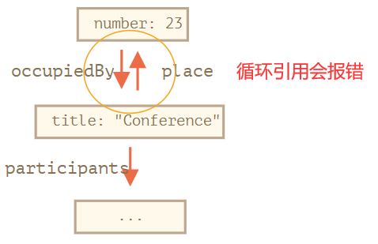

##### replacer

数组形式：

```js
let meetup = {
  title: "Conference",
  place: {
    university:"安徽大学",
    position:{
      province:"安徽省",
      city:"合肥市"
    }
  }
};
console.log( JSON.stringify(meetup,['title','place','position','city']) );
```

```json
{
    "title":"Conference",
    "place":{
        "position":{
            "city":"合肥市"
        }
    }
}
```

函数形式：

```js
let meetup = {
  title: "Conference",
  place: {
    university:"安徽大学",
    position:{
      province:"安徽省",
      city:"合肥市"
    }
  }
};

console.log( JSON.stringify(meetup, function replacer(key, value) {
  console.log(`${key}: ${value}`);
  return (key == 'position') ? undefined : value;
}));
```

```json
{
    "title":"Conference",
    "place":{
        "university":"安徽大学"
    }
}
```

##### space

优化格式的空格数量，作用不大。。。

##### toJSON

类似于`toString()`，可以显式写在类中

#### JSON转对象

##### 基本使用

`let value = JSON.parse(str, [reviver]);`

```js
let userData = '{ "name": "John", "age": 35, "isAdmin": false, "friends": [0,1,2,3] }';
console.log( JSON.parse(userData));
/****************
{ name: 'John', age: 35, isAdmin: false, friends: [ 0, 1, 2, 3 ] }
****************/
```

##### reviver

对某些特例进行处理，比如要有些字符串要转成对象

```js
let str = '{"title":"Conference","date":"2017-11-30T12:00:00.000Z"}';
let meetup = JSON.parse(str, function(key, value) {
  // 正常解析出的date事字符串，这里让它变成对象
  if (key == 'date') return new Date(value);
  return value;
});
console.log( meetup.date.getDate() );
```


