# JavaScript编程语言(下)

> JS学习原文：https://zh.javascript.info/

## 四、函数进阶

### 递归和堆栈

这部分在其他语言中很常用，这里就不仔细介绍了

链接：https://zh.javascript.info/recursion

### Rest 参数与 Spread 语法

1.Rest参数

**Rest 参数必须放到参数列表的末尾，Rest会收集所有剩余的参数**

```js
function sumAll(...args) { // 数组名为 args
    let sum = 0;
    for (let arg of args) sum += arg;
    return sum;
}
console.log(sumAll(1, 2, 3)); // 6
```

2.arguments

有一个名为 `arguments` 的特殊的类数组对象，该对象按参数索引包含所有参数。

`arguments` 是一个类数组，也是可迭代对象，但它终究不是数组。

3.Spread语法

当在函数调用中使用 `...arr` 时，它会把可迭代对象 `arr` “展开”到参数列表中。

将数组转为参数列表：

```js
let arr1 = [1, -2, 3, 4];
let arr2 = [8, 3, -8, 1];
// spread语法把数组转换为参数列表
console.log( Math.max(1, ...arr1, 2, ...arr2, -6) ); // 8
```

数组合并：

!> 值得注意的是：Spread语法得到的是一个新的数组或对象，深拷贝

```js
let merged = [0, ...arr, 2, ...arr2];
```

迭代字符串：

```js
let str = "Hello";
// 展开是列表，加上[]才是数组
console.log([...str]);
// 另一种迭代方式
console.log(Array.from(str));
```

运行结果与 `[...str]` 相同。

不过 `Array.from(obj)` 和 `[...obj]` 存在一个细微的差别：

- `Array.from` 适用于类数组对象也适用于可迭代对象。
- Spread 语法只适用于可迭代对象。

因此，对于将一些“东西”转换为数组的任务，`Array.from` 往往更通用。

### 闭包

这部分教程讲的好：https://zh.javascript.info/closure#ci-fa-huan-jing

#### 嵌套函数

作用域，`{}`内的可见，外面的不可见

嵌套函数使用如下：

```js
function sayHiBye(firstName, lastName) {
    // 辅助嵌套函数使用如下,同样只对内部可见
    function getFullName() {
        return firstName + " " + lastName;
    }
    console.log( "Hello, " + getFullName() );
    console.log( "Bye, " + getFullName() );
}
sayHiBye("Jonny","Long");
```

#### 词法环境

创建词法环境对象：

+ 内部环境记录
+ 外部词法环境的引用

##### 闭包

**闭包是指内部函数总是可以访问其所在的外部函数中声明的变量和参数，即使在其外部函数被返回（寿命终结）了之后。**

如下：内部匿名函数通过外部声明的makeCounter()访问

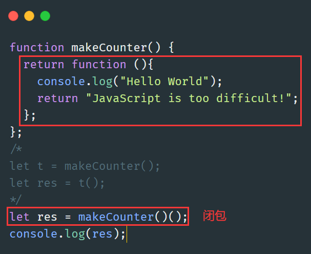

##### 由内而外的访问

1.未调用的状态

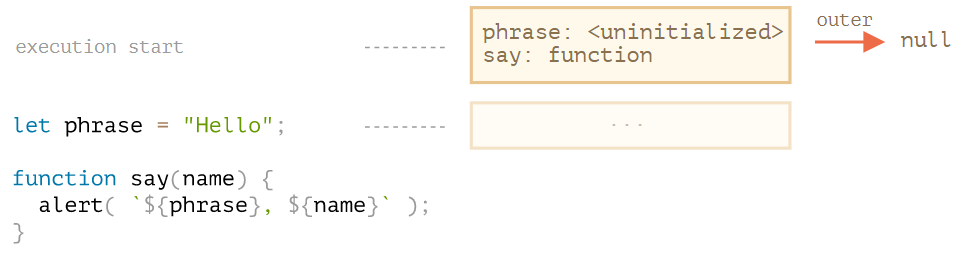

执行顺序：

+ `phrase:<uninitialized>`
+ `say:function`
+ `phrase:Hello`

2.调用`say("John")`

①新创建say词法环境对象（节点）

②修改外部环境phrase值和内部环境name值

③创建outer索引到外部环境

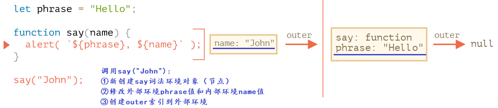

3.执行alert()：

由内而外访问属性，比如phrase在内环境没有，就去访问外环境，然后再外环境中找到了

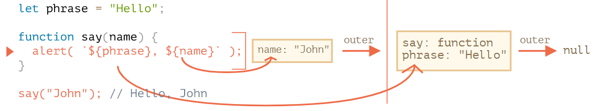

> 关于第一点这里还想继续说下

```js
let x = 1;
function func() {
    console.log(x); // ReferenceError: Cannot access 'x' before initialization
    let x = 2;
}
func();
```

```js
let x = 1;
function func() {
    console.log(x);
    // let x = 2;
}
func();
```

第一段报错，第二、三段运行正确，这是为啥？

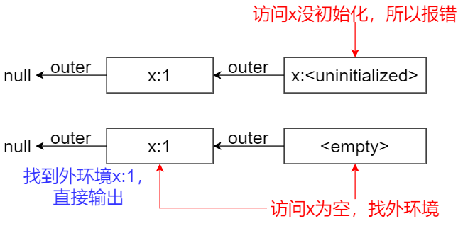

##### 返回函数

1.调用makCounter()新创建词法环境对象

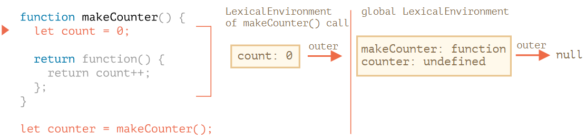

2.调用counter()新创建词法环境对象，只是这个词法环境对象刚好为空

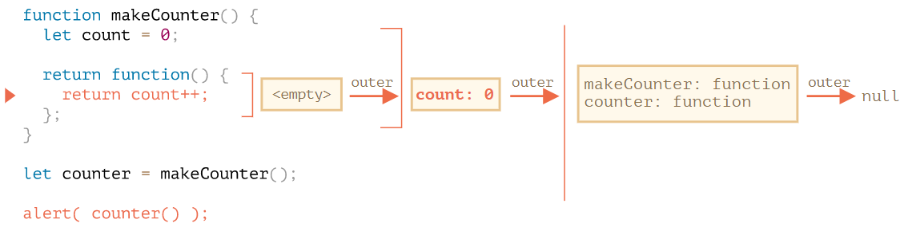

3.执行函数，查找count

#### 垃圾收集

当词法环境对象变得不可达时，它就会死去（就像其他任何对象一样）。换句话说，它仅在至少有一个嵌套函数引用它时才存在。

```js
function f() {
    let value = 123;
    return function() {
        alert(value);
    }
}
// g.[[Environment]] 存储了对相应 f() 调用的词法环境的引用
// 当 g 函数存在时，该值会被保留在内存中
let g = f();
// 现在内存被清理了
g = null;
```

在V8引擎中的优化：

正如我们所看到的，理论上当函数可达时，它外部的所有变量也都将存在。但在实际中，JavaScript 引擎会试图优化它。它们会分析变量使用情况，如果从代码中可以明显看出有未使用的外部变量，那么就会将其删除。

```js
function f() {
    let value = Math.random();

    function g() {
        debugger; // 在 Console 中：输入 alert(value); No such variable!
    }

    return g;
}

let g = f();
g();
```

### 旧时的var

+ var没有块作用域
+ var允许重新声明
+ var声明的变量，可以在其声明语句前被使用，这是因为`var` 变量声明在函数开头就会被处理

### 全局对象

**一般不建议使用全局变量。**全局变量应尽可能的少。与使用外部变量或全局变量相比，函数获取“输入”变量并产生特定“输出”的代码设计更加清晰，不易出错且更易于测试。

一般按如下方式使用，尽量不要使用var声明全局变量：

```js
// 将当前用户信息全局化，以允许所有脚本访问它
window.currentUser = {
    name: "John"
};

// 代码中的另一个位置
alert(currentUser.name);  // John
// 或者，如果我们有一个名为 "currentUser" 的局部变量
// 从 window 显示地获取它（这是安全的！）
alert(window.currentUser.name); // John
```

### 函数对象

**在 JavaScript 中，函数就是对象。**一个容易理解的方式是把函数想象成可被调用的“行为对象（action object）”。我们不仅可以调用它们，还能把它们当作对象来处理：增/删属性，按引用传递等。

1.name属性

```js
let user = {
    sayHi() {
    },
    sayBye: function() {
    }
}

alert(user.sayHi.name); // sayHi
alert(user.sayBye.name); // sayBye
```

2.length属性：返回函数入参的个数

3.自定义属性

属性的定义和使用上下要保持一致，比如这里定义`sayHi.counter`

```js
function sayHi() {
    alert("Hi");
    // 计算调用次数
    sayHi.counter++;
}
sayHi.counter = 0; // 初始值
```

!> 属性不是变量，被赋值给函数的属性，比如 `sayHi.counter = 0`，不会在函数内定义一个局部变量 `counter`。

与闭包的比较：

```js
function makeCounter() {
    // 不需要这个了
    // let count = 0
    function counter() {
        return counter.count++;
    };
    counter.count = 0;
    return counter;
}

let counter = makeCounter();
console.log( counter() ); // 0
console.log( counter() ); // 1
counter.count = 10;
console.log( counter() ); // 10
```

两者最大的不同就是如果 `count` 的值位于外层（函数）变量中，那么外部的代码无法访问到它，只有嵌套的函数可以修改它。而如果它是绑定到函数的，那么就很容易。

4.命名函数表达式（NFE，Named Function Expression），指带有名字的函数表达式的术语。

```js
let sayHi = function func(who) {
    if (who) {
        alert(`Hello, ${who}`);
    } else {
        func("Guest"); // 使用 func 再次调用函数自身
    }
};

sayHi(); // Hello, Guest

// 但这不工作：
func(); // Error, func is not defined（在函数外不可见）
```

关于名字 `func` 有两个特殊的地方，这就是添加它的原因：

1. 它**允许函数在内部引用自己**，用于递归；
2. 它**在函数外是不可见**的。

!> 函数声明没有这个东西，这种方式只适用于函数表达式

### new Function

```js
let func = new Function ([arg1, arg2, ...argN], functionBody);
```

使用 `new Function` 创建的函数，它的 `[[Environment]]` 指向全局词法环境，而不是函数所在的外部词法环境。因此，我们不能在 `new Function` 中直接使用外部变量。

### 调度

1.延迟调用一次，`setTimeout`

`func|code`：**执行函数**。

`delay`：**执行前的延时**，以毫秒为单位（1000 毫秒 = 1 秒），默认值是 0；

`arg1`，`arg2`：要传入被**执行函数的参数列表**（IE9 以下不支持）

```js
function sayHi(phrase, who) {
    alert( phrase + ', ' + who );
}
setTimeout(sayHi, 1000, "Hello", "John");
/******************
Hello, John
******************/
// 或者使用箭头函数，这是比较常用的写法
setTimeout(() => alert('Hello'), 1000);
```

!> `setTimeout(sayHi(), 1000);`，这种写法大错特错，sayHi后千万不要加()

可以使用`clearTimeout`取消调度：

```js
let timerId = setTimeout(...);
clearTimeout(timerId);
```

2.延迟反复调用，`setInterval`

```js
// 每 2 秒重复一次
let timerId = setInterval(() => alert('tick'), 2000);
// 5 秒之后停止
setTimeout(() => { clearInterval(timerId); alert('stop'); }, 5000);
```

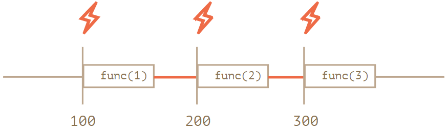

3.嵌套`setTimeout`实现周期性调度

```js
let i = 1;
setTimeout(function run() {
    func(i++);
    setTimeout(run, 100);
}, 100);
```


4.零延时的setTimeout

```js
setTimeout(() => alert("World"));
alert("Hello");
/**********************
先输出"Hello"，再输出"World"
**********************/
```

第一行代码“将调用安排到日程（calendar）0 毫秒处”。但是调度程序只有在当前脚本执行完毕时才会去“检查日程”，所以先输出 `"Hello"`，然后才输出 `"World"`。

### 装饰器模式与转发

这部分有点没看懂，记下官网地址：[装饰器模式和转发，call/apply (javascript.info)](https://zh.javascript.info/call-apply-decorators)

1.透明缓存

为啥说是透明缓存，就是说它的机制很像真实缓存，但是并不是，而是通过包装器模式实现的，将命中的cache保存在Map中

```js
function slow(x) {
    // 这里可能会有重负载的 CPU 密集型工作
    alert(`Called with ${x}`);
    return x;
}
function cachingDecorator(func) {
    let cache = new Map();
    return function(x) {
        // 命中cache
        if (cache.has(x)) {
            return cache.get(x);
        }
        // 没命中
        let result = func(x);  // 否则就调用 func
        cache.set(x, result);  // 然后将结果缓存（记住）下来
        return result;
    };
}
slow = cachingDecorator(slow);
```

2.`func.call`

它运行 `func`，提供的第一个参数作为 `this`，后面的作为参数（arguments）。

```js
function sayHi(sex) {
    console.log(this.name+" "+sex);
}
let user = { name: "John" };
let admin = { name: "Admin" };
// 使用 call 将不同的对象传递为 "this"
sayHi.call( user,"糙汉子" );
sayHi.call( admin,"小姑凉" );
/***************
John 糙汉子
Admin 小姑凉
***************/
```

3.`func.apply`

我们可以使用 `func.apply(this, arguments)` 代替 `func.call(this, ...arguments)`。

这里只有很小的区别：

- Spread 语法 `...` 允许将 **可迭代对象** `args` 作为列表传递给 `call`。
- `apply` 仅接受 **类数组对象** `args`。

因此，当我们期望可迭代对象时，使用 `call`，当我们期望类数组对象时，使用 `apply`。

```js
let wrapper = function() {
    return func.apply(this, arguments);
};
```

### 函数绑定

#### 丢失this

```js
let user = {
    firstName: "John",
    sayHi() {
        alert(`Hello, ${this.firstName}!`);
    }
};

setTimeout(user.sayHi, 1000); // Hello, undefined!
```

正如我们所看到的，输出没有像 `this.firstName` 那样显示 “John”，而显示了 `undefined`！

这是因为 `setTimeout` 获取到了函数 `user.sayHi`，但它和对象分离开了。

> 问题：我们想将一个对象方法传递到别的地方（这里 —— 传递到调度程序），然后在该位置调用它。如何确保在正确的上下文中调用它？

#### 函数绑定

（1）包装器

```js
let user = {
  firstName: "John",
  sayHi() {
    alert(`Hello, ${this.firstName}!`);
  }
};
setTimeout(function() {
  user.sayHi(); // Hello, John!
}, 1000);
```

（2）bind

新函数的 `this` 被指定为 `bind()` 的第一个参数，而其余参数将作为新函数的参数，供调用时使用。

```js
let boundFunc = func.bind(context);
```

第一个参数：

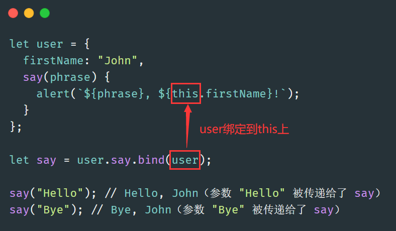

其他参数的使用：

```js
function mul(a, b) {
  return a * b;
}

let triple = mul.bind(null, 3);

alert( triple(3) ); // = mul(3, 3) = 9
alert( triple(4) ); // = mul(3, 4) = 12
alert( triple(5) ); // = mul(3, 5) = 15
```

一个函数不能被重绑定（re-bound）：

```js
function f() {
    console.log(this.name);
}
f = f.bind( {name: "John"} ).bind( {name: "Pete"} );
f(); // John
```

### 箭头函数

1.没有this

```js
let group = {
    title: "Our Group",
    students: ["John", "Pete", "Alice"],
    showList() {
        this.students.forEach(
            student => alert(this.title + ': ' + student)
        );
    }
};
group.showList();
// 正常使用就会报错
// 报错是因为forEach运行它里面的这个函数,但是这个函数的this 为默认值undefined
let group = {
    title: "Our Group",
    students: ["John", "Pete", "Alice"],
    showList() {
        this.students.forEach(function(student) {
            // Error: Cannot read property 'title' of undefined
            alert(this.title + ': ' + student)
        });
    }
};
group.showList();
```

这里 `forEach` 中使用了箭头函数，所以其中的 `this.title` 其实和外部方法 `showList` 的完全一样。那就是：`group.title`。

!> 因为没有this，所有箭头函数不能作为构造函数，即不能new

2.没有arguments

## 五、对象属性

### 属性标志和属性描述符

1.对象属性

对象属性（properties），除`value`外，还有三个特殊的特性（attributes），也就是所谓的“标志”：

- `writable`——如果为 `true`，则值可以被修改，否则它是只可读的。
- `enumerable`——如果为 `true`，则会被在循环中列出，否则不会被列出。
- `configurable`——如果为 `true`，则此特性可以被删除，这些属性也可以被修改，否则不可以。

```js
let obj = {
  name: "Lily"
}
let descriptor = Object.getOwnPropertyDescriptor(obj, "name");
console.log(descriptor);
/*********************
{ value: 'Lily', writable: true, enumerable: true, configurable: true }
*********************/
```

修改属性：

```js
Object.defineProperty(user, "name", {
    value: "John"
});
```

2.只读

`writable: false`，不可读，只在严格模式下会出现 Errors

```js
let user = { };
Object.defineProperty(user, "name", {
    value: "John",
    // 对于新属性,我们需要明确地列出哪些是true
    enumerable: true,
    configurable: true
});
console.log(user.name); // John
user.name = "Pete"; // Error
```

3.不可枚举

`enumerable: false`：不可枚举

```js
Object.defineProperty(user, "toString", {
  enumerable: false
});
// 不可枚举的属性也会被Object.keys排除
for (let key in user) alert(key);
```

4.不可配置

`configurable: false`：防止更改和删除属性标志，但是允许更改对象的值。

```js
let user = {
  name: "John"
};
Object.defineProperty(user, "name", {
  writable: false,
  configurable: false
});
// 不能修改 user.name 或它的标志
// 下面的所有操作都不起作用：
user.name = "Pete";
delete user.name;
// configurable: false,因此不可再配置
Object.defineProperty(user, "name", { value: "Pete" });
```

5.`Object.defineProperties`

```js
Object.defineProperties(user, {
  name: { value: "John", writable: false },
  surname: { value: "Smith", writable: false },
  // ...
});
```

### getter和setter

1.常规访问

```js
let user = {
  name: "John",
  surname: "Smith",
  get fullName() {
    return `${this.name} ${this.surname}`;
  },
  set fullName(value) {
    [this.name, this.surname] = value.split(" ");
  }
};
user.fullName = "Alice Cooper"; // (调用set)
console.log(user.name); // Alice
console.log(user.surname); // Cooper
console.log(user.fullName); // Alice Cooper(调用get)
```

2.通过`Object.defineProperty`访问

```js
Object.defineProperty(user, 'fullName', {
    get() {
        return `${this.name} ${this.surname}`;
    },
    set(value) {
        [this.name, this.surname] = value.split(" ");
    }
});
```

`get/set`方法被`value`不能同时兼得

```js
// Error: Invalid property descriptor.
Object.defineProperty({}, 'prop', {
    get() {
        return 1
    },
    value: 2
});
```

## 六、原型、继承

### 原型（prototype）、原型链

下面理论都是基于这张图，非常重要：

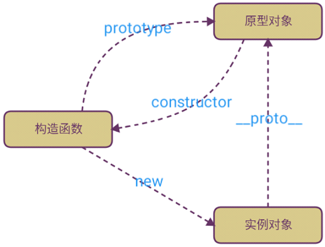

- 每个对象都有一个`__proto__`属性，并且指向它的`prototype`原型对象

- 每个构造函数都有一个`prototype`原型对象

- - `prototype`原型对象里的`constructor`指向构造函数本身

```js
function Person(nick, age){
    this.nick = nick;
    this.age = age;
}
Person.prototype.sayName = function(){
    console.log(this.nick);
}
var p1 = new Person('Byron',20);
var p2 = new Person('Casper',25);
/*************************************/
// 下面进行测试
p1.__proto__ === Person.prototype			//true
p2.__proto__ === Person.prototype			//true
p1.__proto__ === p2.__proto__				//true
Person.prototype.constructor === Person		//true
```


当然，Person既是函数又是对象，比较特殊，因此可以看到既有`prototype`又有`__proto__`，它既可作构造函数，又可作实例对象

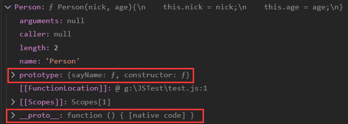

再看一段代码：

```js
var arr = [1,2,3]
arr.valueOf()	// [1, 2, 3]
/*************************************/
// 下面进行测试
arr.__proto__ === Array.prototype				// true
Array.prototype.__proto__ === Object.prototype	// true
arr.__proto__.__proto__ === Object.prototype	// true
// 原型链的终点
Object.prototype.__proto__ === null				// true
```

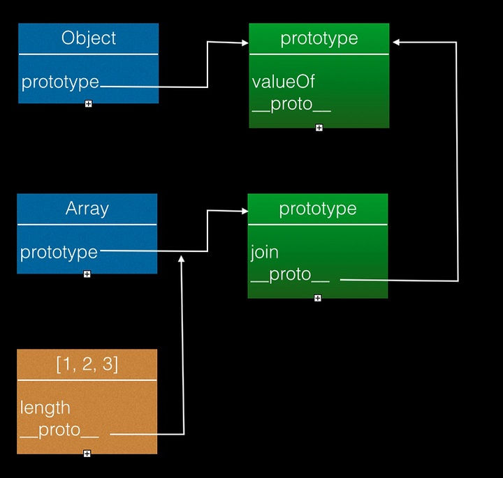

> 原型对象中的`constructor`并没有标出，需要注意

`valueOf()`函数不能再`Array.prototype`中找到，因此沿着原型链进行查找，原型链如下：

`arr ---> Array.prototype ---> Object.prototype ---> null`

如果到链头了还是没有找到，就返回undefined

> 原型链有张图，表示了各个关系之间是如何连接的

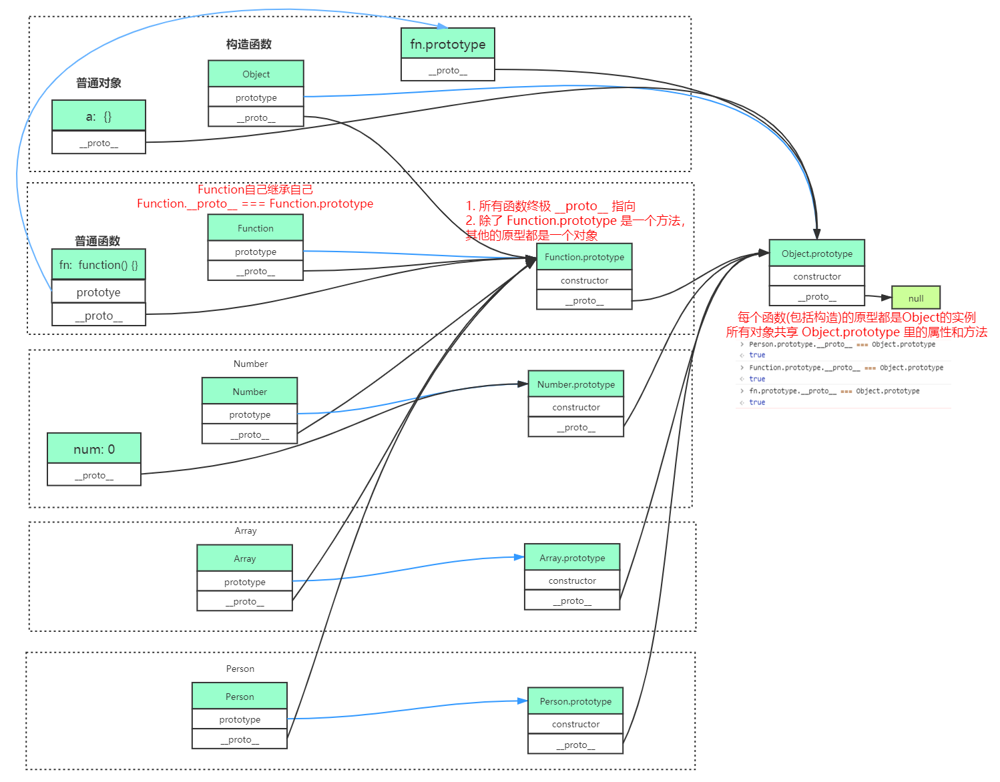

### 原型继承

这里有三个限制：

- **引用不能形成闭环。**如果我们试图在一个闭环中分配 `__proto__`，JavaScript 会抛出错误。
- `__proto__` 的值可以是对象，也可以是 `null`。而其他的类型都会被忽略。
- 只能有一个 `[[Prototype]]`。一个对象不能从其他两个对象获得继承。

#### 属性继承

```js
function Person (name, age) {
    this.name = name
    this.age = age
}
// 方法定义在构造函数的原型上
Person.prototype.getName = function () { 
    console.log(this.name)
}
```

```js
function Teacher (name, age, subject) {
    Person.call(this, name, age)
    this.subject = subject
}
```

**属性的继承是通过在一个类内执行另外一个类的构造函数，通过`call`指定`this`为当前执行环境，这样就可以得到另外一个类的所有属性。**

我们实例化一下看看

```js
var teacher = new Teacher('Jack', 25, "Math");
```

很明显`Teacher`成功继承了`Person`的属性

#### 方法继承

我们都知道类的方法都定义在`prototype`里，那其实我们只需要把`Person.prototype`的备份赋值给`Teacher.prototype`即可

```js
// 深拷贝
Teacher.prototype = Object.create(Person.prototype)
Teacher.prototype.constructor = Teacher
```

### 原生的原型

#### Object原型

```js
let obj = new Object();
let obj = {};
console.log(obj);
```

Objcet的原型：

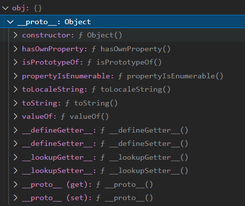

整个过程如下：

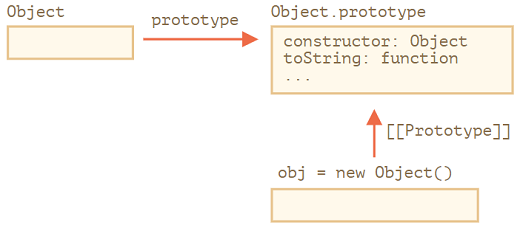

#### 其他内建原型

之前用过的Array、Function、Number、String、Boolean都有相应的原型

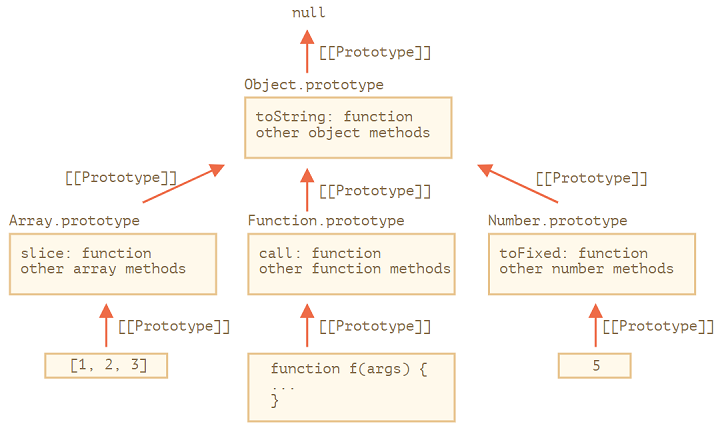

原生的原型可以被修改，例如：

```js
String.prototype.show = function() {
    console.log(this);
};
"BOOM!".show(); // BOOM!
```

!> 原型是全局的，修改容易出现冲突，因此一般不这么做

**在现代编程中，只有一种情况下允许修改原生原型。那就是 polyfilling。**

Polyfilling 是一个术语，表示某个方法在 JavaScript 规范中已存在，但是特定的 JavaScript 引擎尚不支持该方法，那么我们可以通过手动实现它，并用以填充内建原型。

```js
if (!String.prototype.repeat) { // 如果这儿没有这个方法
    // 那就在 prototype 中添加它
    String.prototype.repeat = function(n) {
        // 重复传入的字符串 n 次

        // 实际上，实现代码比这个要复杂一些（完整的方法可以在规范中找到）
        // 但即使是不够完美的 polyfill 也常常被认为是足够好的
        return new Array(n + 1).join(this);
    };
}

alert( "La".repeat(3) ); // LaLaLa
```

## 七、类

### 类的基本语法

1.Class

在 JavaScript 中，类是一种函数。

```js
class User {
    constructor(name) {
        this.name = name;
    }
    showName() {
        console.log(this.name);
    }
    sayHello(){
        console.log(this.name+",Hello");
    }
    sayHi(){
        console.log(this.name+",Hi");
    }
}
// 用法：
let user = new User("John");
user.sayHi();
user.sayHello();
user.showName();
```

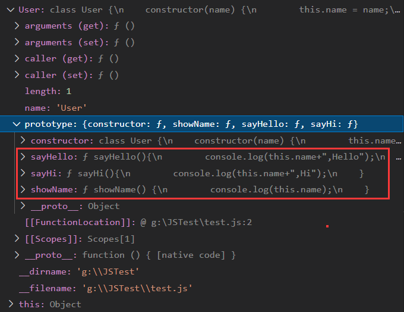

利用constructor创建的实例对象user，这个对象的`__proto__`指向User函数对象的原型

使用类的与普通方式的区别：

+ 属性`[[FunctionKind]]:"classConstructor"`
  + 必须用new来调用它
  + 大多数 JavaScript 引擎中的类构造器的字符串表示形式都以 “class…” 开头
+ 类方法不可枚举，即enumerable==false
+ 类总是use strict

2.类表达式

这个与函数表达式类似

```js
let User = class {};
let User = class MyClass{}; // MyClass只能在内部调用
```

3.Getter/Setter

```js
class User {
    constructor() {……}
    get name() {……}
    set name(value) {……}
}
```

这样的类声明可以通过在 `User.prototype` 中创建 getters 和 setters 来实现。

4.计算属性名称

```js
class User {
    ['say' + 'Hi']() {
        alert("Hello");
    }
}
new User().sayHi();
```

5.处理this丢失问题

1. 传递一个包装函数，例如 `setTimeout(() => button.click(), 1000)`。
2. 将方法绑定到对象，例如在 constructor 中。
3. 类中的箭头函数

```js
class Button {
    constructor(value) {
        this.value = value;
    }
    click = () => {
        alert(this.value);
    }
}
```

### 类继承

1.extend

```js
class Rabbit extends Animal{}
```

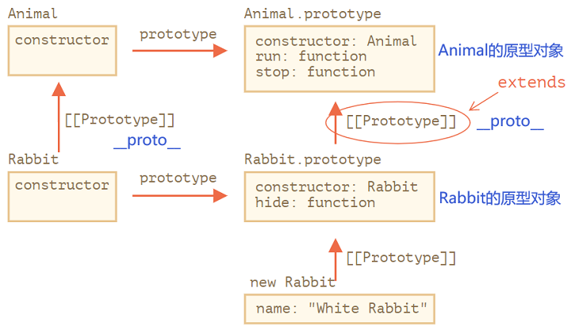

1. `Rabbit` 函数原型继承自 `Animal` 函数。
2. `Rabbit.prototype` 原型继承自 `Animal.prototype`。

闭包形式：

```js
function f(phrase) {
    return class {
        sayHi() { alert(phrase); }
    };
}
class User extends f("Hello") {}
new User().sayHi(); // Hello
```

2.super

跟Java中类似，this本级类，super父类

箭头函数没有super

- 执行 `super.method(...)` 来调用一个父类方法。
- 执行 `super(...)` 来调用一个父类 constructor

3.重写方法，与Java中类似

4.重写constructor

!> **继承类的 constructor 必须调用 `super(...)`，并且一定要在使用 `this` 之前调用。**

```js
class Animal {
    constructor(name) {
        this.speed = "10m/s";
        this.name = name;
    }
}
class Rabbit extends Animal {
    sex = "雌兔";
    constructor(name, earLength) {
        super(name);
        this.earLength = earLength;
    }
}
class Zebra extends Animal {
    sex = "雄斑马";
    tailLength = "80cm"
    constructor(name, tailLength) {
        super(name);
        this.tailLength = tailLength;
    }
}
// 现在可以了
let rabbit = new Rabbit("White Rabbit", 10);
console.log(rabbit);
let zebra = new Zebra("Black Zebra", "75cm");
console.log(zebra);
```

### 静态属性和静态方法

```js
class Rabbit extends Animal {
    sex = "雌兔";
	static publisher = "Levi Ding";
    static staticMethod() {
        console.log(this === Animal);
    }
    constructor(name, earLength) {
        super(name);
        this.earLength = earLength;
    }
}
```

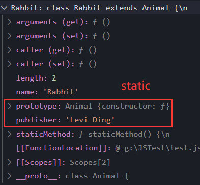

把一个方法赋值给类的函数本身，而不是赋给它的 `"prototype"`。这样的方法被称为**静态的（static）**。

### 封装

#### 约定级别

在JS中不支持原生的private，因此在变量前加上`_`表示私有，值得注意的是，这种方式是假私有，是程序猿约定的，语法层面还是可以直接访问的

```js
class CoffeeMachine {
    constructor(power) {
        this._power = power;
    }
    get power() {
        return this._power;
    }
    set power(power){
        this._power = power;
    }
}
// 创建咖啡机
let coffeeMachine = new CoffeeMachine(100);
console.log(`Power is: ${coffeeMachine.power}W`);
coffeeMachine.power = 25;
console.log(`Power is: ${coffeeMachine.power}W`);
```

创建对象后，有一个变量`_power`，我们把它看作私有的，不要直接访问，而是通过getter/setter方法进行访问

#### 语言级别

就是将`_`编程官方钦定的`#`就行

```js
class CoffeeMachine {
    #waterLimit = 200;
    constructor(waterLimit){
        this.#waterLimit = waterLimit;
    }
    get waterLimit(){
        return this.#waterLimit;
    }
    set waterLimit(value){
        this.#waterLimit = value;
    }
}

// 创建咖啡机
let coffeeMachine = new CoffeeMachine(100);
console.log(coffeeMachine.waterLimit);
coffeeMachine.waterLimit=90;
console.log(coffeeMachine.waterLimit);
```

但是如果我们继承自 `CoffeeMachine`，那么我们将无法直接访问 `#waterAmount`。我们需要依靠 `waterAmount` getter/setter：

```js
class MegaCoffeeMachine extends CoffeeMachine {
    method() {
        // Error: can only access from CoffeeMachine
        console.log(this.#waterLimit);
    }
}
```

### instanceof

```js
// 用于检查一个对象是否属于某个特定的class
obj instanceof Class
```

算法：

1.如果这儿有静态方法 `Symbol.hasInstance`，那就直接调用这个方法：

```js
class Animal {
    static [Symbol.hasInstance](obj) {
        if (obj.canEat) return true;
    }
}
```

2.如果没有静态方法 `Symbol.hasInstance`，则使用 `obj instanceOf Class` 检查 `Class.prototype` 是否等于 `obj` 的原型链中的原型之一。

```js
obj.__proto__ === Class.prototype?
obj.__proto__.__proto__ === Class.prototype?
obj.__proto__.__proto__.__proto__ === Class.prototype?
...
```

!> 如果修改了原型链，那么instanceof结果可能改变

### Mixin模式

#### 实现Mixin的两种方式

Mixin模式是用来间接实现多继承的

使用extends的方式：

```js
class User extends Person {
    // ...
}
Object.assign(User.prototype, sayHiMixin);
```

使用原型链的方式，在内部实现继承：

```js
let sayMixin = {
    say(phrase) {
        alert(phrase);
    }
};
let sayHiMixin = {
    __proto__: sayMixin, // (或者，我们可以在这儿使用 Object.create 来设置原型)

    sayHi() {
        // 调用父类方法
        super.say(`Hello ${this.name}`); // (*)
    },
    sayBye() {
        super.say(`Bye ${this.name}`); // (*)
    }
};
class User {
    constructor(name) {
        this.name = name;
    }
}
// 拷贝方法
Object.assign(User.prototype, sayHiMixin);
// 现在 User 可以打招呼了
new User("Dude").sayHi(); // Hello Dude!
```

#### EventMixin例子（常用）

```js
let eventMixin = {
   /**
    * 订阅事件，用法：
    *  menu.on('select', function(item) { ... }
    */
	on(eventName, handler) {
        if (!this._eventHandlers) this._eventHandlers = {};
        if (!this._eventHandlers[eventName]) {
            this._eventHandlers[eventName] = [];
        }
        this._eventHandlers[eventName].push(handler);
    },

   /**
    * 取消订阅，用法：
    *  menu.off('select', handler)
    */
    off(eventName, handler) {
        let handlers = this._eventHandlers?.[eventName];
        if (!handlers) return;
        for (let i = 0; i < handlers.length; i++) {
            if (handlers[i] === handler) {
                handlers.splice(i--, 1);
            }
        }
    },

   /**
    * 生成具有给定名称和数据的事件
    *  this.trigger('select', data1, data2);
    */
    trigger(eventName, ...args) {
        if (!this._eventHandlers?.[eventName]) {
            return; // 该事件名称没有对应的事件处理程序（handler）
        }
        // 调用事件处理程序（handler）
        this._eventHandlers[eventName].forEach(handler => handler.apply(this, args));
    }
};
```

1. `.on(eventName, handler)` — 指定函数 `handler` 以在具有对应名称的事件发生时运行。从技术上讲，这儿有一个用于存储每个事件名称对应的处理程序（handler）的 `_eventHandlers` 属性，在这儿该属性就会将刚刚指定的这个 `handler` 添加到列表中。
2. `.off(eventName, handler)` — 从处理程序列表中删除指定的函数。
3. `.trigger(eventName, ...args)` — 生成事件：所有 `_eventHandlers[eventName]` 中的事件处理程序（handler）都被调用，并且 `...args` 会被作为参数传递给它们。

使用：

```js
// 创建一个 class
class Menu {
    choose(value) {
        this.trigger("select", value);
    }
}
// 添加带有事件相关方法的 mixin
Object.assign(Menu.prototype, eventMixin);

let menu = new Menu();

// 添加一个事件处理程序（handler），在被选择时被调用：
menu.on("select", value => alert(`Value selected: ${value}`));

// 触发事件 => 运行上述的事件处理程序（handler）并显示：
// 被选中的值：123
menu.choose("123");
```

## 八、错误处理

### try…catch

```js
try{
    // 出现异常(可以throw创建异常)
}catch(err){
    // 打印异常
}finally{
    // 无论是否异常都会执行
}
```

error 对象的主要属性：

+ name
+ message
+ stack

### 自定义Error

## 九、Promise

### 异步

JavaScript 的执行环境是**单线程**。

所谓单线程，是指 JS 引擎中负责解释和执行 JavaScript 代码的线程只有一个，也就是一次只能完成一项任务，这个任务执行完后才能执行下一个，它会「阻塞」其他任务。这个任务可称为主线程。

异步模式可以一起执行**多个任务**。

### 回调

A callback is a function that is passed as an argument to another function and is executed after its parent function has completed.

```js
function a(callback) {    
    console.log("我是parent函数a！"); 
    callback();		// 调用回调函数
} 
function b() { 
    console.log("我是回调函数b"); 
} 
a(b); 
```

### Promise的使用

#### 生产者：resolve，reject

Promise 对象的构造器（constructor）语法如下：

```js
let promise = new Promise(function(resolve, reject) {
    // executor（生产者代码，“歌手”）
});
```

传递给 `new Promise` 的函数被称为 **executor**。当 `new Promise` 被创建，executor 会自动运行。它包含最终应产出结果的生产者代码。

当 executor 获得了结果，无论是早还是晚都没关系，它应该调用以下回调之一：

- `resolve(value)` — 如果任务成功完成并带有结果 `value`。
- `reject(error)` — 如果出现了 error，`error` 即为 error 对象。

由 `new Promise` 构造器返回的 `promise` 对象具有以下内部属性：

- `state` — 最初是 `"pending"`，然后在 `resolve` 被调用时变为 `"fulfilled"`，或者在 `reject` 被调用时变为 `"rejected"`。
- `result` — 最初是 `undefined`，然后在 `resolve(value)` 被调用时变为 `value`，或者在 `reject(error)` 被调用时变为 `error`。

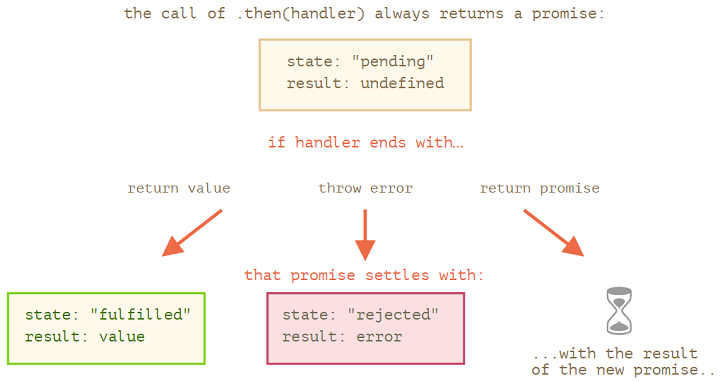

#### 消费者：then，catch，finally

`.then()`：

- `.then` 的第一个参数是一个函数，该函数将在 promise resolved 后运行并接收结果。
- `.then` 的第二个参数也是一个函数，该函数将在 promise rejected 后运行并接收 error。

`.catch()`：

+ 捕捉错误

`finally()`：

+ 最后执行

```js
// 第一步：model层的接口封装
const promise = new Promise((resolve, reject) => {
    // 这里做异步任务（比如ajax 请求接口。这里暂时用定时器代替）
    setTimeout(function () {
        var data = { retCode: 0, msg: 'qianguyihao' }; // 接口返回的数据
        if (data.retCode == 0) {
            // 接口请求成功时调用
            resolve(data);
        } else {
            // 接口请求失败时调用
            reject({ retCode: -1, msg: 'network error' });
        }
    }, 1000);
});

// 第二步：业务层的接口调用。这里的 data 就是 从 resolve 和 reject 传过来的，也就是从接口拿到的数据
promise.then((data) => {
    // 从 resolve 获取正常结果
    console.log(data);
}).catch((data) => {
    // 从 reject 获取异常结果
    console.log(data);
});
```

上方代码中，当从接口返回的数据`data.retCode`的值不同时，可能会走 resolve，也可能会走 reject，这个由你自己的业务决定。

### Promise链

```js
new Promise(function(resolve, reject) {
    setTimeout(() => resolve(1), 1000);
}).then(function(result) {
    alert(result);		// 1
    return result * 2;
}).then(function(result) {
    alert(result);		// 2
    return result * 2;
}).then(function(result) {
    alert(result);		// 4
    return result * 2;
});
```

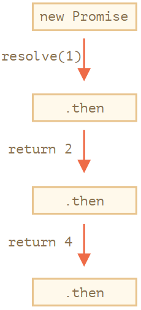

之所以这么运行，是因为**对 `promise.then` 的调用会返回了一个 promise**，所以我们可以在其之上调用下一个 `.then`。

返回值为Promise：

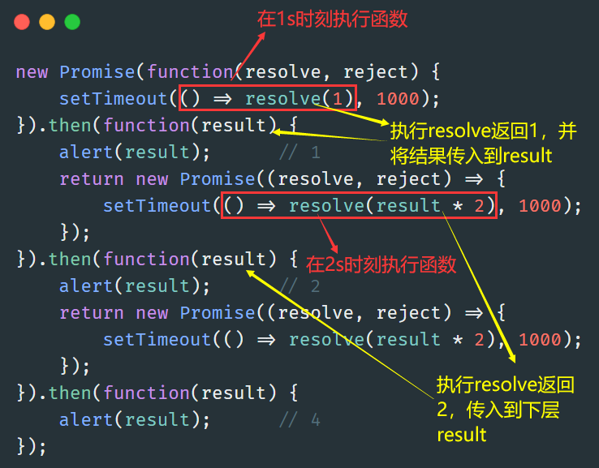

### Promise API

1.Promise.all

并行执行多个 promise，并等待所有 promise 都准备就绪。

```js
Promise.all([
    new Promise(resolve => setTimeout(() => resolve(1), 3000)), // 1
    new Promise(resolve => setTimeout(() => resolve(2), 2000)), // 2
    new Promise(resolve => setTimeout(() => resolve(3), 1000))  // 3
]).then(alert);
// 1,2,3当上面这些promise准备好时：每个promise都贡献了数组中的一个元素
```

请注意，结果数组中元素的顺序与其在源 promise 中的顺序相同。即使第一个 promise 花费了最长的时间才 resolve，但它仍是结果数组中的第一个。

```js
let names = ['iliakan', 'remy', 'jeresig'];
let requests = names.map(name => fetch(`https://api.github.com/users/${name}`));
Promise.all(requests)
    .then(responses => {
    // 所有响应都被成功resolved
    for (let response of responses) {
        console.log(`${response.url}: ${response.status}`); // 对应每个 url 都显示 200
    }
    // 返回一个响应对象组成的数组
    console.log(responses);
    return responses;
})
// 将响应数组映射（map）到 response.json() 数组中以读取它们的内容
    .then(responses => Promise.all(responses.map(r => r.json())))
// 所有 JSON 结果都被解析："users" 是它们的数组
    .then(users => users.forEach(user => console.log(user.name)));
```

**如果任意一个 promise 被 reject，由 `Promise.all` 返回的 promise 就会立即 reject，并且带有的就是这个 error。**

例如：

```js
Promise.all([
    new Promise((resolve, reject) => setTimeout(() => resolve(1), 1000)),
    new Promise((resolve, reject) => setTimeout(() => reject(new Error("Whoops!")), 2000)),
    new Promise((resolve, reject) => setTimeout(() => resolve(3), 3000))
]).catch(alert); // Error: Whoops!
```

> `Promise.all(iterable)` 允许在 `iterable` 中使用 non-promise 的“常规”值
>
> ```js
> Promise.all([
>     new Promise((resolve, reject) => {
>         setTimeout(() => resolve(1), 1000)
>     }),
>     2,
>     3
> ]).then(alert); 	// 1,2,3
> ```

2.Promise.allSettled

`Promise.allSettled` 等待所有的 promise 都被 settle，无论结果如何。而`Promise.all`中如果有一个挂了，就会报error

```js
let urls = [
    'https://api.github.com/users/iliakan',
    'https://api.github.com/users/remy',
    'https://no-such-url'
];
Promise.allSettled(urls.map(url => fetch(url)))
    .then(results => {
    console.log(results);
    results.forEach((result, num) => {
        if (result.status == "fulfilled") {
            console.log(`${urls[num]}: ${result.value.status}`);
        }
        if (result.status == "rejected") {
            console.log(`${urls[num]}: ${result.reason}`);
        }
    });
});
```

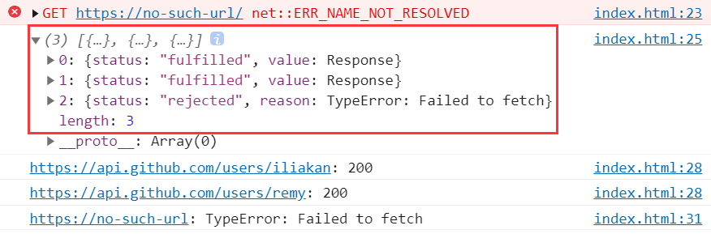

3.Promise.race

与 `Promise.all` 类似，但只等待第一个 settled 的 promise 并获取其结果（或 error）。

4.Promise.resolve(value)

使用给定 value 创建一个 resolved 的 promise。

5.Promise.reject(error)

使用给定 error 创建一个 rejected 的 promise。

### Promisification方式

是种编程套路，将一个接受回调的函数转换为一个返回 promise 的函数

```js
// 加载script
function loadScript(src, callback) {
    let script = document.createElement('script');
    script.src = src;
    script.onload = () => callback(null, script);
    script.onerror = () => callback(new Error(`Script load error for ${src}`));
    document.head.append(script);
}
let loadScriptPromise = function(src) {
    return new Promise((resolve, reject) => {
        loadScript(src, (err, script) => {
            if (err) reject(err);
            else resolve(script);
        });
    });
};
```

### 微任务队列

- 队列（queue）是先进先出的：首先进入队列的任务会首先运行。
- 只有在 JavaScript 引擎中没有其它任务在运行时，才开始执行任务队列中的任务。

```js
let promise = Promise.resolve();
promise.then(() => alert("promise done!"));
alert("code finished"); // 这个 alert 先显示
```

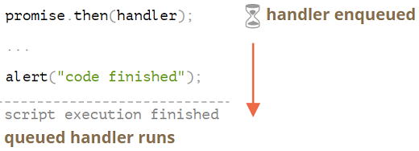

### async/await

async：

+ 让这个函数总是返回一个promise
+ 运行在该函数内使用await

await：让 JavaScript 引擎**等待直到 promise 完成（settle）并返回结果。**`let value = await promise;`

```js
async function f() {
    let promise = new Promise((resolve, reject) => {
        setTimeout(() => resolve("done!"), 1000)
    });
    let result = await promise; // 等待，直到promise resolve(*)
    alert(result); // "done!"
}
f();
```

这个函数在执行的时候，“暂停”在了 `(*)` 那一行，并在 promise settle 时，拿到 `result` 作为结果继续往下执行。所以上面这段代码在一秒后显示 “done!”。

`await` 实际上会暂停函数的执行，直到 promise 状态变为 settled，然后以 promise 的结果继续执行。这个行为不会耗费任何 CPU 资源，因为 JavaScript 引擎可以同时处理其他任务：执行其他脚本，处理事件等。

## 十、模块

### 简介

- `export` ：导出
- `import` ：导入

```js
// main.js
export function sayHi(user) {
    return `Hello, ${user}!`;
}
```

```html
<!-- index.html -->
<script type="module">
    import { sayHi } from './main.js';
    alert(sayHi("Lily"));
</script>
```

!> **模块只通过 HTTP(s) 工作，在本地文件则不行**

模块的功能：

+ 始终user strict
+ 作用域

```html
<script type="module">
    // 变量仅在这个 module script 内可见
    let user = "John";
</script>

<script type="module">
    alert(user); // Error: user is not defined
</script>
```

+ 模块只被执行一次。生成导出，然后它被分享给所有对其的导入，所以如果某个地方修改了 `admin` 对象，其他的模块也能看到这个修改。

```js
// admin.js
export let admin = {
  name: "John"
};

// 1.js
import {admin} from './admin.js';
admin.name = "Pete";

// 2.js
import {admin} from './admin.js';
alert(admin.name); // Pete

// 1.js和2.js导入的是同一个对象
// 在1.js中对对象做的更改，在2.js中也是可见的
```

访问当前模块信息：

```js
 // 脚本的 URL（对于内嵌脚本来说，则是当前HTML页面的URL）
alert(import.meta.url);
```

浏览器特定功能：

+ 模块脚本总是延迟的，慢于常规脚本
+ 外部脚本
  + 相同的src仅仅运行一次。`<script type="module" src="my.js"></script>`
  + 如果一个模块脚本是从另一个源获取的，则远程服务器必须提供表示允许获取的 header `Access-Control-Allow-Origin`。

### 导入和导出

#### import

```js
// 部分导入
import {sayHi, sayBye} from './say.js';
// 部分导入，带有as
import {sayHi as hi, sayBye as bye} from './say.js';
// 全部导入
import * as say from './say.js';
```

> 尽量使用部分导入，webpack的打包优化会删除未使用的代码以加快速度

#### export

1.在声明前导出

```js
// 导出数组
export let months = ['Jan', 'Feb', 'Mar','Apr', 'Aug', 'Sep', 'Oct', 'Nov', 'Dec'];
// 导出 const 声明的变量
export const MODULES_BECAME_STANDARD_YEAR = 2015;
// 导出类
export class User {
    constructor(name) {
        this.name = name;
    }
}
```

2.导出与声明分开

```js
// say.js
function sayHi(user) {
    alert(`Hello, ${user}!`);
}
function sayBye(user) {
    alert(`Bye, ${user}!`);
}
export {sayHi, sayBye}; // 导出变量列表
// export，带有as
export {sayHi as hi, sayBye as bye};
```

3.`export default`

```js
// user.js
export default class User { // 只需要添加 "default" 即可
    constructor(name) {
        this.name = name;
    }
}
// main.js
import User from './user.js'; // 不需要花括号 {User}，只需要写成 User 即可
```

| 命名的导出                | 默认的导出                        |
| :------------------------ | :-------------------------------- |
| `export class User {...}` | `export default class User {...}` |
| `import {User} from ...`  | `import User from ...`            |

由于每个文件最多只能有一个默认的导出，因此导出的实体可能没有名称。

```js
export default class { // 没有类名
    constructor() { ... }
}
```

```js
export default function(user) { // 没有函数名
  alert(`Hello, ${user}!`);
}
```

```js
// 导出单个值，而不使用变量
export default ['Jan', 'Feb', 'Mar','Apr', 'Aug', 'Sep', 'Oct', 'Nov', 'Dec'];
```

#### 导入导出

```js
// 导入 login/logout 然后立即导出它们
export {login, logout} from './helpers.js';

// 将默认导出导入为 User，然后导出它
export {default as User} from './user.js';
```

## 十一、Generator

### Generator初步

Generator函数中的yield每次调用就装入到一个Generator流中

```js
// 普通方式
function* generateSequence() {
    yield 1;
    yield 2;
    yield 3;

let generator = generateSequence();
for(let value of generator) {
    console.log(value); // 1，然后是 2，然后是 3
}
```

```js
// Genarator嵌套
function* generateSequence(start, end) {
    for (let i = start; i <= end; i++) yield i;
}
function* generatePasswordCodes() {
    // 0..9
    yield* generateSequence(48, 57);
    // A..Z
    yield* generateSequence(65, 90);
    // a..z
    yield* generateSequence(97, 122);
}
let str = '';
for(let code of generatePasswordCodes()) {
    str += String.fromCharCode(code);
}
alert(str); // 0..9A..Za..z
```

可迭代对象中使用：

```js
let range = {
    from: 1,
    to: 5,

    *[Symbol.iterator]() { // [Symbol.iterator]: function*() 的简写形式
        for(let value = this.from; value <= this.to; value++) {
            yield value;
        }
    }
};

// console.log([...range[Symbol.iterator]()]);
console.log( [...range] ); // 1,2,3,4,5
```

之所以代码正常工作，是因为 `range[Symbol.iterator]()` 现在返回一个 generator，而 generator 方法正是 `for..of` 所期望的：

- 它具有 `.next()` 方法
- 它以 `{value: ..., done: true/false}` 的形式返回值

---

下面具体探讨执行过程：

```js
function* gen() {
    let ask1 = yield "2 + 2 = ?";
    console.log(ask1);
    let ask2 = yield "3 * 3 = ?"
    console.log(ask2);
}
let generator = gen();
console.log(generator.next());
console.log(generator.next(4));
console.log(generator.next(9));
```

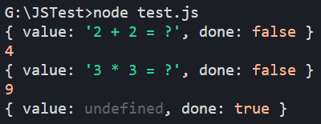

执行过程：

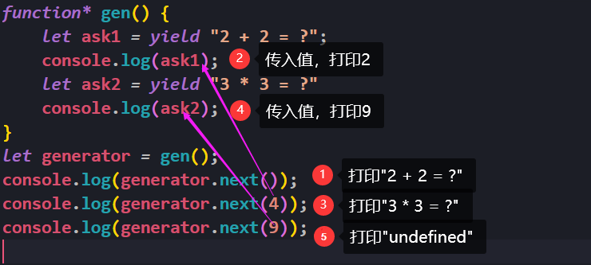

注：第二个 `.next(4)` 将 `4` 作为第一个 `yield` 的结果传递回 generator 并恢复 generator 的执行。

### 异步Generator

#### 异步迭代

1. 使用 `Symbol.asyncIterator` 取代 `Symbol.iterator`。
2. `next()` 方法应该返回一个 `promise`（带有下一个值，并且状态为 `fulfilled`）。
   + 关键字 `async` 可以实现这一点，我们可以简单地使用 `async next()`。
3. 我们应该使用 `for await (let item of iterable)` 循环来迭代这样的对象。
   + 注意关键字 `await`。

```js
let range = {
    from: 1,
    to: 5,

    [Symbol.asyncIterator]() {
        return {
            current: this.from,
            last: this.to,
            async next() {
                // 注意：我们可以在 async next 内部使用 "await"
                await new Promise(resolve => setTimeout(resolve, 1000));
                if (this.current <= this.last) {
                    return { done: false, value: this.current++ };
                } else {
                    return { done: true };
                }
            }
        };
    }
};

(async () => {
    for await (let value of range) {
        console.log(value); // 1,2,3,4,5
    }
})();
```

这是一个对比 Iterator 和异步 iterator 之间差异的表格：

|                          | Iterator          | 异步 iterator          |
| :----------------------- | :---------------- | :--------------------- |
| 提供 iterator 的对象方法 | `Symbol.iterator` | `Symbol.asyncIterator` |
| `next()` 返回的值是      | 任意值            | `Promise`              |
| 要进行循环，使用         | `for..of`         | `for await..of`        |

!> Spread 语法 `...` 无法异步工作，`alert( [...range] ); // Error, no Symbol.iterator`

#### 异步Generator

```js
async function* generateSequence(start, end) {
    for (let i = start; i <= end; i++) {
        await new Promise(resolve => setTimeout(resolve, 1000));
        yield i;
    }
}

(async () => {
    let generator = generateSequence(1, 5);
    for await (let value of generator) {
        console.log(value); // 1,2,3,4,5
    }
})();
```

## 十二、杂项


