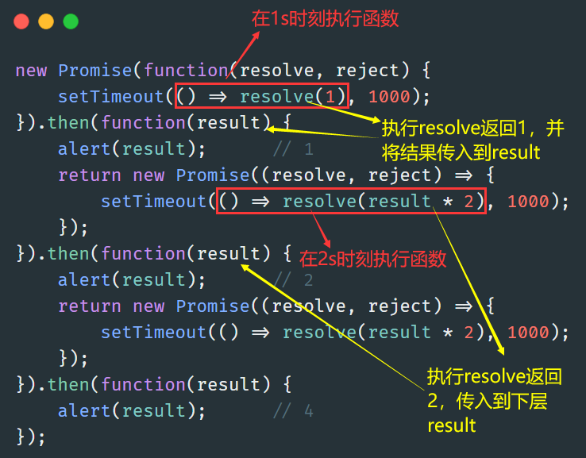

# Promise的使用
## 为何会有Promise？

根据《深入理解JS事件循环机制》这篇文章知道，Promise、Generator、async/await都是为了实现异步编程
传统方式是通过回调函数、事件监听、发布订阅模式实现的，Promise的出现大大丰富了异步编程的实现。

## Promise状态转换自动机



**Promise的状态转换是不可逆的**，当pending转换为fulfilled或rejected时，只能通过.then来获取值再返回新的Promise对象

**由pending状态转换为fulfilled或rejected状态时才放入到微任务队列，执行.then就是将该任务从微任务队列取出并执行。**

## Promise的常规使用

### 承诺-兑现承诺结构

承诺：
`resolve(value)`：如果任务成功完成并带有结果 value。
`reject(error)`：如果出现了 error，error 即为 error 对象。

```javascript
let promise = new Promise(function(resolve, reject) {
    // executor（生产者代码）
});
```

`new Promise(arg)`里面的参数arg是生成者执行的函数
兑现承诺：
`.then()`：

- `.then`的第一个参数是一个函数，该函数将在promise resolved后运行并接收结果。
- `.then`的第二个参数也是一个函数，该函数将在promise rejected后运行并接收error。

`.catch()`：捕捉错误
`.finally()`：最后执行

### 例子

如下面这个加载脚本的函数，加载过程较慢，因此需要将它封装成异步函数
使用回调函数的形式：

```javascript
function loadScript(src, callback) {
    // 创建DOM结点
    let script = document.createElement('script');
    script.src = src;
    // onload事件在资源被加载完成后会被触发
    script.onload = () => {
        callback(script);
    }
    // 插入DOM结点
    document.head.append(script);
}

loadScript('https://cdnjs.cloudflare.com/ajax/libs/lodash.js/3.2.0/lodash.js', script => {
    console.log(`Cool, the script ${script.src} is loaded`);
});
```

调用loadScript函数，传入src和一个回调函数callback，在loadScript内部调用箭头函数，打印script.src信息
使用Promise形式：

```javascript
function loadScript(src) {
    return new Promise(function (resolve, reject) {
        let script = document.createElement('script');
        script.src = src;

        script.onload = () => resolve(script);
        script.onerror = () => reject(new Error(`Script load error for ${src}`));

        document.head.append(script);
    });
}
let promise = loadScript("https://cdnjs.cloudflare.com/ajax/libs/lodash.js/4.17.11/lodash.js");
promise.then(
    script => alert(`${script.src} is loaded!`),
    error => alert(`Error: ${error.message}`)
);
promise.then(script => alert('Another handler...'));
```

调用loadScript函数，传入src，返回一个Promise对象，资源加载完成后触发onload函数，resolve(script)加载失败，然后执行到reject()，兑现承诺结构中获取错误信息，执行error => {}

## Promise链条



## Promise API

### .all和.race

相同点：

- API内的传入promise数组的执行逻辑是相同的
- 返回值都是一个fulfilled状态的promise对象
- 如果报错，都是执行.catch。但报错不影响对promise数组每项的执行。

不同点：

- `Promise.all`是与逻辑，只有全部为resolve才会执行`.then`，`.then`传入的参数是所有resolve结果构成的数组
- `Promise.race`是或逻辑，有一个reslove就会执行`.then`，`.then`传入的参数是当前resolve结果

下面举例说明：

```js
function fn1() {
  return new Promise((resolve, reject) => {
    setTimeout(() => {
      console.log('fn1');
      resolve(1);
    }, 2000);
  })
}
function fn2() {
  return new Promise((resolve, reject) => {
    setTimeout(() => {
      console.log('fn2');
      resolve(2);
    }, 0);
  })
}
function fn3() {
  return new Promise((resolve, reject) => {
    console.log('fn3');
    reject(3);
  })
}
let p = Promise.all([fn2(), fn1(), fn3()]);
p.then(
  res => { console.log('all.res = ' + res); }
).catch(
  err => { console.log('all.err = ' + err); }
)
/*
fn3
all.err = 3
fn2
fn1
*/
```

- 调用fn2()，加入到宏任务队列；调用f1()，加入到宏任务队列；调用fn3()就打印输出fn3
- fn3()中执行reject()，将该项的promise状态修改为rejected，因此错误被捕获，执行catch部分
- 执行宏任务队列中的任务，由于f2定时器时间短，因此先取出f2()任务执行，将该项的promise状态修改为fulfilled；同理再次处理f1()

### .allSettled

`Promise.allSettled(args,callback)`是等到所有Promise都结束后才使用其回调函数

还是上面的例子，改成`.allSettled`：

```javascript
let p = Promise.allSettled([fn2(), fn1(), fn3()]);
p.then(
  res => { console.log(res); }
).catch(
  err => { console.log('all.err = ' + err); }
)
/*
fn3
fn2
fn1
[
  { status: 'fulfilled', value: 2 },
  { status: 'fulfilled', value: 1 },
  { status: 'rejected', reason: 3 }
]
*/
```

## Promisification

它指将一个**接受回调的函数**转换为一个**返回 promise 的函数**。

```javascript
// promisify(f, true) 来获取结果数组
function promisify(f, manyArgs = false) {
  return function (...args) {
    return new Promise((resolve, reject) => {
      function callback(err, ...results) { // 我们自定义的 f 的回调
        if (err) {
          reject(err);
        } else {
          // 如果 manyArgs 被指定，则使用所有回调的结果 resolve
          resolve(manyArgs ? results : results[0]);
        }
      }

      args.push(callback);

      f.call(this, ...args);
    });
  };
}

// 用法：
f = promisify(f, true);
f(...).then(arrayOfResults => ..., err => ...);
```

## async/await

async：用来修饰函数，使该函数**异步执行**，不阻碍后续函数的执行，**让这个函数总是返回一个promise对象。**

- 如果返回的是字符串等非promise对象，或者没有返回值，则被包装成fulfilled状态的promise对象
- 如果异常，则被包装成rejected状态的对象

当然也可以手动设置为pending状态：

```js
async function fn(){
  return new Promise((resolve,reject)=>{
    console.log('kkk');
  })
}
```

await：

- 限定：只能放在async中，await后面只能跟promise对象。
- 阻塞条件：跟着的promise对象只有为fulfilled或rejected类型才会继续执行，否则就阻塞在这里
- 返回值：通过await修饰后可以直接获取promise对象中的value或error，如果是异常try…catch捕获即可

执行async函数返回的promise对象会加入到微任务队列中，等用await处理时才会从队列中取出执行

```js
async function fn() {
  return new Promise((resolve, reject) => {
    console.log('async fn');
    // resolve('async fn')
  })
}
async function fn2() {
  let val = await fn();
  // 这里不会执行，因为fn()返回的promise状态为pending，会发生阻塞
  console.log('返回值：' + val);
}
fn2();
```
