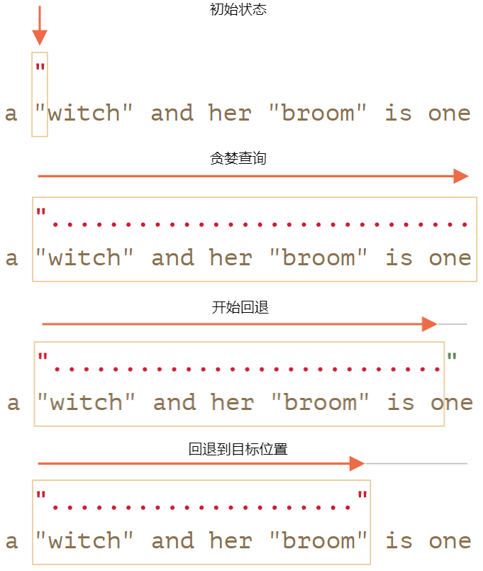
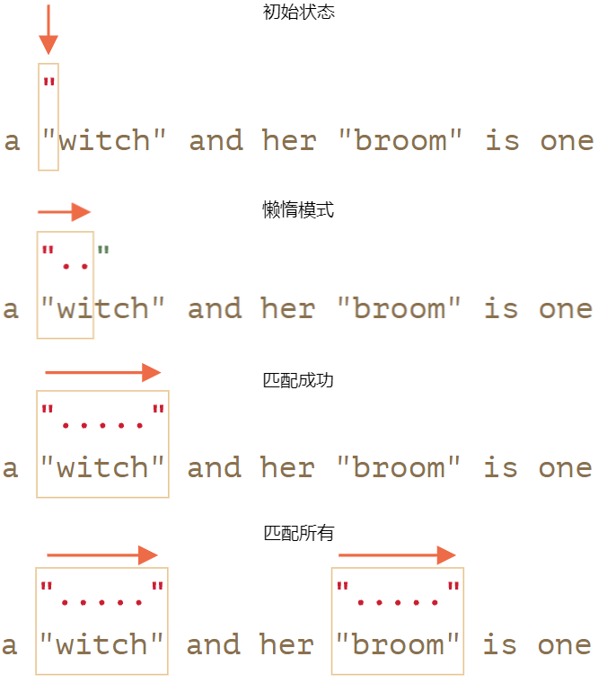
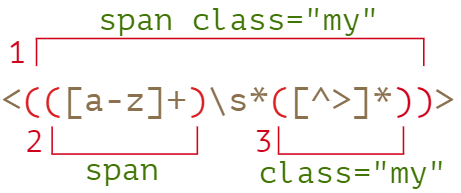

# 正则表达式入门
## 正则表达式基础

### 创建正则表达式

正则表达式分为两个部分：

- 模式pattern
- 修饰符flags

创建正则表达式的两种方式：

```js
// 正则表达式有两部分构成: 模式+修饰符
regexp = new RegExp("pattern", "flags");
regexp = /pattern/gmi;         // 伴随修饰符g、m和i
```

### 修饰符

- `i`：不区分大小写
- `g`：查找所有匹配项
  - 没有修饰符g则匹配首个

- `m`：多行模式
- `u`：完整的unicode支持
  - 使用u后4个字符长的字符会被处理成单个字符

- `s`：启用dotall模式，通过`.`匹配时候是否包含`\n`
- `y`：粘滞模式

### 字符类

- `\d`：0~9数字
- `\s`：空格
- `\w`：字母、数字、下划线（`_`）

::: tip
每一个字符类，都可以通过大写形式表示反向，比如\D表示**非0~9数字**
:::

- `\n`：换行符

- `.`：任何字符，除了换行符号`\n`都能匹配。

  - **注意是表示任何字符，而不是缺少字符**，必须有一个与之匹配，比如`/CS.4/.test("CS4")`返回false
  - 当修饰符带有s是就能匹配`\n`，比如`/CS.4/s.test("CS\n4")`返回true

- `\p`：Unicode属性

  - 字母（Letter） L:
    - 小写（lowercase） Ll
    - 修饰（modifier） Lm
    - 首字母大写（titlecase） Lt
    - 大写（uppercase） Lu
    - 其它（other） Lo

  - 数字（Number）N：

    - 十进制数字（decimal digit） Nd
    - 字母数字（letter number） Nl
    - 其它（other） No

  - 标点符号（Punctuation）P：

    - 链接符（connector） Pc
    - 横杠（dash） Pd
    - 起始引用号（initial quote）Pi
    - 结束引用号（final quote） Pf
    - 开（open） Ps
    - 闭（close） Pe
    - 其它（other） Po

  - 标记（Mark）M：

    - 间隔合并（spacing combining） Mc

    - 封闭（enclosing） Me

    - 非间隔（non-spacing） Mn

  - 符号（Symbol）S：

    - 货币（currency） Sc
    - 修饰（modifier） Sk
    - 数学（math） Sm
    - 其它（other） So

  - 分隔符（Separator）Z：

    - 行（line） Zl
    - 段落（paragraph） Zp
    - 空格（space） Zs

  - 其它（Other）C：

    - 控制符（control） Cc
    - 格式（format） Cf
    - 未分配（not assigned） Cn
    - 私有（private use） Co
    - 代理伪字符（surrogate） Cs

::: danger
为了使用`\p`，修饰符必须设置u
:::

比如需要小写字母，可以写成`\p{Ll}`，标点符号可以写作`\{P}`

## 匹配

### 锚点

- `^`：从头匹配
- `$`：从尾匹配
  - 完全匹配：`^……$`

::: tip
在多行模式下，`^`是匹配**每行**的开头，`$`是匹配**每行**的末尾
:::

```js
let str = `1st place: Winnie
2nd place: Piglet
33rd place: Eeyore`;

console.log(str.match(/\w+$/gim));
/**********************
[ 'Winnie', 'Piglet', 'Eeyore' ]
**********************/
```

### 集合和范围

集合：`[eao]`表示匹配`e、a、o`中任意一个

范围：`[0-9A-f]`表示匹配数字`0~9`或字母`A~F`

> 字符类是某些字符集的简写：
> 
> - `\d`—— 和 `[0-9]` 相同
> - `\w` —— 和 `[a-zA-Z0-9_]` 相同
> - `\s` —— 和 `[\t\n\v\f\r ]` 外加少量罕见的 unicode 空格字符相同

排除范围：`[^0-9]`：匹配任何非数字字符

### 量词

- `{3,5}`：3~5位
  - `{5}`：5位，确切的位数

- `+`：1个或多个
- `?`：0个或1个
- `*`：0个或多个

### 两种模式

贪婪模式：量词尽可能地重复多次，然后回退。

启用方式：`.+`

```js
let reg = /".+"/g;
let str = 'a "witch" and her "broom" is one';
console.log(str.match(reg));
/**********************
[ '"witch" and her "broom"' ]
**********************/
```



懒惰模式：重复最少次数查找匹配串

启用方式：`.+?`

```js
let reg = /".+?"/g;
let str = 'a "witch" and her "broom" is one';
console.log(str.match(reg));
/**********************
[ '"witch"', '"broom"' ]
**********************/
```

::: danger
懒惰模式只能通过在量词后带`?`启用
:::



## 高级部分

### 组

组的两个作用：

- 允许将匹配的一部分作为结果数组中的单独项
- 如果把量词放在括号后，那么括号内部视作一个整体

1.捕获组和嵌套组：`(()())`

```js
let str = '<span class="my">';
let regexp = /<(([a-z]+)\s*([^>]*))>/;
let result = str.match(regexp);
console.log(result);
/*******************
[
  '<span class="my">',
  'span class="my"',
  'span',
  'class="my"',
  index: 0,
  input: '<span class="my">',
  groups: undefined
]
*******************/
```

result[0]匹配是整个正则式，result[1]、result[2]、result[3]匹配都是组



2.可选组：`()?`

字面意思，该组可有可无，没有的话该处的匹配结果为undefined

```js
const str1 = 'Hello,Alice';
const str2 = 'Heo';
const regexp = /He(ll)?o/;

console.log(str1.match(regexp));
console.log(str2.match(regexp));
/*************
[ 'Hello', 'll', index: 0, input: 'Hello,Alice', groups: undefined ]
[ 'Heo', undefined, index: 0, input: 'Heo', groups: undefined ]
*************/
```

3.命名组：`?<name>`

可以给某些组定义名字，最终会将匹配结果构成groups对象，可通过groups.year、groups.month、groups.day访问

```js
let dateRegexp = /(?<year>[0-9]{4})-(?<month>[0-9]{2})-(?<day>[0-9]{2})/g;
let str = "1939-09-01到1945-09-02期间发生了第二次世界大战";
let results = str.matchAll(dateRegexp);
console.log(Array.from(results));
/*************
[
  [
    '1939-09-01',
    '1939',
    '09',
    '01',
    index: 0,
    input: '1939-09-01到1945-09-02期间发生了第二次世界大战',
    groups: [Object: null prototype] { year: '1939', month: '09', day: '01' }
  ],
  [
    '1945-09-02',
    '1945',
    '09',
    '02',
    index: 11,
    input: '1939-09-01到1945-09-02期间发生了第二次世界大战',
    groups: [Object: null prototype] { year: '1945', month: '09', day: '02' }
  ]
]
*************/
```

4.非捕获组：`?:`

表示该组不出现在结果集中

```js
const str1 = 'Hello,';
const str2 = 'Heeeo';
const regexp = /He(?:ll)o/;

// 匹配成功，由于是非捕获组，不出现在结果集中
console.log(str1.match(regexp));
// 匹配失败，返回null
console.log(str2.match(regexp));
/*************
[ 'Hello', index: 0, input: 'Hello,', groups: undefined ]
null
*************/
```

5.捕获分组的引用

编号引用：`\1`引用第一分组，`\2`引用第二分组，依次类推

```js
let str = `He said: "She's the one!".`;
let regexp = /(['"])(.*?)\1/g;
alert(str.match(regexp)); // "She's the one!"
```

命名引用：`\k<name>`

```js
let str = `He said: "She's the one!".`;
let regexp = /(?<quote>['"])(.*?)\k<quote>/g;
alert(str.match(regexp)); // "She's the one!"
```
## JS中使用正则表达式

1.`str.match(regexp)`

- 无g标记：以**类数组**的返回第一个匹配项，类数组中包含分组、index（匹配位置）、input（输入字符串）。可以通过`result[0]`、`result[1]`的形式获取字符串
- 有g标记：以**字符串数组**返回匹配的所有项
- 没有匹配项，返回null

无g标记：

```js
let str = "I love JavaScript.But Java is my best friend!";
let regexp = /Java(Script)?/;
let result = str.match(regexp);
console.log(result);
/********************
[
  'JavaScript',
  'Script',
  index: 7,
  input: 'I love JavaScript.But Java is my best friend!',
  groups: undefined
]
********************/
```

有g标记：

```js
let str = "I love JavaScript.But Java is my best friend!";
let regexp = /Java(Script)?/g;
let result = str.match(regexp);
console.log(result);
/********************
[ 'JavaScript', 'Java' ]
********************/
```

2.`str.matchAll(regexp)`：返回**可迭代对象**，可通过下面两种方式解析：

- 可通过`Array.from(resultObj)`将可迭代对象转换为对象数组
- 通过`for...of`循环匹配

> 使用`matchAll`的话，需要保证正则表达式修饰符含有`g`

```js
let str = "I love JavaScript.But Java is my best friend!";
let regexp = /Java(Script)?/g;
let result = str.matchAll(regexp);
console.log(Array.from(result));
/********************
[
  [
    'JavaScript',
    'Script',
    index: 7,
    input: 'I love JavaScript.But Java is my best friend!',
    groups: undefined
  ],
  [
    'Java',
    undefined,
    index: 22,
    input: 'I love JavaScript.But Java is my best friend!',
    groups: undefined
  ]
]
********************/
```

3.`str.split(regexp|substr)`：分割

```js
const str = 'get-good,my-hhh';
const regexp = /,|-/g;
console.log(str.split(regexp));  // [ 'get', 'good', 'my', 'hhh' ]
```

4.`str.search(regexp)` 返回**第一个匹配项的位置**，如果未找到，则返回 `-1`

5.`str.replace(str|regexp, str|func)`：替换

- 参数一：识别串
  - 字符串：仅匹配第一项
  - 正则表达式：一般匹配第一项，带上g后是匹配所有
- 参数二：替换串
  - 字符串，也可以使用特殊字符
  - 回调函数：三个参数为`func(str, offset, input)`

特殊字符有如下：

| 符号 | 替换字符串中的操作 |
| --- | --- |
| `$&` | 插入整个匹配项 |
| $` | 插入字符串中匹配项之前的字符串部分 |
| `$'` | 插入字符串中匹配项之后的字符串部分 |
| `$n` | 如果n是一个1-2位的数字，则插入第n个分组的内容 |
| `$<name>` | 插入带有给定name的括号内的内容 |
| `$$` | 	插入字符$ |

```js
let str = "John Smith";
// 交换名字和姓氏
alert(str.replace(/(john) (smith)/i, '$2, $1')) // Smith, John
```
6.`regexp.test(str)` 查找匹配项，然后返回 `true/false` 表示是否存在。

7.`regexp.exec(str)`：返回第一个匹配项（类数组对象，可通过result[0]获取匹配的字符串），和match很像。

默认使用，获取第一个匹配项：

```js
let str = "I love JavaScript.But Java is my best friend!";
let regexp = /Java(Script)?/g;
let result = regexp.exec(str);
console.log(result);
/********************
[
  'JavaScript',
  'Script',
  index: 7,
  input: 'I love JavaScript.But Java is my best friend!',
  groups: undefined
]
********************/
```

通过循环方式，获取所有匹配项：

```js
let str = "I love JavaScript.But Java is my best friend!";
let regexp = /Java(Script)?/g;
while (result = regexp.exec(str)) {
  console.log(result);
}
/********************
[
  'JavaScript',
  'Script',
  index: 7,
  input: 'I love JavaScript.But Java is my best friend!',
  groups: undefined
]
[
  'Java',
  undefined,
  index: 22,
  input: 'I love JavaScript.But Java is my best friend!',
  groups: undefined
]
********************/
```
