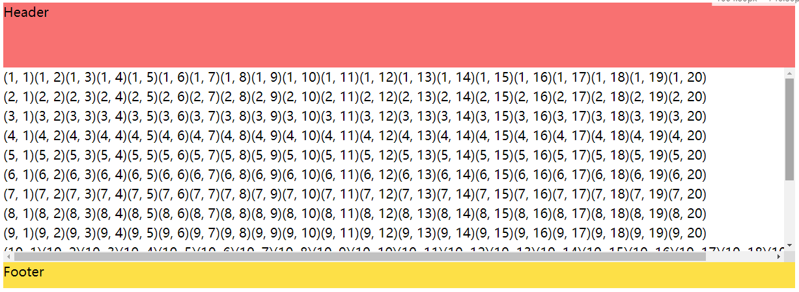

# 滚动、距离和坐标

## 滚动

### 滚动条出现的条件

垂直方向：

- 内容尺寸超出了容器尺寸的额限制
- 设置`overflow-y: auto`或`overflow-y: scroll`相关属性

水平方向：

- 内容尺寸超出了容器尺寸的额限制
- 设置`overflow-x: auto`或`overflow-x: scroll`相关属性
- 不折行
    - 容器不允许折行`whitespace-nowrap`
    - 容器元素为行内元素（inline、inline-block）

> html、textarea等元素自带`overflow: auto`功能

```vue
<template>
  <!-- 顶部和底部固定，中间可以任意方向滚动 -->
  <div class="bg-white h-96 flex flex-col p-4">
    <header class="bg-red-400 h-20 flex-0">Header</header>
    <!-- overflow针对的是滚动容器 -->
    <div class="flex-1 overflow-auto flex flex-col">
      <div v-for="n of 15" :key="n" class="whitespace-nowrap">
        <div v-for="m of 20" :key="m" class="inline-block">
          {{ `(${n}, ${m})` }}
        </div>
      </div>
    </div>
    <footer class="bg-yellow-300 h-8">Footer</footer>
  </div>
</template>
```



### 滚动事件

> 先看坐标部分

## 坐标和距离

事件：

- clientX、clientY
- layerX、layerY
- movementX、movementY
- offsetX、offsetY
- pageX、pageY
- screenX、screenY
- tiltX、tiltY
- width、height
- x、y

元素：

- clientHeight、clientLeft、clientTop、clientWidth
- offsetHeight、offsetLeft、offsetTop、offsetWidth
  - offsetParent
- scrollHeight、scrollLeft、scrollTop、scrollWidth
- getBoundingClientRect()
- style
  - left、right、top、bottom
  - height、width
  - x、y
  - overflowX、overflowY
  - translate

鼠标坐标：

### 元素坐标

#### 实验示例

对于如下示例：

```vue
<script setup lang="ts">
import { reactive, ref, onMounted, onUpdated } from 'vue'
import type { Ref } from 'vue'
type ElementCoordinateAttributeInfoT = 'clientLeft' | 'clientTop' | 'clientWidth' | 'clientHeight'
  | 'offsetWidth' | 'offsetHeight' | 'offsetLeft' | 'offsetTop' | 'offsetParent'
  | 'scrollWidth' | 'scrollHeight' | 'scrollLeft' | 'scrollTop'
const elementAttributeInfo: Array<ElementCoordinateAttributeInfoT> = reactive([
  'clientLeft' , 'clientTop' , 'clientWidth' , 'clientHeight',
  'offsetWidth' , 'offsetHeight' ,'offsetLeft' ,'offsetTop' , 'offsetParent',
  'scrollWidth', 'scrollHeight' , 'scrollLeft' , 'scrollTop'
])
const coordinateInfo: Ref<Partial<Record<ElementCoordinateAttributeInfoT, number | null>>> = ref({})
const coordinateBoxRef = ref(null)
onMounted(() => {
  elementAttributeInfo.forEach(e => {
    coordinateInfo.value[e] = coordinateBoxRef.value && coordinateBoxRef.value[e]
  })
})
</script>

<template>
  <div>
    <div ref="coordinateBoxRef" class="w-96 h-96 overflow-auto border-[24px] border-pink-400 p-8 absolute left-8 top-12">
      <h2 class="font-bold text-xl">Centering Matrix</h2>
      <div v-for="n of 20" :key="n" class="whitespace-nowrap">
        <div v-for="m of 10" :key="m" class="inline-block w-16">
          {{ `(${n}, ${m})` }}
        </div>
      </div>
    </div>
    <!-- 坐标结果 -->
    <div class="absolute right-8 top-12 border-cyan-500 border-4 rounded-md w-fit h-fit p-4">
      <p v-for="(value, key) of coordinateInfo" :key="value">
        <span class=" font-bold">{{ key }}</span><span>: {{value}}</span>
      </p>
    </div>
  </div>
</template>
```

可以得到整个滚动盒子相关CSS属性：

- width: 384px
- height: 384px
- padding: 32px
- border: 24px
- 盒子内容
  - content-width: 384-(32+24)*2=272px
  - content-height: 384-(32+24)*2=272px
- left: 32px
- top: 48px
- inline-block
  - 宽度: 64px
  - 高度: 24px
- 滚动条宽度: 14px

::: tip
滚动条宽度在不同浏览器中是不同的，即使在同一浏览器缩放比例不同，滚动条宽度也不同。
:::

可以得到整个滚动盒子相关几何属性：

- clientLeft: 24px
- clientTop: 24px
- clientWidth: 322px
- clientHeight: 322px
- offsetWidth: 384px
- offsetHeight: 384px
- offsetLeft: 32px
- offsetTop: 48px
- offsetParent: "[object HTMLBodyElement]"
- scrollWidth: 672px
- scrollHeight: 572px
- scrollLeft: 0
- scrollTop: 0

对此可以针对相关几何属性进行标注，如图所示：

为了方便计算，设定该图的左上角恰恰是浏览器视图的左上角，整体是absolute，通过left和top位置到这里的。


#### offset系列

offsetParent：目标元素最接近的祖先，在浏览器渲染期间，它被用于计算坐标。

能成为祖先可能为：

1. position为absolute、relative、fixed或sticky的元素
2. table元素（不常用）
3. body元素

在如下情况下，offsetParent的值为null：

1. 对于未显示的元素（`display: none`或不在文档中）
2. body和html
3. 带有`position: fixed`的元素

::: warning
offsetParent是否成为祖先和offsetParent是否为null是两回事
:::

offsetLeft/offsetTop：相对于offsetParent左上角的x/y坐标

offsetWidth/offsetHeight：元素外部的width/height，包括边框

因此可得：`offsetWidth = content-width + padding-left + padding-right + border-left + border-right + scroll-bar`，offsetHeight同理。

::: warning
**对于未显示的元素，几何属性为null。**

如果一个元素具有`display: none`或不在文档中，则所有几何属性均为0，offsetParent为null。
:::
#### client系列

clientLeft/clientTop：内测与外侧的相对坐标。而内外分界就是边框，因此**绝大多数情况下**也可以看作左边框宽度/上边框高度。

clientWidth/clientHeight：`offsetWidth = content-width + padding-left + padding-right`。注意是不包括滚动条宽度的。

如果没有padding，那么clientWidth/clientHeight代表的就是内容区域。

#### scroll系列

scrollWidth/Height：内容区域的完整内部宽高。如果没有滚动，则等于clientWidth/clientHeight。

scrollLeft/scrollTop：元素的隐藏、滚动部分的宽高，代表了已经滚动了多少。

::: warning
大多数集合属性是只读的，但是scrollLeft/scrollTop是可以修改的，并且浏览器会滚动改元素。
:::

::: danger
不要从CSS中读取width/height

1. CSS读取的width/height可能为auto、fit-content等等，而我们需要的是一个确切的值，就是多小像素，这时候CSS宽高没啥用。
2. 不同浏览器的使用`getComputedStyle(elem).width`时返回的宽度不同，Firefox返回CSS宽度，其他浏览器返回真实宽度。
:::

### 窗口大小

#### 窗口宽高

- `document.documentElement.clientWidth`
- `document.documentElement.clientHeight`

::: danger
不是`window.innerWidth`和`window.innerHeight`。通过document获取的是不算入滚动条空间的，即**用于内容的文档可见部分的宽高。**
:::

#### 文档宽高

理论上讲`document.documentElement`包围所有内容，通过`documentElement.scroll*`来测量文档的完整大小。但在该元素上，如果没有滚动条，`documentElement.scrollHeight`甚至可能小于 `documentElement.clientHeight`！因此为了可靠获取完整文档高度，应该采用下面这些属性的最大值：

```js
const scrollHeight = Math.max(
  document.body.scrollHeight, document.documentElement.scrollHeight,
  document.body.offsetHeight, document.documentElement.offsetHeight,
  document.body.clientHeight, document.documentElement.clientHeight
);
```
#### 获取滚动

大多数浏览器可以通过`document.documentElement.scrollLeft/scrollTop`获取滚动，但一些较旧的基于WebKit浏览器不行，比如Safari，应使用`document.body`。

当然，**最好的方式是通过`window.pageYOffset`和`window.pageXOffset`获取**，这些属性是只读的。

由于历史原因，也可以通过`window.scrollX `和`window.scrollY `获取，它们与`window.pageYOffset`和`window.pageXOffset`获取的相同。

#### 触发滚动

- 更改`document.documentElement.scrollTop/scrollLeft`来滚动常规元素
- 通过特殊方法
  - `window.scrollBy(x, y)`：滚动至相对于当前的(x, y)位置。例如，`scrollBy(0, 10)`会将页面向下滚动10px。
  - `window.scrollTo(pageX, pageY)`：滚动至绝对坐标。例如：`scrollTo(0, 0)`会将页面滚动到最开始。
  - `elem.scrollIntoView(top)`：滚动到使elem可见
    - top为true：页面滚动，elem上边缘将与窗口顶部对齐。
    - top为false：页面滚动，elem底部边缘将与窗口底部对齐。
  - `document.body.style.overflow = "hidden"`：冻结页面滚动

### 事件坐标